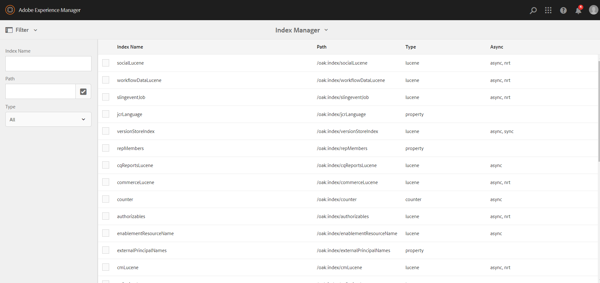

# Operations-dashboard {#operations-dashboard}

## Inleiding {#introduction}

Het vluchthandboek in AEM 6 helpt systeembeheerders de AEM systeemgezondheid in een oogopslag te controleren. Het verstrekt ook auto-geproduceerde diagnoseinformatie over relevante aspecten van AEM en laat u vormen en op zichzelf staande onderhoudsautomatisering in werking stellen om projectverrichtingen en steungevallen beduidend te verminderen. Het vectordashboard kan worden uitgebreid met aangepaste gezondheidscontroles en onderhoudstaken. Verder kunnen gegevens van het Operations-dashboard via JMX worden benaderd via externe bewakingstools.

**het Dashboard van Verrichtingen:**

* Is een één-klik systeemstatus om verrichtingenafdelingen te helpen efficiency bereiken
* Verstrekt systeemgezondheidsoverzicht in één enkele, gecentraliseerde plaats
* Minder tijd om problemen te zoeken, te analyseren en op te lossen
* Biedt zelfstandige onderhoudsautomatisering die de kosten van projectbewerkingen aanzienlijk helpt verlagen

Het kan door naar **Hulpmiddelen** te gaan worden betreden - **Verrichtingen** van het AEM Welkome scherm.

>[!NOTE]
>
>Om tot het Dashboard van Verrichtingen toegang te hebben, moet de het programma geopende gebruiker deel van de &quot;Exploitanten&quot;gebruikersgroep uitmaken. Voor meer info, zie documentatie over [ Gebruiker, Groep, en Recht Beleid van de Toegang ](/help/sites-administering/user-group-ac-admin.md).

## Gezondheidsrapportage {#health-reports}

Het systeem van het Gezondheidsrapport verstrekt informatie over de gezondheid van een AEM instantie door Sling Health Checks. U kunt deze bewerking uitvoeren met behulp van OSGI-, JMX- en HTTP-aanvragen (in de vorm van JSON) of via de aanraakinterface. Het biedt metingen en drempel van bepaalde configureerbare tellers aan en biedt soms informatie over hoe te om de kwestie op te lossen.

Het heeft verschillende functies, die hieronder worden beschreven.

## Gezondheidscontroles {#health-checks}

De **Rapporten van de Gezondheid** zijn een systeem van kaarten die op goede of slechte gezondheid over een specifiek productgebied wijzen. Deze kaarten zijn visualisaties van de Sling Health Checks, die gegevens van JMX en andere bronnen samenvoegen en verwerkte informatie opnieuw blootstellen als MBans. Deze MBeans kunnen ook in de [ JMX Webconsole ](/help/sites-administering/jmx-console.md), onder het **org.apache.sling.health check** domein worden geïnspecteerd.

De interface van de Rapporten van de Gezondheid kan door **Hulpmiddelen** worden betreden - **Verrichtingen** - **het menu van de Gezondheidsrapporten** op het AEM Welkomstscherm, of direct door volgende URL:

`https://<serveraddress>:port/libs/granite/operations/content/healthreports/healthreportlist.html`


Het kaartsysteem stelt drie mogelijke staten bloot: **O.K.**, **WAARSCHUWING** en **KRITIEK**. De staten zijn het resultaat van regels en drempels, die kunnen worden gevormd door de muis over de kaart te bewegen en dan het tandwielpictogram in de actiebar te klikken:


### Typen health check {#health-check-types}

Er zijn twee soorten gezondheidscontroles in AEM 6:

1. Individuele gezondheidscontroles
1. Samengestelde gezondheidscontroles

Een **Individuele Controle van de Gezondheid** is één enkele gezondheidscontrole die aan een statuskaart beantwoordt. Individuele gezondheidscontroles kunnen worden geconfigureerd met regels of drempelwaarden en kunnen een of meer tips en koppelingen bevatten om geïdentificeerde gezondheidsproblemen op te lossen. Neem de controle van de Fouten van het Logboek als voorbeeld: als er FOUT ingangen in de instantielogboeken zijn, vind hen op de detailspagina van de gezondheidscontrole. Boven aan de pagina ziet u een koppeling naar de analyse van het logboekbericht in de sectie Diagnosis Tools, waarmee u deze fouten gedetailleerder kunt analyseren en de loggers opnieuw kunt configureren.

A **Samengestelde Controle van de Gezondheid** is een controle die informatie van verscheidene individuele controles samenvoegt.

De samengestelde gezondheidscontroles worden gevormd met de hulp van **filtermarkeringen**. In wezen worden alle enkelvoudige controles met dezelfde filtertag gegroepeerd als een samengestelde health check. Een Composite Health Check heeft alleen de status OK als alle enkelvoudige controles die het samenvoegt ook de status OK hebben.

### Hoe gezondheidscontroles te maken {#how-to-create-health-checks}

In het vectordashboard kunt u het resultaat van zowel individuele als samengestelde Health Checks visualiseren.

### Een individuele health check maken {#creating-an-individual-health-check}

Het maken van een individuele Health Check omvat twee stappen: het implementeren van een Sling Health Check en het toevoegen van een item voor de Health Check in de configuratieknooppunten van het dashboard.

1. Als u een Sling Health Check wilt maken, maakt u een OSGI-component die de Sling HealthCheck-interface implementeert. Voeg deze component in een bundel toe. De eigenschappen van de component identificeren de Health Check volledig. Nadat de component is geïnstalleerd, wordt er automatisch een JMX MBean voor de Health Check gemaakt. Zie de [ Verschuivende Documentatie van de Controle van de Gezondheid ](https://sling.apache.org/documentation/bundles/sling-health-check-tool.html) voor meer informatie.

   Voorbeeld van een component Sling Health Check, geschreven met aantekeningen van de component OSGI-service:

   ```java
   @Component(service = HealthCheck.class,
   property = {
       HealthCheck.NAME + "=Example Check",
       HealthCheck.TAGS + "=example",
       HealthCheck.TAGS + "=test",
       HealthCheck.MBEAN_NAME + "=exampleHealthCheckMBean"
   })
    public class ExampleHealthCheck implements HealthCheck {
       @Override
       public Result execute() {
           // health check code
       }
    }
   ```

   >[!NOTE]
   >
   >De eigenschap `MBEAN_NAME` definieert de naam van het domein dat voor deze health check wordt gegenereerd.

1. Na het creëren van een Controle van de Gezondheid, moet een nieuw configuratieknoop worden gecreeerd om het in de interface van het Dashboard van Verrichtingen toegankelijk te maken. Voor deze stap is het nodig om de JMX Mbean-naam van de Health Check (de eigenschap `MBEAN_NAME` ) te weten. Om een configuratie voor de Controle van de Gezondheid tot stand te brengen, open CRXDE en voeg een knoop (van type **niet toe:ongestructureerde**) onder de volgende weg: `/apps/settings/granite/operations/hc`

   De volgende eigenschappen moeten op het nieuwe knooppunt worden ingesteld:

   * **Naam:** `sling:resourceType`

      * **Type:** `String`
      * **Waarde:** `granite/operations/components/mbean`

   * **Naam:** `resource`

      * **Type:** `String`
      * **Waarde:** `/system/sling/monitoring/mbeans/org/apache/sling/healthcheck/HealthCheck/exampleHealthCheck`

   >[!NOTE]
   >
   >Het bovenliggende bronnenpad wordt als volgt gemaakt: als de naam van de boon van uw Health Check &quot;test&quot; is, voegt u &quot;test&quot; toe aan het einde van het pad `/system/sling/monitoring/mbeans/org/apache/sling/healthcheck/HealthCheck`
   >
   >Het uiteindelijke pad is dus het volgende:
   >
   >`/system/sling/monitoring/mbeans/org/apache/sling/healthcheck/HealthCheck/test`

   >[!NOTE]
   >
   >Zorg ervoor dat voor het `/apps/settings/granite/operations/hc` -pad de volgende eigenschappen zijn ingesteld op true:
   >
   >
   >`sling:configCollectionInherit`
   >
   >`sling:configPropertyInherit`
   >
   >
   >Dit proces vertelt de configuratiemanager om de nieuwe configuraties met bestaande configuraties van `/libs` samen te voegen.

### Een samengestelde health check maken {#creating-a-composite-health-check}

Een Composite Health Check heeft als taak verschillende afzonderlijke Health Checks samen te voegen en een reeks gemeenschappelijke kenmerken te delen. Zo groepeert de veiligheidssamengestelde health check alle afzonderlijke gezondheidscontroles die beveiligingsgerelateerde controles uitvoeren. De eerste stap om een samengestelde controle tot stand te brengen is een configuratie toe te voegen OSGI. Opdat het in het Dashboard van Verrichtingen moet worden getoond, moet een nieuw configuratieknooppunt op de zelfde manier worden toegevoegd zoals een eenvoudige controle.

1. Ga naar de Manager van de Configuratie van het Web in de Console OSGI. Toegang `https://serveraddress:port/system/console/configMgr`
1. Onderzoek naar de ingang genoemd **Apache Sling Composite Health Check**. Nadat u het vindt, merk op dat er twee configuraties reeds beschikbaar zijn: voor de Controles van het Systeem en andere voor de Controles van de Veiligheid.
1. Creeer een configuratie door &quot;+&quot;knoop op de rechterkant van de configuratie te drukken. Er wordt een nieuw venster weergegeven, zoals hieronder wordt getoond:

   

1. Een configuratie maken en opslaan. Een boon wordt gecreeerd met de nieuwe configuratie.

   Het doel van elk configuratiebezit is als volgt:

   * **Naam (hc.name):** De naam van de Samengestelde Controle van de Gezondheid. Een betekenisvolle naam wordt aanbevolen.
   * **Markeringen (hc.tags):** De markeringen voor deze Controle van de Gezondheid. Als deze samengestelde health check bedoeld is om deel uit te maken van een andere samengestelde health check (bijvoorbeeld in een hiërarchie van gezondheidscontroles), voegt u de codes toe waarop deze samenstelling betrekking heeft.
   * **MBean Naam (hc.mbean.name):** De naam van de boon die aan JMX MBean van deze samengestelde gezondheidscontrole wordt gegeven.
   * **de Markeringen van de Filter (filter.tags):** het bezit dat voor samengestelde gezondheidscontroles specifiek is. Deze tags worden samengevoegd door de samenstelling. De samengestelde health check aggregeert onder de groep alle gezondheidscontroles waarvoor een tag is gebruikt die overeenkomt met een van de filtertags van deze samenstelling. Bijvoorbeeld, voegt een samengestelde gezondheidscontrole die de filtermarkeringen **heeft test** en **controle**, alle individuele en samengestelde gezondheidscontroles samen die om het even welke **test** en **controle** markeringen in hun markeringsbezit ( `hc.tags`) hebben.

   >[!NOTE]
   >
   >Voor elke nieuwe configuratie van de Apache Sling Composite Health Check wordt een nieuwe JMX-maboon gemaakt.**

1. Tot slot moet de ingang van de samengestelde gezondheidscontrole die is gecreeerd in de de configuratieknopen van het Dashboard van Verrichtingen worden toegevoegd. De procedure is het zelfde als met individuele gezondheidscontroles: een knoop van type **niet:ongestructureerde** moet onder `/apps/settings/granite/operations/hc` worden gecreeerd. Het middelbezit van de knoop wordt bepaald door de waarde van **hc.gemiddelde.name** in de configuratie OSGI.

   Bijvoorbeeld, als u een configuratie creeerde en **hc.bean.name** waarde aan **diskusage** plaatst, kijken de configuratieknopen als het volgende:

   * **Naam:** `Composite Health Check`

      * **Type:** `nt:unstructured`

   Met de volgende eigenschappen:

   * **Naam:** `sling:resourceType`

      * **Type:** `String`
      * **Waarde:** `granite/operations/components/mbean`

   * **Naam:** `resource`

      * **Type:** `String`
      * **Waarde:** `/system/sling/monitoring/mbeans/org/apache/sling/healthcheck/HealthCheck/diskusage`

   >[!NOTE]
   >
   >Als u individuele gezondheidscontroles creeert die logisch gezien onder een samengestelde controle behoren die reeds in het dashboard door gebrek aanwezig is, worden zij automatisch gevangen en gegroepeerd onder de respectieve samengestelde controle. Als dusdanig, is er geen behoefte om een configuratieknoop voor deze controles tot stand te brengen.
   >
   >Bijvoorbeeld, als u een individuele veiligheidsgezondheidscontrole creeert, wijs het &quot;**veiligheid**&quot;markering toe, en het is geïnstalleerd. Deze wordt automatisch weergegeven onder de samengestelde controle Beveiligingscontroles in het vluchthandboek.

### Aan AEM verstrekte gezondheidscontroles {#health-checks-provided-with-aem}

<table>
 <tbody>
  <tr>
   <td><strong>zHealthcheck-naam</strong></td>
   <td><strong>Beschrijving</strong></td>
  </tr>
  <tr>
   <td>Query-prestaties</td>
   <td><p>Deze gezondheidscontrole werd vereenvoudigd <strong> in AEM 6.4 </strong>, en controleert nu onlangs refactored <code>Oak QueryStats</code> MBean, meer specifiek het <code>SlowQueries </code> attribuut. Als de statistieken om het even welke langzame vragen bevatten, dan keert de gezondheidscontrole een waarschuwing terug. Anders, keert het de O.K. status terug.<br /> </p> <p>MBean voor deze gezondheidscontrole is <a href="http://localhost:4502/system/console/jmx/org.apache.sling.healthcheck%3Aname%3DqueriesStatus%2Ctype%3DHealthCheck"> org.apache.sling.health check:name=queryStatus, type=HealthCheck </a>.</p> </td>
  </tr>
  <tr>
   <td>Lengte van waarnemingswachtrij</td>
   <td><p>De Lengte van de Rij van de waarneming herhaalt over alle Listeners van de Gebeurtenis en Achtergrondwaarnemers, vergelijkt hun <code>queueSize </code> met hun <code>maxQueueSize</code> en:</p>
    <ul>
     <li>Hiermee wordt de status Kritiek geretourneerd als de waarde <code>queueSize</code> de waarde <code>maxQueueSize</code> overschrijdt (dat wil zeggen wanneer gebeurtenissen worden geannuleerd)</li>
     <li>retourneert een waarschuwing als de <code>queueSize</code> -waarde zich boven <code>maxQueueSize * WARN_THRESHOLD</code> bevindt (de standaardwaarde is 0,75) </li>
    </ul> <p>De maximumlengte van elke rij komt uit afzonderlijke configuraties (Oak en AEM), en is niet configureerbaar van deze gezondheidscontrole. MBean voor deze gezondheidscontrole is <a href="http://localhost:4502/system/console/jmx/org.apache.sling.healthcheck%3Aname%3DObservationQueueLengthHealthCheck%2Ctype%3DHealthCheck"> org.apache.sling.health check:name=ObservationQueueLengthHealthCheck, type=HealthCheck </a>.</p> </td>
  </tr>
  <tr>
   <td>Transversale begrenzingen voor query</td>
   <td><p>Met Zoektraversal Limits wordt de eigenschap <code>QueryEngineSettings</code> MBean gecontroleerd, meer bepaald de attributen <code>LimitInMemory</code> en <code>LimitReads</code> , en wordt de volgende status geretourneerd:</p>
    <ul>
     <li>retourneert de waarschuwingsstatus als een van de limieten gelijk is aan of hoger is dan de <code>Integer.MAX_VALUE</code></li>
     <li>retourneert de waarschuwingsstatus als een van de limieten lager is dan 10000 (de aanbevolen instelling van Oak)</li>
     <li>retourneert de status Kritiek als <code>QueryEngineSettings</code> of een van de limieten niet kan worden opgehaald</li>
    </ul> <p>De boon voor deze gezondheidscontrole is <a href="http://localhost:4502/system/console/jmx/org.apache.sling.healthcheck%3Aname%3DqueryTraversalLimitsBundle%2Ctype%3DHealthCheck"> org.apache.sling.health check:name=queryTraversalLimitsBundle, type=HealthCheck </a>.</p> </td>
  </tr>
  <tr>
   <td>Gesynchroniseerde klokken</td>
   <td><p>Deze controle is relevant slechts voor <a href="https://github.com/apache/sling-old-svn-mirror/blob/4df9ab2d6592422889c71fa13afd453a10a5a626/bundles/extensions/discovery/oak/src/main/java/org/apache/sling/discovery/oak/SynchronizedClocksHealthCheck.java"> document nodestore clusters </a>. De volgende status wordt geretourneerd:</p>
    <ul>
     <li>retourneert de waarschuwingsstatus wanneer de instantieklokken niet meer synchroon zijn en een vooraf gedefinieerde lage drempel overschrijden</li>
     <li>Hiermee wordt de status Kritiek geretourneerd wanneer de instantieklokken niet meer synchroon zijn en een vooraf gedefinieerde hoge drempel overschrijden</li>
    </ul> <p>De boon voor deze gezondheidscontrole is <a href="http://localhost:4502/system/console/jmx/org.apache.sling.healthcheck%3Aname%3DslingDiscoveryOakSynchronizedClocks%2Ctype%3DHealthCheck"> org.apache.sling.health check:name=slingDiscoveryOakSynchronizedClocks, type=HealthCheck </a>.</p> </td>
  </tr>
  <tr>
   <td>Asynchrone indexen</td>
   <td><p>De asynchrone controle van indexen:</p>
    <ul>
     <li>Hiermee wordt de status Kritiek geretourneerd als ten minste één indexstrook mislukt</li>
     <li>controleert <code>lastIndexedTime</code> voor alle indexerende wegen en:
      <ul>
       <li>Hiermee wordt een kritieke status geretourneerd als deze meer dan twee uur geleden is </li>
       <li>retourneert een waarschuwingsstatus als deze tussen 2 uur en 45 minuten geleden ligt </li>
       <li>Hiermee wordt de status OK geretourneerd als deze minder dan 45 minuten geleden is </li>
      </ul> </li>
     <li>als aan geen van deze voorwaarden is voldaan, wordt de status OK geretourneerd</li>
    </ul> <p>Zowel zijn de Kritieke als de statusdrempels van de Waarschuwing configureerbaar. De boon voor deze gezondheidscontrole is <a href="http://localhost:4502/system/console/jmx/org.apache.sling.healthcheck%3Aname%3DasyncIndexHealthCheck%2Ctype%3DHealthCheck"> org.apache.sling.health check:name=asyncIndexHealthCheck, type=HealthCheck </a>.</p> <p><strong> Nota: </strong> Deze gezondheidscontrole is beschikbaar met AEM 6.4 en is gesteund aan AEM 6.3.0.1.</p> </td>
  </tr>
  <tr>
   <td>Grote Lucene-indexen</td>
   <td><p>Deze controle gebruikt de gegevens die door <code>Lucene Index Statistics</code> MBean worden blootgesteld om grote indexen en winst te identificeren:</p>
    <ul>
     <li>een waarschuwingsstatus als er een index is met meer dan 1 miljard documenten</li>
     <li>een kritieke status als er een index met meer dan 1,5 miljard documenten is</li>
    </ul> <p>De drempels zijn configureerbaar en MBean voor de gezondheidscontrole is <a href="http://localhost:4502/system/console/jmx/org.apache.sling.healthcheck%3Aname%3DlargeIndexHealthCheck%2Ctype%3DHealthCheck"> org.apache.sling.health check:name=largeIndexHealthCheck, type=HealthCheck.</a></p> <p><strong> Nota: </strong> deze controle is beschikbaar met AEM 6.4 en is teruggezet naar AEM 6.3.2.0.</p> </td>
  </tr>
  <tr>
   <td>Systeemonderhoud</td>
   <td><p>Het Onderhoud van het systeem is een samengestelde controle die O.K. terugkeert als alle onderhoudstaken zoals gevormd lopen. Houd er rekening mee dat:</p>
    <ul>
     <li>elke onderhoudstaak gaat vergezeld van een bijbehorende gezondheidscontrole</li>
     <li>als een taak niet aan een onderhoudsvenster wordt toegevoegd, keert zijn gezondheidscontrole Kritiek terug</li>
     <li>de onderhoudstaken van het Controlelogboek en van de Wissen van het Werkschema vormen of anders hen verwijderen uit de onderhoudsvensters. Als verlaten unconfigured, ontbreken deze taken op de eerste geprobeerd looppas, zodat keert de controle van het Onderhoud van het Systeem de Kritieke status terug.</li>
     <li><strong> met AEM 6.4 </strong>, is er ook een controle voor de <a href="/help/sites-administering/operations-dashboard.md#automated-maintenance-tasks"> Buigmachine bindt de taak van het Onderhoud </a></li>
     <li>bij AEM 6.2 en lager, keert de controle van het systeemonderhoud een Status van de Waarschuwing onmiddellijk na opstarten terug omdat de taken nooit lopen. Vanaf 6.3 retourneren ze OK als het eerste onderhoudsvenster nog niet is bereikt.</li>
    </ul> <p>MBean voor deze gezondheidscontrole is <a href="http://localhost:4502/system/console/jmx/org.apache.sling.healthcheck%3Aname%3Dsystemchecks%2Ctype%3DHealthCheck"> org.apache.sling.health check:name=systemchecks, type=HealthCheck </a>.</p> </td>
  </tr>
  <tr>
   <td>Replicatiereeks</td>
   <td><p>Deze controle herhaalt over replicatieagenten en bekijkt hun rijen. Voor het punt bij de bovenkant van de rij, bekijkt de controle hoeveel keer de agent replicatie opnieuw probeerde. Als de agent replicatie meer dan de waarde van de parameter <code>numberOfRetriesAllowed</code> opnieuw probeerde, keert het een waarschuwing terug. De parameter <code>numberOfRetriesAllowed</code> kan worden geconfigureerd. </p> <p>MBean voor deze gezondheidscontrole is <a href="http://localhost:4502/system/console/jmx/org.apache.sling.healthcheck%3Aname%3DreplicationQueue%2Ctype%3DHealthCheck" target="_blank"> org.apache.sling.health check:name=replicationQueue, type=HealthCheck </a>.</p> </td>
  </tr>
  <tr>
   <td>Verkooptaken</td>
   <td>
    <div>
      Het verkopen van Banen controleert het aantal banen die in JobManager een rij vormen, vergelijkt het met
     <code>maxNumQueueJobs</code> drempel, en:
    </div>
    <ul>
     <li>Hiermee wordt Kritiek geretourneerd als er meer dan de <code>maxNumQueueJobs</code> in de wachtrij staan</li>
     <li>Geeft een Critical als er langdurige actieve banen zijn die ouder zijn dan 1 uur</li>
     <li>Geeft een Critical als er banen in de rij zijn, en de laatste gebeëindigde baantijd is ouder dan 1 uur</li>
    </ul> <p>Slechts is het maximumaantal een rij gevormde baanparameter configureerbaar en het heeft de standaardwaarde van 1000.</p> <p>MBean voor deze gezondheidscontrole is <a href="http://localhost:4502/system/console/jmx/org.apache.sling.healthcheck%3Aname%3DslingJobs%2Ctype%3DHealthCheck" target="_blank"> org.apache.sling.health check:name=slingJobs, type=HealthCheck </a>.</p> </td>
  </tr>
  <tr>
   <td>Prestaties aanvragen</td>
   <td><p>Deze controle bekijkt <code>granite.request.metrics.timer</code> <a href="http://localhost:4502/system/console/slingmetrics" target="_blank"> het Schuiven metrisch </a> en:</p>
    <ul>
     <li>Hiermee wordt Kritiek geretourneerd als de waarde van het 75e percentiel boven de kritieke drempel ligt (de standaardwaarde is 500 milliseconden)</li>
     <li>retourneert een waarschuwing als de waarde van het 75e percentiel boven de waarschuwingsdrempel ligt (de standaardwaarde is 200 milliseconden)</li>
    </ul> <p>MBean voor deze gezondheidscontrole is <em> </em> <a href="http://localhost:4502/system/console/jmx/org.apache.sling.healthcheck%3Aname%3DrequestsStatus%2Ctype%3DHealthCheck" target="_blank"> org.apache.sling.health check:name=requestStatus, type=HealthCheck </a>.</p> </td>
  </tr>
  <tr>
   <td>Logfouten</td>
   <td><p>Deze controle keert de waarschuwende status terug als er fouten in het logboek zijn.</p> <p>MBean voor deze gezondheidscontrole is <a href="http://localhost:4502/system/console/jmx/org.apache.sling.healthcheck%3Aname%3DlogErrorHealthCheck%2Ctype%3DHealthCheck" target="_blank"> org.apache.sling.health check:name=logErrorHealthCheck, type=HealthCheck </a>.</p> </td>
  </tr>
  <tr>
   <td>Schijfruimte</td>
   <td><p>De controle van de Ruimte van de Schijf bekijkt <code>FileStoreStats</code> MBean, wint de grootte van de Opslag van de Knoop en de hoeveelheid bruikbare schijfruimte op de Opslag van de Knoop, en:</p>
    <ul>
     <li>retourneert een waarschuwing als de bruikbare verhouding tussen schijfruimte en grootte van opslagplaats kleiner is dan de waarschuwingsdrempel (de standaardwaarde is 10)</li>
     <li>Hiermee wordt een 'Critical' geretourneerd als de verhouding tussen bruikbare schijfruimte en opslagruimte kleiner is dan de kritieke drempel (de standaardwaarde is 2)</li>
    </ul> <p>Beide drempels zijn configureerbaar. De controle werkt alleen op instanties met een Segmentarchief.</p> <p>MBean voor deze gezondheidscontrole is <a href="http://localhost:4502/system/console/jmx/org.apache.sling.healthcheck%3Aname%3DDiskSpaceHealthCheck%2Ctype%3DHealthCheck" target="_blank"> org.apache.sling.health check:name=DiskSpaceHealthCheck, type=HealthCheck </a>.</p> </td>
  </tr>
  <tr>
   <td>Health check van planner</td>
   <td><p>Deze controle retourneert een waarschuwing als de instantie Quartz-taken meer dan 60 seconden uitvoert. De aanvaardbare duurdrempel kan worden geconfigureerd.</p> <p>MBean voor deze gezondheidscontrole is <a href="http://localhost:4502/system/console/jmx/org.apache.sling.healthcheck%3Aname%3DslingCommonsSchedulerHealthCheck%2Ctype%3DHealthCheck" target="_blank"> org.apache.sling.health check:name=slingCommonsSchedulerHealthCheck, type=HealthCheck </a> <em>.</em></p> </td>
  </tr>
  <tr>
   <td>Beveiligingscontroles</td>
   <td><p>De veiligheidscontrole is een samenstelling die de resultaten van veelvoudige veiligheid-verwante controles samenvoegt. Deze individuele gezondheidscontroles richten verschillende zorgen van de veiligheid controlelijst beschikbaar bij de <a href="/help/sites-administering/security-checklist.md"> de documentatiepagina van de Controlelijst van de Veiligheid.</a> De controle is handig als een beveiligingsrooktest wanneer de instantie wordt gestart. </p> <p>De MBean voor deze gezondheidscontrole is <a href="http://localhost:4502/system/console/jmx/org.apache.sling.healthcheck%3Aname%3Dsecuritychecks%2Ctype%3DHealthCheck" target="_blank"> org.apache.sling.health check:name=securityChecks, type=HealthCheck </a></p> </td>
  </tr>
  <tr>
   <td>Actieve bundels</td>
   <td><p>De actieve Bundels controleert de staat van alle bundels en:</p>
    <ul>
     <li>Hiermee wordt de waarschuwingsstatus geretourneerd als een van de bundels niet actief is of (te beginnen met lazy activering)</li>
     <li>het negeert de status van bundels in de nevenlijst</li>
    </ul> <p>De ignore lijstparameter is configureerbaar.</p> <p>MBean voor deze gezondheidscontrole is <a href="http://localhost:4502/system/console/jmx/org.apache.sling.healthcheck%3Aname%3DinactiveBundles%2Ctype%3DHealthCheck" target="_blank"> org.apache.sling.health check:name=inactiveBundles, type=HealthCheck </a>.</p> </td>
  </tr>
  <tr>
   <td>Cachecontrole code</td>
   <td><p>Een health check die verschillende JVM-omstandigheden controleert die een CodeCache-bug in Java™ 7 kunnen activeren:</p>
    <ul>
     <li>retourneert een waarschuwing als de instantie wordt uitgevoerd op Java™ 7, waarbij de codecache leegmaken is ingeschakeld</li>
     <li>retourneert een waarschuwing als de instantie wordt uitgevoerd op Java™ 7 en de grootte van de gereserveerde codecache kleiner is dan een minimumdrempel (de standaardwaarde is 90 MB)</li>
    </ul> <p>De drempelwaarde <code>minimum.code.cache.size</code> kan worden geconfigureerd. Zie <a href="https://bugs.java.com/bugdatabase/"> voor meer informatie over de bug en zoek vervolgens op Bug ID 8012547 </a> .</p> <p>MBean voor deze gezondheidscontrole is <a href="http://localhost:4502/system/console/jmx/org.apache.sling.healthcheck%3Aname%3DcodeCacheHealthCheck%2Ctype%3DHealthCheck" target="_blank"> org.apache.sling.health check:name=codeCacheHealthCheck, type=HealthCheck </a>.</p> </td>
  </tr>
  <tr>
   <td>Fouten in snijpad van bronnen</td>
   <td><p>Controleert of het pad bronnen bevat <code>/apps/foundation/components/primary</code> en:</p>
    <ul>
     <li>retourneert een waarschuwing als er onderliggende knooppunten onder zijn <code>/apps/foundation/components/primary</code></li>
    </ul> <p>MBean voor deze gezondheidscontrole is <a href="http://localhost:4502/system/console/jmx/org.apache.sling.healthcheck%3Aname%3DresourceSearchPathErrorHealthCheck%2Ctype%3DHealthCheck" target="_blank"> org.apache.sling.health check:name=resourceSearchPathErrorHealthCheck, type=HealthCheck </a>.</p> </td>
  </tr>
 </tbody>
</table>

### Configuratie van health check {#health-check-configuration}

Door gebrek, voor een uit-van-de-doos AEM instantie, lopen de gezondheidscontroles om de 60 seconden.

U kunt de **Periode** met de [ configuratie vormen OSGi ](/help/sites-deploying/configuring-osgi.md) **Configuratie van de Controle van de Gezondheid van de Vraag** (com.adobe.granite.queries.impl.hc.QueryHealthCheckMetrics).

## Controle met externe services {#monitoring-with-external-services}

Integratie is mogelijk met externe technologieën of leveranciers. Raadpleeg de documentatie bij de klant voor meer informatie.

## Diagnosetools {#diagnosis-tools}

Het operatiedashboard biedt ook toegang tot diagnosetools die helpen bij het zoeken naar en het oplossen van problemen met de hoofdoorzaken van de waarschuwingen die afkomstig zijn van het dashboard voor de health check, en die belangrijke foutopsporingsinformatie bieden aan systeemoperatoren.

De belangrijkste kenmerken zijn:

* Analyse van logberichten
* De capaciteit om tot heap en draaddumps toegang te hebben
* De verzoeken en analysatoren van de vraagprestaties

U kunt het scherm van de Hulpmiddelen van de Diagnose bereiken door naar **Hulpmiddelen te gaan - Verrichtingen - Diagnose** van het AEM Welkome scherm. U kunt het scherm ook openen door de volgende URL rechtstreeks te openen: `https://serveraddress:port/libs/granite/operations/content/diagnosis.html`


### Logberichten {#log-messages}

In de gebruikersinterface van de logberichten worden standaard alle FOUTberichten weergegeven. Als u meer getoonde logboekberichten wilt hebben, vorm een registreerapparaat met het aangewezen logboekniveau.

De logboekberichten gebruiken een appender van het in geheugenlogboek en daarom, zijn niet verwant met de logboekdossiers. Een ander gevolg is dat het veranderen van de logboekniveaus in deze UI niet de informatie verandert die het programma wordt geopend de traditionele logboekdossiers. Het toevoegen en verwijderen van loggers in deze UI beïnvloedt slechts het geheugenregistreerapparaat. Ook, wordt het veranderen van de logboekconfiguraties weerspiegeld in de toekomst van in geheugenregistreerapparaat. De ingangen die reeds worden geregistreerd en niet relevant meer zijn worden niet geschrapt, maar de gelijkaardige ingangen worden niet geregistreerd in de toekomst.

U kunt vormen wat door logboekconfiguraties van de hogere linkertandknoop in UI wordt geregistreerd te verstrekken. In dat geval kunt u configuraties van logboekbestanden toevoegen, verwijderen of bijwerken. Een logboekconfiguratie wordt samengesteld uit a **logboekniveau** (WARN / INFO/DEBUG) en a **filternaam**. De **filternaam** heeft de rol om de bron van de logboekberichten te filtreren die het programma worden geopend. Alternatief, als een registreerapparaat alle logboekberichten voor het gespecificeerde niveau zou moeten vangen, zou de filternaam &quot;**wortel**&quot; moeten zijn. Wanneer u het niveau van een logger instelt, wordt de vastlegging van alle berichten gestart met een niveau dat gelijk is aan of hoger is dan het niveau dat is opgegeven.

Voorbeelden:

* Als u van plan bent om alle **** berichten van de FOUT te vangen - geen configuratie wordt vereist. Alle FOUTberichten worden standaard vastgelegd.
* Als u op het vangen van alle **FOUT** van plan bent, **WAARSCHUWING** en **INFO** berichten - de logboeknaam zou moeten worden geplaatst aan: &quot;**wortel**&quot;, en het registreerniveau aan: **INFO**.

* Als u alle berichten wilt vastleggen die afkomstig zijn uit een bepaald pakket (bijvoorbeeld com.adobe.granite), moet de naam van het logger worden ingesteld op: &quot;com.adobe.granite&quot;. En, het logboekniveau dat aan wordt geplaatst: **DEBUG** (doet dit vangt alle **FOUT**, **WARN**, **INFO**, en **DEBUG** berichten), zoals aangetoond in het beeld hieronder.


>[!NOTE]
>
>U kunt geen logboeknaam instellen om alleen FOUTberichten vast te leggen via een opgegeven filter. Standaard worden alle FOUTberichten vastgelegd.

>[!NOTE]
>
>De gebruikersinterface van de logboekberichten weerspiegelt niet het daadwerkelijke foutenlogboek. Tenzij u andere types van logboekberichten in UI vormt, ziet u slechts de berichten van de FOUT. Zie bovenstaande instructies voor informatie over het weergeven van specifieke logboekberichten.

>[!NOTE]
>
>De instellingen op de diagnospagina hebben geen invloed op wat wordt geregistreerd voor de logbestanden en omgekeerd. Zo, terwijl het foutenlogboek de berichten van INFO zou kunnen vangen, zou u hen niet in de logboekberichten UI kunnen zien. Ook, door UI is het mogelijk om DEBUG- berichten van bepaalde pakketten te vangen zonder het het foutenlogboek beïnvloedt. Voor meer informatie over hoe te om de logboekdossiers te vormen, zie [ het Registreren ](/help/sites-deploying/configure-logging.md).

>[!NOTE]
>
>**met AEM 6.4**, worden de onderhoudstaken geregistreerd uit de doos in een meer informatie rijk formaat op het niveau INFO. Deze workflow maakt een betere zichtbaarheid in de status van de onderhoudstaken mogelijk.
>
>Voor het geval u derdehulpmiddelen (zoals Splunk) gebruikt om op de activiteit van de onderhoudstaak te controleren en te reageren kunt u de volgende logboekverklaringen gebruiken:

```
Log level: INFO
DATE+TIME [MaintanceLogger] Name=<MT_NAME>, Status=<MT_STATUS>, Time=<MT_TIME>, Error=<MT_ERROR>, Details=<MT_DETAILS>
```

### Prestaties aanvragen {#request-performance}

De pagina van de Prestaties van het Verzoek staat de analyse van de langzaamste verwerkte paginaverzoeken toe. Alleen inhoudsaanvragen worden op deze pagina geregistreerd. De volgende verzoeken worden meer bepaald vastgelegd:

1. Verzoeken om bronnen te openen onder `/content`
1. Verzoeken om bronnen te openen onder `/etc/design`
1. Verzoeken om de extensie `".html"`


De pagina wordt weergegeven:

* Het tijdstip waarop het verzoek is ingediend
* De URL en de aanvraagmethode
* De duur in milliseconden

Door gebrek, worden de langzaamste 20 paginaverzoeken gevangen, maar de grens kan in de Manager van de Configuratie worden gewijzigd.

### Query-prestaties {#query-performance}

De pagina van de Prestaties van de Vraag staat de analyse van de langzaamste vragen toe die door het systeem worden uitgevoerd. Deze informatie wordt door de opslagplaats in een JMX-boon verstrekt. In Jackrabbit geeft de JMX Mbean `com.adobe.granite.QueryStat` deze informatie, terwijl deze in de Oak-opslagplaats wordt aangeboden door `org.apache.jackrabbit.oak.QueryStats.`

De pagina wordt weergegeven:

* De tijd waarop de query is uitgevoerd
* De taal van de query
* Het aantal keren dat de query is uitgegeven
* De instructie van de query
* De duur in milliseconden


### Query uitvoeren {#explain-query}

Voor om het even welke bepaalde vraag, probeert Oak uit te vinden de beste manier uit te voeren gebaseerd op de indexen van Oak die in de bewaarplaats onder het **worden bepaald eik:index** knoop. Afhankelijk van de query kunnen verschillende indexen door Oak worden gekozen. Begrijpen hoe Oak een query uitvoert, is de eerste stap om de query te optimaliseren.

De Uitleg Vraag is een hulpmiddel dat verklaart hoe Oak een vraag uitvoert. Het kan worden betreden door naar **Hulpmiddelen te gaan - Verrichtingen - Diagnose** van het AEM Welkome Scherm. Dan, klik **Prestaties van de Vraag** en schakelaar over aan **verklaart Vraag** tabel.

**Eigenschappen**

* Ondersteunt de querytalen Xpath, JCR-SQL en JCR-SQL2
* Meldt de werkelijke uitvoeringstijd van de opgegeven query
* Detecteert langzame query&#39;s en waarschuwt over query&#39;s die mogelijk traag kunnen zijn
* Rapporteert de Oak-index die wordt gebruikt om de query uit te voeren
* Geeft de werkelijke uitleg van de Oak Query Engine weer
* Verstrekt klik-aan-ladenlijst van Langzame en Populaire vragen

Nadat u in de Verklaar Vraag UI bent, ga de vraag in, en druk **verklaart** knoop:


De eerste ingang in de sectie van de Verklaring van de Vraag is de daadwerkelijke verklaring. De verklaring toont het type van index dat werd gebruikt om de vraag uit te voeren.

De tweede vermelding is het uitvoeringsplan.

Het schoppen van **omvat uitvoeringstijd** doos alvorens de vraag in werking te stellen toont ook de hoeveelheid tijd de vraag binnen werd in werking gesteld. De **Include optie van de Telling van de Knoop** meldt de knooptelling. Het rapport staat voor meer informatie toe die voor het optimaliseren van de indexen voor uw toepassing of plaatsing kan worden gebruikt.


### Indexbeheer {#the-index-manager}

Het doel van Indexbeheer is het vereenvoudigen van indexbeheer, zoals het onderhouden van indexen of het bekijken van hun status.

Het kan worden betreden door naar **Hulpmiddelen te gaan - Verrichtingen - Diagnose **van het Welkome Scherm, en dan het klikken van de **knoop van de Manager van de Index**.

U kunt het bestand ook rechtstreeks openen via de volgende URL: `https://serveraddress:port/libs/granite/operations/content/diagnosistools/indexManager.html`



De interface kan worden gebruikt om indexen in de tabel te filteren door de filtercriteria in het zoekvak linksboven in het scherm te typen.

### Statuspostcode downloaden {#download-status-zip}

Deze actie activeert de download van een postcode die nuttige informatie over de systeemstatus en configuratie bevat. Het archief bevat instantieconfiguraties, een lijst met bundels, OSGI-, Sling-meetgegevens en statistische gegevens, die kunnen resulteren in een groot bestand. U kunt het effect van grote statusdossiers verminderen door het **venster van het ZIP van de Status van de Download te gebruiken**. Het venster is toegankelijk via:**AEM > Bewerkingen > Diagnose > Status ZIP downloaden.**

In dit venster kunt u selecteren wat u wilt exporteren (logbestanden en of thread-dumps) en het aantal dagen logbestanden dat is opgenomen in de download ten opzichte van de huidige datum.


### Thread Dump downloaden {#download-thread-dump}

Deze actie activeert de download van een ritssluiting met informatie over de draden in het systeem. De informatie over elke draad wordt verstrekt, zoals zijn status, klasseleider, en stacktrace.

### Heap-dumppleur downloaden {#download-heap-dump}

U kunt een momentopname van de heap downloaden om het later te analyseren. Deze handeling activeert het downloaden van een groot bestand (honderden megabytes).

## Geautomatiseerde onderhoudstaken {#automated-maintenance-tasks}

De pagina Automated Maintenance Tasks is een plaats waar u aanbevolen onderhoudstaken die voor periodieke uitvoering zijn gepland, kunt bekijken en volgen. De taken zijn geïntegreerd met het systeem van de health check. De taken kunnen ook manueel van de interface worden uitgevoerd.

Om aan de pagina van het Onderhoud in het Dashboard van Verrichtingen, van het AEM Welkome scherm te krijgen, ga naar **Hulpmiddelen - Verrichtingen - Dashboard - Onderhoud**, of volg direct deze verbinding:

`https://serveraddress:port/libs/granite/operations/content/maintenance.html`

De volgende taken zijn beschikbaar in het Dashboard van Verrichtingen:

1. De **Reinigen van de Herziening** taak, die onder het **wordt gevestigd Dagelijkse menu van het Venster van het Onderhoud**.
1. De **Binaire taak van Lucene van de Opruiming**, die onder het **wordt gevestigd Dagelijkse menu van het Venster van het Onderhoud**.
1. De **taak van het Werkschema zuivert**, die onder het **Wekelijks het menu van het Venster van het Onderhoud** wordt gevestigd.
1. De **taak van de Inzameling van de Opslag van Gegevens**, die onder het **wordt gevestigd Wekelijks het menu van het Venster van het Onderhoud**.
1. De **taak van het Logonderhoud van de Controle**, die onder het **wordt gevestigd Wekelijks het menu van het Venster van het Onderhoud**.
1. De **taak van het Onderhoud van de Woordenbelasting van de Versie**, die onder het **wordt gevestigd Wekelijks het menu van het Venster van het Onderhoud**.

De standaardtiming voor het dagelijkse onderhoudsvenster is 2:00 A.M. door 5:00 A.M. De taken die worden geconfigureerd om te worden uitgevoerd in het wekelijkse onderhoudsvenster, lopen op zaterdag tussen 1:00 A.M. en 2:00 A.M.

U kunt de timing ook configureren door op het tandwielpictogram te drukken op een van de twee onderhoudskaarten:


>[!NOTE]
>
>Sinds AEM 6.1 kunnen de bestaande onderhoudsvensters ook elke maand worden geconfigureerd.

### Opschonen van revisie {#revision-clean-up}

Voor meer informatie bij het uitvoeren van Opruimen van de Revisie, [ zie dit specifieke artikel ](/help/sites-deploying/revision-cleanup.md).

### Lucene Binaries Cleanup {#lucene-binaries-cleanup}

Door de taak van de Opruiming van de Bindingen van Lucene te gebruiken, kunt u lucene binaries zuiveren en het de groottevereiste van de lopende gegevensopslag verminderen. Het binaire koord van Lucene wordt teruggewonnen dagelijks in plaats van het vroegere gebiedsdeel op een succesvolle ](/help/sites-administering/data-store-garbage-collection.md) looppas van de huisvuilinzameling van de 0} gegevensopslag.[

Hoewel de onderhoudstaak werd ontwikkeld om op Lucene betrekking hebbende revisiehuisvuil te verminderen, zijn er algemene efficiëntiewinsten wanneer het runnen van de taak:

* De wekelijkse uitvoering van de opschoontaak van de gegevensopslag kan sneller voltooien.
* Het kan ook de algemene AEM prestaties licht verbeteren.

U kunt tot de taak van de Opruiming van de Bindingen van Lucene toegang hebben van: **AEM > Hulpmiddelen > Verrichtingen > Onderhoud > het Venster van het Dagelijkse Onderhoud > de Opruiming van de Bindingen van Lucene**.

### Opruimverzameling gegevensopslag {#data-store-garbage-collection}

Voor details op de Inzameling van het huisvuil van de Opslag van Gegevens, zie de specifieke [ documentatiepagina ](/help/sites-administering/data-store-garbage-collection.md).

### Werkstroom leegmaken {#workflow-purge}

Workflows kunnen ook worden gewist vanaf het onderhouddashboard. Voer de volgende handelingen uit om de taak Werkstroom leegmaken uit te voeren:

1. Klik de **Wekelijkse pagina van het Venster van het Onderhoud**.
1. In de volgende pagina, klik **Spel** in de **zuivert** kaart van het Werkschema.

>[!NOTE]
>
>Voor meer gedetailleerde informatie over het Onderhoud van het Werkschema, zie [ deze pagina ](/help/sites-administering/workflows-administering.md#regular-purging-of-workflow-instances).

### Controle van logboekonderhoud {#audit-log-maintenance}

Voor het Onderhoud van het Logboek van de Controle, zie de [ afzonderlijke documentatiepagina.](/help/sites-administering/operations-audit-log.md)

### Versie wissen {#version-purge}

U kunt de onderhoudstaak van het Leegmaken van de Versie plannen om oude versies automatisch te schrappen. Deze actie minimaliseert de behoefte om de [ hulpmiddelen van de Leegmaken van de Versie ](/help/sites-deploying/version-purging.md) manueel te gebruiken. U kunt de taak van de Opruiming van de Versie plannen en vormen door tot **Hulpmiddelen > Verrichtingen > Onderhoud > Wekelijks Venster van het Onderhoud** toegang te hebben en deze stappen te volgen:

1. Klik **toevoegen**.
1. Kies **Woorden van de Versie** van het drop-down menu.

   

1. Om de taak van de Opruiming van de Versie te vormen, klik het **gears** pictogram op de pas gecreëerde het onderhoudskaart van de Opruiming van de Versie.

   

**met AEM 6.4**, kunt u de het onderhoudstaak van de Woorden van de Versie als volgt tegenhouden:

* Automatisch - Als het geplande onderhoudsvenster wordt gesloten voordat de taak kan worden voltooid, wordt de taak automatisch beëindigd. Het wordt hervat wanneer het volgende onderhoudsvenster wordt geopend.
* Handmatig - om de taak, op de het onderhoudskaart van de Woorden van de Versie manueel tegen te houden, klik het **pictogram van het Einde**. Bij de volgende uitvoering wordt de taak veilig hervat.

>[!NOTE]
>
>Als de onderhoudstaak wordt stopgezet, wordt de uitvoering onderbroken zonder dat het overzicht van de reeds uitgevoerde taak verloren gaat.

>[!CAUTION]
>
>Om de grootte van de opslagplaats te optimaliseren die u zou moeten uitvoeren regelmatig de taak van de versiezuivering. De taak zou buiten kantooruren moeten worden gepland wanneer er een beperkte hoeveelheid verkeer is.

## Aangepaste onderhoudstaken {#custom-maintenance-tasks}

De het onderhoudstaken van de douane kunnen als diensten worden uitgevoerd OSGi. Aangezien de infrastructuur voor onderhoudstaken is gebaseerd op de taakafhandeling van Apache Sling, moet een onderhoudstaak de Java™-interface implementeren ` [org.apache.sling.event.jobs.consumer.JobExecutor](https://sling.apache.org/apidocs/sling7/org/apache/sling/event/jobs/consumer/JobExecutor.html)` . Daarnaast moet de instantie verschillende eigenschappen van de serviceregistratie declareren die als onderhoudstaak moeten worden gedetecteerd, zoals hieronder wordt vermeld:

<table>
 <tbody>
  <tr>
   <td><strong> de Naam van het Bezit van de Dienst </strong><br /> </td>
   <td><strong>Beschrijving</strong></td>
   <td><strong> Voorbeeld </strong><br /> </td>
   <td><strong>Type</strong></td>
  </tr>
  <tr>
   <td>granite.maintenance.isStoppable</td>
   <td>Booleaanse eigenschap die definieert of de taak door de gebruiker kan worden gestopt. Als een taak verklaart dat het stoppable is, moet het tijdens zijn lopende controleert of het wordt tegengehouden, en dan dienovereenkomstig handelen. De standaardwaarde is false.</td>
   <td>true</td>
   <td>Optioneel</td>
  </tr>
  <tr>
   <td>granite.maintenance.mandatory</td>
   <td>Booleaanse eigenschap die definieert of een taak verplicht is en periodiek moet worden uitgevoerd. Als een taak verplicht is, maar momenteel niet in een actief planningsvenster, rapporteert een Health Check deze fout. De standaardwaarde is false.</td>
   <td>true</td>
   <td>Optioneel</td>
  </tr>
  <tr>
   <td>granite.maintenance.name</td>
   <td>Een unieke naam voor de taak - de naam wordt gebruikt om naar de taak te verwijzen en is slechts een eenvoudige naam.</td>
   <td>MyMaintenanceTask</td>
   <td>Vereist</td>
  </tr>
  <tr>
   <td>granite.maintenance.title</td>
   <td>Een titel die wordt weergegeven voor deze taak</td>
   <td>Mijn speciale onderhoudstaken</td>
   <td>Vereist</td>
  </tr>
  <tr>
   <td>job.topics</td>
   <td>Een uniek onderwerp van de onderhoudstaak.<br /> De Apache Sling-taakafhandeling start een taak met precies dit onderwerp om de onderhoudstaak uit te voeren en wordt uitgevoerd terwijl de taak voor dit onderwerp is geregistreerd.<br /> Het onderwerp moet met <i> com/adobe/granite/onderhoud/job/ </i> beginnen</td>
   <td>com/adobe/granite/onderhoud/job/MyMaintenanceTask</td>
   <td>Vereist</td>
  </tr>
 </tbody>
</table>

Naast de bovenstaande service-eigenschappen moet de `process()` -methode van de `JobConsumer` -interface worden geïmplementeerd door de code toe te voegen die voor de onderhoudstaak moet worden uitgevoerd. De geleverde `JobExecutionContext` kan worden gebruikt om statusinformatie uit te voeren, te controleren of de taak door de gebruiker is gestopt en een resultaat te maken (geslaagd of mislukt).

In situaties waarin een onderhoudstaak niet op alle installaties moet worden uitgevoerd (bijvoorbeeld alleen op de publicatie-instantie), kunt u voor de service een configuratie nodig maken die actief moet zijn door `@Component(policy=ConfigurationPolicy.REQUIRE)` toe te voegen. U kunt de volgens configuratie dan als in werking gestelde wijze afhankelijk in de bewaarplaats merken. Voor meer informatie, zie [ het Vormen OSGi ](/help/sites-deploying/configuring-osgi.md#creating-the-configuration-in-the-repository).

Hieronder ziet u een voorbeeld van een aangepaste onderhoudstaak waarmee bestanden uit een configureerbare tijdelijke map worden verwijderd die in de afgelopen 24 uur zijn gewijzigd:

src/main/java/com/adobe/granite/samples/maintenance/impl/DeleteTempFilesTask.java

<table>
 <tbody>
  <tr>
   <td><p> </p> <p><code>/*</code></p> <p><code> * #%L</code></p> <p><code> * sample-maintenance-task</code></p> <p><code> * %%</code></p> <p><code> * Copyright (C) 2014 Adobe</code></p> <p><code> * %%</code></p> <p><code> * Licensed under the Apache License, Version 2.0 (the "License");</code></p> <p><code> * you may not use this file except in compliance with the License.</code></p> <p><code> * You may obtain a copy of the License at</code></p> <p><code> * </code></p> <p><code> * <a href="https://www.apache.org/licenses/LICENSE-2.0">https://www.apache.org/licenses/LICENSE-2.0</a></code></p> <p><code> * </code></p> <p><code> * Unless required by applicable law or agreed to in writing, software</code></p> <p><code> * distributed under the License is distributed on an "AS IS" BASIS,</code></p> <p><code> * WITHOUT WARRANTIES OR CONDITIONS OF ANY KIND, either express or implied.</code></p> <p><code> * See the License for the specific language governing permissions and</code></p> <p><code> * limitations under the License.</code></p> <p><code> * #L%</code></p> <p><code> */</code></p> <p><code> </code></p> <p><code>package com.adobe.granite.samples.maintenance.impl;</code></p> <p><code> </code></p> <p><code>import java.io.File;</code></p> <p><code>import java.util.Calendar;</code></p> <p><code>import java.util.Collection;</code></p> <p><code>import java.util.Map;</code></p> <p><code> </code></p> <p><code>import org.apache.commons.io.FileUtils;</code></p> <p><code>import org.apache.commons.io.filefilter.IOFileFilter;</code></p> <p><code>import org.apache.commons.io.filefilter.TrueFileFilter;</code></p> <p><code>import org.apache.felix.scr.annotations.Activate;</code></p> <p><code>import org.apache.felix.scr.annotations.Component;</code></p> <p><code>import org.apache.felix.scr.annotations.Properties;</code></p> <p><code>import org.apache.felix.scr.annotations.Property;</code></p> <p><code>import org.apache.felix.scr.annotations.Service;</code></p> <p><code>import org.apache.sling.commons.osgi.PropertiesUtil;</code></p> <p><code>import org.apache.sling.event.jobs.Job;</code></p> <p><code>import org.apache.sling.event.jobs.consumer.JobConsumer;</code></p> <p><code>import org.apache.sling.event.jobs.consumer.JobExecutionContext;</code></p> <p><code>import org.apache.sling.event.jobs.consumer.JobExecutionResult;</code></p> <p><code>import org.apache.sling.event.jobs.consumer.JobExecutor;</code></p> <p><code>import org.slf4j.Logger;</code></p> <p><code>import org.slf4j.LoggerFactory;</code></p> <p><code> </code></p> <p><code>import com.adobe.granite.maintenance.MaintenanceConstants;</code></p> <p><code> </code></p> <p><code>@Component(metatype = true,</code></p> <p><code> label = "Delete Temp Files Maintenance Task",</code></p> <p><code> description = "Maintatence Task which deletes files from a configurable temporary directory which have been modified in the last 24 hours.")</code></p> <p><code>@Service</code></p> <p><code>@Properties({</code></p> <p><code> @Property(name = MaintenanceConstants.PROPERTY_TASK_NAME, value = "DeleteTempFilesTask", propertyPrivate = true),</code></p> <p><code> @Property(name = MaintenanceConstants.PROPERTY_TASK_TITLE, value = "Delete Temp Files", propertyPrivate = true),</code></p> <p><code> @Property(name = JobConsumer.PROPERTY_TOPICS, value = MaintenanceConstants.TASK_TOPIC_PREFIX</code></p> <p><code> + "DeleteTempFilesTask", propertyPrivate = true) })</code></p> <p><code>public class DeleteTempFilesTask implements JobExecutor {</code></p> <p><code> </code></p> <p><code> private static final Logger log = LoggerFactory.getLogger(DeleteTempFilesTask.class);</code></p> <p><code> </code></p> <p><code> @Property(label = "Temporary Directory", description="Temporary Directory. Defaults to the java.io.tmpdir system property.")</code></p> <p><code> private static final String PROP_TEMP_DIR = "temp.dir";</code></p> <p><code> </code></p> <p><code> private File tempDir;</code></p> <p><code> </code></p> <p><code> @Activate</code></p> <p><code> private void activate(Map&lt;string, object=""&gt; properties) {</code></p> <p><code> this.tempDir = new File(PropertiesUtil.toString(properties.get(PROP_TEMP_DIR),</code></p> <p><code> System.getProperty("java.io.tmpdir")));</code></p> <p><code> }</code></p> <p><code> </code></p> <p><code> @Override</code></p> <p><code> public JobExecutionResult process(Job job, JobExecutionContext context) {</code></p> <p><code> log.info("Deleting old temp files from {}.", tempDir.getAbsolutePath());</code></p> <p><code> Collection&lt;file&gt; files = FileUtils.listFiles(tempDir, new LastModifiedBeforeYesterdayFilter(),</code></p> <p><code> TrueFileFilter.INSTANCE);</code></p> <p><code> int counter = 0;</code></p> <p><code> for (File file : files) {</code></p> <p><code> log.debug("Deleting file {}.", file.getAbsolutePath());</code></p> <p><code> counter++;</code></p> <p><code> file.delete();</code></p> <p><code> // TODO - capture the output of delete() and do something useful with it</code></p> <p><code> }</code></p> <p><code> return context.result().message(String.format("Deleted %s files.", counter)).succeeded();</code></p> <p><code> }</code></p> <p><code> </code></p> <p><code> /**</code></p> <p><code> * IOFileFilter which filters out files which have been modified in the last 24 hours.</code></p> <p><code> *</code></p> <p><code> */</code></p> <p><code> private static class LastModifiedBeforeYesterdayFilter implements IOFileFilter {</code></p> <p><code> </code></p> <p><code> private final long minTime;</code></p> <p><code> </code></p> <p><code> private LastModifiedBeforeYesterdayFilter() {</code></p> <p><code> Calendar cal = Calendar.getInstance();</code></p> <p><code> cal.add(Calendar.DATE, -1);</code></p> <p><code> this.minTime = cal.getTimeInMillis();</code></p> <p><code> }</code></p> <p><code> </code></p> <p><code> @Override</code></p> <p><code> public boolean accept(File dir, String name) {</code></p> <p><code> // this method is never actually called.</code></p> <p><code> return false;</code></p> <p><code> }</code></p> <p><code> </code></p> <p><code> @Override</code></p> <p><code> public boolean accept(File file) {</code></p> <p><code> return file.lastModified() <= this.minTime;</code></p> <p><code> }</code></p> <p><code> }</code></p> <p><code> </code></p> <p><code>}</code></p> <p><code>&lt;file&gt;&lt;/string,&gt;</code></p> <p> </p> </td>
  </tr>
 </tbody>
</table>

[ ervaring-java-maintenancetask-sample ](https://github.com/Adobe-Marketing-Cloud/experiencemanager-java-maintenancetask-sample) - [ src/main/java/com/adobe/granite/samples/maintenance/impl/DeleteTempFilesTask.java ](https://github.com/Adobe-Marketing-Cloud/experiencemanager-java-maintenancetask-sample/blob/master/src/main/java/com/adobe/granite/samples/maintenance/impl/DeleteTempFilesTask.java)

Nadat de dienst wordt opgesteld, wordt het blootgesteld aan het Dashboard UI van Verrichtingen. U kunt deze toevoegen aan een van de beschikbare onderhoudsplannen:


Deze actie voegt een overeenkomstige middel bij /apps/granite/operations/config/Maintenance/`schedule`/`taskname` toe. Als de taak in werking stelt afhankelijk is van wijze, moet het bezit granite.operations.conditions.runmode op die knoop met de waarden van de looppaswijzen worden geplaatst die voor deze onderhoudstaak actief moeten zijn.

## Systeemoverzicht {#system-overview}

Het **Overzicht Dashboard van het Systeem** toont een overzicht op hoog niveau van de configuratie, de hardware, en de gezondheid van de AEM instantie. De gezondheidsstatus van het systeem is transparant en alle informatie wordt samengevoegd in één dashboard.

>[!NOTE]
>
>U kunt [ deze video ](https://video.tv.adobe.com/v/21340) voor een inleiding aan het het Overzicht Dashboard van het Systeem ook letten.

### Toegang verkrijgen {#how-to-access}

Om tot het Dashboard van het Overzicht van het Systeem toegang te hebben, navigeer aan **Hulpmiddelen > Verrichtingen > Overzicht van het Systeem**.


### Uitleg systeemoverzicht dashboard {#system-overview-dashboard-explained}

In de onderstaande tabel worden alle gegevens beschreven die worden weergegeven in het systeemoverzicht-dashboard. Als er geen relevante informatie is om te tonen (back-up is bijvoorbeeld niet bezig, zijn er geen gezondheidscontroles die van essentieel belang zijn), wordt in de desbetreffende sectie het bericht &quot;Geen items&quot; weergegeven.

U kunt een `JSON` dossier ook downloaden dat de dashboardinformatie samenvat door de **knoop van de Download** in de hogere rechterhoek van het dashboard te klikken. Het `JSON` eindpunt is `/libs/granite/operations/content/systemoverview/export.json` en kan in een `curl` -script worden gebruikt voor externe controle.

<table>
 <tbody>
  <tr>
   <td><strong>Sectie</strong></td>
   <td><strong>Welke informatie wordt weergegeven</strong></td>
   <td><strong>Wanneer is dit essentieel</strong></td>
   <td><strong>Koppelingen naar</strong></td>
  </tr>
  <tr>
   <td>Gezondheidscontroles</td>
   <td>
    <ul>
     <li>een lijst van controles die in kritieke status zijn</li>
     <li>een lijst met controles die de status Waarschuwen hebben</li>
    </ul> </td>
   <td>visueel aangegeven:<br />
    <ul>
     <li>een rode markering voor Kritieke controles</li>
     <li>een oranje tag voor Waarschuwingscontroles</li>
    </ul> </td>
   <td>
    <ul>
     <li>pagina Gezondheidsrapporten</li>
    </ul> </td>
  </tr>
  <tr>
   <td>Onderhoudstaken</td>
   <td>
    <ul>
     <li>een lijst met mislukte taken</li>
     <li>een lijst met taken die momenteel worden uitgevoerd</li>
     <li>een lijst van taken die in de laatste looppas zijn geslaagd</li>
     <li>een lijst met taken die nooit zijn uitgevoerd</li>
     <li>een lijst met taken die niet zijn gepland</li>
    </ul> </td>
   <td><p>visueel aangegeven:</p>
    <ul>
     <li>een rode markering voor mislukte taken</li>
     <li>een oranje tag voor het uitvoeren van taken (omdat deze van invloed kunnen zijn op de prestaties)</li>
     <li>grijstags voor elke andere status</li>
    </ul> </td>
   <td>
    <ul>
     <li>Pagina Onderhoudstaken</li>
    </ul> </td>
  </tr>
  <tr>
   <td>Systeem</td>
   <td>
    <ul>
     <li>besturingssysteem en versie van besturingssysteem (bijvoorbeeld macOS X)</li>
     <li>het gemiddelde van de systeemlading, zoals die van <a href="https://docs.oracle.com/javase/8/docs/api/java/lang/management/OperatingSystemMXBean.html#getSystemLoadAverage--"> wordt teruggewonnen OperatingSystemMXBeanutable </a></li>
     <li>schijfruimte (op de partitie waar de thuismap zich bevindt)</li>
     <li>maximum heap, zoals teruggekeerd door <a href="https://docs.oracle.com/javase/8/docs/api/java/lang/management/MemoryMXBean.html#getHeapMemoryUsage--"> MemoryMXBean </a></li>
    </ul> </td>
   <td>NVT</td>
   <td>NVT</td>
  </tr>
  <tr>
   <td>Instantie</td>
   <td>
    <ul>
     <li>de AEM</li>
     <li>lijst met uitvoeringsmodi</li>
     <li>de datum waarop de instantie is gestart</li>
    </ul> </td>
   <td>NVT</td>
   <td>NVT</td>
  </tr>
  <tr>
   <td>Bewaarplaats</td>
   <td>
    <ul>
     <li>de Oak-versie</li>
     <li>type van knooppuntoverzicht (Segment Tar of Document)
      <ul>
       <li>als het type document is, wordt het type documentopslag weergegeven (RDB of Mongo)</li>
      </ul> </li>
     <li>als er een aangepaste gegevensopslag is:
      <ul>
       <li>voor een File Data Store wordt het pad weergegeven</li>
       <li>voor een opslag van S3 Gegevens, wordt de naam van het S3 emmertje getoond</li>
       <li>voor een Gedeelde opslag van Gegevens S3, wordt de naam van het S3 emmertje getoond</li>
       <li>voor een Azure Data Store wordt de container weergegeven</li>
      </ul> </li>
     <li>als er geen douane externe datastore is, een bericht erop wijst die dat feit wordt getoond</li>
    </ul> </td>
   <td>NVT</td>
   <td>NVT</td>
  </tr>
  <tr>
   <td>Distribution Agents</td>
   <td>
    <ul>
     <li>een lijst van agenten met geblokkeerde rijen</li>
     <li>een lijst van misconfigured agenten ("de Fout van de Configuratie")</li>
     <li>een lijst van agenten met gepauzeerde rijverwerking</li>
     <li>een lijst van niet-actieve agentia</li>
     <li>een lijst van actieve agenten (die momenteel ingangen verwerken)</li>
    </ul> </td>
   <td><p>visueel aangegeven:</p>
    <ul>
     <li>een rode markering voor geblokkeerde agenten of configuratiefouten</li>
     <li>een oranje label voor gepauzeerde agentia</li>
     <li>een grijze markering voor gepauzeerde, nutteloze, of lopende agenten <br /> </li>
    </ul> </td>
   <td>Distributiepagina <br /> </td>
  </tr>
  <tr>
   <td>Replication Agents</td>
   <td>
    <ul>
     <li>een lijst van agenten met geblokkeerde rijen</li>
     <li>een lijst van niet-actieve agentia</li>
     <li>een lijst van actieve agenten (die momenteel ingangen verwerken)</li>
    </ul> </td>
   <td><p>visueel aangegeven:<br /> </p>
    <ul>
     <li>een rode markering voor geblokkeerde agenten</li>
     <li>een grijze tag voor gepauzeerde agents</li>
    </ul> </td>
   <td>Replicatiepagina</td>
  </tr>
  <tr>
   <td>Workflows</td>
   <td>
    <ul>
     <li>Workflowtaken:
      <ul>
       <li>Aantal mislukte workflowtaken (indien aanwezig)</li>
       <li>aantal geannuleerde workflowtaken (indien aanwezig)</li>
      </ul> </li>
    </ul>
    <ul>
     <li>Aantal werkstromen - aantal werkstromen in een bepaalde status (indien van toepassing):
      <ul>
       <li>uitvoeren</li>
       <li>mislukt</li>
       <li>opgeschort</li>
       <li>afgebroken</li>
      </ul> </li>
    </ul> <p>Voor elk van de statussen die hierboven worden weergegeven, wordt een query uitgevoerd, met een limiet van 400 milliseconden. Bij 400 milliseconden wordt het aantal tot dat punt verkregen ingangen getoond.</p> </td>
   <td><p>Niet geïnterpreteerd:</p>
    <ul>
     <li>de gebruiker moet onderzoeken wanneer er werkstromen en banen in onverwachte situaties zijn.</li>
    </ul> </td>
   <td>Workflow-foutpagina</td>
  </tr>
  <tr>
   <td>Verkooptaken</td>
   <td><p>Aantal banen in loondienst - aantal banen in een bepaalde status (indien van toepassing):</p>
    <ul>
     <li>mislukt</li>
     <li>in de wachtrij</li>
     <li>geannuleerd</li>
     <li>actief</li>
    </ul> </td>
   <td><p>Niet geïnterpreteerd:</p>
    <ul>
     <li>de gebruiker zou moeten onderzoeken wanneer er banen in onverwachte statussen of met hoge aantallen zijn.</li>
    </ul> </td>
   <td>NVT</td>
  </tr>
  <tr>
   <td>Geschatte aantal knooppunten</td>
   <td><p>Geraamd aantal:</p>
    <ul>
     <li>pagina's</li>
     <li>elementen</li>
     <li>tags</li>
     <li>autorisaties</li>
     <li>totaal aantal knooppunten <br /> </li>
    </ul> <p>Het totale aantal knopen wordt verkregen uit nodeCounterMBean, terwijl de rest statistieken van IndexInfoService worden verkregen.</p> </td>
   <td>NVT</td>
   <td>NVT</td>
  </tr>
  <tr>
   <td>Back-up</td>
   <td>Geeft "Online back-up in uitvoering" weer als dat zo is.</td>
   <td>NVT</td>
   <td>NVT</td>
  </tr>
  <tr>
   <td>Indexeren</td>
   <td><p>Weergaven:</p>
    <ul>
     <li>"Indexering bezig"</li>
     <li>"Query wordt uitgevoerd"</li>
    </ul> <p>Als een het indexeren of vraagdraad in de draadstortplaats aanwezig is.</p> </td>
   <td>NVT</td>
   <td>NVT</td>
  </tr>
 </tbody>
</table>
