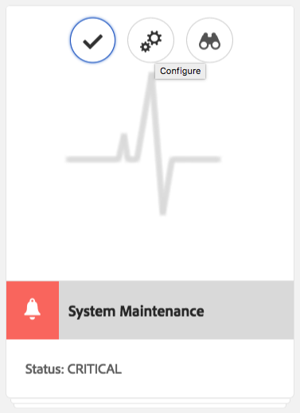
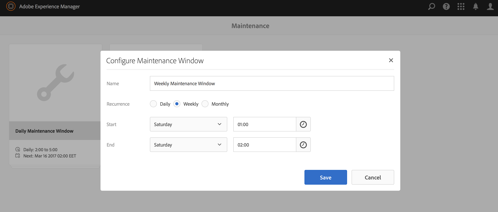
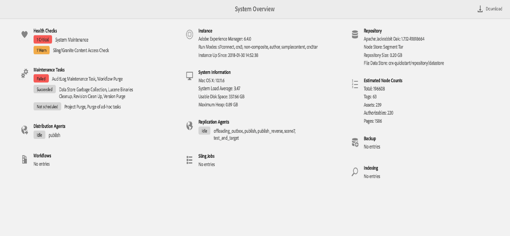

# Operations-dashboard {#operations-dashboard}

## Inleiding {#introduction}

Het vluchthandboek in AEM 6 helpt systeembeheerders de gezondheid van het AEM systeem in een oogopslag te controleren. Het verstrekt ook auto-geproduceerde diagnoseinformatie over relevante aspecten van AEM en staat toe om op zichzelf staande onderhoudsautomatisering te vormen en in werking te stellen om projectverrichtingen en steungevallen beduidend te verminderen. Het vectordashboard kan worden uitgebreid met aangepaste gezondheidscontroles en onderhoudstaken. Verder kunnen gegevens van het Operations-dashboard via JMX worden benaderd via externe bewakingstools.

**Het vectordashboard:**

* Is een één-klik systeemstatus om verrichtingenafdelingen te helpen efficiency bereiken
* Verstrekt systeemgezondheidsoverzicht in één enkele, gecentraliseerde plaats
* Minder tijd om problemen te zoeken, te analyseren en op te lossen
* Biedt zelfstandige onderhoudsautomatisering die de kosten van projectbewerkingen aanzienlijk helpt verlagen

Het kan worden betreden door naar **Hulpmiddelen** - **Verrichtingen** van het AEM Welkome scherm te gaan.

>[!NOTE]
>
>Om tot het Dashboard van Verrichtingen kunnen toegang hebben, moet de het programma geopende gebruiker deel van de &quot;Exploitanten&quot;gebruikersgroep uitmaken. Voor meer informatie, zie documentatie over [Gebruiker, Groep en Recht Beleid](/help/sites-administering/user-group-ac-admin.md)van de Toegang.

## Gezondheidsrapportage {#health-reports}

Het Health Report-systeem biedt informatie over de gezondheid van een AEM-instantie via Sling Health Checks. Dit kan via OSGI-, JMX- en HTTP-aanvragen (via JSON) of via de Touch UI. Het biedt metingen en drempel van bepaalde configureerbare tellers aan en in sommige gevallen, zal informatie over hoe te om de kwestie op te lossen aanbieden.

Het heeft verschillende functies, die hieronder worden beschreven.

## Gezondheidscontroles {#health-checks}

De **Gezondheidsrapporten** zijn een systeem van kaarten die wijzen op goede of slechte gezondheid met betrekking tot een specifiek productgebied. Deze kaarten zijn visualisaties van de Sling Health Checks, die gegevens van JMX en andere bronnen samenvoegen en verwerkte informatie opnieuw blootstellen als MBans. Deze MBeans kunnen ook in de [JMX Webconsole](/help/sites-administering/jmx-console.md), onder **org.apache.sling.health check** domein worden geïnspecteerd.

De interface Gezondheidsrapporten kan worden geopend via de **Hulpmiddelen** - **Verrichtingen** - het menu van **Gezondheidsrapporten** op het Welkome scherm van AEM, of direct door volgende URL:

`https://<serveraddress>:port/libs/granite/operations/content/healthreports/healthreportlist.html`


Het kaartsysteem stelt drie mogelijke statussen beschikbaar: **OK**, **WAARSCHUWING** en **KRITIEK**. De staten zijn het resultaat van regels en drempels, die kunnen worden gevormd door de muis over de kaart te bewegen en dan het tandwielpictogram in de actiebar te klikken:



### Typen health check {#health-check-types}

Er zijn twee soorten gezondheidscontroles in AEM 6:

1. Individuele gezondheidscontroles
1. Samengestelde gezondheidscontroles

Een **individuele health check** is één enkele health check die overeenkomt met een statuskaart. Individuele gezondheidscontroles kunnen worden geconfigureerd met regels of drempelwaarden en kunnen een of meer tips en koppelingen bevatten om geïdentificeerde gezondheidsproblemen op te lossen. Laten we de controle Fouten in logboek als voorbeeld nemen: als er FOUT-items voorkomen in de instantielogboeken, vindt u deze op de detailpagina van de health check. Boven aan de pagina ziet u een koppeling naar de analyse van het logboekbericht in de sectie Diagnosis Tools, waarmee u deze fouten gedetailleerder kunt analyseren en de loggers opnieuw kunt configureren.

Een **Composite Health Check** is een controle waarbij informatie uit verschillende afzonderlijke controles wordt samengevoegd.

Samengestelde gezondheidscontroles worden geconfigureerd met behulp van **filtercodes**. In wezen worden alle enkelvoudige controles met dezelfde filtertag gegroepeerd als een samengestelde health check. Een Composite Health Check heeft alleen de status OK als alle enkelvoudige controles die het aggregaat bevat ook de status OK hebben.

### Hoe gezondheidscontroles te maken {#how-to-create-health-checks}

In het Operations-dashboard kunt u het resultaat van zowel individuele als samengestelde Health Checks visualiseren.

### Een individuele health check maken {#creating-an-individual-health-check}

Voor het maken van een individuele health check zijn twee stappen nodig: een Sling Health Check uitvoeren en een item voor de Health Check toevoegen in de configuratieknooppunten van het dashboard.

1. Als u een Sling Health Check wilt maken, moet u een OSGI-component maken die de Sling HealthCheck-interface implementeert. U voegt deze component in een bundel toe. De eigenschappen van de component zullen de Health Check volledig identificeren. Nadat de component is geïnstalleerd, wordt automatisch een JMX MBean voor de Health Check gemaakt. Zie de documentatie [van de](https://sling.apache.org/documentation/bundles/sling-health-check-tool.html) Sling Health Check voor meer informatie.

   Voorbeeld van een component Sling Health Check, geschreven met aantekeningen van de component OSGI-service:

   ```java
   @Component(service = HealthCheck.class,
   property = {
       HealthCheck.NAME + "=Example Check",
       HealthCheck.TAGS + "=example",
       HealthCheck.TAGS + "=test",
       HealthCheck.MBEAN_NAME + "=exampleHealthCheckMBean"
   })
    public class ExampleHealthCheck implements HealthCheck {
       @Override
       public Result execute() {
           // health check code
       }
    }
   ```

   >[!NOTE]
   >
   >De `MBEAN_NAME` eigenschap definieert de naam van het domein dat voor deze health check wordt gegenereerd.

1. Na het creëren van een Controle van de Gezondheid, moet een nieuw configuratieknooppunt worden gecreeerd, om het in de interface van het Dashboard van Verrichtingen toegankelijk te maken. Voor deze stap is het nodig de naam van JMX Mbean van de Health Check (de `MBEAN_NAME` eigenschap) te weten. Om een configuratie voor de Controle van de Gezondheid tot stand te brengen, open CRXDE en voeg een nieuw knoop (van type **niet:ongestructureerd**) onder de volgende weg toe: `/apps/settings/granite/operations/hc`

   De volgende eigenschappen moeten op het nieuwe knooppunt worden ingesteld:

   * **Naam:** `sling:resourceType`

      * **Type:** `String`
      * **Waarde:** `granite/operations/components/mbean`
   * **Naam:** `resource`

      * **Type:** `String`
      * **Waarde:** `/system/sling/monitoring/mbeans/org/apache/sling/healthcheck/HealthCheck/exampleHealthCheck`
   >[!NOTE]
   >
   >Het bovenstaande bronnenpad wordt als volgt gemaakt: als de naam van het product van de Health Check &quot;test&quot; is, voegt u &quot;test&quot; toe aan het einde van het pad `/system/sling/monitoring/mbeans/org/apache/sling/healthcheck/HealthCheck`
   >
   >Het uiteindelijke pad zal dus zijn:
   >
   >`/system/sling/monitoring/mbeans/org/apache/sling/healthcheck/HealthCheck/test`

   >[!NOTE]
   >
   >Zorg ervoor dat de volgende eigenschappen voor het `/apps/settings/granite/operations/hc` pad zijn ingesteld op true:
   >
   >
   >`sling:configCollectionInherit`
   >
   >`sling:configPropertyInherit`
   >
   >
   >Dit zal de configuratiemanager vertellen om de nieuwe configuraties met de bestaande configuraties van `/libs`samen te voegen.

### Een samengestelde health check maken {#creating-a-composite-health-check}

Een Composite Health Check&#39;s rol bestaat erin een aantal afzonderlijke Health Checks samen te voegen die een reeks gemeenschappelijke kenmerken delen. Zo groepeert de veiligheidssamengestelde gezondheidscontrole alle afzonderlijke gezondheidscontroles die beveiligingsgerelateerde controles uitvoeren. De eerste stap om een samengestelde controle tot stand te brengen is een nieuwe configuratie toe te voegen OSGI. Om het in het Dashboard van Verrichtingen te tonen, moet een nieuw configuratieknooppunt worden toegevoegd, de zelfde manier wij voor een eenvoudige controle deden.

1. Ga naar de Manager van de Configuratie van het Web in de Console OSGI. U kunt dit doen door toegang te hebben tot `https://serveraddress:port/system/console/configMgr`
1. Zoek naar het item met de naam **Apache Sling Composite Health Check**. Nadat u het vindt, merk op dat er twee configuraties reeds beschikbaar zijn: een voor de System Checks en een andere voor de Security Checks.
1. Creeer een nieuwe configuratie door &quot;+&quot;knoop op de rechterkant van de configuratie te drukken. Er wordt een nieuw venster weergegeven, zoals hieronder wordt weergegeven:

   

1. Maak een configuratie en sla deze op. Een boon zal met de nieuwe configuratie worden gecreeerd.

   Het doel van elk configuratiebezit is als volgt:

   * **Naam (hc.name):** De naam van de Composite Health Check. Een betekenisvolle naam wordt aanbevolen.
   * **Tags (hc.tags):** De labels voor deze Health Check. Als deze samengestelde health check bedoeld is om deel uit te maken van een andere samengestelde health check (bijvoorbeeld in een hiërarchie van gezondheidscontroles), voegt u de codes toe waarop deze samenstelling betrekking heeft.
   * **Naam MBean (hc.bean.name):** De naam van de boon die aan de JMX MBean van deze samengestelde gezondheidscontrole zal worden gegeven.
   * **Filterlabels (filter.tags):** Dit is een eigenschap die specifiek is voor samengestelde gezondheidscontroles. Dit zijn de tags die de samenstelling moet samenvoegen. De samengestelde health check wordt onder de groep geaggregeerd voor alle gezondheidscontroles waarbij een tag aanwezig is die overeenkomt met een van de filtertags van deze samenstelling. Een samengestelde health check met de **test** en **controle** van filterlabels zal bijvoorbeeld alle individuele en samengestelde gezondheidscontroles samenvoegen die een van de **test** - en **controletags** hebben in hun tageigenschap ( `hc.tags`).
   >[!NOTE]
   >
   >Voor elke nieuwe configuratie van de Apache Sling Composite Health Check wordt een nieuwe JMX-maboon gemaakt.**

1. Tot slot moet de ingang van de samengestelde gezondheidscontrole die net is gecreeerd in de de configuratieknopen van het Dashboard van Verrichtingen worden toegevoegd. De procedure hiervoor is dezelfde als bij individuele gezondheidscontroles: een knooppunt van het type **nt:ungestructureerde** moet worden gemaakt onder `/apps/settings/granite/operations/hc`. Het middelbezit van de knoop zal door de waarde van **hc.gemiddelde.name** in de configuratie worden bepaald OSGI.

   Als, bijvoorbeeld, u een configuratie creeerde en de waarde **hc.bean.name** aan **diskusage** plaatst, zullen de configuratieknopen als dit kijken:

   * **Naam:** `Composite Health Check`

      * **Type:** `nt:unstructured`
   Met de volgende eigenschappen:

   * **Naam:** `sling:resourceType`

      * **Type:** `String`
      * **Waarde:** `granite/operations/components/mbean`
   * **Naam:** `resource`

      * **Type:** `String`
      * **Waarde:** `/system/sling/monitoring/mbeans/org/apache/sling/healthcheck/HealthCheck/diskusage`
   >[!NOTE]
   >
   >Als u individuele gezondheidscontroles creeert die logisch gezien onder een samengestelde controle behoren die reeds in het dashboard door gebrek aanwezig is, zullen zij automatisch worden gevangen en onder de respectieve samengestelde controle gegroepeerd. Wegens dit, is er geen behoefte om een nieuw configuratieknooppunt voor deze controles tot stand te brengen.
   >
   >Bijvoorbeeld, als u een individuele veiligheidsgezondheidscontrole creeert, alles u moet doen het toewijzen het &quot;**veiligheid**&quot;markering, en het geïnstalleerd is, zal het automatisch onder de de samengestelde controle van Controles in het Dashboard van Verrichtingen verschijnen.

### Gezondheidscontroles bij AEM {#health-checks-provided-with-aem}

<table>
 <tbody>
  <tr>
   <td><strong>zHealthcheck-naam</strong></td>
   <td><strong>Beschrijving</strong></td>
  </tr>
  <tr>
   <td>Query-prestaties</td>
   <td><p>Deze gezondheidscontrole werd vereenvoudigd <strong>in AEM 6.4</strong>, en controleert nu onlangs-refactored <code>Oak QueryStats</code> MBean, meer bepaald het <code>SlowQueries </code>attribuut. Als de statistieken om het even welke langzame vragen bevatten, dan keert de gezondheidscontrole een waarschuwing terug. Anders wordt de status OK geretourneerd.<br /> </p> <p>De MBean voor deze gezondheidscontrole is <a href="http://localhost:4502/system/console/jmx/org.apache.sling.healthcheck%3Aname%3DqueriesStatus%2Ctype%3DHealthCheck">org.apache.sling.health check:name=queryStatus,type=HealthCheck</a>.</p> </td>
  </tr>
  <tr>
   <td>Lengte van waarnemingswachtrij</td>
   <td><p>De Lengte van de Rij van de observatie herhaalt over alle Lijsten van de Gebeurtenis en Achtergrondwaarnemers, vergelijkt hun <code>queueSize </code>met hun <code>maxQueueSize</code> en:</p>
    <ul>
     <li>Hiermee wordt de status Kritiek geretourneerd als de <code>queueSize</code> waarde de <code>maxQueueSize</code> waarde overschrijdt (dat wil zeggen wanneer gebeurtenissen worden neergezet)</li>
     <li>retourneert Warn als de <code>queueSize</code> waarde zich boven de waarde <code>maxQueueSize * WARN_THRESHOLD</code> (de standaardwaarde is 0,75) bevindt </li>
    </ul> <p>De maximumlengte van elke rij komt uit afzonderlijke configuraties (Oak en AEM), en is niet configureerbaar van deze gezondheidscontrole. De MBean voor deze health check is <a href="http://localhost:4502/system/console/jmx/org.apache.sling.healthcheck%3Aname%3DObservationQueueLengthHealthCheck%2Ctype%3DHealthCheck">org.apache.sling.health check:name=ObservationQueueLengthHealthCheck,type=HealthCheck</a>.</p> </td>
  </tr>
  <tr>
   <td>Transversale begrenzingen voor query</td>
   <td><p>De Grenswaarden van de Traversal van de vraag controleert <code>QueryEngineSettings</code> MBean, specifieker de <code>LimitInMemory</code> en <code>LimitReads</code> attributen, en keert de volgende status terug:</p>
    <ul>
     <li>retourneert de waarschuwingsstatus als een van de limieten gelijk is aan of hoger is dan de <code>Integer.MAX_VALUE</code></li>
     <li>retourneert de waarschuwingsstatus als een van de limieten lager is dan 10000 (de aanbevolen instelling voor eik)</li>
     <li>Hiermee wordt de status Kritiek geretourneerd als de limieten <code>QueryEngineSettings</code> of een van de limieten niet kunnen worden opgehaald</li>
    </ul> <p>De sjabloon voor deze health check is <a href="http://localhost:4502/system/console/jmx/org.apache.sling.healthcheck%3Aname%3DqueryTraversalLimitsBundle%2Ctype%3DHealthCheck">org.apache.sling.health check:name=queryTraversalLimitsBundle,type=HealthCheck</a>.</p> </td>
  </tr>
  <tr>
   <td>Gesynchroniseerde klokken</td>
   <td><p>Deze controle is alleen relevant voor <a href="https://github.com/apache/sling-old-svn-mirror/blob/4df9ab2d6592422889c71fa13afd453a10a5a626/bundles/extensions/discovery/oak/src/main/java/org/apache/sling/discovery/oak/SynchronizedClocksHealthCheck.java">documentknooppuntclusters</a>. De volgende status wordt geretourneerd:</p>
    <ul>
     <li>retourneert de waarschuwingsstatus wanneer de instantieklokken niet meer synchroon zijn en een vooraf gedefinieerde lage drempel overschrijden</li>
     <li>Hiermee wordt de status Kritiek geretourneerd wanneer de instantieklokken niet meer synchroon zijn en een vooraf gedefinieerde hoge drempel overschrijden</li>
    </ul> <p>De sjabloon voor deze health check is <a href="http://localhost:4502/system/console/jmx/org.apache.sling.healthcheck%3Aname%3DslingDiscoveryOakSynchronizedClocks%2Ctype%3DHealthCheck">org.apache.sling.health check:name=slingDiscoveryOakSynchronizedClocks,type=HealthCheck</a>.</p> </td>
  </tr>
  <tr>
   <td>Asynchrone indexen</td>
   <td><p>De asynchrone controle van indexen:</p>
    <ul>
     <li>Hiermee wordt de status Kritiek geretourneerd als ten minste één indexstrook mislukt</li>
     <li>controleert de index <code>lastIndexedTime</code> voor alle indexstroken en:
      <ul>
       <li>Geeft de status Kritiek als deze meer dan 2 uur geleden is </li>
       <li>retourneert de waarschuwingsstatus als deze tussen 2 uur en 45 minuten geleden ligt </li>
       <li>Hiermee wordt de status OK geretourneerd als deze minder dan 45 minuten geleden is </li>
      </ul> </li>
     <li>als aan geen van deze voorwaarden is voldaan, wordt de status OK geretourneerd</li>
    </ul> <p>Zowel zijn de Kritieke als de statusdrempels van de Waarschuwing configureerbaar. De sjabloon voor deze health check is <a href="http://localhost:4502/system/console/jmx/org.apache.sling.healthcheck%3Aname%3DasyncIndexHealthCheck%2Ctype%3DHealthCheck">org.apache.sling.health check:name=asyncIndexHealthCheck,type=HealthCheck</a>.</p> <p><strong>Opmerking: </strong>Deze health check is beschikbaar bij AEM 6.4 en is teruggezet naar AEM 6.3.0.1.</p> </td>
  </tr>
  <tr>
   <td>Grote Lucene-indexen</td>
   <td><p>Deze controle gebruikt de gegevens die door <code>Lucene Index Statistics</code> MBean worden blootgesteld om grote indexen te identificeren en winst terug te keren:</p>
    <ul>
     <li>een waarschuwingsstatus als er een index is met meer dan 1 miljard documenten</li>
     <li>een kritieke status als er een index met meer dan 1,5 miljard documenten is</li>
    </ul> <p>De drempels zijn configureerbaar en MBean voor de gezondheidscontrole is <a href="http://localhost:4502/system/console/jmx/org.apache.sling.healthcheck%3Aname%3DlargeIndexHealthCheck%2Ctype%3DHealthCheck">org.apache.sling.health check:name=largeIndexHealthCheck,type=HealthCheck.</a></p> <p><strong>Opmerking: </strong>Deze controle is beschikbaar bij AEM 6.4 en is teruggezet naar AEM 6.3.2.0.</p> </td>
  </tr>
  <tr>
   <td>Systeemonderhoud</td>
   <td><p>Het Onderhoud van het systeem is een samengestelde controle die O.K. terugkeert als alle onderhoudstaken zoals gevormd lopen. Houd er rekening mee dat:</p>
    <ul>
     <li>elke onderhoudstaak gaat vergezeld van een bijbehorende gezondheidscontrole</li>
     <li>als een taak niet aan een onderhoudsvenster wordt toegevoegd, zal zijn gezondheidscontrole Kritiek terugkeren</li>
     <li>u moet het Logboek van de Controle en het onderhoudstaken van de Woorden van het Werkschema vormen of anders hen verwijderen uit de onderhoudsvensters. Als verlaten unconfigured, zullen deze taken op de eerste geprobeerd looppas ontbreken, zodat zal de controle van het Onderhoud van het Systeem de Kritieke status terugkeren.</li>
     <li><strong>Met AEM 6.4</strong>, is er ook een controle voor de <a href="/help/sites-administering/operations-dashboard.md#automated-maintenance-tasks">taak van het Onderhoud</a> van Binaries van Lucene</li>
     <li>op AEM 6.2 en lager, keert de controle van het systeemonderhoud een Waarschuwingsstatus onmiddellijk na opstarten terug omdat de taken nooit lopen. Vanaf 6.3 retourneren ze OK als het eerste onderhoudsvenster nog niet is bereikt.</li>
    </ul> <p>De MBean voor deze health check is <a href="http://localhost:4502/system/console/jmx/org.apache.sling.healthcheck%3Aname%3Dsystemchecks%2Ctype%3DHealthCheck">org.apache.sling.health check:name=systemchecks,type=HealthCheck</a>.</p> </td>
  </tr>
  <tr>
   <td>Replicatiereeks</td>
   <td><p>Deze controle herhaalt over replicatieagenten en bekijkt hun rijen. Voor het punt bij de bovenkant van de rij, bekijkt de controle hoeveel keer de agent replicatie opnieuw probeerde. Als de agent replicatie meer dan de waarde van de <code>numberOfRetriesAllowed</code> parameter opnieuw probeerde, keert het een waarschuwing terug. De <code>numberOfRetriesAllowed</code> parameter kan worden geconfigureerd. </p> <p>De MBean voor deze gezondheidscontrole is <a href="http://localhost:4502/system/console/jmx/org.apache.sling.healthcheck%3Aname%3DreplicationQueue%2Ctype%3DHealthCheck" target="_blank">org.apache.sling.health check:name=replicationQueue,type=HealthCheck</a>.</p> </td>
  </tr>
  <tr>
   <td>Verkooptaken</td>
   <td>
    <div>
      Het verkopen van Banen controleert het aantal banen die in JobManager een rij worden gevormd, vergelijkt het met de <code>maxNumQueueJobs</code> drempel, en:
    </div>
    <ul>
     <li>Hiermee wordt Kritiek geretourneerd als er meer dan de wachtrij <code>maxNumQueueJobs</code> is</li>
     <li>Geeft Kritiek als er langdurige actieve banen zijn die ouder zijn dan 1 uur</li>
     <li>Geeft Critical als er banen in de rij zijn, en de laatste gebeëindigde baantijd is ouder dan 1 uur</li>
    </ul> <p>Slechts is het maximumaantal een rij gevormde baanparameter configureerbaar en het heeft de standaardwaarde van 1000.</p> <p>De MBean voor deze gezondheidscontrole is <a href="http://localhost:4502/system/console/jmx/org.apache.sling.healthcheck%3Aname%3DslingJobs%2Ctype%3DHealthCheck" target="_blank">org.apache.sling.health check:name=slingJobs,type=HealthCheck</a>.</p> </td>
  </tr>
  <tr>
   <td>Prestaties aanvragen</td>
   <td><p>Deze controle bekijkt metrisch <code>granite.request.metrics.timer</code> Sling <a href="http://localhost:4502/system/console/slingmetrics" target="_blank"></a>en:</p>
    <ul>
     <li>Hiermee wordt Kritiek geretourneerd als de waarde van het 75e percentiel boven de kritieke drempel ligt (de standaardwaarde is 500 milliseconden)</li>
     <li>retourneert Waarschuwen als de waarde van het 75e percentiel boven de waarschuwingsdrempel ligt (de standaardwaarde is 200 milliseconden)</li>
    </ul> <p>De MBean voor deze gezondheidscontrole is<em> </em><a href="http://localhost:4502/system/console/jmx/org.apache.sling.healthcheck%3Aname%3DrequestsStatus%2Ctype%3DHealthCheck" target="_blank">org.apache.sling.health check:name=requestStatus,type=HealthCheck</a>.</p> </td>
  </tr>
  <tr>
   <td>Logfouten</td>
   <td><p>Deze controle keert de waarschuwende status terug als er fouten in het logboek zijn.</p> <p>De MBean voor deze health check is <a href="http://localhost:4502/system/console/jmx/org.apache.sling.healthcheck%3Aname%3DlogErrorHealthCheck%2Ctype%3DHealthCheck" target="_blank">org.apache.sling.health check:name=logErrorHealthCheck,type=HealthCheck</a>.</p> </td>
  </tr>
  <tr>
   <td>Schijfruimte</td>
   <td><p>De controle van de Ruimte van de Schijf kijkt naar <code>FileStoreStats</code> MBean, wint de grootte van de Opslag van de Knoop en de hoeveelheid bruikbare schijfruimte op de Opslag van de Knoop, en:</p>
    <ul>
     <li>retourneert Waarschuwen als de bruikbare verhouding tussen schijfruimte en grootte van opslagplaats kleiner is dan de waarschuwingsdrempel (de standaardwaarde is 10)</li>
     <li>Hiermee wordt Kritiek geretourneerd als de bruikbare verhouding tussen schijfruimte en grootte van opslagruimte kleiner is dan de kritieke drempel (de standaardwaarde is 2)</li>
    </ul> <p>Beide drempels zijn configureerbaar. De controle werkt alleen op instanties met een Segmentarchief.</p> <p>De MBean voor deze health check is <a href="http://localhost:4502/system/console/jmx/org.apache.sling.healthcheck%3Aname%3DDiskSpaceHealthCheck%2Ctype%3DHealthCheck" target="_blank">org.apache.sling.health check:name=DiskSpaceHealthCheck,type=HealthCheck</a>.</p> </td>
  </tr>
  <tr>
   <td>Health check van planner</td>
   <td><p>Deze controle retourneert een waarschuwing als de instantie Quartz-taken meer dan 60 seconden uitvoert. De aanvaardbare duurdrempel kan worden geconfigureerd.</p> <p>De MBean voor deze health check is <a href="http://localhost:4502/system/console/jmx/org.apache.sling.healthcheck%3Aname%3DslingCommonsSchedulerHealthCheck%2Ctype%3DHealthCheck" target="_blank">org.apache.sling.health check:name=slingCommonsSchedulerHealthCheck,type=HealthCheck</a><em>.</em></p> </td>
  </tr>
  <tr>
   <td>Beveiligingscontroles</td>
   <td><p>De veiligheidscontrole is een samenstelling die de resultaten van veelvoudige veiligheid-verwante controles samenvoegt. Deze individuele gezondheidscontroles bieden oplossingen voor andere problemen dan de lijst met beveiligingscontroles die beschikbaar is op de documentatiepagina van de <a href="/help/sites-administering/security-checklist.md">lijst met beveiligingscontroles.</a> De controle is handig als een veiligheidsrooktest wanneer de instantie wordt gestart. </p> <p>De MBean voor deze health check is <a href="http://localhost:4502/system/console/jmx/org.apache.sling.healthcheck%3Aname%3Dsecuritychecks%2Ctype%3DHealthCheck" target="_blank">org.apache.sling.health check:name=</a><a href="http://localhost:4502/system/console/jmx/org.apache.sling.healthcheck%3Aname%3Dsecuritychecks%2Ctype%3DHealthCheck" target="_blank"></a><a href="http://localhost:4502/system/console/jmx/org.apache.sling.healthcheck%3Aname%3Dsecuritychecks%2Ctype%3DHealthCheck" target="_blank"></a><a href="http://localhost:4502/system/console/jmx/org.apache.sling.healthcheck%3Aname%3Dsecuritychecks%2Ctype%3DHealthCheck" target="_blank">securityChecks,type=HealthCheck</a></p> </td>
  </tr>
  <tr>
   <td>Actieve pakketten</td>
   <td><p>De actieve Bundels controleert de staat van alle bundels en:</p>
    <ul>
     <li>Hiermee wordt de waarschuwingsstatus geretourneerd als een van de bundels niet actief is of (te beginnen met lazy activering)</li>
     <li>het negeert de status van bundels in de nevenlijst</li>
    </ul> <p>De ignore lijstparameter is configureerbaar.</p> <p>De MBean voor deze health check is <a href="http://localhost:4502/system/console/jmx/org.apache.sling.healthcheck%3Aname%3DinactiveBundles%2Ctype%3DHealthCheck" target="_blank">org.apache.sling.health check:name=inactiveBundles,type=HealthCheck</a>.</p> </td>
  </tr>
  <tr>
   <td>Cachecontrole code</td>
   <td><p>Dit is een Health Check die verschillende JVM-omstandigheden controleert die een CodeCache-bug in Java 7 kunnen activeren:</p>
    <ul>
     <li>retourneert Waarschuwen als de instantie wordt uitgevoerd in Java 7, waarbij Cachegeheugen leegmaken is ingeschakeld</li>
     <li>retourneert Waarschuwen als de instantie wordt uitgevoerd in Java 7 en de grootte van de gereserveerde codecache is kleiner dan een minimumdrempel (de standaardwaarde is 90 MB)</li>
    </ul> <p>De <code>minimum.code.cache.size</code> drempel kan worden geconfigureerd. Voor meer informatie over de bug, <a href="https://bugs.java.com/bugdatabase/view_bug.do?bug_id=8012547">controleer</a><a href="https://bugs.java.com/bugdatabase/view_bug.do?bug_id=8012547"></a><a href="https://bugs.java.com/bugdatabase/view_bug.do?bug_id=8012547"></a><a href="https://bugs.java.com/bugdatabase/view_bug.do?bug_id=8012547"> deze pagina</a>.</p> <p>De MBean voor deze health check is <a href="http://localhost:4502/system/console/jmx/org.apache.sling.healthcheck%3Aname%3DcodeCacheHealthCheck%2Ctype%3DHealthCheck" target="_blank">org.apache.sling.health check:name=codeCacheHealthCheck,type=HealthCheck</a>.</p> </td>
  </tr>
  <tr>
   <td>Fouten in snijpad van bronnen</td>
   <td><p>Controleert of het pad bronnen bevat <code>/apps/foundation/components/primary</code> en:</p>
    <ul>
     <li>retourneert Waarschuwen als er onderliggende knooppunten onder zijn <code>/apps/foundation/components/primary</code></li>
    </ul> <p>De MBean voor deze health check is <a href="http://localhost:4502/system/console/jmx/org.apache.sling.healthcheck%3Aname%3DresourceSearchPathErrorHealthCheck%2Ctype%3DHealthCheck" target="_blank">org.apache.sling.health check:name=resourceSearchPathErrorHealthCheck,type=HealthCheck</a>.</p> </td>
  </tr>
 </tbody>
</table>

## Toezicht met Nagios {#monitoring-with-nagios}

Het Health Check Dashboard kan integreren met Nagios via de Granite JMX Mbeans. In het onderstaande voorbeeld ziet u hoe u een controle toevoegt die gebruikt geheugen op de server waarop AEM wordt uitgevoerd.

1. Stel Nagios in en installeer deze op de bewakingsserver.
1. Installeer vervolgens de Nagios Remote Plugin Exec (NRPE).

   >[!NOTE]
   >
   >Raadpleeg de documentatie bij [Nagios voor meer informatie over het installeren van Nagios en NRPE op uw systeem](https://library.nagios.com/library/products/nagioscore/manuals/).

1. Voeg een hostdefinitie voor de AEM-server toe. Dit kan via de Interface van het Web Nagios XI, door de Manager van de Configuratie te gebruiken worden gedaan:

   1. Open een browser en wijs naar de Nagios-server.
   1. Druk de **Configure** knoop in het hoogste menu.
   1. Druk in het linkerdeelvenster op **Core Config Manager** onder **Geavanceerde configuratie**.
   1. Druk op de koppeling **Gastheren** onder de sectie **Controle** .
   1. Voeg de hostdefinitie toe:
   

   Hieronder ziet u een voorbeeld van een hostconfiguratiebestand voor het geval u Nagios Core gebruikt:

   ```xml
   define host {
      address 192.168.0.5
      max_check_attempts 3
      check_period 24x7
      check-command check-host-alive
      contacts admin
      notification_interval 60
      notification_period 24x7
   }
   ```

1. Installeer Nagios en NRPE op de AEM-server.
1. Installeer de [insteekmodule check_http_json](https://github.com/phrawzty/check_http_json) op beide servers.
1. Definieer een algemene JSON-controleopdracht op beide servers:

   ```xml
   define command{
   
       command_name    check_http_json-int
   
       command_line    /usr/lib/nagios/plugins/check_http_json --user "$ARG1$" --pass "$ARG2$" -u 'https://$HOSTNAME$:$ARG3$/$ARG4$' -e '$ARG5$' -w '$ARG6$' -c '$ARG7$'
   
   }
   ```

1. Voeg een service voor gebruikt geheugen toe aan de AEM-server:

   ```xml
   define service {
   
       use generic-service
   
       host_name my.remote.host
   
       service_description AEM Author Used Memory
   
       check_command  check_http_json-int!<cq-user>!<cq-password>!<cq-port>!system/sling/monitoring/mbeans/java/lang/Memory.infinity.json!{noname}.mbean:attributes.HeapMemoryUsage.mbean:attributes.used.mbean:value!<warn-threshold-in-bytes>!<critical-threshold-in-bytes>
   
       }
   ```

1. Controleer het dashboard Nagios op de nieuwe service:

   

## Diagnosetools {#diagnosis-tools}

Het operatiedashboard biedt ook toegang tot diagnosetools die helpen bij het zoeken naar en het oplossen van problemen met de hoofdoorzaken van de waarschuwingen die afkomstig zijn van het dashboard voor de health check, en die belangrijke foutopsporingsinformatie bieden aan systeemoperatoren.

De belangrijkste kenmerken zijn:

* Analyse van logberichten
* De capaciteit om tot heap en draaddumps toegang te hebben
* De verzoeken en analysatoren van de vraagprestaties

U kunt het scherm van de Hulpmiddelen van de Diagnose bereiken door naar **Hulpmiddelen - Verrichtingen - Diagnose** van het Welkome scherm van AEM te gaan. U kunt het scherm ook openen door de volgende URL rechtstreeks te openen: `https://serveraddress:port/libs/granite/operations/content/diagnosis.html`


### Logberichten {#log-messages}

De gebruikersinterface van de logboekberichten zal alle FOUTberichten door gebrek tonen. Als u meer getoonde logboekberichten wilt hebben, moet u een registreerapparaat met het aangewezen logboekniveau vormen.

De logboekberichten gebruiken een appender van het in geheugenlogboek en daarom, zijn niet verwant met de logboekdossiers. Een ander gevolg is dat het veranderen van de logboekniveaus in deze UI niet de informatie zal veranderen die het programma wordt geopend de traditionele logboekdossiers. Het toevoegen en verwijderen van loggers in deze interface heeft alleen invloed op het logger voor ingeheugen. Ook, merk op dat het veranderen van de logboekconfiguraties in de toekomst van in geheugenregistreerapparaat zullen worden weerspiegeld - de ingangen die reeds geregistreerd zijn en niet relevant meer zijn worden niet geschrapt, maar de gelijkaardige ingangen zullen niet in de toekomst worden geregistreerd.

U kunt vormen wat door logboekconfiguraties van de hogere linkertandknoop in UI wordt geregistreerd te verstrekken. In dat geval kunt u configuraties van logboekbestanden toevoegen, verwijderen of bijwerken. Een loggerconfiguratie bestaat uit een **logniveau** (WARN / INFO / DEBUG) en een **filternaam**. De **filternaam** heeft de rol om de bron van de logboekberichten te filtreren die het programma worden geopend. Alternatief, als een registreerder alle logboekberichten voor het gespecificeerde niveau zou moeten vangen, zou de filternaam &quot;**wortel**&quot;moeten zijn. Door het niveau van een logger in te stellen, worden alle berichten vastgelegd met een niveau dat gelijk is aan of hoger is dan het niveau dat is opgegeven.

Voorbeelden:

* Als u bij het vangen van alle **FOUTberichten** van plan bent - geen configuratie wordt vereist. Alle FOUTberichten worden standaard vastgelegd.
* Als u bij het vangen van alle **FOUT**, **WARN** en **INFO** berichten van plan bent - zou de logboeknaam aan moeten worden geplaatst: &quot;**wortel**&quot;, en het logboekniveau aan: **INFO**.

* Als u alle berichten wilt vastleggen die afkomstig zijn uit een bepaald pakket (bijvoorbeeld com.adobe.granite), moet de naam van het logger worden ingesteld op: &quot;com.adobe.granite&quot; en het loggerniveau tot: **DEBUG** (hiermee worden alle **FOUT**-, **WARN**-, **INFO** - en **DEBUG** -berichten vastgelegd), zoals in de onderstaande afbeelding wordt getoond.


>[!NOTE]
>
>U kunt geen logboeknaam instellen om alleen FOUTberichten vast te leggen via een opgegeven filter. Standaard worden alle FOUTberichten vastgelegd.

>[!NOTE]
>
>De gebruikersinterface van de logboekberichten weerspiegelt niet het daadwerkelijke foutenlogboek. Tenzij u andere types van logboekberichten in UI vormt, zult u slechts de berichten van de FOUT zien. Zie bovenstaande instructies voor informatie over het weergeven van specifieke logboekberichten.

>[!NOTE]
>
>De instellingen op de diagnospagina hebben geen invloed op wat er is geregistreerd voor de logbestanden en andersom. Zo, terwijl het foutenlogboek de berichten van INFO zou kunnen vangen, zou u hen niet in de logboekberichten UI kunnen zien. Ook, door UI is het mogelijk om te vangen DEBUG berichten van bepaalde pakketten zonder het het foutenlogboek beïnvloedt. Voor meer informatie over hoe te om de logboekdossiers te vormen, zie [Registreren](/help/sites-deploying/configure-logging.md).

>[!NOTE]
>
>**Met AEM 6.4**, worden de onderhoudstaken geregistreerd uit de doos in een meer informatie rijke formaat op het niveau INFO. Dit maakt een betere zichtbaarheid in de staat van de onderhoudstaken mogelijk.
>
>Als u hulpmiddelen van derden (zoals Splunk) gebruikt om de activiteit van de onderhoudstaak te controleren en erop te reageren, kunt u de volgende logboekverklaringen gebruiken:

```
Log level: INFO
DATE+TIME [MaintanceLogger] Name=<MT_NAME>, Status=<MT_STATUS>, Time=<MT_TIME>, Error=<MT_ERROR>, Details=<MT_DETAILS>
```

### Prestaties aanvragen {#request-performance}

De pagina van de Prestaties van het Verzoek staat de analyse van de langzaamste verwerkte paginaverzoeken toe. Alleen inhoudsaanvragen worden op deze pagina geregistreerd. Meer specifiek worden de volgende verzoeken vastgelegd:

1. Verzoeken om bronnen onder `/content`
1. Verzoeken om bronnen onder `/etc/design`
1. Verzoeken om verlenging `".html"`


De pagina wordt weergegeven:

* Het tijdstip waarop het verzoek is ingediend
* De URL en de aanvraagmethode
* De duur in milliseconden

Door gebrek, worden de langzaamste 20 paginaverzoeken gevangen, maar de grens kan in de Manager van de Configuratie worden gewijzigd.

### Query-prestaties {#query-performance}

De pagina van de Prestaties van de Vraag staat de analyse van de langzaamste vragen toe die door het systeem worden uitgevoerd. Deze informatie wordt verstrekt door de bewaarplaats in een JMX boon. In Jackrabbit verschaft de `com.adobe.granite.QueryStat` JMX Mbean deze informatie, terwijl deze in de eik-opslagplaats wordt aangeboden door `org.apache.jackrabbit.oak.QueryStats.`

De pagina wordt weergegeven:

* De tijd waarop de query is uitgevoerd
* De taal van de query
* Het aantal keren dat de query is uitgegeven
* De instructie van de query
* De duur in milliseconden


### Query uitvoeren {#explain-query}

Voor om het even welke bepaalde vraag, probeert het Eak om de beste manier te vinden om uit te voeren gebaseerd op de indexen van het Eak die in de bewaarplaats onder het **eik worden bepaald:index** knoop. Afhankelijk van de vraag, kunnen de verschillende indexen door Oak worden gekozen. Begrijpen hoe een query wordt uitgevoerd, is de eerste stap voor het optimaliseren van de query.

De verklaarvraag is een hulpmiddel dat verklaart hoe het Eak een vraag uitvoert. Het kan worden betreden door naar **Hulpmiddelen te gaan - Verrichtingen - Diagnose** van het Welkome Scherm AEM, dan klikkend op de Prestaties **van de** Vraag en overschakelend over aan het **Uitleg lusje van de Vraag** .

**Functies**

* Ondersteunt de querytalen Xpath, JCR-SQL en JCR-SQL2
* Meldt de werkelijke uitvoeringstijd van de opgegeven query
* Detecteert langzame query&#39;s en waarschuwt over query&#39;s die mogelijk traag kunnen zijn
* Meldt de eik-index die wordt gebruikt om de query uit te voeren
* Hiermee wordt de werkelijke uitleg van de zoekfunctie weergegeven
* Verstrekt klik-aan-ladlijst van Langzame en Populaire vragen

Zodra u in de Uitdrukkelijke Vraag UI bent, moet alles u doen om het te gebruiken de vraag ingaan en de **Uitleg** knoop drukken:


De eerste ingang in de sectie van de Verklaring van de Vraag is de daadwerkelijke verklaring. In de uitleg wordt het type index weergegeven dat is gebruikt om de query uit te voeren.

De tweede vermelding is het uitvoeringsplan.

Als u op het vak **Inclusief uitvoeringstijd** klikt voordat de query wordt uitgevoerd, wordt ook de hoeveelheid tijd weergegeven waarin de query is uitgevoerd, zodat u meer informatie kunt gebruiken voor het optimaliseren van de indexen voor uw toepassing of implementatie.


### Indexbeheer {#the-index-manager}

Het doel van Indexbeheer is het vereenvoudigen van indexbeheer, zoals het onderhouden van indexen of het bekijken van hun status.

Het kan worden betreden door naar **Hulpmiddelen - Verrichtingen - Diagnose **van het Welkome Scherm te gaan, en dan de knoop van de Manager **van de** Index te klikken.

U kunt de URL ook rechtstreeks openen via de volgende URL: `https://serveraddress:port/libs/granite/operations/content/diagnosistools/indexManager.html`


De interface kan worden gebruikt om indexen in de tabel te filteren door de filtercriteria in het zoekvak linksboven in het scherm te typen.

### Statuspostcode downloaden {#download-status-zip}

Hierdoor wordt het downloaden van een ritssluiting met nuttige informatie over de systeemstatus en configuratie geactiveerd. Het archief bevat instantieconfiguraties, een lijst met bundels, OSGI-, Sling-meetgegevens en statistische gegevens. Dit kan resulteren in een groot bestand. U kunt het effect van grote statusbestanden verminderen door het ZIP- **venster** Downloadstatus te gebruiken. Het venster is toegankelijk via:**AEM > Gereedschappen > Bewerkingen > Diagnose > Statuspostcode downloaden.**

In dit venster kunt u selecteren wat u wilt exporteren (logbestanden en of thread-dumps) en het aantal dagen logbestanden dat is opgenomen in de download ten opzichte van de huidige datum.


### Thread Dump downloaden {#download-thread-dump}

Hierdoor wordt het downloaden van een ritssluiting met informatie over de threads in het systeem geactiveerd. Informatie over elke draad wordt verstrekt, zoals zijn status, klasseleider en stacktrace.

### Heap-dumppleur downloaden {#download-heap-dump}

U kunt ook een momentopname van de heap downloaden om deze later te analyseren. Houd er rekening mee dat dit het downloaden van een groot bestand in de orde van honderden megabytes activeert.

## Geautomatiseerde onderhoudstaken {#automated-maintenance-tasks}

De pagina Automatisch onderhoud is een plaats waar u aanbevolen onderhoudstaken die zijn gepland voor periodieke uitvoering, kunt weergeven en volgen. De taken zijn geïntegreerd met het systeem van de health check. De taken kunnen ook manueel van de interface worden uitgevoerd.

Om aan de pagina van het Onderhoud in het Dashboard van Verrichtingen te krijgen, moet u naar **Hulpmiddelen - Verrichtingen - Dashboard - Onderhoud** van het Welkome scherm van AEM gaan, of direct deze verbinding volgen:

`https://serveraddress:port/libs/granite/operations/content/maintenance.html`

De volgende taken zijn beschikbaar in het Dashboard van Verrichtingen:

1. De **Revision Clean** Uptask, die zich onder het menu **venster** Dagelijks onderhoud bevindt.
1. De **taak van de Opruiming** van de Bindingen van Lucene, die onder het menu van het Venster **van het** Dagelijkse Onderhoud wordt gevestigd.
1. De taak **Werkstroom leegmaken** , die onder het menu van het Venster **van het** Weekonderhoud wordt gevestigd.
1. De **taak van de Inzameling** van de Opslag van Gegevens, die onder het **Wekelijkse menu van het Venster** van het Onderhoud wordt gevestigd.
1. De **onderhoudstaak** van het Logboek van de Controle, die onder het menu van het Venster **van het** Wekelijkse Onderhoud wordt gevestigd.
1. De **taak van het Onderhoud** van de Weigering van de Versie, die onder het **Wekelijkse menu van het Venster** van het Onderhoud wordt gevestigd.

De standaardtiming voor het dagelijkse onderhoudsvenster is 2 tot 5 AM. De taken die worden geconfigureerd om te worden uitgevoerd in het wekelijkse onderhoudsvenster, worden uitgevoerd tussen 1 en 2 uur &#39;s nachts.

U kunt de timing ook configureren door op het tandwielpictogram te drukken op een van de twee onderhoudskaarten:



>[!NOTE]
>
>Aangezien AEM 6.1, kunnen de bestaande onderhoudsvensters ook worden gevormd om maandelijks te lopen.

### Opschonen van revisie {#revision-clean-up}

Voor meer informatie over het uitvoeren van de Opschonen van de Revisie, [zie dit specifieke artikel](/help/sites-deploying/revision-cleanup.md).

### Lucene Binaries Cleanup {#lucene-binaries-cleanup}

Door de taak van de Opruiming van de Bindingen van Lucene te gebruiken, kunt u lucene binaries zuiveren en het de groottevereiste van de lopende gegevensopslag verminderen. Dit is omdat het binaire koord van de lucene dagelijks in plaats van het vroegere gebiedsdeel op een succesvolle de opschoonlooppas van de [gegevensopslagvuilinzameling](/help/sites-administering/data-store-garbage-collection.md) zal worden geherclaimd.

Hoewel de onderhoudstaak werd ontwikkeld om op Lucene betrekking hebbende revisiehuisvuil te verminderen, zijn er algemene efficiëntiewinsten wanneer het runnen van de taak:

* De wekelijkse uitvoering van de taak van de huisvuilinzameling van de gegevensopslag zal sneller voltooien
* Het kan ook de algehele AEM-prestaties licht verbeteren

U kunt tot de taak van de Opruiming van de Bindingen van Lucene van toegang hebben: **AEM > Gereedschappen > Bewerkingen > Onderhoud > Dagelijks onderhoud > Overbodig schoonmaken** van Lucene Binaries.

### Opruimverzameling gegevensopslag {#data-store-garbage-collection}

Voor details op de Inzameling van het huisvuil van de Opslag van Gegevens, zie de specifieke [documentatiepagina](/help/sites-administering/data-store-garbage-collection.md).

### Werkstroom leegmaken {#workflow-purge}

Workflows kunnen ook worden gewist vanaf het onderhouddashboard. Voor het uitvoeren van de taak Werkstroom leegmaken moet u:

1. Klik op de pagina **Weekelijks Onderhoudsvenster** .
1. Klik op de knop **Afspelen** op de volgende pagina in de **werkstroomopruimkaart** .

>[!NOTE]
>
> Zie [deze pagina](/help/sites-administering/workflows-administering.md#regular-purging-of-workflow-instances)voor meer informatie over workflowonderhoud.

### Controle van logboekonderhoud {#audit-log-maintenance}

Raadpleeg de [aparte documentatiepagina voor onderhoud van controlelogbestanden.](/help/sites-administering/operations-audit-log.md)

### Versie wissen {#version-purge}

U kunt de onderhoudstaak van het Leegmaken van de Versie plannen om oude versies automatisch te schrappen. Dit minimaliseert daarom de noodzaak om de [versiezuiveringsgereedschappen](/help/sites-deploying/version-purging.md)handmatig te gebruiken. U kunt de taak van het Wissen van de Versie plannen en vormen door tot **Hulpmiddelen > Verrichtingen > Onderhoud > Wekelijks Onderhoudsvenster** toegang te hebben en deze stappen te volgen:

1. Click the **Add** button.
1. Kies **Versie wissen** in het keuzemenu.

   

1. Om de taak van de Wissen van de Versie te vormen, klik op het **tandwielpictogram** op de onlangs gecreeerde het onderhoudskaart van de Woordenwissing van de Versie.

   

**Met AEM 6.4**, kunt u de het onderhoudstaak van de Woorden van de Versie als volgt tegenhouden:

* Automatisch - Als het geplande onderhoudsvenster wordt gesloten voordat de taak kan worden voltooid, wordt de taak automatisch beëindigd. Het wordt hervat wanneer het volgende onderhoudsvenster wordt geopend.
* Handmatig - Klik op het pictogram **Stoppen** om de taak handmatig te stoppen op de onderhoudskaart Version Purge. Bij de volgende uitvoering wordt de taak veilig hervat.

>[!NOTE]
>
>Om een einde te maken aan de onderhoudstaak, moet de uitvoering worden opgeschort zonder dat het spoor van de reeds in uitvoering zijnde baan verloren gaat.

>[!CAUTION]
>
>Om de grootte van de opslagplaats te optimaliseren, moet u de versiereinigingstaak regelmatig uitvoeren. De taak zou buiten kantooruren moeten worden gepland wanneer er een beperkte hoeveelheid verkeer is.

## Aangepaste onderhoudstaken {#custom-maintenance-tasks}

De het onderhoudstaken van de douane kunnen als diensten worden uitgevoerd OSGi. Aangezien de infrastructuur voor onderhoudstaken is gebaseerd op de taakafhandeling van Apache Sling, moet een onderhoudstaak de Java-interface implementeren ` [org.apache.sling.event.jobs.consumer.JobExecutor](https://sling.apache.org/apidocs/sling7/org/apache/sling/event/jobs/consumer/JobExecutor.html)`. Daarnaast moet de instantie verschillende eigenschappen van de serviceregistratie declareren die als onderhoudstaak moeten worden gedetecteerd, zoals hieronder wordt vermeld:

<table>
 <tbody>
  <tr>
   <td><strong>Eigenschappennaam service</strong><br /> </td>
   <td><strong>Beschrijving</strong></td>
   <td><strong>Voorbeeld</strong><br /> </td>
   <td><strong>Type</strong></td>
  </tr>
  <tr>
   <td>granite.maintenance.isStoppable</td>
   <td>Booleaanse eigenschap die definieert of de taak door de gebruiker kan worden gestopt. Als een taak verklaart dat het stopbaar is moet het tijdens zijn uitvoering controleren of het is tegengehouden en dan dienovereenkomstig handelen. De standaardwaarde is false.</td>
   <td>true</td>
   <td>Optioneel</td>
  </tr>
  <tr>
   <td>granite.maintenance.mandatory</td>
   <td>Booleaanse eigenschap die definieert of een taak verplicht is en periodiek moet worden uitgevoerd. Als een taak verplicht is maar momenteel niet in een actief planningsvenster staat, zal een Health Check dit als een fout rapporteren. De standaardwaarde is false.</td>
   <td>true</td>
   <td>Optioneel</td>
  </tr>
  <tr>
   <td>granite.maintenance.name</td>
   <td>Een unieke naam voor de taak - dit wordt gebruikt om naar de taak te verwijzen. Dit is meestal een eenvoudige naam.</td>
   <td>MyMaintenanceTask</td>
   <td>Vereist</td>
  </tr>
  <tr>
   <td>granite.maintenance.title</td>
   <td>Een titel die wordt weergegeven voor deze taak</td>
   <td>Mijn speciale onderhoudstaken</td>
   <td>Vereist</td>
  </tr>
  <tr>
   <td>job.topics</td>
   <td>Dit is een uniek onderwerp van de onderhoudstaak.<br /> De Apache Sling baan behandeling zal een baan met precies dit onderwerp beginnen om de onderhoudstaak uit te voeren en aangezien de taak voor dit onderwerp wordt geregistreerd wordt het uitgevoerd.<br /> Het onderwerp moet beginnen met <i>com/adobe/granite/onderhoud/job/</i></td>
   <td>com/adobe/granite/onderhoud/job/MyMaintenanceTask</td>
   <td>Vereist</td>
  </tr>
 </tbody>
</table>

Naast de bovengenoemde de diensteigenschappen, moet de `process()` methode van de `JobConsumer` interface worden uitgevoerd door de code toe te voegen die voor de onderhoudstaak zou moeten worden uitgevoerd. De opgegeven code `JobExecutionContext` kan worden gebruikt om statusinformatie uit te voeren, te controleren of de taak door de gebruiker is gestopt en een resultaat te maken (geslaagd of mislukt).

In situaties waar een onderhoudstaak niet op alle installaties (bijvoorbeeld, looppas slechts op de te publiceren instantie) zou moeten worden in werking gesteld, kunt u de dienst een configuratie vereisen om actief te zijn door toe te voegen `@Component(policy=ConfigurationPolicy.REQUIRE)`. U kunt de volgens configuratie dan als in werking gestelde wijze afhankelijk in de bewaarplaats merken. Voor meer informatie, zie het [Vormen OSGi](/help/sites-deploying/configuring-osgi.md#creating-the-configuration-in-the-repository).

Hieronder ziet u een voorbeeld van een aangepaste onderhoudstaak waarmee bestanden uit een configureerbare tijdelijke map worden verwijderd die in de afgelopen 24 uur zijn gewijzigd:

src/main/java/com/adobe/granite/samples/maintenance/impl/DeleteTempFilesTask.java

<table>
 <tbody>
  <tr>
   <td><p> </p> <p><code>/*</code></p> <p><code> * #%L</code></p> <p><code> * sample-maintenance-task</code></p> <p><code> * %%</code></p> <p><code> * Copyright (C) 2014 Adobe</code></p> <p><code> * %%</code></p> <p><code> * Licensed under the Apache License, Version 2.0 (the "License");</code></p> <p><code> * you may not use this file except in compliance with the License.</code></p> <p><code> * You may obtain a copy of the License at</code></p> <p><code> * </code></p> <p><code> * <a href="https://www.apache.org/licenses/LICENSE-2.0">https://www.apache.org/licenses/LICENSE-2.0</a></code></p> <p><code> * </code></p> <p><code> * Unless required by applicable law or agreed to in writing, software</code></p> <p><code> * distributed under the License is distributed on an "AS IS" BASIS,</code></p> <p><code> * WITHOUT WARRANTIES OR CONDITIONS OF ANY KIND, either express or implied.</code></p> <p><code> * See the License for the specific language governing permissions and</code></p> <p><code> * limitations under the License.</code></p> <p><code> * #L%</code></p> <p><code> */</code></p> <p><code> </code></p> <p><code>package com.adobe.granite.samples.maintenance.impl;</code></p> <p><code> </code></p> <p><code>import java.io.File;</code></p> <p><code>import java.util.Calendar;</code></p> <p><code>import java.util.Collection;</code></p> <p><code>import java.util.Map;</code></p> <p><code> </code></p> <p><code>import org.apache.commons.io.FileUtils;</code></p> <p><code>import org.apache.commons.io.filefilter.IOFileFilter;</code></p> <p><code>import org.apache.commons.io.filefilter.TrueFileFilter;</code></p> <p><code>import org.apache.felix.scr.annotations.Activate;</code></p> <p><code>import org.apache.felix.scr.annotations.Component;</code></p> <p><code>import org.apache.felix.scr.annotations.Properties;</code></p> <p><code>import org.apache.felix.scr.annotations.Property;</code></p> <p><code>import org.apache.felix.scr.annotations.Service;</code></p> <p><code>import org.apache.sling.commons.osgi.PropertiesUtil;</code></p> <p><code>import org.apache.sling.event.jobs.Job;</code></p> <p><code>import org.apache.sling.event.jobs.consumer.JobConsumer;</code></p> <p><code>import org.apache.sling.event.jobs.consumer.JobExecutionContext;</code></p> <p><code>import org.apache.sling.event.jobs.consumer.JobExecutionResult;</code></p> <p><code>import org.apache.sling.event.jobs.consumer.JobExecutor;</code></p> <p><code>import org.slf4j.Logger;</code></p> <p><code>import org.slf4j.LoggerFactory;</code></p> <p><code> </code></p> <p><code>import com.adobe.granite.maintenance.MaintenanceConstants;</code></p> <p><code> </code></p> <p><code>@Component(metatype = true,</code></p> <p><code> label = "Delete Temp Files Maintenance Task",</code></p> <p><code> description = "Maintatence Task which deletes files from a configurable temporary directory which have been modified in the last 24 hours.")</code></p> <p><code>@Service</code></p> <p><code>@Properties({</code></p> <p><code> @Property(name = MaintenanceConstants.PROPERTY_TASK_NAME, value = "DeleteTempFilesTask", propertyPrivate = true),</code></p> <p><code> @Property(name = MaintenanceConstants.PROPERTY_TASK_TITLE, value = "Delete Temp Files", propertyPrivate = true),</code></p> <p><code> @Property(name = JobConsumer.PROPERTY_TOPICS, value = MaintenanceConstants.TASK_TOPIC_PREFIX</code></p> <p><code> + "DeleteTempFilesTask", propertyPrivate = true) })</code></p> <p><code>public class DeleteTempFilesTask implements JobExecutor {</code></p> <p><code> </code></p> <p><code> private static final Logger log = LoggerFactory.getLogger(DeleteTempFilesTask.class);</code></p> <p><code> </code></p> <p><code> @Property(label = "Temporary Directory", description="Temporary Directory. Defaults to the java.io.tmpdir system property.")</code></p> <p><code> private static final String PROP_TEMP_DIR = "temp.dir";</code></p> <p><code> </code></p> <p><code> private File tempDir;</code></p> <p><code> </code></p> <p><code> @Activate</code></p> <p><code> private void activate(Map&lt;string, object=""&gt; properties) {</code></p> <p><code> this.tempDir = new File(PropertiesUtil.toString(properties.get(PROP_TEMP_DIR),</code></p> <p><code> System.getProperty("java.io.tmpdir")));</code></p> <p><code> }</code></p> <p><code> </code></p> <p><code> @Override</code></p> <p><code> public JobExecutionResult process(Job job, JobExecutionContext context) {</code></p> <p><code> log.info("Deleting old temp files from {}.", tempDir.getAbsolutePath());</code></p> <p><code> Collection&lt;file&gt; files = FileUtils.listFiles(tempDir, new LastModifiedBeforeYesterdayFilter(),</code></p> <p><code> TrueFileFilter.INSTANCE);</code></p> <p><code> int counter = 0;</code></p> <p><code> for (File file : files) {</code></p> <p><code> log.debug("Deleting file {}.", file.getAbsolutePath());</code></p> <p><code> counter++;</code></p> <p><code> file.delete();</code></p> <p><code> // TODO - capture the output of delete() and do something useful with it</code></p> <p><code> }</code></p> <p><code> return context.result().message(String.format("Deleted %s files.", counter)).succeeded();</code></p> <p><code> }</code></p> <p><code> </code></p> <p><code> /**</code></p> <p><code> * IOFileFilter which filters out files which have been modified in the last 24 hours.</code></p> <p><code> *</code></p> <p><code> */</code></p> <p><code> private static class LastModifiedBeforeYesterdayFilter implements IOFileFilter {</code></p> <p><code> </code></p> <p><code> private final long minTime;</code></p> <p><code> </code></p> <p><code> private LastModifiedBeforeYesterdayFilter() {</code></p> <p><code> Calendar cal = Calendar.getInstance();</code></p> <p><code> cal.add(Calendar.DATE, -1);</code></p> <p><code> this.minTime = cal.getTimeInMillis();</code></p> <p><code> }</code></p> <p><code> </code></p> <p><code> @Override</code></p> <p><code> public boolean accept(File dir, String name) {</code></p> <p><code> // this method is never actually called.</code></p> <p><code> return false;</code></p> <p><code> }</code></p> <p><code> </code></p> <p><code> @Override</code></p> <p><code> public boolean accept(File file) {</code></p> <p><code> return file.lastModified() <= this.minTime;</code></p> <p><code> }</code></p> <p><code> }</code></p> <p><code> </code></p> <p><code>}</code></p> <p><code>&lt;file&gt;&lt;/string,&gt;</code></p> <p> </p> </td>
  </tr>
 </tbody>
</table>

[ExperienceManager-java-maintenancetask-sample](https://github.com/Adobe-Marketing-Cloud/experiencemanager-java-maintenancetask-sample)- [src/main/java/com/adobe/granite/samples/maintenance/impl/DeleteTempFilesTask.java](https://github.com/Adobe-Marketing-Cloud/experiencemanager-java-maintenancetask-sample/blob/master/src/main/java/com/adobe/granite/samples/maintenance/impl/DeleteTempFilesTask.java)

Nadat de dienst wordt opgesteld, wordt het blootgesteld aan het Dashboard UI van Verrichtingen. U kunt deze toevoegen aan een van de beschikbare onderhoudsplannen:


Hierdoor wordt een overeenkomstige bron toegevoegd op /apps/granite/operations/config/Maintenance/`schedule`/`taskname`. Als de taak in werking stelt afhankelijk is van wijze, moet het bezit granite.operations.conditions.runmode op die knoop met de waarden van runmodes worden geplaatst die voor deze onderhoudstaak actief moeten zijn.

## Systeemoverzicht {#system-overview}

Het **systeemoverzicht dashboard** geeft een overzicht op hoog niveau van de configuratie, hardware en gezondheid van de AEM-instantie. Dit betekent dat de gezondheidsstatus van het systeem transparant is en dat alle informatie wordt samengevoegd in één dashboard.

>[!NOTE]
>
>U kunt deze video [voor een inleiding aan het Dashboard van het Overzicht van het Systeem ook](https://video.tv.adobe.com/v/21340?captions=dut) bekijken.

### Toegang verkrijgen {#how-to-access}

Als u het systeemoverzicht-dashboard wilt openen, navigeert u naar **Opties > Bewerkingen > Systeemoverzicht**.



### Uitleg systeemoverzicht dashboard {#system-overview-dashboard-explained}

In de onderstaande tabel worden alle gegevens beschreven die in het systeemoverzicht-dashboard worden weergegeven. Houd er rekening mee dat als er geen relevante informatie is om te tonen (er bijvoorbeeld geen back-up wordt gemaakt, er geen gezondheidscontroles zijn die essentieel zijn), in de desbetreffende sectie het bericht &quot;Geen invoer&quot; wordt weergegeven.

U kunt ook een `JSON` bestand downloaden met een overzicht van de dashboardgegevens door op de knop **Downloaden** in de rechterbovenhoek van het dashboard te klikken. Het `JSON` eindpunt is `/libs/granite/operations/content/systemoverview/export.json` en kan worden gebruikt in een `curl` script voor externe controle.

<table>
 <tbody>
  <tr>
   <td><strong>Sectie</strong></td>
   <td><strong>Welke informatie wordt weergegeven</strong></td>
   <td><strong>Wanneer is dit essentieel</strong></td>
   <td><strong>Koppelingen naar</strong></td>
  </tr>
  <tr>
   <td>Gezondheidscontroles</td>
   <td>
    <ul>
     <li>een lijst van controles die in kritieke status zijn</li>
     <li>een lijst met controles die de status Waarschuwen hebben</li>
    </ul> </td>
   <td>visueel aangegeven:<br />
    <ul>
     <li>een rode markering voor Kritieke controles</li>
     <li>een oranje tag voor Waarschuwingscontroles</li>
    </ul> </td>
   <td>
    <ul>
     <li>pagina Gezondheidsrapporten</li>
    </ul> </td>
  </tr>
  <tr>
   <td>Onderhoudstaken</td>
   <td>
    <ul>
     <li>een lijst met mislukte taken</li>
     <li>een lijst met taken die momenteel worden uitgevoerd</li>
     <li>een lijst van taken die in de laatste looppas zijn geslaagd</li>
     <li>een lijst met taken die nooit zijn uitgevoerd</li>
     <li>een lijst met taken die niet zijn gepland</li>
    </ul> </td>
   <td><p>visueel aangegeven:</p>
    <ul>
     <li>een rode markering voor mislukte taken</li>
     <li>een oranje tag voor het uitvoeren van taken (omdat deze van invloed kunnen zijn op de prestaties)</li>
     <li>grijstags voor elke andere status</li>
    </ul> </td>
   <td>
    <ul>
     <li>Pagina Onderhoudstaken</li>
    </ul> </td>
  </tr>
  <tr>
   <td>Systeem</td>
   <td>
    <ul>
     <li>besturingssysteem en OS-versie (bijvoorbeeld Mac OS X)</li>
     <li>gemiddelde systeembelasting, zoals opgehaald uit <a href="https://docs.oracle.com/javase/8/docs/api/java/lang/management/OperatingSystemMXBean.html#getSystemLoadAverage--">OperatingSystemMXBeanbruikbare</a></li>
     <li>schijfruimte (op de partitie waar de thuismap zich bevindt)</li>
     <li>maximale heap, zoals geretourneerd door <a href="https://docs.oracle.com/javase/8/docs/api/java/lang/management/MemoryMXBean.html#getHeapMemoryUsage--">MemoryMXBean</a></li>
    </ul> </td>
   <td>N.v.t.</td>
   <td>N.v.t.</td>
  </tr>
  <tr>
   <td>Instantie</td>
   <td>
    <ul>
     <li>de AEM-versie</li>
     <li>lijst met uitvoeringsmodi</li>
     <li>de datum waarop de instantie is gestart</li>
    </ul> </td>
   <td>N.v.t.</td>
   <td>N.v.t.</td>
  </tr>
  <tr>
   <td>Bewaarplaats</td>
   <td>
    <ul>
     <li>de eik-versie</li>
     <li>type van knooppuntoverzicht (Segment Tar of Document)
      <ul>
       <li>als het type document is, wordt het type documentopslag weergegeven (RDB of Mongo)</li>
      </ul> </li>
     <li>als er een aangepaste gegevensopslag is:
      <ul>
       <li>voor een File Data Store wordt het pad weergegeven</li>
       <li>voor een opslag van S3 Gegevens, wordt de naam van het S3 emmertje getoond</li>
       <li>voor een Gedeelde opslag van Gegevens S3, wordt de naam van het S3 emmertje getoond</li>
       <li>voor een Azure Data Store wordt de container weergegeven</li>
      </ul> </li>
     <li>als er geen douane externe datastore is, een bericht erop wijst die dat feit wordt getoond</li>
    </ul> </td>
   <td>N.v.t.</td>
   <td>N.v.t.</td>
  </tr>
  <tr>
   <td>Distribution Agents</td>
   <td>
    <ul>
     <li>een lijst van agenten met geblokkeerde rijen</li>
     <li>een lijst van misconfigured agenten ("de Fout van de Configuratie")</li>
     <li>een lijst van agenten met gepauzeerde rijverwerking</li>
     <li>een lijst van niet-actieve agentia</li>
     <li>een lijst van actieve agenten (die momenteel ingangen verwerken)</li>
    </ul> </td>
   <td><p>visueel aangegeven:</p>
    <ul>
     <li>een rode markering voor geblokkeerde agenten of configuratiefouten</li>
     <li>een oranje label voor gepauzeerde agentia</li>
     <li>een grijze tag voor gepauzeerde, niet-actieve of actieve agenten<br /> </li>
    </ul> </td>
   <td>Distributiepagina<br /> </td>
  </tr>
  <tr>
   <td>Replication Agents</td>
   <td>
    <ul>
     <li>een lijst van agenten met geblokkeerde rijen</li>
     <li>een lijst van niet-actieve agentia</li>
     <li>een lijst van actieve agenten (die momenteel ingangen verwerken)</li>
    </ul> </td>
   <td><p>visueel aangegeven:<br /> </p>
    <ul>
     <li>een rode markering voor geblokkeerde agenten</li>
     <li>een grijze tag voor gepauzeerde agents</li>
    </ul> </td>
   <td>Replicatiepagina</td>
  </tr>
  <tr>
   <td>Workflows</td>
   <td>
    <ul>
     <li>Workflowtaken:
      <ul>
       <li>Aantal mislukte workflowtaken (indien aanwezig)</li>
       <li>aantal geannuleerde workflowtaken (indien aanwezig)</li>
      </ul> </li>
    </ul>
    <ul>
     <li>Aantal werkstromen - aantal werkstromen in een bepaalde status (indien van toepassing):
      <ul>
       <li>uitvoeren</li>
       <li>mislukt</li>
       <li>opgeschort</li>
       <li>afgebroken</li>
      </ul> </li>
    </ul> <p>Voor elk van de statussen die hierboven worden weergegeven, wordt een query uitgevoerd, met een limiet van 400 milliseconden. Bij 400 milliseconden wordt het aantal tot dat punt verkregen ingangen getoond.</p> </td>
   <td><p>Niet geïnterpreteerd:</p>
    <ul>
     <li>de gebruiker moet onderzoeken wanneer er werkstromen en banen in onverwachte situaties zijn.</li>
    </ul> </td>
   <td>Workflow-foutpagina</td>
  </tr>
  <tr>
   <td>Verkooptaken</td>
   <td><p>Aantal banen in loondienst - aantal banen in een bepaalde status (indien van toepassing):</p>
    <ul>
     <li>mislukt</li>
     <li>in de wachtrij</li>
     <li>geannuleerd</li>
     <li>actief</li>
    </ul> </td>
   <td><p>Niet geïnterpreteerd:</p>
    <ul>
     <li>de gebruiker zou moeten onderzoeken wanneer er banen in onverwachte statussen of met hoge aantallen zijn.</li>
    </ul> </td>
   <td>N.v.t.</td>
  </tr>
  <tr>
   <td>Geschatte aantal knooppunten</td>
   <td><p>Geraamd aantal:</p>
    <ul>
     <li>pagina's</li>
     <li>elementen</li>
     <li>tags</li>
     <li>autorisaties</li>
     <li>totaal aantal knooppunten<br /> </li>
    </ul> <p>Het totale aantal knopen wordt verkregen uit nodeCounterMBean, terwijl de rest statistieken van IndexInfoService worden verkregen.</p> </td>
   <td>N.v.t.</td>
   <td>N.v.t.</td>
  </tr>
  <tr>
   <td>Back-up</td>
   <td>Geeft "Online back-up in uitvoering" weer als dit het geval is.</td>
   <td>N.v.t.</td>
   <td>N.v.t.</td>
  </tr>
  <tr>
   <td>Indexeren</td>
   <td><p>Weergaven:</p>
    <ul>
     <li>"Indexering bezig"</li>
     <li>"Query wordt uitgevoerd"</li>
    </ul> <p>Als een het indexeren of vraagdraad in de draadstortplaats aanwezig is.</p> </td>
   <td>N.v.t.</td>
   <td>N.v.t.</td>
  </tr>
 </tbody>
</table>

