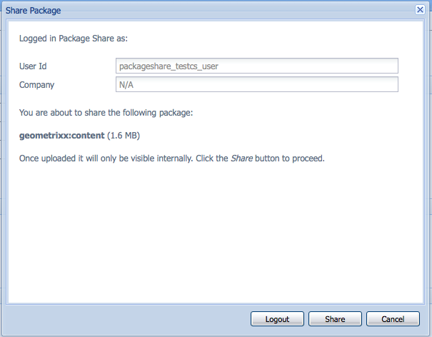

# Werken met pakketten{#how-to-work-with-packages}

Pakketten maken het importeren en exporteren van inhoud in de opslagplaats mogelijk. U kunt bijvoorbeeld pakketten gebruiken om nieuwe functionaliteit te installeren, inhoud tussen instanties over te brengen, en een back-up van inhoud in de opslagplaats te maken.

Pakketten kunnen op de volgende pagina&#39;s worden geopend en/of onderhouden:

* [Pakketbeheer](#package-manager), waarmee u de pakketten in uw lokale AEM-instantie kunt beheren.

* [Het Aandeel](#package-share)van het pakket, een gecentraliseerde server die zowel openbaar beschikbare pakketten als die privé aan uw bedrijf houdt. De openbare pakketten kunnen hotfixes, nieuwe functionaliteit, documentatie, enz. bevatten.

U kunt pakketten overbrengen tussen de Manager van het Pakket, het Aandeel van het Pakket, en uw dossiersysteem.

## Wat zijn pakketten? {#what-are-packages}

Een pakket is een gecomprimeerd bestand met opslagplaats-inhoud in de vorm van een serialisatie van het bestandssysteem (de zogenaamde &#39;vault&#39;-serienummering). Dit biedt een eenvoudig te gebruiken en te bewerken weergave van bestanden en mappen.

Pakketten bevatten inhoud, zowel pagina-inhoud als projectgerelateerde inhoud, die met filters is geselecteerd.

Een pakket bevat ook vault meta-informatie, met inbegrip van de filterdefinities en de informatie van de de invoerconfiguratie. Extra inhoudseigenschappen (die niet worden gebruikt voor het uitpakken van pakketten) kunnen in het pakket worden opgenomen, zoals een beschrijving, een visuele afbeelding of een pictogram. deze eigenschappen zijn uitsluitend bestemd voor de consument van het inhoudspakket en voor informatieve doeleinden .

>[!NOTE]
>
>Pakketten vertegenwoordigen de huidige versie van de inhoud op het moment dat het pakket wordt gemaakt. Ze bevatten geen eerdere versies van de inhoud die door AEM in de opslagplaats wordt bewaard.

U kunt de volgende handelingen uitvoeren op of met pakketten:

* Nieuwe pakketten maken; pakketinstellingen en -filters naar wens definiëren
* Voorvertoning van inhoud van pakket (vóór maken)
* Pakketten maken
* Pakketgegevens weergeven
* Pakketinhoud weergeven (na maken)
* De definitie van bestaande pakketten wijzigen
* Bestaande pakketten opnieuw samenstellen
* Pakketten terugbrengen
* Pakketten van AEM naar uw bestandssysteem downloaden
* Pakketten van uw bestandssysteem uploaden naar uw lokale AEM-instantie
* Inhoud van pakket valideren vóór installatie
* Een droge runtime installeren
* Pakketten installeren (AEM installeert pakketten niet automatisch na het uploaden)
* Pakketten verwijderen
* Download pakketten, zoals hotfixes, uit de bibliotheek van het Aandeel van het Pakket
* Pakketten uploaden naar het bedrijf-interne gedeelte van de bibliotheek van het Aandeel van het Pakket

## Pakketgegevens {#package-information}

Een pakketdefinitie bestaat uit verschillende soorten informatie:

* [Pakketinstellingen](#package-settings)
* [Pakketfilters](#package-filters)
* [Schermafbeeldingen verpakken](#package-screenshots)
* [Pakketpictogrammen](#package-icons)

### Pakketinstellingen {#package-settings}

U kunt een verscheidenheid van de Montages van het Pakket uitgeven om aspecten zoals de pakketbeschrijving, verwante insecten, gebiedsdelen en leveranciersinformatie te bepalen.

Het dialoogvenster **Pakketinstellingen** is beschikbaar via de knop **Bewerken** wanneer u een pakket [maakt](#creating-a-new-package) of [bewerkt](#viewing-and-editing-package-information) en bevat drie tabbladen voor de configuratie. Nadat u wijzigingen hebt aangebracht, klikt u op **OK** om deze op te slaan.


| **Veld** | **Beschrijving** |
|---|---|
| Naam | De naam van het pakket. |
| Groeperen | De naam van de groep waaraan het pakket moet worden toegevoegd, voor het ordenen van pakketten. Typ de naam van een nieuwe groep of selecteer een bestaande groep. |
| Versie | Tekst die voor de aangepaste versie moet worden gebruikt. |
| Beschrijving | Een korte beschrijving van het pakket. HTML-opmaak kan worden gebruikt voor opmaak. |
| Miniatuur | Het pictogram dat bij de pakketvermelding wordt weergegeven. Klik op Bladeren om een lokaal bestand te selecteren. |


<table>
 <tbody>
  <tr>
   <th><strong>Veld</strong></th>
   <th><strong>Beschrijving</strong></th>
   <th><strong>Indeling/Voorbeeld</strong></th>
  </tr>
  <tr>
   <td>Naam</td>
   <td>De naam van de provider.</td>
   <td><em>AEM Geometrixx<br /> </em></td>
  </tr>
  <tr>
   <td>URL</td>
   <td>URL van de provider.</td>
   <td><em>https://www.aem-geometrixx.com</em></td>
  </tr>
  <tr>
   <td>Koppeling</td>
   <td>Pakketspecifieke koppeling naar een providerpagina.</td>
   <td><em>https://www.aem-geometrixx.com/mypackage.html</em></td>
  </tr>
  <tr>
   <td>Vereisten<br /> </td>
   <td>
    <ul>
     <li>Beheerder: Selecteer wanneer het pakket alleen kan worden geïnstalleerd door een account met beheerdersrechten.</li>
     <li>Opnieuw starten: Selecteer wanneer de server opnieuw moet worden gestart nadat het pakket is geïnstalleerd.</li>
    </ul> </td>
   <td> </td>
  </tr>
  <tr>
   <td>Wisselstroomverwerking</td>
   <td><p>Geef op hoe de toegangsbeheerinformatie die in het pakket is gedefinieerd, wordt verwerkt wanneer het pakket wordt geïmporteerd:</p>
    <ul>
     <li><strong>Negeren</strong></li>
     <li><strong>Overschrijven</strong></li>
     <li><strong>Samenvoegen</strong></li>
     <li><strong>Wissen</strong></li>
     <li><strong>MergePreserve</strong></li>
    </ul> <p>The default value is <strong>Ignore</strong>.</p> </td>
   <td>
    <ul>
     <li><strong>Negeer</strong> - behoud ACLs in de bewaarplaats</li>
     <li><strong>Overschrijf</strong> - overschrijf ACLs in de bewaarplaats</li>
     <li><strong>Samenvoegen</strong> - voeg beide reeksen ACLs samen</li>
     <li><strong>Duidelijk</strong> - ontruim ACLs</li>
     <li><strong>MergePreserve</strong> - fusie toegangsbeheer in de inhoud met die voorzien van het pakket door de toegangsbeheeringangen van hoofden toe te voegen niet aanwezig in de inhoud</li>
    </ul> </td>
  </tr>
 </tbody>
</table>


| **Veld** | **Beschrijving** | **Indeling/Voorbeeld** |
|---|---|---|
| Getest met | De productnaam en versie van dit pakket zijn bedoeld voor of zijn compatibel met. | *AEM6* |
| Opgeloste problemen | Een tekstveld waarin u details kunt weergeven van bugs die zijn gecorrigeerd voor dit pakket. Vermeld elke bug op een aparte regel. | Overzicht van bug-nr |
| Afhankelijk van | Hiermee geeft u informatie over afhankelijkheden weer die moet worden gerespecteerd wanneer andere pakketten nodig zijn om het huidige pakket op de verwachte manier te laten uitvoeren. Dit veld is belangrijk bij het gebruik van hotfixes. | groupId:name:version |
| Vervangen | Een lijst met vervangen pakketten die door dit pakket worden vervangen. Controleer vóór de installatie of dit pakket alle benodigde inhoud uit de verouderde pakketten bevat, zodat er geen inhoud wordt overschreven. | groupId:name:version |

### Pakketfilters {#package-filters}

Filters identificeren de knooppunten in de opslagplaats die in het pakket moeten worden opgenomen. Een **filterdefinitie** geeft de volgende informatie op:

* Het **hoofdpad** van de inhoud die moet worden opgenomen.
* **Regels** die specifieke knooppunten onder het hoofdpad bevatten of uitsluiten.

Filters kunnen nul of meer regels bevatten. Als er geen regels zijn gedefinieerd, bevat het pakket alle inhoud onder het hoofdpad.

U kunt een of meer filterdefinities definiëren voor een pakket. Gebruik meerdere filters om inhoud van meerdere hoofdpaden op te nemen.


In de volgende tabel worden deze regels beschreven en worden voorbeelden gegeven:

<table>
 <tbody>
  <tr>
   <th> Type regel</th>
   <th>Beschrijving </th>
   <th>Voorbeeld </th>
  </tr>
  <tr>
   <td> include</td>
   <td>U kunt een pad definiëren of een reguliere expressie gebruiken om alle knooppunten op te geven die u wilt opnemen.<br /> Als u een map <br /> opneemt, wordt:
    <ul>
     <li>deze map <i></i> en alle bestanden en mappen in die map (dat wil zeggen de volledige substructuur) opnemen</li>
     <li><strong>geen</strong> andere bestanden of mappen van onder het opgegeven hoofdpad opnemen</li>
    </ul> </td>
   <td>/libs/sling/install(/.*)? </td>
  </tr>
  <tr>
   <td> uitsluiten</td>
   <td>U kunt een pad opgeven of een reguliere expressie gebruiken om alle knooppunten op te geven die u wilt uitsluiten.<br /> Als u een map <br /> uitsluit, worden die map <i></i> en alle bestanden en mappen in die map (dus de volledige substructuur) uitgesloten.<br /> </td>
   <td>/libs/wcm/foundation/components(/.*)?</td>
  </tr>
 </tbody>
</table>

>[!NOTE]
>
>Eén pakket kan meerdere filterdefinities bevatten, zodat knooppunten van verschillende locaties gemakkelijk in één pakket kunnen worden gecombineerd.

Pakketfilters worden meestal gedefinieerd wanneer u het pakket [voor het eerst](#creating-a-new-package)maakt, maar kunnen ook op een later tijdstip worden bewerkt (waarna het pakket opnieuw moet worden samengesteld).

### Schermafbeeldingen verpakken {#package-screenshots}

U kunt screenshots aan uw pakket vastmaken om een visuele vertegenwoordiging van te verstrekken wat de inhoud kijkt als; bijvoorbeeld door screenshots van nieuwe functionaliteit te geven.

### Pakketpictogrammen {#package-icons}

U kunt ook een pictogram aan het pakket toevoegen om een snelle visuele weergave van de inhoud van het pakket mogelijk te maken. Dit wordt vervolgens in de pakketlijst weergegeven en u kunt het pakket of de pakketklasse gemakkelijk herkennen.

Aangezien een pakket een pictogram kan bevatten, worden de volgende conventies gebruikt voor officiële pakketten:

>[!NOTE]
>
>Om verwarring te voorkomen, gebruikt u een beschrijvend pictogram voor uw pakket en geen van de officiële pictogrammen.

Officieel hotfix-pakket:


Officieel AEM-installatiepakket of extensiepakket:

Officiële kenmerkpakketten:


## Pakketbeheer {#package-manager}

Pakketbeheer beheert de pakketten in uw lokale AEM-installatie. Nadat u de noodzakelijke toestemmingen [hebt](#permissions-needed-for-using-the-package-manager) toegewezen kunt u de Manager van het Pakket voor diverse acties gebruiken, met inbegrip van het vormen, het bouwen, het downloaden en het installeren van uw pakketten. De belangrijkste te vormen elementen zijn:

* [Pakketinstellingen](#package-settings)
* [Pakketfilters](#package-filters)

### Machtigingen nodig voor het gebruik van Package Manager {#permissions-needed-for-using-the-package-manager}

Om gebruikers het recht te verlenen om pakketten tot stand te brengen, te wijzigen, te uploaden en te installeren, moet u hen de aangewezen toestemmingen bij de volgende plaatsen geven:

* **/etc/packages** (volledige rechten m.u.v. schrapping)
* het knooppunt dat de pakketinhoud bevat

Zie Machtigingen [](/help/sites-administering/security.md#setting-page-permissions) instellen voor instructies voor het wijzigen van machtigingen.

### Een nieuw pakket maken {#creating-a-new-package}

Een nieuwe pakketdefinitie maken:

1. Voor het welkomstscherm AEM, klik **Pakketten** (of van de console van **Hulpmiddelen** dubbelklik op **Pakketten**).

1. Selecteer vervolgens **Pakketbeheer**.
1. Klik op Pakket **** maken.

   >[!NOTE]
   >
   >Als uw instantie veel pakketten bevat, is er mogelijk een mapstructuur aanwezig, zodat u naar de vereiste doelmap kunt navigeren voordat u het nieuwe pakket maakt.

1. In het dialoogvenster:

   

   Voer het volgende in:

   * **Groepsnaam**

      De naam van de doelgroep (of map). Groepen zijn bedoeld om u te helpen uw pakketten ordenen.

      Er wordt een map voor de groep gemaakt als deze nog niet bestaat. Als u de groepsnaam leeg laat, wordt het pakket gemaakt in de hoofdpakketlijst (Home > Pakketten).

   * **Pakketnaam**

      De naam van het nieuwe pakket. Selecteer een beschrijvende naam om (en anderen) de inhoud van het pakket gemakkelijk te identificeren.

   * **Versie**

      Een tekstveld waarmee u een versie kunt aangeven. Deze wordt aan de pakketnaam toegevoegd met de naam van het ZIP-bestand.
   Klik op **OK** om het pakket te maken.

1. AEM geeft het nieuwe pakket weer in de juiste groepsmap.

   

   Klik op het pictogram of de pakketnaam om te openen.

   

   >[!NOTE]
   >
   >U kunt desgewenst later terugkeren naar deze pagina.

1. Klik op **Bewerken** om de [pakketinstellingen](#package-settings)te bewerken.

   Hier kunt u informatie toevoegen en/of bepaalde instellingen definiëren. dit zijn bijvoorbeeld een beschrijving , het [pictogram](#package-icons), verwante bugs en details over de provider .

   Klik op **OK** nadat u de instellingen hebt bewerkt.

1. Voeg naar wens **[screenshots](#package-screenshots)**toe aan het pakket. Eén instantie is beschikbaar wanneer het pakket wordt gemaakt. Voeg desgewenst meer toe met de **schermafbeelding**van pakket van sidekick.

   Voeg de feitelijke afbeelding toe door te dubbelklikken op de afbeeldingscomponent in het gebied **Schermafbeeldingen** , een afbeelding toe te voegen en op **OK** te klikken.

1. Definieer de **[pakketfilters](#package-filters)**door instanties van de **filterdefinitie**van het zijpaneel te slepen en vervolgens te dubbelklikken om te openen voor bewerking:

   

   Opgeven:

   * **Basispad**: de inhoud die moet worden verpakt; dit kan de basis van een substructuur zijn.
   * **Regels** zijn facultatief; voor eenvoudige pakketdefinities is het niet nodig regels op te nemen of uit te sluiten .

      Indien nodig kunt u regels [**voor **opnemen** of **uitsluiten](#package-filters)definiëren om de pakketinhoud precies te definiëren.

      Voeg regels toe met behulp van het **+** -symbool, maar verwijder ook regels met behulp van het **-** -symbool. Regels worden toegepast op basis van hun volgorde, zodat ze naar wens worden geplaatst met de knoppen **Omhoog** en **Omlaag** .
   Klik vervolgens op **OK** om het filter op te slaan.

   >[!NOTE]
   >
   >U kunt zoveel filterdefinities gebruiken als u nodig hebt, maar zorg ervoor dat deze geen conflict veroorzaken. Gebruik **Voorvertoning** om te bevestigen wat de inhoud van het pakket zal zijn.

1. Om te bevestigen wat het pakket zal houden kunt u **Voorproef** gebruiken. Dit voert een droge looppas van het bouwstijlproces uit en maakt een lijst van alles die aan het pakket zal worden toegevoegd wanneer het eigenlijk wordt gebouwd.
1. U kunt nu uw pakket [maken](#building-a-package) .

   >[!NOTE]
   >
   >Het is niet verplicht om het pakket op dit moment te bouwen, het kan op een later tijdstip gebeuren.

### Een pakket maken {#building-a-package}

Een pakket wordt vaak gemaakt op hetzelfde moment als wanneer u de pakketdefinitie [](#creating-a-new-package)maakt, maar u kunt het pakket later opnieuw maken of bouwen. Dit kan handig zijn als de inhoud in de opslagplaats is gewijzigd.

>[!NOTE]
>
>Voordat u het pakket gaat maken, is het handig een voorvertoning van de inhoud van het pakket te bekijken. Klik hiervoor op **Voorvertoning**.

1. Open de pakketdefinitie via **Package Manager** (klik op het pictogram of de naam van het pakket).

1. Klik op **Samenstellen**. Er wordt een dialoogvenster weergegeven waarin u moet bevestigen dat u het pakket wilt maken.

   >[!NOTE]
   >
   >Dit is met name van belang wanneer u een pakket opnieuw opstelt omdat de inhoud van het pakket wordt overschreven.

1. Click **OK**. AEM bouwt het pakket en geeft alle inhoud weer die aan het pakket is toegevoegd. Wanneer AEM volledig is, wordt bevestigd dat het pakket is gemaakt en (wanneer u het dialoogvenster sluit) worden de gegevens in de pakketlijst bijgewerkt.

### Een pakket opnieuw inpakken {#rewrapping-a-package}

Nadat een pakket is gemaakt, kan het indien nodig opnieuw worden verpakt.

Wanneer u de pakketgegevens opnieuw inpakt, worden deze gewijzigd - *zonder* dat de pakketinhoud wordt gewijzigd. Pakketgegevens zijn de miniatuur, beschrijving, enzovoort, met andere woorden alles wat u kunt bewerken met het dialoogvenster **Pakketinstellingen** (om deze klik te openen, klikt u op **Bewerken**).

Een belangrijk gebruiksgeval voor omloop is wanneer het voorbereiden van een pakket voor het pakketaandeel. U hebt bijvoorbeeld een bestaand pakket en u wilt dit delen met anderen. Hiervoor wilt u een miniatuur toevoegen en een beschrijving toevoegen. In plaats van het hele pakket opnieuw te maken met alle functionaliteit (wat enige tijd kan duren en waarbij het risico bestaat dat het pakket niet meer identiek is aan het origineel), kunt u het pakket terugplaatsen en alleen de miniatuur en beschrijving toevoegen.

1. Open de pakketdefinitie via **Package Manager** (klik op het pictogram of de naam van het pakket).

1. Klik op **Bewerken** en werk de **[pakketinstellingen](#package-settings)**naar wens bij. Klik op **OK**om op te slaan.

1. Klik op **Omloop**, wordt om bevestiging gevraagd.

### Pakketgegevens weergeven en bewerken {#viewing-and-editing-package-information}

Informatie over een pakketdefinitie weergeven of bewerken:

1. Navigeer in Pakketbeheer naar het pakket dat u wilt weergeven.
1. Klik op het pakketpictogram van het pakket dat u wilt weergeven. Hiermee wordt de pakketpagina geopend met informatie over de pakketdefinitie:

   

   >[!NOTE]
   >
   >U kunt ook bepaalde handelingen op het pakket bewerken en uitvoeren vanaf deze pagina.
   >
   >Welke knoppen beschikbaar zijn, is afhankelijk van het feit of het pakket al dan niet is gemaakt.

1. Als het pakket al is samengesteld, klikt u op **Inhoud**, wordt een venster geopend met daarin de volledige inhoud van het pakket:

### Inhoud van pakket weergeven en installatie testen {#viewing-package-contents-and-testing-installation}

Nadat een pakket is gemaakt, kunt u de inhoud weergeven:

1. Navigeer in Pakketbeheer naar het pakket dat u wilt weergeven.
1. Klik op het pakketpictogram van het pakket dat u wilt weergeven. Hiermee wordt de pakketpagina geopend met informatie over de pakketdefinitie.

1. Als u de inhoud wilt weergeven en op **Inhoud** wilt klikken, wordt een venster geopend waarin de volledige inhoud van het pakket wordt weergegeven:

   

1. Klik op Installatie **testen om de installatie** op de droger uit te voeren. Nadat u de actie hebt bevestigd, wordt een venster geopend en worden de resultaten weergegeven alsof de installatie is uitgevoerd:

   

### Pakketten naar uw bestandssysteem downloaden {#downloading-packages-to-your-file-system}

In deze sectie wordt beschreven hoe u een pakket van AEM naar uw bestandssysteem kunt downloaden met **Package Manager**.

>[!NOTE]
>
>Zie [Pakket delen](#package-share) voor informatie over het downloaden van hotfixes, eigenschapspakketten, en pakketten van het openbare gebied en het interne gebied van het pakketaandeel van uw bedrijf.
>
>Vanuit Pakket delen kunt u:
>
>* U kunt pakketten rechtstreeks downloaden van [Package Share naar uw lokale AEM-instantie](#downloading-and-installing-packages-from-package-share).
   >  Na het downloaden wordt het pakket geïmporteerd in uw dataopslag, waarna u het pakket direct via **Package Manager** op uw lokale instantie kunt installeren. Deze pakketten bevatten hotfixes en andere gedeelde pakketten.
   >
   >
* Download pakketten van [Package Share naar uw bestandssysteem](#downloading-packages-to-your-file-system-from-package-share).
>


1. Klik in het welkomstscherm van AEM op **Pakketten** en selecteer **Pakketbeheer**.
1. Navigeer naar het pakket dat u wilt downloaden.

   

1. Klik op de koppeling die wordt gevormd door de naam van het ZIP-bestand (onderstreept) voor het pakket dat u wilt downloaden; bijvoorbeeld `export-for-offline.zip`.

   AEM downloadt het pakket naar uw computer (via een standaarddialoogvenster voor het downloaden van browsers).

### Pakketten uploaden vanuit uw bestandssysteem {#uploading-packages-from-your-file-system}

Met een pakketupload kunt u een pakket van uw bestandssysteem uploaden naar AEM Package Manager.

>[!NOTE]
>
>Zie Pakketten [uploaden naar het bedrijf-interne Aandeel](#uploading-packages-to-the-company-internal-package-share) van het Pakket om een pakket aan het privé gebied van uw bedrijf van het Aandeel van het Pakket te uploaden.

Een pakket uploaden:

1. Navigeer naar **Pakketbeheer**. Vervolgens naar de groepsmap waarin u het pakket wilt uploaden.

   

1. Klik op Pakket **uploaden**.

   

   * **Bestand**

      **U kunt de bestandsnaam rechtstreeks typen of de optie** Bladeren gebruiken... om het vereiste pakket in uw lokale bestandssysteem te selecteren (klik na de selectie op **OK**).

   * **Uploaden forceren**

      Als er al een pakket met deze naam bestaat, kunt u hierop klikken om het uploaden te forceren (en het bestaande pakket te overschrijven).
   Klik op **OK** , zodat het nieuwe pakket wordt geüpload en wordt weergegeven in de lijst Pakketbeheer.

   >[!NOTE]
   >
   >Als u de inhoud beschikbaar wilt maken voor AEM, moet u het pakket [](#installing-packages)installeren.

### Pakketten valideren {#validating-packages}

Voordat u een pakket installeert, dient u de inhoud ervan te controleren. Omdat de pakketten bedekte dossiers onder kunnen wijzigen `/apps` en/of toevoegen, wijzigen en ACLs verwijderen, is het vaak nuttig om deze veranderingen te bevestigen alvorens te installeren.

#### Validatieopties {#validation-options}

Het validatiemechanisme kan de volgende kenmerken van het pakket controleren:

* OSGi-pakket importeren
* Bedekkingen
* ACLs

Deze opties worden hieronder beschreven.

* **OSGi-pakketinvoer valideren**

   **Wat wordt gecontroleerd**

   Deze bevestiging inspecteert het pakket voor alle JAR dossiers (bundels OSGi), haalt hun `manifest.xml` (die de versioned gebiedsdelen bevat waarop genoemde bundel OSGi) steunt en verifieert de AEM instantie uitvoert genoemde gebiedsdelen met de correcte versies.

   **Hoe het is gemeld**

   Om het even welke versioned gebiedsdelen die niet door de instantie AEM kunnen worden tevredengesteld zijn vermeld in het Logboek **van de** Activiteit van de Manager van het Pakket.

   **Foutstatussen**

   Als de gebiedsdelen ontevreden zijn, dan zullen de bundels OSGi in het pakket met die gebiedsdelen niet beginnen. Dit resulteert in een gebroken toepassingsplaatsing aangezien om het even wat die op de niet-begonnen bundel OSGi baseert zal beurtelings niet behoorlijk functioneren.

   **Foutresolutie**

   Om fouten als gevolg van ontevreden OSGi-bundels op te lossen, moet de afhankelijkheidsversie in de bundel met ontevreden invoer worden aangepast.

* **Bedekkingen valideren**

   **Wat wordt gecontroleerd**

   Deze validatie bepaalt of het pakket dat wordt geïnstalleerd een bestand bevat dat al wordt bedekt in de AEM-doelinstantie.

   Als u bijvoorbeeld een bestaande overlay hebt bij `/apps/sling/servlet/errorhandler/404.jsp`, een pakket met `/libs/sling/servlet/errorhandler/404.jsp`een bestaande overlay, zodat het bestaande bestand bij wordt gewijzigd `/libs/sling/servlet/errorhandler/404.jsp`.

   **Hoe het is gemeld**

   Dergelijke overlays worden beschreven in het **activiteitenlogboek** van Package Manager.

   **Foutstatussen**

   Een foutstatus houdt in dat het pakket probeert een bestand te implementeren dat al is bedekt. De wijzigingen in het pakket worden dus overschreven (en dus &quot;verborgen&quot;) door de bedekking en worden niet van kracht.

   **Foutresolutie**

   Om dit probleem op te lossen, `/apps` moet de beheerder van het overlaybestand in de wijzigingen in het overlay-bestand in bekijken `/libs` en de wijzigingen naar wens opnemen in de overlay ( `/apps`) en het overlay-bestand opnieuw gebruiken.

   >[!NOTE]
   >
   >Het validatiemechanisme biedt geen enkele manier om te combineren als de overlay-inhoud correct is opgenomen in het overlaybestand. Daarom zal deze validatie ook na de nodige wijzigingen over conflicten blijven rapporteren.

* **ACLs bevestigen**

   **Wat wordt gecontroleerd**

   Deze bevestiging controleert welke toestemmingen worden toegevoegd, hoe zij zullen worden behandeld (samenvoegen/vervangen), en als de huidige toestemmingen zullen worden beïnvloed.

   **Hoe het is gemeld**

   De toestemmingen worden beschreven in het Logboek **van de** Activiteit van de Manager van het Pakket.

   **Foutstatussen**

   Er kunnen geen expliciete fouten worden opgegeven. De bevestiging wijst eenvoudig erop of om het even welke nieuwe ACL toestemmingen zullen worden toegevoegd of beïnvloed door het pakket te installeren.

   **Foutresolutie**

   Gebruikend de informatie die door de bevestiging wordt verstrekt, kunnen de beïnvloede knopen in CRXDE worden herzien en ACLs kan in het pakket aanpassen zoals nodig.

   >[!CAUTION]
   >
   >Als beste praktijken wordt het geadviseerd dat de pakketten niet AEM-Verstrekte ACLs zouden moeten beïnvloeden aangezien dit in onverwacht productgedrag kan resulteren.

#### Validatie uitvoeren {#performing-validation}

De validatie van pakketten kan op twee verschillende manieren worden uitgevoerd:

* Via de interface van Package Manager
* Via HTTP POST-aanvraag, zoals met cURL

>[!NOTE]
>
>Validatie moet altijd plaatsvinden na het uploaden van het pakket, maar voordat het wordt geïnstalleerd.

**Pakketvalidatie via pakketbeheer**

1. Open Package Manager op `https://<server>:<port>/crx/packmgr`
1. Selecteer het pakket in de lijst en selecteer vervolgens **Meer** vervolgkeuzelijst in de kop en **Valideren** in de vervolgkeuzelijst.

   >[!NOTE]
   >
   >Dit moet gebeuren nadat u het inhoudspakket hebt geüpload, maar voordat u het pakket installeert.

1. In het modale dialoogvenster dat dan wordt weergegeven, gebruikt u de selectievakjes om het type of de typen validatie te selecteren en de validatie te starten door op **Valideren** te klikken. U kunt ook op **Annuleren** klikken.

1. De gekozen validatie(s) worden dan uitgevoerd. De resultaten worden getoond in het activiteitenlogboek van de Manager van het Pakket.

**Pakketvalidatie via HTTP POST Request**

De POST-aanvraag heeft de volgende vorm.

```
https://<host>:<port>/crx/packmgr/service.jsp?cmd=validate&type=osgiPackageImports,overlays,acls
```

>[!NOTE]
>
>De `type` parameter kan elke door komma&#39;s gescheiden niet-geordende lijst zijn die bestaat uit:
>
>* `osgiPackageImports`
>* `overlays`
>* `acls`
>
>
De waarde van `type` default is ingesteld op `osgiPackageImports` if not passed.

Hieronder ziet u een voorbeeld van het gebruik van cURL voor het uitvoeren van een pakketvalidatie.

1. Als u cURL gebruikt, voert u een instructie uit die vergelijkbaar is met het volgende:

   ```shell
   curl -v -X POST --user admin:admin -F file=@/Users/SomeGuy/Desktop/core.wcm.components.all-1.1.0.zip 'http://localhost:4502/crx/packmgr/service.jsp?cmd=validate&type=osgiPackageImports,overlays,acls'
   ```

1. De gevraagde validatie wordt uitgevoerd en het antwoord wordt teruggestuurd als een JSON-object.

>[!NOTE]
>
>De reactie op een HTTP POST-validatieaanvraag is een JSON-object met de resultaten van de validatie.

### Pakketten installeren {#installing-packages}

Nadat u een pakket hebt geüpload, moet u de inhoud installeren. Om de pakketinhoud geïnstalleerd en functioneel te hebben, moet het allebei zijn:

* geladen in AEM ( [geüpload vanaf uw bestandssysteem](#uploading-packages-from-your-file-system) of [gedownload van pakketshare](#downloading-and-installing-packages-from-package-share))

* geïnstalleerd

>[!CAUTION]
>
>Als u een pakket installeert, kan bestaande inhoud worden overschreven of verwijderd. Upload een pakket alleen als u zeker weet dat de benodigde inhoud niet wordt verwijderd of overschreven.
>
>Als u de inhoud of de invloed van een pakket wilt zien, kunt u:
>
>* Voer een testinstallatie van de verpakking uit zonder de inhoud te wijzigen:
   >  Open het pakket (klik op het pictogram of de naam van het pakket) en klik op **Installeren** testen.
   >
   >
* Zie een lijst met pakketinhoud:
   >  Open het pakket en klik op **Inhoud**.
>


>[!NOTE]
>
>Onmiddellijk voor de installatie van het pakket wordt een pakket met momentopnamen gemaakt dat de inhoud bevat die wordt overschreven.
>
>Deze momentopname wordt opnieuw geïnstalleerd als/wanneer u het pakket verwijdert.

>[!CAUTION]
>
>Als u digitale elementen installeert, moet u:
>
>* Deactiveer eerst de WorkflowLauncher.
   >  Gebruik de het menuoptie van Componenten van de console OSGi om te deactiveren `com.day.cq.workflow.launcher.impl.WorkflowLauncherImpl`.
   >
   >
* Vervolgens activeert u de WorkflowLauncher opnieuw wanneer de installatie is voltooid.
>
>
Als u de WorkflowLauncher deactiveert, zorgt u ervoor dat het framework voor het importeren van middelen de elementen niet (onbedoeld) manipuleert bij de installatie.

1. Navigeer in Pakketbeheer naar het pakket dat u wilt installeren.

   Een **Install** knoop wordt getoond bij de kant van Pakketten die nog niet geïnstalleerd zijn.

   >[!NOTE]
   >
   >U kunt het pakket ook openen door op het bijbehorende pictogram te klikken om de knop **Installeren** daar te openen.

1. Klik op **Installeren** om de installatie te starten. In een dialoogvenster wordt bevestiging gevraagd en worden alle aangebrachte wijzigingen vermeld. Klik op **Sluiten** in het dialoogvenster als u klaar bent.

   Het woord **Geïnstalleerd** verschijnt naast het pakket nadat het is geïnstalleerd.

### Uploaden en installeren op basis van bestandssysteem {#file-system-based-upload-and-installation}

U kunt pakketten op een andere manier naar uw exemplaar uploaden en installeren. In uw dossiersysteem, hebt u een `crx-quicksart` omslag naast uw potje en `license.properties` dossier. U moet een map maken met de naam `install` onder `crx-quickstart`. Dan heb je iets als dit: `<aem_home>/crx-quickstart/install`

In deze installatiemap kunt u uw pakketten rechtstreeks toevoegen. Deze worden automatisch geüpload en geïnstalleerd op uw exemplaar. Wanneer het wordt gedaan, kunt u de pakketten in de Manager van het Pakket zien.

Als uw exemplaar loopt, zal het toevoegen van een pakket aan de `install` omslag direct het uploaden en de installatie op de instantie lanceren. Als de instantie niet actief is, worden de pakketten die u in de `install` map plaatst, bij het opstarten in alfabetische volgorde geïnstalleerd.

>[!NOTE]
>
>U kunt dit ook doen voordat u de instantie voor de eerste keer start. Hiervoor moet u de `crx-quickstart` map handmatig maken, de `install` map eronder maken en de pakketten daar plaatsen. Wanneer u uw exemplaar vervolgens voor het eerst start, worden de pakketten in alfabetische volgorde geïnstalleerd.

### Pakketten verwijderen {#uninstalling-packages}

Met AEM kunt u pakketten verwijderen. Deze actie keert de inhoud van de bewaarplaats terug die aan de momentopname wordt beïnvloed die onmiddellijk voorafgaand aan de pakketinstallatie wordt gemaakt.

>[!NOTE]
>
>Na de installatie wordt een pakket met momentopnamen gemaakt dat de inhoud bevat die wordt overschreven.
>
>Dit pakket wordt opnieuw geïnstalleerd wanneer u het pakket verwijdert.

1. Navigeer in Pakketbeheer naar het pakket dat u wilt verwijderen.
1. Klik op het pakketpictogram van het pakket dat u wilt verwijderen.
1. Klik op **Verwijderen** om de inhoud van dit pakket uit de opslagplaats te verwijderen. In een dialoogvenster wordt bevestiging gevraagd en worden alle aangebrachte wijzigingen vermeld. Klik op **Sluiten** in het dialoogvenster als u klaar bent.

### Pakketten verwijderen {#deleting-packages}

Een pakket verwijderen uit de lijst(en) in Package Manager:

>[!NOTE]
>
>De geïnstalleerde bestanden/knooppunten uit het pakket worden **niet** verwijderd.

1. Vouw in de **gereedschapsconsole** de map **Packages** uit om het pakket in het rechterdeelvenster weer te geven.

1. Klik op het pakket dat u wilt verwijderen, zodat het wordt gemarkeerd en vervolgens op een van de volgende manieren:

   * Klik op **Verwijderen** in het werkbalkmenu.
   * Klik met de rechtermuisknop en selecteer **Verwijderen**.
   

1. AEM vraagt om bevestiging dat u het pakket wilt schrappen. Klik op **OK** om de verwijdering te bevestigen.

>[!CAUTION]
>
>Als dit pakket al is geïnstalleerd, wordt de *geïnstalleerde* inhoud **niet** verwijderd.

### Pakketten repliceren {#replicating-packages}

Kopieer de inhoud van een pakket en installeer het naar de publicatie-instantie:

1. Navigeer in **Pakketbeheer** naar het pakket dat u wilt repliceren.

1. Klik op het pictogram of de naam van het pakket dat u wilt repliceren om het uit te vouwen.
1. Selecteer **Repliceren** in het keuzemenu Meer **** op de werkbalk.

## Pakket delen {#package-share}

Het Aandeel van het Pakket is een gecentraliseerde server die openbaar wordt gemaakt om inhoud-Pakketten te delen.

Met Pakket delen kunt u deze pakketten downloaden, waaronder officiële hotfixes, functiesets, updates of voorbeeldinhoud die door andere gebruikers is gegenereerd.

U kunt pakketten ook uploaden en delen binnen uw bedrijf.

### Toegang tot delen pakket {#access-to-package-share}

Er is geen anonieme toegang tot het Aandeel van het Pakket; dat wil zeggen dat alleen geregistreerde gebruikers pakketten mogen weergeven, downloaden en uploaden.

De toegang tot het Aandeel van het Pakket is beschikbaar voor onze partners en klanten. Er moeten registratiegegevens worden ingediend om toegangsrechten te kunnen toewijzen.

Toegang krijgen tot delen pakket:

* De pagina [Aanmelden gebruiken](#signing-in-to-package-share)
* De eerste keer dat u de aanmeldpagina gebruikt, moet u:

   * [Registreren voor een Adobe-id](#registering-for-package-share) en/of uw bestaande Adobe-id [valideren](#validating-your-adobe-id)
   * zodat uw account voor delen van [pakket](#package-share-account) kan worden gemaakt

>[!NOTE]
>
>Om het even welke gebruiker van het Aandeel van het Pakket die niet aan een klant is toegewezen, moet zich bij een gemeenschap aansluiten om die middelen te zien door **zich bij** te klikken naast login van het pakketaandeel.

#### Aanmelden bij Delen van pakket {#signing-in-to-package-share}

1. Klik in het welkomstscherm van AEM op **Gereedschappen**.
1. Selecteer vervolgens **Pakket delen**. U moet:

   * aanmelden met uw Adobe-id
   * [Een Adobe-id maken](#registering-for-package-share)
   >[!NOTE]
   >
   >De eerste keer dat u zich aanmeldt met uw Adobe-id, moet u de [validatie van uw e-mailadres](#validating-your-adobe-id)voltooien.

   >[!NOTE]
   >
   >Als u uw wachtwoord bent vergeten, gebruikt u de koppeling [Help-pagina](https://enterprise-dev.adobe.com/content/edev/en/registration/account.html) &#39;s (ook in het dialoogvenster Aanmelden).

#### Adobe-id valideren {#validating-your-adobe-id}

De eerste keer dat u zich aanmeldt bij Delen via pakket met uw Adobe-id, wordt uw e-mailadres gevalideerd.

1. U ontvangt een e-mail met een koppeling.
1. Klik op deze koppeling.
1. Er wordt een webpagina geopend.

   De handeling waarbij deze webpagina wordt geopend, wordt uitgevoerd als validatie.

1. Aanmelden gaat door.

1. U ontvangt een e-mail met een koppeling.
1. Klik op deze koppeling.
1. Er wordt een webpagina geopend. De handeling waarbij deze webpagina wordt geopend, wordt uitgevoerd als validatie.
1. Aanmelden gaat door.

#### Registreren voor delen pakket {#registering-for-package-share}

Als u toegang tot het Delen van pakketten nodig hebt, moet u zich registreren voor een Adobe-id:

* De aanmeldingspagina [voor delen van](#signing-in-to-package-share) pakket bevat een koppeling voor het registreren van een Adobe-id.
* U kunt zich vanuit bepaalde Adobe-bureaubladsoftware registreren voor een Adobe-id.
* U kunt zich ook online registreren op de [Adobe-pagina](https://www.adobe.com/cfusion/membership/index.cfm?nf=1&nl=1)Aanmelden.

Een Adobe-id kan worden gemaakt door het volgende op te geven:

* uw e-mailadres
* een wachtwoord naar keuze
* aanvullende informatie zoals uw naam en land van verblijf

#### Pakket delen-account {#package-share-account}

De geldigheid van de toepassing wordt gecontroleerd voordat:

* Uw gebruikersaccount is gemaakt met de vereiste/toegestane machtigingen.
* Je account wordt toegevoegd aan de groep van je bedrijf.

>[!NOTE]
>
>Een gebruiker van één van onze partnerbedrijven kan ook een lid van zijn/haar klantengroepen zijn.

#### Netwerkoverwegingen {#network-considerations}

**IPv6**

U kunt problemen ervaren wanneer het proberen om tot het Aandeel van het Pakket van een zuivere milieu toegang te hebben IPv6.

Dit komt doordat pakketshare service is die wordt gehost op een server, wat betekent dat uw verbinding tot stand wordt gebracht via verschillende netwerken op internet. Er kan niet worden gegarandeerd dat alle aangesloten netwerken IPv6 ondersteunen; als niet de verbinding zou kunnen ontbreken.

Om deze kwestie te vermijden, kunt u tot het Aandeel van het Pakket van een IPv4 netwerk toegang hebben, het pakket downloaden en dan het uploaden aan het milieu IPv6.

**HTTP-proxy**

Delen van pakket is momenteel niet beschikbaar als uw bedrijf een http-proxy uitvoert waarvoor verificatie is vereist.

Delen van pakketten is alleen beschikbaar als uw AEM-server toegang heeft tot internet zonder dat verificatie is vereist. Om de volmacht voor alle diensten te vormen die de HTTP- cliënt (met inbegrip van pakketaandeel) gebruiken gebruik de configuratie [OSGi van de Client 3.1 van de Commons van de Dag van HTTP- Cliënt 3.1 bundel](/help/sites-deploying/osgi-configuration-settings.md).

### Binnen pakket delen {#inside-package-share}

In de pakketten van het Aandeel van het Pakket worden geschikt in boomsubstructuren:

* Adobe-pakketten van Adobe.
* Gedeelde pakketten die door andere bedrijven zijn geleverd en door Adobe zijn gepubliceerd.
* Uw bedrijfspakketten die privé zijn.


### Pakketten zoeken en filteren {#searching-and-filtering-packages}

Delen via pakket biedt een zoekbalk die u kunt gebruiken voor het zoeken naar specifieke trefwoorden of tags. Trefwoorden en tags ondersteunen meerdere waarden.

* Als u naar meerdere trefwoorden wilt zoeken, moet u elk trefwoord door een spatie scheiden.
* Als u naar meerdere tags wilt zoeken, moet u elk label in de pakketstructuur selecteren.

U kunt de voorwaardelijke operator ook wijzigen van OR in AND aan de rechterkant van de filteroverzichtbalk.

### Pakketten downloaden en installeren vanuit Pakketdeling {#downloading-and-installing-packages-from-package-share}

Om pakketten van het Aandeel van het Pakket te downloaden en hen op uw lokale instantie te installeren, is het gemakkelijker om tot het Aandeel van het Pakket van uw instantie toegang te hebben AEM. Hiermee wordt het pakket gedownload en onmiddellijk geregistreerd in uw Package Manager, vanwaar het kan worden geïnstalleerd.

1. Klik in het welkomstscherm van AEM op **Gereedschappen** en selecteer **Pakket delen** om de pagina Pakket delen te openen.
1. Meld u aan bij Pakket delen met uw accountgegevens. De openingspagina wordt weergegeven met een overzicht van de Adobe-map, de Gedeelde map en een specifieke pagina voor uw bedrijf.

   >[!NOTE]
   >
   >Voordat u pakketten gaat downloaden van Package Share, moet u controleren of u de [vereiste toegang](#access-to-package-share)hebt.

1. Navigeer naar het pakket dat u wilt downloaden en klik op **Downloaden**.

1. Ga terug of navigeer naar **Package Manager** op uw AEM-instantie. Navigeer vervolgens naar het pakket dat u net hebt gedownload.

   >[!NOTE]
   >
   >Als u het pakket wilt zoeken dat u hebt gedownload, volgt u hetzelfde pad als in Pakket delen. Bijvoorbeeld, als u een pakket van de volgende weg in het Aandeel van het Pakket downloadt:
   >
   >**Pakketten** > **Openbaar** > **Hotfixes**
   Vervolgens wordt het pakket in Package Manager op uw lokale instantie ook weergegeven onder:
   **Pakketten** > **Openbaar** > **Hotfixes**

1. Klik op **Installeren** om het pakket te installeren in uw lokale AEM-installatie.

   >[!NOTE]
   Als het pakket al op uw exemplaar is geïnstalleerd, verschijnt de **Geïnstalleerde** indicator naast het pakket in plaats van de **Install** knoop.

   >[!CAUTION]
   Door een pakket te installeren, kan bestaande inhoud in de opslagplaats worden overschreven. Daarom adviseren wij dat u eerst een **Test uitvoert installeert** . Op deze manier kunt u controleren of de inhoud van het pakket conflicten oplevert met uw bestaande inhoud.

### Pakketten naar uw bestandssysteem downloaden vanuit het delen van pakketten {#downloading-packages-to-your-file-system-from-package-share}

[Het downloaden en installeren](#downloading-and-installing-packages-from-package-share) is heel handig, maar als dat nodig is, kunt u het pakket ook downloaden en opslaan in uw lokale bestandssysteem:

1. Klik in Pakket delen op het pictogram of de naam van het pakket.
1. Klik op het tabblad **Middelen** .
1. Klik op **Downloaden naar schijf**.

### Een pakket uploaden {#uploading-a-package}

Met het Aandeel van het Pakket, kunt u pakketten uploaden aan uw bedrijf-intern gebied van pakketaandeel. Hierdoor kunnen ze worden gedeeld binnen uw bedrijf.

Deze pakketten zijn *niet* beschikbaar voor de algemene AEM-community, maar zijn beschikbaar voor alle gebruikers die zijn geregistreerd bij uw bedrijf.

Om pakketten te uploaden uw bedrijf-interne Delen van het Pakket:

>[!CAUTION]
Als u een pakket wilt uploaden naar Package Share, moet u eerst een groepsmap maken die naar uw bedrijf in uw lokale pakketbeheer wordt genoemd. Bijvoorbeeld geometrixx. Alle pakketten die voor delen moeten worden geüpload, moeten in deze groepsmap worden geplaatst.
Pakketten in de thuislijst van Package Manager of in andere mappen kunnen niet worden gedeeld.

1. Open **Pakketbeheer** en navigeer naar het pakket dat u wilt uploaden.

1. Klik op het pakketpictogram om het te openen.
1. Klik op **Delen** om het dialoogvenster voor het uploaden van het pakket naar Delen in pakket te openen.
1. Als u nog niet bent aangemeld bij Delen van pakket, moet u uw aanmeldingsgegevens invoeren.

   Wanneer u bent aangemeld, geeft AEM details weer over het te uploaden pakket:

   

1. Klik op **Delen** om het pakket te uploaden naar het interne pakket voor delen van uw bedrijf.

   AEM geeft de status weer en geeft aan wanneer het pakket klaar is met uploaden. Vervolgens kunt u op de **x** (rechterbovenhoek) klikken om het venster **Share Package** (Pakketdelen) te sluiten.

1. Nadat het uploaden is voltooid, kunt u naar de interne map van uw bedrijf navigeren om het pakket te zien dat u net hebt gedeeld.

>[!NOTE]
Als u een pakket wilt wijzigen dat beschikbaar is in Package Share, moet u het downloaden, opnieuw samenstellen en vervolgens opnieuw uploaden naar Package Share.

### Een pakket verwijderen {#deleting-a-package}

U kunt alleen pakketten verwijderen die u hebt geüpload door als volgt te werk te gaan:

1. Controleer in uw bedrijfsstructuur de pakketgroep die het pakket bevat.
1. Klik op het pakket.
1. Klik op de knop Verwijderen.

   

1. Klik op **Verwijderen** om te bevestigen dat u het pakket wilt verwijderen.

### Pakketten semi-privé maken {#making-packages-semi-private}

U kunt pakketten delen buiten uw organisatie, maar niet openbaar. Deze pakketten worden als semi-particulier beschouwd. Voor het delen van deze semi-persoonlijke pakketten hebt u hulp nodig van de ondersteuning van Adobe. Hiertoe opent u een ticket met de ondersteuning van Adobe en vraagt u een pakket beschikbaar te stellen buiten uw organisatie. Ze vragen u om een lijst met Adobe-id&#39;s die u toegang tot uw pakketten wilt verlenen.

## Softwaredistributie (bèta) {#software-distribution-beta}

[Softwaredistributie](https://downloads.experiencecloud.adobe.com) is de nieuwe gebruikersinterface die is ontworpen om het zoeken en downloaden van AEM-pakketten te vereenvoudigen. Het is momenteel in bètastatus en is alleen toegankelijk voor Adobe Managed Services en AEM als klanten van de Cloud Service en voor Adobe-werknemers.

>[!NOTE]
* [Het Aandeel](#package-share) van het pakket zal in verrichtingen blijven tot alle klanten toegang tot de Distributie van de Software hebben.
* Alle pakketten zijn beschikbaar bij zowel het Aandeel van het Pakket als de Distributie van de Software.


>[!CAUTION]
AEM-pakketbeheer is momenteel niet bruikbaar met Software Distribution, u downloadt uw pakketten naar uw lokale schijf.

