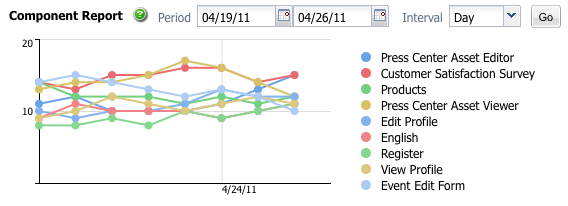
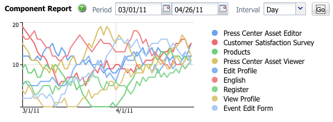
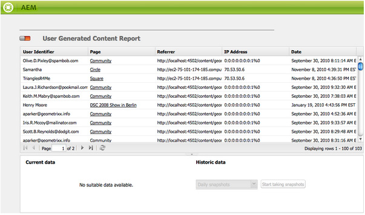

# Rapportage {#reporting}

Om u te helpen de staat van uw instantie controleren en analyseren, verstrekt Adobe Experience Manager (AEM) een selectie van standaardrapporten, die voor uw individuele vereisten kunnen worden gevormd:

* [Componentrapport](#component-report)
* [Schijfgebruik](#disk-usage)
* [Health Check](#health-check)
* [Rapport Paginaactiviteit](#page-activity-report)
* [Rapport Door gebruiker gegenereerde inhoud](#user-generated-content-report)
* [Gebruikersrapport](#user-report)
* [Rapport voor werkstroominstantie](#workflow-instance-report)
* [Workflowrapport](#workflow-report)

>[!NOTE]
>
>Deze rapporten zijn alleen beschikbaar in de klassieke gebruikersinterface. Voor systeemcontrole en rapportering in de moderne UI, zie [Operations-dashboard.](/help/sites-administering/operations-dashboard.md)

Alle rapporten zijn toegankelijk via de **Gereedschappen** console. Selecteren **Rapporten** in de linkerruit, dan klik het vereiste rapport in de juiste ruit tweemaal zodat kunt u het voor het bekijken, of configuratie, of allebei openen.

Nieuwe exemplaren van een rapport kunnen ook worden gemaakt op basis van de **Gereedschappen** console. Selecteren **Rapporten** in het linkervenster, dan **Nieuw...** op de werkbalk. Een **Titel** en **Naam** selecteert u het gewenste rapporttype en klikt u op **Maken**. Uw nieuwe rapportexemplaar verschijnt in de lijst. Dubbelklik op deze knop om deze te openen en sleep vervolgens een component van de assistent, zodat u de eerste kolom kunt maken en de rapportdefinitie kunt starten.

>[!NOTE]
>
>Naast de standaard AEM rapporten die beschikbaar zijn uit de doos, kunt u [uw eigen (nieuwe) rapporten ontwikkelen](/help/sites-developing/dev-reports.md).

## De grondbeginselen van de Aanpassing van het Rapport {#the-basics-of-report-customization}

Er zijn verschillende indelingen voor rapporten beschikbaar. De volgende rapporten allen gebruiken kolommen die zoals gedetailleerd in de volgende secties kunnen worden aangepast:

* [Componentrapport](#component-report)
* [Rapport Paginaactiviteit](#page-activity-report)
* [Rapport Door gebruiker gegenereerde inhoud](#user-generated-content-report)
* [Gebruikersrapport](#user-report)
* [Rapport voor werkstroominstantie](#workflow-instance-report)

>[!NOTE]
>
>De volgende rapporten hebben elk hun eigen formaat en aanpassing:
>
>
>* [Health Check](#health-check) gebruikt selectievelden om de gegevens op te geven waarover u wilt rapporteren.
>* [Schijfgebruik](#disk-usage) gebruikt koppelingen om de structuur van de opslagplaats verder te doorlopen.
>* [Workflow](/help/sites-administering/reporting.md#workflow-report) geeft een overzicht van de workflows die op uw instantie worden uitgevoerd.
>
>De volgende procedures voor de kolomconfiguratie zijn dus niet geschikt. Zie de beschrijvingen van de afzonderlijke rapporten voor hun details.

### De gegevenskolommen selecteren en plaatsen {#selecting-and-positioning-the-data-columns}

Kolommen kunnen worden toegevoegd aan, verplaatst naar of verwijderd uit een van de rapporten, standaard of aangepast.

De **Componenten** tabblad van de assistent (beschikbaar op de rapportpagina) bevat een lijst met alle gegevenscategorieën die als kolommen kunnen worden geselecteerd.

De gegevensselectie wijzigen:

* als u een kolom wilt toevoegen, sleept u de vereiste component van de zijkant naar de gewenste positie

   * een groene markering geeft aan wanneer de positie geldig is en een paar pijlen geeft precies aan waar de positie wordt geplaatst
   * een rood niet-go symbool geeft aan dat de positie ongeldig is

* als u een kolom wilt verplaatsen, klikt u op de kop, houdt u de muisknop ingedrukt en sleept u de kolom naar de nieuwe positie
* Als u een kolom wilt verwijderen, klikt u op de kolomtitel, houdt u de muisknop ingedrukt en sleept u omhoog naar het kopgebied van het rapport (een rood min-symbool geeft aan dat de positie niet geldig is). Laat de muisknop los en in het dialoogvenster Componenten verwijderen wordt u gevraagd te bevestigen dat u de kolom echt wilt verwijderen.

### Vervolgkeuzemenu Kolom {#column-drop-down-menu}

Elke kolom in het rapport heeft een drop-down menu. Dit wordt zichtbaar wanneer de muiscursor over de cel van de kolomtitel beweegt.

Er verschijnt een pijlkop helemaal rechts van de titelcel (niet te verwarren met de pijlkop direct rechts van de titeltekst die de [huidig sorteermechanisme](#sorting-the-data)).

Welke opties beschikbaar zijn in het menu, is afhankelijk van de configuratie van de kolom (zoals die tijdens de projectontwikkeling is gemaakt). Eventuele ongeldige opties worden grijs weergegeven.

### De gegevens sorteren {#sorting-the-data}

De gegevens kunnen volgens een specifieke kolom worden gesorteerd door:

* klikken op de juiste kolomkop; bij het sorteren wordt geschakeld tussen oplopend en aflopend, hetgeen wordt aangegeven door een pijlkop direct naast de titeltekst
* gebruiken [vervolgkeuzemenu van kolom](#column-drop-down-menu) om specifiek te selecteren of **Sorteren op oplopend** of **Sorteren op aflopend** Dit wordt ook hier aangegeven door een pijlkop direct naast de titeltekst

### Groepen en het huidige gegevensdiagram {#groups-and-the-current-data-chart}

In de juiste kolommen kunt u **Groeperen op deze kolom** van de [vervolgkeuzemenu van kolom](#column-drop-down-menu). Hiermee worden de gegevens gegroepeerd op basis van elke afzonderlijke waarde in die kolom. U kunt meerdere kolommen selecteren die u wilt groeperen. De optie wordt grijs weergegeven wanneer de gegevens in de kolom niet geschikt zijn. Dat wil zeggen dat elke vermelding afzonderlijk en uniek is, zodat er geen groepen kunnen worden gevormd. Bijvoorbeeld, de kolom van de Gebruiker - identiteitskaart van het gebruikersrapport.

Nadat ten minste één kolom is gegroepeerd, wordt een cirkeldiagram van **Huidige gegevens** wordt gegenereerd op basis van deze groepering. Als er meerdere kolommen zijn gegroepeerd, wordt dit aangegeven in het diagram.

Wanneer u de cursor over het cirkeldiagram verplaatst, wordt de samengevoegde waarde voor het desbetreffende segment weergegeven. Hierbij wordt het aggregaat gebruikt dat momenteel voor de kolom is gedefinieerd, bijvoorbeeld aantal, minimum, gemiddelde.

### Filters en aggregaten {#filters-and-aggregates}

Voor aangewezen kolommen, kunt u ook vormen **Filterinstellingen** en/of **Aggregaten** van de [vervolgkeuzemenu van kolom](#column-drop-down-menu).

#### Filters {#filters}

Met filterinstellingen kunt u de criteria opgeven voor items die moeten worden weergegeven. De beschikbare operatoren zijn:

* `contains`
* `equals`

Een filter instellen:

1. Selecteer de gewenste operator in de vervolgkeuzelijst.
1. Voer de tekst in waarop u wilt filteren.
1. Klikken **Toepassen**.

Het filter deactiveren:

1. Verwijder de filtertekst.
1. Klikken **Toepassen**.

#### Aggregaten {#aggregates}

U kunt ook een aggregatiemethode selecteren (deze kan afhankelijk van de geselecteerde kolom variëren):

### Kolomeigenschappen {#column-properties}

Deze optie is alleen beschikbaar als de optie [Algemene kolom](#generic-column) is gebruikt in de [Gebruikersrapport](#user-report).

### Historische gegevens {#historic-data}

Een grafiek van de verandering in uw gegevens in tijd kan onder worden gezien **Historische gegevens**. Dit is afgeleid van momentopnamen die met regelmatige intervallen worden genomen.

Gegevens zijn:

* Verzameld door, indien beschikbaar, de eerste gesorteerde kolom, anders de eerste (niet-gegroepeerde) kolom
* Gegroepeerd door de desbetreffende kolom

Het rapport kan worden gegenereerd:

1. Set **Groepering** in de vereiste kolom.
1. **Bewerken** de configuratie zodat kunt u uren of dagelijkse momentopnamen bepalen.
1. **Voltooien...** de definitie waarmee de verzameling van momentopnamen wordt gestart.

   De rode/groene schuifknop linksboven geeft aan wanneer momentopnamen worden verzameld.

Het resulterende diagram wordt rechtsonder weergegeven:

Wanneer de gegevensinzameling begint, kunt u selecteren:

* **Periode**

  U kunt van en tot data voor de rapportgegevens selecteren om te tonen.

* **Interval**

  Maand, Week, Dag, Uur kan worden geselecteerd voor de schaal en de samenvoeging van het rapport.

  Bijvoorbeeld, als dagmomentopnamen voor Februari 2011 beschikbaar zijn:

   * Als het interval is ingesteld op `Day`Elke momentopname wordt weergegeven als één waarde in het diagram.
   * Als het interval is ingesteld op `Month`Alle momentopnamen voor februari worden samengevoegd tot één waarde (weergegeven als één punt in het diagram).

Selecteer uw vereisten en klik vervolgens op **Ga** om ze op het verslag toe te passen. Als u de weergave wilt bijwerken nadat verdere momentopnamen zijn gemaakt, klikt u op **Ga** opnieuw.

Wanneer momentopnamen worden verzameld, kunt u:

* Gebruiken **Voltooien...** opnieuw om de verzameling opnieuw te initialiseren.

  **Voltooien** &quot;bevriest&quot;de structuur van het rapport (namelijk de kolommen die aan het rapport worden toegewezen en die worden gegroepeerd, gesorteerd, gefiltreerd, etc.) en begint momentopnamen te nemen.

* Open de **Bewerken** zodat u **Geen gegevensmomentopnamen** om de inzameling te beëindigen tot vereist.

  **Bewerken** schakelt alleen het maken van momentopnamen in of uit. Als het nemen van momentopnamen opnieuw wordt aangezet, gebruikt het de staat van het rapport toen het voor het laatst voor het nemen van verdere momentopnamen werd gebeëindigd.

>[!NOTE]
>
>Momentopnamen worden opgeslagen onder `/var/reports/...` waar de rest van de weg de weg van het respectieve rapport en identiteitskaart weerspiegelt die werd gecreeerd toen het rapport werd gebeëindigd.
>
>
>U kunt oude momentopnamen handmatig leegmaken als u zeker weet dat u deze instanties niet meer nodig hebt.

>[!NOTE]
>
>De vooraf geconfigureerde rapporten zijn niet prestatieintensief, maar het wordt nog steeds aanbevolen dagelijkse momentopnamen te gebruiken in een productieomgeving. Voer indien mogelijk deze dagelijkse momentopnamen uit op een tijdstip dat er niet veel activiteit is op uw website. Dit kan worden gedefinieerd met de `Daily snapshots (repconf.hourofday)` parameter for **CQ-rapportconfiguratie op dag**. Zie [OSGI-configuratie](/help/sites-deploying/configuring-osgi.md) voor meer details over hoe te om dit te vormen.

#### Limieten weergeven {#display-limits}

Het historische gegevensrapport kan ook enigszins van uiterlijk veranderen als gevolg van limieten die kunnen worden ingesteld, afhankelijk van het aantal resultaten voor de geselecteerde periode.

Elke horizontale lijn is gekend als reeks (en beantwoordt aan een ingang in de grafieklegende), vertegenwoordigt elke verticale kolom van punten de bijeengevoegde momentopnamen.

Om het diagram langer schoon te houden, zijn er grenzen die kunnen worden vastgesteld. Voor de standaardrapporten zijn deze:

* horizontale reeks - zowel standaard als maximum systeem is `9`

* verticale samengevoegde momentopnamen - standaard is `35` (per horizontale serie)

Wanneer de (passende) grenswaarden worden overschreden:

* de punten worden niet weergegeven
* de legenda voor de historische gegevenstabel zou een verschillend aantal ingangen aan dat van de huidige gegevensgrafiek kunnen tonen

De aangepaste rapporten kunnen ook tonen **Totaal** waarde voor alle reeksen. Dit wordt getoond als reeks (horizontale lijn en ingang in de legenda).

>[!NOTE]
>
>Voor aangepaste rapporten kunnen de limieten anders worden ingesteld.

### Bewerken (rapport) {#edit-report}

De **Bewerken** de knop opent **Rapport bewerken** Dialoogvenster.

Dit is één locatie waar de periode voor het verzamelen van momentopnamen voor [Historische gegevens](#historic-data) is gedefinieerd, maar er kunnen ook diverse andere instellingen worden gedefinieerd:

* **Titel**

  U kunt uw eigen titel definiëren.

* **Beschrijving**

  U kunt uw eigen beschrijving definiëren.

* **Basispad** (*alleen actief voor bepaalde rapporten*)

  Gebruik dit om het rapport te beperken tot een (sub-) sectie van de repository.

* **Rapportverwerking**

   * **gegevens automatisch vernieuwen**

     De rapportgegevens worden verfrist telkens als u de rapportdefinitie bijwerkt.

   * **gegevens handmatig vernieuwen**

     Deze optie kan worden gebruikt om vertragingen te verhinderen die door automatisch worden veroorzaakt verfrist verrichtingen wanneer er een groot volume van gegevens is.

     Het selecteren van dit wijst erop dat de rapportgegevens manueel moeten worden verfrist wanneer om het even welk aspect van de rapportconfiguratie is veranderd. Het betekent ook dat wanneer u om het even welk aspect van de configuratie verandert, de rapportlijst wordt gewist uit.

     Als deze optie is geselecteerd, wordt **[Gegevens laden](#load-data)** wordt weergegeven (naast **Bewerken** over het verslag). **Gegevens laden** laadt de gegevens en vernieuw de getoonde rapportgegevens.

* **Momentopnamen**
U kunt bepalen hoe vaak momentopnamen moeten worden gemaakt; dagelijks, uur of helemaal niet.

### Gegevens laden {#load-data}

De **Gegevens laden** de knop is alleen zichtbaar wanneer **gegevens handmatig vernieuwen** is geselecteerd uit **[Bewerken](#edit-report)**.

Klikken **Gegevens laden** herlaadt de gegevens en werkt het rapport bij dat wordt getoond.

Als u selecteert om gegevens handmatig te vernieuwen, betekent dit dat:

1. Wanneer u de rapportconfiguratie verandert, wordt de lijst van rapportgegevens leeg gemaakt.

   Als u bijvoorbeeld het sorteermechanisme voor een kolom wijzigt, worden de gegevens niet weergegeven.

1. Als u de rapportgegevens opnieuw wilt tonen, moet u klikken **Gegevens laden** om de gegevens opnieuw te laden.

### Voltooien (rapport) {#finish-report}

Wanneer u **Voltooien** het verslag :

* De rapportdefinitie *vanaf dat tijdstip* wordt gebruikt voor het maken van momentopnamen. Daarna, kunt u aan een rapportdefinitie blijven werken omdat het van de momentopnamen gescheiden is.
* Eventuele bestaande momentopnamen worden verwijderd.
* Nieuwe momentopnamen worden verzameld voor de [Historische gegevens](#historic-data).

Met dit dialoogvenster kunt u uw eigen titel en beschrijving voor het resulterende rapport definiëren of bijwerken.

## Rapporttypen {#report-types}

### Componentrapport {#component-report}

Het componentenrapport bevat informatie over hoe uw website de componenten gebruikt.

[Kolommen met informatie](#selecting-and-positioning-the-data-columns) informatie:

* Auteur
* Componentpad
* Componenttype
* Laatst gewijzigd
* Pagina

Dit betekent dat u het volgende kunt zien:

* Welke componenten worden gebruikt en waar zij worden gebruikt.

  Nuttig, bijvoorbeeld bij het testen.

* Hoe de instanties van een specifieke component worden verdeeld.

  Dit kan interessant zijn als specifieke pagina&#39;s (dat wil zeggen, &quot;zware pagina&#39;s&quot;) prestatieproblemen ondervinden.

* Delen van de site identificeren met frequente/minder frequente wijzigingen.
* Zie hoe pagina-inhoud zich ontwikkelt in de loop van de tijd.

Alle componenten zijn inbegrepen, product-norm, en project-specifiek. Met de **Bewerken** kan ook een **Basispad** dat het uitgangspunt van het rapport bepaalt - alle componenten onder die wortel worden overwogen voor het rapport.

 

### Schijfgebruik {#disk-usage}

Het rapport van het schijfgebruik bevat informatie over de gegevens die in uw opslagplaats zijn opgeslagen.

Het rapport begint in de wortel (/) van de bewaarplaats; door een bepaalde tak te klikken die u neer binnen de bewaarplaats kunt boor (de huidige weg wordt weerspiegeld in de rapporttitel).

### Health Check {#health-check}

Dit rapport analyseert het huidige aanvraaglogboek:

`<cq-installation-dir>/crx-quickstart/logs/request.log`

Om u te helpen de duurste verzoeken binnen een bepaalde periode identificeren.

Om het rapport te produceren, kunt u het volgende specificeren:

* **Periode (uren)**

  Het aantal uren (in het verleden) dat moet worden geanalyseerd.

  Standaard: `24`

* **max. Resultaten**

  Maximumaantal uitvoerlijnen.

  Standaard: `50`

* **max. Verzoeken**

  Maximumaantal te analyseren verzoeken.

  Standaard: `-1` (alle)

* **E-mailadres**

  Resultaten naar een e-mailadres verzenden.

  Optioneel; standaard: leeg

* **Dagelijks uitvoeren om (uu:mm)**

  Specificeer een tijd voor het rapport dat automatisch dagelijks moet worden in werking gesteld.

  Optioneel; standaard: leeg

### Rapport Paginaactiviteit {#page-activity-report}

Het pagina-activiteitenrapport bevat een overzicht van de pagina&#39;s en de acties die erop zijn uitgevoerd.

[Kolommen met informatie](#selecting-and-positioning-the-data-columns) informatie:

* Pagina
* Tijd
* Type
* Gebruiker

Het gemiddelde dat u kunt controleren:

* De meest recente wijzigingen.
* Auteurs die aan specifieke pagina&#39;s werken.
* Pagina&#39;s die onlangs niet zijn gewijzigd, waardoor mogelijk actie nodig is.
* Pagina&#39;s die het meest of het minst vaak worden gewijzigd.
* Meest actieve of minst actieve gebruikers.

Het pagina activiteitenrapport neemt al zijn informatie van het controlelogboek. Door gebrek wordt de wortelweg gevormd aan het controlelogboek bij `/var/audit/com.day.cq.wcm.core.page`.

### Rapport Door gebruiker gegenereerde inhoud {#user-generated-content-report}

Dit rapport bevat informatie over door gebruikers gegenereerde inhoud, zoals opmerkingen, beoordelingen of forums.

[Kolommen met informatie](#selecting-and-positioning-the-data-columns) op:

* Datum
* IP-adres
* Pagina
* Referenter
* Type
* Gebruiker-id

Hiermee kunt u:

* Zie welke pagina&#39;s de meeste commentaren ontvangen.
* Bekijk een overzicht van alle opmerkingen die specifieke bezoekers van de site achterlaten. Mogelijk zijn de problemen gerelateerd.
* Realiseer of de nieuwe inhoud commentaren door te controleren veroorzaakt wanneer de commentaren op een pagina worden gemaakt.

### Gebruikersrapport {#user-report}

Dit rapport bevat informatie over alle gebruikers die een account en/of profiel hebben geregistreerd. Dit kan zowel auteurs binnen uw organisatie als externe bezoekers bevatten.

[Kolommen met informatie](#selecting-and-positioning-the-data-columns) (indien beschikbaar) informatie over:

* Leeftijd
* Land
* Domein
* E-mail
* Familienaam
* Geslacht
* [Algemeen](#generic-column)
* Voornaam
* Info
* Rente
* Taal
* NTLM-hashcode
* Gebruikersnaam

Hiermee kunt u:

* Bekijk de demografische spreiding van je gebruikers.
* Rapport over aangepaste velden die u hebt toegevoegd aan de profielen.

#### Algemene kolom {#generic-column}

De **Algemeen** de kolom is beschikbaar in het Rapport van de Gebruiker zodat u tot aangepaste informatie, gewoonlijk bij [gebruikersprofielen](/help/sites-administering/identity-management.md#profiles-and-user-accounts); bijvoorbeeld [Favoriete kleur, zoals wordt beschreven onder Velden toevoegen aan de profieldefinitie](/help/sites-administering/identity-management.md#adding-fields-to-the-profile-definition).

Het dialoogvenster Algemene kolom wordt geopend wanneer u een van de volgende handelingen uitvoert:

* Sleep de Algemene component van sidekick aan het rapport.
* Selecteer de Eigenschappen van de Kolom voor een bestaande Algemene kolom.

Van de **Definities** tabblad dat u kunt definiëren:

* **Titel**

  Uw eigen titel voor de algemene kolom.

* **Eigenschap**

  De eigenschapsnaam zoals deze in de opslagplaats is opgeslagen, meestal binnen het profiel van de gebruiker.

* **Pad**

  Gewoonlijk wordt de eigenschap opgehaald uit de `profile`.

* **Type**

  Selecteer het veldtype van `String`, `Number`, `Integer`, `Date`.

* **Standaard aggregaat**

  Dit bepaalt het aggregaat dat door gebrek wordt gebruikt als de kolom in een rapport met minstens één gegroepeerde kolom wordt ungrouped. Selecteer het vereiste aggregaat van `Count`, `Minimum`, `Average`, `Maximum`, `Sum`.

  Bijvoorbeeld: *Aantal* voor een `String` veld betekent dat het aantal afzonderlijke `String` De waarden worden weergegeven voor de kolom in de geaggregeerde status.

In de **Uitgebreid** kunt u ook de beschikbare aggregaten en filters definiëren:

### Rapport voor werkstroominstantie {#workflow-instance-report}

Dit geeft u een beknopt overzicht, verstrekkend informatie over de individuele instanties van werkschema&#39;s, zowel lopend als voltooid.

[Kolommen met informatie](#selecting-and-positioning-the-data-columns) informatie:

* Voltooid
* Duur
* Initiator
* Model
* Payload
* Gestart
* Status

Het betekent dat je:

* De gemiddelde duur van workflows controleren; als dit regelmatig gebeurt, kan dit problemen met de workflow aan het licht brengen.

### Workflowrapport {#workflow-report}

Dit verstrekt zeer belangrijke statistieken over de werkschema&#39;s die op uw instantie lopen.

## Rapporten gebruiken in een publicatieomgeving {#using-reports-in-a-publish-environment}

Zodra u de rapporten aan uw specifieke vereisten hebt gevormd, kunt u het activeren om de configuratie naar het publicatiemilieu over te brengen.

>[!CAUTION]
>
>Als u **Historische gegevens** voor de publicatieomgeving, en **Voltooien** het rapport over de omgeving van de auteur voordat de pagina wordt geactiveerd.

Het desbetreffende verslag is dan toegankelijk via

`/etc/reports`

Het door de gebruiker gegenereerde inhoudsrapport is bijvoorbeeld te vinden onder:

`http://localhost:4503/etc/reports/ugcreport.html`

Dit rapport bevat nu gegevens die zijn verzameld in de publicatieomgeving.

Aangezien geen rapportconfiguratie in het Publish milieu wordt toegestaan, **Bewerken** en **Voltooien** knoppen zijn niet beschikbaar. U kunt echter de optie **Periode** en **Interval** voor de **Historische gegevens** meldt of de momentopnamen worden verzameld.

>[!CAUTION]
>
>De toegang tot deze rapporten kan een veiligheidskwestie zijn; daarom adviseert de Adobe dat u de Dispatcher vormt zodat `/etc/reports` is niet beschikbaar voor externe bezoekers. Zie de [Beveiligingscontrolelijst](security-checklist.md) voor meer informatie .

## Machtigingen vereist voor het uitvoeren van rapporten {#permissions-needed-for-running-reports}

Welke machtigingen nodig zijn, is afhankelijk van de handeling:

* Rapportgegevens worden verzameld met de bevoegdheden van de huidige gebruiker.
* De historische gegevens worden verzameld gebruikend de voorrechten van de gebruiker die het rapport beëindigde.

In een standaard AEM installatie zijn de volgende toestemmingen vooraf ingesteld voor de rapporten:

* **Gebruikersrapport**

  `user administrators` - lezen en schrijven

* **Rapport Paginaactiviteit**

  `contributors` - lezen en schrijven

* **Componentrapport**

  `contributors` - lezen en schrijven

* **Rapport Door gebruiker gegenereerde inhoud**

  `contributors` - lezen en schrijven

* **Rapport voor werkstroominstantie**

  `workflow-users` - lezen en schrijven

Alle leden van de `administrators` groep heeft de nodige rechten om rapporten op te stellen.
