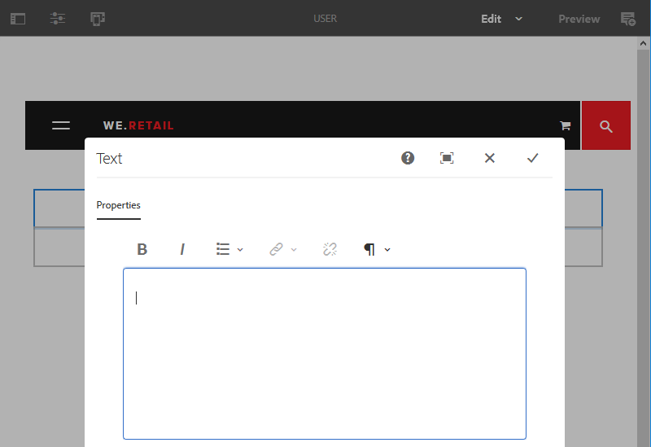

# De Rich Text Editor configureren {#configure-the-rich-text-editor}

De Rich Text Editor (RTE) biedt auteurs een groot aantal functies voor het bewerken van hun tekstinhoud. Pictogrammen, selectiekaders, werkbalk en menu&#39;s zijn beschikbaar voor een WYSIWYG-ervaring bij het bewerken van tekst.

Om te weten hoe te om eigenschappen RTE voor creatie te gebruiken, zie [ Redacteur van de Tekst van het Gebruik Rich voor creatie ](/help/sites-authoring/rich-text-editor.md). RTE kan worden gevormd om, de eigenschappen toe te laten onbruikbaar te maken en uit te breiden beschikbaar in de auteurscomponenten. Het volgende werkschema illustreert een geadviseerde orde om de de configuratietaken van RTE in Experience Manager te voltooien.

 te vormen

*Cijfer: Reeks stappen leren hoe te om RTE* te vormen

## Interface met aanraakbediening en klassieke gebruikersinterface {#understand-touch-enabled-ui-and-classic-ui}

De interface met aanraakbediening is de standaardgebruikersinterface voor Experience Managers. Adobe introduceerde Touch-Toegelaten UI met [ ontvankelijk ontwerp ](/help/sites-authoring/responsive-layout.md) voor auteursmilieu. De interface voor touch-apparaten is ontworpen voor touch- en desktopapparaten. De interface verschilt aanzienlijk van de oorspronkelijke klassieke UI.


*Cijfer: De rijke toolbar van de Redacteur van de Tekst in touch-Toegelaten UI*


*Figuur: De rijke toolbar van de Redacteur van de Tekst in Klassieke UI*

>[!MORELIKETHIS]
>
>* [ aanbevelingen UI ](/help/sites-deploying/ui-recommendations.md)
>* Ongeveer het afleiden van Klassieke UI, zie [ Experience Manager 6.5 versienota&#39;s ](/help/release-notes/deprecated-removed-features.md)
>* Voor verschil tussen UIs, zie [ Aanraak UI en Klassieke UI ](https://aemcq5pedia.wordpress.com/2018/01/05/touch-enabled-ui-aem6-3/)
>* Om Touch-Toegelaten UI in detail te begrijpen, zie [ Concepten van Experience Manager Touch UI ](/help/sites-developing/touch-ui-concepts.md)

## Verschillende bewerkingsmodi {#editingmodes}

Auteurs kunnen tekstinhoud in Experience Manager maken en bewerken met de verschillende modi van componenten. De toolbaropties voor het ontwerpen en het formatteren van inhoud en de gebruikerservaring van rte-toegelaten componenten op verschillende het uitgeven wijze variëren gebaseerd op configuraties RTE.

| Bewerkmodus | Bewerkingsgebied | Aanbevolen functies om te worden ingeschakeld | Aanraakinterface | Klassieke interface |
|--- |--- |--- |--- |--- |
| Inline | Lokaal bewerken voor snelle, kleine bewerkingen; opmaken zonder dialoogvenster te openen | Minimale RTE-functies | Y | Y |
| RTE volledig scherm | Behandelt gehele pagina | Alle vereiste eigenschappen van RTE | Y | N |
| Dialoog | Dialoogvenster boven op de pagina-inhoud, maar heeft geen betrekking op de gehele pagina | Alle vereiste eigenschappen van RTE in Klassieke UI; laat oordeelkundig eigenschappen in Touch UI toe | Y | Y |
| Dialoogvenster volledig scherm | Hetzelfde als de modus Volledig scherm; bevat velden van het dialoogvenster naast RTE | Alle vereiste eigenschappen van RTE | Y | N |

>[!NOTE]
>
>De functie voor het bewerken van bronnen is niet beschikbaar in de inline bewerkingsmodus van de interface met aanraakbediening. U kunt afbeeldingen niet naar het volledige scherm slepen. Alle andere functies werken in alle modi.

### Inline bewerken {#inline-editing}

Als u de inhoud opent (met een langzaam dubbelklikken), kan deze op de pagina worden bewerkt. Er wordt een compacte werkbalk weergegeven met zeer basisopties.


*Cijfer: Het gealigneerde uitgeven met basistoolbar in touch-Toegelaten UI*

In de klassieke gebruikersinterface kunt u langzaam dubbelklikken op de component om inline te bewerken en wordt de inhoud gemarkeerd met een oranje omtrek. Als de Inhoudszoeker is geopend, wordt boven in het venster een werkbalk weergegeven met de beschikbare RTE-opmaakopties. Als de Inhoudszoeker niet is geopend, worden de opmaakopties niet weergegeven en kunt u alleen standaardtekstbewerkingen uitvoeren.

### Volledig scherm bewerken {#full-screen-editing}

Componenten van Experience Managers kunnen worden geopend in de weergave Volledig scherm, waarin de pagina-inhoud wordt verborgen en het beschikbare scherm wordt ingenomen. U kunt overwegen om een gedetailleerde versie van de inlinebewerking op volledig scherm te bewerken, aangezien deze de meeste bewerkingsopties biedt. Het kan worden geopend door , van de compacte toolbar te klikken wanneer het gebruiken van de gealigneerde het uitgeven wijze.

In de modus Volledig scherm van het dialoogvenster zijn, samen met een gedetailleerde RTE-werkbalk, ook de opties en componenten beschikbaar in een dialoogvenster. Het is alleen van toepassing voor een dialoog die naast andere componenten RTE bevat.


*Cijfer: De gedetailleerde toolbar van RTE wanneer het uitgeven op volledig het schermwijze in aanraking-Toegelaten UI*

### Dialoogvenster bewerken {#dialog-editing}

Wanneer dubbelgeklikt wordt op een component, wordt een dialoogvenster geopend voor het bewerken van de inhoud. Het dialoogvenster wordt boven op de bestaande pagina geopend. In sommige specifieke scenario&#39;s, opent de dialoog als pop-up venster. Wanneer een tekstcomponent bijvoorbeeld deel uitmaakt van een kolom in een paginalay-out met meerdere kolommen en het gebied dat beschikbaar is voor het dialoogvenster kleiner is.



*Cijfer: De het uitgeven van de dialoog wijze in aanraking-Toegelaten UI*

 bevat

*Cijfer: De doos van de dialoog in Klassieke UI die gedetailleerde toolbar voor het uitgeven* bevat

## Informatie over RTE-plug-ins en de bijbehorende functies {#aboutplugins}

De functionaliteit wordt beschikbaar gesteld via een reeks plug-ins, elk met:

* Een eigenschap `features` :

   * Wordt gebruikt om de basisfunctionaliteit van die plug-in te activeren of te deactiveren
   * Dat kan worden gevormd gebruikend een gestandaardiseerde procedure

* Indien van toepassing, extra eigenschappen en opties die gespecialiseerde configuratie vereisen.

De basisfuncties van de RTE worden geactiveerd of gedeactiveerd door de waarde van de eigenschap `features` op een knooppunt dat specifiek is voor de juiste insteekmodule.

In de volgende tabel worden de huidige plug-ins weergegeven:

* Plug-in-id&#39;s met een koppeling naar de API-documentatie. Identiteitskaart wordt gebruikt als knoopnaam wanneer [ het activeren van een elektrisch toestel ](/help/sites-administering/configure-rich-text-editor-plug-ins.md#activateplugin).
* Toegestane waarden voor de eigenschap `features` .
* Een beschrijving van de functionaliteit die door de plug-in wordt geboden.

| Plug-in-id | functies | Beschrijving |
|--- |--- |--- |
| bewerken | cut copy paste-default paste-plaintext paste-wordhtml | [ Besnoeiing, exemplaar en, de drie deegwijzen ](/help/sites-administering/configure-rich-text-editor-plug-ins.md#textstyles). |
| findreplace | zoeken, vervangen | Zoeken en vervangen. |
| format | vet cursief onderstrepen | [ Basis tekst het formatteren ](/help/sites-administering/configure-rich-text-editor-plug-ins.md#textstyles). |
| image | image | Basisondersteuning voor afbeeldingen (slepen vanuit de inhoud of de Finder). Afhankelijk van de browser heeft de ondersteuning verschillende gedragingen voor auteurs |
| toetsen |  | Om deze waarde te bepalen, zie [ lusjegrootte ](/help/sites-administering/configure-rich-text-editor-plug-ins.md#tabsize). |
| uitvullen | uitvullen, links uitvullen, rechts uitvullen | Alinea-uitlijning. |
| koppelingen | ontkoppelingsanker wijzigen | [ Hyperlinks en ankers ](/help/sites-administering/configure-rich-text-editor-plug-ins.md#linkstyles). |
| lijsten | geordende ongeordende inspringing uitspringen | Deze stop-binnen controleert zowel [ inspringing als lijsten ](/help/sites-administering/configure-rich-text-editor-plug-ins.md#indentmargin); met inbegrip van genestelde lijsten. |
| misverstanden | specialchars-bronbewerking | Diverse hulpmiddelen staan auteurs toe om [ speciale karakters ](/help/sites-administering/configure-rich-text-editor-plug-ins.md#spchar) in te gaan of de bron van de HTML uit te geven. Ook, kunt u een volledige [ waaier van speciale karakters ](/help/sites-administering/configure-rich-text-editor-plug-ins.md#definerangechar) toevoegen als u uw eigen lijst wilt bepalen. |
| Paraformat | paraformat | De standaardindelingen voor alinea&#39;s zijn Alinea, Kop 1, Kop 2 en Kop 3 (`<p>`, `<h1>`, `<h2>` en `<h3>`). U kunt [ meer paragraafformaten ](/help/sites-administering/configure-rich-text-editor-plug-ins.md#paraformats) toevoegen of de lijst uitbreiden. |
| spelling | checktext | [ Taal bewuste spellingcontrole ](/help/sites-administering/configure-rich-text-editor-plug-ins.md#adddict). |
| stijlen | stijlen | Ondersteuning voor opmaak met behulp van een CSS-klasse. [ voeg nieuwe tekststijlen ](/help/sites-administering/configure-rich-text-editor-plug-ins.md#textstyles) toe als u (of breid) uw eigen waaier van stijlen voor gebruik met tekst wilt toevoegen. |
| subsuperscript | subscript, superscript | Extensies voor de basisindelingen, subscript en superscript toevoegen. |
| table | verwijderbaar inzetbare verwijderbare insteekmodule removerow insert column removecolumn cellprops mergecells splitcell selectrow selected columns | Zie [ vormen lijststijlen ](/help/sites-administering/configure-rich-text-editor-plug-ins.md#tablestyles), als u uw eigen stijlen voor of volledige lijsten of individuele cellen wilt toevoegen. |
| ongedaan maken | ongedaan maken, opnieuw uitvoeren | De grootte van de geschiedenis van [ maakt en doet ](/help/sites-administering/configure-rich-text-editor-plug-ins.md#undohistory) verrichtingen ongedaan. |

>[!NOTE]
>
>De plug-in Volledig scherm wordt niet ondersteund in de dialoogmodus. Gebruik de instelling `dialogFullScreen` om de werkbalk voor de modus Volledig scherm te configureren.

## Begrijp de configuratiewegen en plaatsen {#understand-the-configuration-paths-and-locations}

De [ wijze van het uitgeven van RTE (en UI) ](#editingmodes) dat u voor uw auteurs verstrekt besluit de plaats voor de configuratiedetails wanneer u [ het activeren van de stop-ins van RTE ](/help/sites-administering/configure-rich-text-editor-plug-ins.md#activateplugin) bent:

| Bewerkmodus | Locatie voor aanraakinterface | Locatie voor klassieke gebruikersinterface |
|---|---|---|
| Inline | `cq:editConfig/cq:inplaceEditing` | `cq:editConfig/cq:inplaceEditing` |
| Volledig scherm | `cq:editConfig/cq:inplaceEditing` | Niet van toepassing |
| Dialoog | `cq:dialog` | `dialog` |
| Dialoogvenster Volledig scherm | `cq:dialog` | Niet van toepassing |

>[!NOTE]
>
>Geef het knooppunt geen naam onder `cq:inplaceEditing` als `config` . Definieer bij knooppunt `cq:inplaceEditing` de volgende eigenschappen:
>* **Naam**: `configPath`
>* **Type**: `String`
>* **Waarde**: weg van de knoop die de daadwerkelijke configuratie bevatten
>
>Geef het RTE-configuratieknooppunt geen naam als `config` . Anders, zijn de configuraties RTE van kracht voor slechts de beheerders en niet voor de gebruikers in de groep `content-author`.

Configureer de volgende eigenschappen die alleen van toepassing zijn in de bewerkingsmodus Dialoogvenster in Touch UI:

* `useFixedInlineToolbar`: stel deze Booleaanse eigenschap in die op het RTE-knooppunt is gedefinieerd (een met sling:resourceType= `cq/gui/components/authoring/dialog/richtext` ) op `True` om de RTE-werkbalk vast te maken in plaats van zwevend.

  Wanneer deze eigenschap true is, wordt het bewerken van Richtingstekst standaard gestart op de gebeurtenis &quot;foundation-contentloaded&quot;.

  Om dit te verhinderen, plaats het bezit `customStart` aan `True` en teweeg de &quot;rte-start&quot;gebeurtenis om RTE het uitgeven te beginnen. Wanneer deze eigenschap &#39;true&#39; is, werkt het standaardgedrag bij klikken met de beginwaarde niet.

* `customStart`: stel deze Booleaanse eigenschap die op het RTE-knooppunt is gedefinieerd in op `True` om te bepalen wanneer RTE moet worden gestart door de gebeurtenis te activeren `rte-start` .

* `rte-start`: Trigger deze gebeurtenis op `contenteditable-div` van RTE, wanneer beginnen RTE uit te geven. Dit werkt alleen als `customStart` is ingesteld op true.

Als RTE wordt gebruikt in het dialoogvenster met aanraakbediening, is het verplicht de eigenschap `useFixedInlineToolbar` in te stellen op true om problemen te voorkomen.

## Op plaats bewerken aanpassen {#customizing-in-place-editing}

U kunt definiëren op welke HTML-kiezer de teksteditor begint door de volgende eigenschappen te configureren:

* **`editElementQuery`** - Gedefinieerd op `cq:InplaceEditingConfig` , wordt deze eigenschap gebruikt om een kiezer op te geven van het HTML-element waarop de inline-bewerking voor de Tekstcomponent wordt gestart. Als u deze optie niet opgeeft, wordt het inline bewerken direct gestart op de HTML van de tekstcomponent.
* **`textPropertyName`** - Gedefinieerd op `cq:InplaceEditingConfig` , wordt deze eigenschap gebruikt om de naam op te geven van de eigenschap die wordt opgeslagen op het inhoudsknooppunt waar de HTML-waarde van de tekstcomponent na inline-bewerking wordt voortgezet.

De overeenkomende eigenschap voor de dialoogmodus is `name` .

## RTE-functies inschakelen door plug-ins te activeren {#enable-rte-functionalities-by-activating-plug-ins}

De functionaliteit van RTE wordt beschikbaar gemaakt via een reeks stop-ins, elk met eigenschappen bezit. U kunt de eigenschap features configureren om de verschillende functies van elke insteekmodule in of uit te schakelen.

Voor gedetailleerde configuraties van de stop-ins van RTE, zie [ hoe te om de stop-ins van RTE te activeren en te vormen ](/help/sites-administering/configure-rich-text-editor-plug-ins.md).

**Steekproef**: Download [ deze steekproefconfiguratie ](/help/sites-administering/assets/rte-sample-all-features-enabled-10.zip) die illustreert hoe te om RTE te vormen. In dit pakket zijn alle functies ingeschakeld.

>[!NOTE]
>
>De [ de tekstcomponent van de Componenten van de Kern ](https://experienceleague.adobe.com/docs/experience-manager-core-components/using/components/text.html#the-text-component-and-the-rich-text-editor) staat malplaatjeredacteurs toe om vele steekmodules van RTE in een GUI als inhoudsbeleid te vormen, die de behoefte aan technische configuratie elimineren. Het inhoudsbeleid kan werken met RTE UI-configuraties, zoals in dit document wordt beschreven.
>
>Voor meer informatie, zie de [ montages van RTE UI en de inhoud ](/help/sites-administering/rich-text-editor.md) sectie van dit document en [ Creërend de Malplaatjes van de Pagina ](/help/sites-authoring/templates.md) en de [ de ontwikkelaarsdocumentatie van de Componenten van de Kern ](https://experienceleague.adobe.com/docs/experience-manager-core-components/using/developing/developing.html).

>[!NOTE]
>
>Ter referentie kunt u de standaardtekstcomponenten (geleverd als onderdeel van een standaardinstallatie) vinden op:
>
>* `/libs/wcm/foundation/components/text`
>* `/libs/foundation/components/text`
>
>Als u uw eigen tekstcomponent wilt maken, kopieert u de bovenstaande component in plaats van deze componenten te bewerken.

## RTE-werkbalk configureren {#dialogfullscreen}

Met AEM kunt u de interface voor de Rich Text Editor op een andere manier configureren voor de verschillende bewerkingsmodi. De standaardinstellingen worden hieronder gegeven. U kunt deze standaardinstellingen op basis van uw vereisten overschrijven. U kunt alleen de werkbalkfuncties aanpassen die u aan de auteurs wilt geven. U hoeft niet alle werkbalkconfiguraties op te geven.

Gebruik de volgende voorbeeldconfiguratie om de werkbalk voor `dialogFullScreen` te configureren.

```java
<uiSettings jcr:primaryType="nt:unstructured">
  <cui jcr:primaryType="nt:unstructured">
    <inline
      jcr:primaryType="nt:unstructured"
      toolbar="[format#bold,format#italic,format#underline,#justify,#lists,links#modifylink,links#unlink,#paraformat]">
      <popovers jcr:primaryType="nt:unstructured">
        <justify
          jcr:primaryType="nt:unstructured"
          items="[justify#justifyleft,justify#justifycenter,justify#justifyright,justify#justifyjustify]"
          ref="justify"/>
        <lists
          jcr:primaryType="nt:unstructured"
          items="[lists#unordered,lists#ordered,lists#outdent,lists#indent]"
          ref="lists"/>
        <paraformat
          jcr:primaryType="nt:unstructured"
          items="paraformat:getFormats:paraformat-pulldown"
          ref="paraformat"/>
      </popovers>
    </inline>
    <dialogFullScreen
      jcr:primaryType="nt:unstructured"
      toolbar="[format#bold,format#italic,format#underline,justify#justifyleft,justify#justifycenter,justify#justifyright,justify#justifyjustify,lists#unordered,lists#ordered,lists#outdent,lists#indent,links#modifylink,links#unlink,table#createoredit,#paraformat,image#imageProps]">
      <popovers jcr:primaryType="nt:unstructured">
        <paraformat
          jcr:primaryType="nt:unstructured"
          items="paraformat:getFormats:paraformat-pulldown"
          ref="paraformat"/>
      </popovers>
    </dialogFullScreen>
    <tableEditOptions
      jcr:primaryType="nt:unstructured"
      toolbar="[table#insertcolumn-before,table#insertcolumn-after,table#removecolumn,-,table#insertrow-before,table#insertrow-after,table#removerow,-,table#mergecells-right,table#mergecells-down,table#mergecells,table#splitcell-horizontal,table#splitcell-vertical,-,table#selectrow,table#selectcolumn,-,table#ensureparagraph,-,table#modifytableandcell,table#removetable,-,undo#undo,undo#redo,-,table#exitTableEditing,-]">
    </tableEditOptions>
  </cui>
</uiSettings>
```

Er worden verschillende UI-instellingen gebruikt voor de inlinemodus en de modus Volledig scherm. De eigenschap toolbar wordt gebruikt om de knoppen van de werkbalk op te geven.

Als de knop zelf bijvoorbeeld een functie is (bijvoorbeeld `Bold` ), wordt deze opgegeven als `PluginName#FeatureName` (bijvoorbeeld `links#modifylink` ).

Als de knop een pop-up is (met enkele functies van een plug-in), wordt deze opgegeven als `#PluginName` (bijvoorbeeld `#format` ).

Scheidingstekens (`|`) tussen een groep knoppen kunnen worden opgegeven met `-` .

Het pop-upknooppunt onder de modus Inline of Volledig scherm bevat een lijst met de popovers die worden gebruikt. Elk onderliggend knooppunt onder het knooppunt &#39;popovers&#39; krijgt een naam na de insteekmodule (bijvoorbeeld de indeling). Deze heeft een eigenschap &#39;items&#39; die een lijst bevat met functies van de plug-in (bijvoorbeeld format#bold).

## RTE-gebruikersinterface-instellingen en inhoudsbeleid {#rtecontentpolicies}

De beheerders kunnen de opties controleren RTE gebruikend inhoudsbeleid, zeggen in plaats van de configuratie zoals hierboven beschreven. Het beleid van de inhoud bepaalt de ontwerpeigenschappen van een component wanneer gebruikt als deel van een [ editable malplaatje ](/help/sites-authoring/templates.md). Als bijvoorbeeld een tekstcomponent die de RTE gebruikt wordt gebruikt met een bewerkbare sjabloon, kan het inhoudsbeleid definiëren dat de optie Vet beschikbaar is en zijn enkele opties voor alineaopmaak beschikbaar. Het inhoudsbeleid is herbruikbaar en kan op meerdere sjablonen worden toegepast.

De beschikbare opties in RTE stromen stroomafwaarts van de configuraties van het gebruikersinterface aan het inhoudsbeleid.

* De de configuratiemontages van de gebruikersinterface bepalen welke opties aan het inhoudsbeleid beschikbaar zijn.
* Als de gebruikersinterfaceconfiguratie van RTE verwijderde of geen punt toelaat, kan het inhoudsbeleid niet het vormen.
* Een auteur heeft toegang tot slechts dergelijke functionaliteit die door de gebruikersinterfaceconfiguraties en het inhoudsbeleid ter beschikking wordt gesteld.

Als voorbeeld, kunt u de [ documentatie van de Component van de Kern van de Tekst ](https://experienceleague.adobe.com/docs/experience-manager-core-components/using/wcm-components/text.html#the-text-component-and-the-rich-text-editor) zien.

## Toewijzing aanpassen tussen werkbalkpictogrammen en -opdrachten {#iconstoolbar}

U kunt de afbeelding aanpassen tussen de koraalpictogrammen die worden weergegeven op de RTE-werkbalk en de beschikbare opdrachten. U kunt geen andere pictogrammen gebruiken behalve Koraalpictogrammen.

1. Maak een knooppunt met de naam `icons` onder `uiSettings/cui` .

1. Maak knooppunten voor afzonderlijke pictogrammen eronder.
1. Geef voor elk van de afzonderlijke pictogramknooppunten een koraalpictogram en een opdracht op om aan het pictogram toe te wijzen.

Hieronder ziet u een voorbeeldfragment waarmee u de opdracht Vet maken toewijst aan het pictogram Koraal met de naam `textItalic` .

```java
<text jcr:primaryType="nt:unstructured" sling:resourceType="cq/gui/components/authoring/dialog/richtext" name="./text" useFixedInlineToolbar="{Boolean}true">
    <rtePlugins jcr:primaryType="nt:unstructured">
        <format jcr:primaryType="nt:unstructured" features="bold,italic"/>
    </rtePlugins>
    <uiSettings jcr:primaryType="nt:unstructured">
        <cui jcr:primaryType="nt:unstructured">
            <inline jcr:primaryType="nt:unstructured"
                toolbar="[format#bold,format#italic,format#underline,links#modifylink,links#unlink]">
            </inline>
            <icons jcr:primaryType="nt:unstructured">
                <bold jcr:primaryType="nt:unstructured"
                    command="format#bold"
                    icon="textItalic"/>
            </icons>
        </cui>
    </uiSettings>
</text>
```

## Overschakelen naar de KoralUI 2 Rich Text Editor {#switch-to-coralui-rich-text-editor}

Voor een pagina, kunt u of CoralUI 2 KTE clientlib of CoralUI 3 KTE clientlib omvatten. Standaard bevat de Rich Text Editor de CoralUI 3 RTE clientlib. Ga als volgt te werk om over te schakelen op CoralUI 2 RTE.

>[!NOTE]
>
>Adobe beveelt dit niet aan als beste praktijk. Schakel als laatste redmiddel over naar CoralUI 2 RTE. Aangepaste plug-ins voor CoralUI 2 RTE werken met CoralUI 3 RTE als de plug-ins niet afhankelijk zijn van interne RTE-bronnen, zoals klassen.
>
>Als u aangepaste plug-ins voor CoralUI3 RTE gebruikt, gebruikt u `rte.coralui3` library.


1. Bedek het knooppunt `/libs/cq/gui/components/authoring/editors/clientlibs/core` onder `/apps` en voer de volgende handelingen uit:

   * Vervang `rte.coralui3` door `rte.coralui2` voor het gebiedsdeelbezit.
   * Vervang `cq.authoring.editor.core.inlineediting.rte.coralui3` door `cq.authoring.editor.core.inlineediting.rte.coralui2` voor de eigenschap embed.
   * Vervang `cq.authoring.rte.coralui3` door `cq.authoring.rte.coralui2` voor de eigenschap embed.

1. Bedek de knooppunten `/libs/cq/gui/components/authoring/dialog/richtext/clientlibs/rte/coralui3` en `/libs/cq/gui/components/authoring/dialog/richtext/clientlibs/rte/coralui2` under `/apps` .

   Categorie `cq.authoring.dialog` verwijderen uit `/apps/cq/gui/components/authoring/dialog/richtext/clientlibs/rte/coralui3` en toevoegen aan `/apps/cq/gui/components/authoring/dialog/richtext/clientlibs/rte/coralui2` .

1. Wijzig de afhankelijkheden die op de pagina worden opgenomen van `rte.coralui3` in `rte.coralui2` . Nadat u bijvoorbeeld het knooppunt `/libs/mcm/campaign/components/touch-ui/clientlibs/rte` onder `/apps` hebt bedekt, wijzigt u de eventuele afhankelijkheid van het knooppunt van `rte.coralui3` in `rte.coralui2` .

1. Bedek het knooppunt `cq/ui/widgets` onder `/apps` . Vervang de afhankelijkheid `cq.rte` van het knooppunt `/apps/cq/ui/widgets` door `cq.coralui2.rte` .

>[!NOTE]
>
>CoralUI 2 RTE gebruikt handlebars malplaatjes voor stop-in dialogen. Daarom had CoralUI 2 RTE clientlib een afhankelijkheid van handlebars clientlib. CoralUI 3 RTE gebruikt geen zakbalkmalplaatjes en heeft geen bijbehorende gebiedsdeel. Als uw aangepaste plug-ins handbalksjablonen gebruiken, neemt u de client lib-handgrepen op uw webpagina.

## Aanvullende informatie {#further-information}

Voor meer informatie over het vormen van RTE, zie [ AEM Widget API ](https://developer.adobe.com/experience-manager/reference-materials/6-5/widgets-api/index.html?class=CQ.form.RichText) verwijzing.

Met name om de beschikbare plug-ins en bijbehorende opties te zien:

* De {[&#128279;](https://developer.adobe.com/experience-manager/reference-materials/6-5/widgets-api/index.html?class=CQ.form.RichText) component 0} CQ.form.RichText verstrekt een vormgebied voor het uitgeven van gestileerde tekstinformatie (rijke tekst).  Zie Configuratieopties voor meer informatie over alle parameters die beschikbaar zijn voor het RTF-formulier.
* De component RichText verstrekt een brede waaier van functionaliteit gebruikend stop-ins die onder [ CQ.form.rte.plugins.Plugin ](https://developer.adobe.com/experience-manager/reference-materials/6-5/widgets-api/index.html?class=CQ.form.rte.plugins.Plugin) worden vermeld. Voor elke insteekmodule:

   * zie de Eigenschappen voor details van functionaliteit die kan worden toegelaten (of worden onbruikbaar gemaakt)
   * Zie de Opties Config voor alle parameters beschikbaar voor gedetailleerde configuratie van de aangewezen stop - binnen

* Meer informatie over de Regels van de HTML voor verbindingen is ook beschikbaar.

Deze kunnen worden gebruikt om uw eigen RTE uit te breiden en aan te passen. Als u bijvoorbeeld de ankers wilt weergeven die beschikbaar zijn op de pagina wanneer u een koppeling maakt, kunt u uw eigen implementatie van de koppeling `LinkPlugin` opgeven.

## Bekende beperkingen {#known-limitations}

AEM het vermogen van RTE heeft de volgende beperkingen:

* De mogelijkheden van RTE worden gesteund slechts in AEM componentendialogen. RTE wordt niet gesteund op tovenaars of stichting-vormen zoals [ Eigenschappen van de Pagina ](/help/sites-developing/page-properties-views.md) en [ Basiscodering ](/help/sites-authoring/scaffolding.md) op touch-Toegelaten UI.

* AEM werkt niet op [ Hybride apparaten ](/help/release-notes/release-notes.md).

* Geef het RTE-configuratieknooppunt geen naam `config` . Anders, treedt de configuratie RTE voor slechts de beheerders en niet voor de gebruikers in de groep `content-author` van kracht.

* RTE biedt geen ondersteuning voor inlineframe of iframe voor het insluiten van inhoud.

## Tips en trucs {#best-practices-and-tips}

* Schakel alleen de plug-ins zonder pop-up in voor een zwevend dialoogvenster. Plug-ins zonder pop-up zijn kleiner en zijn het meest geschikt voor een zwevend dialoogvenster.
* Schakel de plug-ins met grotere pop-ups, zoals de plug-in `Paste` , alleen in de modus Volledig scherm of in de modus Volledig scherm in. Plug-ins met een grote pop-up hebben meer ruimte in het scherm nodig voor een goede ontwerpervaring.
* Als u aangepaste plug-ins voor CoralUI3 RTE gebruikt, gebruikt u `rte.coralui3` library.

## Veelvoorkomende problemen met RTE oplossen {#troubleshoot-issues-with-aem-rich-text-editor}

**hoe te om veelvoudige lijstcellen te selecteren?**

Als u meerdere cellen in een tabel wilt selecteren, drukt u op `Ctrl` of `Cmd` en klikt u vervolgens één voor één op de tabelcellen.

Voer nu een bewerking uit op de selectie en stel bijvoorbeeld de eigenschappen van de geselecteerde cellen in.

**de Hyperlinks worden verloren wanneer het uitgeven van een component gebruikend Configure knoop**

Voeg een hyperlink in een tekstcomponent toe door het uit te geven gebruikend de Configure knoop. U kunt de hyperlink verliezen wanneer u deze opnieuw bewerkt en de hyperlink voor de tweede keer valideert.

Als tussenoplossing kunt u in de tekstcomponent klikken wanneer het dialoogvenster voor bewerken de tweede keer wordt weergegeven en vervolgens de koppelingsvalidatie uitvoeren.

Dit probleem is opgelost in AEM 6.3 en hoger.

**HTML inhoud die op bron-geeft wijze wordt toegevoegd wordt verloren**

Voeg geen XSS-prone HTML toe. AEM, en niet RTE, kunnen sommige inhoud van HTML verwijderen om aan de XSS antisamy regels te voldoen.

Controleer de opgeslagen inhoud in CRXDE (in het inhoudsknooppunt) om te controleren of de geplakte HTML is opgeslagen.

Als niet bewaard, moet de HTML door RTE zijn verwijderd aangezien het niet aan de regels van RTE volgde.

Als bewaard in CRXDE maar niet teruggegeven op de Pagina (om het teruggeven te controleren, zie de voorproef van de pagina [&#128279;](/help/sites-authoring/editing-content.md#preview-mode), wordt het verwijderd door AEM regels XSS.

**Multifield component werkt niet zoals verwacht**

Als u een component met meerdere velden wilt maken, gebruikt u uitsluitend CoralUI 3. Gebruik geen dialoogvensters met CoralUI 2-componenten.

Controleer ook of de implementatiecode en de knooppuntstructuur voor meerdere velden correct zijn.

**Configuratie beschikbaar aan beheerders is niet beschikbaar aan auteurs**

Als de updates van interfaceconfiguraties voor beheerders maar niet voor auteursrekeningen worden weerspiegeld, zorg ervoor dat de configuratieknoopknoop niet `config` wordt genoemd. Gebruik het [`configPath` bezit ](/help/sites-developing/components-basics.md#cq-inplaceediting).

>[!MORELIKETHIS]
>
>* [ vorm stop-ins RTE ](configure-rich-text-editor-plug-ins.md)
>* [ Redacteur van de Tekst van het Gebruik Rich voor creatie ](../sites-authoring/rich-text-editor.md)
>* [ vorm RTE voor toegankelijke plaatsen ](rte-accessible-content.md)
>* [ Aanraak UI en Klassieke UI eigenschappariteit ](../release-notes/touch-ui-features-status.md)
>* [ steekproef van het Leerprogramma om samengestelde multifield component tot stand te brengen ](https://experience-aem.blogspot.com/2019/05/aem-65-touchui-composite-multifield-with-coral3-rte-rich-text.html)
