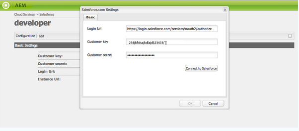
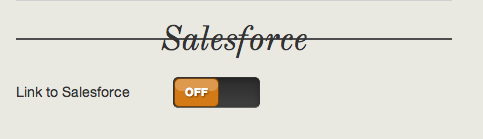

# Integreren met Salesforce {#integrating-with-salesforce}

De integratie van Salesforce met AEM biedt beheermogelijkheden voor leads en maakt gebruik van de bestaande mogelijkheden die Salesforce uit de doos biedt. U kunt AEM configureren om leads te posten naar Salesforce en componenten maken die rechtstreeks vanuit Salesforce toegang hebben tot gegevens.

Dankzij de bidirectionele en uitbreidbare integratie tussen AEM en Salesforce:

* Organisaties die volledig gegevens gebruiken en bijwerken om de klantervaring te verbeteren.
* Betrokkenheid van marketing tot verkoopactiviteiten.
* Organisaties die automatisch gegevens verzenden en ontvangen van een Salesforce-datastore.

In dit document wordt het volgende beschreven:

* hoe te om Cloud Services te vormen Salesforce (vorm AEM om met Salesforce te integreren).
* hoe te om Salesforce Lead/Contactinformatie in de Context van de Cliënt en voor Personalisatie te gebruiken.
* hoe u het workflowmodel van Salesforce gebruikt om AEM gebruikers te plaatsen als leidt tot salesforce.
* hoe te om een component tot stand te brengen die gegevens van Salesforce toont.

## Het vormen AEM om met Salesforce {#configuring-aem-to-integrate-with-salesforce} te integreren

Om AEM te vormen om met Salesforce te integreren, moet u een verre toegangstoepassing in Salesforce eerst vormen. Dan vormt u de salesforce wolkendienst om aan deze verre toegangstoepassing te richten.

>[!NOTE]
>
>U kunt een gratis ontwikkelaarsaccount maken in Salesforce.

Om AEM te vormen om met Salesforce te integreren:

>[!CAUTION]
>
>U moet [Salesforce Force API](https://www.adobeaemcloud.com/content/marketplace/marketplaceProxy.html?packagePath=/content/companies/public/adobe/packages/cq650/featurepack/com.adobe.cq.mcm.salesforce.content#) integratiepakket installeren alvorens u met de procedure verdergaat. Voor meer details op hoe te met pakketten te werken zie [hoe te met de pagina van Pakketten](/help/sites-administering/package-manager.md#package-share) werken.

1. Navigeer in AEM naar **Cloud Services**. In de Diensten van de Derde, klik **Vorm nu** in **Salesforce**.

   

1. Creeer een nieuwe configuratie, bijvoorbeeld, **developer**.

   >[!NOTE]
   >
   >De nieuwe configuratie wordt omgeleid naar een nieuwe pagina: **http://localhost:4502/etc/cloudservices/salesforce/developer.html**. Dit is de nauwkeurige zelfde waarde die u in Callback URL moet specificeren terwijl het creëren van de verre toegangstoepassing in Salesforce. Deze waarden moeten overeenkomen.

1. Meld u aan bij uw salesforce-account (of als u er geen hebt, maakt u er een op [https://developer.force.com](https://developer.force.com).)
1. Navigeer in Salesforce naar **Create** > **Apps** om naar **Connected Apps** te gaan (in eerdere versies van Salesforce was de workflow **Deploy** > **Remote Access**).
1. Klik **Nieuw** om AEM met Salesforce te verbinden.

   

1. Voer de **Aangesloten toepassingsnaam**, **API-naam** en **Contact opnemen met e-mail** in. Selecteer het selectievakje **OAuth-instellingen inschakelen** en voer de **URL callback** in en voeg een OAuth-bereik toe (bijvoorbeeld volledige toegang). De callback-URL ziet er ongeveer als volgt uit: `http://localhost:4502/etc/cloudservices/salesforce/developer.html`

   Wijzig de servernaam/het poortnummer en de paginanaam in overeenstemming met uw configuratie.

   

1. Klik **sparen** om de salesforce configuratie te bewaren. Salesforce maakt een **consumentensleutel** en **Consumentengeheim**, die u nodig hebt voor AEM configuratie.

   

   >[!NOTE]
   >
   >Mogelijk moet u enkele minuten wachten (tot 15 minuten) voordat de externe toegangstoepassing in Salesforce wordt geactiveerd.

1. Navigeer in AEM naar **Cloud Services** en navigeer naar de salesforce-configuratie die u eerder hebt gemaakt (bijvoorbeeld **developer**). Klik op **Bewerken** en voer de sleutel en het klantgeheim van salesforce.com in.

   

   | Aanmeldings-URL | Dit is het Salesforce Authorization Endpoint. De waarde ervan wordt vooraf ingevuld en is in de meeste gevallen beschikbaar. |
   |---|---|
   | Klantsleutel | Ga de waarde in die van de pagina van de Registratie van de Toepassing van de Verre Toegang in salesforce.com wordt verkregen |
   | Klantgeheim | Ga de waarde in die van de pagina van de Registratie van de Toepassing van de Verre Toegang in salesforce.com wordt verkregen |

1. Klik **Verbind met Salesforce** om te verbinden. Salesforce vraagt dat u uw configuratie toestaat om met verkoopkracht te verbinden.

   

   In AEM wordt een bevestigingsvenster geopend met de mededeling dat u verbinding hebt gemaakt.

1. Navigeer naar de basispagina van uw website en klik **Pagina-eigenschappen**. Selecteer vervolgens **Cloud Services** en voeg **Salesforce** toe en selecteer de juiste configuratie (bijvoorbeeld **developer**).

   

   Nu kunt u het workflowmodel gebruiken om leads naar Salesforce te posten en componenten te maken die toegang hebben tot gegevens van Salesforce.

## AEM gebruikers exporteren als Salesforce Leads {#exporting-aem-users-as-salesforce-leads}

Als u een AEM gebruiker als verkoopkrachtlood wilt uitvoeren, moet u het werkschema vormen om lood te posten aan verkoopkracht.

Als u AEM gebruikers wilt exporteren als leider van Salesforce:

1. Navigeer naar de Salesforce-workflow op `http://localhost:4502/workflow` door met de rechtermuisknop op de workflow **Salesforce.com Export** te klikken en op **Start** te klikken.

   

1. Selecteer de AEM gebruiker u als lood als **Payload** voor deze werkschema (huis -> gebruikers) wilt tot stand brengen. Zorg ervoor dat u het profielknooppunt van de gebruiker selecteert omdat het informatie bevat zoals **givenName**, **familyName**, enzovoort, die zijn toegewezen aan de velden **FirstName** en **LastName** van Salesforce lead.

   

   >[!NOTE]
   >
   >Voordat u met deze workflow begint, moeten er bepaalde verplichte velden zijn voor publicatie op Salesforce in AEM loodknooppunt. Dit zijn **givenName**, **familyName**, **company** en **email**. Zie [Configuratie toewijzen tussen AEM gebruiker en Slaesforce lead voor een complete lijst met toewijzingen tussen AEM gebruiker en Salesforce lead.](#mapping-configuration-between-aem-user-and-salesforce-lead)

1. Klik **OK**. De gebruikersinformatie wordt uitgevoerd naar salesforce.com. U kunt het verifiëren bij salesforce.com.

   >[!NOTE]
   >
   >In de foutlogboeken wordt weergegeven of een lead wordt geïmporteerd. Controleer het foutenlogboek voor meer informatie.

### De Salesforce.com-exportworkflow configureren {#configuring-the-salesforce-com-export-workflow}

U kunt het werkschema van de Uitvoer moeten vormen Salesforce.com om het aan de correcte configuratie aan te passen Salesforce.com of andere veranderingen aan te brengen.

Om de Salesforce.com- uitvoerwerkschema te vormen:

1. Ga naar `http://localhost:4502/cf#/etc/workflow/models/salesforce-com-export.html.`

   

1. Open de stap van de Uitvoer Salesforce.com, selecteer **Argumenten** tabel, en selecteer de correcte configuratie wordt geselecteerd en klik **OK**. Schakel het selectievakje in als u wilt dat de workflow een lead opnieuw maakt die in Salesforce is verwijderd.

   

1. Klik **Opslaan** om uw wijzigingen op te slaan.

   

### Configuratie toewijzen tussen AEM gebruiker en Salesforce Lead {#mapping-configuration-between-aem-user-and-salesforce-lead}

Om de huidige toewijzingsconfiguratie tussen een AEM gebruiker en een lood te bekijken of uit te geven Salesforce, open de Manager van de Configuratie: `https://<hostname>:<port>/system/console/configMgr` en zoek naar **Configuratie van Salesforce Lead Mapping**.

1. Open de Manager van de Configuratie door **Webconsole** te klikken of direct naar `https://<hostname>:<port>/system/console/configMgr.` te gaan
1. Zoek naar **Configuratie van de Toewijzing van de Lood van Salesforce**.

   

1. Wijzig desgewenst toewijzingen. De standaardtoewijzing volgt het patroon **nameUserAttribute=sfLeadAttribute**. Klik **Opslaan** om uw wijzigingen op te slaan.

## Contextarchief Salesforce-client configureren {#configuring-salesforce-client-context-store}

De salesforce opslag van de cliëntcontext toont extra informatie over de momenteel het programma geopende gebruiker dan wat reeds binnen AEM beschikbaar is. Deze aanvullende informatie wordt door Salesforce opgehaald, afhankelijk van de verbinding van de gebruiker met Salesforce.

Om dit te doen, moet u het volgende vormen:

1. Koppel een AEM gebruiker aan een Salesforce-id via de Salesforce Connect-component.
1. Voeg de gegevens van het Profiel Salesforce in de pagina van de cliëntcontext toe om te vormen welke eigenschappen u wilt zien.
1. (Optioneel) Bouw een segment dat de gegevens uit de Salesforce Client Context Store gebruikt.

### Een AEM gebruiker koppelen met een Salesforce-id {#linking-an-aem-user-with-a-salesforce-id}

U moet een AEM gebruiker met een Salesforce-id toewijzen om deze in de clientcontext te laden. In een echt scenario, zou u gebaseerd op bekende gebruikersgegevens met bevestiging verbinden. In deze procedure gebruikt u voor demonstratiedoeleinden de component **Salesforce Connect**.

1. Navigeer naar een website in AEM, meld u aan en sleep de component **Salesforce Connect** vanuit het hulpprogramma.

   >[!NOTE]
   >
   >Als de **Salesforce Connect**-component niet beschikbaar is, gaat u naar **Ontwerpweergave** en selecteert u deze om deze beschikbaar te maken in de weergave **Bewerken**.

   

   Wanneer u de component aan de pagina sleept, toont het **Verbinding aan Salesforce=Off**.

   

   >[!NOTE]
   >
   >Dit onderdeel is uitsluitend bedoeld voor demonstratiedoeleinden. Voor scenario&#39;s in de praktijk, zou er een ander proces zijn om gebruikers met lood te verbinden/aan te passen.

1. Nadat u de component op de pagina hebt gesleept, opent u deze om de component te configureren. Selecteer de configuratie, het type contact, en de lood of het contact van Salesforce, en klik **OK**.

   

   AEM verbindt de gebruiker met het contact of de lood Salesforce.

   

### Salesforce-gegevens toevoegen aan clientcontext {#adding-salesforce-data-to-client-context}

U kunt gebruikersgegevens van Salesforce in de Context van de Cliënt laden voor verpersoonlijking te gebruiken:

1. Open de clientcontext die u wilt uitbreiden door daar te navigeren, bijvoorbeeld `http://localhost:4502/etc/clientcontext/default/content.html.`

   

1. Sleep de component **Salesforce Profile Data** naar de clientcontext.

   

1. Dubbelklik op de component om deze te openen. Selecteer **Item toevoegen** en selecteer een bezit van de drop-down lijst. Voeg zoveel eigenschappen toe als u wilt en selecteer **OK**.

   

1. Nu, ziet u Salesforce-specifieke eigenschappen van Salesforce die in de cliëntcontext worden getoond.

   

### Een segment maken met gegevens uit de Salesforce Client Context Store {#building-a-segment-using-data-from-salesforce-client-context-store}

U kunt een segment bouwen dat gegevens van de Opslag van de Context van de Cliënt Salesforce gebruikt. Dit doet u als volgt:

1. Navigeer naar segmentatie in AEM door naar **Tools** > **Segmentation** te gaan of naar [http://localhost:4502/miscadmin#/etc/segmentation](http://localhost:4502/miscadmin#/etc/segmentation) te gaan.
1. Maak of werk een segment bij om gegevens van Salesforce op te nemen. Zie [Segmentatie](/help/sites-administering/campaign-segmentation.md) voor meer informatie.

## Leads zoeken {#searching-leads}

AEM schepen met een voorbeeldcomponent Search die volgens de gegeven criteria in Salesforce zoekopdrachten uitvoert. Met deze component kunt u zien hoe u de Salesforce REST API kunt gebruiken om te zoeken naar Salesforce-objecten. U moet een pagina met een configuratie verbinden Salesforce om een vraag aan salesforce.com te activeren.

>[!NOTE]
>
>Dit is een voorbeeldcomponent die u toont hoe te om Salesforce REST API te gebruiken om voorwerpen van Salesforce te vragen. Gebruik dit als voorbeeld om complexere componenten te maken op basis van uw behoeften.

Deze component gebruiken:

1. Navigeer naar de pagina waarop u deze configuratie wilt gebruiken. Open pagina-eigenschappen en selecteer **Cloud Services.** Klik op  **Services** toevoegen en selecteer  **** Salesforcee en de juiste configuratie en klik op  **OK**.

   

1. Sleep de Salesforce-zoekcomponent naar de pagina (mits deze is ingeschakeld). Ga naar de ontwerpmodus en voeg deze toe aan het desbetreffende gebied om de modus in te schakelen.)

   

1. Open de component van het Onderzoek en specificeer de onderzoeksparameters en klik **OK.**

   

1. AEM geeft de in de zoekcomponent opgegeven leads weer die aan de opgegeven criteria voldoen.

   

