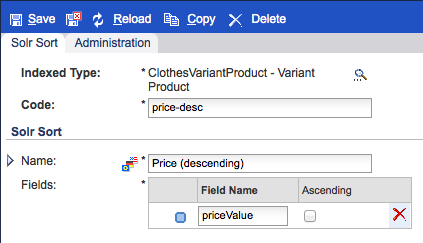

# SAP Commerce Cloud{#sap-commerce-cloud}

Na de installatie kunt u uw instantie configureren:

1. [Configureer de Facetted Search for Geometrixx Outdoors](#configure-the-facetted-search-for-geometrixx-outdoors).
1. [Configureer de catalogusversie](#configure-the-catalog-version).
1. [Configureer de importstructuur](#configure-the-import-structure).
1. [Configureer de productkenmerken die u wilt laden](#configure-the-product-attributes-to-load).
1. [De productgegevens](#importing-the-product-data) importeren.
1. [Configureer de importmodule voor](#configure-the-catalog-importer) catalogi.
1. Met de [importer kunt u de catalogus](#catalog-import) importeren naar een specifieke locatie in AEM.

## Configureer de gefacetteerde zoekopdracht voor Geometrixx Outdoors {#configure-the-facetted-search-for-geometrixx-outdoors}

>[!NOTE]
>
>Dit is niet nodig voor hybris 5.3.0.1 en hoger.

1. Navigeer in uw browser naar de **hybris management console** op:

   [http://localhost:9001/hmc/hybris](http://localhost:9001/hmc/hybris)

1. Van sidebar, selecteer **Systeem**, dan **Facet onderzoek**, dan **Facet Onderzoek Config**.
1. **Open** Editorfor the  **Sample Solr Configuration for clothescatalog**.

1. Onder **Catalogusversies** gebruiken **Catalogusversie toevoegen** om `outdoors-Staged` en `outdoors-Online` aan de lijst toe te voegen.
1. **Sla de configuratie op.**
1. Open **SOLR Item types** om **SOLR Sorts** toe te voegen aan `ClothesVariantProduct`:

   * relevantie (&quot;Relevance&quot;, score)
   * name-asc (&quot;Naam (oplopend)&quot;, naam)
   * name-desc (&quot;Name (descending)&quot;, name)
   * price-asc (&quot;Price (oplopend)&quot;, priceValue)
   * prijs-desc (&quot;Prijs (aflopend)&quot;, prijsWaarde)

   >[!NOTE]
   >
   >Gebruik het contextmenu (gewoonlijk klik met de rechtermuisknop) om `Create Solr sort` te selecteren.
   >
   >Voor Hybris 5.0.0 open het `Indexed Types` lusje, klik `ClothesVariantProduct` tweemaal, dan het lusje `SOLR Sort`.

   

1. Stel op het tabblad **Geïndexeerde typen** de **Samengesteld type** in op:

   `Product - Product`

1. Pas op het tabblad **Geïndexeerde typen** de **Indexeerquery&#39;s** voor `full` aan:

   ```shell
   SELECT {pk} FROM {Product} WHERE {pk} NOT IN ({{SELECT {baseProductpk} FROM {variantproduct}}})
   ```

1. Pas op het tabblad **Geïndexeerde typen** de **Indexeerquery&#39;s** voor `incremental` aan:

   ```shell
   SELECT {pk} FROM {Product} WHERE {pk} NOT IN ({{SELECT {baseProductpk} FROM {variantproduct}}}) AND {modifiedtime} <= ?lastIndexTime
   ```

1. Pas op het tabblad **Geïndexeerde typen** de facet `category` aan. Dubbelklik op het laatste item in de categorielijst om het tabblad **Geïndexeerde eigenschap** te openen:

   >[!NOTE]
   >
   >Controleer in geval van hybris 5.2 of het kenmerk `Facet` in de tabel Eigenschappen is geselecteerd op basis van de onderstaande schermafbeelding:

    

1. Open het tabblad **Facet Settings** en pas de veldwaarden aan:

   

1. **Sla de wijzigingen op.**
1. Opnieuw vanuit **SOLR Item types**, pas `price` facet volgens de volgende screenshots aan. Net als bij `category` dubbelklikt u op `price` om het tabblad **Geïndexeerde eigenschap** te openen:

   

1. Open het tabblad **Facet Settings** en pas de veldwaarden aan:

   

1. **Sla de wijzigingen op.**
1. Open **System**, **Facet search** en **Indexer operation Wizard**. Een ronjob starten:

   * **Indexeerbewerking**:  `full`
   * **Solr-configuratie**:  `Sample Solr Config for Clothes`

## De catalogusversie {#configure-the-catalog-version} configureren

De **Catalogusversie** ( `hybris.catalog.version`) die wordt ingevoerd kan voor de dienst worden gevormd OSGi:

**Day CQ Commerce Hybris Configuration**
(  `com.adobe.cq.commerce.hybris.common.DefaultHybrisConfigurationService`)

**Catalogusversie** wordt meestal ingesteld op  `Online` of  `Staged` (de standaardinstelling).

>[!NOTE]
>
>Wanneer het werken met AEM zijn er verscheidene methodes om de configuratiemontages voor dergelijke diensten te beheren; zie [Het vormen OSGi](/help/sites-deploying/configuring-osgi.md) voor volledige details. Zie ook de console voor een volledige lijst van configureerbare parameters en hun gebreken.

De logboekoutput verstrekt terugkoppelen op de gecreeerde pagina&#39;s en de componenten en meldt potentiële fouten.

## De importstructuur {#configure-the-import-structure} configureren

Hieronder ziet u een voorbeeldstructuur (van elementen, pagina&#39;s en componenten) die standaard wordt gemaakt:

```shell
+ /content/dam/path/to/images
  + 12345.jpg (dam:Asset)
    + ...
  + ...
+ /content/site/en
  - cq:commerceProvider = "hybris"
  - cq:hybrisBaseStore = "basestore"
  - cq:hybrisCatalogId = "catalog"
  + category1 (cq:Page)
    + jcr:content (cq:PageContent)
      - jcr:title = "Category 1"
    + category11 (cq:Page)
      + jcr:content (cq:PageContent)
        - jcr:title = "Category 1.1"
      + 12345 (cq:Page)
        + jcr:content (cq:PageContent)
          + par
            + product (nt:unstructured)
              - cq:hybrisProductId = "12345"
              - sling:resourceType = "commerce/components/product"
              + image (nt:unstructured)
                - sling:resourceType = "commerce/components/product/image"
                - fileReference = "/content/dam/path/to/images/12345.jpg"
              + 12345.1-S (nt:unstructured)
                - cq:hybrisProductId = "12345.1-S"
                - sling:resourceType = "commerce/components/product"
                + image (nt:unstructured)
                  - sling:resourceType = "commerce/components/product/image"
                  - fileReference = "/content/dam/path/to/images/12345.1-S.jpg"
              + ...
```

Een dergelijke structuur wordt gemaakt door de OSGi-service `DefaultImportHandler` die de `ImportHandler`-interface implementeert. De daadwerkelijke importeur roept een importhandler op om producten, productvariaties, categorieën, activa, enz. te maken.

>[!NOTE]
>
>U kunt dit proces [aanpassen door uw eigen invoermanager](#configure-the-import-structure) uit te voeren.

De structuur die bij het importeren moet worden gegenereerd, kan worden geconfigureerd voor:

&quot;**Day CQ Commerce Hybris Default Import Handler**
`(com.adobe.cq.commerce.hybris.importer.DefaultImportHandler`)

Wanneer het werken met AEM zijn er verscheidene methodes om de configuratiemontages voor dergelijke diensten te beheren; zie [Het vormen OSGi](/help/sites-deploying/configuring-osgi.md) voor volledige details. Zie ook de console voor een volledige lijst van configureerbare parameters en hun gebreken.

## De productkenmerken configureren om {#configure-the-product-attributes-to-load} te laden

De reactiesparser kan worden gevormd om de eigenschappen en de attributen te bepalen die voor (variant) producten moeten worden geladen:

1. Vorm de bundel OSGi:

   **Day CQ Commerce Hybris Default Response Parser**
(`com.adobe.cq.commerce.hybris.impl.importer.DefaultResponseParser`)

   Hier kunt u verschillende opties en kenmerken definiëren die nodig zijn voor laden en toewijzen.

   >[!NOTE]
   >
   >Wanneer het werken met AEM zijn er verscheidene methodes om de configuratiemontages voor dergelijke diensten te beheren; zie [Het vormen OSGi](/help/sites-deploying/configuring-osgi.md) voor volledige details. Zie ook de console voor een volledige lijst van configureerbare parameters en hun gebreken.

## Productgegevens {#importing-the-product-data} importeren

Er zijn verschillende manieren om de productgegevens te importeren. De productgegevens kunnen worden geïmporteerd bij de eerste installatie van de omgeving of nadat er wijzigingen zijn aangebracht in de hybrisgegevens:

* [Volledig importeren](#full-import)
* [Incrementele import](#incremental-import)
* [Express Update](#express-update)

Werkelijke productinformatie geïmporteerd uit hybris wordt in de gegevensopslagplaats bewaard onder:

`/etc/commerce/products`

De volgende eigenschappen geven het verband met hybris aan:

* `commerceProvider`
* `cq:hybrisCatalogId`
* `cq:hybrisProductID`

>[!NOTE]
>
>De hybris-implementatie (d.w.z. `geometrixx-outdoors/en_US`) slaat alleen product-id&#39;s en andere basisinformatie op onder `/etc/commerce`.
>
>Telkens wanneer informatie over een product wordt aangevraagd, wordt verwezen naar de hybrisserver.

### Volledige import {#full-import}

1. Verwijder zo nodig alle bestaande productgegevens met CRXDE Lite.

   1. Navigeer naar de subboomstructuur met de productgegevens:

      `/etc/commerce/products`

      Bijvoorbeeld:

      [`http://localhost:4502/crx/de/index.jsp#/etc/commerce/products`](http://localhost:4502/crx/de/index.jsp#/etc/commerce/products)

   1. Verwijder het knooppunt dat de productgegevens bevat. bijvoorbeeld `outdoors`.
   1. **Sla** Allto op om de wijziging voort te zetten.

1. Open de hybris-importmodule in AEM:

   `/etc/importers/hybris.html`

   Bijvoorbeeld:

   [http://localhost:4502/etc/importers/hybris.html](http://localhost:4502/etc/importers/hybris.html)

1. De vereiste parameters configureren; bijvoorbeeld:

   

1. Klik **Catalogus importeren** om het importeren te starten.

   Wanneer u klaar bent, kunt u de geïmporteerde gegevens verifiëren op:

   ```
       /etc/commerce/products/outdoors
   ```

   U kunt dit openen in CRXDE Lite; bijvoorbeeld:

   `[http://localhost:4502/crx/de/index.jsp#/etc/commerce/products](http://localhost:4502/crx/de/index.jsp#/etc/commerce/products)`

### Incrementele import {#incremental-import}

1. Controleer de informatie in AEM voor het (de) betrokken product(en) in de desbetreffende substructuur onder:

   `/etc/commerce/products`

   U kunt dit openen in CRXDE Lite; bijvoorbeeld:

   [http://localhost:4502/crx/de/index.jsp#/etc/commerce/products](http://localhost:4502/crx/de/index.jsp#/etc/commerce/products)

1. Werk in hybris de informatie bij die op het (de) relevante product(en) staat (staan).

1. Open de hybris-importmodule in AEM:

   `/etc/importers/hybris.html`

   Bijvoorbeeld:

   [http://localhost:4502/etc/importers/hybris.html](http://localhost:4502/etc/importers/hybris.html)

1. Selecteer het klikvakje **Incrementele Invoer**.
1. Klik **Catalogus importeren** om het importeren te starten.

   Na voltooiing kunt u de gegevens controleren die in AEM onder worden bijgewerkt:

   ```
       /etc/commerce/products
   ```


### Express Update {#express-update}

Het importproces kan lang duren, zodat u als uitbreiding van de productsynchronisatie specifieke gebieden van de catalogus kunt selecteren voor een express update die handmatig wordt geactiveerd. Dit gebruikt de de uitvoervoer samen met de standaardattributenconfiguratie.

1. Controleer de informatie in AEM voor het (de) betrokken product(en) in de desbetreffende substructuur onder:

   `/etc/commerce/products`

   U kunt dit openen in CRXDE Lite; bijvoorbeeld:

   [http://localhost:4502/crx/de/index.jsp#/etc/commerce/products](http://localhost:4502/crx/de/index.jsp#/etc/commerce/products)

1. Werk in hybris de informatie bij die op het (de) relevante product(en) staat (staan).

1. Voeg in hybris het product of de producten toe aan de expreswachtrij. bijvoorbeeld:

   

1. Open de hybris-importmodule in AEM:

   `/etc/importers/hybris.html`

   Bijvoorbeeld:

   [http://localhost:4502/etc/importers/hybris.html](http://localhost:4502/etc/importers/hybris.html)

1. Selecteer klikbox **Express Update**.
1. Klik **Catalogus importeren** om het importeren te starten.

   Na voltooiing kunt u de gegevens controleren die in AEM onder worden bijgewerkt:

   ```
       /etc/commerce/products
   ```

   ` [](http://localhost:4502/crx/de/index.jsp#/etc/commerce/products)`

## De importmodule voor catalogi {#configure-the-catalog-importer} configureren

De hybriscatalogus kan in AEM worden geïmporteerd, waarbij de batchimporter voor hybriscatalogi, -categorieën en -producten wordt gebruikt.

De parameters die door de importeur worden gebruikt, kunnen worden geconfigureerd voor:

**Day CQ Commerce Hybris Catalog Importer**
(  `com.adobe.cq.commerce.hybris.impl.importer.DefaultHybrisImporter`)

Wanneer het werken met AEM zijn er verscheidene methodes om de configuratiemontages voor dergelijke diensten te beheren; zie [Het vormen OSGi](/help/sites-deploying/configuring-osgi.md) voor volledige details. Zie ook de console voor een volledige lijst van configureerbare parameters en hun gebreken.

## Importeren van catalogus {#catalog-import}

Het hybris-pakket wordt geleverd met een catalogusimportmodule voor het instellen van de initiële paginastructuur.

Dit is beschikbaar op:

`http://localhost:4502/etc/importers/hybris.html`


De volgende informatie moet worden verstrekt:

* **Base**
storeThe identifier of the base store configured in hybris.

* ****
CatalogDe id van de catalogus die moet worden geïmporteerd.

* **HoofdpadHet**
pad waarnaar de catalogus moet worden geïmporteerd.

## Een product uit de catalogus verwijderen {#removing-a-product-from-the-catalog}

Een of meer producten uit de catalogus verwijderen:

1. [Vorm de voor de Importeur](/help/sites-deploying/configuring-osgi.md) **van de Catalogus van de Handel van OSGi** serviceDay CQ van de Handel; Zie ook de functie  [Catalogusimportmodule](#configure-the-catalog-importer) configureren.

   Activeer de volgende eigenschappen:

   * **Productverwijdering inschakelen**
   * **Verwijderen van productelementen inschakelen**

   >[!NOTE]
   >
   >Wanneer het werken met AEM zijn er verscheidene methodes om de configuratiemontages voor dergelijke diensten te beheren; zie [Het vormen OSGi](/help/sites-deploying/configuring-osgi.md) voor volledige details. Zie ook de console voor een volledige lijst van configureerbare parameters en hun gebreken.

1. Initialiseer de importer door twee incrementele updates uit te voeren (zie [Catalogusimport](#catalog-import)):

   * De eerste runtime resulteert in een reeks gewijzigde producten - die in de logboeklijst worden vermeld.
   * Voor de tweede keer mogen geen producten worden bijgewerkt.

   >[!NOTE]
   >
   >De eerste importactie is het initialiseren van de productinformatie. Bij de tweede importbewerking wordt gecontroleerd of alles is bewerkt en of de productset klaar is.

1. Controleer de categoriepagina met het product dat u wilt verwijderen. De productdetails moeten zichtbaar zijn.

   De volgende categorie bevat bijvoorbeeld details van het Cajamara-product:

   [http://localhost:4502/editor.html/content/geometrixx-outdoors/en_US/equipment/biking.html](http://localhost:4502/editor.html/content/geometrixx-outdoors/en_US/equipment/biking.html)

1. Verwijder het product uit de hybrisconsole. Gebruik de optie **Goedkeuringsstatus wijzigen** om de status in te stellen op `unapproved`. Het product wordt uit het levend voer verwijderd.

   Bijvoorbeeld:

   * De pagina [http://localhost:9001/productcockpit](http://localhost:9001/productcockpit) openen
   * Catalogus `Outdoors Staged` selecteren
   * Zoeken naar `Cajamara`
   * Selecteer dit product en wijzig de goedkeuringsstatus in `unapproved`

1. Een andere incrementele update uitvoeren (zie [Catalogusimport](#catalog-import)). In het logbestand wordt het verwijderde product vermeld.
1. [De juiste catalogus ](/help/sites-administering/generic.md#rolling-out-a-catalog) uitrollen. De product- en productpagina is uit AEM verwijderd.

   Bijvoorbeeld:

   * Open:

      [http://localhost:4502/aem/catalogs.html/content/catalogs/geometrixx-outdoors-hybris](http://localhost:4502/aem/catalogs.html/content/catalogs/geometrixx-outdoors-hybris)

   * De `Hybris Base`-catalogus implementeren
   * Openen:

      [http://localhost:4502/editor.html/content/geometrixx-outdoors/en_US/equipment/biking.html](http://localhost:4502/editor.html/content/geometrixx-outdoors/en_US/equipment/biking.html)

   * Het `Cajamara` product wordt verwijderd uit de categorie `Bike`

1. Het product opnieuw installeren:

   1. Stel in hybris de goedkeuringsstatus weer in op **goedgekeurd**
   1. In AEM:

      1. een incrementele update uitvoeren
      1. de desbetreffende catalogus opnieuw uitvoeren
      1. De juiste categoriepagina vernieuwen

## Bestelhistorietak toevoegen aan clientcontext {#add-order-history-trait-to-the-client-context}

Orderhistorie toevoegen aan de [clientcontext](/help/sites-developing/client-context.md):

1. Open de [pagina voor het ontwerpen van de clientcontext](/help/sites-administering/client-context.md) door:

   * Open een pagina voor het uitgeven, dan open de cliëntcontext gebruikend **Ctrl-Alt-c** (vensters) of **controle-optie-c** (MAC). Gebruik het potloodpictogram in de linkerbovenhoek van de clientcontext om de pagina voor het ontwerp van de ClientContext te openen **.**
   * Ga direct aan [http://localhost:4502/etc/clientcontext/default/content.html](http://localhost:4502/etc/clientcontext/default/content.html)

1. [Voeg de component  **Order** ](/help/sites-administering/client-context.md#adding-a-property-component) History toe aan de component  **Shopping** Cart van de cliëntcontext.
1. U kunt bevestigen dat de context van de client details van uw ordergeschiedenis weergeeft. Bijvoorbeeld:

   1. Open de [clientcontext](/help/sites-administering/client-context.md).
   1. Voeg een item aan het winkelwagentje toe.
   1. Voltooi het afrekenen.
   1. Controleer de clientcontext.
   1. Voeg nog een item aan het winkelwagentje toe.
   1. Navigeer naar de uitcheckpagina:

      * De clientcontext geeft een overzicht van de ordergeschiedenis.
      * Het bericht &quot;U bent een terugkerende klant&quot; wordt weergegeven.

   >[!NOTE]
   >
   >Het bericht wordt gerealiseerd door:
   >
   >* Navigeer naar [http://localhost:4502/content/campaigns/geometrixx-outdoors/hybris-returning-customer.html](http://localhost:4502/content/campaigns/geometrixx-outdoors/hybris-returning-customer.html)
   >
   >  De campagne bestaat uit één ervaring.
   >
   >* Klik op het segment ([http://localhost:4502/etc/segmentation/geometrixx-outdoors/returning-customer.html](http://localhost:4502/etc/segmentation/geometrixx-outdoors/returning-customer.html))
      >
      >
   * Het segment wordt gebouwd gebruikend het **bezit van de Geschiedenis van de Orde** bezit.

