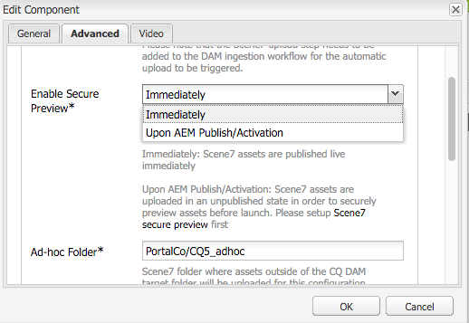

# Integreren met Dynamic Media Classic (Scene7){#integrating-with-dynamic-media-classic-scene}

[Adobe Dynamic Media Classic](https://help.adobe.com/en_US/scene7/using/WS26AB0D9A-F51C-464e-88C8-580A5A82F810.html) is een gehoste oplossing voor het beheren, verbeteren, publiceren en leveren van rijke media-elementen aan web, mobiele apparaten, e-mail en displays en drukwerk via internet.

Als u Dynamic Media Classic wilt gebruiken, moet u de cloudconfiguratie zodanig configureren dat Dynamic Media Classic en AEM Assets met elkaar kunnen communiceren. In dit document wordt beschreven hoe u AEM en Dynamic Media Classic configureert.

Voor informatie over het gebruiken van alle Dynamische Klassieke componenten van Media op een pagina en het werken met video, zie het [Gebruiken van Dynamische Klassieke](../assets/scene7.md)Media.

>[!NOTE]
>
>* Het DHTML-viewerplatform van Dynamic Media Classic bereikte op 31 januari 2014 officieel het einde van de levensduur. Raadpleeg de veelgestelde vragen over de eindversie van de [DHTML-viewer voor meer informatie](../sites-administering/dhtml-viewer-endoflifefaqs.md).
>* Voordat u Dynamic Media Classic configureert voor gebruik met AEM, raadpleegt u [Tips](#best-practices-for-integrating-scene-with-aem) voor het integreren van Dynamic Media Classic met AEM.
>* Als u Dynamic Media Classic gebruikt met een aangepaste proxyconfiguratie, moet u zowel de proxyconfiguraties van de HTTP-client configureren als sommige functies van AEM de 3.x-API&#39;s en sommige andere de 4.x-API&#39;s gebruiken. 3.x wordt gevormd met [http://localhost:4502/system/console/configMgr/com.day.commons.httpclient](http://localhost:4502/system/console/configMgr/com.day.commons.httpclient) en 4.x wordt gevormd met [http://localhost:4502/system/console/configMgr/org.apache.http.proxyconfigurator](http://localhost:4502/system/console/configMgr/org.apache.http.proxyconfigurator).
>

## AEM/Dynamic Media Classic-integratie versus Dynamic Media {#aem-scene-integration-versus-dynamic-media}

AEM-gebruikers kunnen kiezen uit twee oplossingen om met dynamische media te werken: Of het integreren van hun instantie van AEM met Dynamische Klassieke Media of het gebruiken van de Dynamische oplossing van Media die in AEM wordt geïntegreerd.

Gebruik de volgende criteria om te bepalen welke oplossing moet worden gekozen:

* Als u een **bestaande** klant van de Klassieke van de Media van de Dynamische Media bent de rijke media activa in Dynamische Klassiek van Media voor publicatie en levering verblijven, maar u wilt die activa met de creatie van Plaatsen (WCM) en/of activa AEM voor beheer integreren, dan gebruik [AEM/Dynamische Klassieke punt-aan-punt integratie](#aem-scene-point-to-point-integration) van Media die in dit document wordt beschreven.

* Als u een **nieuwe** klant van AEM bent die rijke media leveringsbehoeften heeft, selecteer de [Dynamische optie](#aem-dynamic-media)van Media. Deze optie heeft de meeste zin als u geen bestaande S7-account hebt en veel middelen die in dat systeem zijn opgeslagen.

* In bepaalde gevallen kunt u beide oplossingen gebruiken. In het scenario [voor](/help/sites-administering/scene7.md#dual-use-scenario) tweeërlei gebruik wordt dat scenario beschreven.

### AEM/Dynamic Media Classic point-to-point integratie {#aem-scene-point-to-point-integration}

Wanneer u met middelen in deze oplossing werkt, doet u één van het volgende:

* U kunt elementen rechtstreeks uploaden naar Dynamic Media Classic en vervolgens via de **Dynamic Media Classic** -inhoudbrowser openen voor het ontwerpen van pagina&#39;s of
* Uploaden naar AEM Assets en vervolgens automatisch publiceren inschakelen naar Dynamic Media Classic; u hebt toegang via de **inhoudbrowser Middelen** voor het ontwerpen van pagina&#39;s

De componenten die u voor deze integratie gebruikt, bevinden zich in het **gedeelte Dynamische media Klassieke** component in de [ontwerpmodus.](/help/sites-authoring/author-environment-tools.md#page-modes)

### AEM Dynamic Media {#aem-dynamic-media}

AEM Dynamic Media is de samenvoeging van Dynamic Media Classic-functies rechtstreeks binnen het AEM-platform.

Wanneer u met middelen in deze oplossing werkt, volgt u deze workflow:

1. Eén afbeelding en video-elementen rechtstreeks uploaden naar AEM.
1. Video&#39;s rechtstreeks coderen in AEM.
1. Stel op afbeeldingen gebaseerde sets rechtstreeks samen in AEM.
1. Voeg, indien van toepassing, interactiviteit toe aan afbeeldingen of video&#39;s.

De componenten die u voor Dynamische Media gebruikt, bevinden zich in het gebied van de component **[!UICONTROL Dynamische media]** in de [ontwerpmodus](/help/sites-authoring/author-environment-tools.md#page-modes). Deze omvatten:

* **[!UICONTROL Dynamische media]** - De component **[!UICONTROL Dynamische media]** is slim - afhankelijk van of u een beeld of een video toevoegt, hebt u diverse opties. De component ondersteunt voorinstellingen voor afbeeldingen, op afbeeldingen gebaseerde viewers, zoals afbeeldingssets, centrifuges, gemengde mediasets en video. Bovendien reageert de viewer snel - de grootte van het scherm verandert automatisch op basis van de schermgrootte. Alle viewers zijn HTML5-viewers.

* **[!UICONTROL Interactieve media]** - De component **[!UICONTROL Interactieve media]** is bedoeld voor die elementen, zoals carrouselbanners, interactieve afbeeldingen en interactieve video, die interactiviteit op deze elementen hebben, zoals hotspots of afbeeldingen met hyperlinks. Deze component is slim. Afhankelijk van het feit of u een afbeelding of video toevoegt, hebt u verschillende opties. Bovendien reageert de viewer snel - de grootte van het scherm verandert automatisch op basis van de schermgrootte. Alle viewers zijn HTML5-viewers.

### Scenario voor tweeërlei gebruik {#dual-use-scenario}

U kunt de integratiefuncties van AEM zowel voor Dynamic Media als voor Dynamic Media Classic gelijktijdig gebruiken. In de volgende tabel met gebruiksgevallen wordt beschreven wanneer u bepaalde gebieden in- en uitschakelt.

Dynamische media en Dynamic Media Classic gelijktijdig gebruiken:

1. Configureer [Dynamic Media Classic](#creating-a-cloud-configuration-for-scene) in cloudservices.
1. Volg de specifieke instructies voor uw gebruiksgeval op:

   <table>
    <tbody>
    <tr>
    <td> </td>
    <td> </td>
    <td><strong> Dynamic Media </strong></td>
    <td> </td>
    <td><strong>Dynamic Media Classic-integratie</strong></td>
    <td> </td>
    </tr>
    <tr>
    <td><strong>Als u ...</strong></td>
    <td><strong>Hoofdletterwerkstroom gebruiken</strong></td>
    <td><strong>Afbeeldingen/video</strong></td>
    <td><strong>Dynamische mediacomponent</strong></td>
    <td><strong>S7 Inhoudsbrowser en -componenten</strong></td>
    <td><strong>Automatisch uploaden van middelen naar S7</strong></td>
    </tr>
    <tr>
    <td>Nieuw bij sites en dynamische media</td>
    <td>Elementen uploaden naar AEM en elementen op sitepagina's schrijven met de component AEM Dynamic Media</td>
    <td>
Aan
 
(Zie stap 3)
 </td>
    <td><a href="/help/assets/adding-dynamic-media-assets-to-pages.md">Aan</a></td>
    <td>Uit</td>
    <td>Uit</td>
    </tr>
    <tr>
    <td>In de detailhandel en zijn nieuw aan Plaatsen en Dynamische Media</td>
    <td>Niet-productactiva uploaden naar AEM voor beheer en levering. Upload PRODUCT-elementen naar Dynamic Media Classic en gebruik Dynamic Media Classic-inhoudsbrowser in AEM en onderdeel om pagina's met productdetails op sites te maken.</td>
    <td>
Aan
 
(Zie stap 3)
 </td>
    <td><a href="/help/assets/adding-dynamic-media-assets-to-pages.md">Aan</a></td>
    <td><a href="/help/assets/scene7.md#scene-content-browser">Aan</a></td>
    <td>Uit</td>
    </tr>
    <tr>
    <td>Nieuw bij Middelen en Dynamische media</td>
    <td>Elementen uploaden naar AEM-elementen en gepubliceerde URL-/insluitcode van Dynamic Media gebruiken</td>
    <td>
Aan
 
(Zie stap 3)
 </td>
    <td>Uit</td>
    <td>Uit</td>
    <td>Uit</td>
    </tr>
    <tr>
    <td>Nieuw bij dynamische media en sjablonen</td>
    <td>Dynamische media gebruiken voor beeldbewerking en video. De malplaatjes van het auteursbeeld in Dynamische Media Klassiek en gebruiken Dynamische Media Klassieke inhoudszoeker om malplaatjes in de pagina's van Plaatsen te omvatten.</td>
    <td>
Aan
 
(Zie stap 3)
 </td>
    <td><a href="/help/assets/adding-dynamic-media-assets-to-pages.md">Aan</a></td>
    <td><a href="/help/assets/scene7.md#scene-content-browser">Aan</a></td>
    <td>Uit</td>
    </tr>
    <tr>
    <td>Een bestaande Dynamische Klassieke klant van Media en zijn nieuw aan Plaatsen</td>
    <td>Elementen uploaden naar Dynamic Media Classic en de AEM Dynamic Media Classic-inhoudbrowser gebruiken om elementen op sitepagina's te zoeken en te ontwerpen</td>
    <td>Uit</td>
    <td>Uit</td>
    <td><a href="/help/assets/scene7.md#scene-content-browser">Aan</a></td>
    <td>Uit</td>
    </tr>
    <tr>
    <td>Een bestaande Dynamic Media Classic-klant en zijn nieuw voor sites en middelen</td>
    <td>Elementen uploaden naar DAM en automatisch publiceren naar Dynamic Media Classic voor levering. Gebruik de AEM Dynamic Media Classic-inhoudbrowser om elementen op sitepagina's te zoeken en te ontwerpen.</td>
    <td>Uit</td>
    <td>Uit</td>
    <td><a href="/help/assets/scene7.md#scene-content-browser">Aan</a></td>
    <td>
<a href="#configuringautouploadingfromaemassets">Aan</a>
 
(Zie stap 4)
 </td>
    </tr>
    <tr>
    <td>Bestaande Dynamic Media Classic-klant en nieuw voor middelen</td>
    <td>
Upload elementen naar AEM en gebruik Dynamic Media om uitvoeringen te genereren voor downloaden/delen. AEM-elementen automatisch publiceren naar Dynamic Media Classic voor levering.
 
<strong>Belangrijk:</strong> Incurs duplicate processing and renditions generated in AEM will not be synchronized to Dynamic Media Classic
 </td>
    <td>
Aan
 
(Zie stap 3)
 </td>
    <td>Uit</td>
    <td>Uit</td>
    <td>
<a href="#configuringautouploadingfromaemassets">Aan</a>
 
(Zie stap 4)
 </td>
    </tr>
    </tbody>
    </table>

1. (facultatief; zie gebruikscase table) - Opstelling de [Dynamische wolkenconfiguratie](/help/assets/config-dynamic.md) van Media en [laat de Dynamische server](/help/assets/config-dynamic.md)van Media toe.
1. (facultatief; zie gebruik case table) - als u verkiest om Automatisch uploaden van Activa aan Dynamische Klassiek van Media toe te laten, dan moet u het volgende toevoegen:

   1. Automatische upload instellen op Dynamic Media Classic.
   1. Voeg de **Dynamic Media Classic uploadstap** toe na alle stappen in de workflow Dynamische media *aan het einde van* de workflow Element **voor bijwerken van** Dam ( `https://<server>:<host>/cf#/etc/workflow/models/dam/update_asset.html)`
   1. (Optioneel) Beperk het laden van dynamische media Klassieke elementen door MIME-type in [https://&lt;server>:&lt;port>/system/console/configMgr/com.day.cq.dam.scene7.impl.Scene7AssetMimeTypeServiceImpl](http://localhost:4502/system/console/configMgr/com.day.cq.dam.scene7.impl.Scene7AssetMimeTypeServiceImpl). MIME-typen van middelen die niet in deze lijst staan, worden niet geüpload naar de Dynamic Media Classic-server.
   1. (Optioneel) Stel video in de Klassieke dynamische mediaconfiguratie in. U kunt videocodering voor of zowel Dynamic Media als Dynamic Media Classic gelijktijdig inschakelen. Dynamische uitvoeringen worden gebruikt voor lokale voorvertoning en afspelen in AEM-instantie, terwijl dynamische media Klassieke video-uitvoeringen worden gegenereerd en opgeslagen op Dynamic Media Classic-servers. Wanneer u videocoderingsservices instelt voor zowel Dynamic Media als Dynamic Media Classic, past u een [videoverwerkingsprofiel](/help/assets/video-profiles.md) toe op de map Dynamic Media Classic met middelen.
   1. (Optioneel) [Configureer Beveiligde voorvertoning in Dynamic Media Classic](/help/sites-administering/scene7.md#configuring-the-state-published-unpublished-of-assets-pushed-to-scene).

#### Beperkingen {#limitations}

Wanneer u zowel Dynamische Media Klassieke als Dynamische Media toegelaten hebt, zijn er de volgende beperkingen:

* Het handmatig uploaden naar Dynamic Media Classic door een element te selecteren en naar een Dynamic Media Classic-component op een AEM-pagina te slepen, werkt niet.
* Hoewel AEM-Dynamic Media Classic gesynchroniseerde elementen automatisch worden bijgewerkt naar Dynamic Media Classic wanneer het element wordt bewerkt in Elementen, wordt met een terugdraaiactie geen nieuwe upload geactiveerd, zodat Dynamic Media Classic niet meteen na een terugdraaiactie de laatste versie krijgt. Als tussenoplossing kunt u het terugdraaien opnieuw uitvoeren.
* Als u Dynamische Media voor één gebruiksgeval en Dynamische integratie van Media Classic voor een ander gebruiksgeval moet gebruiken, zodat de Dynamische activa van Media niet met het Dynamische Klassieke systeem van Media in wisselwerking staan, dan pas niet de Dynamische Klassieke configuratie van Media op de Dynamische omslag van Media, of de Dynamische configuratie van Media (verwerkingsprofiel) op een Dynamische omslag van Media Classic toe.

## Aanbevolen werkwijzen voor de integratie van Dynamic Media Classic met AEM {#best-practices-for-integrating-scene-with-aem}

Bij de integratie van Dynamic Media Classic met AEM zijn er enkele belangrijke aanbevolen procedures die in de volgende gebieden in acht moeten worden genomen:

* Uw integratie testen
* Elementen rechtstreeks uploaden vanaf Dynamic Media Classic wordt aanbevolen voor bepaalde scenario&#39;s

Zie [bekende beperkingen](#known-limitations-and-design-implications).

### Uw integratie testen {#test-driving-your-integration}

Adobe raadt u aan de integratie te testen door de hoofdmap alleen naar een submap te laten verwijzen in plaats van naar een volledig bedrijf.

>[!CAUTION]
>
>Het importeren van elementen van een bestaande Dynamic Media Classic-bedrijfsaccount kan lang duren voordat deze worden weergegeven in AEM. Zorg ervoor dat u een map in Dynamic Media Classic aanwijst die niet te veel elementen bevat (de hoofdmap bevat bijvoorbeeld vaak te veel elementen en het systeem loopt mogelijk vast).

### Elementen uploaden vanaf AEM-elementen in plaats van vanaf Dynamic Media Classic {#uploading-assets-from-aem-assets-versus-from-scene}

U kunt elementen uploaden met behulp van de functionaliteit voor middelenbeheer (digital asset management) of door Dynamic Media Classic rechtstreeks te openen in AEM via de browser voor dynamische media Classic-inhoud. Welke optie u kiest, is afhankelijk van de volgende factoren:

* Dynamische media Klassieke elementtypen die AEM Assets nog niet ondersteunt, moeten rechtstreeks vanuit Dynamic Media Classic aan een AEM-website worden toegevoegd via de Dynamic Media Classic-inhoudbrowser, bijvoorbeeld afbeeldingssjablonen.
* Voor elementtypen die door zowel AEM-middelen als Dynamic Media Classic worden ondersteund, is het van het volgende afhankelijk hoe u deze kunt uploaden:

   * Waar de activa vandaag zijn, EN
   * Hoe belangrijk is het beheer ervan in een gemeenschappelijke gegevensopslagplaats?

Als de elementen al in Dynamic Media Classic staan en in een gemeenschappelijke opslagplaats worden beheerd, is het niet zo belangrijk dat ze alleen naar AEM Assets worden geëxporteerd om ze weer te synchroniseren naar Dynamic Media Classic voor levering. Dit zou een onnodige tijdelijke conversie zijn. Anders heeft het de voorkeur elementen in één opslagplaats te houden en alleen voor levering te synchroniseren met Dynamic Media Classic.

## Dynamic Media Classic-integratie configureren {#configuring-scene-integration}

U kunt AEM configureren om elementen te uploaden naar Dynamic Media Classic. Middelen uit een CQ-doelmap kunnen (automatisch of handmatig) van AEM worden geüpload naar een Dynamic Media Classic-bedrijfsaccount.

>[!NOTE]
>
>Adobe raadt u aan alleen de toegewezen doelmap te gebruiken voor het importeren van Dynamic Media Classic-elementen. Digitale elementen die zich buiten de doelmap bevinden, kunnen alleen worden gebruikt in de Klassieke componenten van Dynamic Media op pagina&#39;s waarop de Klassieke configuratie van Dynamische media is ingeschakeld. Bovendien worden ze in een ad-hocmap in Dynamic Media Classic geplaatst. De map ad hoc wordt niet gesynchroniseerd met AEM (maar elementen zijn wel te vinden in de browser voor dynamische media klassieke inhoud).

Als u Dynamic Media Classic wilt configureren voor integratie met AEM, moet u de volgende stappen uitvoeren:

1. [Definieer een wolkenconfiguratie](#creating-a-cloud-configuration-for-scene) - Definieert de toewijzing tussen een dynamische map Media Classic en een map Middelen. U moet deze stap zelfs voltooien als u slechts eenrichtingssynchronisatie (AEM-middelen naar Dynamic Media Classic) wilt.
1. [Schakel de **Adobe CQ s7dam Dam Listener **](#enabling-the-adobe-cq-scene-dam-listener)in - Gereed in de[!UICONTROL OSGi]-console.
1. Als u AEM-elementen automatisch wilt uploaden naar Dynamic Media Classic, moet u die optie inschakelen en Dynamic Media Classic toevoegen aan de [!UICONTROL DAM Update Asset] -workflow. U kunt ook handmatig elementen uploaden.
1. Dynamische media Klassieke componenten aan sidekick toevoegen. Op deze manier kunnen gebruikers de Klassieke Dynamic Media-componenten op hun AEM-pagina&#39;s gebruiken.
1. [Wijs de configuratie toe aan de pagina in AEM](#enabling-scene-for-wcm) - Deze stap wordt vereist om het even welke videovoorinstellingen te bekijken die u in Dynamische Media Klassiek hebt gecreeerd. Dit is ook vereist als u een element van buiten de CQ-doelmap naar Dynamic Media Classic moet publiceren.

In deze sectie wordt beschreven hoe u al deze stappen uitvoert en worden belangrijke beperkingen weergegeven.

### Hoe synchronisatie tussen Dynamic Media Classic en AEM Assets werkt {#how-synchronization-between-scene-and-aem-assets-works}

Bij het instellen van AEM Assets en Dynamic Media Classic-synchronisatie is het belangrijk dat u het volgende begrijpt:

#### Uploaden naar Dynamic Media Classic vanaf AEM-elementen {#uploading-to-scene-from-aem-assets}

* Er is een toegewezen synchronisatiemap in AEM voor Dynamic Media Classic-uploads.
* Uploads naar Dynamic Media Classic kunnen worden geautomatiseerd als de digitale elementen in de toegewezen synchronisatiemap worden geplaatst.
* De map- en submapstructuur in AEM wordt gerepliceerd in Dynamic Media Classic.

>[!NOTE]
>
>AEM sluit alle metagegevens in als XMP voordat deze naar Dynamic Media Classic worden geüpload. Alle eigenschappen op het metagegevensknooppunt zijn dus beschikbaar in Dynamic Media Classic als XMP.

#### Bekende beperkingen en gevolgen voor het ontwerp {#known-limitations-and-design-implications}

Met de synchronisatie tussen AEM-middelen en Dynamic Media Classic zijn er momenteel de volgende beperkingen/ontwerpimplicaties:

<table>
 <tbody>
  <tr>
   <td><strong>Beperking/gevolgen van ontwerp</strong></td>
   <td><strong>Beschrijving</strong></td>
  </tr>
  <tr>
   <td>Eén toegewezen synchronisatiemap (doel)</td>
   <td>U kunt per bedrijf slechts één toegewezen map in AEM gebruiken voor Dynamic Media Classic-uploads. U kunt veelvoudige configuraties tot stand brengen als u toegang tot meer dan één bedrijfrekening in Dynamische Klassieke Media moet hebben.</td>
  </tr>
  <tr>
   <td>Mapstructuur</td>
   <td>Als u een gesynchroniseerde map met middelen verwijdert, worden alle Dynamic Media Classic externe middelen verwijderd, maar blijft de map ongewijzigd.</td>
  </tr>
  <tr>
   <td>Ad-hocmap</td>
   <td>Elementen die zich buiten de doelmap bevinden en die handmatig in WCM naar Dynamic Media Classic worden geüpload, worden automatisch in een aparte ad-hocmap op Dynamic Media Classic geplaatst. U configureert dit in de cloudconfiguratie in AEM.</td>
  </tr>
  <tr>
   <td>Gemengde media</td>
   <td>Gemengde mediasets worden weergegeven in AEM, maar worden niet ondersteund in AEM.</td>
  </tr>
  <tr>
   <td>PDF's</td>
   <td>Gegenereerde PDF's van eCatalogs in Dynamic Media Classic worden geïmporteerd in de CQ-doelmap.</td>
  </tr>
  <tr>
   <td>interface vernieuwen</td>
   <td>Bij het synchroniseren tussen AEM en Dynamic Media Classic moet u de gebruikersinterface vernieuwen om de wijzigingen weer te geven. </td>
  </tr>
  <tr>
   <td>Videominiaturen</td>
   <td>Als u een video uploadt naar AEM Assets voor codering via Dynamic Media Classic, kan het enige tijd duren voordat de videominiaturen en gecodeerde video's beschikbaar zijn in AEM Assets, afhankelijk van de videoverwerkingstijd.</td>
  </tr>
  <tr>
   <td>Doelsubmappen</td>
   <td>
Als u submappen gebruikt binnen de doelmap, moet u ervoor zorgen dat u unieke namen gebruikt voor elk element (ongeacht de locatie) of dat u Dynamic Media Classic configureert (in het gedeelte Instellen) om elementen niet te overschrijven, ongeacht de locatie.
 
Anders worden elementen met dezelfde naam die naar een dynamische Media Classic-doelsubmap zijn geüpload, wel geüpload, maar wordt het element met dezelfde naam in de doelmap verwijderd. 
 </td>
  </tr>
 </tbody>
</table>

### Dynamic Media Classic-servers configureren {#configuring-scene-servers}

Als u AEM achter een volmacht in werking stelt of speciale firewallmontages hebt, kunt u de gastheren van de verschillende gebieden uitdrukkelijk moeten toelaten. Servers worden in de inhoud beheerd `/etc/cloudservices/scene7/endpoints` en kunnen naar wens worden aangepast. Tik op een URL en bewerk deze vervolgens om de URL indien nodig te wijzigen. In vorige versies van AEM waren deze waarden hard-gecodeerd.

Als u navigeert naar `/etc/cloudservices/scene7/endpoints.html`, worden de servers weergegeven (en kunt u ze bewerken door op de URL te klikken):

### Een cloudconfiguratie maken voor Dynamic Media Classic {#creating-a-cloud-configuration-for-scene}

Een wolkenconfiguratie bepaalt de afbeelding tussen een Dynamische omslag van Media Klassiek en een omslag van AEM Middelen. Het moet worden gevormd om activa AEM met Dynamische Klassieke Media te synchroniseren. Zie Hoe de Synchronisatie voor meer informatie werkt.

>[!CAUTION]
>
>Het importeren van elementen van een bestaande Dynamic Media Classic-bedrijfsaccount kan lang duren voordat deze worden weergegeven in AEM. Zorg ervoor dat u een map in Dynamic Media Classic aanwijst die niet te veel elementen bevat (de hoofdmap bevat bijvoorbeeld vaak te veel elementen).
>
>Als u aandrijving de integratie wilt testen, kunt u het punt van de wortelomslag aan een subfolder slechts, in plaats van het volledige bedrijf willen hebben.

>[!NOTE]
>
>U kunt meerdere configuraties hebben: één wolkenconfiguratie vertegenwoordigt één gebruiker bij een Dynamisch Klassiek bedrijf van Media. Als u tot andere Dynamische Klassieke bedrijven of gebruikers van Media wilt toegang hebben, moet u veelvoudige configuraties tot stand brengen.

AEM configureren om elementen te kunnen publiceren naar Dynamic Media Classic:

1. Tik op het AEM-pictogram en navigeer naar **[!UICONTROL Implementatie > Cloud Services]** om toegang te krijgen tot Adobe Dynamic Media Classic.

1. Tik nu op **[!UICONTROL Configureren]**.

   

1. Voer in het veld **[!UICONTROL Titel]** en eventueel in het veld **[!UICONTROL Naam]** de juiste gegevens in. Tik op **[!UICONTROL Maken]**.

   >[!NOTE]
   >
   >Als u aanvullende configuraties maakt, wordt het veld **[!UICONTROL Bovenliggende configuratie]** weergegeven.
   >
   >Wijzig de bovenliggende configuratie **niet** . Het wijzigen van de bovenliggende configuratie kan de integratie onderbreken.

1. Voer het e-mailadres, het wachtwoord en de regio van uw Dynamic Media Classic-account in en tik op **[!UICONTROL Verbinden met Dynamic Media Classic]**. U bent verbonden met de Dynamic Media Classic-server en het dialoogvenster wordt uitgebreid met meer opties.

1. Voer de **[!UICONTROL bedrijfsnaam]** en het **[!UICONTROL hoofdpad]** in (dit is de gepubliceerde servernaam samen met een pad dat u wilt opgeven); als u de gepubliceerde servernaam niet kent, in Dynamische Media Classic, ga naar **[!UICONTROL Opstelling > de Opstelling]** van de Toepassing.)

   >[!NOTE]
   >
   >Het dynamische Klassieke hoofdpad van Media is de Dynamic Media Classic-map waarmee AEM verbinding maakt. U kunt de map verkleinen tot een specifieke map.

   >[!CAUTION]
   >
   >Afhankelijk van de grootte van de map Dynamic Media Classic kan het importeren van een hoofdmap lang duren. Bovendien kunnen dynamische Media Classic-gegevens de AEM-opslag overschrijden. Controleer of u de juiste map importeert. Door te veel gegevens te importeren, kan uw systeem worden gestopt.

   

1. Click **[!UICONTROL OK]**. AEM slaat uw configuratie op.

>[!NOTE]
>
>Als u opnieuw verbinding maakt:
>
>* Wanneer u bij het publiceren opnieuw verbinding maakt met Dynamic Media Classic, moet u het wachtwoord mogelijk opnieuw instellen tijdens het publiceren. Het opnieuw verbinden van het wachtwoord werkt dan niet. Dit is geen kwestie op de auteursinstantie.
>* Als u waarden zoals uw gebied, bedrijfsnaam wijzigt, moet u opnieuw verbinding maken met Dynamic Media Classic. Als de configuratieopties zijn gewijzigd maar niet zijn opgeslagen, geeft AEM ten onrechte nog aan dat de configuratie geldig is. Zorg ervoor dat u opnieuw verbinding maakt.
>

### Adobe CQ Dynamic Media Classic Dam Listener inschakelen {#enabling-the-adobe-cq-scene-dam-listener}

U moet de Adobe CQ Dynamic Media Classic Dam Listener inschakelen, die standaard is uitgeschakeld.

U schakelt dit als volgt in:

1. Tik op het pictogram [!UICONTROL Gereedschappen] en navigeer naar **[!UICONTROL Bewerkingen > Webconsole]**. De webconsole wordt geopend.
1. Navigeer naar **[!UICONTROL Adobe CQ Dynamic Media Classic Dam Listener]** en schakel het selectievakje **[!UICONTROL Ingeschakeld]** in.

   

1. Tik op **[!UICONTROL Opslaan]**.

### Aanpasbare time-out toevoegen aan Dynamic Media Classic Upload-workflow {#adding-configurable-timeout-to-scene-upload-workflow}

Wanneer een instantie AEM wordt gevormd om video het coderen door Dynamische Media Klassieke (Scene7), door gebrek te behandelen, is er een miniem onderbreking 35 op om het even welke uploadbaan. U kunt deze instelling configureren om mogelijk langere taken voor videocodering aan te passen:

1. Ga naar **http://localhost:4502/system/console/configMgr/com.day.cq.dam.scene7.impl.Scene7UploadServiceImpl**.

   

1. Wijzig het nummer naar wens in het veld Tijdslimiet voor **[!UICONTROL actieve taak]** . Alle niet-negatieve getallen worden in seconden met de maateenheid geaccepteerd. Standaard is dit ingesteld op 2100.

   >[!NOTE]
   >
   >Beste praktijken: De meeste elementen worden maximaal minuten ingesloten (bijvoorbeeld afbeeldingen). Maar in bepaalde gevallen - grotere video&#39;s bijvoorbeeld - zou de onderbrekingswaarde tot 7200 seconden (2 uren) moeten worden verhoogd om lange verwerkingstijd te verwerken. Anders wordt deze dynamische mediaclassieke uploadtaak gemarkeerd als **[!UICONTROL UploadFailed]** in de JCR-metagegevens.

1. Tik op **[!UICONTROL Opslaan]**.

### Autoupolatie van AEM Assets {#autouploading-from-aem-assets}

Vanaf AEM 6.3.2 zijn AEM-middelen nu voor u geconfigureerd, zodat alle digitale elementen die u uploadt naar Digital Asset Manager automatisch worden bijgewerkt naar Dynamic Media Classic als de elementen zich in een CQ-doelmap bevinden.

Wanneer een element wordt toegevoegd aan AEM Assets, wordt het automatisch geüpload en gepubliceerd naar Dynamic Media Classic.

>[!NOTE]
>
>De maximale bestandsgrootte voor automatisch uploaden van AEM Assets naar Dynamic Media Classic is 500 MB.

Om automatisch laden te configureren van AEM Assets:

1. Tik op het AEM-pictogram en navigeer naar **[!UICONTROL Implementatie > Cloud Services]** en tik onder Dynamische media onder Beschikbare configuraties op **[!UICONTROL dms7 (Dynamische media]**)
1. Tik op het tabblad **[!UICONTROL Geavanceerd]** , schakel het selectievakje Automatisch uploaden **[!UICONTROL inschakelen in en tik op]** OK ****. U moet nu de DAM Asset-workflow zodanig configureren dat het uploaden naar Dynamic Media Classic wordt opgenomen.

   >[!NOTE]
   >
   >Zie De status (gepubliceerd/ongepubliceerd) van elementen [configureren die aan Dynamic Media Classic](#configuring-the-state-published-unpublished-of-assets-pushed-to-scene) zijn doorgegeven voor informatie over het naar Dynamic Media Classic duwen van elementen in een niet-gepubliceerde status.

   

1. Navigeer terug naar de AEM welkomstpagina en tik op **[!UICONTROL Workflows]**. Dubbelklik op de workflow **DAM Update Asset** om deze te openen.
1. Navigeer in de assistent naar de **[!UICONTROL workflowcomponenten]** en selecteer **[!UICONTROL Dynamic Media Classic]**. Sleep **[!UICONTROL Dynamic Media Classic]** naar de workflow en tik op **[!UICONTROL Opslaan]**. Elementen die aan AEM Assets in de doelmap zijn toegevoegd, worden automatisch geüpload naar Dynamic Media Classic.

   

   >[!NOTE]
   >
   >* Wanneer u na het automatiseren elementen toevoegt die niet in de CQ-doelmap staan, worden deze niet geüpload naar Dynamic Media Classic.
   >* AEM sluit alle metagegevens in als XMP voordat deze naar Dynamic Media Classic worden geüpload. Alle eigenschappen op het metagegevensknooppunt zijn dus beschikbaar in Dynamic Media Classic als XMP.

### De status (gepubliceerd/niet gepubliceerd) van elementen configureren die naar Dynamic Media Classic worden geduwd {#configuring-the-state-published-unpublished-of-assets-pushed-to-scene}

Als u elementen van AEM-elementen naar Dynamic Media Classic duwt, kunt u ze automatisch publiceren (standaardgedrag) of ze naar Dynamic Media Classic duwen in een niet-gepubliceerde status.

Mogelijk wilt u elementen niet direct publiceren op Dynamic Media Classic als u deze in een testomgeving wilt testen voordat u live gaat. U kunt AEM met de Veilige testomgeving van Dynamic Media Classic gebruiken om elementen in een niet-gepubliceerde status rechtstreeks van Middelen naar Dynamic Media Classic te duwen.

Dynamische media Klassieke elementen blijven beschikbaar via een beveiligde voorvertoning. Alleen wanneer elementen binnen AEM worden gepubliceerd, worden de Dynamic Media Classic-elementen ook actief in productie.

Als u elementen direct wilt publiceren wanneer u ze naar Dynamic Media Classic duwt, hoeft u geen opties te configureren. Dit is het standaardgedrag.

Als u echter niet wilt dat elementen die aan Dynamic Media Classic worden doorgegeven, automatisch worden gepubliceerd, wordt in deze sectie beschreven hoe u AEM en Dynamic Media Classic kunt configureren om dit te doen.

#### Vereisten om elementen naar Dynamic Media Classic te verzenden zonder publicatie {#prerequisites-to-push-assets-to-scene-unpublished}

Voordat u elementen naar Dynamic Media Classic kunt duwen zonder ze te publiceren, moet u het volgende instellen:

1. Neem contact op met Dynamic Media Classic Customer Care (s7support@adobe.com) om een veilige voorvertoning voor uw Dynamic Media Classic-account in te schakelen.
1. Volg de aanwijzingen om een veilige voorvertoning voor uw Dynamic Media Classic-account in te [stellen.](https://help.adobe.com/en_US/scene7/using/WSd968ca97bf00cf72-5eeee3a113268dc80f5-8000.html)

Dit zijn de zelfde stappen u zou volgen om het even welke veilige testopstelling in Dynamische Klassiek van Media tot stand te brengen.

>[!NOTE]
>
>Als uw installatieomgeving een Unix 64-bits besturingssysteem is, raadpleegt u [https://helpx.adobe.com/experience-manager/kb/enable-xmp-write-back-64-bit-redhat.html](https://helpx.adobe.com/experience-manager/kb/enable-xmp-write-back-64-bit-redhat.html) over aanvullende configuratieopties die u moet instellen.

#### Bekende beperkingen voor het doorduwen van elementen in niet-gepubliceerde toestand {#known-limitations-for-pushing-assets-in-unpublished-state}

Houd rekening met de volgende beperkingen als u deze functie gebruikt:

* Er is geen ondersteuning voor versiebeheer.
* Als een element al in AEM is gepubliceerd en er een volgende versie wordt gemaakt, wordt die nieuwe versie onmiddellijk live gepubliceerd voor productie. Publiceren bij activering werkt alleen met de eerste publicatie van een element.

>[!NOTE]
>
>Als u elementen direct wilt publiceren, kunt u het beste **[!UICONTROL Beveiligde voorvertoning]** inschakelen ingeschakeld laten op **[!UICONTROL Direct]** en de functie Automatisch uploaden **** inschakelen gebruiken.

### De status van elementen die naar Dynamic Media Classic worden geduwd, instellen als niet-gepubliceerd {#setting-the-state-of-assets-pushed-to-scene-as-unpublished}

>[!NOTE]
>
>Als een gebruiker het element in AEM publiceert, wordt het S7-element automatisch geactiveerd voor de productie/het live-element (het element bevindt zich dan niet meer in een beveiligde voorvertoning/publicatie).

De status van elementen die naar Dynamic Media Classic worden geduwd, instellen als niet-gepubliceerd:

1. Tik op het AEM-pictogram en navigeer naar **[!UICONTROL Implementatie > Cloud Services]**, tik op **[!UICONTROL Dynamic Media Classic]** en selecteer uw configuratie in Dynamic Media Classic.
1. Tap the **[!UICONTROL Advanced]** tab. Selecteer in het vervolgkeuzemenu Beveiligde weergave **** inschakelen de optie **[!UICONTROL Op publicatieactivering]** van AEM om elementen naar Dynamic Media Classic te duwen zonder te publiceren. (Deze waarde wordt standaard ingesteld op **[!UICONTROL Direct]**, waarbij de dynamische media Klassieke elementen direct worden gepubliceerd.)

   Zie [Dynamic Media Classic-documentatie](https://help.adobe.com/en_US/scene7/using/WSd968ca97bf00cf72-5eeee3a113268dc80f5-8000.html) voor meer informatie over testelementen voordat u deze openbaar maakt.

   

1. Tik op **[!UICONTROL OK]**.

Als u Beveiligde weergave inschakelt, worden uw elementen zonder publicatie naar de beveiligde voorvertoningsserver verplaatst.

U kunt dit controleren door naar een dynamische Media Klassieke component op een pagina in AEM te navigeren en op **[!UICONTROL Bewerken]** te tikken. De beveiligde voorvertoningsserver voor het element wordt vermeld in de URL. Na publicatie in AEM wordt het serverdomein in de bestandsverwijzing bijgewerkt van de voorbeeld-URL naar de productie-URL.

### Dynamische media Klassiek inschakelen voor WCM {#enabling-scene-for-wcm}

Om twee redenen is het inschakelen van Dynamic Media Classic voor WCM vereist:

* De vervolgkeuzelijst met universele videoprofielen inschakelen voor het ontwerpen van pagina&#39;s. Zonder deze optie is de vervolgkeuzelijst **[!UICONTROL Universal Video Preset]** leeg en kan deze niet worden ingesteld.
* Als een digitaal element niet in de doelmap staat, kunt u het element uploaden naar Dynamic Media Classic als u Dynamic Media Classic voor die pagina inschakelt in de pagina-eigenschappen en het element naar een Dynamic Media Classic-component slepen. Normale overervingsregels zijn van toepassing (dit houdt in dat onderliggende pagina&#39;s de configuratie van de bovenliggende pagina overnemen).

Wanneer het toelaten van Dynamische Klassiek van Media voor WCM, merk op dat zoals met andere configuraties, overervingsregels van toepassing zijn. U kunt Dynamic Media Classic voor WCM inschakelen in de geoptimaliseerde aanraakinterface of in de klassieke gebruikersinterface.

#### Dynamische media Klassiek inschakelen voor WCM in de Touch-Optimized Gebruikersinterface {#enabling-scene-for-wcm-in-the-touch-optimized-user-interface}

Dynamic Media Classic inschakelen voor WCM in de interface met geoptimaliseerde aanrakingen:

1. Tik op het AEM-pictogram en navigeer naar **[!UICONTROL Sites]** en vervolgens naar de hoofdpagina van uw website (niet taalspecifiek).

1. Selecteer in de werkbalk het [!UICONTROL instellingenpictogram] en tik op Eigenschappen **** openen.

1. Tik op **[!UICONTROL Cloud Services]** en tik op Configuratie **** toevoegen en selecteer **[!UICONTROL Dynamic Media Classic]**.
1. Selecteer in de vervolgkeuzelijst **[!UICONTROL Adobe Dynamic Media Classic]** de gewenste configuratie en tik op **[!UICONTROL OK]**.

   

   Videovoorinstellingen uit die configuratie van Dynamic Media Classic zijn beschikbaar voor gebruik in AEM met de Dynamic Media Classic-videocomponent op die pagina en onderliggende pagina&#39;s.

#### Dynamische media Klassiek inschakelen voor WCM in de klassieke gebruikersinterface {#enabling-scene-for-wcm-in-the-classic-user-interface}

Dynamische media Klassiek voor WCM in klassieke UI toelaten:

1. Tik in AEM op **[!UICONTROL websites]** en navigeer naar de hoofdpagina van uw website (niet taalspecifiek).

1. Tik in de assistent op het pictogram **[!UICONTROL Pagina]** en tik op **[!UICONTROL Pagina-eigenschappen]**.

1. Tik op **[!UICONTROL Cloud Services > Services toevoegen > Dynamic Media Classic]**.
1. Selecteer in de vervolgkeuzelijst **[!UICONTROL Adobe Dynamic Media Classic]** de gewenste configuratie en tik op **[!UICONTROL OK]**.

   Videovoorinstellingen uit die configuratie van Dynamic Media Classic zijn beschikbaar voor gebruik in AEM met de Dynamic Media Classic-videocomponent op die pagina en onderliggende pagina&#39;s.

### Een standaardconfiguratie configureren {#configuring-a-default-configuration}

Als u veelvoudige Dynamische Klassieke configuraties van Media hebt, kunt u één van hen als gebrek voor Dynamische Media Klassieke inhoudbrowser specificeren.

Slechts één Dynamische Klassieke configuratie van Media kan als gebrek op een bepaald ogenblik worden gemerkt. De standaardconfiguratie is de bedrijfsactiva die door gebrek in Dynamische Media Klassieke Browser van de Inhoud tonen.

De standaardconfiguratie configureren:

1. Tik op het AEM-pictogram en navigeer naar **[!UICONTROL Implementatie > Cloud Services]**, tik op **[!UICONTROL Dynamic Media Classic]** en selecteer uw configuratie in Dynamic Media Classic.
1. Tik op **[!UICONTROL Bewerken]** om de configuratie te openen.

1. Schakel op het tabblad **[!UICONTROL Algemeen]** het selectievakje **[!UICONTROL Standaardconfiguratie]** in om dit het standaardbedrijf en basispad te maken dat wordt weergegeven in de browser met dynamische media klassieke inhoud.

   

   >[!NOTE]
   >
   >Als er slechts één configuratie is, heeft het selecteren van de **[!UICONTROL Standaarddoos van de Configuratie]** geen effect.

### De map Ad hoc configureren {#configuring-the-ad-hoc-folder}

U kunt de map configureren waarnaar elementen worden geüpload in Dynamic Media Classic wanneer het element zich niet in de CQ-doelmap bevindt. Zie Elementen publiceren van buiten de CQ-doelmap.

U configureert de ad-hocmap als volgt:

1. Tik op het AEM-pictogram en navigeer naar **[!UICONTROL Implementatie > Cloud Services]**, tik op **[!UICONTROL Dynamic Media Classic]** en selecteer uw configuratie in Dynamic Media Classic.
1. Tik op **[!UICONTROL Bewerken]** om de configuratie te openen.

1. Tap the **[!UICONTROL Advanced]** tab. In het veld **[!UICONTROL Ad-hocmap]** kunt u de map **Ad-hoc** wijzigen. Standaard is dit de **naam_van_het_bedrijf/CQ5_adhoc**.

   

### Universal Presets configureren {#configuring-universal-presets}

Zie [Video](/help/assets/s7-video.md)voor informatie over het configureren van Universal Presets voor de videocomponent.

## MIME op type gebaseerde elementen/Dynamic Media Classic uploadtaakparameterondersteuning inschakelen {#enabling-mime-type-based-assets-scene-upload-job-parameter-support}

U kunt configureerbare parameters voor dynamische Media Classic-uploadtaken inschakelen die worden geactiveerd door de synchronisatie van Digital Asset Manager/Dynamic Media Classic-elementen.

Specifiek, vormt u het erkende dossierformaat door MIME type in het OSGi (Open het initiatief van de Gateway van de Dienst) gebied van het paneel van de Configuratie van de Console van AEM Web. Vervolgens kunt u de afzonderlijke taakparameters voor uploaden aanpassen die worden gebruikt voor elk MIME-type in de JCR (Java Content Repository).

**Op MIME gebaseerde elementen inschakelen:**

1. Tap the AEM icon and navigate to **[!UICONTROL Tools > Operations > Web Console]**.
1. Tik in het deelvenster Configuratie webconsole van Adobe Experience Manager op **[!UICONTROL OSGi]** in het menu **[!UICONTROL Configuration]**.
1. Zoek onder de kolom Naam naar en tik op **[!UICONTROL Adobe CQ Dynamic Media Classic Asset MIME Type Service]** om de configuratie te bewerken.
1. Tik in het gebied MIME-typetoewijzing op een plusteken (+) om een MIME-type toe te voegen.

   Zie [Ondersteunde MIME-typen](/help/assets/assets-formats.md#supported-mime-types).

1. Typ de nieuwe naam van het MIME-type in het tekstveld.

   U zou bijvoorbeeld een waarde typen `<file_extension>=<mime_type>` zoals in `EPS=application/postscript` OR `PSD=image/vnd.adobe.photoshop`.

1. Tik in de rechterbenedenhoek van het configuratievenster op **[!UICONTROL Opslaan]**.
1. Tik terug naar AEM en tik in het linkerspoor op CRXDE Lite.
1. Navigeer op de pagina van CRXDE Lite, in de linkerspoorstaaf aan `/etc/cloudservices/scene7/<environment>` (substitueer `<environment>` de daadwerkelijke naam).
1. Vouw uit `<environment>` (vervangt `<environment>` de werkelijke naam) om het `mimeTypes` knooppunt weer te geven.
1. Tik op het mimeType dat u zojuist hebt toegevoegd.

   For example, `mimeTypes > application_postscript` OR `mimeTypes > image_vnd.adobe.photoshop`.

1. Tik rechts van de pagina CRXDE Lite op het tabblad **[!UICONTROL Eigenschappen]** .
1. Geef een parameter voor een dynamische mediaclassieke uploadtaak op in het veld **[!UICONTROL jobParam]** -waarde.

   Bijvoorbeeld, `psprocess="rasterize"&psresolution=120` .

   Zie de [Adobe Dynamic Media Classic Image Production System-API](https://marketing.adobe.com/resources/help/en_US/s7/ips_api/) voor extra uploadtaakparameters die u kunt gebruiken.

   >[!NOTE]
   >
   >Als u PSD-bestanden uploadt en u wilt deze als sjablonen met laagextracties verwerken, voert u het volgende in het **[!UICONTROL jobParam]** -waardeveld in:
   >
   >`process=MaintainLayers&createTemplate=true`
   >
   >Zorg ervoor dat het PSD-bestand &#39;lagen&#39; heeft. Als het strikt genomen één afbeelding of een afbeelding met een masker is, wordt de afbeelding verwerkt als een afbeelding omdat er geen lagen zijn om te verwerken.

1. Tik in de linkerbovenhoek van de pagina van CRXDE Lite op Alles **[!UICONTROL opslaan]**.

## Problemen met de integratie van Dynamic Media Classic en AEM oplossen {#troubleshooting-scene-and-aem-integration}

Als u problemen hebt met het integreren van AEM met Dynamic Media Classic, raadpleegt u de volgende scenario&#39;s voor oplossingen.

**Als het publiceren van uw digitale element naar Dynamic Media Classic mislukt:**

* Controleer of het element dat u probeert te uploaden, zich in de **[!UICONTROL CQ-doelmap]** bevindt (u geeft deze map op in de Dynamic Media Classic-cloudconfiguratie).
* Als dit niet het geval is, moet u de cloudconfiguratie in **[!UICONTROL Pagina-eigenschappen]** voor die pagina configureren om te uploaden naar de **[!UICONTROL CQ-ad-hocmap]** .

* Controleer de logboeken voor om het even welke informatie.

**Als uw videovoorinstellingen niet worden weergegeven:**

* Controleer of u de cloudconfiguratie van die pagina hebt geconfigureerd via **[!UICONTROL Pagina-eigenschappen]**. Videovoorinstellingen zijn beschikbaar in de Dynamic Media Classic-videocomponent.

**Als uw video-elementen niet worden afgespeeld in AEM:**

* Controleer of u de juiste videocomponent hebt gebruikt. De dynamische Klassieke videocomponent van Media is verschillend dan de component van de stichtingVideo. Zie [Elementaire videocomponent versus Dynamische Media Klassieke videocomponent](/help/assets/s7-video.md).

**Als nieuwe of gewijzigde elementen in AEM niet automatisch worden geüpload naar Dynamic Media Classic:**

* Zorg ervoor dat de elementen zich in de CQ-doelmap bevinden. Alleen elementen in de CQ-doelmap worden automatisch bijgewerkt (op voorwaarde dat u AEM-elementen hebt geconfigureerd voor het automatisch uploaden van elementen).
* Zorg ervoor dat u de configuratie voor Cloud Services zodanig hebt geconfigureerd dat Automatisch uploaden is ingeschakeld en dat u de workflow voor DAM-middelen hebt bijgewerkt en opgeslagen, zodat Dynamic Media Classic kan worden geüpload.
* Wanneer u een afbeelding uploadt naar een submap van de Dynamic Media Classic-doelmap, moet u een van de volgende handelingen uitvoeren:

   * Zorg ervoor dat de namen van alle elementen, ongeacht de locatie, uniek zijn. Anders wordt het element in de hoofddoelmap verwijderd en blijft alleen het element in de submap over.
   * Wijzig hoe Dynamic Media Classic elementen in het gedeelte Instellen van het Dynamic Media Classic-account overschrijft. Stel Dynamic Media Classic niet in om elementen te overschrijven, ongeacht de locatie als u elementen met dezelfde naam in submappen gebruikt.

**Als uw verwijderde elementen of mappen niet zijn gesynchroniseerd tussen Dynamic Media Classic en AEM:**

* Elementen en mappen die zijn verwijderd uit AEM Assets, worden nog steeds weergegeven in de gesynchroniseerde map in Dynamic Media Classic. U moet ze handmatig verwijderen.

**Als het uploaden van video mislukt**

* Als het uploaden van de video mislukt en u AEM gebruikt om video te coderen via de Dynamic Media Classic-integratie, raadpleegt u de configureerbare time-out [toevoegen aan de Dynamic Media Classic Upload-workflow](#adding-configurable-timeout-to-scene-upload-workflow).

>[!CAUTION]
>
>Het importeren van elementen van een bestaande Dynamic Media Classic-bedrijfsaccount kan lang duren voordat deze worden weergegeven in AEM. Zorg ervoor dat u een map in Dynamic Media Classic aanwijst die niet te veel elementen bevat (de hoofdmap bevat bijvoorbeeld vaak te veel elementen).
>
>Als u aandrijving de integratie wilt testen, kunt u het punt van de wortelomslag aan een subfolder slechts, in plaats van het volledige bedrijf willen hebben.

