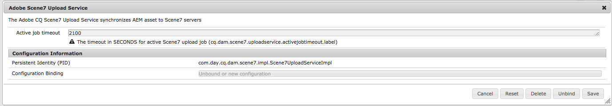

# Integreren met Dynamic Media Classic (Scene7){#integrating-with-dynamic-media-classic-scene}

[Adobe Dynamic Media Classic](https://help.adobe.com/en_US/scene7/using/WS26AB0D9A-F51C-464e-88C8-580A5A82F810.html) is een gehoste oplossing voor het beheren, verbeteren, publiceren en leveren van rijke mediabestanden aan webpagina&#39;s, mobiele apparaten, e-mailprogramma&#39;s en displays en drukapparaten met internetverbinding.

Om Dynamic Media Klassiek te gebruiken, moet u de wolkenconfiguratie vormen zodat de Klassieke Dynamic Media en de AEM Assets met elkaar kunnen in wisselwerking staan. In dit document wordt beschreven hoe u AEM en Dynamic Media Classic configureert.

Voor informatie bij het gebruiken van alle Dynamic Media Klassieke componenten op een pagina en het werken met video, zie het [Gebruiken van Dynamic Media Klassiek](../assets/scene7.md).

>[!NOTE]
>
>* Het DHTML-viewerplatform van Dynamic Media Classic bereikte op 31 januari 2014 officieel het einde van de levensduur. Raadpleeg de veelgestelde vragen over de eindversie van de [DHTML-viewer voor meer informatie](../sites-administering/dhtml-viewer-endoflifefaqs.md).
>* Alvorens Dynamic Media te vormen Klassiek om met AEM te werken, zie [Beste praktijken](#best-practices-for-integrating-scene-with-aem) voor het integreren van Dynamic Media Klassiek met AEM.
>* Als u Dynamic Media Klassiek met een configuratie van de douanevolmacht gebruikt, moet u zowel de volmachtsconfiguraties van de Cliënt van HTTP vormen aangezien sommige functionaliteiten van AEM 3.x APIs en sommige anderen 4.x APIs gebruiken. 3.x wordt gevormd met [http://localhost:4502/system/console/configMgr/com.day.commons.httpclient](http://localhost:4502/system/console/configMgr/com.day.commons.httpclient) en 4.x wordt gevormd met [http://localhost:4502/system/console/configMgr/org.apache.http.proxyconfigurator](http://localhost:4502/system/console/configMgr/org.apache.http.proxyconfigurator).
>

## AEM/Dynamic Media Klassieke integratie versus Dynamic Media {#aem-scene-integration-versus-dynamic-media}

AEM-gebruikers kunnen kiezen uit twee oplossingen om met dynamische media te werken: Of het integreren van hun instantie van AEM met Dynamic Media Klassiek of het gebruiken van de oplossing van Dynamic Media die in AEM wordt geïntegreerd.

Gebruik de volgende criteria om te bepalen welke oplossing moet worden gekozen:

* Als u een **bestaande** klant van de Klassieke Dynamic Media bent de rijke media activa die in Dynamic Media Classic voor publicatie en levering verblijven, maar u wilt die activa met de auteursrechten en/of AEM Assets van Plaatsen (WCM) voor beheer integreren, dan gebruik [AEM/Dynamic Media Klassieke punt-aan-punt integratie](#aem-scene-point-to-point-integration) die in dit document wordt beschreven.

* Als u een **nieuwe** klant van AEM bent die rijke media leveringsbehoeften heeft, selecteer de optie [van](#aem-dynamic-media)Dynamic Media. Deze optie heeft de meeste zin als u geen bestaande S7-account hebt en veel middelen die in dat systeem zijn opgeslagen.

* In bepaalde gevallen kunt u beide oplossingen gebruiken. In het scenario [voor](/help/sites-administering/scene7.md#dual-use-scenario) tweeërlei gebruik wordt dat scenario beschreven.

### AEM/Dynamic Media Klassieke point-to-point integratie {#aem-scene-point-to-point-integration}

Wanneer u met middelen in deze oplossing werkt, doet u één van het volgende:

* Elementen rechtstreeks uploaden naar Dynamic Media Classic en vervolgens openen via de **Dynamic Media Classic** -inhoudbrowser voor het ontwerpen van pagina&#39;s of
* Uploaden naar AEM Assets en vervolgens automatisch publiceren naar Dynamic Media Classic inschakelen; u hebt toegang via de **inhoudbrowser Middelen** voor het ontwerpen van pagina&#39;s

De componenten die u voor deze integratie gebruikt, bevinden zich in het gebied **Dynamic Media Klassieke** component in de [ontwerpmodus.](/help/sites-authoring/author-environment-tools.md#page-modes)

### AEM-Dynamic Media {#aem-dynamic-media}

AEM Dynamic Media is de eenmaking van Dynamic Media Klassieke eigenschappen direct binnen het platform AEM.

Wanneer u met middelen in deze oplossing werkt, volgt u deze workflow:

1. Eén afbeelding en video-elementen rechtstreeks uploaden naar AEM.
1. Video&#39;s rechtstreeks coderen in AEM.
1. Stel op afbeeldingen gebaseerde sets rechtstreeks samen in AEM.
1. Voeg, indien van toepassing, interactiviteit toe aan afbeeldingen of video&#39;s.

De componenten die u voor Dynamic Media gebruikt, bevinden zich in het **[!UICONTROL Dynamic Media]** componentgebied in de [ontwerpmodus](/help/sites-authoring/author-environment-tools.md#page-modes). Deze omvatten:

* **[!UICONTROL Dynamic Media]** - De **[!UICONTROL Dynamic Media]** component is slim. Afhankelijk van het feit of u een afbeelding of video toevoegt, hebt u verschillende opties. De component ondersteunt voorinstellingen voor afbeeldingen, op afbeeldingen gebaseerde viewers, zoals afbeeldingssets, centrifuges, gemengde mediasets en video. Bovendien reageert de viewer snel - de grootte van het scherm verandert automatisch op basis van de schermgrootte. Alle viewers zijn HTML5-viewers.

* **[!UICONTROL Interactive Media]** - De **[!UICONTROL Interactive Media]** component is bedoeld voor elementen, zoals carrouselbanners, interactieve afbeeldingen en interactieve video, die interactiviteit op deze elementen hebben, zoals hotspots of afbeeldingen met hyperlinks. Deze component is slim. Afhankelijk van het feit of u een afbeelding of video toevoegt, hebt u verschillende opties. Bovendien reageert de viewer snel - de grootte van het scherm verandert automatisch op basis van de schermgrootte. Alle viewers zijn HTML5-viewers.

### Scenario voor tweeërlei gebruik {#dual-use-scenario}

U kunt zowel Dynamic Media als Dynamic Media Classic-integratiefuncties van AEM tegelijk gebruiken. In de volgende tabel met gebruiksgevallen wordt beschreven wanneer u bepaalde gebieden in- en uitschakelt.

Dynamic Media en Dynamic Media tegelijkertijd gebruiken:

1. Configureer [Dynamic Media Classic](#creating-a-cloud-configuration-for-scene) in cloudservices.
1. Volg de specifieke instructies voor uw gebruiksgeval op:

   <table>
    <tbody>
    <tr>
    <td> </td>
    <td> </td>
    <td><strong> Dynamic Media </strong></td>
    <td> </td>
    <td><strong>Klassieke integratie van Dynamic Media</strong></td>
    <td> </td>
    </tr>
    <tr>
    <td><strong>Als u ...</strong></td>
    <td><strong>Hoofdletterwerkstroom gebruiken</strong></td>
    <td><strong>Afbeeldingen/video</strong></td>
    <td><strong>Component Dynamic Media</strong></td>
    <td><strong>S7 Inhoudsbrowser en -componenten</strong></td>
    <td><strong>Automatisch uploaden van middelen naar S7</strong></td>
    </tr>
    <tr>
    <td>Nieuw bij sites en Dynamic Media</td>
    <td>Elementen uploaden naar AEM en AEM Dynamic Media-component gebruiken om elementen op sitepagina's te maken</td>
    <td>
Aan
 
(Zie stap 3)
 </td>
    <td><a href="/help/assets/adding-dynamic-media-assets-to-pages.md">Aan</a></td>
    <td>Uit</td>
    <td>Uit</td>
    </tr>
    <tr>
    <td>In de detailhandel en zijn nieuw aan Plaatsen en Dynamic Media</td>
    <td>Niet-productactiva uploaden naar AEM voor beheer en levering. Upload PRODUCT-elementen naar Dynamic Media Classic en gebruik Dynamic Media Classic-inhoudsbrowser in AEM en onderdeel om productdetailpagina's op sites te maken.</td>
    <td>
Aan
 
(Zie stap 3)
 </td>
    <td><a href="/help/assets/adding-dynamic-media-assets-to-pages.md">Aan</a></td>
    <td><a href="/help/assets/scene7.md#scene-content-browser">Aan</a></td>
    <td>Uit</td>
    </tr>
    <tr>
    <td>Nieuwe elementen en Dynamic Media</td>
    <td>Elementen uploaden naar AEM Assets en gepubliceerde URL-/insluitcode van Dynamic Media gebruiken</td>
    <td>
Aan
 
(Zie stap 3)
 </td>
    <td>Uit</td>
    <td>Uit</td>
    <td>Uit</td>
    </tr>
    <tr>
    <td>Nieuw bij Dynamic Media en sjablonen</td>
    <td>Gebruik Dynamic Media voor beeldbewerking en video. Auteur beeldmalplaatjes in Dynamic Media Klassiek en gebruik Dynamic Media Klassieke inhoudszoeker om malplaatjes in de pagina's van Plaatsen te omvatten.</td>
    <td>
Aan
 
(Zie stap 3)
 </td>
    <td><a href="/help/assets/adding-dynamic-media-assets-to-pages.md">Aan</a></td>
    <td><a href="/help/assets/scene7.md#scene-content-browser">Aan</a></td>
    <td>Uit</td>
    </tr>
    <tr>
    <td>Een bestaande Klassieke klant van Dynamic Media en zijn nieuw aan Plaatsen</td>
    <td>Elementen uploaden naar Dynamic Media Classic en gebruikmaken van AEM Dynamic Media Classic-inhoudsbrowser om elementen op sitepagina's te zoeken en te ontwerpen</td>
    <td>Uit</td>
    <td>Uit</td>
    <td><a href="/help/assets/scene7.md#scene-content-browser">Aan</a></td>
    <td>Uit</td>
    </tr>
    <tr>
    <td>Een bestaande Dynamic Media Klassieke klant en zijn nieuw aan Plaatsen en Activa</td>
    <td>Elementen uploaden naar DAM en automatisch publiceren naar Dynamic Media Classic voor levering. Gebruik AEM Dynamic Media Classic-inhoudbrowser om elementen op sitepagina's te zoeken en te ontwerpen.</td>
    <td>Uit</td>
    <td>Uit</td>
    <td><a href="/help/assets/scene7.md#scene-content-browser">Aan</a></td>
    <td>
<a href="#configuringautouploadingfromaemassets">Aan</a>
 
(Zie stap 4)
 </td>
    </tr>
    <tr>
    <td>Bestaande Dynamic Media Klassieke klant en nieuw voor middelen</td>
    <td>
Elementen uploaden naar AEM en Dynamic Media gebruiken om uitvoeringen te genereren voor downloaden/delen. AEM-elementen automatisch publiceren naar Dynamic Media Klassiek voor levering.
 
<strong>Belangrijk:</strong> Incurs duplicate processing and renditions generated in AEM will not be synchronized to Dynamic Media Classic
 </td>
    <td>
Aan
 
(Zie stap 3)
 </td>
    <td>Uit</td>
    <td>Uit</td>
    <td>
<a href="#configuringautouploadingfromaemassets">Aan</a>
 
(Zie stap 4)
 </td>
    </tr>
    </tbody>
    </table>

1. (facultatief; zie gebruikscase table) - Opstelling de de wolkenconfiguratie [van](/help/assets/config-dynamic.md) Dynamic Media en [laat de server](/help/assets/config-dynamic.md)van Dynamic Media toe.
1. (facultatief; zie gebruik case table) - als u verkiest om Automatisch uploaden van Activa aan Dynamic Media Klassiek toe te laten, dan moet u het volgende toevoegen:

   1. Automatische upload instellen op Dynamic Media Classic.
   1. Voeg de **Dynamic Media Klassieke upload** stap toe na alle stappen van de Dynamic Media werkstroom *aan het eind* van de werkstroom van de Activa **van de Update van** Dam ( `https://<server>:<host>/cf#/etc/workflow/models/dam/update_asset.html)`
   1. (Optioneel) Beperk het aantal Dynamic Media voor het uploaden van klassieke middelen door MIME-type in [https://&lt;server>:&lt;port>/system/console/configMgr/com.day.cq.dam.scene7.impl.Scene7AssetMimeTypeServiceImpl](http://localhost:4502/system/console/configMgr/com.day.cq.dam.scene7.impl.Scene7AssetMimeTypeServiceImpl). MIME-typen van middelen die niet in deze lijst staan, worden niet geüpload naar de Classic-server van Dynamic Media.
   1. (Optioneel) Video instellen in Klassieke configuratie van Dynamic Media. U kunt videocodering voor een van beide of zowel Dynamic Media als Dynamic Media Classic gelijktijdig inschakelen. Dynamische uitvoeringen worden gebruikt voor lokale voorvertoning en afspelen in AEM-instantie, terwijl Dynamic Media Klassieke video-uitvoeringen worden gegenereerd en opgeslagen op Dynamic Media Klassieke servers. Wanneer u videocoderingsservices instelt voor zowel Dynamic Media als Dynamic Media Classic, past u een [videoverwerkingsprofiel](/help/assets/video-profiles.md) toe op de map met klassieke Dynamic Media.
   1. (Optioneel) [Configureer Beveiligde voorvertoning in Dynamic Media Classic](/help/sites-administering/scene7.md#configuring-the-state-published-unpublished-of-assets-pushed-to-scene).

#### Beperkingen {#limitations}

Wanneer u zowel Dynamic Media Klassiek als Dynamic Media toegelaten hebt, zijn er de volgende beperkingen:

* Het handmatig uploaden naar Dynamic Media Klassiek door een element te selecteren en naar een Dynamic Media Klassieke component op een AEM-pagina te slepen, werkt niet.
* Alhoewel de Klassieke gesynchroniseerde activa van AEM-Dynamic Media automatisch aan Dynamic Media worden bijgewerkt Klassiek wanneer het element in Activa wordt uitgegeven, brengt een terugschroeven van prijzenactie geen nieuwe upload teweeg, zodat Dynamic Media Klassiek niet de recentste versie onmiddellijk na een terugschroeven van prijzen zou krijgen. Als tussenoplossing kunt u het terugdraaien opnieuw uitvoeren.
* Als u Dynamic Media voor één gebruiksgeval en Dynamic Media Klassieke integratie voor een ander gebruiksgeval moet gebruiken, zodat de Dynamic Media activa niet met het Klassieke systeem van Dynamic Media interactie aangaan, dan pas niet de Klassieke configuratie van Dynamic Media op de omslag van Dynamic Media, of de configuratie van Dynamic Media (verwerkingsprofiel) op een Dynamic Media Klassieke omslag toe.

## Aanbevolen procedures voor de integratie van Dynamic Media Classic met AEM {#best-practices-for-integrating-scene-with-aem}

Bij de integratie van Dynamic Media Classic met AEM zijn er enkele belangrijke best practices die in acht moeten worden genomen op de volgende gebieden:

* Uw integratie testen
* Elementen rechtstreeks vanaf Dynamic Media uploaden Klassiek aanbevolen voor bepaalde scenario&#39;s

Zie [bekende beperkingen](#known-limitations-and-design-implications).

### Uw integratie testen {#test-driving-your-integration}

Adobe raadt u aan de integratie te testen door de hoofdmap alleen naar een submap te laten verwijzen in plaats van naar een volledig bedrijf.

>[!CAUTION]
>
>Het importeren van activa van een bestaande Dynamic Media Het kan lang duren voordat deze in AEM worden weergegeven. Zorg ervoor dat u een map in Dynamic Media Classic aanwijst die niet te veel elementen bevat (de hoofdmap bevat bijvoorbeeld vaak te veel elementen en het systeem loopt mogelijk vast).

### Elementen uploaden vanuit AEM Assets versus Dynamic Media Classic {#uploading-assets-from-aem-assets-versus-from-scene}

U kunt elementen uploaden met behulp van de functionaliteit voor middelenbeheer (digital asset management) of door Dynamic Media Classic rechtstreeks te openen in AEM via de browser voor klassieke inhoud van Dynamic Media. Welke optie u kiest, is afhankelijk van de volgende factoren:

* Dynamic Media Klassieke elementtypen die AEM Assets nog niet ondersteunen, moeten rechtstreeks vanuit Dynamic Media Classic aan een AEM-website worden toegevoegd via de browser Dynamic Media Klassieke inhoud, bijvoorbeeld afbeeldingssjablonen.
* Voor activatypen die door zowel AEM Assets als Dynamic Media Klassiek worden gesteund, hangt het beslissen hoe te om hen te uploaden van het volgende af:

   * Waar de activa vandaag zijn, EN
   * Hoe belangrijk is het beheer ervan in een gemeenschappelijke gegevensopslagplaats?

Als de activa reeds in Dynamic Media Klassiek zijn en het beheren van hen in een gemeenschappelijke bewaarplaats niet zo belangrijk is, dan zou het uitvoeren van hen naar AEM Assets slechts om hen terug naar Dynamic Media Klassiek voor levering terug te synchroniseren een onnodige roundtrip zijn. Anders heeft het de voorkeur activa in één opslagplaats te houden en alleen voor levering te synchroniseren met Dynamic Media Klassiek.

## Klassieke integratie van Dynamic Media configureren {#configuring-scene-integration}

U kunt AEM configureren om elementen te uploaden naar Dynamic Media Classic. Elementen uit een CQ-doelmap kunnen (automatisch of handmatig) van AEM worden geüpload naar een Classic-bedrijfsaccount voor Dynamic Media.

>[!NOTE]
>
>Adobe raadt u aan alleen de toegewezen doelmap te gebruiken voor het importeren van Dynamic Media Klassieke elementen. Digitale middelen die buiten de doelomslag verblijven kunnen slechts in Dynamic Media Klassieke componenten op pagina&#39;s worden gebruikt waar de Klassieke configuratie van Dynamic Media is toegelaten. Bovendien worden ze in een ad-hocmap in Dynamic Media Classic geplaatst. De ad-hocmap is niet gesynchroniseerd met AEM (maar de elementen zijn te vinden in de browser Dynamic Media Classic-inhoud).

Om Dynamic Media Klassiek te vormen om met AEM te integreren, moet u de volgende stappen voltooien:

1. [Definieer een cloudconfiguratie](#creating-a-cloud-configuration-for-scene) - Definieert de toewijzing tussen een map Dynamic Media Classic en een map Middelen. U moet deze stap voltooien zelfs als u (AEM Assets aan Klassieke Dynamic Media slechts) synchronisatie in één richting wilt.
1. [Schakel de **Adobe CQ s7dam Dam Listener **](#enabling-the-adobe-cq-scene-dam-listener)in - Gereed in de[!UICONTROL OSGi]console.
1. Als u AEM-elementen automatisch wilt uploaden naar Dynamic Media Classic, moet u die optie inschakelen en Dynamic Media Classic toevoegen aan de [!UICONTROL DAM Update Asset] workflow. U kunt ook handmatig elementen uploaden.
1. Dynamic Media Klassieke componenten toevoegen aan het hulpdekick. Op deze manier kunnen gebruikers Dynamic Media Klassieke componenten op hun AEM-pagina&#39;s gebruiken.
1. [Wijs de configuratie aan de pagina in AEM](#enabling-scene-for-wcm) toe - Deze stap wordt vereist om het even welke video vooraf instelt te bekijken die u in Dynamic Media Klassiek hebt gecreeerd. Dit is ook vereist als u een middel van buiten de CQ-doelmap naar Dynamic Media Classic moet publiceren.

In deze sectie wordt beschreven hoe u al deze stappen uitvoert en worden belangrijke beperkingen weergegeven.

### Hoe de synchronisatie tussen Dynamic Media Klassiek en AEM Assets werkt {#how-synchronization-between-scene-and-aem-assets-works}

Bij het opzetten van AEM Assets en Dynamic Media Klassieke synchronisatie, is het belangrijk om het volgende te begrijpen:

#### Uploaden naar Dynamic Media Classic vanuit AEM Assets {#uploading-to-scene-from-aem-assets}

* Er is een toegewezen synchronisatiemap in AEM voor Dynamic Media Classic-uploads.
* Uploads naar Dynamic Media Classic kunnen worden geautomatiseerd als de digitale middelen in de aangewezen synchronisatiemap worden geplaatst.
* De map- en submapstructuur in AEM wordt gerepliceerd in Dynamic Media Classic.

>[!NOTE]
>
>AEM sluit alle metagegevens in als XMP voordat deze naar Dynamic Media Classic worden geüpload. Alle eigenschappen op het metagegevensknooppunt zijn dus beschikbaar in Dynamic Media Classic als XMP.

#### Bekende beperkingen en gevolgen voor het ontwerp {#known-limitations-and-design-implications}

Met de synchronisatie tussen AEM Assets en Dynamic Media Klassiek, zijn er momenteel de volgende beperkingen/ontwerpimplicaties:

<table>
 <tbody>
  <tr>
   <td><strong>Beperking/gevolgen van ontwerp</strong></td>
   <td><strong>Beschrijving</strong></td>
  </tr>
  <tr>
   <td>Eén toegewezen synchronisatiemap (doel)</td>
   <td>U kunt per bedrijf slechts één toegewezen map in AEM gebruiken voor Dynamic Media Classic-uploads. U kunt veelvoudige configuraties tot stand brengen als u toegang tot meer dan één bedrijfrekening in Dynamic Media Klassiek moet hebben.</td>
  </tr>
  <tr>
   <td>Mapstructuur</td>
   <td>Als u een gesynchroniseerde map met middelen verwijdert, worden alle Dynamic Media Classic externe middelen verwijderd, maar blijft de map behouden.</td>
  </tr>
  <tr>
   <td>Ad-hocmap</td>
   <td>Elementen die zich buiten de doelmap bevinden en die handmatig naar Dynamic Media Classic in WCM worden geüpload, worden automatisch in een aparte ad-hocmap op Dynamic Media Classic geplaatst. U configureert dit in de cloudconfiguratie in AEM.</td>
  </tr>
  <tr>
   <td>Gemengde media</td>
   <td>Gemengde mediasets worden weergegeven in AEM, maar worden niet ondersteund in AEM.</td>
  </tr>
  <tr>
   <td>PDF's</td>
   <td>Gegenereerde PDF's van eCatalogs in Dynamic Media Classic worden geïmporteerd in de CQ-doelmap.</td>
  </tr>
  <tr>
   <td>interface vernieuwen</td>
   <td>Wanneer het synchroniseren tussen AEM en Dynamic Media Klassiek, ben zeker om het gebruikersinterface te verfrissen om veranderingen te bekijken. </td>
  </tr>
  <tr>
   <td>Videominiaturen</td>
   <td>Als u een video uploadt naar AEM Assets voor codering via Dynamic Media Classic, kan het enige tijd duren voordat de videominiaturen en gecodeerde video's beschikbaar zijn in AEM Assets, afhankelijk van de videoverwerkingstijd.</td>
  </tr>
  <tr>
   <td>Target-submappen</td>
   <td>
Als u submappen gebruikt binnen de doelmap, moet u ervoor zorgen dat u unieke namen gebruikt voor elk element (ongeacht de locatie) of dat u Dynamic Media Klassiek configureert (in het gedeelte Instellen) om elementen niet te overschrijven, ongeacht de locatie.
 
Anders worden elementen met dezelfde naam die naar een Classic-doelsubmap van Dynamic Media zijn geüpload, wel geüpload, maar wordt het element met dezelfde naam in de doelmap verwijderd. 
 </td>
  </tr>
 </tbody>
</table>

### Klassieke Dynamic Media-servers configureren {#configuring-scene-servers}

Als u AEM achter een volmacht in werking stelt of speciale firewallmontages hebt, kunt u de gastheren van de verschillende gebieden uitdrukkelijk moeten toelaten. Servers worden in de inhoud beheerd `/etc/cloudservices/scene7/endpoints` en kunnen naar wens worden aangepast. Tik op een URL en bewerk deze vervolgens om de URL indien nodig te wijzigen. In vorige versies van AEM waren deze waarden hard-gecodeerd.

Als u navigeert naar `/etc/cloudservices/scene7/endpoints.html`, worden de servers weergegeven (en kunt u ze bewerken door op de URL te klikken):

### Een cloudconfiguratie maken voor Dynamic Media Classic {#creating-a-cloud-configuration-for-scene}

Een wolkenconfiguratie bepaalt de afbeelding tussen een Klassieke omslag van Dynamic Media en een omslag van AEM Assets. Het moet worden gevormd om AEM Assets met Dynamic Media Klassiek te synchroniseren. Zie Hoe de Synchronisatie voor meer informatie werkt.

>[!CAUTION]
>
>Het importeren van activa van een bestaande Dynamic Media Het kan lang duren voordat deze in AEM worden weergegeven. Zorg ervoor dat u een map in Dynamic Media Classic aanwijst die niet te veel elementen bevat (de hoofdmap bevat bijvoorbeeld vaak te veel elementen).
>
>Als u aandrijving de integratie wilt testen, kunt u het punt van de wortelomslag aan een subfolder slechts, in plaats van het volledige bedrijf willen hebben.

>[!NOTE]
>
>U kunt meerdere configuraties hebben: één wolkenconfiguratie vertegenwoordigt één gebruiker bij een Klassiek bedrijf van Dynamic Media. Als u tot andere Klassieke bedrijven of gebruikers van Dynamic Media wilt toegang hebben, moet u veelvoudige configuraties tot stand brengen.

Om AEM te vormen om activa aan Dynamic Media Klassiek te kunnen publiceren:

1. Tik op het AEM-pictogram en navigeer naar **[!UICONTROL Deployment > Cloud Services]** Adobe Dynamic Media Classic.

1. Tik op **[!UICONTROL Configure now.]**

   

1. Voer in het **[!UICONTROL Title]** veld en eventueel in het **[!UICONTROL Name]** veld de juiste informatie in. Tik op **[!UICONTROL Create.]**

   >[!NOTE]
   >
   >Als u aanvullende configuraties maakt, wordt het **[!UICONTROL parent configuration]** veld weergegeven.
   >
   >Wijzig de bovenliggende configuratie **niet** . Het wijzigen van de bovenliggende configuratie kan de integratie onderbreken.

1. Voer het e-mailadres, het wachtwoord en de regio van uw Klassieke account voor Dynamic Media in en tik op **[!UICONTROL Connect to Dynamic Media Classic.]** U bent verbonden met de Klassieke server voor Dynamic Media en het dialoogvenster wordt uitgebreid met meer opties.

1. Voer de **[!UICONTROL Company]** naam en **[!UICONTROL Root Path]** (dit is de naam van de gepubliceerde server samen met het pad dat u wilt opgeven) in. als u de gepubliceerde servernaam niet kent, in Dynamic Media Classic, ga naar **[!UICONTROL Setup > Application Setup.]**)

   >[!NOTE]
   >
   >Het Klassieke de wortelweg van Dynamic Media is de Klassieke omslag van Dynamic Media AEM verbindt met. U kunt de map verkleinen tot een specifieke map.

   >[!CAUTION]
   >
   >Afhankelijk van de grootte van de klassieke map Dynamic Media kan het importeren van een hoofdmap lang duren. Bovendien zouden de Klassieke gegevens van Dynamic Media de opslag van AEM kunnen overschrijden. Controleer of u de juiste map importeert. Door te veel gegevens te importeren, kan uw systeem worden gestopt.

   

1. Klik op **[!UICONTROL OK.]** AEM om uw configuratie op te slaan.

>[!NOTE]
>
>Als u opnieuw verbinding maakt:
>
>* Wanneer u bij het publiceren opnieuw verbinding maakt met Dynamic Media Classic, moet u mogelijk het wachtwoord opnieuw instellen bij het publiceren of wanneer opnieuw verbinden niet werkt. Dit is geen kwestie op de auteursinstantie.
>* Als u waarden zoals uw gebied, bedrijfsnaam wijzigt, moet u opnieuw verbinden met Dynamic Media Klassiek. Als de configuratieopties zijn gewijzigd maar niet zijn opgeslagen, geeft AEM ten onrechte nog aan dat de configuratie geldig is. Zorg ervoor dat u opnieuw verbinding maakt.
>

### Adobe CQ Dynamic Media Classic Dam Listener inschakelen {#enabling-the-adobe-cq-scene-dam-listener}

U moet de Klassieke Adobe CQ Dynamic Media Dam Listener inschakelen, die standaard is uitgeschakeld.

U schakelt dit als volgt in:

1. Tik op het [!UICONTROL Tools] pictogram en navigeer naar **[!UICONTROL Operations > Web Console.]** de webconsole.
1. Navigeer naar **[!UICONTROL Adobe CQ Dynamic Media Classic Dam Listener]** en selecteer het **[!UICONTROL Enabled]** selectievakje.

   

1. Tik op  **[!UICONTROL Save.]**

### Aanpasbare time-out toevoegen aan Dynamic Media Classic Upload-workflow {#adding-configurable-timeout-to-scene-upload-workflow}

Wanneer een instantie AEM wordt gevormd om video het coderen door Dynamic Media Klassiek (Scene7), door gebrek te behandelen, is er een miniem onderbreking 35 op om het even welke uploadbaan. U kunt deze instelling configureren om mogelijk langere taken voor videocodering aan te passen:

1. Ga naar **http://localhost:4502/system/console/configMgr/com.day.cq.dam.scene7.impl.Scene7UploadServiceImpl**.

   

1. Wijzig het nummer naar wens in het **[!UICONTROL Active job timeout]** veld. Alle niet-negatieve getallen worden in seconden met de maateenheid geaccepteerd. Standaard is dit ingesteld op 2100.

   >[!NOTE]
   >
   >Beste praktijken: De meeste elementen worden maximaal minuten ingesloten (bijvoorbeeld afbeeldingen). Maar in bepaalde gevallen - grotere video&#39;s bijvoorbeeld - zou de onderbrekingswaarde tot 7200 seconden (2 uren) moeten worden verhoogd om lange verwerkingstijd te verwerken. Anders wordt deze klassieke uploadtaak van Dynamic Media gemarkeerd als **[!UICONTROL UploadFailed]** in de JCR-metagegevens.

1. Tik op **[!UICONTROL Save.]**

### Autouploading van AEM Assets {#autouploading-from-aem-assets}

Vanaf AEM 6.3.2 zijn er nu AEM Assets voor u geconfigureerd, zodat alle digitale elementen die u uploadt naar Digital Asset Manager automatisch worden bijgewerkt naar Dynamic Media Classic als de elementen zich in een CQ-doelmap bevinden.

Wanneer een element wordt toegevoegd aan AEM Assets, wordt het automatisch geüpload en gepubliceerd naar Dynamic Media Classic.

>[!NOTE]
>
>De maximale bestandsgrootte voor automatisch uploaden van AEM Assets naar Dynamic Media Classic is 500 MB.

Automatisch aanvullen configureren vanuit AEM Assets:

1. Tik op het AEM-pictogram en navigeer **[!UICONTROL Deployment > Cloud Services]** vervolgens onder de kop Dynamic Media onder Beschikbare configuraties naar **[!UICONTROL dms7 (Dynamic Media]**)
1. Tik op het **[!UICONTROL Advanced]** tabblad, selecteer het **[!UICONTROL Enable Automatic Upload]** selectievakje en tik op **[!UICONTROL OK.]** U moet nu de DAM Asset-workflow zodanig configureren dat het uploaden naar Dynamic Media Classic wordt opgenomen.

   >[!NOTE]
   >
   >Zie De status (gepubliceerd/niet gepubliceerd) van elementen [configureren die naar Dynamic Media Classic](#configuring-the-state-published-unpublished-of-assets-pushed-to-scene) worden geduwd voor informatie over het naar Dynamic Media Classic duwen in een niet-gepubliceerde status.

   

1. Navigeer terug naar de AEM welkomstpagina en tik **[!UICONTROL Workflows.]** Dubbelklik op de workflow **DAM Update Asset** om deze te openen.
1. Navigeer in de assistent naar de **[!UICONTROL Workflow]** componenten en selecteer **[!UICONTROL Dynamic Media Classic.]** Slepen **[!UICONTROL Dynamic Media Classic]** naar de workflow en tikken op **[!UICONTROL Save.]** Middelen die aan AEM Assets in de doelmap zijn toegevoegd, worden automatisch geüpload naar Dynamic Media Classic.

   

   >[!NOTE]
   >
   >* Wanneer u na het automatiseren elementen toevoegt die niet in de CQ-doelmap staan, worden deze niet naar Dynamic Media Classic geüpload.
   >* AEM sluit alle metagegevens in als XMP voordat deze naar Dynamic Media Classic worden geüpload. Alle eigenschappen op het metagegevensknooppunt zijn dus beschikbaar in Dynamic Media Classic als XMP.

### De status (gepubliceerd/niet gepubliceerd) van elementen configureren die naar Dynamic Media Classic worden geduwd {#configuring-the-state-published-unpublished-of-assets-pushed-to-scene}

Als u elementen van AEM Assets naar Dynamic Media Classic duwt, kunt u ze automatisch publiceren (standaardgedrag) of ze naar Dynamic Media Classic in een niet-gepubliceerde status duwen.

Mogelijk wilt u elementen niet direct publiceren op Dynamic Media Classic als u deze wilt testen in een testomgeving voordat u live gaat. U kunt AEM met de Veilige omgeving van de Test van Dynamic Media Classic gebruiken om activa van Activa in Dynamic Media Klassiek in een niet gepubliceerde staat direct te duwen.

Dynamic Media Klassieke elementen blijven beschikbaar via een beveiligde voorvertoning. Alleen wanneer activa binnen AEM worden gepubliceerd, worden de Dynamic Media Klassieke activa ook in productie genomen.

Als u elementen direct wilt publiceren wanneer u ze naar Dynamic Media Classic duwt, hoeft u geen opties te configureren. Dit is het standaardgedrag.

Nochtans, als u geen activa wilt die aan Dynamic Media Classic worden gedrukt om automatisch te publiceren, beschrijft deze sectie hoe te om AEM en Dynamic Media Classic te vormen om dit te doen.

#### Vereisten om elementen naar Dynamic Media te verzenden Classic niet gepubliceerd {#prerequisites-to-push-assets-to-scene-unpublished}

Voordat u elementen naar Dynamic Media Klassiek kunt duwen zonder ze te publiceren, moet u het volgende instellen:

1. Neem contact op met de Klassieke klantenservice van Dynamic Media (s7support@adobe.com) om een veilige voorvertoning voor uw Klassieke account voor Dynamic Media in te schakelen.
1. Volg de aanwijzingen om een veilige voorvertoning voor uw Dynamic Media Classic-account in te [stellen.](https://help.adobe.com/en_US/scene7/using/WSd968ca97bf00cf72-5eeee3a113268dc80f5-8000.html)

Dit zijn de zelfde stappen u zou volgen om het even welke veilige testopstelling in Dynamic Media Klassiek tot stand te brengen.

>[!NOTE]
>
>Als uw installatieomgeving een Unix 64-bits besturingssysteem is, raadpleegt u [https://helpx.adobe.com/experience-manager/kb/enable-xmp-write-back-64-bit-redhat.html](https://helpx.adobe.com/experience-manager/kb/enable-xmp-write-back-64-bit-redhat.html) over aanvullende configuratieopties die u moet instellen.

#### Bekende beperkingen voor het doorduwen van elementen in niet-gepubliceerde toestand  {#known-limitations-for-pushing-assets-in-unpublished-state}

Houd rekening met de volgende beperkingen als u deze functie gebruikt:

* Er is geen ondersteuning voor versiebeheer.
* Als een element al in AEM is gepubliceerd en er een volgende versie wordt gemaakt, wordt die nieuwe versie onmiddellijk live gepubliceerd voor productie. Publiceren bij activering werkt alleen met de eerste publicatie van een element.

>[!NOTE]
>
>Als u elementen direct wilt publiceren, kunt u het beste **[!UICONTROL Enable Secure Preview]** instellen op **[!UICONTROL Immediately]** en de **[!UICONTROL Enable Automatic Upload]** functie gebruiken.

### De status instellen van elementen die naar Dynamic Media worden geduwd Klassiek als niet-gepubliceerd {#setting-the-state-of-assets-pushed-to-scene-as-unpublished}

>[!NOTE]
>
>Als een gebruiker het element in AEM publiceert, wordt het S7-element automatisch geactiveerd voor de productie/het live-element (het element bevindt zich dan niet meer in een beveiligde voorvertoning/publicatie).

Om de staat van activa te plaatsen die aan Dynamic Media worden geduwd Klassiek zoals niet gepubliceerd:

1. Tik op het AEM-pictogram en navigeer naar **[!UICONTROL Deployment > Cloud Services]**, tik op **[!UICONTROL Dynamic Media Classic]** en selecteer de configuratie in Dynamic Media Classic.
1. Tik op het tabblad **[!UICONTROL Advanced]**. Selecteer in het **[!UICONTROL Enable Secure View]** keuzemenu de optie om elementen **[!UICONTROL Upon AEM Publish Activation]** naar Dynamic Media Klassiek te verplaatsen zonder te publiceren. (Deze waarde wordt standaard ingesteld op **[!UICONTROL Immediately]**, waarbij Dynamic Media Klassieke activa onmiddellijk worden gepubliceerd.)

   Zie [Dynamic Media Klassieke documentatie](https://help.adobe.com/en_US/scene7/using/WSd968ca97bf00cf72-5eeee3a113268dc80f5-8000.html) voor meer informatie over testmiddelen alvorens hen openbaar te maken.

   

1. Tik op **[!UICONTROL OK.]**

Als u Beveiligde weergave inschakelt, worden uw elementen zonder publicatie naar de beveiligde voorvertoningsserver verplaatst.

U kunt dit controleren door naar een klassieke Dynamic Media-component op een pagina in AEM te navigeren en op **[!UICONTROL Edit.]** het element te tikken. De beveiligde voorvertoningsserver wordt dan vermeld in de URL. Na publicatie in AEM wordt het serverdomein in de bestandsverwijzing bijgewerkt van de voorbeeld-URL naar de productie-URL.

### Dynamic Media Klassiek inschakelen voor WCM {#enabling-scene-for-wcm}

Het toelaten van Dynamic Media Klassiek voor WCM wordt vereist om twee redenen:

* De vervolgkeuzelijst met universele videoprofielen inschakelen voor het ontwerpen van pagina&#39;s. Zonder deze optie is de **[!UICONTROL Universal Video Preset]** vervolgkeuzelijst leeg en kan deze niet worden ingesteld.
* Als een digitaal element niet in de doelmap staat, kunt u het element uploaden naar Dynamic Media Classic als u Dynamic Media Classic voor die pagina inschakelt in de pagina-eigenschappen en het element naar een Dynamic Media Classic-component sleept. Normale overervingsregels zijn van toepassing (dit houdt in dat onderliggende pagina&#39;s de configuratie van de bovenliggende pagina overnemen).

Wanneer het toelaten van Dynamic Media Klassiek voor WCM, merk op dat zoals met andere configuraties, overervingsregels van toepassing zijn. U kunt Dynamic Media Classic voor WCM inschakelen in de geoptimaliseerde aanraakinterface of in de klassieke gebruikersinterface.

#### Dynamic Media Klassiek inschakelen voor WCM in de Touch-Optimized Gebruikersinterface {#enabling-scene-for-wcm-in-the-touch-optimized-user-interface}

Dynamic Media Klassiek inschakelen voor WCM in de geoptimaliseerde interface met aanraakbediening:

1. Tik op het AEM-pictogram en navigeer naar **[!UICONTROL Sites]** en vervolgens naar de hoofdpagina van uw website (niet taalspecifiek).

1. Selecteer in de werkbalk het [!UICONTROL settings] pictogram en tik op **[!UICONTROL Open Properties.]**

1. Tik **[!UICONTROL Cloud Services]** en tik **[!UICONTROL Add Configuration]** en selecteer **[!UICONTROL Dynamic Media Classic.]**
1. Selecteer in de **[!UICONTROL Adobe Dynamic Media Classic]** vervolgkeuzelijst de gewenste configuratie en tik op **[!UICONTROL OK.]**

   

   De video stelt van die configuratie van Dynamic Media Klassiek zijn beschikbaar voor gebruik in AEM met de Klassieke videocomponent van Dynamic Media op die pagina en kindpagina&#39;s.

#### Dynamic Media Klassiek inschakelen voor WCM in de klassieke gebruikersinterface {#enabling-scene-for-wcm-in-the-classic-user-interface}

Om Dynamic Media Klassiek voor WCM in klassieke UI toe te laten:

1. Tik in AEM op de hoofdpagina van uw website **[!UICONTROL Websites]** en navigeer naar de hoofdpagina (niet taalspecifiek).

1. Tik in het hulpdekje op het **[!UICONTROL Page]** pictogram en tik op **[!UICONTROL Page Properties.]**

1. Tik op **[!UICONTROL Cloud Services > Add services > Dynamic Media Classic.]**
1. Selecteer in de **[!UICONTROL Adobe Dynamic Media Classic]** vervolgkeuzelijst de gewenste configuratie en tik op **[!UICONTROL OK.]**

   De video stelt van die configuratie van Dynamic Media Klassiek zijn beschikbaar voor gebruik in AEM met de Klassieke videocomponent van Dynamic Media op die pagina en kindpagina&#39;s.

### Een standaardconfiguratie configureren {#configuring-a-default-configuration}

Als u veelvoudige Dynamic Media Klassieke configuraties hebt, kunt u één van hen als gebrek voor de Klassieke de inhoudbrowser van Dynamic Media specificeren.

Slechts één Klassieke configuratie van Dynamic Media kan als gebrek op een bepaald ogenblik worden gemerkt. De standaardconfiguratie is de bedrijfactiva die door gebrek in Browser van de Inhoud van Dynamic Media Klassieke tonen.

De standaardconfiguratie configureren:

1. Tik op het AEM-pictogram en navigeer naar **[!UICONTROL Deployment > Cloud Services]**, tik op **[!UICONTROL Dynamic Media Classic]** en selecteer de configuratie in Dynamic Media Classic.
1. Tik **[!UICONTROL Edit]** om de configuratie te openen.

1. Schakel op het **[!UICONTROL General]** tabblad het **[!UICONTROL Default Configuration]** selectievakje in om dit het standaardbedrijf en basispad te maken dat wordt weergegeven in de browser met klassieke inhoud van Dynamic Media.

   

   >[!NOTE]
   >
   >Als er slechts één configuratie is, heeft het selecteren van de **[!UICONTROL Default Configuration]** controledoos geen effect.

### De map Ad hoc configureren {#configuring-the-ad-hoc-folder}

U kunt de map configureren waarnaar elementen worden geüpload in Dynamic Media Classic wanneer het element zich niet in de CQ-doelmap bevindt. Zie Elementen publiceren van buiten de CQ-doelmap.

U configureert de ad-hocmap als volgt:

1. Tik op het AEM-pictogram en navigeer naar **[!UICONTROL Deployment > Cloud Services]**, tik op **[!UICONTROL Dynamic Media Classic]** en selecteer de configuratie in Dynamic Media Classic.
1. Tik **[!UICONTROL Edit]** om de configuratie te openen.

1. Tik op het tabblad **[!UICONTROL Advanced]**. In het **[!UICONTROL Ad-hoc Folder]** veld kunt u de map **Ad hoc** wijzigen. Standaard is dit de **naam_van_het_bedrijf/CQ5_adhoc**.

   

### Universal Presets configureren {#configuring-universal-presets}

Zie [Video](/help/assets/s7-video.md)voor informatie over het configureren van Universal Presets voor de videocomponent.

## Ondersteuning voor MIME-op type gebaseerde elementen/Dynamic Media Klassieke upload taakparameter inschakelen {#enabling-mime-type-based-assets-scene-upload-job-parameter-support}

U kunt configureerbare Dynamic Media inschakelen voor Klassieke uploadtaken die worden geactiveerd door de synchronisatie van Klassieke middelen van Digital Asset Manager/Dynamic Media.

Specifiek, vormt u het erkende dossierformaat door MIME type in het OSGi (Open het initiatief van de Gateway van de Dienst) gebied van het paneel van de Configuratie van de Console van AEM Web. Vervolgens kunt u de afzonderlijke taakparameters voor uploaden aanpassen die worden gebruikt voor elk MIME-type in de JCR (Java Content Repository).

**Op MIME gebaseerde elementen inschakelen:**

1. Tap the AEM icon and navigate to **[!UICONTROL Tools > Operations > Web Console.]**
1. Tik in het deelvenster Configuratie van de webconsole van Adobe Experience Manager op het **[!UICONTROL OSGi]** menu **[!UICONTROL Configuration.]**
1. Zoek en tik onder de kolom Naam **[!UICONTROL Adobe CQ Dynamic Media Classic Asset MIME type Service]** om de configuratie te bewerken.
1. Tik in het gebied MIME-typetoewijzing op een plusteken (+) om een MIME-type toe te voegen.

   Zie [Ondersteunde MIME-typen](/help/assets/assets-formats.md#supported-mime-types).

1. Typ de nieuwe naam van het MIME-type in het tekstveld.

   U zou bijvoorbeeld een waarde typen `<file_extension>=<mime_type>` zoals in `EPS=application/postscript` OR `PSD=image/vnd.adobe.photoshop`.

1. Tik in de rechterbenedenhoek van het configuratievenster op **[!UICONTROL Save.]**
1. Tik terug naar AEM en tik in het linkerspoor op CRXDE Lite.
1. Navigeer op de pagina van CRXDE Lite, in de linkerspoorstaaf aan `/etc/cloudservices/scene7/<environment>` (substitueer `<environment>` de daadwerkelijke naam).
1. Vouw uit `<environment>` (vervangt `<environment>` de werkelijke naam) om het `mimeTypes` knooppunt weer te geven.
1. Tik op het mimeType dat u zojuist hebt toegevoegd.

   For example, `mimeTypes > application_postscript` OR `mimeTypes > image_vnd.adobe.photoshop`.

1. Tik rechts van de pagina CRXDE Lite op het **[!UICONTROL Properties]** tabblad.
1. Geef een klassieke taakparameter voor uploaden naar Dynamic Media op in het **[!UICONTROL jobParam]** waardeveld.

   Bijvoorbeeld, `psprocess="rasterize"&psresolution=120` .

   Zie de [Adobe Dynamic Media Classic Image Production System-API](https://marketing.adobe.com/resources/help/en_US/s7/ips_api/) voor extra uploadtaakparameters die u kunt gebruiken.

   >[!NOTE]
   >
   >Als u PSD-bestanden uploadt en u wilt deze als sjablonen met laagextracties verwerken, voert u het volgende in het **[!UICONTROL jobParam]** waardeveld in:
   >
   >`process=MaintainLayers&createTemplate=true`
   >
   >Zorg ervoor dat het PSD-bestand &#39;lagen&#39; heeft. Als het strikt genomen één afbeelding of een afbeelding met een masker is, wordt de afbeelding verwerkt als een afbeelding omdat er geen lagen zijn om te verwerken.

1. Tik in de linkerbovenhoek van de pagina van CRXDE Lite op **[!UICONTROL Save All.]**

## Problemen met Dynamic Media Classic en AEM-integratie oplossen {#troubleshooting-scene-and-aem-integration}

Als u problemen hebt met het integreren van AEM met Dynamic Media Classic, raadpleegt u de volgende scenario&#39;s voor oplossingen.

**Als het publiceren van uw digitale element naar Dynamic Media Classic mislukt:**

* Controleer of het element dat u wilt uploaden, zich in de **[!UICONTROL CQ target]** map bevindt (u geeft deze map op in de Classic-cloudconfiguratie van Dynamic Media).
* Als dit niet het geval is, moet u de cloudconfiguratie configureren in **[!UICONTROL Page Properties]** voor die pagina zodat uploaden naar de **[!UICONTROL CQ adhoc]** map is toegestaan.

* Controleer de logboeken voor om het even welke informatie.

**Als uw videovoorinstellingen niet worden weergegeven:**

* Zorg ervoor dat u de wolkenconfiguratie van die pagina door **[!UICONTROL Page Properties.]** Video vooraf instelt beschikbaar in de Klassieke videocomponent van Dynamic Media hebt gevormd.

**Als uw video-elementen niet worden afgespeeld in AEM:**

* Controleer of u de juiste videocomponent hebt gebruikt. Dynamic Media Klassieke videocomponent is anders dan de basis-videocomponent. Zie [Elementaire videocomponent versus Dynamic Media Klassieke videocomponent](/help/assets/s7-video.md).

**Als nieuwe of gewijzigde middelen in AEM niet automatisch uploaden naar Dynamic Media Classic:**

* Zorg ervoor dat de elementen zich in de CQ-doelmap bevinden. Alleen elementen in de CQ-doelmap worden automatisch bijgewerkt (op voorwaarde dat u AEM Assets hebt geconfigureerd om elementen automatisch te uploaden).
* Zorg ervoor dat u de configuratie van Cloud Servicen hebt geconfigureerd voor Automatisch uploaden inschakelen en dat u de workflow voor DAM-middelen hebt bijgewerkt en opgeslagen en daarin Dynamic Media Klassiek uploaden hebt opgenomen.
* Wanneer u een afbeelding uploadt naar een submap van de Classic-doelmap Dynamic Media, moet u een van de volgende handelingen uitvoeren:

   * Zorg ervoor dat de namen van alle elementen, ongeacht de locatie, uniek zijn. Anders wordt het element in de hoofddoelmap verwijderd en blijft alleen het element in de submap over.
   * Wijzig hoe Dynamic Media Classic elementen in het gedeelte Instellen van de Klassieke account van Dynamic Media overschrijft. Stel geen Dynamic Media Klassiek in om elementen te overschrijven, ongeacht de locatie als u elementen met dezelfde naam in submappen gebruikt.

**Als uw verwijderde elementen of mappen niet worden gesynchroniseerd tussen Dynamic Media Classic en AEM:**

* Elementen en mappen die zijn verwijderd in AEM Assets, worden nog steeds weergegeven in de gesynchroniseerde map in Dynamic Media Classic. U moet ze handmatig verwijderen.

**Als het uploaden van video mislukt**

* Als uw video uploadt ontbreekt en u gebruikt AEM om video door de Klassieke integratie van Dynamic Media te coderen, zie het [Toevoegen van configureerbare onderbreking aan de Klassieke workflow](#adding-configurable-timeout-to-scene-upload-workflow)van de Upload van Dynamic Media.

>[!CAUTION]
>
>Het importeren van activa van een bestaande Dynamic Media Het kan lang duren voordat deze in AEM worden weergegeven. Zorg ervoor dat u een map in Dynamic Media Classic aanwijst die niet te veel elementen bevat (de hoofdmap bevat bijvoorbeeld vaak te veel elementen).
>
>Als u aandrijving de integratie wilt testen, kunt u het punt van de wortelomslag aan een subfolder slechts, in plaats van het volledige bedrijf willen hebben.

