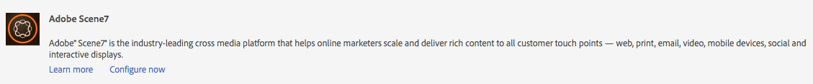

# Integreren met Dynamic Media Classic {#integrating-with-dynamic-media-classic-scene}

Adobe Dynamic Media Classic is een gehoste oplossing voor het beheren, verbeteren, publiceren en leveren van rijke media-elementen aan web, mobiele apparaten, e-mail en displays en drukwerk via internet.

Als u Dynamic Media Classic wilt gebruiken, moet u de cloudconfiguratie zodanig configureren dat Dynamic Media Classic en AEM Assets met elkaar kunnen communiceren. In dit document wordt beschreven hoe u AEM en Dynamic Media Classic configureert.

Zie [Dynamic Media Classic](../assets/scene7.md) gebruiken voor informatie over het gebruik van alle klassieke Dynamic Media-componenten op een pagina en het werken met video.

>[!NOTE]
>
>* Het DHTML-viewerplatform van Dynamic Media Classic bereikte op 31 januari 2014 officieel het einde van de levensduur. Zie [Veelgestelde vragen ](../sites-administering/dhtml-viewer-endoflifefaqs.md) voor de DHTML-viewer voor meer informatie.
>* Voordat u Dynamic Media Classic configureert voor AEM, raadpleegt u [Aanbevolen werkwijzen](#best-practices-for-integrating-scene-with-aem) voor het integreren van Dynamic Media Classic met AEM.
>* Als u Dynamic Media Classic met een aangepaste proxyconfiguratie gebruikt, moet u zowel de proxyconfiguraties van de HTTP-client configureren als sommige functies van AEM de 3.x-API&#39;s en sommige andere de 4.x-API&#39;s gebruiken. 3.x wordt gevormd met [http://localhost:4502/system/console/configMgr/com.day.commons.httpclient](http://localhost:4502/system/console/configMgr/com.day.commons.httpclient) en 4.x wordt gevormd met [http://localhost:4502/system/console/configMgr/org.apache.http.proxyconfigurator](http://localhost:4502/system/console/configMgr/org.apache.http.proxyconfigurator).

>

## AEM/Dynamic Media Klassieke integratie versus Dynamic Media {#aem-scene-integration-versus-dynamic-media}

AEM gebruikers kunnen kiezen uit twee oplossingen om met dynamische media te werken: Of het integreren van hun geval van AEM met Dynamic Media Classic of het gebruiken van de oplossing van Dynamic Media die in AEM wordt geïntegreerd.

Gebruik de volgende criteria om te bepalen welke oplossing moet worden gekozen:

* Als u een **bestaande** Classic klant bent van Dynamic Media waarvan de rijke media activa in Dynamic Media Classic voor publicatie en levering verblijven, maar u wilt die activa met de creatie van Plaatsen (WCM) en/of AEM Assets voor beheer integreren, dan [AEM/Dynamic Media Classic point-to-point integratie](#aem-scene-point-to-point-integration) gebruiken die in dit document wordt beschreven.

* Als u een **new** AEM klant bent die rijke media leveringsbehoeften heeft, selecteer [de optie van Dynamic Media](#aem-dynamic-media). Deze optie heeft de meeste zin als u geen bestaande S7-account hebt en veel middelen die in dat systeem zijn opgeslagen.

* In bepaalde gevallen kunt u beide oplossingen gebruiken. Het [scenario voor tweeërlei gebruik](/help/sites-administering/scene7.md#dual-use-scenario) beschrijft dat scenario.

### AEM/Dynamic Media Klassieke point-to-point integratie {#aem-scene-point-to-point-integration}

Wanneer u met middelen in deze oplossing werkt, doet u één van het volgende:

* Upload middelen rechtstreeks naar Dynamic Media Classic en open vervolgens via de **Dynamic Media Classic**-inhoudbrowser voor het ontwerpen van pagina&#39;s of
* Uploaden naar AEM Assets en vervolgens automatisch publiceren naar Dynamic Media Classic inschakelen; via de inhoudbrowser **Middelen** voor het ontwerpen van pagina&#39;s

De componenten die u voor deze integratie gebruikt, bevinden zich in het gebied **Dynamic Media Classic** in de ontwerpmodus.[Design.](/help/sites-authoring/author-environment-tools.md#page-modes)

### Dynamic Media {#aem-dynamic-media} AEM

AEM Dynamic Media is de hereniging van de Klassieke eigenschappen van Dynamic Media direct binnen het AEM platform.

Wanneer u met middelen in deze oplossing werkt, volgt u deze workflow:

1. Eén afbeelding en video-elementen rechtstreeks uploaden naar AEM.
1. Video&#39;s rechtstreeks coderen in AEM.
1. Stel op afbeeldingen gebaseerde sets rechtstreeks samen binnen AEM.
1. Voeg, indien van toepassing, interactiviteit toe aan afbeeldingen of video&#39;s.

De componenten die u voor Dynamic Media gebruikt, bevinden zich in het componentgebied **[!UICONTROL Dynamic Media]** in [Ontwerpmodus](/help/sites-authoring/author-environment-tools.md#page-modes). Deze omvatten:

* **[!UICONTROL Dynamic Media]** - De  **[!UICONTROL Dynamic Media]** component is slim. Afhankelijk van het feit of u een afbeelding of video toevoegt, hebt u verschillende opties. De component ondersteunt voorinstellingen voor afbeeldingen, op afbeeldingen gebaseerde viewers, zoals afbeeldingssets, centrifuges, gemengde mediasets en video. Bovendien reageert de viewer snel - de grootte van het scherm verandert automatisch op basis van de schermgrootte. Alle viewers zijn HTML5-viewers.

* **[!UICONTROL Interactive Media]** - De  **[!UICONTROL Interactive Media]** component is bedoeld voor elementen, zoals carrouselbanners, interactieve afbeeldingen en interactieve video, die interactiviteit op deze elementen hebben, zoals hotspots of afbeeldingen met hyperlinks. Deze component is slim. Afhankelijk van het feit of u een afbeelding of video toevoegt, hebt u verschillende opties. Bovendien reageert de viewer snel - de grootte van het scherm verandert automatisch op basis van de schermgrootte. Alle viewers zijn HTML5-viewers.

### Scenario voor tweeërlei gebruik {#dual-use-scenario}

U kunt zowel Dynamic Media- als Dynamic Media Classic-integratiefuncties van AEM tegelijk gebruiken. In de volgende tabel met gebruiksgevallen wordt beschreven wanneer u bepaalde gebieden in- en uitschakelt.

Dynamic Media en Dynamic Media Classic gelijktijdig gebruiken:

1. Configureer [Dynamic Media Classic](#creating-a-cloud-configuration-for-scene) in cloudservices.
1. Volg de specifieke instructies voor uw gebruiksgeval op:

   <table>
    <tbody>
    <tr>
    <td> </td>
    <td> </td>
    <td><strong> Dynamic Media </strong></td>
    <td> </td>
    <td><strong>Dynamic Media Klassieke integratie</strong></td>
    <td> </td>
    </tr>
    <tr>
    <td><strong>Als u ...</strong></td>
    <td><strong>Hoofdletterwerkstroom gebruiken</strong></td>
    <td><strong>Afbeeldingen/video</strong></td>
    <td><strong>Dynamic Media-component</strong></td>
    <td><strong>S7 Inhoudsbrowser en -componenten</strong></td>
    <td><strong>Automatisch uploaden van middelen naar S7</strong></td>
    </tr>
    <tr>
    <td>Nieuw bij sites en Dynamic Media</td>
    <td>Elementen uploaden naar AEM en AEM Dynamic Media-component gebruiken om elementen op sitepagina's te schrijven</td>
    <td>
Aan
 
(Zie stap 3)
 </td>
    <td><a href="/help/assets/adding-dynamic-media-assets-to-pages.md">Aan</a></td>
    <td>Uit</td>
    <td>Uit</td>
    </tr>
    <tr>
    <td>In de detailhandel en zijn nieuw voor Sites en Dynamic Media</td>
    <td>Niet-productmiddelen uploaden naar AEM voor beheer en levering. Upload PRODUCT-middelen naar Dynamic Media Classic en gebruik Dynamic Media Classic-inhoudsbrowser in AEM en onderdeel om productdetailpagina's op sites te maken.</td>
    <td>
Aan
 
(Zie stap 3)
 </td>
    <td><a href="/help/assets/adding-dynamic-media-assets-to-pages.md">Aan</a></td>
    <td><a href="/help/assets/scene7.md#scene-content-browser">Aan</a></td>
    <td>Uit</td>
    </tr>
    <tr>
    <td>Nieuw bij Middelen en Dynamic Media</td>
    <td>Elementen uploaden naar AEM Assets en gepubliceerde URL-/insluitcode van Dynamic Media gebruiken</td>
    <td>
Aan
 
(Zie stap 3)
 </td>
    <td>Uit</td>
    <td>Uit</td>
    <td>Uit</td>
    </tr>
    <tr>
    <td>Nieuw bij Dynamic Media en Sjabloon</td>
    <td>Gebruik Dynamic Media voor beeldbewerking en video. Auteur afbeeldingssjablonen in Dynamic Media Classic en gebruik Dynamic Media Classic Content Finder om sjablonen op te nemen in sitepagina's.</td>
    <td>
Aan
 
(Zie stap 3)
 </td>
    <td><a href="/help/assets/adding-dynamic-media-assets-to-pages.md">Aan</a></td>
    <td><a href="/help/assets/scene7.md#scene-content-browser">Aan</a></td>
    <td>Uit</td>
    </tr>
    <tr>
    <td>Een bestaande Dynamic Media Classic-klant en is nieuw voor sites</td>
    <td>Elementen uploaden naar Dynamic Media Classic en AEM Dynamic Media Classic-inhoudbrowser gebruiken om elementen op sitepagina's te zoeken en te ontwerpen</td>
    <td>Uit</td>
    <td>Uit</td>
    <td><a href="/help/assets/scene7.md#scene-content-browser">Aan</a></td>
    <td>Uit</td>
    </tr>
    <tr>
    <td>Een bestaande Dynamic Media Classic-klant en is nieuw voor sites en middelen</td>
    <td>Elementen uploaden naar DAM en automatisch publiceren naar Dynamic Media Classic voor levering. Gebruik AEM Dynamic Media Classic-inhoudbrowser om elementen op sitepagina's te zoeken en te ontwerpen.</td>
    <td>Uit</td>
    <td>Uit</td>
    <td><a href="/help/assets/scene7.md#scene-content-browser">Aan</a></td>
    <td>
<a href="#configuringautouploadingfromaemassets">Aan</a>
 
(Zie stap 4)
 </td>
    </tr>
    <tr>
    <td>Bestaande Dynamic Media Classic-klant en nieuw voor middelen</td>
    <td>
Elementen uploaden naar AEM en Dynamic Media gebruiken om uitvoeringen te genereren voor downloaden/delen. Publiceer automatisch AEM middelen naar Dynamic Media Classic voor levering.
 
<strong>Belangrijk:</strong> Incurs duplicate processing and renditions generated in AEM will not be synchronized to Dynamic Media Classic
 </td>
    <td>
Aan
 
(Zie stap 3)
 </td>
    <td>Uit</td>
    <td>Uit</td>
    <td>
<a href="#configuringautouploadingfromaemassets">Aan</a>
 
(Zie stap 4)
 </td>
    </tr>
    </tbody>
    </table>

1. (facultatief; zie gebruikscase table) - Stel de [Dynamic Media cloud configuration](/help/assets/config-dynamic.md) en [enable de Dynamic Media server](/help/assets/config-dynamic.md) in.
1. (facultatief; Zie use case table) - Als u Automatisch uploaden van middelen naar Dynamic Media Classic wilt inschakelen, moet u het volgende toevoegen:

   1. Automatische upload instellen op Dynamic Media Classic.
   1. Voeg de stap **Dynamic Media Klassieke upload** toe na alle Dynamic Media-workflowstappen *aan het einde van* **Dam Update Asset**-workflow ( `https://<server>:<host>/cf#/etc/workflow/models/dam/update_asset.html)`
   1. (Optioneel) Beperk het uploaden van klassieke Dynamic Media-elementen door MIME-type in [https://&lt;server>:&lt;port>/system/console/configMgr/com.day.cq.dam.scene7.impl.Scene7AssetMimeTypeServiceImpl](http://localhost:4502/system/console/configMgr/com.day.cq.dam.scene7.impl.Scene7AssetMimeTypeServiceImpl). MIME-typen voor middelen die niet in deze lijst voorkomen, worden niet geüpload naar de Dynamic Media Classic-server.
   1. (Optioneel) Stel video in de Klassieke Dynamic Media-configuratie in. U kunt videocodering voor zowel Dynamic Media als Dynamic Media Classic tegelijk inschakelen. Dynamische uitvoeringen worden gebruikt voor lokale voorvertoning en afspelen in AEM instantie, terwijl Klassieke Dynamic Media-video-uitvoeringen worden gegenereerd en opgeslagen op Klassieke Dynamic Media-servers. Wanneer u videocoderingsservices instelt voor zowel Dynamic Media als Dynamic Media Classic, past u een [videoverwerkingsprofiel](/help/assets/video-profiles.md) toe op de map met klassieke Dynamic Media-elementen.
   1. (Optioneel) [Beveiligde voorvertoning configureren in Dynamic Media Classic](/help/sites-administering/scene7.md#configuring-the-state-published-unpublished-of-assets-pushed-to-scene).

#### Beperkingen {#limitations}

Wanneer u zowel Dynamic Media Classic als Dynamic Media hebt ingeschakeld, gelden de volgende beperkingen:

* Het handmatig uploaden naar Dynamic Media Classic door een element te selecteren en naar een Klassieke Dynamic Media-component op een AEM pagina te slepen, werkt niet.
* Hoewel AEM-Dynamic Media Classic gesynchroniseerde elementen automatisch worden bijgewerkt naar Dynamic Media Classic wanneer het element wordt bewerkt in Elementen, wordt met een terugdraaiactie geen nieuwe upload geactiveerd, zodat Dynamic Media Classic niet meteen na een terugdraaiactie de laatste versie krijgt. Als tussenoplossing kunt u het terugdraaien opnieuw uitvoeren.
* Als u Dynamic Media voor één gebruikscase en de Klassieke integratie van Dynamic Media voor een ander gebruiksgeval moet gebruiken, zodat de activa van Dynamic Media niet met het Klassieke systeem van Dynamic Media interactie aangaan, dan niet om de Klassieke configuratie van Dynamic Media op de omslag van Dynamic Media, of de configuratie van Dynamic Media (verwerkingsprofiel) op een Classic omslag van Dynamic Media toe te passen.

## Aanbevolen procedures voor het integreren van Dynamic Media Classic met AEM {#best-practices-for-integrating-scene-with-aem}

Bij de integratie van Dynamic Media Classic met AEM zijn er enkele belangrijke best practices die in acht moeten worden genomen op de volgende gebieden:

* Uw integratie testen
* Het rechtstreeks uploaden van middelen vanuit Dynamic Media Classic wordt aanbevolen voor bepaalde scenario&#39;s

Zie [bekende beperkingen](#known-limitations-and-design-implications).

### Uw integratie testen {#test-driving-your-integration}

Adobe raadt u aan de integratie te testen door uw hoofdmap alleen naar een submap te laten verwijzen in plaats van naar een volledig bedrijf.

>[!CAUTION]
>
>Het importeren van activa van een bestaande Dynamic Media Classic Company-account kan lang duren voordat dit in AEM wordt weergegeven. Zorg ervoor dat u een map in Dynamic Media Classic aanwijst die niet te veel elementen bevat (de hoofdmap bevat bijvoorbeeld vaak te veel elementen en het systeem loopt mogelijk vast).

### Elementen uploaden van AEM Assets naar Dynamic Media Classic {#uploading-assets-from-aem-assets-versus-from-scene}

U kunt elementen uploaden met behulp van de functionaliteit voor middelenbeheer (digital asset management) of door Dynamic Media Classic rechtstreeks AEM te openen via de Dynamic Media Classic-inhoudbrowser. Welke optie u kiest, is afhankelijk van de volgende factoren:

* Dynamic Media Classic-elementtypen die AEM Assets nog niet ondersteunt, moeten rechtstreeks vanuit Dynamic Media Classic aan een AEM website worden toegevoegd via de Dynamic Media Classic-inhoudbrowser, bijvoorbeeld afbeeldingssjablonen.
* Voor de typen elementen die door AEM Assets en Dynamic Media Classic worden ondersteund, is het van het volgende afhankelijk hoe u deze kunt uploaden:

   * Waar de activa vandaag zijn, EN
   * Hoe belangrijk is het beheer ervan in een gemeenschappelijke gegevensopslagplaats?

Als de activa reeds in Dynamic Media Classic zijn en die in een gemeenschappelijke bewaarplaats beheren niet zo belangrijk is, dan zou het uitvoeren van hen naar AEM Assets slechts om hen terug naar Dynamic Media Classic voor levering terug te synchroniseren een onnodige roundtrip zijn. Anders heeft het de voorkeur om activa in één opslagplaats te houden en alleen voor levering te synchroniseren naar Dynamic Media Classic.

## Dynamic Media Classic-integratie configureren {#configuring-scene-integration}

U kunt AEM configureren om elementen te uploaden naar Dynamic Media Classic. Middelen uit een CQ-doelmap kunnen (automatisch of handmatig) worden geüpload van AEM naar een Klassieke Dynamic Media-bedrijfsaccount.

>[!NOTE]
>
>Adobe raadt u aan alleen de toegewezen doelmap te gebruiken voor het importeren van Klassieke Dynamic Media-elementen. Digitale middelen die zich buiten de doelmap bevinden, kunnen alleen worden gebruikt in Klassieke Dynamic Media-componenten op pagina&#39;s waarop de Klassieke Dynamic Media-configuratie is ingeschakeld. Bovendien worden ze in een ad-hocmap in Dynamic Media Classic geplaatst. De map ad hoc wordt niet gesynchroniseerd met AEM (maar de elementen zijn te vinden in de browser met klassieke inhoud van Dynamic Media).

Als u Dynamic Media Classic wilt configureren voor integratie met AEM, moet u de volgende stappen uitvoeren:

1. [Definieer een wolkenconfiguratie](#creating-a-cloud-configuration-for-scene)  - Definieert de toewijzing tussen een klassieke Dynamic Media-map en een map Middelen. U moet deze stap ook uitvoeren als u alleen synchronisatie in één richting (AEM Assets naar Dynamic Media Classic) wilt.
1. [Schakel de  **Adobe CQ s7dam Dam Listener**](#enabling-the-adobe-cq-scene-dam-listener)  - Done in de  [!UICONTROL OSGi] console in.
1. Als u wilt dat AEM middelen automatisch naar Dynamic Media Classic uploaden, moet u die optie inschakelen en Dynamic Media Classic toevoegen aan de [!UICONTROL DAM Update Asset]-workflow. U kunt ook handmatig elementen uploaden.
1. Dynamic Media Classic-componenten toevoegen aan het hulpwerkstation. Hierdoor kunnen gebruikers Dynamic Media Classic-componenten op hun AEM gebruiken.
1. [Wijs de configuratie in AEM](#enabling-scene-for-wcm)  toe aan de pagina. Deze stap is vereist om videovoorinstellingen weer te geven die u in Dynamic Media Classic hebt gemaakt. Dit is ook vereist als u een bestand van buiten de CQ-doelmap naar Dynamic Media Classic moet publiceren.

In deze sectie wordt beschreven hoe u al deze stappen uitvoert en worden belangrijke beperkingen weergegeven.

### Hoe synchronisatie tussen Dynamic Media Classic en AEM Assets werkt {#how-synchronization-between-scene-and-aem-assets-works}

Het is belangrijk dat u het volgende begrijpt wanneer u AEM Assets en Dynamic Media Classic synchroniseert:

#### Uploaden naar Dynamic Media Classic vanuit AEM Assets {#uploading-to-scene-from-aem-assets}

* Er is een toegewezen synchronisatiemap in AEM voor Classic Dynamic Media-uploads.
* Uploads naar Dynamic Media Classic kunnen worden geautomatiseerd als de digitale elementen in de toegewezen synchronisatiemap worden geplaatst.
* De map- en submapstructuur in AEM wordt gerepliceerd in Dynamic Media Classic.

>[!NOTE]
>
>AEM worden alle metagegevens ingesloten als XMP voordat deze naar Dynamic Media Classic worden geüpload. Alle eigenschappen op het metagegevensknooppunt zijn dus beschikbaar in Dynamic Media Classic als XMP.

#### Bekende beperkingen en ontwerpimplicaties {#known-limitations-and-design-implications}

Met de synchronisatie tussen AEM Assets en Dynamic Media Classic zijn er momenteel de volgende beperkingen/ontwerpimplicaties:

<table>
 <tbody>
  <tr>
   <td><strong>Beperking/gevolgen van ontwerp</strong></td>
   <td><strong>Beschrijving</strong></td>
  </tr>
  <tr>
   <td>Eén toegewezen synchronisatiemap (doel)</td>
   <td>U kunt per bedrijf slechts één toegewezen map AEM voor Dynamic Media Classic-uploads. U kunt meerdere configuraties maken als u toegang moet hebben tot meerdere bedrijfsaccounts in Dynamic Media Classic.</td>
  </tr>
  <tr>
   <td>Mapstructuur</td>
   <td>Als u een gesynchroniseerde map met middelen verwijdert, worden alle Dynamic Media Classic externe middelen verwijderd, maar blijft de map ongewijzigd.</td>
  </tr>
  <tr>
   <td>Ad-hocmap</td>
   <td>Elementen die zich buiten de doelmap bevinden en die handmatig in WCM naar Dynamic Media Classic worden geüpload, worden automatisch in een aparte ad-hocmap op Dynamic Media Classic geplaatst. U configureert dit in de wolkenconfiguratie in AEM.</td>
  </tr>
  <tr>
   <td>Gemengde media</td>
   <td>Gemengde mediasets worden in AEM weergegeven, maar worden niet ondersteund in AEM.</td>
  </tr>
  <tr>
   <td>PDF's</td>
   <td>Gegenereerde PDF's van eCatalogs in Dynamic Media Classic worden geïmporteerd in de CQ-doelmap.</td>
  </tr>
  <tr>
   <td>interface vernieuwen</td>
   <td>Bij het synchroniseren tussen AEM en Dynamic Media Classic moet u de gebruikersinterface vernieuwen om de wijzigingen weer te geven. </td>
  </tr>
  <tr>
   <td>Videominiaturen</td>
   <td>Als u een video uploadt naar AEM Assets voor codering via Dynamic Media Classic, kan het enige tijd duren voordat de videominiaturen en gecodeerde video's beschikbaar zijn in AEM Assets, afhankelijk van de videoverwerkingstijd.</td>
  </tr>
  <tr>
   <td>Doelsubmappen</td>
   <td>
Als u submappen gebruikt in de doelmap, moet u ervoor zorgen dat u unieke namen gebruikt voor elk element (ongeacht de locatie) of dat u Dynamic Media Classic configureert (in het gedeelte Instellen) om elementen niet te overschrijven, ongeacht de locatie.
 
Anders worden elementen met dezelfde naam die naar een Classic-doelsubmap van Dynamic Media zijn geüpload, wel geüpload, maar wordt het element met dezelfde naam in de doelmap verwijderd. 
 </td>
  </tr>
 </tbody>
</table>

### Dynamic Media Classic-servers configureren {#configuring-scene-servers}

Als u AEM achter een proxy uitvoert of speciale firewallinstellingen hebt, moet u mogelijk de hosts van de verschillende gebieden expliciet inschakelen. De servers worden beheerd in inhoud in `/etc/cloudservices/scene7/endpoints` en kunnen worden aangepast zoals vereist. Tik op een URL en bewerk deze vervolgens om de URL indien nodig te wijzigen. In vorige versies van AEM waren deze waarden hard-gecodeerd.

Als u naar `/etc/cloudservices/scene7/endpoints.html` navigeert, worden de servers weergegeven (en kunt u deze bewerken door op de URL te klikken):

### Een cloudconfiguratie maken voor Dynamic Media Classic {#creating-a-cloud-configuration-for-scene}

Een wolkenconfiguratie bepaalt de afbeelding tussen een Klassieke omslag van Dynamic Media en een omslag van AEM Assets. Het moet worden geconfigureerd om AEM Assets te synchroniseren met Dynamic Media Classic. Zie Hoe de Synchronisatie voor meer informatie werkt.

>[!CAUTION]
>
>Het importeren van activa van een bestaande Dynamic Media Classic Company-account kan lang duren voordat dit in AEM wordt weergegeven. Zorg ervoor dat u een map in Dynamic Media Classic aanwijst die niet te veel elementen bevat (de hoofdmap bevat bijvoorbeeld vaak te veel elementen).
>
>Als u aandrijving de integratie wilt testen, kunt u het punt van de wortelomslag aan een subfolder slechts, in plaats van het volledige bedrijf willen hebben.

>[!NOTE]
>
>U kunt meerdere configuraties hebben: één wolkenconfiguratie vertegenwoordigt één gebruiker bij een Klassiek bedrijf van Dynamic Media. Als u andere Klassieke bedrijven of gebruikers van Dynamic Media wilt openen, moet u veelvoudige configuraties tot stand brengen.

AEM configureren om elementen naar Dynamic Media Classic te publiceren:

1. Tik op het AEM en navigeer naar **[!UICONTROL Deployment > Cloud Services]** om toegang te krijgen tot Adobe Dynamic Media Classic.

1. Tik op **[!UICONTROL Configure now.]**

   

1. Voer in het veld **[!UICONTROL Title]** en eventueel in het veld **[!UICONTROL Name]** de juiste gegevens in. Tik op **[!UICONTROL Create.]**

   >[!NOTE]
   >
   >Bij het maken van extra configuraties wordt het veld **[!UICONTROL parent configuration]** weergegeven.
   >
   >Wijzig de bovenliggende configuratie niet **niet**. Het wijzigen van de bovenliggende configuratie kan de integratie onderbreken.

1. Voer het e-mailadres, het wachtwoord en de regio van uw Dynamic Media Classic-account in en tik **[!UICONTROL Connect to Dynamic Media Classic.]** U bent verbonden met de Klassieke Dynamic Media-server en het dialoogvenster wordt uitgebreid met meer opties.

1. Voer de naam **[!UICONTROL Company]** en **[!UICONTROL Root Path]** in (dit is de naam van de gepubliceerde server samen met het pad dat u wilt opgeven); als u de naam van de gepubliceerde server niet kent, gaat u in Dynamic Media Classic naar **[!UICONTROL Setup > Application Setup.]**)

   >[!NOTE]
   >
   >Het klassieke Dynamic Media-hoofdpad is de klassieke Dynamic Media-map waarmee AEM verbinding maakt. U kunt de map verkleinen tot een specifieke map.

   >[!CAUTION]
   >
   >Afhankelijk van de grootte van de klassieke Dynamic Media-map kan het importeren van een hoofdmap lang duren. Bovendien zouden de Klassieke gegevens van Dynamic Media de AEM opslag kunnen overschrijden. Controleer of u de juiste map importeert. Door te veel gegevens te importeren, kan uw systeem worden gestopt.

   

1. Klik **[!UICONTROL OK.]** AEM slaat uw configuratie op.

>[!NOTE]
>
>Als u opnieuw verbinding maakt:
>
>* Wanneer u bij het publiceren opnieuw verbinding maakt met Dynamic Media Classic, moet u het wachtwoord mogelijk opnieuw instellen bij het publiceren of wanneer opnieuw verbinden niet werkt. Dit is geen kwestie op de auteursinstantie.
>* Als u waarden wijzigt, zoals uw regio of bedrijfsnaam, moet u opnieuw verbinding maken met Dynamic Media Classic. Als de configuratieopties zijn gewijzigd maar niet zijn opgeslagen, geeft AEM ten onrechte nog aan dat de configuratie geldig is. Zorg ervoor dat u opnieuw verbinding maakt.

>

### Adobe CQ Dynamic Media Classic Dam Listener {#enabling-the-adobe-cq-scene-dam-listener} inschakelen

U moet de Klassieke Dam Listener van Adobe CQ Dynamic Media inschakelen, die standaard is uitgeschakeld.

U schakelt dit als volgt in:

1. Tik op het pictogram [!UICONTROL Tools] en navigeer naar **[!UICONTROL Operations > Web Console.]** De webconsole wordt geopend.
1. Navigeer naar **[!UICONTROL Adobe CQ Dynamic Media Classic Dam Listener]** en selecteer het selectievakje **[!UICONTROL Enabled]**.

   

1. Tik op  **[!UICONTROL Save.]**

### Aanpasbare time-out toevoegen aan Dynamic Media Classic Upload-workflow {#adding-configurable-timeout-to-scene-upload-workflow}

Wanneer een AEM instantie wordt gevormd om videocodering door Dynamic Media Classic te behandelen, door gebrek, is er een 35 minieme onderbreking op om het even welke uploadbaan. U kunt deze instelling configureren om mogelijk langere taken voor videocodering aan te passen:

1. Navigeer naar **http://localhost:4502/system/console/configMgr/com.day.cq.dam.scene7.impl.Scene7UploadServiceImpl**.

   

1. Wijzig het nummer naar wens in het veld **[!UICONTROL Active job timeout]**. Alle niet-negatieve getallen worden in seconden met de maateenheid geaccepteerd. Standaard is dit ingesteld op 2100.

   >[!NOTE]
   >
   >Beste praktijken: De meeste elementen worden maximaal minuten ingesloten (bijvoorbeeld afbeeldingen). Maar in bepaalde gevallen - grotere video&#39;s bijvoorbeeld - zou de onderbrekingswaarde tot 7200 seconden (2 uren) moeten worden verhoogd om lange verwerkingstijd te verwerken. Anders wordt deze klassieke Dynamic Media-uploadtaak gemarkeerd als **[!UICONTROL UploadFailed]** in de JCR-metagegevens.

1. Tik op **[!UICONTROL Save.]**

### Automatische controle van AEM Assets {#autouploading-from-aem-assets}

Vanaf AEM 6.3.2 is AEM Assets nu voor u geconfigureerd, zodat alle digitale elementen die u uploadt naar de Digital Asset Manager automatisch worden bijgewerkt naar Dynamic Media Classic als de elementen zich in een CQ-doelmap bevinden.

Wanneer een element aan AEM Assets wordt toegevoegd, wordt het automatisch geüpload en gepubliceerd naar Dynamic Media Classic.

>[!NOTE]
>
>De maximale bestandsgrootte voor automatisch uploaden van AEM Assets naar Dynamic Media Classic is 500 MB.

Om automatisch laden te configureren vanuit AEM Assets:

1. Tik op het pictogram AEM en navigeer naar **[!UICONTROL Deployment > Cloud Services]** en tik **[!UICONTROL dms7 (Dynamic Media]** onder Dynamic Media onder Beschikbare configuraties.)
1. Tik op het tabblad **[!UICONTROL Advanced]**, selecteer het selectievakje **[!UICONTROL Enable Automatic Upload]** en tik vervolgens op **[!UICONTROL OK.]** U moet nu de DAM Asset-workflow zodanig configureren dat het uploaden naar Dynamic Media Classic wordt opgenomen.

   >[!NOTE]
   >
   >Zie [De status (gepubliceerd/niet gepubliceerd) configureren van elementen die naar Dynamic Media Classic worden geduwd](#configuring-the-state-published-unpublished-of-assets-pushed-to-scene) voor informatie over het doorsturen van elementen naar Dynamic Media Classic in een niet-gepubliceerde status.

   

1. Navigeer terug naar de welkomstpagina van de AEM en tik **[!UICONTROL Workflows.]** tweemaal klikken **DAM Update Asset** werkschema om het te openen.
1. Navigeer in de assistent naar de **[!UICONTROL Workflow]**-componenten en selecteer **[!UICONTROL Dynamic Media Classic.]** **[!UICONTROL Dynamic Media Classic]** naar de workflow slepen en tik op **[!UICONTROL Save.]** Middelen die in de doelmap aan AEM Assets zijn toegevoegd, worden automatisch geüpload naar Dynamic Media Classic.

   

   >[!NOTE]
   >
   >* Wanneer u na het automatiseren elementen toevoegt die niet in de CQ-doelmap staan, worden deze niet geüpload naar Dynamic Media Classic.
   >* AEM worden alle metagegevens ingesloten als XMP voordat deze naar Dynamic Media Classic worden geüpload. Alle eigenschappen op het metagegevensknooppunt zijn dus beschikbaar in Dynamic Media Classic als XMP.

### De status (gepubliceerd/niet gepubliceerd) van aan Dynamic Media Classic {#configuring-the-state-published-unpublished-of-assets-pushed-to-scene} doorgegeven elementen configureren

Als u middelen van AEM Assets naar Dynamic Media Classic duwt, kunt u of hen automatisch publiceren (standaardgedrag) of hen duwen aan de Klassiek van Dynamic Media in een niet gepubliceerde staat.

Mogelijk wilt u elementen niet direct publiceren op Dynamic Media Classic als u deze wilt testen in een testomgeving voordat u live gaat. U kunt AEM met de Secure Test-omgeving van Dynamic Media Classic gebruiken om elementen in een niet-gepubliceerde status rechtstreeks van Middelen naar Dynamic Media Classic te verzenden.

Dynamic Media Klassieke elementen blijven beschikbaar via een beveiligde voorvertoning. Alleen wanneer de activa binnen AEM worden gepubliceerd, worden de Klassieke activa van Dynamic Media ook in productie genomen.

Als u elementen direct wilt publiceren wanneer u ze naar Dynamic Media Classic duwt, hoeft u geen opties te configureren. Dit is het standaardgedrag.

Als u echter niet wilt dat elementen die aan Dynamic Media Classic worden doorgegeven, automatisch worden gepubliceerd, wordt in deze sectie beschreven hoe u AEM en Dynamic Media Classic kunt configureren om dit te doen.

#### Vereisten om elementen naar Dynamic Media Classic te verzenden zonder publicatie {#prerequisites-to-push-assets-to-scene-unpublished}

Voordat u elementen naar Dynamic Media Classic kunt verzenden zonder ze te publiceren, moet u het volgende instellen:

1. [Gebruik de Admin Console om een draagtas te maken.](https://helpx.adobe.com/enterprise/admin-guide.html/enterprise/using/support-for-experience-cloud.ug.html) In het geval van ondersteuning, verzoek u om beveiligde voorvertoning voor uw Dynamic Media Classic-account in te schakelen.
1. Volg de aanwijzingen op [Beveiligde voorvertoning voor uw Dynamic Media Classic-account instellen.](https://help.adobe.com/en_US/scene7/using/WSd968ca97bf00cf72-5eeee3a113268dc80f5-8000.html)

Dit zijn dezelfde stappen die u zou volgen om veilige testinstellingen te maken in Dynamic Media Classic.

>[!NOTE]
>
>Als uw installatieomgeving een Unix 64-bits besturingssysteem is, raadpleegt u [https://helpx.adobe.com/experience-manager/kb/enable-xmp-write-back-64-bit-redhat.html](https://helpx.adobe.com/experience-manager/kb/enable-xmp-write-back-64-bit-redhat.html) over aanvullende configuratieopties die u moet instellen.

#### Bekende beperkingen voor het doorduwen van elementen in niet-gepubliceerde toestand {#known-limitations-for-pushing-assets-in-unpublished-state}

Houd rekening met de volgende beperkingen als u deze functie gebruikt:

* Er is geen ondersteuning voor versiebeheer.
* Als een element al in AEM is gepubliceerd en er een volgende versie wordt gemaakt, wordt die nieuwe versie onmiddellijk live gepubliceerd voor productie. Publiceren bij activering werkt alleen met de eerste publicatie van een element.

>[!NOTE]
>
>Als u elementen direct wilt publiceren, kunt u het beste **[!UICONTROL Enable Secure Preview]** ingesteld houden op **[!UICONTROL Immediately]** en de functie **[!UICONTROL Enable Automatic Upload]** gebruiken.

### De status van naar Dynamic Media Classic geduwde elementen instellen als niet-gepubliceerd {#setting-the-state-of-assets-pushed-to-scene-as-unpublished}

>[!NOTE]
>
>Als een gebruiker het element in AEM publiceert, wordt het S7-element automatisch geactiveerd voor de productie/het live-element (het element bevindt zich dan niet meer in een beveiligde voorvertoning/publicatie).

De status van elementen die naar Dynamic Media Classic worden geduwd, instellen als niet-gepubliceerd:

1. Tik op het AEM en navigeer naar **[!UICONTROL Deployment > Cloud Services]**, tik **[!UICONTROL Dynamic Media Classic]** en selecteer de configuratie in Dynamic Media Classic.
1. Tik op het tabblad **[!UICONTROL Advanced]**. Selecteer **[!UICONTROL Upon AEM Publish Activation]** in het vervolgkeuzemenu **[!UICONTROL Enable Secure View]** om elementen naar Dynamic Media Classic te verzenden zonder te publiceren. (Deze waarde wordt standaard ingesteld op **[!UICONTROL Immediately]**, waarbij Klassieke Dynamic Media-elementen direct worden gepubliceerd.)

   Zie [Klassieke documentatie van Dynamic Media](https://help.adobe.com/en_US/scene7/using/WSd968ca97bf00cf72-5eeee3a113268dc80f5-8000.html) voor meer informatie over testmiddelen alvorens hen openbaar te maken.

   

1. Tik op **[!UICONTROL OK.]**

Als u Beveiligde weergave inschakelt, worden uw elementen zonder publicatie naar de beveiligde voorvertoningsserver verplaatst.

U kunt dit controleren door naar een klassieke Dynamic Media-component op een pagina te navigeren in AEM en op **[!UICONTROL Edit.]** te tikken. De beveiligde voorvertoningsserver wordt in de URL vermeld. Na publicatie in AEM wordt het serverdomein in de bestandsverwijzing bijgewerkt van de voorbeeld-URL naar de productie-URL.

### Dynamic Media Classic inschakelen voor WCM {#enabling-scene-for-wcm}

U moet Dynamic Media Classic voor WCM inschakelen om twee redenen:

* De vervolgkeuzelijst met universele videoprofielen inschakelen voor het ontwerpen van pagina&#39;s. Zonder dit, is **[!UICONTROL Universal Video Preset]** drop-down leeg en kan niet worden geplaatst.
* Als een digitaal element niet in de doelmap staat, kunt u het element uploaden naar Dynamic Media Classic als u Dynamic Media Classic voor die pagina inschakelt in de pagina-eigenschappen en het element naar een Klassieke Dynamic Media-component slepen. Normale overervingsregels zijn van toepassing (dit houdt in dat onderliggende pagina&#39;s de configuratie van de bovenliggende pagina overnemen).

Wanneer het toelaten van de Klassiek van Dynamic Media voor WCM, merk op dat zoals met andere configuraties, overervingsregels van toepassing zijn. U kunt Dynamic Media Classic voor WCM inschakelen in de geoptimaliseerde aanraakinterface of in de klassieke gebruikersinterface.

#### Dynamic Media Classic inschakelen voor WCM in de geoptimaliseerde gebruikersinterface {#enabling-scene-for-wcm-in-the-touch-optimized-user-interface}

Dynamic Media Classic voor WCM inschakelen in de gebruikersinterface voor geoptimaliseerde aanrakingen:

1. Tik op het AEM en navigeer naar **[!UICONTROL Sites]** en vervolgens naar de hoofdpagina van uw website (niet taalspecifiek).

1. Selecteer in de werkbalk het pictogram [!UICONTROL settings] en tik **[!UICONTROL Open Properties.]**

1. Tik **[!UICONTROL Cloud Services]** en tik **[!UICONTROL Add Configuration]** en selecteer **[!UICONTROL Dynamic Media Classic.]**
1. Selecteer in de vervolgkeuzelijst **[!UICONTROL Adobe Dynamic Media Classic]** de gewenste configuratie en tik **[!UICONTROL OK.]**

   

   Videovoorinstellingen uit die configuratie van Dynamic Media Classic kunnen worden gebruikt in AEM met de Klassieke videocomponent van Dynamic Media op die pagina en onderliggende pagina&#39;s.

#### Dynamic Media Classic inschakelen voor WCM in de klassieke gebruikersinterface {#enabling-scene-for-wcm-in-the-classic-user-interface}

Dynamic Media Classic voor WCM inschakelen in de klassieke gebruikersinterface:

1. Tik in AEM op **[!UICONTROL Websites]** en navigeer naar de hoofdpagina van uw website (niet taalspecifiek).

1. Tik in het hulpdeksel op het **[!UICONTROL Page]**-pictogram en tik **[!UICONTROL Page Properties.]**

1. Tik op **[!UICONTROL Cloud Services > Add services > Dynamic Media Classic.]**
1. Selecteer in de vervolgkeuzelijst **[!UICONTROL Adobe Dynamic Media Classic]** de gewenste configuratie en tik **[!UICONTROL OK.]**

   Videovoorinstellingen uit die configuratie van Dynamic Media Classic kunnen worden gebruikt in AEM met de Klassieke videocomponent van Dynamic Media op die pagina en onderliggende pagina&#39;s.

### Een standaardconfiguratie {#configuring-a-default-configuration} configureren

Als u meerdere Klassieke Dynamic Media-configuraties hebt, kunt u er een als standaard opgeven voor de Dynamic Media Klassieke-inhoudbrowser.

Slechts één Klassieke configuratie van Dynamic Media kan als gebrek op een bepaald ogenblik worden gemerkt. De standaardconfiguratie is de bedrijfsactiva die door gebrek in de Browser van de Inhoud van Dynamic Media Klassieke tonen.

De standaardconfiguratie configureren:

1. Tik op het AEM en navigeer naar **[!UICONTROL Deployment > Cloud Services]**, tik **[!UICONTROL Dynamic Media Classic]** en selecteer de configuratie in Dynamic Media Classic.
1. Tik **[!UICONTROL Edit]** om de configuratie te openen.

1. Schakel op het tabblad **[!UICONTROL General]** het selectievakje **[!UICONTROL Default Configuration]** in om dit in te stellen als het standaardbedrijf en basispad dat wordt weergegeven in de Dynamic Media Klassieke inhoudbrowser.

   

   >[!NOTE]
   >
   >Als er slechts één configuratie is, heeft het selecteren van **[!UICONTROL Default Configuration]** controledoos geen effect.

### De ad-hocmap {#configuring-the-ad-hoc-folder} configureren

U kunt de map configureren waarnaar elementen worden geüpload in Dynamic Media Classic wanneer het element zich niet in de CQ-doelmap bevindt. Zie Elementen publiceren van buiten de CQ-doelmap.

U configureert de ad-hocmap als volgt:

1. Tik op het AEM en navigeer naar **[!UICONTROL Deployment > Cloud Services]**, tik **[!UICONTROL Dynamic Media Classic]** en selecteer de configuratie in Dynamic Media Classic.
1. Tik **[!UICONTROL Edit]** om de configuratie te openen.

1. Tik op het tabblad **[!UICONTROL Advanced]**. In het veld **[!UICONTROL Ad-hoc Folder]** kunt u de map **Ad-hoc** wijzigen. Standaard is dit de **naam_van_het_bedrijf/CQ5_adhoc**.

   

### Universal Presets {#configuring-universal-presets} configureren

Zie [Video](/help/assets/s7-video.md) om Universal Presets voor de videocomponent te configureren.

## Ondersteuning voor MIME-op type gebaseerde assets/Dynamic Media Classic upload Job parameter{#enabling-mime-type-based-assets-scene-upload-job-parameter-support}

U kunt configureerbare Dynamic Media Classic-uploadtaakparameters inschakelen die worden geactiveerd door de synchronisatie van Digital Asset Manager/Dynamic Media Classic-middelen.

Specifiek, vormt u het erkende dossierformaat door MIME type in het OSGi (Open het initiatief van de Gateway van de Dienst) gebied van het paneel van de Configuratie van de AEM van de Console van het Web. Vervolgens kunt u de afzonderlijke taakparameters voor uploaden aanpassen die worden gebruikt voor elk MIME-type in de JCR (Java Content Repository).

**Op MIME gebaseerde elementen inschakelen:**

1. Tik op het AEM en navigeer naar **[!UICONTROL Tools > Operations > Web Console.]**
1. Tik in het configuratievenster van de Adobe Experience Manager-webconsole **[!UICONTROL OSGi]** in het menu **[!UICONTROL Configuration.]**
1. Onder de kolom Naam zoekt en tikt u **[!UICONTROL Adobe CQ Dynamic Media Classic Asset MIME type Service]** om de configuratie te bewerken.
1. Tik in het gebied MIME-typetoewijzing op een plusteken (+) om een MIME-type toe te voegen.

   Zie [Ondersteunde MIME-typen](/help/assets/assets-formats.md#supported-mime-types).

1. Typ de nieuwe naam van het MIME-type in het tekstveld.

   U kunt bijvoorbeeld een `<file_extension>=<mime_type>` typen zoals in `EPS=application/postscript` OF `PSD=image/vnd.adobe.photoshop`.

1. Tik in de rechterbenedenhoek van het configuratievenster op **[!UICONTROL Save.]**
1. Ga terug naar AEM en in de linkerspoorstaaf, tik CRXDE Lite.
1. Navigeer op de pagina CRXDE Lite in de linkertrack naar `/etc/cloudservices/scene7/<environment>` (vervang `<environment>` voor de eigenlijke naam).
1. Breid `<environment>` (substitueer `<environment>` voor de daadwerkelijke naam) uit om de `mimeTypes` knoop te openbaren.
1. Tik op het mimeType dat u zojuist hebt toegevoegd.

   Bijvoorbeeld `mimeTypes > application_postscript` OF `mimeTypes > image_vnd.adobe.photoshop`.

1. Tik rechts van de pagina CRXDE Lite op het tabblad **[!UICONTROL Properties]**.
1. Geef een klassieke Dynamic Media-taakparameter voor uploaden op in het waardeveld **[!UICONTROL jobParam]**.

   Bijvoorbeeld, `psprocess="rasterize"&psresolution=120` .

   Zie [Adobe Classic Image Production System API](https://experienceleague.adobe.com/docs/dynamic-media-developer-resources/image-production-api/c-overview.html) voor extra uploadtaakparameters die u kunt gebruiken.

   >[!NOTE]
   >
   >Als u PSD-bestanden uploadt en u wilt deze als sjablonen met laagextracties verwerken, voert u het volgende in het waardeveld **[!UICONTROL jobParam]** in:
   >
   >`process=MaintainLayers&createTemplate=true`
   >
   >Zorg ervoor dat het PSD-bestand &#39;lagen&#39; heeft. Als het strikt genomen één afbeelding of een afbeelding met een masker is, wordt de afbeelding verwerkt als een afbeelding omdat er geen lagen zijn om te verwerken.

1. Tik in de linkerbovenhoek van de pagina CRXDE Lite op **[!UICONTROL Save All.]**

## Problemen oplossen met Dynamic Media Classic en AEM integratie {#troubleshooting-scene-and-aem-integration}

Als u problemen hebt met het integreren van AEM met Dynamic Media Classic, raadpleegt u de volgende scenario&#39;s voor oplossingen.

**Als het publiceren van uw digitale middelen naar Dynamic Media Classic mislukt:**

* Controleer of het element dat u wilt uploaden, zich in de map **[!UICONTROL CQ target]** bevindt (u geeft deze map op in de Classic-cloudconfiguratie van Dynamic Media).
* Als dit niet het geval is, moet u de wolkenconfiguratie in **[!UICONTROL Page Properties]** voor die pagina vormen om het uploaden naar **[!UICONTROL CQ adhoc]** omslag toe te staan.

* Controleer de logboeken voor om het even welke informatie.

**Als uw videovoorinstellingen niet worden weergegeven:**

* Zorg ervoor dat u de wolkenconfiguratie van die pagina door **[!UICONTROL Page Properties.]** Video vooraf instelt beschikbaar in de Klassieke videocomponent van Dynamic Media hebt gevormd.

**Als uw video-elementen niet worden afgespeeld in AEM:**

* Controleer of u de juiste videocomponent hebt gebruikt. Dynamic Media Klassieke videocomponent is anders dan de basis-videocomponent. Zie [Elementaire videocomponent versus Dynamic Media Klassieke videocomponent](/help/assets/s7-video.md).

**Als nieuwe of gewijzigde middelen in AEM niet automatisch worden geüpload naar Dynamic Media Classic:**

* Zorg ervoor dat de elementen zich in de CQ-doelmap bevinden. Alleen elementen in de CQ-doelmap worden automatisch bijgewerkt (op voorwaarde dat u AEM Assets hebt geconfigureerd voor het automatisch uploaden van middelen).
* Zorg ervoor dat u de configuratie Cloud Services zodanig hebt geconfigureerd dat Automatisch uploaden is ingeschakeld en dat u de DAM Asset-workflow hebt bijgewerkt en opgeslagen, zodat deze ook Dynamic Media Classic-uploaden omvat.
* Wanneer u een afbeelding uploadt naar een submap van de Dynamic Media Classic-doelmap, moet u een van de volgende handelingen uitvoeren:

   * Zorg ervoor dat de namen van alle elementen, ongeacht de locatie, uniek zijn. Anders wordt het element in de hoofddoelmap verwijderd en blijft alleen het element in de submap over.
   * Wijzig de manier waarop Dynamic Media Classic elementen overschrijft in het gedeelte Setup van de Dynamic Media Classic-account. Stel Dynamic Media Classic niet in om elementen te overschrijven, ongeacht de locatie als u elementen met dezelfde naam in submappen gebruikt.

**Als uw verwijderde elementen of mappen niet zijn gesynchroniseerd tussen Dynamic Media Classic en AEM:**

* Middelen en mappen die zijn verwijderd uit AEM Assets, worden nog steeds weergegeven in de gesynchroniseerde map in Dynamic Media Classic. U moet ze handmatig verwijderen.

**Als het uploaden van video mislukt**

* Als uw video uploadt ontbreekt en u gebruikt AEM om video door de Klassieke integratie van Dynamic Media te coderen, zie [Aanpasbare onderbreking toevoegen aan Klassieke de uploadworkflow van Dynamic Media](#adding-configurable-timeout-to-scene-upload-workflow).

>[!CAUTION]
>
>Het importeren van activa van een bestaande Dynamic Media Classic Company-account kan lang duren voordat dit in AEM wordt weergegeven. Zorg ervoor dat u een map in Dynamic Media Classic aanwijst die niet te veel elementen bevat (de hoofdmap bevat bijvoorbeeld vaak te veel elementen).
>
>Als u aandrijving de integratie wilt testen, kunt u het punt van de wortelomslag aan een subfolder slechts, in plaats van het volledige bedrijf willen hebben.

