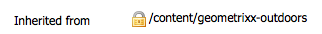

# Integreren met Adobe Search&amp;Promote{#integrating-with-adobe-search-promote}

Voer de volgende taken uit om de Adobe Search&amp;Promote-service van uw website te bellen:

1. Geef de URL van de cloud op.
1. Configureer de verbinding met de service Zoeken en bevorderen.
1. &amp;Onderdelen zoeken en promoten aan Sidetrap toevoegen.
1. Gebruik de componenten om de inhoud te ontwerpen. (Zie [Zoekfuncties &amp;promoveren aan een webpagina](/help/sites-authoring/search-and-promote.md)toevoegen.)
1. Voeg banners toe aan uw pagina&#39;s. Bannerafbeeldingen zijn gevoelig voor gegevens zoeken en bevorderen.
1. Genereer een site-overzicht voor de service Zoeken en promoten die u wilt gebruiken.

>[!NOTE]
>
>Als u Search&amp;Promote met een configuratie van de douanevolmacht gebruikt, moet u zowel de volmachtsconfiguraties van de Cliënt van HTTP vormen aangezien sommige functionaliteiten van AEM 3.x APIs en sommige anderen 4.x APIs gebruiken:
>
>* 3.x is geconfigureerd met [https://localhost:4502/system/console/configMgr/com.day.commons.httpclient](https://localhost:4502/system/console/configMgr/com.day.commons.httpclient)
>* 4.x is geconfigureerd met [https://localhost:4502/system/console/configMgr/org.apache.http.proxyconfigurator](https://localhost:4502/system/console/configMgr/org.apache.http.proxyconfigurator)
>

## De service-URL voor zoeken en promoten wijzigen {#changing-the-search-promote-service-url}

De standaard-URL die is geconfigureerd voor de service Zoeken en bevorderen is `https://searchandpromote.omniture.com/px/`. Om de verschillende dienst te gebruiken, gebruik de console OSGi om een verschillende URL te specificeren.

1. Open de console OSGi en klik de Configuratie tabel. ([https://localhost:4502/system/console/configMgr.](https://localhost:4502/system/console/configMgr))
1. Klik op het item Dag-CQ zoeken en configuratie bevorderen.
1. Voer de URL in het vak Externe server-URI in en klik op Opslaan.

## De verbinding met Zoeken&amp;bevorderen configureren {#configuring-the-connection-to-search-promote}

Configureer een of meer verbindingen met de functie Zoeken en bevorderen, zodat uw webpagina&#39;s kunnen communiceren met de service. Als u verbinding wilt maken, hebt u de lididentificatie en het accountnummer van uw zoek&amp;Promote account nodig.

1. Selecteer **Cloud Services** in het pictogram Extra **>** Implementatie ****.

   Hiermee gaat u naar het dashboard voor cloudservices. Als de URL van het dashboard op een lokale machine er ongeveer als volgt uitziet:

   [https://localhost:4502/libs/cq/core/content/tools/cloudservices.html](https://localhost:4502/libs/cq/core/content/tools/cloudservices.html)

1. Klik op de pagina Cloud Services op de koppeling Adobe Search&amp;Promote of het pictogram Zoeken&amp;Promote.

1. Als dit de eerste keer is dat u Adobe Search&amp;Promote configureert, klikt u op **Nu** configureren om het deelvenster Configuratie maken te openen.

   Klik op **Meer** informatie als u meer wilt weten over zoeken en promoten.

   

1. Voer een **titel** in die herkenbaar is voor auteurs van een pagina en voer een unieke **naam** in. Klik vervolgens op **Maken**.

   Het venster Component **** bewerken wordt geopend.

   De nieuwe configuratie wordt ook weergegeven onder **Beschikbare configuraties** op het dashboard **Adobe Search&amp;Promote-lijstitem** Cloud Services.

   

1. Voeg het volgende toe aan de velden in het dialoogvenster Component **** bewerken.

   * **Lid-id**
   * **Rekeningnummer**
   >[!NOTE]
   >
   >Om deze informatie **zelf te krijgen,** moet u zich eerst aanmelden
   >
   >[https://searchandpromote.omniture.com/center/](https://searchandpromote.omniture.com/center/)
   >
   >
   >met uw geldige e-mail&amp;Promote referenties (e-mail/wachtwoord).
   >Dan, moet u uw url in de adresbar van uw browser bekijken die iets als dit zou moeten kijken:
   >
   >
   >[https://searchandpromote.omniture.com/px/home/?sp_id=XXXXXXXX-spYYYYYYYY](https://searchandpromote.omniture.com/px/home/?sp_id=XXXXXXXX-spYYYYYYYY)
   >
   >**Waar:**
   >
   >    * **XXXXXXXXXX** komt overeen met uw** lid-id**
   >    * **spYYYYYY** komt overeen met uw **accountnummer**

1. Klik op **Verbinden om te zoeken&amp;promoten**.

   Klik op **OK** wanneer het bericht voor het slagen van de verbinding wordt weergegeven.

   (Na verbinding wordt de knoptekst gewijzigd in** Opnieuw verbinden met Zoeken&amp;Promoten**.)

1. Click **OK**. De pagina Instellingen zoeken en bevorderen wordt weergegeven voor de configuratie die u zojuist hebt gemaakt.

## Het datacenter configureren {#configuring-the-data-center}

Als uw zoek&amp;promotieaccount zich in Azië of Europa bevindt, moet u het standaarddatacenter wijzigen zodat het naar het juiste datacenter wijst (het standaarddatacenter is voor Noord-Amerikaanse accounts).

Het datacenter configureren:

1. Navigeer naar de webconsole op `https://localhost:4502/system/console/configMgr/com.day.cq.searchpromote.impl.SearchPromoteServiceImpl`

   

1. Wijzig afhankelijk van de locatie van de server de URI in een van de volgende:

   * Noord-Amerika: [https://center.atomz.com/px/](https://center.atomz.com/px/)
   * EMEA: [https://center.lon5.atomz.com/px/](https://center.lon5.atomz.com/px/)
   * APAC: [https://center.sin2.atomz.com/px/](https://center.sin2.atomz.com/px/)

1. Click **Save**.

## &amp;Onderdelen zoeken en promoten aan Sidetrap toevoegen {#adding-search-promote-components-to-sidekick}

Bewerk in de ontwerpmodus een **onderdeel** om de componenten Zoeken en bevorderen in Sidetrap mogelijk te maken. (Raadpleeg de documentatie bij [Componenten](/help/sites-developing/components.md#addinganewcomponenttotheparagraphsystemdesignmode) voor meer informatie.)

Zie [Zoekfuncties toevoegen aan een webpagina](/help/sites-authoring/search-and-promote.md)voor informatie over het gebruik van de componenten.)

## De service Zoeken en promoten opgeven die uw pagina&#39;s gebruiken {#specifying-the-search-promote-service-that-your-pages-use}

Webpagina&#39;s zodanig configureren dat deze een specifieke service Zoeken en bevorderen gebruiken. Componenten zoeken en promoten gebruiken automatisch de service van hun hostpagina.

Wanneer u de eigenschappen Zoeken&amp;Promoteren voor een pagina configureert, nemen alle onderliggende pagina&#39;s de instellingen over. Indien nodig, kunt u kindpagina&#39;s vormen om de geërfte montages met voeten te treden.

>[!NOTE]
>
>De de dienstverbinding moet reeds worden gevormd. (Zie De verbinding [configureren voor zoeken en bevorderen](#connection).)

1. Open het dialoogvenster **Pagina-eigenschappen** . Klik bijvoorbeeld op de pagina** Websites** met de rechtermuisknop op de pagina en klik op **Eigenschappen**.
1. Klik op het tabblad **Cloud Services** .
1. Als u de overerving van configuraties van cloudservices van een bovenliggende pagina wilt uitschakelen, klikt u op het hangslotpictogram naast het overervingspad.

   

1. Klik op Service **** toevoegen, selecteer **Adobe Search&amp;Promote** en klik op **OK**.
1. Selecteer de verbindingsconfiguratie voor uw zoek&amp;promotieaccount en klik op **OK**.

## Productfeed {#product-feed}

Met de integratie Zoeken en bevorderen kunt u:

* gebruik de eCommerce-API, onafhankelijk van de onderliggende structuur van de gegevensopslagruimte en het handelsplatform.
* hefboomwerking de eigenschap van de Schakelaar van de Index van Onderzoek&amp;Promote om een productvoer in formaat van XML te verstrekken.
* hefboomwerking de Verre eigenschap van Controle van Onderzoek&amp;Promote om op bestelling of geplande verzoeken van de productvoer uit te voeren
* feed-generatie voor verschillende zoek&amp;Promote accounts, geconfigureerd als configuraties met cloudservices.

Lees voor meer informatie de [Productfeed](/help/sites-administering/product-feed.md).
