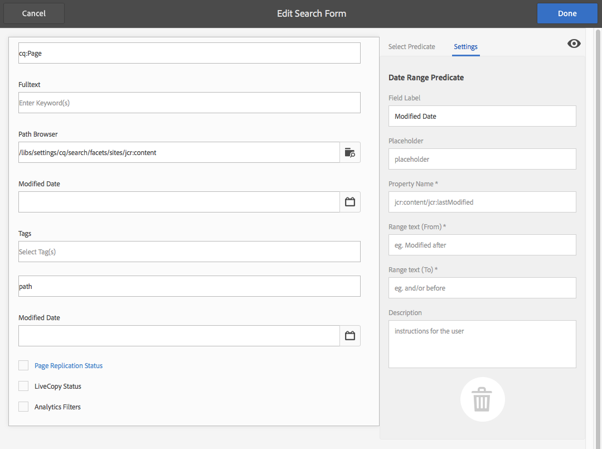

# Zoeken in Forms configureren{#configuring-search-forms}

Het gebruik **Onderzoek Forms** om de selectie van onderzoeksvoorspelden aan te passen die in de onderzoekspanelen beschikbaar in diverse AEM consoles en/of panelen van het auteursmilieu worden gebruikt. Als u deze deelvensters aanpast, is de zoekfunctionaliteit veelzijdig op basis van uw specifieke behoeften.

A [ waaier van predikaat ](#predicates-and-their-settings) is beschikbaar uit-van-de-doos. U kunt meerdere voorspelden toevoegen, waaronder (onder andere) de voorspelling van de eigenschap, om te zoeken naar elementen die overeenkomen met één eigenschap die door u is opgegeven. Of de opties verwijzen naar zoekelementen die overeenkomen met een of meer waarden die u voor een bepaalde eigenschap opgeeft.

U kunt [ vormen de onderzoeksvormen ](#configuring-your-search-forms) die binnen diverse consoles en activabrowser worden gebruikt (wanneer het uitgeven van pagina&#39;s). De [ dialogen voor het vormen van deze vormen ](#configuring-your-search-forms) kunnen via worden betreden:

* **Hulpmiddelen**

   * **Algemeen**

      * **Onderzoek Forms**

Wanneer u eerst tot deze console toegang hebt, kunt u zien dat alle configuraties een hangslotsymbool hebben. Dit wijst erop dat de aangewezen configuratie de standaardconfiguratie (uit-van-de-doos) is - en kan niet worden geschrapt. Nadat u de configuratie hebt aangepast, verdwijnt het slot tenzij u [ uw aangepaste configuratie ](#deleting-a-configuration-to-reinstate-the-default) schrapt. In dat geval wordt de standaardinstelling (en de hangslotindicator) hersteld.

## Configuraties {#configurations}

De beschikbare standaardconfiguraties zijn:

* **Redacteur van de Pagina (het onderzoek van Documenten):**

  Deze configuratie bepaalt de beschikbare opties wanneer het zoeken naar document in middelenbrowser (wanneer het uitgeven van een pagina).

* **Redacteur van de Pagina (het onderzoek van het Beeld):**

  Deze configuratie bepaalt de beschikbare opties wanneer het zoeken naar beelden in middelenbrowser (wanneer het uitgeven van een pagina).

* **Redacteur van de Pagina (het onderzoek van Manuscript):**

  Deze configuratie bepaalt de beschikbare opties wanneer het zoeken naar manuscripten in middelenbrowser (wanneer het uitgeven van een pagina).

* **Redacteur van de Pagina (het onderzoek van de Pagina):**

  Deze configuratie bepaalt de beschikbare opties wanneer het zoeken naar pagina&#39;s in middelenbrowser (wanneer het uitgeven van een pagina).

* **Redacteur van de Pagina (het onderzoek van Paragraaf):**

  Deze configuratie bepaalt de beschikbare opties wanneer het zoeken naar paragrafen in middelenbrowser (wanneer het uitgeven van een pagina).

* **Redacteur van de Pagina (het onderzoek van het Product):**

  Deze configuratie bepaalt de beschikbare opties wanneer het zoeken naar producten in middelenbrowser (wanneer het uitgeven van een pagina).

* **Redacteur van de Pagina (Dynamic Media Classic [ vroeger Scene7 ] onderzoek)**:

  Deze configuratie definieert de beschikbare opties bij het zoeken naar Scene7-bronnen in de middelenbrowser (bij het bewerken van een pagina).

* **Rail van het Onderzoek van Plaatsbeheer 1}:**

  Deze configuratie bepaalt de onderzoeksopties beschikbaar aan de gebruiker wanneer het gebruiken van de onderzoekslijn van de console van Plaatsen.

* **Redacteur van de Pagina (Video onderzoek):**

  Deze configuratie bepaalt de beschikbare opties wanneer het zoeken naar video&#39;s in middelenbrowser (wanneer het uitgeven van een pagina).

* **Assets Admin Rail van het Onderzoek:**

  Deze configuratie bepaalt de onderzoeksopties beschikbaar aan de gebruiker wanneer het gebruiken van de console van Assets.

* **Rail van het Onderzoek van Admin van Catalogi:**

  Deze configuratie bepaalt de onderzoeksopties beschikbaar aan de gebruiker wanneer het zoeken van een handelscatalogus.

* **orden Admin Rail van het Onderzoek:**

  Deze configuratie bepaalt de onderzoeksopties beschikbaar aan de gebruiker wanneer het zoeken van handelsorden.

* **Rail van het Onderzoek van Admin van de Inzamelingen van het Product:**

  Deze configuratie bepaalt de onderzoeksopties beschikbaar aan de gebruiker wanneer het zoeken van handelsproductinzamelingen.

* **Rail van het Onderzoek van Admin van Producten:**

  Deze configuratie bepaalt de onderzoeksopties beschikbaar aan de gebruiker wanneer het zoeken van handelsproducten.

* **Rail van het Onderzoek van Admin van het Project:**

  Deze configuratie bepaalt de onderzoeksopties beschikbaar aan de gebruiker wanneer het zoeken van projecten.

## Voorspellen en de bijbehorende instellingen {#predicates-and-their-settings}

### Voorspellen {#predicates}

De volgende predikaten zijn beschikbaar, afhankelijk van de configuratie:

<table>
 <tbody>
  <tr>
   <th>Voorspelend</th>
   <th>Doel</th>
   <th>Instellingen</th>
  </tr>
  <tr>
   <td>Analyse </td>
   <td>Mogelijkheden zoeken/filteren in de Sites-browser bij het weergeven van gegevens met analysemogelijkheden. De zoekfilters van Analytics laden tot aan de in kaart gebrachte aangepaste analytische kolommen.</td>
   <td>
    <ul>
     <li>Veldlabel</li>
     <li>Beschrijving</li>
    </ul> </td>
  </tr>
  <tr>
   <td>Element laatst gewijzigd </td>
   <td>Datum waarop het element voor het laatst is gewijzigd.  </td>
   <td>Een aangepaste voorspelling op basis van de datumvoorspelling.</td>
  </tr>
  <tr>
   <td>Onderdelen </td>
   <td>Hiermee kan een auteur zoeken/filteren op pagina's die een specifieke component bevatten. Bijvoorbeeld, een beeldgalerij.  </td>
   <td>
    <ul>
     <li>Veldlabel</li>
     <li>Plaatsaanduiding</li>
     <li>Eigenschapnaam*</li>
     <li>Diepte van eigenschap</li>
     <li>Beschrijving</li>
    </ul> </td>
  </tr>
  <tr>
   <td>Datum </td>
   <td>Op schuifregelaars gebaseerde zoekopdracht naar elementen op basis van een datumeigenschap.</td>
   <td>
    <ul>
     <li>Veldlabel</li>
     <li>Eigenschapnaam*</li>
     <li>Beschrijving</li>
    </ul> </td>
  </tr>
  <tr>
   <td>Datumbereik </td>
   <td>Zoek in een opgegeven bereik gemaakte elementen naar een datumeigenschap. In het deelvenster Zoeken kunt u begin- en einddatums opgeven.</td>
   <td>
    <ul>
     <li>Veldlabel</li>
     <li>Plaatsaanduiding</li>
     <li>Eigenschapnaam*</li>
     <li>Bereik tekst (Van)*</li>
     <li>Bereik tekst (naar)*</li>
     <li>Beschrijving</li>
    </ul> </td>
  </tr>
  <tr>
   <td>Vervalstatus </td>
   <td>Zoeken in middelen op basis van vervalstatus.</td>
   <td>
    <ul>
     <li>Veldlabel</li>
     <li>Eigenschapnaam*</li>
     <li>Beschrijving</li>
    </ul> </td>
  </tr>
  <tr>
   <td>Bestandsgrootte </td>
   <td>Elementen zoeken op basis van hun grootte.</td>
   <td>
    <ul>
     <li>Veldlabel</li>
     <li>Eigenschapnaam*</li>
     <li>Optiepad</li>
     <li>Beschrijving</li>
    </ul> </td>
  </tr>
  <tr>
   <td>Verborgen filter</td>
   <td>Een filter op eigenschap en waarde, niet zichtbaar voor de gebruiker.</td>
   <td>
    <ul>
     <li>Eigenschapnaam</li>
     <li>Waarde van eigenschap</li>
     <li>Beschrijving</li>
    </ul> </td>
  </tr>
  <tr>
   <td>Opties </td>
   <td>
De opties zijn inhoudsknooppunten die door de gebruiker zijn gemaakt.
 
Zie <a href="#addinganoptionspredicate"> Toevoegend een Predicate van Opties </a> voor meer informatie.
 </td>
   <td>
    <ul>
     <li>Veldlabel</li>
     <li>JSON-pad</li>
     <li>Eigenschapnaam*</li>
     <li>Enkel selecteren</li>
     <li>Optiepad</li>
     <li>Beschrijving</li>
    </ul> </td>
  </tr>
  <tr>
   <td>Opties, eigenschap </td>
   <td>Zoeken op een eigenschap van de optie.</td>
   <td>
    <ul>
     <li>Veldlabel</li>
     <li>Eigenschapnaam*</li>
     <li>Pad naar knooppunt Options   </li>
     <li>Enkel selecteren</li>
     <li>Beschrijving</li>
    </ul> </td>
  </tr>
  <tr>
   <td>Paginastatus </td>
   <td>Pagina's zoeken op basis van hun status.</td>
   <td>
    <ul>
     <li>Veldlabel</li>
     <li>Publish-eigenschapsnaam</li>
     <li>Eigenschapnaam van LiveCopy</li>
     <li>Beschrijving</li>
    </ul> </td>
  </tr>
  <tr>
   <td>Pad </td>
   <td>Zoeken naar elementen die zich onder een specifiek pad bevinden.</td>
   <td>
    <ul>
     <li>Veldlabel</li>
     <li>Zoekpad toevoegen</li>
     <li>Beschrijving</li>
    </ul> </td>
  </tr>
  <tr>
   <td>Eigenschap </td>
   <td>Zoeken op een opgegeven eigenschap.</td>
   <td>none</td>
  </tr>
  <tr>
   <td>Publish-status </td>
   <td>Middelen zoeken op basis van hun publicatiestatus</td>
   <td>
    <ul>
     <li>Veldlabel</li>
     <li>Eigenschapnaam*</li>
     <li>Beschrijving</li>
    </ul> </td>
  </tr>
  <tr>
   <td>Bereik </td>
   <td>Zoekbronnen binnen een opgegeven bereik. In het paneel van het Onderzoek, kunt u minimum en maximumwaarden voor de waaier specificeren.</td>
   <td>
    <ul>
     <li>Veldlabel</li>
     <li>Eigenschapnaam</li>
     <li>Beschrijving</li>
    </ul> </td>
  </tr>
  <tr>
   <td>Bereik-opties </td>
   <td>Een specifieke zoekvoorspelling voor Assets en hetzelfde als voor algemene voorspelling van Slider. Is nog steeds beschikbaar vanwege compatibiliteitsproblemen met oudere versies.</td>
   <td>
    <ul>
     <li>Veldlabel</li>
     <li>Eigenschapnaam*</li>
     <li>Optiepad</li>
     <li>Beschrijving</li>
    </ul> </td>
  </tr>
  <tr>
   <td>Classificatie </td>
   <td>Elementen zoeken op basis van hun waardering.  </td>
   <td>
    <ul>
     <li>Veldlabel</li>
     <li>Eigenschapnaam*</li>
     <li>Optiepad</li>
     <li>Beschrijving</li>
    </ul> </td>
  </tr>
  <tr>
   <td>Relatieve datum </td>
   <td>Elementen zoeken op basis van de relatieve datum waarop ze zijn gemaakt   </td>
   <td>
    <ul>
     <li>Veldlabel</li>
     <li>Eigenschapnaam*</li>
     <li>Relatieve datum</li>
     <li>Beschrijving</li>
    </ul> </td>
  </tr>
  <tr>
   <td>Schuifbereik </td>
   <td>Een gemeenschappelijke onderzoeksvoorspelling die de waaiervoorspelling met het schuifvermogen uitbreidt. De waarde van de gezochte eigenschap moet tussen de schuifregelaargrenzen liggen.</td>
   <td>
    <ul>
     <li>Veldlabel</li>
     <li>Eigenschapnaam*</li>
     <li>Beschrijving</li>
    </ul> </td>
  </tr>
  <tr>
   <td>Tag </td>
   <td>Zoeken in elementen op basis van tags. U kunt het bezit van de Weg vormen om diverse markeringen in de lijst van Markeringen te bevolken.</td>
   <td>
    <ul>
     <li>Veldlabel</li>
     <li>Eigenschapnaam*</li>
     <li>Optiepad</li>
     <li>Beschrijving</li>
    </ul> </td>
  </tr>
  <tr>
   <td>Tags </td>
   <td>Zoeken op basis van tags.</td>
   <td>
    <ul>
     <li>Plaatsaanduiding</li>
     <li>Eigenschapnaam*</li>
     <li>Beschrijving</li>
    </ul> </td>
  </tr>
 </tbody>
</table>

>[!NOTE]
>
>* De algemene zoekvoorspelling wordt gedefinieerd in:
>  `/libs/cq/gui/components/common/admin/customsearch/searchpredicates`
>
>* Zoekvoorspellingen die alleen betrekking hebben op sitebeheer (klassieke UI) bevinden zich onder:
>  `/libs/cq/gui/components/siteadmin/admin/searchpanel/searchpredicates`
>   * Deze zijn verouderd en zijn alleen beschikbaar voor achterwaartse compatibiliteit.
>
>Deze informatie is uitsluitend ter referentie. Wijzig `/libs` niet.

### Instellingen voor voorspelling {#predicate-settings}

Afhankelijk van de voorspelling is een selectie van instellingen beschikbaar voor configuratie:

* **Etiket van het Gebied**

  Het label dat wordt weergegeven als de inklapbare koptekst of als veldlabel van de voorspelling.

* **Beschrijving**

  Beschrijvende details voor de gebruiker.

* **Placeholder**

  Lege tekst of de plaatsaanduiding van de voorspelling voor het geval er geen filtertekst wordt ingevoerd.

* **de Naam van het Bezit**

  De eigenschap waarop moet worden gezocht. Er wordt een relatief pad gebruikt en de jokertekens `*/*/*` geven de diepte van de eigenschap op ten opzichte van het knooppunt `jcr:content` (elke asterisk vertegenwoordigt één knooppuntniveau).

  Als u alleen wilt zoeken op een onderliggend knooppunt op het eerste niveau van de bron met de eigenschap `x` op het `jcr:content` nodegebruik `*/jcr:content/x`

* **Diepte van het Bezit**

  De maximumdiepte om naar dat bezit binnen de middelen te zoeken. Een zoekopdracht naar die eigenschap kan dus worden uitgevoerd op een resource en recursieve onderliggende elementen totdat het niveau van de onderliggende objecten gelijk is aan de opgegeven diepte.

* **Waarde van het Bezit**

  De eigenschapswaarde als een absolute tekenreeks of als expressietaal, bijvoorbeeld `cq:Page` of

  `${empty requestPathInfo.suffix ? "/content" : requestPathInfo.suffix}`.

* **Tekst van de Waaier**

  Het etiket van het waaiergebied in de **Waaier van de Datum** voorspelt.

* **Pad van de Optie**

  De gebruiker kan het pad selecteren met behulp van de Padbrowser op het tabblad Voorspelfunctie. Nadat u **+** hebt geselecteerd, wordt het pictogram gebruikt om de selectie toe te voegen aan de lijst met geldige opties (en vervolgens het pictogram **-** om indien nodig te verwijderen).

  De opties zijn inhoudsknooppunten die door de gebruiker zijn gemaakt en die de volgende structuur hebben:

  `(jcr:primaryType = nt:unstructured, value (String), jcr:title (String))`

* **de knoopweg van Opties**
In feite het zelfde als het **Weg van Opties**, slechts is dit op het gemeenschappelijke predikaat gebied, andere specifiek voor activa is.

* **Enige Uitgezochte**
Als deze optie is ingeschakeld, worden de opties weergegeven als selectievakjes die slechts één selectie toestaan. Als u per ongeluk een selectievakje hebt ingeschakeld, kan dit worden uitgeschakeld.

* **Publish en de Levende Namen van het Bezit van het Exemplaar**
De etiketten voor publiceren en levende exemplaarcontroledozen voor het specifieke predikaat van Plaatsen.

* &amp;ast; op de gebiedslabels op het **lusje van Montages** betekent dat de gebieden worden vereist en als verlaten leeg verschijnt een foutenmelding.

## Uw zoekopdracht configureren, Forms {#configuring-your-search-forms}

### Een aangepaste configuratie maken/openen {#creating-opening-a-customized-configuration}

1. Navigeer aan **Hulpmiddelen** > **Algemeen** > **Onderzoek Forms**.

1. Selecteer de configuratie die u wilt aanpassen.
1. Gebruik **geef** pictogram uit om de configuratie voor het bijwerken te openen.
1. Als een nieuwe aanpassing, wilt u waarschijnlijk [ nieuwe voorspellen gebieden toevoegen en de montages ](#add-edit-a-predicate-field-and-define-field-settings) zoals vereist bepalen. Als een bestaande aanpassing, u een bestaand gebied kunt selecteren en [ de montages ](#add-edit-a-predicate-field-and-define-field-settings) bijwerken.
1. Selecteer **Gedaan** om de configuratie te bewaren.

   >[!NOTE]
   >
   >De aangepaste configuraties worden (indien van toepassing) opgeslagen onder:
   >
   >* `/apps/cq/gui/content/facets/<option>`
   >* `/apps/commerce/gui/content/facets/<option>`

### Een voorspelbaar veld toevoegen/bewerken en veldinstellingen definiëren {#add-edit-a-predicate-field-and-define-field-settings}

U kunt velden toevoegen of bewerken en de instellingen van velden definiëren/bijwerken:

1. [ open de aangepaste configuratie ](#creating-opening-a-customized-configuration) voor het bijwerken.
1. Als u een gebied wilt toevoegen, open **Uitgezochte Predicate** tabel en sleep vereiste predikaat aan de vereiste plaats. Bijvoorbeeld, het **Predicate van de Waaier van de Datum**:

   

1. Afhankelijk van of:

   * U voegt een veld toe:

     Na het toevoegen van predikaat, opent het **lusje van Montages** en toont de eigenschappen die kunnen worden bepaald.

   * U wilt een bestaande voorspelling bijwerken:

     Selecteer het predikaat gebied (op het recht), dan open de **Montages** tabel.

   Bijvoorbeeld, de montages voor het **Predicate van de Waaier van de Datum**:

   

1. Breng zonodig uw veranderingen aan en bevestig met **Gereed**.

### Een voorvertoning weergeven van de zoekconfiguratie {#previewing-the-search-configuration}

1. Selecteer het pictogram Voorvertoning:

   

1. Op deze manier worden de zoekformulieren weergegeven zoals ze worden weergegeven (volledig uitgevouwen) in de kolom Zoeken van de desbetreffende console.

   

1. **dicht** de voorproef zodat kunt u de configuratie terugkeren en beëindigen.

### Een voorspelbaar veld verwijderen {#deleting-a-predicate-field}

1. [ open de aangepaste configuratie ](#creating-opening-a-customized-configuration) voor het bijwerken.
1. Selecteer het voorspelbare gebied (op het recht), open het **lusje van Montages** en selecteer dan het **Schrapping** pictogram (linksonder).

   

1. Een dialoogvenster vraagt om bevestiging van de verwijderactie.

1. Bevestig dit en om het even welke andere veranderingen met **Gereed**.

### Een configuratie verwijderen (om de standaardinstelling te herstellen) {#deleting-a-configuration-to-reinstate-the-default}

Nadat u een configuratie hebt aangepast, treedt dit de gebreken met voeten. U kunt de standaardconfiguratie herstellen door uw aangepaste configuratie te schrappen.

>[!NOTE]
>
>U kunt geen van beide standaardconfiguraties verwijderen.

Het schrappen van een aangepaste configuratie wordt gedaan van de console:

1. Selecteer de vereiste configuratie (bijvoorbeeld, **Redacteur van de Pagina (het onderzoek van Paragraaf)**) en toen **schrap** pictogram in de toolbar:

   

1. De aangepaste configuratie wordt verwijderd en de standaardinstelling wordt hersteld (dit wordt aangegeven door het opnieuw verschijnen van het hangslotsymbool in de console).

### Voorwaarden voor opties toevoegen {#adding-options-predicates}

Met de voorspelling van opties (Opties, eigenschap Opties) kunt u een item configureren waarnaar moet worden gezocht. Ze worden gebruikt om rechtstreeks onder de pagina naar iets te zoeken, bijvoorbeeld een eigenschap op het paginaknooppunt.

In het volgende voorbeeld (om te zoeken op basis van de sjabloon die wordt gebruikt om een pagina te maken) worden de desbetreffende stappen geïllustreerd:

1. Maak het knooppunt waarin de eigenschap wordt gedefinieerd waarop moet worden gezocht.

   U hebt een basisknooppunt met definities van de afzonderlijke opties nodig om beschikbaar te zijn voor de gebruiker.

   De knooppunten voor de afzonderlijke opties hebben de volgende eigenschappen nodig:

   * `jcr:title` - het veldlabel dat moet worden weergegeven in de zoekrail
   * `value` - de eigenschapswaarde waarop moet worden gezocht

   

   >[!NOTE]
   >
   >Wijzig ****** niets in de `/libs` weg.
   >
   >De reden hiervoor is dat de inhoud van `/libs` de volgende keer dat u een upgrade uitvoert van de instantie wordt overschreven (en dat deze inhoud ook kan worden overschreven wanneer u een hotfix- of functiepakket toepast).
   >
   >De aanbevolen methode voor configuratie en andere wijzigingen is:
   >
   >1. Herstel het vereiste item, zoals het in `/libs` onder `/apps` staat. In dit geval:
   >1. `/libs/cq/gui/content/common/options/predicates`
   >1. Breng eventuele wijzigingen aan binnen `/apps.`

1. Open de **console van Forms van het Onderzoek** en selecteer de configuratie u wilt bijwerken. Bijvoorbeeld, **Sites Admin sporen van het Onderzoek**.

   Dan klik **uitgeven onderzoeksvormen** pictogram.

1. Afhankelijk van de configuratie, voeg een **Opties** of **Bezit van Opties** aan de configuratie toe.
1. Werk de velden bij, met name:

   * **de Naam van het Bezit**

     Specifiek het knoopbezit dat op de doelknopen moet worden gezocht. Bijvoorbeeld:

     `jcr:content/cq:template`

   * **de knoopweg van de Optie**

     Selecteer het pad naar de locatie waar uw opties staan. Bijvoorbeeld:

     `/apps/cq/gui/content/common/options/predicates/templatetype`

   

1. Selecteer **Gedaan** om uw configuratie te bewaren.
1. Navigeer aan de aangewezen console (in dit voorbeeld, **Plaatsen**) en open het **spoor van het Onderzoek**. De nieuwe zoekformulieren en de verschillende opties zijn zichtbaar. Selecteer de gewenste optie zodat u de zoekresultaten kunt zien:

   

## Gebruikersmachtigingen {#user-permissions}

In de volgende tabel worden de machtigingen weergegeven die vereist zijn voor het uitvoeren van bewerkingen, verwijderen en voorvertoningen van handelingen op zoekformulieren.

<table>
 <tbody>
  <tr>
   <td><strong>Handeling</strong></td>
   <td><strong>Machtigingen</strong></td>
  </tr>
  <tr>
   <td>Bewerken </td>
   <td>Lees, schrijf toestemmingen op de <code>/apps </code> knoop.</td>
  </tr>
  <tr>
   <td>Verwijderen</td>
   <td>Machtigingen voor het knooppunt <code>/apps</code> lezen, schrijven, verwijderen</td>
  </tr>
  <tr>
   <td>Voorvertoning</td>
   <td>Machtigingen voor het lezen, schrijven en verwijderen van het knooppunt <code>/var/dam/content</code> .  Rechten voor lezen, schrijven op het knooppunt <code>/apps</code> .</td>
  </tr>
 </tbody>
</table>
