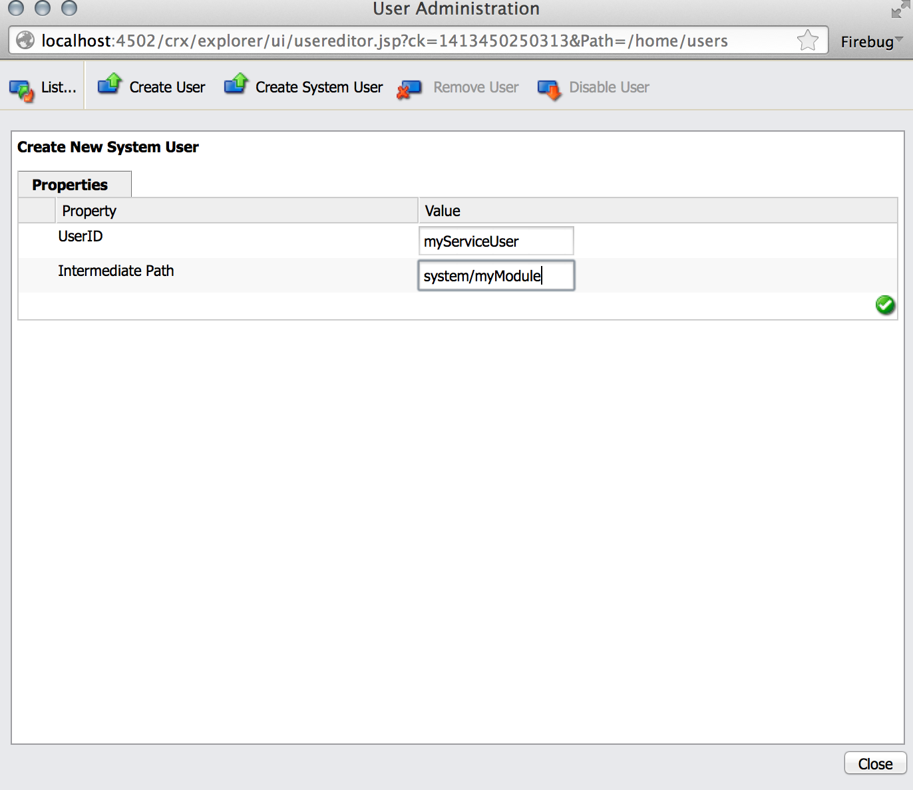

# Servicegebruikers in AEM{#service-users-in-aem}

## Overzicht {#overview}

De belangrijkste manier om een administratieve zitting of middeloplosser in AEM te krijgen was het gebruiken van `SlingRepository.loginAdministrative()` en `ResourceResolverFactory.getAdministrativeResourceResolver()` methodes die door Sling worden verstrekt.

Nochtans, werden geen van beide methodes ontworpen rond het [beginsel van minste voorrecht](https://en.wikipedia.org/wiki/Principle_of_least_privilege) en maken het voor een ontwikkelaar te gemakkelijk om niet voor een juiste structuur en de overeenkomstige Niveaus van het Toegangsbeheer (ACLs) voor hun inhoud vroegtijdig te plannen. Als een kwetsbaarheid in zulk een dienst aanwezig is, leidt het vaak tot voorrechtescalaties aan de `admin` gebruiker, zelfs als de code zelf geen administratieve voorrechten zou vereisen om te werken.

## Admin-sessies {#how-to-phase-out-admin-sessions} uitfaseren

### Prioriteit 0: Is de functie actief/nodig/verwijderd? {#priority-is-the-feature-active-needed-derelict}

Er kunnen zich gevallen voordoen waarin de beheersessie niet wordt gebruikt of de functie volledig is uitgeschakeld. Als dit het geval met uw implementatie is, zorg ervoor u de eigenschap volledig verwijdert of het met [NOP code](https://en.wikipedia.org/wiki/NOP) past.

### Prioriteit 1: De verzoekzitting {#priority-use-the-request-session} gebruiken

Wijzig indien mogelijk uw functie, zodat de opgegeven, geverifieerde aanvraagsessie kan worden gebruikt voor het lezen of schrijven van inhoud. Als dit niet mogelijk is, kan het vaak worden bereikt door de onderstaande prioriteiten toe te passen.

### Prioriteit 2: Inhoud opnieuw structureren {#priority-restructure-content}

Veel problemen kunnen worden opgelost door de inhoud te herstructureren. Houd rekening met de volgende eenvoudige regels wanneer u de herstructurering uitvoert:

* **Toegangsbeheer wijzigen**

   * Zorg ervoor dat de gebruikers of de groepen die werkelijk toegang nodig hebben daadwerkelijk toegang hebben;

* **Inhoudsstructuur verfijnen**

   * Verplaats het naar andere locaties, bijvoorbeeld waar toegangsbeheer overeenkomt met de beschikbare aanvraagsessies.
   * Wijzig de granulariteit van de inhoud.

* **Vernieuw uw code om een juiste service te zijn**

   * Verplaats de bedrijfslogica van code JSP naar de dienst. Dit maakt verschillende inhoudmodellen mogelijk.

Ook, zorg ervoor dat om het even welke nieuwe eigenschappen u ontwikkelt zich aan deze principes houdt:

* **Beveiligingsvereisten moeten de inhoudstructuur bepalen**

   * Het beheer van toegangsbeheer moet natuurlijk zijn
   * Toegangscontrole moet worden afgedwongen door de gegevensopslagplaats, niet door de toepassing

* **Gebruik van knooppunten maken**

   * De set eigenschappen beperken die kan worden ingesteld

* **Privacy-instellingen respecteren**

   * In het geval van privéprofielen kunt u bijvoorbeeld de profielafbeelding, e-mail of volledige naam op het knooppunt private `/profile` niet onthullen.

## Strikt toegangsbeheer {#strict-access-control}

Of u toegangsbeheer terwijl het herstructureren van inhoud toepast of wanneer u het voor een nieuwe de dienstgebruiker doet, moet u strikt mogelijke ACLs toepassen. Gebruik alle mogelijke toegangsbeheerfaciliteiten:

* In plaats van `jcr:read` toe te passen op `/apps`, moet u deze bijvoorbeeld alleen toepassen op `/apps/*/components/*/analytics`

* [beperkingen](https://jackrabbit.apache.org/oak/docs/security/authorization/restriction.html) gebruiken

* ACLs voor knooptypes toepassen
* Machtigingen beperken

   * geven `jcr:write` bijvoorbeeld niet de toestemming wanneer alleen eigenschappen moeten worden geschreven; gebruik in plaats hiervan `jcr:modifyProperties`

## Servicegebruikers en toewijzingen {#service-users-and-mappings}

Als het bovenstaande ontbreekt, biedt Sling 7 de dienst van de Toewijzing van de Gebruiker van de Dienst aan, die toestaat om een bundel-aan-gebruiker afbeelding en twee overeenkomstige API methodes te vormen: ` [SlingRepository.loginService()](https://sling.apache.org/apidocs/sling7/org/apache/sling/jcr/api/SlingRepository.html#loginService-java.lang.String-java.lang.String-)` en ` [ResourceResolverFactory.getServiceResourceResolver()](https://sling.apache.org/apidocs/sling7/org/apache/sling/api/resource/ResourceResolverFactory.html#getServiceResourceResolver-java.util.Map-)` die een zitting/middeloplosser met de voorrechten van een gevormde slechts gebruiker terugkeren. Deze methoden hebben de volgende kenmerken:

* Zij staan kaartdiensten aan gebruikers toe
* Zij maken het mogelijk om subservicegebruikers te definiëren
* Het centrale configuratiepunt is: `org.apache.sling.serviceusermapping.impl.ServiceUserMapperImpl`
* `service-id` =  `service-name` [ &quot;:&quot; subservice-name  ]


* `service-id` is toegewezen aan een resourceoplosser en/of JCR-opslaggebruikers-id voor verificatie
* `service-name` is de symbolische naam van de bundel die de dienst verleent

## Overige Recommendations {#other-recommendations}

### De beheersessie vervangen door een service-gebruiker {#replacing-the-admin-session-with-a-service-user}

Een servicegebruiker is een JCR-gebruiker zonder wachtwoord en met een minimale set rechten die nodig zijn om een bepaalde taak uit te voeren. Als er geen wachtwoord is ingesteld, kan u zich niet aanmelden bij een servicegebruiker.

Een manier om een administratieve zitting te verwerpen is het door de zittingen van de de dienstgebruiker te vervangen. Indien nodig kan de subservice ook door meerdere gebruikers worden vervangen.

Als u de beheersessie wilt vervangen door een servicegebruiker, moet u de volgende stappen uitvoeren:

1. Identificeer de noodzakelijke toestemmingen voor uw dienst, die het beginsel van minste toestemming in mening houden.
1. Controleer of er al een gebruiker beschikbaar is met exact de juiste instellingen voor machtigingen. Maak een nieuwe gebruiker van de systeemservice als geen bestaande gebruiker aan uw wensen voldoet. RTC is vereist om een nieuwe de dienstgebruiker tot stand te brengen. Soms is het handig om meerdere gebruikers van subservices te maken (bijvoorbeeld een voor schrijven en een voor lezen) om de toegang nog verder te compartimenteren.
1. Opstelling en test ACEs voor uw gebruiker.
1. Voeg een `service-user` afbeelding toe voor uw service en voor `user/sub-users`

1. Maak de verkoopfunctie van de de dienstgebruiker beschikbaar aan uw bundel: update naar de meest recente versie van `org.apache.sling.api`.

1. Vervang `admin-session` in uw code met `loginService` of `getServiceResourceResolver` APIs.

## Nieuwe servicegebruiker {#creating-a-new-service-user} maken

Nadat u hebt gecontroleerd dat geen gebruiker in de lijst met AEM gebruikers van toepassing is voor uw gebruiksscenario en de bijbehorende RTC-problemen zijn goedgekeurd, kunt u doorgaan en de nieuwe gebruiker toevoegen aan de standaardinhoud.

De aanbevolen aanpak is om een servicegebruiker te maken die de verkenner van de opslagplaats kan gebruiken op *https://&lt;server>:&lt;port>/crx/explorer/index.jsp*

Het doel is om een geldige `jcr:uuid` eigenschap te krijgen die verplicht is om de gebruiker via een installatie van een inhoudspakket te creëren.

U kunt servicegebruikers maken door:

1. Ga naar de verkenner van de repository op *https://&lt;server>:&lt;port>/crx/explorer/index.jsp*
1. Aanmelden als beheerder door op de koppeling **Aanmelden** linksboven in het scherm te drukken.
1. Maak vervolgens een systeemgebruiker en geef deze een naam. Als u de gebruiker als systeem wilt maken, stelt u het tussenliggende pad in als `system` en voegt u optionele submappen toe, afhankelijk van uw behoeften:

   

1. Controleer of het systeemgebruikersknooppunt er als volgt uitziet:

   

   >[!NOTE]
   >
   >Merk op dat er geen mixintypes verbonden aan de dienstgebruikers zijn. Dit betekent dat er geen beleid voor toegangsbeheer voor systeemgebruikers zal zijn.

Wanneer het toevoegen van overeenkomstige .content.xml aan de inhoud van uw bundel, zorg ervoor u `rep:authorizableId` hebt geplaatst en dat het primaire type `rep:SystemUser` is. Het moet er als volgt uitzien:

```xml
<?xml version="1.0" encoding="UTF-8"?>
<jcr:root xmlns:jcr="https://www.jcp.org/jcr/1.0" xmlns:rep="internal"
    jcr:primaryType="rep:SystemUser"
    jcr:uuid="4917dd68-a0c1-3021-b5b7-435d0044b0dd"
    rep:principalName="authentication-service"
    rep:authorizableId="authentication-service"/>
```

## Een configuratiewijziging toevoegen aan de configuratie ServiceUserMapper {#adding-a-configuration-amendment-to-the-serviceusermapper-configuration}

Om een afbeelding van uw dienst aan de overeenkomstige Gebruikers van het Systeem toe te voegen moet u een fabrieksconfiguratie voor de ` [ServiceUserMapper](https://sling.apache.org/apidocs/sling7/org/apache/sling/serviceusermapping/ServiceUserMapper.html)` dienst tot stand brengen. Om deze modulaire configuratie te houden kunnen dergelijke configuraties worden verstrekt gebruikend [Sling amendeert mechanisme](https://issues.apache.org/jira/browse/SLING-3578). U kunt dergelijke configuraties het beste met uw bundel installeren met [Aanvankelijke inhoud laden verzenden](https://sling.apache.org/documentation/bundles/content-loading-jcr-contentloader.html):

1. Een submap SLING-INF/content maken onder de map src/main/resources van uw bundel
1. Maak in deze map een bestand met de naam org.apache.sling.usermapping.impl.ServiceUserMapperImpl.modified-&lt;some unique name for your factory configuration>.xml met de inhoud van uw fabrieksconfiguratie (inclusief alle gebruikerstoewijzingen voor subservices). Voorbeeld:

1. Maak een `SLING-INF/content`-map onder de map `src/main/resources` van uw bundel.
1. Maak in deze map een bestand `named org.apache.sling.serviceusermapping.impl.ServiceUserMapperImpl.amended-<a unique name for your factory configuration>.xml` met de inhoud van uw fabrieksconfiguratie, inclusief alle gebruikerstoewijzingen voor subservices.

   Voor illustratiedoeleinden gebruikt u het bestand `org.apache.sling.serviceusermapping.impl.ServiceUserMapperImpl.amended-com.adobe.granite.auth.saml.xml`:

   ```xml
   <?xml version="1.0" encoding="UTF-8"?>
   <node>
       <primaryNodeType>sling:OsgiConfig</primaryNodeType>
       <property>
           <name>user.default</name>
           <value></value>
       </property>
       <property>
           <name>user.mapping</name>
           <values>
               <value>com.adobe.granite.auth.saml=authentication-service</value>
           </values>
       </property>
   </node>
   ```

1. Verwijs de het Verdelen aanvankelijke inhoud in de configuratie van `maven-bundle-plugin` in `pom.xml` van uw bundel. Voorbeeld:

   ```xml
   <Sling-Initial-Content>
      SLING-INF/content;path:=/libs/system/config;overwrite:=true;
   </Sling-Initial-Content>
   ```

1. Installeer de bundel en zorg ervoor de fabrieksconfiguratie is geïnstalleerd. U kunt dit doen door:

   * Ga naar de webconsole op *https://serverhost:serveraddress/system/console/configMgr*
   * Zoeken naar **Apache Sling Service User Mapper Service Wijziging**
   * Klik op de koppeling om te zien of de juiste configuratie is geïnstalleerd.

## Behandeling van gedeelde sessies in services {#dealing-with-shared-sessions-in-services}

Oproepen aan `loginAdministrative()` verschijnen vaak samen met gedeelde zittingen. Deze zittingen worden verworven bij de dienstactivering en slechts het programma geopend nadat de dienst wordt tegengehouden. Hoewel dit gebruikelijk is, leidt het tot twee problemen:

* **Beveiliging:** Dergelijke beheersessies worden gebruikt om bronnen of andere objecten die aan de gedeelde sessie zijn gebonden in cache te plaatsen en terug te sturen. Later in de vraagstapel konden deze voorwerpen aan zittingen of middeloplossers met opgeheven voorrechten worden aangepast, en het is vaak niet duidelijk aan de bezoeker dat het een adminzitting is zij met werken.
* **Prestaties:** in Gedeelde sessies met eikel kunnen prestatieproblemen veroorzaken en het wordt momenteel niet aangeraden deze te gebruiken.

De meest voor de hand liggende oplossing voor het beveiligingsrisico is de `loginAdministrative()`-aanroep eenvoudig te vervangen door een `loginService()`-aanroep naar een gebruiker met beperkte rechten. Dit heeft echter geen invloed op een mogelijke verslechtering van de prestaties. Een mogelijkheid om dat te beperken is alle gevraagde informatie te verpakken in een object dat geen koppeling heeft met de sessie. Maak vervolgens de sessie op verzoek (of vernietigt deze).

De aanbevolen aanpak bestaat erin de API van de service te herordenen om de beller controle te geven over het maken/vernietigen van de sessie.

## Administratieve sessies in JSPs {#administrative-sessions-in-jsps}

JSPs kan `loginService()` niet gebruiken, omdat er geen bijbehorende dienst is. Administratieve sessies in JSP&#39;s zijn echter doorgaans een teken van een schending van het MVC-paradigma.

Dit kan op twee manieren worden opgelost:

1. De inhoud zodanig herstructureren dat de inhoud met de gebruikerssessie kan worden gemanipuleerd;
1. Het halen van de logica aan de dienst die API verstrekt die dan door JSP kan worden gebruikt.

De eerste methode heeft de voorkeur.

## Verwerkingsgebeurtenissen, replicatievoorprocessoren en taken {#processing-events-replication-preprocessors-and-jobs}

Bij het verwerken van gebeurtenissen of taken en in sommige gevallen van workflows gaat de bijbehorende sessie die de gebeurtenis heeft geactiveerd, meestal verloren. Dit leidt ertoe dat gebeurtenismanagers en baanbewerkers vaak administratieve zittingen gebruiken om hun werk te doen. Er zijn verschillende denkbare benaderingen om dit probleem op te lossen, elk met hun voor- en nadelen:

1. Geef `user-id` door in de gebeurtenislading en gebruik imitatie.

   **Voordelen:** gebruiksvriendelijk.

   **Nadelen:** Nog steeds gebruikt  `loginAdministrative()`. Een aanvraag die al is geverifieerd, wordt opnieuw geverifieerd.

1. Creeer of hergebruik een de dienstgebruiker die toegang tot de gegevens heeft.

   **Voordelen:** consistent met het huidige ontwerp. Moet minimaal worden gewijzigd.

   **Nadelen:** Vereist zeer krachtige de dienstgebruikers om flexibel te zijn, wat tot voorrechtescalaties kan gemakkelijk leiden. Hiermee wordt het beveiligingsmodel omzeild.

1. Geef een serialisatie van de `Subject` in de gebeurtenislading door, en creeer `ResourceResolver` die op dat onderwerp wordt gebaseerd. Een voorbeeld hiervan is het gebruik van de JAAS `doAsPrivileged` in de `ResourceResolverFactory`.

   **Voordelen:implementatie** opschonen vanuit beveiligingsoogpunt. Het vermijdt re-authentificatie en het werkt met de originele voorrechten. Beveiligingsrelevante code is transparant voor de consument van het evenement.

   **Nadelen:** vereist refactoring. Het feit dat de veiligheidsrelevante code transparant is voor de consument van het evenement kan ook tot problemen leiden.

De derde aanpak is momenteel de voorkeurstechniek.

## Workflowprocessen {#workflow-processes}

Binnen de implementaties van het werkschemaproces wordt de overeenkomstige gebruikerszitting die het werkschema teweegbracht gewoonlijk verloren. Dit leidt tot werkschemaprocessen vaak gebruikend administratieve zittingen om hun werk uit te voeren.

Om deze problemen op te lossen, wordt aanbevolen dezelfde aanpak te gebruiken als in [Procesgebeurtenissen, Replication Preprocessors en Jobs](/help/sites-administering/security-service-users.md#processing-events-replication-preprocessors-and-jobs) wordt beschreven.

## POST-processors verkopen en verwijderde pagina&#39;s {#sling-post-processors-and-deleted-pages}

Er zijn een paar administratieve zittingen die in de implementatie van de bewerker van de POST worden gebruikt. Meestal worden beheersessies gebruikt om toegang te krijgen tot knooppunten die in afwachting zijn van verwijdering binnen de POST die wordt verwerkt. Daarom zijn ze niet meer beschikbaar via de aanvraagsessie. Een knoop in afwachting van schrapping kan worden betreden om metada vrij te geven die anders niet toegankelijk zou moeten zijn.
