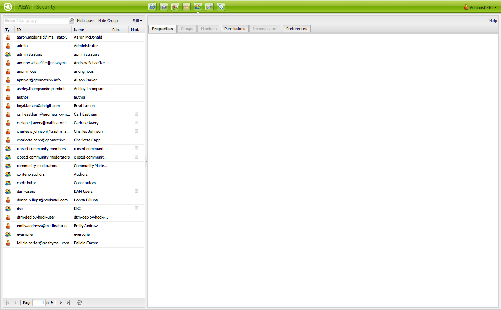

# Gebruikersbeheer en beveiliging{#user-administration-and-security}

In dit hoofdstuk wordt beschreven hoe u gebruikersautorisatie configureert en onderhoudt en wordt ook beschreven hoe verificatie en autorisatie in AEM werken.

## Gebruikers en groepen in AEM {#users-and-groups-in-aem}

Deze sectie behandelt de diverse entiteiten en verwante concepten meer in detail om u te helpen een gemakkelijk vormen om gebruikersbeheerconcept te handhaven.

### Gebruikers {#users}

Gebruikers melden zich aan bij AEM account. Elke gebruikersaccount is uniek en bevat de basisaccountgegevens, samen met de toegewezen rechten.

Gebruikers zijn vaak leden van Groepen, waardoor de toewijzing van deze machtigingen en/of bevoegdheden wordt vereenvoudigd.

### Groepen {#groups}

Groepen zijn verzamelingen van gebruikers of andere groepen, of beide. Deze verzamelingen worden allemaal leden van een groep genoemd.

Hun voornaamste doel is het onderhoudsproces te vereenvoudigen door het aantal bij te werken entiteiten te verminderen, aangezien een wijziging van een groep op alle leden van de groep wordt toegepast. Groepen weerspiegelen vaak:

* een rol binnen de toepassing, zoals iemand die de inhoud mag surfen of iemand die inhoud mag toevoegen.
* uw eigen organisatie; u kunt de rollen willen uitbreiden om tussen contribuanten van verschillende afdelingen te onderscheiden wanneer zij tot verschillende takken in de inhoudsboom beperkt zijn.

Groepen blijven daarom over het algemeen stabiel, terwijl gebruikers vaker komen en gaan.

Met planning en een schone structuur kan het gebruik van groepen uw structuur weerspiegelen, waardoor u een duidelijk overzicht krijgt en een efficiënt mechanisme voor updates.

### Ingebouwde gebruikers en groepen {#built-in-users-and-groups}

AEM WCM installeert meerdere gebruikers en groepen. Deze inzamelingen worden gezien wanneer u eerst tot de Console van de Veiligheid na installatie toegang hebt.

In de volgende tabellen wordt elk item vermeld, samen met:

* een korte beschrijving
* eventuele aanbevelingen over noodzakelijke wijzigingen

*Alle standaardwachtwoorden wijzigen* (als u de account zelf niet verwijdert in bepaalde omstandigheden).

<table>
 <tbody>
  <tr>
   <td>Gebruikersnaam</td>
   <td>Type</td>
   <td>Beschrijving</td>
   <td>Aanbeveling</td>
  </tr>
  <tr>
   <td>
admin
 
Standaardwachtwoord: admin
 </td>
   <td>Gebruiker</td>
   <td>
Systeembeheeraccount met volledige toegangsrechten.
 
Dit account wordt gebruikt voor de verbinding tussen AEM WCM en CRX.
 
Als u dit account per ongeluk verwijdert, wordt het opnieuw gemaakt nadat de opslagplaats opnieuw is opgestart (in de standaardinstelling).
 
De beheerdersaccount is een vereiste van het AEM platform. Dit betekent dat dit account niet kan worden verwijderd.
 </td>
   <td>
Adobe raadt u aan het standaardwachtwoord voor deze gebruikersaccount te wijzigen.
 
Bij voorkeur bij installatie, maar dat kan achteraf gebeuren.
 
Opmerking: verwar dit account niet met de beheerdersaccount van de CQ Servlet Engine.
 </td>
  </tr>
  <tr>
   <td>
anoniem
 
 
 </td>
   <td>Gebruiker</td>
   <td>
Houdt de standaardrechten voor ongeautoriseerde toegang tot een instantie. Per gebrek, bezit deze rekening de minimumtoegangsrechten.
 
Als u dit account per ongeluk verwijdert, wordt het bij het opstarten opnieuw gemaakt. Het kan niet permanent worden geschrapt, maar het kan worden onbruikbaar gemaakt.
 </td>
   <td>Verwijder of schakel dit account niet uit, omdat dit negatieve gevolgen heeft voor het functioneren van auteur-instanties. Als er beveiligingsvereisten zijn die u verplichten deze te verwijderen, moet u controleren of u de effecten ervan op uw systemen eerst op de juiste wijze test.</td>
  </tr>
  <tr>
   <td>
auteur
 
Standaardwachtwoord: auteur
 </td>
   <td>Gebruiker</td>
   <td>
Een auteursaccount dat naar /content mag schrijven. Omvat contribuant en surfer voorrechten.
 
Kan als webmaster worden gebruikt aangezien het toegang tot de volledige /content boom heeft.
 
Dit account is geen ingebouwde gebruiker, maar een andere demogebruiker van Geometrixx
 </td>
   <td>
Adobe raadt aan dat de account volledig wordt verwijderd of dat het standaardwachtwoord wordt gewijzigd.
 
Bij voorkeur bij installatie, maar dat kan achteraf gebeuren.
 </td>
  </tr>
  <tr>
   <td>beheerders</td>
   <td>Groep</td>
   <td>
Groep die beheerderrechten aan al zijn leden geeft. Alleen beheerders mogen deze groep bewerken.
 
Heeft volledige toegangsrechten.
 </td>
   <td>Zelfs als u "ontkent-iedereen"op een knoop plaatst, kunnen de beheerders tot de knoop nog toegang hebben</td>
  </tr>
  <tr>
   <td>content-authors</td>
   <td>Groep</td>
   <td>
Groep verantwoordelijk voor het bewerken van inhoud. Vereist lees, wijzig, creeer, en schrap toestemmingen.
 </td>
   <td>U kunt uw eigen tevreden-auteur groepen met project-specifieke toegangsrechten tot stand brengen, op voorwaarde dat u gelezen toevoegt, wijzigt, creeert en, toestemmingen schrapt.</td>
  </tr>
  <tr>
   <td>contribuant</td>
   <td>Groep</td>
   <td>
Basisrechten waarmee de gebruiker inhoud kan schrijven (zoals in, alleen functionaliteit).
 
Wijst geen voorrechten aan de /content boom toe. Moet worden toegewezen aan de afzonderlijke groepen of gebruikers.
 </td>
   <td> </td>
  </tr>
  <tr>
   <td>stuwdammen</td>
   <td>Groep</td>
   <td>Buiten-de-doos verwijzingsgroep voor een typische gebruiker van AEM Assets. Leden van deze groep hebben de juiste rechten om het uploaden/delen van elementen en verzamelingen mogelijk te maken.</td>
   <td> </td>
  </tr>
  <tr>
   <td>iedereen</td>
   <td>Groep</td>
   <td>
Elke gebruiker in AEM is een lid van de groep iedereen, hoewel u de groep of de lidmaatschapsrelatie in alle hulpmiddelen misschien niet ziet.
 
Deze groep kan als standaardrechten worden beschouwd aangezien het kan worden gebruikt om toestemmingen voor iedereen, zelfs gebruikers toe te passen die in de toekomst zullen worden gecreeerd.
 </td>
   <td>
Deze groep niet wijzigen of verwijderen.
 
Het wijzigen van deze account heeft extra gevolgen voor de beveiliging.
 </td>
  </tr>
  <tr>
   <td>tagbeheerders</td>
   <td>Groep</td>
   <td>Groep die tags mag bewerken.</td>
   <td> </td>
  </tr>
  <tr>
   <td>gebruikersbeheerders</td>
   <td>Groep</td>
   <td>Hiermee wordt gebruikersbeheer toegestaan, dat wil zeggen het recht om gebruikers en groepen te maken.</td>
   <td> </td>
  </tr>
  <tr>
   <td>workfloweditors</td>
   <td>Groep</td>
   <td>Groep die workflowmodellen mag maken en wijzigen.</td>
   <td> </td>
  </tr>
  <tr>
   <td>workflowgebruikers</td>
   <td>Groep</td>
   <td>
Een gebruiker die deelneemt aan een workflow moet lid zijn van een groepswerkstroom-gebruiker. Biedt de gebruiker volledige toegang tot: /etc/workflow/instances zodat deze de werkstroominstantie kunnen bijwerken.
 
De groep is opgenomen in de standaardinstallatie, maar u moet de gebruikers handmatig aan de groep toevoegen.
 </td>
  </tr>
 </tbody>
</table>

## Machtigingen in AEM {#permissions-in-aem}

AEM gebruikt ACLs om te bepalen welke acties een gebruiker of een groep en kan nemen en waar het die acties kan uitvoeren.

### Machtigingen en ACL&#39;s {#permissions-and-acls}

Machtigingen bepalen wie welke handelingen op een bron kan uitvoeren. De machtigingen zijn het resultaat van [toegangsbeheer](#access-control-lists-and-how-they-are-evaluated) evaluaties.

U kunt de machtigingen wijzigen die aan een bepaalde gebruiker zijn verleend of geweigerd door de selectievakjes voor de individuele AEM in te schakelen of te wissen [handelingen](security.md#actions). Een vinkje geeft aan dat een handeling is toegestaan. Geen vinkje geeft aan dat een handeling wordt geweigerd.

Wanneer het vinkje in het raster staat, geeft dit ook aan welke machtigingen gebruikers hebben op welke locaties binnen AEM (dat wil zeggen, welke paden).

### Handelingen {#actions}

Handelingen kunnen worden uitgevoerd op een pagina (bron). Voor elke pagina in de hiërarchie kunt u opgeven welke actie de gebruiker mag uitvoeren op die pagina. [Machtigingen](#permissions-and-acls) kunt u toestaan of ontkennen een actie.

<table>
 <tbody>
  <tr>
   <td><strong>Handeling </strong></td>
   <td><strong>Beschrijving </strong></td>
  </tr>
  <tr>
   <td>Lezen</td>
   <td>De gebruiker mag de pagina en eventuele onderliggende pagina's lezen.</td>
  </tr>
  <tr>
   <td>Wijzigen</td>
   <td>
De gebruiker kan:

    <ul>
     <li>bestaande inhoud op de pagina en op onderliggende pagina's wijzigen.</li>
     <li>alinea's maken op de pagina of op een onderliggende pagina.</li>
    </ul> 
Op JCR-niveau kunnen gebruikers een bron bewerken door de eigenschappen, vergrendeling, versioning, wijzigingen zonder wijzigingen te bewerken. Ze hebben volledige schrijfmachtigingen voor knooppunten die een onderliggende node van jcr:content definiëren. Bijvoorbeeld cq:Page, nt:file, cq:Asset.
 </td>
  </tr>
  <tr>
   <td>Maken</td>
   <td>
De gebruiker kan:

    <ul>
     <li>Maak een pagina of onderliggende pagina.</li>
    </ul> 
Indien <strong>wijzigen</strong> wordt geweigerd, worden de substructuren onder jcr:content uitgesloten omdat het maken van jcr:content en de onderliggende knooppunten ervan als een wijziging van de pagina worden beschouwd. Deze regel is alleen van toepassing op knooppunten die een onderliggende node jcr:content definiëren.
 </td>
  </tr>
  <tr>
   <td>Verwijderen</td>
   <td>
De gebruiker kan:

    <ul>
     <li>bestaande alinea's van de pagina of een onderliggende pagina verwijderen.</li>
     <li>een pagina of onderliggende pagina verwijderen.</li>
    </ul> 
Indien <strong>wijzigen</strong> worden onderliggende knooppunten onder jcr:inhoud niet toegestaan, omdat jcr:inhoud wordt verwijderd en de onderliggende knooppunten worden beschouwd als een wijziging van de pagina. Deze regel is alleen van toepassing op knooppunten die een onderliggende node jcr:content definiëren.
 </td>
  </tr>
  <tr>
   <td>ACL lezen</td>
   <td>De gebruiker kan de toegangsbeheerlijst van de pagina of kindpagina's lezen.</td>
  </tr>
  <tr>
   <td>ACL bewerken</td>
   <td>De gebruiker kan de toegangsbeheerlijst van de pagina of om het even welke kindpagina's wijzigen.</td>
  </tr>
  <tr>
   <td>Repliceren</td>
   <td>De gebruiker kan inhoud naar een andere omgeving (bijvoorbeeld de omgeving Publiceren) repliceren. Het voorrecht wordt ook toegepast op onderliggende pagina's.</td>
  </tr>
 </tbody>
</table>

>[!NOTE]
>
>AEM genereert automatisch gebruikersgroepen voor rollentoewijzing (Eigenaar, Editor, Viewer) in [Verzamelingen](/help/assets/manage-collections.md). Nochtans, kan manueel het toevoegen van ACLs voor dergelijke groepen veiligheidskwetsbaarheid binnen AEM introduceren. De Adobe adviseert dat u vermijdt manueel toevoegend ACLs.

### De Lijsten van het Toegangsbeheer en hoe zij worden geëvalueerd {#access-control-lists-and-how-they-are-evaluated}

AEM WCM gebruikt de Lijsten van het Toegangsbeheer (ACLs) om de toestemmingen te organiseren die op de diverse pagina&#39;s worden toegepast.

De Lijsten van het Toegangsbeheer worden samengesteld uit de individuele toestemmingen en worden gebruikt om de orde te bepalen waarin deze toestemmingen worden toegepast. De lijst wordt gevormd volgens de hiërarchie van de pagina&#39;s in kwestie. Deze lijst wordt vervolgens van beneden naar boven gescand totdat de eerste juiste machtiging voor het toepassen op een pagina is gevonden.

>[!NOTE]
>
>Er zijn ACLs die met de steekproeven inbegrepen zijn. U wordt aangeraden te controleren en te bepalen wat geschikt is voor uw toepassingen. Om ACLs te herzien die inbegrepen zijn, ga **CRXDE** en selecteert u de **Toegangsbeheer** tabblad voor de volgende knooppunten:
>
>* `/etc/cloudservices`
>* `/home/users/we-retail`
>
>Uw aangepaste toepassing kan toegang instellen voor andere relaties, zoals:
>
>* `*/social/relationships/friend/*`
>* of `*/social/relationships/pending-following/*`.
>
>Wanneer u ACLs specifiek voor gemeenschappen creeert, kunnen de leden die die gemeenschappen aansluiten bij extra toestemmingen worden verleend. Bijvoorbeeld wanneer gebruikers lid worden van de gemeenschappen bij: `/content/we-retail/us/en/community`

### Machtigingsstaten {#permission-states}

>[!NOTE]
>
>Voor gebruikers van CQ 5.3:
>
>In tegenstelling tot eerdere CQ-versies, **maken** en **delete** niet meer worden toegestaan als een gebruiker alleen pagina&#39;s mag wijzigen. Geef in plaats daarvan de **wijzigen** actie alleen als u wilt dat gebruikers componenten op bestaande pagina&#39;s kunnen maken, wijzigen of verwijderen.
>
>Om achterwaartse compatibiliteitsredenen wordt bij de tests voor acties geen speciale behandeling toegepast van knooppunten die **jcr:inhoud** rekening.

| **Handeling** | **Beschrijving** |
|---|---|
| Toestaan (vinkje) | AEM WCM staat de gebruiker toe om de actie op deze pagina of op om het even welke kindpagina uit te voeren. |
| Weigeren (geen vinkje) | AEM WCM staat de gebruiker niet toe de actie op deze pagina of op enige kindpagina&#39;s uit te voeren. |

De machtigingen worden ook toegepast op onderliggende pagina&#39;s.

Als een toestemming niet van de ouderknoop wordt geërft maar minstens één lokaal ingang voor het heeft, dan worden de volgende symbolen toegevoegd aan de controledoos. Een lokale ingang is één die in de interface CRX 2.2 wordt gecreeerd (De vervanging ACLs kan momenteel slechts in CRX worden gecreeerd.)

Voor een handeling op een bepaald pad:

<table>
 <tbody>
  <tr>
   <td>* (sterretje)</td>
   <td>Er is minstens één lokale ingang (of effectief of ineffectief). Deze vervangingsACLs wordt bepaald in CRX.</td>
  </tr>
  <tr>
   <td>! (uitroepteken)</td>
   <td>Er is ten minste één item dat momenteel geen effect heeft.</td>
  </tr>
 </tbody>
</table>

Als u de cursor boven een sterretje of uitroepteken houdt, ziet u knopinfo met meer informatie over de gedeclareerde items. De knopinfo bestaat uit twee delen:

<table>
 <tbody>
  <tr>
   <td>Bovenste deel</td>
   <td>
Hier worden de effectieve vermeldingen weergegeven.
 </td>
  </tr>
  <tr>
   <td>Onderste deel</td>
   <td>Maakt een lijst van de noneffective ingangen die elders in de boom (zoals die door een speciaal attribuut wordt vermeld aanwezig met overeenkomstige ACE kan beïnvloeden die het werkingsgebied van de ingang beperken). Het is ook een item waarvan het effect wordt ingetrokken door een ander item dat op het opgegeven pad of op een voorouderknooppunt is gedefinieerd.</td>
  </tr>
 </tbody>
</table>

>[!NOTE]
>
>Als er geen machtigingen zijn gedefinieerd voor een pagina, worden alle handelingen geweigerd.

Hieronder volgen aanbevelingen voor het beheren van toegangsbeheerlijsten:

* Wijs de machtigingen niet rechtstreeks toe aan gebruikers. Wijs deze alleen toe aan groepen.

  Dit vereenvoudigt het onderhoud, aangezien het aantal groepen veel kleiner is dan het aantal gebruikers, en ook minder volatiel.

* Als u wilt dat een groep/gebruiker pagina&#39;s alleen kan wijzigen, geeft u deze geen rechten. Hiermee geeft u ze alleen bewerkings- en leesrechten.
* Maak spaarzaam gebruik van Weigeren. Gebruik voor zover mogelijk alleen toestaan.

  Het gebruiken ontkent kan onverwachte gevolgen veroorzaken als de toestemmingen in een verschillende orde worden toegepast dan de verwachte orde. Als een gebruiker lid is van meer dan één groep, kunnen de Deny-instructies van de ene groep de Allow-instructie van een andere groep annuleren of op de andere manier. Het is moeilijk om een overzicht te houden wanneer zoiets gebeurt en gemakkelijk tot onvoorziene resultaten kan leiden, terwijl Toewijzingen toestaan dergelijke conflicten niet veroorzaakt.

  Adobe raadt u aan om met Toestaan te werken in plaats van Weigeren zie [Aanbevolen procedures](#best-practices).

Voordat u een van beide machtigingen wijzigt, moet u weten hoe deze werken en hoe ze elkaar beïnvloeden. Zie de CRX documentatie die illustreert hoe AEM WCM [evalueert toegangsrechten](/help/sites-administering/user-group-ac-admin.md#how-access-rights-are-evaluated)en voorbeelden van het instellen van toegangsbeheerlijsten.

### Machtigingen {#permissions}

Rechten geven gebruikers en groepen toegang tot AEM functionaliteit op AEM pagina&#39;s.

U bladert toestemmingen door weg door de knopen uit te breiden/samen te vouwen en u kunt de toestemmingsovererving tot de wortelknoop volgen.

U staat of ontkent toestemmingen toe door de aangewezen controledozen te selecteren of te ontruimen.

### Gedetailleerde machtigingsgegevens weergeven {#viewing-detailed-permission-information}

Samen met de rasterweergave biedt AEM een gedetailleerde weergave van machtigingen voor een geselecteerde gebruiker/groep op een bepaald pad. De detailweergave bevat aanvullende informatie.

Naast het bekijken van informatie, kunt u de huidige gebruiker of de groep van een groep ook omvatten of uitsluiten. Zie [Gebruikers of groepen toevoegen tijdens het toevoegen van machtigingen](#adding-users-or-groups-while-adding-permissions). Wijzigingen die u hier aanbrengt, worden direct doorgevoerd in het bovenste gedeelte van de gedetailleerde weergave.

Als u toegang wilt tot de detailweergave, gaat u in het dialoogvenster **Machtigingen** tabblad, klikt u op **Details** voor een geselecteerde groep/gebruiker en pad.

Details worden in twee delen opgesplitst:

<table>
 <tbody>
  <tr>
   <td>Bovenste deel</td>
   <td>
Herhaalt de informatie die u in het boomraster ziet. Voor elke actie, toont een pictogram of de actie wordt toegestaan of ontkend:

    <ul>
     <li>geen pictogram = geen gedeclareerd item</li>
     <li>(tik) = gedeclareerde actie (allow)</li>
     <li>(-) = gedeclareerde actie (weigeren)</li>
    </ul> </td>
  </tr>
  <tr>
   <td>Onderste deel</td>
   <td>
Hiermee geeft u het raster weer van gebruikers en groepen die het volgende doen:

    <ul>
     <li>Declareert een ingang voor de bepaalde weg AND</li>
     <li>Is de gegeven toegelaten OF een groep?</li>
    </ul> </td>
  </tr>
 </tbody>
</table>

### Een andere gebruiker imiteren {#impersonating-another-user}

Met de [Functionaliteit imiteren](/help/sites-authoring/user-properties.md#user-settings), kan een gebruiker namens een andere gebruiker werken.

Een gebruikersaccount kan dus andere accounts opgeven die met hun account kunnen werken. Bijvoorbeeld, als gebruiker-B wordt toegestaan om gebruiker-A te nadoen, dan kan gebruiker-B het gebruiken van de volledige rekeningsdetails van gebruiker-A handelen.

Met deze functie kunnen imitatoraccounts alle taken uitvoeren alsof ze het account gebruiken dat ze nadoen. Bijvoorbeeld tijdens afwezigheid of om een buitensporige last op korte termijn te delen.

>[!NOTE]
>
>Voor het nadoen van werken voor gebruikers die geen beheerder zijn, moet de imitator (in het bovenstaande geval gebruiker-B) beschikken over de ReAD-machtigingen in het dialoogvenster `/home/users` pad.
>
>Zie [Machtigingen in AEM](/help/sites-administering/security.md#permissions-in-aem).

>[!CAUTION]
>
>Als een account zich als een ander account gedraagt, is het moeilijk te zien. Een ingang wordt gemaakt in het controlelogboek wanneer de imitatie begint en beëindigt, maar de andere logboekdossiers (zoals het toegangslogboek) houden geen informatie dat een imitatie op de gebeurtenissen is voorgekomen. Dus, als gebruiker-B zich gebruiker-A imiteert, kijken alle gebeurtenissen alsof gebruiker-A hen uitvoerde.

>[!CAUTION]
>
>U kunt een pagina vergrendelen wanneer u een gebruiker imiteert. Een pagina die op deze manier is vergrendeld, kan echter alleen dan worden ontgrendeld als de gebruiker die zich heeft voorgedaan of als een gebruiker met beheerdersrechten.
>
>Pagina&#39;s kunnen niet worden ontgrendeld door zich voor te doen als de gebruiker die de pagina heeft vergrendeld.

### Aanbevolen procedures {#best-practices}

Hieronder worden de aanbevolen procedures beschreven wanneer u werkt met machtigingen en bevoegdheden:

| Regel | Reden |
|--- |--- |
| *Groepen gebruiken* | Vermijd het toewijzen van toegangsrechten per gebruiker. Er zijn verschillende redenen voor dit advies:<ul><li>U hebt veel meer gebruikers dan groepen, zodat vereenvoudigen de groepen de structuur.</li><li>Groepen bieden een overzicht van alle accounts.</li> <li>Overerving is eenvoudiger bij groepen.</li><li>Gebruikers komen en gaan. Groepen zijn langdurig.</li></ul> |
| *Positief zijn* | Gebruik altijd Instructies toestaan om de rechten van de groep op te geven (waar mogelijk). Vermijd het gebruik van een Deny-instructie. Groepen worden op volgorde geëvalueerd en de volgorde kan per gebruiker anders worden gedefinieerd. Met andere woorden: u hebt wellicht weinig controle over de volgorde waarin de instructies worden geïmplementeerd en geëvalueerd. Als u alleen Instructies toestaan gebruikt, is de volgorde niet van belang. |
| *Eenvoudig houden* | Het investeren van wat tijd en gedachte wanneer het vormen van een nieuwe installatie is het waard. Het toepassen van een duidelijke structuur vereenvoudigt het lopende onderhoud en de administratie, die ervoor zorgen dat zowel uw huidige collega&#39;s als toekomstige opvolgers gemakkelijk kunnen begrijpen wat wordt uitgevoerd. |
| *Testen* | Gebruik een testinstallatie om te oefenen en ervoor te zorgen dat u de relaties tussen de verschillende gebruikers en groepen begrijpt. |
| *Standaardgebruikers/groepen* | Werk de standaardgebruikers en -groepen altijd direct na de installatie bij om beveiligingsproblemen te voorkomen. |

## Gebruikers en groepen beheren {#managing-users-and-groups}

De gebruikers omvatten mensen die het systeem gebruiken en buitenlandse systemen die verzoeken aan het systeem indienen.

Een groep is een set gebruikers.

Beide kunnen worden gevormd gebruikend de functionaliteit van het Beleid van de Gebruiker binnen de Console van de Veiligheid.

### Toegang tot gebruikersbeheer via de beveiligingsconsole {#accessing-user-administration-with-the-security-console}

Met de beveiligingsconsole hebt u toegang tot alle gebruikers, groepen en bijbehorende machtigingen. Alle in deze sectie beschreven procedures worden uitgevoerd in dit venster.

Voer een van de volgende handelingen uit om toegang te krijgen tot AEM WCM-beveiliging:

* Klik in het welkomstscherm of op verschillende locaties in AEM op het beveiligingspictogram:

* Ga rechtstreeks naar `https://<server>:<port>/useradmin`. Zorg ervoor dat u zich als beheerder aanmeldt bij AEM.

Het volgende venster wordt weergegeven:

In de linkerstructuur worden alle gebruikers en groepen weergegeven die zich momenteel in het systeem bevinden. U kunt de kolommen selecteren die u wilt weergeven, de inhoud van de kolommen sorteren en zelfs de volgorde wijzigen waarin de kolommen worden weergegeven door de kolomkop naar een nieuwe positie te slepen.

De tabbladen bieden toegang tot verschillende configuraties:

<!-- ??? in table below. -->

| Tab | Beschrijving |
|--- |--- |
| Filter, vak | Een mechanisme voor het filteren van de vermelde gebruikers, groepen of beide. Zie [Gebruikers en groepen filteren](#filtering-users-and-groups). |
| Gebruikers verbergen | Een schakeloptie die alle vermelde gebruikers verbergt, waarbij alleen groepen overblijven. Zie [Gebruikers en groepen verbergen](#hiding-users-and-groups). |
| Groepen verbergen | Een schakeloptie die alle vermelde groepen verbergt, waarbij alleen gebruikers blijven staan. Zie [Gebruikers en groepen verbergen](#hiding-users-and-groups). |
| Bewerken | Een menu waarmee u gebruikers of groepen kunt maken en verwijderen en waarmee u deze kunt activeren en deactiveren. Zie [Gebruikers en groepen maken](#creating-users-and-groups) en [Gebruikers en groepen verwijderen](#deleting-users-and-groups). |
| Eigenschappen | Hier wordt informatie weergegeven over de gebruiker of groep die e-mailgegevens, een beschrijving en naamgegevens kan bevatten. Hiermee kunt u ook het wachtwoord van een gebruiker wijzigen. Zie [Gebruikers en groepen maken](#creating-users-and-groups), [Eigenschappen van gebruikers en groepen wijzigen](#modifying-user-and-group-properties) en [Gebruikerswachtwoord wijzigen](#changing-a-user-password). |
| Groepen | Hiermee geeft u alle groepen weer waartoe de geselecteerde gebruiker of groep behoort. U kunt de geselecteerde gebruiker of groepen toewijzen aan extra groepen of deze uit groepen verwijderen. Zie [Groepen](#adding-users-or-groups-to-a-group). |
| Leden | Alleen beschikbaar voor groepen. Hiermee geeft u de leden van een bepaalde groep weer. Zie [Leden](#members-adding-users-or-groups-to-a-group). |
| Machtigingen | U kunt machtigingen toewijzen aan een gebruiker of groep. Hier kunt u het volgende instellen:<ul><li>Machtigingen voor bepaalde pagina&#39;s/knooppunten. Zie [Machtigingen instellen](#setting-permissions). </li><li>Machtigingen voor het maken en verwijderen van pagina&#39;s en hiërarchische wijziging. ??? [toewijzen, rechten](#settingprivileges), zoals hiërarchische wijzigingen, waarmee u pagina&#39;s kunt maken en verwijderen,</li><li>Machtigingen in verband met [replicatiebevoegdheden](#setting-replication-privileges) (gewoonlijk van auteur aan publicatie) volgens een weg.</li></ul> |
| Imitators | Laat een andere gebruiker zich de rekening voorstellen. Nuttig wanneer u een gebruiker nodig hebt om namens een andere gebruiker te handelen. Zie [Gebruikers imiteren](#impersonating-another-user). |
| Voorkeuren | Sets [voorkeuren voor de groep of gebruiker](#setting-user-and-group-preferences). Bijvoorbeeld taalvoorkeuren. |

### Gebruikers en groepen filteren {#filtering-users-and-groups}

U kunt de lijst filteren door een filterexpressie in te voeren, die alle gebruikers en groepen verbergt die niet overeenkomen met de expressie. U kunt gebruikers en groepen ook verbergen met de opdracht [Gebruiker verbergen en Groep verbergen](#hiding-users-and-groups) knoppen.

Om gebruikers of groepen te filteren:

1. Typ in de linkerstructuurlijst de filterexpressie in de beschikbare ruimte. Als u bijvoorbeeld **admin** Hiermee worden alle gebruikers en groepen weergegeven die deze tekenreeks bevatten.
1. Klik op het vergrootglas om de lijst te filteren.

   

1. Klik op de knop **x** wanneer u alle filters wilt verwijderen.

### Gebruikers en groepen verbergen {#hiding-users-and-groups}

Het verbergen van gebruikers of groepen is een andere manier om de lijst met alle gebruikers en groepen in een systeem te filteren. Er zijn twee schakelmechanismen. Als u op Gebruiker verbergen klikt, worden alle gebruikers verborgen en als u op Groepen verbergen klikt, worden alle groepen verborgen (u kunt niet tegelijkertijd zowel gebruikers als groepen verbergen). Als u de lijst wilt filteren met een filterexpressie, raadpleegt u [Gebruikers en groepen filteren](#filtering-users-and-groups).

Gebruikers en groepen verbergen:

1. In de **Beveiliging** console, klik **Gebruikers verbergen** of **Groepen verbergen**. De geselecteerde knop wordt gemarkeerd weergegeven.

   

1. Als u gebruikers of groepen opnieuw wilt weergeven, klikt u nogmaals op de bijbehorende knop.

### Gebruikers en groepen maken {#creating-users-and-groups}

Een gebruiker of groep maken:

1. In de **Beveiliging** consoleboomlijst, klik **Bewerken** en vervolgens **Gebruiker maken** of **Groep maken**.

   

1. Voer de vereiste gegevens in, afhankelijk van het feit of u een gebruiker of een groep maakt.

   * Als u **Gebruiker maken,** Voer de aanmeldings-id, de voornaam en achternaam, het e-mailadres en een wachtwoord in. AEM maakt standaard een pad op basis van de eerste letter van de achternaam, maar u kunt een ander pad selecteren.

   

   * Als u **Groep maken**, voert u een groep-id en een optionele beschrijving in.

   

1. Klikken **Maken**. De gebruiker of groep die u hebt gemaakt, wordt weergegeven in de boomstructuurlijst.

### Gebruikers en groepen verwijderen {#deleting-users-and-groups}

Een gebruiker of groep verwijderen:

1. In de **Beveiliging** selecteert u de gebruiker of groep die u wilt verwijderen. Als u meerdere items wilt verwijderen, houdt u Shift of Ctrl ingedrukt en klikt u om deze te selecteren.
1. Klikken **Bewerken,** Selecteer vervolgens Verwijderen. AEM WCM vraagt of u de gebruiker of de groep wilt schrappen.
1. Klikken **OK** om te bevestigen of te annuleren.

### Eigenschappen van gebruikers en groepen wijzigen {#modifying-user-and-group-properties}

Gebruikers- en groepseigenschappen wijzigen:

1. In de **Beveiliging** , dubbelklikt u op de naam van de gebruiker of groep die u wilt wijzigen.

1. Klik op de knop **Eigenschappen** de gewenste wijzigingen aan en klik op **Opslaan**.

   

>[!NOTE]
>
>Het pad van de gebruiker wordt onder aan de gebruikerseigenschappen weergegeven. Het kan niet worden gewijzigd.

### Gebruikerswachtwoord wijzigen {#changing-a-user-password}

Gebruik de volgende procedure om het wachtwoord van een gebruiker te wijzigen.

>[!NOTE]
>
>U kunt de beveiligingsconsole niet gebruiken om het beheerderswachtwoord te wijzigen. Als u het wachtwoord voor de beheerdersaccount wilt wijzigen, gebruikt u de opdracht [Gebruikersconsole](/help/sites-administering/granite-user-group-admin.md#changing-the-password-for-an-existing-user) die Granite Operations biedt.
>
>Als u AEM Forms in JEE gebruikt, moet u onderstaande instructies niet gebruiken om het wachtwoord te wijzigen in plaats van AEM Forms op JEE Admin Console (/adminui) te gebruiken om het wachtwoord te wijzigen.

1. In de **Beveiliging** Dubbelklik op de gebruikersnaam waarvoor u het wachtwoord wilt wijzigen.
1. Klik op de knop **Eigenschappen** tab (als deze nog niet actief is).
1. Klikken **Wachtwoord instellen**. Het venster Wachtwoord instellen wordt geopend waar u uw wachtwoord kunt wijzigen.

   

1. Voer het nieuwe wachtwoord twee keer in. Aangezien deze niet in duidelijke tekst worden weergegeven, is deze actie ter bevestiging. Als deze niet overeenkomen, wordt er een fout weergegeven in het systeem.
1. Klikken **Set** om het nieuwe wachtwoord voor het account te activeren.

### Gebruikers of groepen toevoegen aan een groep {#adding-users-or-groups-to-a-group}

AEM biedt drie verschillende manieren om gebruikers of groepen aan een bestaande groep toe te voegen:

* Wanneer u zich in de groep bevindt, kunt u leden (gebruikers of groepen) toevoegen.
* Als u lid bent, kunt u leden toevoegen aan groepen.
* Wanneer u aan Toestemmingen werkt, kunt u leden aan groepen toevoegen.

### Groepen - Gebruikers of groepen toevoegen aan een groep {#groups-adding-users-or-groups-to-a-group}

De **Groepen** geeft aan tot welke groepen de huidige account behoort. U kunt het gebruiken om de geselecteerde rekening aan een groep toe te voegen:

1. Dubbelklik op de naam van de account (gebruiker of groep) die u aan een groep wilt toewijzen.
1. Klik op de knop **Groepen** tab. Er wordt een lijst weergegeven met groepen waartoe de account al behoort.
1. Klik in de boomstructuurlijst op de naam van de groep waaraan u het account wilt toevoegen en sleep het naar de **Groepen** venster. (Als u meerdere gebruikers wilt toevoegen, houdt u Shift of Ctrl ingedrukt en klikt u op deze namen en sleept u ze.)

   

1. Klikken **Opslaan** om uw wijzigingen op te slaan.

### Leden - Gebruikers of groepen toevoegen aan een groep {#members-adding-users-or-groups-to-a-group}

De **Leden** werkt alleen voor groepen en toont u welke gebruikers en groepen tot de huidige groep behoren. U kunt hiermee accounts toevoegen aan een groep:

1. Dubbelklik op de naam van de groep waaraan u leden wilt toevoegen.
1. Klik op de knop **Leden** tab. Er wordt een lijst weergegeven met leden die al tot deze groep behoren.
1. Klik in de boomstructuurlijst op de naam van het lid dat u aan de groep wilt toevoegen en sleep het naar de **Leden** venster. (Als u meerdere gebruikers wilt toevoegen, houdt u Shift of Ctrl ingedrukt en klikt u op deze namen en sleept u ze.)

   

1. Klikken **Opslaan** om uw wijzigingen op te slaan.

### Gebruikers of groepen toevoegen tijdens het toevoegen van machtigingen {#adding-users-or-groups-while-adding-permissions}

Om leden aan een groep bij in een bepaalde weg toe te voegen:

1. Dubbelklik op de naam van de groep of gebruiker waaraan u gebruikers wilt toevoegen.

1. Klik op de knop **Machtigingen** tab.

1. Navigeer naar het pad waaraan u machtigingen wilt toevoegen en klik op **Details**. Het onderste gedeelte van het detailvenster bevat informatie over wie machtigingen heeft voor die pagina.

   

1. Schakel het selectievakje in het dialoogvenster **Lid** kolom voor de leden die u toestemmingen aan dat weg wilt hebben. Schakel het selectievakje uit voor het lid waarvoor u machtigingen wilt verwijderen. Er verschijnt een rood driehoekje in de cel die u hebt gewijzigd.
1. Klikken **OK** om uw wijzigingen op te slaan.

### Gebruikers of groepen verwijderen uit groepen {#removing-users-or-groups-from-groups}

AEM biedt drie verschillende manieren om gebruikers of groepen uit een groep te verwijderen:

* Wanneer u zich in het groepsprofiel bevindt, kunt u leden (gebruikers of groepen) verwijderen.
* Wanneer u zich in het lidprofiel bevindt, kunt u leden uit groepen verwijderen.
* Wanneer u aan Toestemmingen werkt, kunt u leden uit groepen verwijderen.

### Groepen - Gebruikers of groepen verwijderen uit groepen {#groups-removing-users-or-groups-from-groups}

Een gebruiker- of groepsaccount verwijderen uit een groep:

1. Dubbelklik op de naam van de groep of gebruikersaccount die u uit een groep wilt verwijderen.
1. Klik op de knop **Groepen** tab. U ziet tot welke groepen het geselecteerde account behoort.
1. In de **Groepen** klikt u op de naam van de gebruiker of groep die u uit de groep wilt verwijderen en klikt u op **Verwijderen**. (Als u meerdere accounts wilt verwijderen, houdt u Shift of Ctrl ingedrukt en klikt u op deze namen en klikt u op **Verwijderen**.)

   

1. Klikken **Opslaan** om uw wijzigingen op te slaan.

### Leden - Gebruikers of groepen verwijderen uit groepen {#members-removing-users-or-groups-from-groups}

Accounts uit een groep verwijderen:

1. Dubbelklik op de naam van de groep waarvan u de leden wilt verwijderen.
1. Klik op de knop **Leden** tab. Er wordt een lijst weergegeven met leden die al tot deze groep behoren.
1. In de **Leden** klikt u op de naam van het lid dat u uit de groep wilt verwijderen en klikt u op **Verwijderen**. (Als u meerdere gebruikers wilt verwijderen, houdt u Shift of Ctrl ingedrukt en klikt u op de desbetreffende namen en klikt u op **Verwijderen**.)

   

1. Klikken **Opslaan** om uw wijzigingen op te slaan.

### Gebruikers of groepen verwijderen tijdens het toevoegen van machtigingen {#removing-users-or-groups-while-adding-permissions}

Om leden uit een groep bij een bepaalde weg te verwijderen:

1. Dubbelklik op de naam van de groep of gebruiker waarvan u gebruikers wilt verwijderen.

1. Klik op de knop **Machtigingen** tab.

1. Navigeer naar het pad waarnaar u rechten wilt verwijderen en klik op **Details**. Het onderste gedeelte van het detailvenster bevat informatie over wie machtigingen heeft voor die pagina.

   

1. Schakel het selectievakje in het dialoogvenster **Lid** kolom voor de leden die u toestemmingen aan dat weg wilt hebben. Schakel het selectievakje uit voor het lid waarvoor u machtigingen wilt verwijderen. Er verschijnt een rood driehoekje in de cel die u hebt gewijzigd.
1. Klikken **OK** om uw wijzigingen op te slaan.

### Gebruikerssynchronisatie {#user-synchronization}

Wanneer de implementatie een [publicatiebedrijf](/help/sites-deploying/recommended-deploys.md#tarmk-farm), moeten gebruikers en groepen worden gesynchroniseerd tussen alle publicatieknooppunten.

Ga voor meer informatie over gebruikerssynchronisatie en het inschakelen ervan naar [Gebruikerssynchronisatie](/help/sites-administering/sync.md).

## Machtigingen beheren {#managing-permissions}

>[!NOTE]
>
>De Adobe heeft een nieuwe Touch UI gebaseerde belangrijkste mening voor toestemmingenbeheer geïntroduceerd. Ga voor meer informatie over het gebruik ervan naar [deze pagina](/help/sites-administering/touch-ui-principal-view.md).

In deze sectie wordt beschreven hoe u machtigingen kunt instellen, inclusief replicatiebevoegdheden.

### Machtigingen instellen {#setting-permissions}

De toestemmingen staan gebruikers toe om bepaalde acties op middelen bij bepaalde wegen uit te voeren. Het omvat ook de mogelijkheid om pagina&#39;s te maken of te verwijderen.

Machtigingen toevoegen, wijzigen of verwijderen:

1. In de **Beveiliging** -console, dubbelklikt u op de naam van de gebruiker of groep waarvoor u machtigingen wilt instellen [zoeken naar knooppunten](#searching-for-nodes).

1. Klik op de knop **Machtigingen** tab.

   

1. Schakel in het structuurraster een selectievakje in zodat de geselecteerde gebruiker of groep een handeling kan uitvoeren of een selectievakje kan wissen om te weigeren dat de geselecteerde gebruiker of groep een handeling mag uitvoeren. Voor meer informatie klikt u op **Details**.

1. Klik op **Opslaan**.

### Replicatieprivileges instellen {#setting-replication-privileges}

Het replicatievoorrecht is het recht om inhoud te publiceren, en het kan voor groepen en gebruikers worden geplaatst.

>[!NOTE]
>
>* Alle replicatierechten die op een groep worden toegepast, gelden voor alle gebruikers in die groep.
>* De replicatiebevoegdheden van een gebruiker hebben voorrang op de replicatiebevoegdheden van een groep.
>* De Allow replicatierechten hebben een hogere belangrijkheid dan de Deny replicatierechten. Zie [Machtigingen in AEM](#permissions-in-aem) voor meer informatie .
>

Om replicatievoorrechten te plaatsen:

1. Selecteer de gebruiker of groep in de lijst, dubbelklik om te openen en klik op **Machtigingen**.
1. Navigeer in het raster naar het pad waar u wilt dat de gebruiker replicatiebevoegdheden heeft of [zoeken naar knooppunten.](#searching-for-nodes)

1. In de **Repliceren** de kolom bij de geselecteerde weg, selecteert een controledoos om de replicatievoorrecht voor die gebruiker of groep toe te voegen, of de controledoos te ontruimen om het replicatievoorrecht te verwijderen. AEM wordt overal waar u wijzigingen hebt aangebracht een rood driehoekje weergegeven dat nog niet is opgeslagen.

   

1. Klikken **Opslaan** om uw wijzigingen op te slaan.

### Zoeken naar knooppunten {#searching-for-nodes}

Wanneer u machtigingen toevoegt of verwijdert, kunt u naar het knooppunt bladeren of zoeken.

Er zijn twee verschillende typen padzoekopdrachten:

* Padzoekopdracht - Als de zoektekenreeks begint met een &quot;/&quot;, wordt gezocht naar de directe subknooppunten van het opgegeven pad:

In het zoekvak kunt u het volgende doen:

| Handeling | Wat doet het? |
|--- |--- |
| Pijltoets rechts | Hiermee selecteert u een subknooppunt in het zoekresultaat |
| Pijltoets omlaag | Hiermee wordt de zoekopdracht opnieuw gestart. |
| Enter (Return)-toets | Hiermee wordt een subknooppunt geselecteerd en in het structuurraster geladen |

* FullText-zoekopdracht - Als de zoektekenreeks niet begint met een &#39;/&#39;, wordt een zoekopdracht met volledige tekst uitgevoerd op alle knooppunten onder het pad &#39;/content&#39;.

Een zoekopdracht uitvoeren op paden of volledige tekst:

1. Selecteer in de beveiligingsconsole een gebruiker of groep en klik op de knop **Machtigingen** tab.

1. Voer in het vak Zoeken een zoekterm in.

### Gebruikers imiteren {#impersonating-users}

U kunt één of meerdere gebruikers specificeren die worden toegestaan om zich de huidige gebruiker te verpersoonlijken. Deze mogelijkheid betekent dat ze hun accountinstellingen kunnen overschakelen op die van de huidige gebruiker en namens deze gebruiker kunnen handelen.

Gebruik deze functie met voorzichtigheid omdat het gebruikers kan toestaan om acties uit te voeren die hun eigen gebruiker niet kan. Wanneer het nadoen van een gebruiker, worden de gebruikers op de hoogte gebracht dat zij niet als zelf het programma worden geopend.

Er zijn verschillende scenario&#39;s waarin u deze functionaliteit wilt gebruiken, zoals:

* Als u buiten het kantoor bent, kunt u een andere persoon laten nadoen terwijl u weg bent. Door deze functie te gebruiken, kunt u ervoor zorgen dat iemand uw toegangsrechten heeft en u hoeft een gebruikersprofiel niet te wijzigen of uw wachtwoord uit te geven.
* U kunt het voor het zuiveren doeleinden gebruiken. Bijvoorbeeld, om te zien hoe de Website een gebruiker met beperkte toegangsrechten zoekt. Ook, als een gebruiker over technische problemen klaagt, kunt u zich die gebruiker voorstellen om het probleem te diagnostiseren en te bevestigen.

Een bestaande gebruiker als volgt imiteren:

1. Selecteer in de boomstructuurlijst de naam van de persoon die u aan andere gebruikers wilt toewijzen om zich voor te doen. Dubbelklik om te openen.
1. Klik op de knop **Imitators** tab.
1. Klik op de gebruiker die u als geselecteerde gebruiker wilt kunnen weergeven. Sleep de gebruiker (de imitator) van de lijst aan de ruit van de Imitatie. De naam wordt weergegeven in de lijst.

   

1. Klikken **Opslaan**.

### Voorkeuren voor gebruikers en groepen instellen {#setting-user-and-group-preferences}

U stelt de gebruikers- en groepsvoorkeuren in, waaronder de taal, het vensterbeheer en de werkbalkvoorkeuren:

1. Selecteer in de linkerstructuur de gebruiker of groep waarvan u de voorkeuren wilt wijzigen. Houd Ctrl of Shift ingedrukt en klik op de gewenste selecties om meerdere gebruikers of groepen te selecteren.
1. Klik op de knop **Voorkeuren** tab.

   

1. Breng desgewenst wijzigingen aan in de groep of gebruikersvoorkeuren en klik op **Opslaan** wanneer gereed.

### Gebruikers of beheerders het recht geven andere gebruikers te beheren {#setting-users-or-administrators-to-have-the-privilege-to-manage-other-users}

Gebruikers of beheerders de rechten geven om andere gebruikers te verwijderen, activeren/deactiveren:

1. Voeg de gebruiker toe die u rechten wilt geven om andere gebruikers te beheren aan de beheerdersgroep en sla uw wijzigingen op.

   

1. In de **Machtigingen** , navigeert u naar &quot;/&quot; en in de kolom Replicatie selecteert u het selectievakje voor replicatie bij &quot;/&quot; en klikt u op **Opslaan**.

   

   De geselecteerde gebruiker kan nu gebruikers deactiveren, activeren, verwijderen en maken.

### Bevoegdheden uitbreiden op projectniveau {#extending-privileges-on-a-project-level}

Als u toepassingsspecifieke voorrechten wilt uitvoeren, beschrijft de volgende informatie wat u moet weten om een douanevoorrecht uit te voeren en hoe te om het door CQ af te dwingen:

Het voorrecht van de hiërarchie-wijziging wordt behandeld door een combinatie jcr-voorrechten. Het replicatievoorrecht wordt genoemd **crx:repliceren** die samen met andere rechten op de jcr-opslagplaats wordt opgeslagen/geëvalueerd. Het wordt echter niet op jcr-niveau gehandhaafd.

De definitie en registratie van aangepaste rechten maakt officieel deel uit van de [Jackrabbit-API](https://jackrabbit.apache.org/oak/docs/security/privilege.html) vanaf versie 2.4 (zie ook [JCR-287](https://issues.apache.org/jira/browse/JCR-2887)). Verdere toepassingen vallen onder het JCR Access Control Management, zoals gedefinieerd door [JSR 283](https://jcp.org/en/jsr/detail?id=283) (rubriek 16). Daarnaast definieert de Jackrabbit API een aantal extensies.

Het mechanisme voor de registratie van bevoegdheden wordt weergegeven in de gebruikersinterface onder **Configuratie opslagplaats**.

De registratie van nieuwe (aangepaste) rechten wordt zelf beveiligd door een ingebouwd voorrecht dat moet worden toegekend op het niveau van de opslagplaats. In JCR: pass &#39;null&#39; as the &#39;absPath&#39; parameter in the ac mgt api, see jsr 333 for details. Standaard, **admin** en alle leden van beheerders hebben dat voorrecht verleend.

>[!NOTE]
>
>Hoewel de implementatie zorg draagt voor het valideren en evalueren van aangepaste privileges, kan de implementatie deze niet afdwingen, tenzij het aggregaten van ingebouwde privileges zijn.
