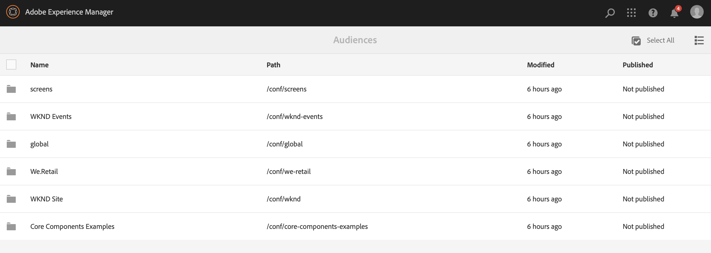

# Het vormen Segmentatie met ContextHub{#configuring-segmentation-with-contexthub}

>[!NOTE]
>
>Deze sectie beschrijft het vormen segmentatie wanneer het gebruiken van ContextHub. Als u de functionaliteit van de Context van de Cliënt gebruikt, zie de relevante documentatie voor [ vormend segmentatie voor de Context van de Cliënt ](/help/sites-administering/campaign-segmentation.md).
>

Segmentering is een belangrijke overweging bij het maken van een campagne. Zie [ het Leiden Soorten publiek ](/help/sites-authoring/managing-audiences.md) voor informatie over hoe de segmentatie en zeer belangrijke termijnen werkt.

Afhankelijk van de informatie die u reeds over uw plaatsbezoekers en de doelstellingen hebt verzameld u wilt bereiken, moet u de segmenten en de strategieën bepalen nodig voor uw gerichte inhoud.

Deze segmenten worden vervolgens gebruikt om een bezoeker specifieke inhoud te bieden. Deze inhoud wordt gehandhaafd in de [ Personalization ](/help/sites-authoring/personalization.md) sectie van de website. {de activiteiten van 0} die ](/help/sites-authoring/activitylib.md) hier worden bepaald kunnen op om het even welke pagina worden omvat en bepalen welk bezoekerssegment de gespecialiseerde inhoud van toepassing is.[

Met AEM kunt u de gebruikerservaring eenvoudig aanpassen. Het laat u ook de resultaten van uw segmentdefinities verifiëren.

## Segmenten openen {#accessing-segments}

De ](/help/sites-authoring/managing-audiences.md) console van 0} Soorten publiek {wordt gebruikt om segmenten voor ContextHub of de Context en het publiek van de Cliënt voor uw rekening van Adobe Target te beheren. [ Deze documentatie behandelt het beheren van segmenten voor ContextHub. Voor [ segmenten van de Context van de Cliënt ](/help/sites-administering/campaign-segmentation.md) en de segmenten van Adobe Target, zie de relevante documentatie.

Om tot uw segmenten toegang te hebben moet u uw configuratie selecteren. In globale navigatie selecteert **Navigatie > Personalization > Soorten publiek**. De beschikbare configuraties worden weergegeven:



Selecteer uw configuratie om de segmenten, bijvoorbeeld, Plaats WKND te zien:


## Segment-editor {#segment-editor}

De **Redacteur van het Segment** laat u gemakkelijk een segment wijzigen. Om een segment uit te geven, selecteer een segment in de [ lijst van segmenten ](/help/sites-administering/segmentation.md#accessing-segments) en klik **uitgeven** knoop.


Gebruikend de componentenbrowser kunt u **EN** en **OF** containers toevoegen om de segmentlogica te bepalen, dan extra componenten toevoegen om eigenschappen en waarden of verwijzingsmanuscripten en andere segmenten te vergelijken om de selectiecriteria (zie [ Creërend een Nieuw Segment ](#creating-a-new-segment)) te bepalen om het nauwkeurige scenario voor het selecteren van het segment te bepalen.

Wanneer de volledige verklaring aan waar evalueert dan heeft het segment opgelost. Als er veelvoudige toepasselijke segmenten zijn, dan wordt de **1} factor van de Verhoging {ook gebruikt.** Zie [ Creërend een Nieuw Segment ](#creating-a-new-segment) voor details op [ hefboomfactor.](/help/sites-administering/campaign-segmentation.md#boost-factor)

>[!CAUTION]
>
>De segmentredacteur controleert geen cirkelverwijzingen. Bijvoorbeeld, verwijst segment A naar een ander segment B, dat op zijn beurt weer naar segment A verwijst. Zorg ervoor dat uw segmenten geen cirkelverwijzingen bevatten.

### Containers {#containers}

De volgende containers zijn beschikbaar uit-van-de-doos en laten u vergelijkingen en verwijzingen samen groeperen voor booleaanse evaluatie. U kunt deze vanuit de componentbrowser naar de editor slepen. Zie de volgende sectie [ Gebruikend EN EN OF Containers ](/help/sites-administering/segmentation.md#using-and-and-or-containers) voor meer informatie.

<table>
 <tbody>
  <tr>
   <td>Container EN <br /> </td>
   <td>De booleaanse operator AND <br /> </td>
  </tr>
  <tr>
   <td>Container OR<br /> </td>
   <td>De operator Boolean OR</td>
  </tr>
 </tbody>
</table>

### Vergelijkingen {#comparisons}

De volgende segmentvergelijkingen zijn beschikbaar uit-van-de-doos om segmenteigenschappen te evalueren. U kunt deze vanuit de componentbrowser naar de editor slepen.

<table>
 <tbody>
  <tr>
   <td>Property-Value <br /> </td>
   <td>Vergelijkt een bezit van een opslag aan een bepaalde waarde <br /> </td>
  </tr>
  <tr>
   <td>Eigenschap</td>
   <td>Vergelijkt één bezit van een opslag aan een ander bezit <br /> </td>
  </tr>
  <tr>
   <td>Eigenschap-segmentverwijzing</td>
   <td>Vergelijkt een bezit van een opslag aan een ander referenced segment <br /> </td>
  </tr>
  <tr>
   <td>Eigenschapverwijzing</td>
   <td>Vergelijkt een bezit van een opslag aan de resultaten van een manuscript <br /> </td>
  </tr>
  <tr>
   <td>Referentie-script voor segment</td>
   <td>Vergelijkt een referenced segment aan de resultaten van een manuscript <br /> </td>
  </tr>
 </tbody>
</table>

>[!NOTE]
>
>Wanneer het vergelijken van waarden, als het gegevenstype van de vergelijking niet wordt geplaatst (d.w.z. wordt geplaatst om auto te ontdekken), zal de de segmenteringsmotor van ContextHub eenvoudig de waarden zoals javascript vergelijken. Er worden geen waarden naar de verwachte typen gecast, wat tot misleidende resultaten kan leiden. Bijvoorbeeld:
>
>`null < 30 // will return true`
>
>Daarom wanneer [ creërend een segment ](/help/sites-administering/segmentation.md#creating-a-new-segment), zou u a **gegevenstype** moeten selecteren wanneer de types van vergeleken waarden gekend zijn. Bijvoorbeeld:
>
>Wanneer het vergelijken van het bezit `profile/age`, weet u reeds dat het vergeleken type **aantal** zal zijn, zodat zelfs als `profile/age` niet wordt geplaatst, zal een vergelijking `profile/age` minder-dan 30 **vals** terugkeren, aangezien u zou verwachten.

### Verwijzingen {#references}

De volgende verwijzingen zijn beschikbaar uit-van-de-doos om rechtstreeks met een manuscript of een ander segment te verbinden. U kunt deze vanuit de componentbrowser naar de editor slepen.

<table>
 <tbody>
  <tr>
   <td>Segmentverwijzing <br /> </td>
   <td>Evalueer het referenced segment</td>
  </tr>
  <tr>
   <td>Scriptreferentie</td>
   <td>Evalueer het referenced manuscript. Zie de volgende sectie <a href="/help/sites-administering/segmentation.md#using-script-references"> Gebruikend de Verwijzingen van het Manuscript </a> voor meer informatie.</td>
  </tr>
 </tbody>
</table>

## Een nieuw segment maken {#creating-a-new-segment}

Het nieuwe segment definiëren:

1. Na [ toegang hebbend tot de segmenten ](/help/sites-administering/segmentation.md#accessing-segments), [ navigeer aan de omslag ](#organizing-segments) waar u het segment zou willen tot stand brengen.

1. Klik de Create knoop en selecteer **creëren Segment ContextHub**.

   

1. In het **Nieuwe Segment ContextHub**, ga een titel voor het segment en een verhogingswaarde indien nodig in en klik dan **creeer**.

   

   Elk segment heeft een verhogingsparameter die als weegfactor wordt gebruikt. Een hoger getal geeft aan dat het segment bij voorkeur wordt geselecteerd boven een segment met een lager getal in gevallen waarin meerdere segmenten geldig zijn.

   * Minimumwaarde: `0`
   * Maximumwaarde: `1000000`

1. Sleep een vergelijking of een verwijzing naar de segmentredacteur het in het gebrek EN container zal verschijnen.
1. Dubbelklik op de optie voor het configureren van de nieuwe verwijzing of het nieuwe segment om de specifieke parameters te bewerken. In dit voorbeeld testen we op mensen in San Jose.

   

   Plaats altijd het Type van Gegevens van a **** indien mogelijk om ervoor te zorgen dat uw vergelijkingen behoorlijk worden geëvalueerd. Zie [ Vergelijkingen ](/help/sites-administering/segmentation.md#comparisons) voor meer informatie.

1. Klik **O.K.** om uw definitie te bewaren:
1. Voeg desgewenst meer componenten toe. U kunt booleaanse uitdrukkingen formuleren gebruikend de containercomponenten voor EN en OF vergelijkingen (zie [ Gebruikend EN en of Containers ](/help/sites-administering/segmentation.md#using-and-and-or-containers) hieronder). Met de segmentredacteur kunt u componenten schrappen niet meer nodig, of hen slepen aan nieuwe posities binnen de verklaring.

### AND en OR-containers gebruiken {#using-and-and-or-containers}

Gebruikend EN en OF containercomponenten, kunt u complexe segmenten in AEM construeren. Hierbij is het nuttig om u bewust te maken van een aantal basispunten:

* Het hoogste niveau van de definitie is altijd de EN container die aanvankelijk wordt gecreeerd. Dit kan niet worden veranderd, maar heeft geen effect op de rest van uw segmentdefinitie.
* Zorg ervoor dat het nesten van de container zinvol is. De containers kunnen als steunen van uw booleaanse uitdrukking worden bekeken.

Het volgende voorbeeld wordt gebruikt om bezoekers te selecteren die in onze primaire leeftijdsgroep worden overwogen:

Mannelijk en tussen 30 en 59 jaar

OF

Vrouwen tussen 30 en 59 jaar

U begint door een OF containercomponent binnen het gebrek EN container te plaatsen. Binnen de container OR, kunt u twee EN containers en binnen allebei toevoegen u het bezit of de verwijzingscomponenten.


### Scriptverwijzingen gebruiken {#using-script-references}

Door de component van de Verwijzing van het Manuscript te gebruiken, kan de evaluatie van een segmentbezit aan een extern manuscript worden afgevaardigd. Zodra het manuscript behoorlijk wordt gevormd, kan het als een andere component van een segmentvoorwaarde worden gebruikt.

#### Een script definiëren naar verwijzing {#defining-a-script-to-reference}

1. Voeg bestand toe aan `contexthub.segment-engine.scripts` clientlib.
1. Voer een functie uit die een waarde terugkeert. Bijvoorbeeld:

   ```
   ContextHub.console.log(ContextHub.Shared.timestamp(), '[loading] contexthub.segment-engine.scripts - script.profile-info.js');
   
   (function() {
       'use strict';
   
       /**
        * Sample script returning profile information. Returns user info if data is available, false otherwise.
        *
        * @returns {Boolean}
        */
       var getProfileInfo = function() {
           /* let the SegmentEngine know when script should be re-run */
           this.dependOn(ContextHub.SegmentEngine.Property('profile/age'));
           this.dependOn(ContextHub.SegmentEngine.Property('profile/givenName'));
   
           /* variables */
           var name = ContextHub.get('profile/givenName');
           var age = ContextHub.get('profile/age');
   
           return name === 'Joe' && age === 123;
       };
   
       /* register function */
       ContextHub.SegmentEngine.ScriptManager.register('getProfileInfo', getProfileInfo);
   
   })();
   ```

1. Registreer het script bij `ContextHub.SegmentEngine.ScriptManager.register` .

Als het script afhankelijk is van aanvullende eigenschappen, moet het script `this.dependOn()` aanroepen. Als het script bijvoorbeeld afhankelijk is van `profile/age` :

```
this.dependOn(ContextHub.SegmentEngine.Property('profile/age'));
```

#### Naar een script verwijzen {#referencing-a-script}

1. Creeer segment ContextHub.
1. Voeg **component van de Verwijzing van 0} Manuscript {in de gewenste plaats van het segment toe.**
1. Open uitgeven dialoog van de **component van de Verwijzing van het Manuscript**. Als [ behoorlijk gevormd ](/help/sites-administering/segmentation.md#defining-a-script-to-reference), het manuscript in de **naam van het Manuscript** drop-down zou moeten beschikbaar zijn.

## Segmenten ordenen {#organizing-segments}

Als u veel segmenten hebt, kunnen deze moeilijk te beheren worden als een platte lijst. In dergelijke gevallen kan het handig zijn om mappen te maken voor het beheer van uw segmenten.

### Een nieuwe map maken {#create-folder}

1. Na [ toegang hebbend tot de segmenten ](#accessing-segments), klik **creeer** knoop en selecteer **Omslag**.

    toe

1. Verstrek a **Titel** en a **Naam** voor uw omslag.
   * De **Titel** zou beschrijvend moeten zijn.
   * De **Naam** zal de knoopnaam in de bewaarplaats worden.
      * Het zal automatisch worden geproduceerd gebaseerd op de titel en aangepast volgens [ AEM noemende overeenkomsten.](/help/sites-developing/naming-conventions.md)
      * Deze kan zo nodig worden aangepast.

   

1. Klik **creëren**.

   

1. De map wordt weergegeven in de lijst met segmenten.
   * Hoe u de kolommen sorteert, is van invloed op de plaats in de lijst waar de nieuwe map verschijnt.
   * U kunt op de kolomkoppen klikken om de sortering aan te passen.
     

### Bestaande mappen wijzigen {#modify-folders}

1. Na [ toegang hebbend tot de segmenten ](#accessing-segments), klik de omslag u wenst om het te selecteren.

   

1. Klik **anders noemen** in de toolbar om de omslag anders te noemen.

1. Verstrek een nieuwe **Titel van de Omslag** en klik **sparen**.

   

>[!NOTE]
>
>Bij het wijzigen van de mapnaam kan alleen de titel worden gewijzigd. De naam kan niet worden gewijzigd.

### Een map verwijderen

1. Na [ toegang hebbend tot de segmenten ](#accessing-segments), klik de omslag u wenst om het te selecteren.

   

1. Klik **Schrapping** in de toolbar om de omslag te schrappen.

1. Een dialoogvenster bevat een lijst met mappen die zijn geselecteerd om te worden verwijderd.

   

   * Klik **Schrapping** om te bevestigen.
   * Klik **annuleren** om af te breken.

1. Als een van de geselecteerde mappen submappen of segmenten bevat, moet de verwijdering ervan worden bevestigd.

   

   * Klik **Drijf Schrapping** om te bevestigen.
   * Klik **annuleren** om af te breken.

>[!NOTE]
>
>Het is niet mogelijk een segment van de ene map naar de andere te verplaatsen.

## De toepassing van een segment testen {#testing-the-application-of-a-segment}

Zodra het segment is bepaald, kunnen de potentiële resultaten met de hulp van **[ContextHub ](/help/sites-authoring/ch-previewing.md) worden getest.**

1. Een voorvertoning van een pagina weergeven
1. Klik het pictogram ContextHub om de toolbar te openbaren ContextHub
1. Selecteer een persoon die overeenkomt met het segment dat u hebt gemaakt
1. ContextHub zal de toepasselijke segmenten voor de geselecteerde persoon oplossen

Bijvoorbeeld, is onze eenvoudige segmentdefinitie om gebruikers in onze primaire leeftijdsgroep te identificeren een eenvoudige segmentdefinitie gebaseerd op de leeftijd en het geslacht van de gebruiker. Als u een specifieke persoon laadt die overeenkomt met die criteria, wordt getoond of het segment is opgelost:


Of indien deze niet is opgelost:


>[!NOTE]
>
>Alle kenmerken worden onmiddellijk opgelost, maar de meeste wijzigingen worden alleen toegepast wanneer de pagina opnieuw wordt geladen.

Dergelijke tests kunnen ook op inhoudspagina&#39;s en in combinatie met gerichte inhoud en verwante **Activiteiten** en **Ervaringen** worden uitgevoerd.

Als u opstelling een activiteit en ervaring het gebruiken van het hierboven voorbeeld van het groepssegment van de eerste pagina hebt, kunt u uw segment met de activiteit gemakkelijk testen. Voor details over vestiging ziet een activiteit, de verwante [ documentatie bij het ontwerpen van gerichte inhoud ](/help/sites-authoring/content-targeting-touch.md).

1. In de bewerkingsmodus van een pagina waarop u doelinhoud hebt ingesteld, ziet u dat de inhoud als doel is ingesteld via het pijlpictogram op de inhoud.

   

1. De schakelaar aan voorproefwijze en het gebruiken van de contexthub, schakelaar aan een persoon die niet de segmentatie aanpast die voor de ervaring wordt gevormd.

   

1. De schakelaar aan een persoon die de segmentatie aanpast die voor de ervaring wordt gevormd en ziet dat de ervaring dienovereenkomstig verandert.

   

## Uw segment gebruiken {#using-your-segment}

De segmenten worden gebruikt om de daadwerkelijke inhoud te sturen die door specifiek doelpubliek wordt gezien. Zie [ het Leiden Soorten publiek ](/help/sites-authoring/managing-audiences.md) voor meer informatie over publiek en segmenten en [ het Authoring van Gerichte Inhoud ](/help/sites-authoring/content-targeting-touch.md) over het gebruiken van publiek en segmenten aan doelinhoud.
