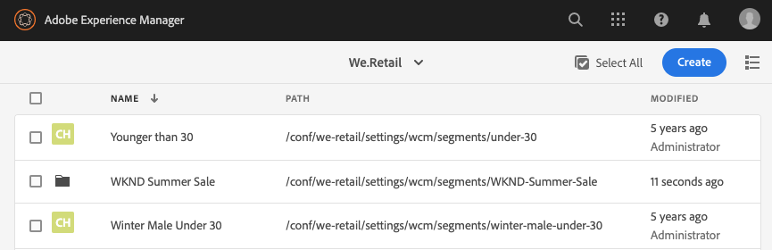
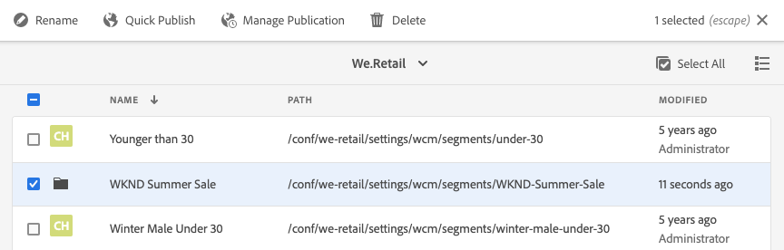

# Het vormen Segmentatie met ContextHub{#configuring-segmentation-with-contexthub}

>[!NOTE]
>
>Deze sectie beschrijft het vormen segmentatie wanneer het gebruiken van ContextHub. Als u de functionaliteit van de Context van de Cliënt gebruikt, te zien gelieve de relevante documentatie voor [het vormen segmentatie voor de Context](/help/sites-administering/campaign-segmentation.md) van de Cliënt.


Segmentering is een belangrijke overweging bij het maken van een campagne. Zie [Soorten publiek beheren](/help/sites-authoring/managing-audiences.md) voor informatie over hoe segmentatie werkt en sleuteltermen.

Afhankelijk van de informatie die u reeds over uw plaatsbezoekers en de doelstellingen hebt verzameld u wilt bereiken, zult u de segmenten en de strategieën nodig voor uw gerichte inhoud moeten bepalen.

Deze segmenten worden vervolgens gebruikt om een bezoeker specifieke inhoud te bieden. Deze inhoud wordt bijgehouden in het gedeelte [Persoonlijke instellingen](/help/sites-authoring/personalization.md) van de website. [De hier gedefinieerde ](/help/sites-authoring/activitylib.md) activiteiten kunnen op elke pagina worden opgenomen en definiëren voor welk bezoekerssegment de gespecialiseerde inhoud van toepassing is.

AEM kunt u de gebruikerservaring eenvoudig aanpassen. Het staat u ook toe om de resultaten van uw segmentdefinities te verifiëren.

## Segmenten {#accessing-segments} openen

De console [Soorten publiek](/help/sites-authoring/managing-audiences.md) wordt gebruikt om segmenten voor ContextHub of de Context van de Cliënt evenals publiek voor uw rekening van Adobe Target te beheren. Deze documentatie behandelt het beheren van segmenten voor ContextHub. Voor [Clientcontextsegmenten](/help/sites-administering/campaign-segmentation.md) en Adobe Target-segmenten raadpleegt u de relevante documentatie.

Als u toegang wilt krijgen tot uw segmenten, selecteert u **Navigatie > Aanpassing aan persoonlijke voorkeur > Soorten publiek**.


## Segmenteditor {#segment-editor}

Met de **Segmenteditor** kunt u een segment gemakkelijk wijzigen. Als u een segment wilt bewerken, selecteert u een segment in de [lijst met segmenten](/help/sites-administering/segmentation.md#accessing-segments) en klikt u op de knop **Bewerken**.


Met behulp van de componentenbrowser kunt u **AND** en **OF** containers toevoegen om de segmentlogica te bepalen, dan extra componenten toevoegen om eigenschappen en waarden of verwijzingsmanuscripten en andere segmenten te vergelijken om de selectiecriteria (zie [Creërend een Nieuw Segment ](#creating-a-new-segment)) te bepalen om het nauwkeurige scenario voor het selecteren van het segment te bepalen.

Wanneer de volledige verklaring aan waar evalueert dan heeft het segment opgelost. Als meerdere segmenten van toepassing zijn, wordt ook de **Boost**-factor gebruikt. Zie [Een nieuw segment maken](#creating-a-new-segment) voor meer informatie over de [versterkingsfactor.](/help/sites-administering/campaign-segmentation.md#boost-factor)

>[!CAUTION]
>
>De segmentredacteur controleert geen cirkelverwijzingen. Zo verwijst segment A bijvoorbeeld naar een ander segment B, dat op zijn beurt weer naar segment A verwijst. U moet ervoor zorgen dat de segmenten geen cirkelverwijzingen bevatten.

### Containers {#containers}

De volgende containers zijn beschikbaar uit-van-de-doos en staan u toe om vergelijkingen en verwijzingen samen te groeperen voor booleaanse evaluatie. U kunt deze vanuit de componentbrowser naar de editor slepen. Zie de volgende sectie [Using AND and OR Containers](/help/sites-administering/segmentation.md#using-and-and-or-containers) voor meer informatie.

<table>
 <tbody>
  <tr>
   <td>Container EN<br /> </td>
   <td>De Booleaanse operator AND<br /> </td>
  </tr>
  <tr>
   <td>Container OF<br /> </td>
   <td>De operator Boolean OR</td>
  </tr>
 </tbody>
</table>

### Vergelijkingen {#comparisons}

De volgende segmentvergelijkingen zijn beschikbaar uit-van-de-doos om segmenteigenschappen te evalueren. U kunt deze vanuit de componentbrowser naar de editor slepen.

<table>
 <tbody>
  <tr>
   <td>Property-Value<br /> </td>
   <td>Vergelijkt een bezit van een opslag aan een bepaalde waarde<br /> </td>
  </tr>
  <tr>
   <td>Eigenschap-eigenschap</td>
   <td>Vergelijkt één bezit van een opslag aan een ander bezit<br /> </td>
  </tr>
  <tr>
   <td>Eigenschap-segmentverwijzing</td>
   <td>Vergelijkt een bezit van een opslag aan een ander referenced segment<br /> </td>
  </tr>
  <tr>
   <td>Eigenschapverwijzing</td>
   <td>Vergelijkt een bezit van een opslag aan de resultaten van een manuscript<br /> </td>
  </tr>
  <tr>
   <td>Referentie-script voor segment</td>
   <td>Vergelijkt een referenced segment aan de resultaten van een manuscript<br /> </td>
  </tr>
 </tbody>
</table>

>[!NOTE]
>
>Wanneer het vergelijken van waarden, als het gegevenstype van de vergelijking niet (d.w.z. wordt geplaatst om auto te ontdekken) wordt geplaatst, zal de segmenteringsmotor van ContextHub eenvoudig de waarden zoals javascript vergelijken. Er worden geen waarden naar de verwachte typen gecast, wat tot misleidende resultaten kan leiden. Bijvoorbeeld:
>
>`null < 30 // will return true`
>
>Daarom wanneer [creërend een segment](/help/sites-administering/segmentation.md#creating-a-new-segment), zou u **gegevenstype** moeten selecteren wanneer de types van vergeleken waarden gekend zijn. Bijvoorbeeld:
>
>Wanneer u de eigenschap `profile/age` vergelijkt, weet u al dat het vergeleken type **number** zal zijn, dus zelfs als `profile/age` niet is ingesteld, zal een vergelijking `profile/age` minder-dan 30 **false** terugkeren, zoals u zou verwachten.

### Verwijzingen {#references}

De volgende verwijzingen zijn beschikbaar uit-van-de-doos om rechtstreeks met een manuscript of een ander segment te verbinden. U kunt deze vanuit de componentbrowser naar de editor slepen.

<table>
 <tbody>
  <tr>
   <td>Segmentverwijzing<br /> </td>
   <td>Evalueer het referenced segment</td>
  </tr>
  <tr>
   <td>Scriptreferentie</td>
   <td>Evalueer het referenced manuscript. Zie de volgende sectie <a href="/help/sites-administering/segmentation.md#using-script-references">Scriptverwijzingen gebruiken</a> voor meer informatie.</td>
  </tr>
 </tbody>
</table>

## Een nieuw segment maken {#creating-a-new-segment}

Het nieuwe segment definiëren:

1. Na [het toegang hebben tot van de segmenten](/help/sites-administering/segmentation.md#accessing-segments), [navigeer aan de omslag](#organizing-segments) waar u het segment zou willen tot stand brengen, of het in de wortel verlaten.

1. Klik of tik de Create knoop en selecteer **Create ContextHub Segment**.

   

1. In **Nieuw Segment ContextHub**, ga een titel voor het segment evenals een verhogingswaarde indien nodig in en tik of klik dan **Create**.

   

   Elk segment heeft een verhogingsparameter die als weegfactor wordt gebruikt. Een hoger getal geeft aan dat het segment bij voorkeur wordt geselecteerd boven een segment met een lager getal in gevallen waarin meerdere segmenten geldig zijn.

   * Minimumwaarde: `0`
   * Maximumwaarde: `1000000`

1. Sleep een vergelijking of een verwijzing naar de segmentredacteur het in het gebrek EN container zal verschijnen.
1. Dubbelklik op of tik op de configureoptie van de nieuwe verwijzing of het nieuwe segment om de specifieke parameters te bewerken. In dit voorbeeld testen we op mensen in San Jose.

   

   Stel indien mogelijk altijd een **Gegevenstype** in om ervoor te zorgen dat uw vergelijkingen correct worden geëvalueerd. Zie [Vergelijkingen](/help/sites-administering/segmentation.md#comparisons) voor meer informatie.

1. Klik **OK** om uw definitie op te slaan:
1. Voeg desgewenst meer componenten toe. U kunt booleaanse expressies formuleren met behulp van de containercomponenten voor AND en OR vergelijkingen (zie [Using AND and Or Containers](/help/sites-administering/segmentation.md#using-and-and-or-containers) hieronder). Met de segmentredacteur kunt u componenten schrappen niet meer nodig, of hen slepen aan nieuwe posities binnen de verklaring.

### AND en OR containers {#using-and-and-or-containers} gebruiken

Gebruikend EN en OF containercomponenten, kunt u complexe segmenten in AEM construeren. Hierbij is het nuttig om op een aantal basispunten te letten:

* Het hoogste niveau van de definitie is altijd de EN container die aanvankelijk wordt gecreeerd. Dit kan niet worden veranderd, maar heeft geen effect op de rest van uw segmentdefinitie.
* Zorg ervoor dat het nesten van de container zinvol is. De containers kunnen als steunen van uw booleaanse uitdrukking worden bekeken.

Het volgende voorbeeld wordt gebruikt om bezoekers te selecteren die in onze leeftijdsgroep worden overwogen:

Mannelijk en tussen 30 en 59 jaar

OF

Vrouwen tussen 30 en 59 jaar

U begint door een OF containercomponent binnen het gebrek EN container te plaatsen. Binnen de container OR, kunt u twee EN containers en binnen allebei toevoegen u het bezit of de verwijzingscomponenten.


### Scriptverwijzingen gebruiken {#using-script-references}

Door de component van de Verwijzing van het Manuscript te gebruiken, kan de evaluatie van een segmentbezit aan een extern manuscript worden afgevaardigd. Zodra het manuscript behoorlijk wordt gevormd, kan het als een andere component van een segmentvoorwaarde worden gebruikt.

#### Een script definiëren naar verwijzing {#defining-a-script-to-reference}

1. Voeg bestand toe aan clientlib `contexthub.segment-engine.scripts`.
1. Voer een functie uit die een waarde terugkeert. Bijvoorbeeld:

   ```
   ContextHub.console.log(ContextHub.Shared.timestamp(), '[loading] contexthub.segment-engine.scripts - script.profile-info.js');
   
   (function() {
       'use strict';
   
       /**
        * Sample script returning profile information. Returns user info if data is available, false otherwise.
        *
        * @returns {Boolean}
        */
       var getProfileInfo = function() {
           /* let the SegmentEngine know when script should be re-run */
           this.dependOn(ContextHub.SegmentEngine.Property('profile/age'));
           this.dependOn(ContextHub.SegmentEngine.Property('profile/givenName'));
   
           /* variables */
           var name = ContextHub.get('profile/givenName');
           var age = ContextHub.get('profile/age');
   
           return name === 'Joe' && age === 123;
       };
   
       /* register function */
       ContextHub.SegmentEngine.ScriptManager.register('getProfileInfo', getProfileInfo);
   
   })();
   ```

1. Registreer het script met `ContextHub.SegmentEngine.ScriptManager.register`.

Als het manuscript van extra eigenschappen afhangt, zou het manuscript `this.dependOn()` moeten roepen. Als het script bijvoorbeeld afhankelijk is van `profile/age`:

```
this.dependOn(ContextHub.SegmentEngine.Property('profile/age'));
```

#### Naar een script {#referencing-a-script} verwijzen

1. Maak een ContextHub-segment.
1. Voeg **Script Reference** toe component in de gewenste plaats van het segment.
1. Open het bewerkingsdialoogvenster van de **Scriptreferentie**-component. Als [correct gevormd](/help/sites-administering/segmentation.md#defining-a-script-to-reference), zou het manuscript in **de drop-down** manuscriptnaam moeten beschikbaar zijn.

## Segmenten {#organizing-segments} ordenen

Als u veel segmenten hebt, kunnen deze moeilijk te beheren worden als een platte lijst. In dergelijke gevallen kan het handig zijn om mappen te maken voor het beheer van uw segmenten.

### Nieuwe map maken {#create-folder}

1. Nadat u [de segmenten hebt geopend](#accessing-segments), klikt of tikt u op de knop **Maken** en selecteert u **Map**.

   

1. Geef een **Titel** en een **Naam** op voor uw map.
   * De **Titel** zou beschrijvend moeten zijn.
   * De **Naam** wordt de knooppuntnaam in de repository.
      * Deze wordt automatisch gegenereerd op basis van de titel en aangepast volgens de naamconventies [AEM.](/help/sites-developing/naming-conventions.md)
      * Deze kan zo nodig worden aangepast.

   

1. Tik of klik op **Maken**.

   

1. De map wordt weergegeven in de lijst met segmenten.
   * Hoe u de kolommen sorteert, is van invloed op de plaats in de lijst waar de nieuwe map wordt weergegeven.
   * Tik of klik op de kolomkoppen om de sortering aan te passen.
      

### Bestaande mappen wijzigen {#modify-folders}

1. Nadat u [de segmenten hebt geopend](#accessing-segments), klikt of tikt u op de map die u wilt wijzigen om deze te selecteren.

   

1. Tik of klik op **Naam wijzigen** in de werkbalk om de naam van de map te wijzigen.

1. Geef een nieuwe **Maptitel** op en tik of klik op **Opslaan**.

   

>[!NOTE]
>
>Bij het wijzigen van de mapnaam kan alleen de titel worden gewijzigd. De naam kan niet worden gewijzigd.

### Een map verwijderen

1. Nadat u [de segmenten hebt geopend](#accessing-segments), klikt of tikt u op de map die u wilt wijzigen om deze te selecteren.

   

1. Tik of klik op **Delete** in de werkbalk om de map te verwijderen.

1. Een dialoogvenster bevat een lijst met mappen die zijn geselecteerd om te worden verwijderd.

   

   * Tik of klik op **Verwijderen** om te bevestigen.
   * Tik of klik op **Annuleren** om af te breken.

1. Als een van de geselecteerde mappen submappen of segmenten bevat, moet de verwijdering ervan worden bevestigd.

   

   * Tik of klik **Verwijder** forceren om te bevestigen.
   * Tik of klik op **Annuleren** om af te breken.

>[!NOTE]
>
> Het is niet mogelijk een segment van de ene map naar de andere te verplaatsen.

## De toepassing van een segment testen {#testing-the-application-of-a-segment}

Zodra het segment is bepaald, kunnen de potentiële resultaten met de hulp van **[ContextHub](/help/sites-authoring/ch-previewing.md) worden getest.**

1. Een voorvertoning van een pagina weergeven
1. Klik het pictogram ContextHub om de toolbar te openbaren ContextHub
1. Selecteer een persoon die overeenkomt met het segment dat u hebt gemaakt
1. ContextHub zal de toepasselijke segmenten voor de geselecteerde persoon oplossen

Bijvoorbeeld, is onze eenvoudige segmentdefinitie om gebruikers in onze primaire leeftijdsgroep te identificeren een eenvoudige segmentdefinitie gebaseerd op de leeftijd en het geslacht van de gebruiker. Als u een specifieke persoon laadt die overeenkomt met die criteria, wordt getoond of het segment is opgelost:


Of indien deze niet is opgelost:


>[!NOTE]
>
>Alle kenmerken worden onmiddellijk opgelost, maar de meeste wijzigingen worden alleen toegepast wanneer de pagina opnieuw wordt geladen.

Dergelijke tests kunnen ook worden uitgevoerd op inhoudspagina&#39;s en in combinatie met gerichte inhoud en verwante **Activiteiten** en **Ervaringen**.

Als u opstelling een activiteit en ervaring het gebruiken van het hierboven voorbeeld van het groepssegment van de eerste pagina hebt, kunt u uw segment met de activiteit gemakkelijk testen. Zie de verwante [documentatie over het ontwerpen van doelinhoud](/help/sites-authoring/content-targeting-touch.md) voor meer informatie over het instellen van een activiteit.

1. In de bewerkingsmodus van een pagina waarop u doelinhoud hebt ingesteld, ziet u dat de inhoud als doel is ingesteld via het pijlpictogram op de inhoud.

   

1. De schakelaar aan voorproefwijze en het gebruiken van de contexthub, schakelaar aan een persoon die niet de segmentatie aanpast die voor de ervaring wordt gevormd.

   

1. De schakelaar aan een persoon die de segmentatie aanpast die voor de ervaring wordt gevormd en ziet dat de ervaring dienovereenkomstig verandert.

   

## Uw segment gebruiken {#using-your-segment}

De segmenten worden gebruikt om de daadwerkelijke inhoud te sturen die door specifiek doelpubliek wordt gezien. Zie [Soorten publiek beheren](/help/sites-authoring/managing-audiences.md) voor meer informatie over soorten publiek en segmenten en [Doelinhoud ontwerpen](/help/sites-authoring/content-targeting-touch.md) over het gebruik van soorten publiek en segmenten om inhoud te bepalen.
