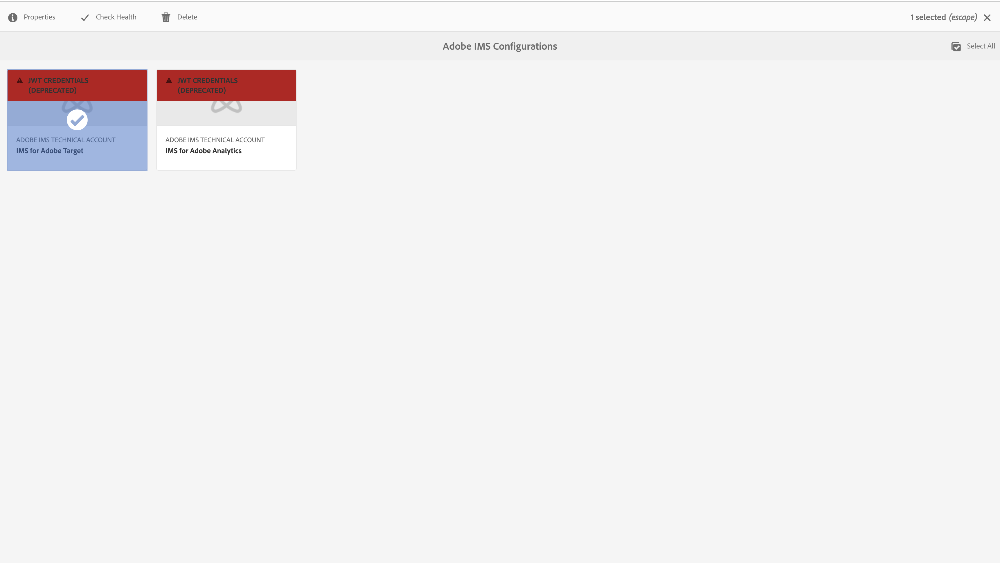

# IMS-integratie instellen voor AEM {#setting-up-ims-integrations-for-aem}

>[!NOTE]
>
>De klanten van Adobe gebruiken [&#x200B; Adobe Developer Console &#x200B;](https://developer.adobe.com/console) om geloofsbrieven te produceren die toegang tot diverse APIs toelaten. Klanten kiezen uit verschillende soorten referentie, variërend van OAuth Server-to-Server tot Single-Page App. Het referentietype van de Rekening van de Dienst (JWT) is nu verouderd ten gunste van de geloofsbrieven van de Server-aan-Server OAuth met Service Pack 20. Deze verandering kan aan oudere Packs van de Dienst, die met Service Pack 11 tot Service Pack 20 met het gebruik van een hotfix worden teruggestuurd die u [&#x200B; kunt downloaden &#x200B;](https://experience.adobe.com/#/downloads/content/software-distribution/en/aem.html?package=/content/software-distribution/en/details.html/content/dam/aem/public/adobe/packages/cq650/hotfix/ims-jwt-compatibility-package-6.5-1.0.zip).

Adobe Experience Manager (AEM) kan met vele andere oplossingen van Adobe worden geïntegreerd. Bijvoorbeeld Adobe Target, Adobe Analytics en andere.

De integratie gebruikt een integratie IMS, die met S2S OAuth wordt gevormd.

* Nadat u hebt gemaakt:

   * [&#x200B; Geloofsbrieven in Developer Console &#x200B;](#credentials-in-the-developer-console)

* Dan kunt u:

   * Creeer a (nieuw) [&#x200B; configuratie OAuth &#x200B;](#creating-oauth-configuration)

   * [Een bestaande JWT-configuratie migreren naar een OAuth-configuratie](#migrating-existing-JWT-configuration-to-oauth)

>[!CAUTION]
>
>Eerder, werden de configuraties gemaakt met [&#x200B; Credentials JWT die nu onderworpen aan afschrijving in Adobe Developer Console &#x200B;](/help/sites-administering/jwt-credentials-deprecation-in-adobe-developer-console.md) zijn.
>
>Dergelijke configuraties kunnen niet meer worden gemaakt of bijgewerkt, maar kunnen worden gemigreerd naar OAuth-configuraties.

## Referenties in de Developer Console {#credentials-in-the-developer-console}

Als eerste stap, moet u de geloofsbrieven OAuth in Adobe Developer Console vormen.

Raadpleeg de documentatie bij Developer Console voor meer informatie over het uitvoeren van deze configuratie, afhankelijk van uw vereisten:

* Overzicht:

   * [&#x200B; Server aan de authentificatie van de Server &#x200B;](https://developer.adobe.com/developer-console/docs/guides/authentication/ServerToServerAuthentication/)

* Een nieuwe OAuth-referentie maken:

   * [&#x200B; OAuth Server-aan-Server de gids van de credentieimplementatie &#x200B;](https://developer.adobe.com/developer-console/docs/guides/authentication/ServerToServerAuthentication/implementation)

* Een bestaande JWT-referentie migreren naar een OAuth-referentie:

   * [&#x200B; migrerend van de Rekening van de Dienst (JWT) credential aan OAuth Server-aan-Server credential &#x200B;](https://developer.adobe.com/developer-console/docs/guides/authentication/ServerToServerAuthentication/migration)

Bijvoorbeeld:

## Een OAuth-configuratie maken {#creating-oauth-configuration}

Een nieuwe Adobe IMS-integratie maken met OAuth:

1. In AEM, navigeer aan **Hulpmiddelen**, **Veiligheid**, **Integratie van Adobe IMS**.

1. Selecteer **creeer**.

1. Voltooi de configuratie die op details van [&#x200B; wordt gebaseerd Developer Console &#x200B;](https://developer.adobe.com/developer-console/docs/guides/authentication/ServerToServerAuthentication/implementation). Bijvoorbeeld:

   

1. **sparen** uw veranderingen.

## Een bestaande JWT-configuratie migreren naar een OAuth-configuratie {#migrating-existing-JWT-configuration-to-oauth}

Een bestaande Adobe IMS-integratie migreren op basis van JWT-referenties:

>[!NOTE]
>
>Dit voorbeeld toont een Configuratie van IMS van de Lancering.

1. In AEM, navigeer aan **Hulpmiddelen**, **Veiligheid**, **Integratie van Adobe IMS**.

1. Selecteer de JWT-configuratie die moet worden gemigreerd. De configuraties JWT zijn duidelijk met de waarschuwing **(afgekeurde) Credentials JWT**.

1. Selecteer **Eigenschappen**:

   

1. De configuratie wordt als alleen-lezen geopend:

   

1. Selecteer **OAuth** van het **Type van Authentificatie** dropdown:

   

1. De beschikbare eigenschappen worden bijgewerkt. Voer de gegevens van de Developer Console in om deze in te vullen:

   

1. Gebruik **sparen &amp; sluit** om uw updates voort te zetten.
Wanneer u aan de console terugkeert, is de **(afgekeurde)** waarschuwing JWT.
