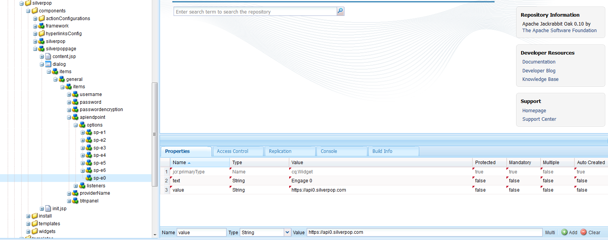

# Integreren met Silverpop Engage{#integrating-with-silverpop-engage}

<!-- THIS ENTIRE TOPIC APPEARS OBSOLETE BECAUSE SILVERPOP NO LONGER EXISTS AND THERE ARE NO REDIRECTS FOR THE DOWNLOAD URL BELOW THAT IS 404.
>[!NOTE]
>
>Silverpop integration is **not** available out of the box. Download the Silverpop integration package `https://www.adobeaemcloud.com/content/marketplace/marketplaceProxy.html?packagePath=/content/companies/public/adobe/packages/aem620/product/cq-mcm-integrations-silverpop-content` from Package Share and install it on your instance. After you have installed the package, you can configure it as described in this document. -->

Door AEM te integreren met Silverpop Engage kunt u e-mails die in AEM via Silverpop zijn gemaakt, beheren en verzenden. U kunt hiermee ook de beheerfuncties voor leads van Silverpop gebruiken via AEM formulieren op AEM pagina&#39;s.

De integratie biedt u de volgende functies:

* De mogelijkheid om e-mails te maken in AEM en deze te publiceren naar Silverpop voor distributie.
* De mogelijkheid om actie van een AEM formulier in te stellen om een Silverpop-abonnee te maken.

Nadat Silverpop Engage is geconfigureerd, kunt u nieuwsbrieven of e-mails publiceren naar Silverpop Engage.

## Een Silverpop-configuratie maken {#creating-a-silverpop-configuration}

Silverpop-configuraties kunnen worden toegevoegd door **Cloud Servicen**, **Gereedschappen**, of **API-eindpunten**. Alle methoden worden beschreven in deze sectie.

### Silverpop configureren met Cloud Servicen {#configuring-silverpop-via-cloudservices}

Een Silverpop-configuratie in Cloud Servicen maken:

1. Klik in AEM op **Gereedschappen** > **Implementatie** > **Cloud Servicen**. (Of rechtstreeks toegang tot `https://<hostname>:<port>/etc/cloudservices.html`.)
1. Klik onder services van derden op **Silverop Engage** en vervolgens **Configureren**. Het Silverpop-configuratievenster wordt geopend.

   >[!NOTE]
   >
   >Silverpop Engage is niet beschikbaar als optie onder services van derden, tenzij u het pakket downloadt van Package Share.

1. Voer een titel en eventueel een naam in en klik op **Maken**. Het** Silverpop Settings* configuratievenster wordt geopend.
1. Voer de gebruikersnaam en het wachtwoord in en selecteer een API-eindpunt in de vervolgkeuzelijst.
1. Klikken **Verbind met Silverpop.** Wanneer de verbinding tot stand is gebracht, wordt het dialoogvenster met succes weergegeven. Klikken **OK** dus sluit u het venster af. U kunt naar Silverpop gaan door op **Ga naar Silverpop Engage**.
1. Silverpop is geconfigureerd. U kunt de configuratie bewerken door op **Bewerken**.
1. Ook, kan het framework Silverpop Engage voor persoonlijke acties worden geconfigureerd door titel en naam (optioneel) te bieden. Klik op Maken om het framework voor de reeds geconfigureerde Silverpop-verbinding te maken.

   De ingevoerde kolommen van de gegevensuitbreiding kunnen later door de AEM worden gebruikt - **Tekst en personalisatie**.

### Silverpop configureren via gereedschappen {#configuring-silverpop-via-tools}

Een Silverpop-configuratie maken in de gereedschappen:

1. Klik in AEM op **Gereedschappen** > **Implementatie** > **Cloud Servicen**. Of navigeer daar rechtstreeks door naar `https://<hostname>:<port>/misadmin#/etc`.
1. Selecteren **Gereedschappen** vervolgens **configuraties van Cloud Servicen,** dan **Silverpop-engine**.
1. Klikken **Nieuw**.

   

1. In de **Pagina maken** venster, voert u de **Titel** en eventueel de **Naam** en klik op **Maken**.
1. Voer de configuratiegegevens in zoals beschreven in stap 4 van de vorige procedure. Volg die procedure zodat kunt u voltooien vormend Silverpop.

### Meerdere configuraties toevoegen {#adding-multiple-configurations}

Meerdere configuraties toevoegen:

1. Klik op de welkomstpagina op **Cloud Servicen** en klik op **Silverpop-engine**. Klikken **Configuraties tonen** die wordt weergegeven als een of meer Silverpop-configuraties beschikbaar zijn. Alle beschikbare configuraties worden vermeld.
1. Klik op de knop **+** ondertekenen naast Beschikbare configuraties. Het opent de **Configuraties maken** venster. Volg de vorige configuratieprocedure zodat kunt u een configuratie creëren.

### API-eindpunten configureren voor verbinding met Silverpop {#configuring-api-end-points-for-connecting-to-silverpop}

Op dit moment heeft AEM zes onbeveiligde eindpunten (Engage 1 - 6). Silverpop biedt nu twee nieuwe eindpunten en gewijzigde eindpunten van de verbinding voor de bestaande eindpunten.

De API-eindpunten configureren:

1. Ga naar `/libs/mcm/silverpop/components/silverpoppage/dialog/items/general/items/apiendpoint/options node` op `https://<hostname>:<port>/crxde.`
1. Klik met de rechtermuisknop en selecteer **Maken** vervolgens **Knooppunt maken**.
1. Voer de **Naam** als `sp-e0` en kiest u **Type** als `cq:Widget`.
1. Twee eigenschappen toevoegen aan het nieuwe knooppunt:

   1. **Naam**: `text`, **Type**: `String`, **Waarde**: `Engage 0`
   1. **Naam**: `value`, **Type**: `String`, **Waarde**: `https://api0.silverpop.com`

   

   Klik op Alles opslaan.

1. Maak nog een knooppunt met **Naam** als `sp-e7` en **Type** als `cq:Widget`.

   Twee eigenschappen toevoegen aan het nieuwe knooppunt:

   1. **Naam**: `text`, **Type**: `String`, **Waarde**: `Pilot`
   1. **Naam**: `value`, **Type**: `String`, **Waarde**: `https://apipilot.silverpop.com/XMLAPI`

1. Als u de bestaande API-eindpunten wilt wijzigen (Engage 1 - 6), klikt u op elk van deze eindpunten een voor een en vervangt u de waarden als volgt:

   | **Node Name** | **Bestaande eindpuntwaarde** | **Nieuwe eindpuntwaarde** |
   |---|---|---|
   | sp-e1 | `https://api.engage1.silverpop.com/XMLAPI` | `https://api1.silverpop.com` |
   | sp-e2 | `https://api.engage2.silverpop.com/XMLAPI` | `https://api2.silverpop.com` |
   | sp-e3 | `https://api.engage3.silverpop.com/XMLAPI` | `https://api3.silverpop.com` |
   | sp-e4 | `https://api.engage4.silverpop.com/XMLAPI` | `https://api4.silverpop.com` |
   | sp-e5 | `https://api.engage5.silverpop.com/XMLAPI` | `https://api5.silverpop.com` |
   | sp-e6 | `https://api.pilot.silverpop.com/XMLAPI` | `https://api6.silverpop.com` |

1. Klikken **Alles opslaan**. AEM is nu klaar om verbinding te maken met Silverpop via beveiligde eindpunten.

   
