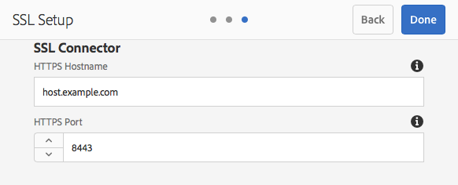

# SSL standaard{#ssl-by-default}

In een poging om de veiligheid van AEM onophoudelijk te verbeteren, heeft Adobe een eigenschap genoemd SSL Door Standaard geïntroduceerd. Het doel is het gebruik van HTTPS aan te moedigen om verbinding te maken met AEM instanties.

## SSL standaard inschakelen {#enabling-ssl-by-default}

U kunt SSL door Standaard te vormen door het relevante Inbox bericht van uw AEM homescherm te klikken. Druk op het belpictogram in de rechterbovenhoek van het scherm om het vak Inbox te bereiken. Klik vervolgens op **Alles weergeven**. Hiermee wordt een lijst weergegeven met alle waarschuwingen die in een lijstweergave zijn besteld.

Selecteer en open in de lijst de waarschuwing **HTTPS** configureren:


>[!NOTE]
>
>Als de **HTTPS** waarschuwing niet aanwezig in Inbox is, kunt u rechtstreeks naar de Tovenaar navigeren HTTPS door naar *<http://serveraddress:serverport/libs/granite/security/content/sslConfig.html?item=configuration%2fconfiguressl&_charset_=utf-8>* te gaan

Voor deze functie is een servicegebruiker met de naam **ssl-service** gemaakt. Zodra u het alarm opent, zult u door de volgende configuratietovenaar worden geleid:

1. Stel eerst de gegevens voor de winkelreferenties in. Dit zijn de referenties voor de sleutelopslag van de systeemgebruiker **ssl-service** die de persoonlijke sleutel en vertrouwde opslag voor de luisteraar HTTPS zal bevatten.

   

1. Nadat u de referenties hebt ingevoerd, klikt u op **Volgende** in de rechterbovenhoek van de pagina. Upload vervolgens de bijbehorende persoonlijke sleutel en het bijbehorende certificaat voor de SSL-verbinding.

   

   >[!NOTE]
   >
   >Zie [deze procedure](/help/sites-administering/ssl-by-default.md#generating-a-private-key-certificate-pair-to-use-with-the-wizard) hieronder voor informatie over het genereren van een persoonlijke sleutel en een certificaat voor gebruik met de wizard.

1. Geef ten slotte de hostnaam HTTPS en de TCP-poort voor de HTTPS-listener op.

   

## SSL standaard automatiseren {#automating-ssl-by-default}

Er zijn drie manieren om SSL standaard te automatiseren.

### Via HTTP-POST {#via-http-post}

De eerste methode impliceert het posten aan de server SSLSetup die door de configuratietovenaar wordt gebruikt:

```shell
POST /libs/granite/security/post/sslSetup.html
```

U kunt de volgende nuttige lading in uw POST gebruiken om configuratie te automatiseren:

```xml
------WebKitFormBoundaryyBO4ArmGlcfdGDbs
Content-Disposition: form-data; name="keystorePassword"

test
------WebKitFormBoundaryyBO4ArmGlcfdGDbs
Content-Disposition: form-data; name="keystorePasswordConfirm"
test
------WebKitFormBoundaryyBO4ArmGlcfdGDbs
Content-Disposition: form-data; name="truststorePassword"
test
------WebKitFormBoundaryyBO4ArmGlcfdGDbs
Content-Disposition: form-data; name="truststorePasswordConfirm"
test
------WebKitFormBoundaryyBO4ArmGlcfdGDbs
Content-Disposition: form-data; name="privatekeyFile"; filename="server.der"
Content-Type: application/x-x509-ca-cert

------WebKitFormBoundaryyBO4ArmGlcfdGDbs
Content-Disposition: form-data; name="certificateFile"; filename="server.crt"
Content-Type: application/x-x509-ca-cert

------WebKitFormBoundaryyBO4ArmGlcfdGDbs
Content-Disposition: form-data; name="httpsPort"
8443
```

De servlet zal, net als elke sling POST servlet, met 200 OK of een foutHTTP- statuscode antwoorden. U vindt details over de status in de HTML-hoofdtekst van de reactie.

Hieronder staan voorbeelden voor zowel een geslaagde reactie als een fout.

**SUCCESS-VOORBEELD** (status = 200):

```xml
<!DOCTYPE html>
<html lang='en'>
<head>
<title>OK</title>
</head>
<body>
<h1>OK</h1>
<dl>
<dt class='foundation-form-response-status-code'>Status</dt>
<dd>200</dd>
<dt class='foundation-form-response-status-message'>Message</dt>
<dd>SSL successfully configured</dd>
<dt class='foundation-form-response-title'>Title</dt>
<dd>OK</dd>
<dt class='foundation-form-response-description'>Description</dt>
<dd>HTTPS has been configured on port 8443. The private key and
certificate were stored in the key store of the user ssl-service.
Please take note of the key store password you provided. You will need
it for any subsequent updating of the private key or certificate.</dd>
</dl>
<h2>Links</h2>
<ul class='foundation-form-response-links'>
<li><a class='foundation-form-response-redirect' href='/'>Done</a></li>
</ul>
</body>
</html>
```

**FOUTVOORBEELD**  (status = 500):

```xml
<!DOCTYPE html>
<html lang='en'>
<head>
<title>Error</title>
</head>
<body>
<h1>Error</h1>
<dl>
<dt class='foundation-form-response-status-code'>Status</dt>
<dd>500</dd>
<dt class='foundation-form-response-status-message'>Message</dt>
<dd>The provided file is not a valid key, DER format expected</dd>
<dt class='foundation-form-response-title'>Title</dt>
<dd>Error</dd>
</dl>
</body>
</html>
```

### Via pakket {#via-package}

U kunt de SSL-installatie ook automatiseren door een pakket te uploaden dat al de volgende vereiste items bevat:

* Het sleutelarchief van de ssl-dienst gebruiker. Dit bevindt zich onder */home/users/system/security/ssl-service/keystore* in de repository.
* De `GraniteSslConnectorFactory`-configuratie

### Genereren van een privésleutel/certificaatpaar voor gebruik met de wizard {#generating-a-private-key-certificate-pair-to-use-with-the-wizard}

Hieronder ziet u een voorbeeld voor het maken van een zelfondertekend certificaat in de indeling DER die de SSL-wizard kan gebruiken.

>[!NOTE]
>
>Het gebruik van een zelfondertekend certificaat is bijvoorbeeld alleen bedoeld en mag niet worden gebruikt bij de productie.

1. Maak eerst de persoonlijke sleutel:

   ```shell
   openssl genrsa -aes256 -out localhostprivate.key 4096
   openssl rsa -in localhostprivate.key -out localhostprivate.key
   ```

1. Genereer vervolgens een CSR (Certificate Signing Request) met behulp van de persoonlijke sleutel:

   ```shell
   openssl req -sha256 -new -key localhostprivate.key -out localhost.csr -subj '/CN=localhost'
   ```

1. Genereer het SSL-certificaat en onderteken het met de persoonlijke sleutel. In dit voorbeeld verloopt de bewerking over een jaar:

   ```shell
   openssl x509 -req -days 365 -in localhost.csr -signkey localhostprivate.key -out localhost.crt
   ```

Zet de Persoonlijke Sleutel in het formaat van DER om. De reden hiervoor is dat de SSL-wizard vereist dat de sleutel de indeling DER heeft:

```shell
openssl pkcs8 -topk8 -inform PEM -outform DER -in localhostprivate.key -out localhostprivate.der -nocrypt
```

Tot slot uploadt u **localhostprivate.der** als Private Key en **localhost.crt** als SSL-certificaat in stap 2 van de grafische SSL-wizard die aan het begin van deze pagina wordt beschreven.

### De SSL-configuratie bijwerken via cURL {#updating-the-ssl-configuration-via-curl}

>[!NOTE]
>
>Zie [URL gebruiken met AEM](https://helpx.adobe.com/experience-manager/6-4/sites/administering/using/curl.html) voor een gecentraliseerde lijst van nuttige cURL-opdrachten in AEM.

U kunt de SSL-configuratie ook automatiseren met het gereedschap cURL. U kunt dit doen door de configuratieparameters aan dit URL te posten:

*https://&lt;serveraddress>:&lt;serverport>/libs/granite/security/post/sslSetup.html*

Hieronder ziet u de parameters die u kunt gebruiken om de verschillende instellingen in de configuratietovenaar te wijzigen:

* `-F "keystorePassword=password"` - het sleutelarchiefwachtwoord;

* `-F "keystorePasswordConfirm=password"` - het keystore-wachtwoord bevestigen;

* `-F "truststorePassword=password"` - het truststore-wachtwoord;

* `-F "truststorePasswordConfirm=password"` - het truststore-wachtwoord bevestigen;

* `-F "privatekeyFile=@localhostprivate.der"` - de persoonlijke sleutel specificeren;

* `-F "certificateFile=@localhost.crt"` - het certificaat vermelden;

* `-F "httpsHostname=host.example.com"`- de hostnaam te specificeren;
* `-F "httpsPort=8443"` - de poort waaraan de HTTPS-listener werkt.

>[!NOTE]
>
>De snelste manier om cURL uit te voeren om de SSL configuratie te automatiseren is van de omslag waar de DER en CRT dossiers zijn. U kunt ook het volledige pad opgeven in de argumenten `privatekeyFile` en certificateFile.
>
>U moet ook worden geverifieerd om de update uit te voeren, dus zorg ervoor u het cURL bevel met de `-u user:passeword` parameter toevoegt.
>
>Een correcte post cURL zou als dit moeten kijken:

```shell
curl -u user:password -F "keystorePassword=password" -F "keystorePasswordConfirm=password" -F "truststorePassword=password" -F "truststorePasswordConfirm=password" -F "privatekeyFile=@localhostprivate.der" -F "certificateFile=@localhost.crt" -F "httpsHostname=host.example.com" -F "httpsPort=8443" https://host:port/libs/granite/security/post/sslSetup.html
```

#### Meerdere certificaten met cURL {#multiple-certificates-using-curl}

U kunt de server een certificaatketen sturen door de parameter certificateFile als volgt te herhalen:

`-F "certificateFile=@root.crt" -F "certificateFile=@localhost.crt"..`

Zodra u het bevel hebt uitgevoerd, verifieer dat alle certificaten het aan keystore maakten. Controleer het sleutelarchief van:
[http://localhost:4502/libs/granite/security/content/userEditor.html/home/users/system/security/ssl-service](http://localhost:4502/libs/granite/security/content/userEditor.html/home/users/system/security/ssl-service)
