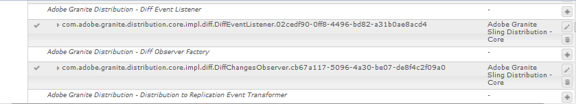

# Gebruikerssynchronisatie{#user-synchronization}

## Inleiding {#introduction}

Wanneer de plaatsing een [publiceerlandbouwbedrijf](/help/sites-deploying/recommended-deploys.md#tarmk-farm)is, moeten de leden login kunnen en hun gegevens over om het even welk publiceren knoop zien.

Gebruikers en gebruikersgroepen (gebruikersgegevens) die in de publicatieomgeving zijn gemaakt, zijn niet nodig in de ontwerpomgeving.

De meeste gebruikersgegevens die in de auteursomgeving zijn gemaakt, blijven in de auteursomgeving en worden niet gekopieerd naar publicatieinstanties.

Registratie en wijzigingen die zijn aangebracht op één publicatie-instantie moeten worden gesynchroniseerd met andere publicatie-instanties, zodat deze toegang hebben tot dezelfde gebruikersgegevens.

Vanaf AEM 6.1, wanneer gebruikerssynchronisatie wordt toegelaten, worden de gebruikersgegevens automatisch gesynchroniseerd over de publiceer instanties in het landbouwbedrijf en niet gecreeerd op auteur.

## Verspreiding {#sling-distribution}

De gebruikersgegevens, samen met hun [ACLs](/help/sites-administering/security.md), worden opgeslagen in de Kern [van het](/help/sites-deploying/platform.md)Eak, de laag onder Oak JCR, en worden betreden gebruikend [Oak API](https://helpx.adobe.com/experience-manager/6-5/sites/developing/using/reference-materials/javadoc/org/apache/jackrabbit/oak/api/package-tree.html). Met weinig updates is het redelijk dat gebruikersgegevens worden gesynchroniseerd met andere publicatieinstanties die gebruikmaken van [Sling Content Distribution](https://github.com/apache/sling/blob/trunk/contrib/extensions/distribution/README.md) (Sling Distribution).

De voordelen van gebruikerssynchronisatie met de verkoopverdeling in vergelijking met traditionele replicatie zijn:

* *gebruikers*, *gebruikersprofielen* en *gebruikersgroepen* die bij publicatie zijn gemaakt, worden niet gemaakt op auteur

* Bij het splitsen van distributiesets worden eigenschappen in jcr-gebeurtenissen ingesteld, zodat u kunt werken binnen gebeurtenislisteners aan de serverzijde zonder dat u zich zorgen hoeft te maken over oneindige replicatielijnen
* De het verdelen van de distributie verzendt slechts gebruikersgegevens naar niet voortkomende publicatieinstanties, die onnodig verkeer elimineren
* [ACLs](/help/sites-administering/security.md) die in de gebruikersknoop wordt geplaatst is inbegrepen in de synchronisatie

>[!NOTE]
>
>Als de zittingen worden vereist, wordt het geadviseerd om of een oplossing te gebruiken SSO of kleverige zitting te gebruiken en klanten te hebben login als zij aan een andere uitgever worden geschakeld.

>[!CAUTION]
>
>Synchronisatie van de ***beheerdersgroep*** wordt niet ondersteund, zelfs niet als gebruikerssynchronisatie is ingeschakeld. In plaats daarvan wordt een fout bij &#39;het importeren van de diff&#39; in het foutenlogboek geregistreerd.
>
>Daarom wanneer de plaatsing een publiceer landbouwbedrijf is, als een gebruiker aan of verwijderd uit de ***beheerdersgroep** wordt toegevoegd, moet de wijziging manueel op elke publicatieinstantie worden gemaakt.

## Gebruikerssynchronisatie inschakelen {#enable-user-sync}

>[!NOTE]
>
>Gebruikerssync is standaard `disabled`.
>
>Het toelaten van gebruikerssynchronisatie impliceert het wijzigen van *bestaande* configuraties OSGi.
>
>Er mogen geen nieuwe configuraties worden toegevoegd als gevolg van het inschakelen van gebruikerssynchronisatie.

De gebruikerssynchronisatie is afhankelijk van de auteursomgeving voor het beheer van de gegevensdistributies van de gebruiker, ook al worden de gebruikersgegevens niet op auteur gecreeerd. Veel, maar niet alle, van de configuratie vindt plaats in de auteursomgeving en elke stap identificeert duidelijk of het op auteur of publicatie moet worden uitgevoerd.

Hieronder vindt u de stappen die nodig zijn om gebruikerssynchronisatie in te schakelen, gevolgd door een sectie [Problemen oplossen](#troubleshooting) :

### Vereisten {#prerequisites}

1. Als gebruikers en gebruikersgroepen al op één uitgever zijn gemaakt, wordt aangeraden de gebruikersgegevens [handmatig te synchroniseren](#manually-syncing-users-and-user-groups) met alle uitgevers voordat u de gebruikerssynchronisatie configureert en inschakelt.

Zodra gebruikerssynchronisatie is ingeschakeld, worden alleen nieuwe gebruikers en groepen gesynchroniseerd.

1. Controleer of de laatste code is geïnstalleerd:

* [AEM platformupdates](https://helpx.adobe.com/experience-manager/kb/aem62-available-hotfixes.html)
* [AEM Communities-updates](/help/communities/deploy-communities.md#latestfeaturepack)

### 1. Apache Sling Distribution Agent - Sync Agents Factory {#apache-sling-distribution-agent-sync-agents-factory}

**Gebruikerssynchronisatie inschakelen**

* **op auteur**

   * aanmelden met beheerdersrechten
   * toegang tot de [webconsole](/help/sites-deploying/configuring-osgi.md)

      * bijvoorbeeld [https://localhost:4502/system/console/configMgr](https://localhost:4502/system/console/configMgr)
   * lokaliseren `Apache Sling Distribution Agent - Sync Agents Factory`

      * Selecteer de bestaande configuratie die u wilt openen voor bewerken (potloodpictogram)Verifiëren `name`: **`socialpubsync`**

      * het `Enabled` selectievakje
      * select `Save`


### 2. Geautoriseerde gebruiker maken {#createauthuser}

**Vorm toestemmingen** Deze geautoriseerde gebruiker zal in stap 3 worden gebruikt om de distributie van het Verkopen op auteur te vormen.

* **op elke publicatie-instantie**

   * aanmelden met beheerdersrechten
   * toegang krijgen tot de [beveiligingsconsole](/help/sites-administering/security.md)

      * bijvoorbeeld [https://localhost:4503/useradmin](https://localhost:4503/useradmin)
   * een nieuwe gebruiker maken

      * for example, `usersync-admin`
   * deze gebruiker toevoegen aan de **`administrators`** gebruikersgroep
   * [voeg ACL voor deze gebruiker aan /home toe](#howtoaddacl)

      * `Allow jcr:all` met beperking `rep:glob=*/activities/*`


>[!CAUTION]
>
>Er moet een nieuwe gebruiker worden gemaakt.
>
>* De standaardgebruiker die is toegewezen, is **`admin`**.
>* Niet gebruiken `communities-user-admin user.`

>


#### Hoe te om ACL toe te voegen {#addacls}

* access CRXDE Lite

   * bijvoorbeeld [https://localhost:4503/crx/de](https://localhost:4503/crx/de)

* Selecteer `/home` knooppunt
* in het rechterdeelvenster selecteert u het `Access Control` tabblad
* selecteer de `+` knoop om een ACL ingang toe te voegen

   * **Opdrachtgever**: *zoeken naar gebruiker gemaakt voor gebruikerssynchronisatie*
   * **Type**: `Allow`
   * **Bevoegdheden**: `jcr:all`
   * **Beperkingen** rep:glob: `*/activities/*`
   * Selecteer **OK**

* Selecteer Alles **opslaan**


Zie ook

* [Toegangsbeheer](/help/sites-administering/user-group-ac-admin.md#access-right-management)
* De sectie van het Oplossen van problemen [wijzigt de Uitzondering van de Verrichting tijdens de Verwerking](#modify-operation-exception-during-response-processing)van de Reactie.

### 3. Adobe Granite Distribution - Encrypted Password Transport Secret Provider {#adobegraniteencpasswrd}

**Machtigingen configureren**

Zodra een geautoriseerde gebruiker, een lid van de **`administrators`**gebruikersgroep, op alle publicatieinstanties is gecreeerd, moet die geautoriseerde gebruiker op auteur worden geïdentificeerd als hebbend toestemming om gebruikersgegevens van auteur te synchroniseren om te publiceren.

* **op auteur**

   * aanmelden met beheerdersrechten
   * toegang tot de [webconsole](/help/sites-deploying/configuring-osgi.md)

      * bijvoorbeeld [https://localhost:4502/system/console/configMgr](https://localhost:4502/system/console/configMgr)
   * lokaliseren `com.adobe.granite.distribution.core.impl.CryptoDistributionTransportSecretProvider.name`
   * Selecteer de bestaande configuratie die u wilt openen voor bewerken (potloodpictogram)Verifiëren `property name`: **`socialpubsync-publishUser`**

   * de gebruikersnaam en het wachtwoord instellen voor de [geautoriseerde gebruiker](#createauthuser) die is gemaakt bij publicatie in stap 2

      * for example, `usersync-admin`


### 4. Apache Sling Distribution Agent - Queue Agents Factory {#apache-sling-distribution-agent-queue-agents-factory}

**Gebruikerssynchronisatie inschakelen**

* **bij publicatie**:

   * aanmelden met beheerdersrechten
   * toegang tot de [webconsole](/help/sites-deploying/configuring-osgi.md)

      * bijvoorbeeld [https://localhost:4503/system/console/configMgr](https://localhost:4503/system/console/configMgr)
   * lokaliseren `Apache Sling Distribution Agent - Queue Agents Factory`

      * Selecteer de bestaande configuratie die u wilt openen voor bewerken (potloodpictogram)Verifiëren `Name`: `socialpubsync-reverse`

      * het `Enabled` selectievakje
      * select `Save`
   * **repeat **for each publish instance


### 5. Adobe Social Sync - Diff Observer Factory {#diffobserver}

**Groepssynchronisatie inschakelen**

* **op elke publicatie-instantie**:

   * aanmelden met beheerdersrechten
   * toegang tot de [webconsole](/help/sites-deploying/configuring-osgi.md)

      * bijvoorbeeld [https://localhost:4503/system/console/configMgr](https://localhost:4503/system/console/configMgr)
   * lokaliseren **`Adobe Social Sync - Diff Observer Factory`**

      * Selecteer de bestaande configuratie die u wilt openen voor bewerken (potloodpictogram)

         Verify `agent name`: `socialpubsync-reverse`

      * het `Enabled` selectievakje
      * select `Save`


### 6. Apache Sling Distribution Trigger - Scheduled Triggers Factory {#apache-sling-distribution-trigger-scheduled-triggers-factory}

**(Optioneel) Wijzig het pollinginterval**

Standaard wordt elke 30 seconden een opiniepeiling uitgevoerd. U wijzigt dit interval als volgt:

* **op auteur**

   * aanmelden met beheerdersrechten
   * toegang tot de [webconsole](/help/sites-deploying/configuring-osgi.md)

      * bijvoorbeeld [https://localhost:4502/system/console/configMgr](https://localhost:4502/system/console/configMgr)
   * lokaliseren `Apache Sling Distribution Trigger - Scheduled Triggers Factory`

      * Selecteer de bestaande configuratie die u wilt openen voor bewerken (potloodpictogram)

         * Verify `Name`: `socialpubsync-scheduled-trigger`
      * het `Interval in Seconds` gewenste interval instellen
      * select `Save`


## Configureren voor meerdere publicatie-instanties {#configure-for-multiple-publish-instances}

De standaardconfiguratie is voor één enkele publicatieinstantie. Aangezien de reden om gebruikerssynchronisatie toe te laten veelvoudige publicatieinstanties moet synchroniseren, zoals voor een publicatielandbouwbedrijf, zullen de extra publicatieinstanties aan de Fabriek van de Agenten van de Synchronisatie moeten worden toegevoegd.

### 7. Apache Sling Distribution Agent - Sync Agents Factory {#apache-sling-distribution-agent-sync-agents-factory-1}

**Publicatie-instanties toevoegen:**

* **op auteur**

   * aanmelden met beheerdersrechten
   * toegang tot de [webconsole](/help/sites-deploying/configuring-osgi.md)

      * bijvoorbeeld [https://localhost:4502/system/console/configMgr](https://localhost:4502/system/console/configMgr)
   * lokaliseren `Apache Sling Distribution Agent - Sync Agents Factory`

      * Selecteer de bestaande configuratie die u wilt openen voor bewerken (potloodpictogram)Verifiëren `Name`: `socialpubsync`


* **Eindpunten** van de exporteurEr zou een exporter eindpunt voor elke uitgever moeten zijn. Als er bijvoorbeeld twee uitgevers zijn, localhost:4503 en 4504, moeten er twee vermeldingen zijn:

   * `https://localhost:4503/libs/sling/distribution/services/exporters/socialpubsync-reverse`
   * `https://localhost:4504/libs/sling/distribution/services/exporters/socialpubsync-reverse`

* **Eindpunten** van de importeurEr zou een importereindpunt voor elke uitgever moeten zijn. Als er bijvoorbeeld twee uitgevers zijn, localhost:4503 en 4504, moeten er twee vermeldingen zijn:

   * `https://localhost:4503/libs/sling/distribution/services/importers/socialpubsync`
   * `https://localhost:4504/libs/sling/distribution/services/importers/socialpubsync`

* select `Save`

### 8. AEM Communities User Sync Listener {#aem-communities-user-sync-listener}

**(Optioneel) Aanvullende JCR-knooppunten synchroniseren**

Als er aangepaste gegevens zijn die moeten worden gesynchroniseerd in meerdere publicatievarianten, dan:

* **op elke publicatie-instantie**:

   * aanmelden met beheerdersrechten
   * toegang tot de [webconsole](/help/sites-deploying/configuring-osgi.md)

      * for example, `https://localhost:4503/system/console/configMgr`
   * lokaliseren `AEM Communities User Sync Listener`
   * Selecteer de bestaande configuratie die u wilt openen voor bewerken (potloodpictogram)Verifiëren `Name`: `socialpubsync-scheduled-trigger`


* **Knooppunttypen**Dit is de lijst met knooppunttypen die worden gesynchroniseerd. Elk knooppunttype anders dan sling:Folder moet hier worden vermeld (sling:folder wordt afzonderlijk behandeld).
Standaardlijst met knooppunttypen die moeten worden gesynchroniseerd:

   * rep:gebruiker
   * nt:ongestructureerd
   * nt:resource

* **Genegeerde eigenschappen**Dit is de lijst met eigenschappen die wordt genegeerd als er een wijziging wordt gedetecteerd. Wijzigingen in deze eigenschappen worden mogelijk gesynchroniseerd als neveneffect van andere wijzigingen (aangezien synchronisatie altijd op het knooppuntniveau plaatsvindt), maar wijzigingen in deze eigenschappen zullen op zich niet tot synchronisatie leiden.
Standaardeigenschap die moet worden genegeerd:

   * cq:lastModified

* **Genegeerde knooppunten**subpaden die tijdens de synchronisatie volledig worden genegeerd. Niets onder deze subpaden zal op elk ogenblik worden gesynchroniseerd.
Standaardknooppunten die moeten worden genegeerd:

   * .tokens
   * systeem

* **Gedistribueerde mappen**Meeste volgorde:Mappen worden genegeerd omdat synchronisatie niet nodig is. De weinige uitzonderingen staan hier vermeld.
Standaardmappen voor synchronisatie

   * segmenten/scoring
   * sociale/relaties
   * activiteiten

### 9. Unieke verkoper-id {#unique-sling-id}

>[!CAUTION]
>
>Als de selectie-id overeenkomt met twee of meer publicatie-instanties, mislukt het synchroniseren van de gebruikersgroep.

Als het Verdelen identiteitskaart het zelfde voor veelvoudige publiceer instanties in publiceer landbouwbedrijf is, dan zullen de gebruikersgroepen niet worden gesynchroniseerd.

Om te controleren of alle waarden voor de Verschuivende id verschillen, publiceert u voor elke publicatie-instantie:

1. bladeren naar `http://<host>:<port>/system/console/status-slingsettings`
1. Controleer de waarde van de **verkoopID**


Als de Verschuivende-id van een publicatie-instantie overeenkomt met de Verschuivende-id van een andere publicatie-instantie, geldt het volgende:

1. Stop een van de publicatieinstanties die een overeenkomende sloon-id heeft
1. in de map crx-quickstart/launch/felix

   * zoek naar en verwijder het bestand met de naam *sling.id.file*

      * bijvoorbeeld op een Linux-systeem:
         `rm -i $(find . -type f -name sling.id.file)`

      * bijvoorbeeld op een Windows-systeem:
         `use windows explorer and search for *sling.id.file*`

1. De publicatie-instantie starten

   * bij het opstarten wordt er een nieuwe verkoop-id toegewezen

1. Controleren of de **verkoop-id** nu uniek is

Herhaal deze stappen totdat alle publicatie-instanties een unieke id voor verkopers hebben.

## Vault Package Builder-fabriek {#vault-package-builder-factory}

Voor een correcte synchronisatie van updates is het nodig om de builder van het vault-pakket te wijzigen voor gebruikerssynchronisatie:

* op elke AEM publicatie-instantie
* toegang tot de [webconsole](/help/sites-deploying/configuring-osgi.md)

   * bijvoorbeeld [https://localhost:4503/system/console/configMgr](https://localhost:4503/system/console/configMgr)

* zoek de `Apache Sling Distribution Packaging - Vault Package Builder Factory`

   * `Builder name: socialpubsync-vlt`

* Selecteer het bewerkingspictogram
* twee toevoegen `Package Node Filters`:

   * `/home/users|-.*/.tokens`
   * `/home/users|-.*/rep:cache`

* beleidsafhandeling:

   * om bestaande rep:beleidsknopen met nieuwe te overschrijven, voeg een derde Filter van het Pakket toe:

      * `/home/users|+.*/rep:policy`
   * om te voorkomen dat het beleid wordt verspreid,

      * `Acl Handling:` `IGNORE`


## Wat gebeurt er als ... {#what-happens-when}

### Gebruikersnaam of Zelfregistratie- of bewerkingsprofiel bij publiceren {#user-self-registers-or-edits-profile-on-publish}

Gebruikers en profielen die in de publicatieomgeving (zelfregistratie) zijn gemaakt, worden per ontwerp niet weergegeven in de ontwerpomgeving.

Wanneer de topologie een [publiceerlandbouwbedrijf](/help/sites-deploying/recommended-deploys.md#tarmk-farm) is en gebruikerssynchronisatie correct is gevormd, *user *and *gebruikersprofiel* wordt gesynchroniseerd over het publiceerlandbouwbedrijf gebruikend het Verschuiven distributie.

### Gebruikers of gebruikersgroepen worden gemaakt met Beveiligingsconsole {#users-or-user-groups-are-created-using-security-console}

Gebruikersgegevens die in de publicatieomgeving zijn gemaakt, worden door het ontwerp niet weergegeven in de auteursomgeving en andersom.

Wanneer de [gebruikersbeheer- en beveiligingsconsole](/help/sites-administering/security.md) wordt gebruikt om nieuwe gebruikers toe te voegen in de publicatieomgeving, worden de nieuwe gebruikers en hun groepslidmaatschap indien nodig gesynchroniseerd met andere publicatieinstanties. Gebruikerssynchronisatie synchroniseert ook gebruikersgroepen die zijn gemaakt via de beveiligingsconsole.

## Problemen oplossen {#troubleshooting}

### Gebruikerssynchronisatie offline uitvoeren {#how-to-take-user-sync-offline}

Als u gebruikerssynchronisatie offline wilt zetten, moet de distributierij leeg en stil zijn om een uitgever [te](#how-to-remove-a-publisher) verwijderen of gegevens [](#manually-syncing-users-and-user-groups)handmatig te synchroniseren.

Om de staat van de distributierij te controleren:

* op auteur:

   * gebruiken, [CRXDE Lite](/help/sites-developing/developing-with-crxde-lite.md)

      * zoeken naar items in `/var/sling/distribution/packages`

         * mapknooppunten met de naam van het patroon `distrpackage_*`
   * gebruiken [Package Manager](/help/sites-administering/package-manager.md)

      * zoeken naar hangende pakketten (nog niet geïnstalleerd)

         * genoemd met het patroon `socialpubsync-vlt*`
         * gemaakt door `communities-user-admin`


Schakel gebruikerssynchronisatie uit wanneer de distributiestrijd leeg is:

* op auteur

   * *uncheck *the `Enabled` checkbox for [Apache Sling Distribution Agent - Sync Agents Factory](#apache-sling-distribution-agent-sync-agents-factory)

Nadat de taken zijn voltooid, kunt u de gebruikerssynchronisatie opnieuw inschakelen:

* op auteur

   * Schakel het `Enabled` selectievakje in voor [Apache Sling Distribution Agent - Sync Agents Factory](#apache-sling-distribution-agent-sync-agents-factory)

### Diagnostiek gebruikerssynchronisatie {#user-sync-diagnostics}

Diagnostiek voor gebruikerssynchronisatie is een hulpmiddel dat de configuratie controleert en probeert eventuele problemen op te sporen.

Bij de auteur navigeert u eenvoudig van de hoofdconsole via **Tools, Operations, Diagnosis, User Sync Diagnostics.**

Als u gewoon de diagnostische console voor gebruikerssynchronisatie invoert, worden de resultaten weergegeven.

Dit is wat wordt getoond wanneer de Synchronisatie van de Gebruiker niet is toegelaten:


#### Diagnostiek voor uitgevers uitvoeren {#how-to-run-diagnostics-for-publishers}

Wanneer de diagnose van het auteursmilieu in werking wordt gesteld, zullen de pas/mislukkingsresultaten een sectie [INFO] omvatten die de lijst van gevormde te bevestigen publicatieinstanties toont.

In de lijst is een URL opgenomen voor elke publicatie-instantie die de diagnostiek voor die instantie uitvoert. De url-parameter `syncUser` wordt toegevoegd aan de diagnostische URL en de waarde ervan wordt ingesteld op de *geautoriseerde synchronisatiegebruiker* die is gemaakt in [Stap 2](#createauthuser).

**Opmerking**: voordat u de URL start, moet de *geautoriseerde synchronisatiegebruiker* al zijn aangemeld bij die publicatie-instantie.


### Configuratie onjuist toegevoegd {#configuration-improperly-added}

Wanneer de gebruikerssynchronisatie niet werkt, is het meest voorkomende probleem dat er extra configuraties zijn *toegevoegd*. In plaats daarvan, zou *existing *default configuratie *uitgegeven* moeten zijn.

Na zijn meningen van hoe uitgegeven, standaardconfiguraties in de Console van het Web zouden moeten verschijnen. Als er meerdere exemplaren worden weergegeven, moet de toegevoegde configuratie worden verwijderd.

#### (auteur) Eén Apache Sling Distribution Agent - Sync Agents Factory {#author-one-apache-sling-distribution-agent-sync-agents-factory}


#### (auteur) Eén Apache Sling Distribution Transport Credentials - Gebruikersreferenties gebaseerd DistributionTransportSecretProvider {#author-one-apache-sling-distribution-transport-credentials-user-credentials-based-distributiontransportsecretprovider}


#### (publiceren) Eén Apache Sling Distribution Agent - Queue Agents Factory {#publish-one-apache-sling-distribution-agent-queue-agents-factory}


#### (publiceren) Eén Adobe Social Sync - Diff Observer Factory {#publish-one-adobe-social-sync-diff-observer-factory}



#### (auteur) One Apache Sling Distribution Trigger - Scheduled Triggers Factory {#author-one-apache-sling-distribution-trigger-scheduled-triggers-factory}


### Uitzondering bewerking wijzigen tijdens reactieverwerking {#modify-operation-exception-during-response-processing}

Als het volgende zichtbaar is in het logboek:

`org.apache.sling.servlets.post.impl.operations.ModifyOperation Exception during response processing.`

`java.lang.IllegalStateException: This tree does not exist`

Controleer vervolgens of de sectie [2. Gemachtigde gebruiker](#createauthuser) maken is op de juiste wijze gevolgd.

Deze sectie beschrijft het creëren van een erkende gebruiker, die op alle publiceer instanties bestaat, en het identificeren van hen in de &quot;Secret Provider&quot;OSGi config op auteur. By default, the user is `admin`.

De geautoriseerde gebruiker moet lid zijn van de **`administrators`** gebruikersgroep en de machtigingen voor die groep mogen niet worden gewijzigd.

De geautoriseerde gebruiker moet expliciet de volgende rechten en beperkingen hebben voor alle publicatieinstanties:

| **path** | **jcr:alles** | **rep:glob** |
|---|---|---|
| /home | X | */activity/* |
| /home/users | X | */activity/* |
| /home/groups | X | */activity/* |

Als lid van de `administrators` groep moet de geautoriseerde gebruiker de volgende rechten hebben voor alle publicatieexemplaren:

| **path** | **jcr:alles** | **jcr:lezen** | **rep:write** |
|---|---|---|---|
| /etc/packages/sling/distribution |  |  | X |
| /libs/sling/distribution |  | X |  |
| /var |  |  | X |
| /var/eventing |  | X | X |
| /var/sling/distribution |  | X | X |

### Synchronisatie van gebruikersgroep is mislukt {#user-group-sync-failed}

Als de selectie-id overeenkomt met twee of meer publicatie-instanties, mislukt het synchroniseren van de gebruikersgroep.

Zie rubriek [9. Unieke verkoper-id](#unique-sling-id)

### Gebruikers en gebruikersgroepen handmatig synchroniseren {#manually-syncing-users-and-user-groups}

* op de uitgever waarop gebruikers en gebruikersgroepen bestaan:

   * [indien ingeschakeld, gebruikerssynchronisatie uitschakelen](#how-to-take-user-sync-offline)
   * [een pakket](/help/sites-administering/package-manager.md#creating-a-new-package) maken van `/home`

      * bij het bewerken van het pakket

         * Tabblad Filters: Filter toevoegen: Hoofdpad: `/home`
         * Het tabblad Geavanceerd: Wisselstroomverwerking: `Overwrite`
   * [het pakket exporteren](/help/sites-administering/package-manager.md#downloading-packages-to-your-file-system)


* in andere publicatiegevallen:

   * [het pakket importeren](/help/sites-administering/package-manager.md#installing-packages)

Ga naar stap 1 als u gebruikerssynchronisatie wilt configureren of inschakelen: [Apache Sling Distribution Agent - Sync Agents Factory](#apache-sling-distribution-agent-sync-agents-factory)

### Wanneer een uitgever niet beschikbaar wordt {#when-a-publisher-becomes-unavailable}

Wanneer een publicatie-exemplaar niet beschikbaar is, moet het niet worden verwijderd als het later weer online wordt. De wijzigingen worden in de wachtrij voor de uitgever geplaatst en als deze weer online is, worden de wijzigingen verwerkt.

Als de publicatie-instantie nooit weer online zal zijn, als deze permanent offline is, moet deze worden verwijderd omdat de build van de wachtrij zal resulteren in een merkbaar gebruik van schijfruimte in de auteursomgeving.

Wanneer een uitgever neer is, zal het auteurslogboek uitzonderingen gelijkend op hebben:

```
28.01.2016 15:57:48.475 ERROR
 [pool-12-thread-34-org_apache_sling_distribution_queue_socialpubsync_endpoint1
 (org/apache/sling/distribution/queue/socialpubsync/endpoint1)]
 org.apache.sling.distribution.agent.impl.SimpleDistributionAgent [agent][socialpubsync] could not deliver package distrpackage_1454014575838_a2b45ec8-0400-42f3-bed8-ae09b66381cb
 org.apache.sling.distribution.packaging.DistributionPackageImportException: failed in importing package ...
```

### Uitgever verwijderen {#how-to-remove-a-publisher}

Als u een uitgever wilt verwijderen uit de [Apache Sling Distribution Agent - Sync Agents Factory](#apache-sling-distribution-agent-sync-agents-factory), moet de distributierij leeg en stil zijn.

* op auteur:

   * [Gebruikerssynchronisatie offline uitvoeren](#how-to-take-user-sync-offline)
   * Volg [stap 7](#apache-sling-distribution-agent-sync-agents-factory) om de uitgever uit beide serverlijsten te verwijderen:

      * `Exporter Endpoints`
      * `Importer Endpoints`
   * gebruikerssynchronisatie opnieuw inschakelen

      * Schakel het `Enabled` selectievakje in voor [Apache Sling Distribution Agent - Sync Agents Factory](#apache-sling-distribution-agent-sync-agents-factory)
