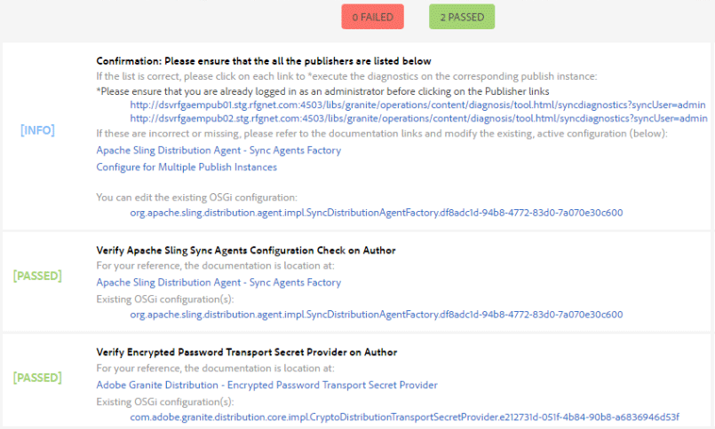

# Gebruikerssynchronisatie{#user-synchronization}

## Inleiding {#introduction}

Wanneer de implementatie een [publicatiebedrijf](/help/sites-deploying/recommended-deploys.md#tarmk-farm)leden moeten zich kunnen aanmelden en hun gegevens op elk publicatieknooppunt kunnen bekijken.

Gebruikers en gebruikersgroepen (gebruikersgegevens) die in de publicatieomgeving zijn gemaakt, zijn niet nodig in de ontwerpomgeving.

De meeste gebruikersgegevens die in de auteursomgeving worden gemaakt, blijven in de auteursomgeving en worden niet gekopieerd naar de instanties Publish.

Registratie en wijzigingen die worden aangebracht op een instantie Publish moeten worden gesynchroniseerd met andere instanties Publish om toegang te hebben tot dezelfde gebruikersgegevens.

Vanaf AEM 6.1, wanneer gebruikerssynchronisatie wordt toegelaten, worden de gebruikersgegevens automatisch gesynchroniseerd over de Publish instanties in het landbouwbedrijf en niet gecreeerd op auteur.

## Verspreiding {#sling-distribution}

De gebruikersgegevens, samen met hun [ACLs](/help/sites-administering/security.md), worden opgeslagen in de [Eak Core](/help/sites-deploying/platform.md), de laag onder de Oak JCR en worden benaderd met de [Eak-API](https://developer.adobe.com/experience-manager/reference-materials/6-5/javadoc/org/apache/jackrabbit/oak/api/package-tree.html). Met niet vaak uitgevoerde updates is het redelijk dat gebruikersgegevens worden gesynchroniseerd met andere instanties van Publiceren die [Distributie van inhoud verkopen](https://github.com/apache/sling-old-svn-mirror/blob/trunk/contrib/extensions/distribution/README.md) (verkoopverdeling).

De voordelen van gebruikerssynchronisatie met de verkoopverdeling in vergelijking met traditionele replicatie zijn:

* *gebruikers*, *gebruikersprofielen*, en *gebruikersgroepen* die zijn gemaakt bij Publiceren, worden niet gemaakt bij Auteur

* Bij het splitsen van distributiesets worden eigenschappen in jcr-gebeurtenissen ingesteld, zodat u kunt werken binnen gebeurtenislisteners aan de serverzijde zonder dat u zich zorgen hoeft te maken over oneindige replicatielijnen
* Bij de verkoopdistributie worden alleen gebruikersgegevens naar niet-gegenereerde publicatie-instanties verzonden, waardoor onnodig verkeer wordt voorkomen
* [ACLs](/help/sites-administering/security.md) ingesteld in het gebruikersknooppunt wordt opgenomen in de synchronisatie

>[!NOTE]
>
>Als de zittingen worden vereist, wordt het geadviseerd om of een oplossing te gebruiken SSO of een kleverige zitting te gebruiken en klanten te hebben login als zij aan een andere Publish instantie worden geschakeld.

>[!CAUTION]
>
>Synchronisatie van de **beheerders** wordt niet ondersteund, zelfs niet als gebruikerssynchronisatie is ingeschakeld. In plaats daarvan wordt een fout bij het importeren van de diff in het foutenlogboek geregistreerd.
>
>Daarom wanneer de plaatsing een publiceer landbouwbedrijf is, als een gebruiker aan wordt toegevoegd of uit wordt verwijderd **beheerders** groep, moet de wijziging handmatig worden aangebracht op elke instantie Publiceren.

## Gebruikerssynchronisatie inschakelen {#enable-user-sync}

>[!NOTE]
>
>Gebruikerssynchronisatie is standaard `disabled`.
>
>Voor het inschakelen van gebruikerssynchronisatie moet u de wijzigingen aanbrengen *bestaand* OSGi-configuraties.
>
>Er mogen geen nieuwe configuraties worden toegevoegd als gevolg van het inschakelen van gebruikerssynchronisatie.

Gebruikerssynchronisatie is afhankelijk van de auteursomgeving voor het beheer van de gegevensdistributies van de gebruiker, ook al worden de gebruikersgegevens niet op de auteur gemaakt. Veel, maar niet alle, van de configuratie vindt plaats in de auteursomgeving en elke stap identificeert duidelijk of het op Auteur of Publish moet worden uitgevoerd.

De volgende stappen zijn nodig om gebruikerssynchronisatie in te schakelen, gevolgd door een [Problemen oplossen](#troubleshooting) sectie:

### Vereisten {#prerequisites}

1. Als gebruikers en gebruikersgroepen al op één instantie Publish zijn gecreeerd, wordt het geadviseerd om [handmatig synchroniseren](#manually-syncing-users-and-user-groups) de gebruikersgegevens naar alle publicatieinstanties voordat gebruikerssynchronisatie wordt geconfigureerd en ingeschakeld.

Zodra gebruikerssynchronisatie is ingeschakeld, worden alleen nieuwe gebruikers en groepen gesynchroniseerd.

1. Controleer of de laatste code is geïnstalleerd:

* [AEM platformupdates](https://experienceleague.adobe.com/docs/experience-manager-release-information/aem-release-updates/aem-releases-updates.html)
* [AEM Communities-updates](/help/communities/deploy-communities.md#latestfeaturepack)

### 1. Apache Sling Distribution Agent - Sync Agents Factory {#apache-sling-distribution-agent-sync-agents-factory}

**Gebruikerssynchronisatie inschakelen**

* **op auteur**

   * aanmelden met beheerdersrechten
   * toegang tot [Webconsole](/help/sites-deploying/configuring-osgi.md)

      * bijvoorbeeld: [https://localhost:4502/system/console/configMgr](https://localhost:4502/system/console/configMgr)

   * lokaliseren `Apache Sling Distribution Agent - Sync Agents Factory`

      * Selecteer de bestaande configuratie zodat u deze kunt openen voor bewerking (potloodpictogram) Verifiëren `name`: **`socialpubsync`**

      * Selecteer de `Enabled` selectievakje
      * selecteren `Save`


### 2. Gemachtigde gebruiker maken {#createauthuser}

**Machtigingen configureren**

De geautoriseerde gebruiker wordt gebruikt in stap 3 om de verkoopdistributie op Auteur te configureren.

* **op elke instantie Publish**

   * aanmelden met beheerdersrechten
   * toegang tot [Beveiligingsconsole](/help/sites-administering/security.md)

      * bijvoorbeeld: [https://localhost:4503/useradmin](https://localhost:4503/useradmin)

   * een gebruiker maken

      * bijvoorbeeld: `usersync-admin`

   * deze gebruiker toevoegen aan de **`administrators`** gebruikersgroep
   * [voeg ACL voor deze gebruiker aan /home toe](#howtoaddacl)

      * `Allow jcr:all` met beperking `rep:glob=*/activities/*`

>[!CAUTION]
>
>Er moet een nieuwe gebruiker worden gemaakt.
>
>* De standaardgebruiker die is toegewezen **`admin`**.
>* Niet gebruiken `communities-user-admin user.`
>

#### Hoe te om ACL toe te voegen {#addacls}

* access CRXDE Lite

   * bijvoorbeeld: [https://localhost:4503/crx/de](https://localhost:4503/crx/de)

* selecteren `/home` node
* Selecteer in het rechterdeelvenster de optie `Access Control` tab
* om een ACL ingang toe te voegen, selecteer `+` knop

   * **Opdrachtgever**: *zoeken naar gebruiker gemaakt voor gebruikerssynchronisatie*
   * **Type**: `Allow`
   * **Rechten**: `jcr:all`
   * **Beperkingen** `rep:glob`: `*/activities/*`
   * selecteren **OK**

* selecteren **Alles opslaan**


Zie ook

* [Toegangsbeheer](/help/sites-administering/user-group-ac-admin.md#access-right-management)
* Sectie Problemen oplossen [Uitzondering bewerking wijzigen tijdens reactieverwerking](#modify-operation-exception-during-response-processing).

### 3. De Distributie van Granite van de Adobe - de Versleutelde Leverancier van het Vervoer van het Wachtwoord {#adobegraniteencpasswrd}

**Machtigingen configureren**

Als een geautoriseerde gebruiker lid is van de **`administrators`** gebruikersgroep-wordt gecreeerd op alle Publish instanties, moet de erkende gebruiker op Auteur worden geïdentificeerd als hebbend toestemming om gebruikersgegevens van Auteur te synchroniseren om te publiceren.

* **op auteur**

   * aanmelden met beheerdersrechten
   * toegang tot [Webconsole](/help/sites-deploying/configuring-osgi.md)

      * bijvoorbeeld: [https://localhost:4502/system/console/configMgr](https://localhost:4502/system/console/configMgr)

   * lokaliseren `com.adobe.granite.distribution.core.impl.CryptoDistributionTransportSecretProvider.name`
   * om te openen voor bewerken, selecteert u de bestaande configuratie (potloodpictogram) verifiëren `property name`: **`socialpubsync-publishUser`**

   * stel de gebruikersnaam en het wachtwoord in op de [geautoriseerde gebruiker](#createauthuser) gemaakt bij Publiceren in stap 2

      * bijvoorbeeld: `usersync-admin`


### 4. Apache Sling Distribution Agent - Queue Agents Factory {#apache-sling-distribution-agent-queue-agents-factory}

**Gebruikerssynchronisatie inschakelen**

* **op elke instantie Publish**:

   * aanmelden met beheerdersrechten
   * toegang tot [Webconsole](/help/sites-deploying/configuring-osgi.md)

      * bijvoorbeeld: [https://localhost:4503/system/console/configMgr](https://localhost:4503/system/console/configMgr)

   * lokaliseren `Apache Sling Distribution Agent - Queue Agents Factory`

      * om te openen voor bewerken, selecteert u de bestaande configuratie (potloodpictogram) verifiëren `Name`: `socialpubsync-reverse`

      * Selecteer de `Enabled` selectievakje
      * selecteren `Save`

   * **herhalen** voor elke instantie Publish


### 5. Adobe Social Sync - Diff Observer Factory {#diffobserver}

**Groepssynchronisatie inschakelen**

* **op elke instantie Publish**:

   * aanmelden met beheerdersrechten
   * toegang tot [Webconsole](/help/sites-deploying/configuring-osgi.md)

      * bijvoorbeeld: [https://localhost:4503/system/console/configMgr](https://localhost:4503/system/console/configMgr)

   * lokaliseren **`Adobe Social Sync - Diff Observer Factory`**

      * om te openen voor bewerken, selecteert u de bestaande configuratie (potloodpictogram)

        Verifiëren `agent name`: `socialpubsync-reverse`

      * Selecteer de `Enabled` selectievakje
      * selecteren `Save`


### 6. Apache Sling Distribution Trigger - Scheduled Triggers Factory {#apache-sling-distribution-trigger-scheduled-triggers-factory}

**(Optioneel) Wijzig het pollinginterval**

Standaard wordt elke 30 seconden een opiniepeiling gehouden bij Auteur. Dit interval wijzigen:

* **op auteur**

   * aanmelden met beheerdersrechten
   * toegang tot [Webconsole](/help/sites-deploying/configuring-osgi.md)

      * bijvoorbeeld: [https://localhost:4502/system/console/configMgr](https://localhost:4502/system/console/configMgr)

   * lokaliseren `Apache Sling Distribution Trigger - Scheduled Triggers Factory`

      * om te openen voor bewerken, selecteert u de bestaande configuratie (potloodpictogram)

         * Verifiëren `Name`: `socialpubsync-scheduled-trigger`

      * instellen `Interval in Seconds` naar het gewenste interval
      * selecteren `Save`


## Configureren voor meerdere publicatie-instanties {#configure-for-multiple-publish-instances}

De standaardconfiguratie is voor één enkel Publish instantie. Aangezien de reden voor het toelaten van gebruikerssynchronisatie veelvoudige Publish instanties moet synchroniseren, zoals voor een publicatielandbouwbedrijf, moeten de extra Publish instanties aan de Factory van de Agenten van de Synchronisatie worden toegevoegd.

### 7. Apache Sling Distribution Agent - Sync Agents Factory {#apache-sling-distribution-agent-sync-agents-factory-1}

**Publicatieinstanties toevoegen:**

* **op auteur**

   * aanmelden met beheerdersrechten
   * toegang tot [Webconsole](/help/sites-deploying/configuring-osgi.md)

      * bijvoorbeeld: [https://localhost:4502/system/console/configMgr](https://localhost:4502/system/console/configMgr)

   * lokaliseren `Apache Sling Distribution Agent - Sync Agents Factory`

      * om te openen voor bewerken, selecteert u de bestaande configuratie (potloodpictogram) verifiëren `Name`: `socialpubsync`


* **Eindpunten van export**
Er zou een exportereindpunt voor elke Publish instantie moeten zijn. Als er bijvoorbeeld 2 instanties Publish zijn, localhost:4503 en 4504, moeten er twee vermeldingen zijn:

   * `https://localhost:4503/libs/sling/distribution/services/exporters/socialpubsync-reverse`
   * `https://localhost:4504/libs/sling/distribution/services/exporters/socialpubsync-reverse`

* **Eindpunten importeren**
Er zou een importereindpunt voor elke Publish instantie moeten zijn. Als er bijvoorbeeld 2 instanties Publish zijn, localhost:4503 en 4504, moeten er twee vermeldingen zijn:

   * `https://localhost:4503/libs/sling/distribution/services/importers/socialpubsync`
   * `https://localhost:4504/libs/sling/distribution/services/importers/socialpubsync`

* selecteren `Save`

### 8. AEM Communities-gebruikerssynchronisatielistener {#aem-communities-user-sync-listener}

**(Optioneel) Aanvullende JCR-knooppunten synchroniseren**

Als er aangepaste gegevens zijn die over meerdere publicatieinstanties moeten worden gesynchroniseerd, geldt het volgende:

* **op elke instantie Publish**:

   * aanmelden met beheerdersrechten
   * toegang tot [Webconsole](/help/sites-deploying/configuring-osgi.md)

      * bijvoorbeeld: `https://localhost:4503/system/console/configMgr`

   * lokaliseren `AEM Communities User Sync Listener`
   * om te openen voor bewerken, selecteert u de bestaande configuratie (potloodpictogram) verifiëren `Name`: `socialpubsync-scheduled-trigger`


* **Knooppunttypen**
Dit is de lijst van knooptypes die worden gesynchroniseerd. Elk knooppunttype anders dan sling:Folder moet hier worden vermeld (sling:folder wordt afzonderlijk behandeld).
Standaardlijst met knooppunttypen die moeten worden gesynchroniseerd:

   * rep:gebruiker
   * nt:ongestructureerd
   * nt:resource

* **Genegeerde eigenschappen**
Dit is de lijst met eigenschappen die worden genegeerd als er wijzigingen worden gedetecteerd. Wijzigingen in deze eigenschappen worden mogelijk gesynchroniseerd als neveneffect van andere wijzigingen (aangezien synchronisatie altijd op knooppuntniveau plaatsvindt), maar wijzigingen in deze eigenschappen activeren op zichzelf geen synchronisatie.
Standaardeigenschap die moet worden genegeerd:

   * cq:lastModified

* **Genegeerde knooppunten**
Subpaden die tijdens synchronisatie worden genegeerd. Niets onder deze subpaden wordt op elk moment gesynchroniseerd.
Te negeren standaardknooppunten:

   * .tokens
   * systeem

* **Verdeelde mappen**
De meeste stappen:Mappen worden genegeerd omdat synchronisatie niet nodig is. De weinige uitzonderingen staan hier vermeld.
Te synchroniseren standaardmappen

   * segmenten/scoring
   * sociale/relaties
   * activiteiten

### 9. Unieke verkoper-id {#unique-sling-id}

>[!CAUTION]
>
>Als de verkoop-id overeenkomt met twee of meer publicatie-instanties, mislukt de synchronisatie van de gebruikersgroep.

Als het Verdelen identiteitskaart het zelfde voor veelvoudige Publish instanties in publiceer landbouwbedrijf is, dan worden de gebruikersgroepen niet gesynchroniseerd.

Om te controleren of alle waarden voor de Verschuivende id verschillen, moet u voor elke instantie Publiceren controleren:

1. bladeren naar `http://<host>:<port>/system/console/status-slingsettings`
1. controleer de waarde van **Verkoop-id**


Als de verkoop-id van een instantie Publish overeenkomt met de id Sling van een andere instantie Publish, dan:

1. Stop één van de Publish instanties die een passende Verzamelings identiteitskaart heeft
1. in de map crx-quickstart/launch/felix

   * zoeken naar en het bestand met de naam *sling.id.file*

      * bijvoorbeeld op een Linux®-systeem:
        `rm -i $(find . -type f -name sling.id.file)`

      * bijvoorbeeld op een Windows-systeem:
        `use windows explorer and search for *sling.id.file*`

1. De instantie Publiceren starten

   * bij het opstarten wordt er een nieuwe verkoop-id toegewezen

1. valideren dat de **Verkoop-id** is nu uniek

Herhaal deze stappen totdat alle instanties Publiceren een unieke id voor verkopers hebben.

## Vault Package Builder-fabriek {#vault-package-builder-factory}

Voor updates die correct worden gesynchroniseerd, is het nodig om de builder van het vault-pakket te wijzigen voor gebruikerssynchronisatie:

* op elke AEM instantie Publish
* toegang tot [Webconsole](/help/sites-deploying/configuring-osgi.md)

   * bijvoorbeeld: [https://localhost:4503/system/console/configMgr](https://localhost:4503/system/console/configMgr)

* zoek de `Apache Sling Distribution Packaging - Vault Package Builder Factory`

   * `Builder name: socialpubsync-vlt`

* het pictogram voor bewerken selecteren
* twee toevoegen `Package Node Filters`:

   * `/home/users|-.*/.tokens`
   * `/home/users|-.*/rep:cache`

* beleidsafhandeling:

   * om bestaande rep:beleidsknopen met nieuwe te overschrijven, voeg een derde Filter van het Pakket toe:

      * `/home/users|+.*/rep:policy`

   * om te voorkomen dat het beleid wordt verspreid,

      * `Acl Handling:` `IGNORE`


## Wat gebeurt er als ... {#what-happens-when}

### Gebruikersnaam of Zelfregistratie- of bewerkingsprofiel bij publiceren {#user-self-registers-or-edits-profile-on-publish}

Gebruikers en profielen die in de publicatieomgeving (zelfregistratie) zijn gemaakt, worden per ontwerp niet weergegeven in de ontwerpomgeving.

Wanneer de topologie een [publicatiebedrijf](/help/sites-deploying/recommended-deploys.md#tarmk-farm) en de gebruikerssynchronisatie correct is geconfigureerd, *user* en *gebruikersprofiel* wordt gesynchroniseerd over het publicatielandbouwbedrijf gebruikend de distributie van het Schuiven.

### Gebruikers of gebruikersgroepen worden gemaakt met Beveiligingsconsole {#users-or-user-groups-are-created-using-security-console}

Gebruikersgegevens die in de publicatieomgeving zijn gemaakt, worden door het ontwerp niet weergegeven in de auteursomgeving en omgekeerd.

Wanneer de [Gebruikersbeheer en beveiliging](/help/sites-administering/security.md) -console wordt gebruikt om nieuwe gebruikers toe te voegen in de publicatieomgeving, synchroniseert de gebruiker de nieuwe gebruikers en hun groepslidmaatschap indien nodig met andere publicatie-instanties. Gebruikerssynchronisatie synchroniseert ook gebruikersgroepen die zijn gemaakt via de beveiligingsconsole.

## Problemen oplossen {#troubleshooting}

### Gebruikerssynchronisatie offline uitvoeren {#how-to-take-user-sync-offline}

Gebruikerssynchronisatie offline uitvoeren op [een instantie Publish verwijderen](#how-to-remove-a-publish-instance) of [gegevens handmatig synchroniseren](#manually-syncing-users-and-user-groups), moet de distributierij leeg en stil zijn.

Om de staat van de distributierij te controleren:

* op auteur:

   * gebruiken [CRXDE Lite](/help/sites-developing/developing-with-crxde-lite.md)

      * zoeken naar items in `/var/sling/distribution/packages`

         * mapknooppunten met de naam van het patroon `distrpackage_*`

   * gebruiken [Pakketbeheer](/help/sites-administering/package-manager.md)

      * zoeken naar hangende pakketten (nog niet geïnstalleerd)

         * genoemd met het patroon `socialpubsync-vlt*`
         * gemaakt door `communities-user-admin`

Schakel gebruikerssynchronisatie uit wanneer de distributiestrijd leeg is:

* op auteur

   * *uncheck *the `Enabled` selectievakje voor [Apache Sling Distribution Agent - Sync Agents Factory](#apache-sling-distribution-agent-sync-agents-factory)

Wanneer de taken worden voltooid, om gebruikerssynchronisatie opnieuw toe te laten:

* op auteur

   * controleren `Enabled` selectievakje voor [Apache Sling Distribution Agent - Sync Agents Factory](#apache-sling-distribution-agent-sync-agents-factory)

### Diagnostiek gebruikerssynchronisatie {#user-sync-diagnostics}

Diagnostiek voor gebruikerssynchronisatie is een programma dat de configuratie controleert en probeert eventuele problemen op te sporen.

Bij Auteur, eenvoudig navigeer van de belangrijkste console door **Gereedschappen, Bewerkingen, Diagnose, Diagnose van gebruikerssynchronisatie.**

Als u gewoon de diagnostische console voor gebruikerssynchronisatie invoert, worden de resultaten weergegeven.

Dit is wat wordt getoond wanneer de Synchronisatie van de Gebruiker niet is toegelaten:


#### Diagnostiek voor publicatie-instanties uitvoeren {#how-to-run-diagnostics-for-publish-instances}

Wanneer de diagnose wordt uitgevoerd vanuit de auteursomgeving, bevatten de resultaten voor slagen/zakken een [INFO] sectie met de lijst met geconfigureerde publicatieinstanties ter bevestiging.

Opgenomen in de lijst is een URL voor elke instantie Publish die de diagnostiek voor die instantie in werking stelt. De url-parameter `syncUser` wordt toegevoegd aan de diagnoseURL met de waarde ingesteld op *geautoriseerde synchronisatiegebruiker* gemaakt in [Stap 2](#createauthuser).

**Opmerking**: voordat u de URL start, moet u *geautoriseerde synchronisatiegebruiker* moet al zijn aangemeld bij die instantie Publiceren.



### Configuratie onjuist toegevoegd {#configuration-improperly-added}

Wanneer de gebruikerssynchronisatie niet werkt, is het meest voorkomende probleem dat er meer configuraties zijn *added*. In plaats daarvan, zou de *existing *default configuratie moeten geweest zijn *bewerkt*.

Na zijn meningen van hoe uitgegeven, standaardconfiguraties in de Console van het Web zouden moeten verschijnen. Als er meerdere exemplaren worden weergegeven, moet de toegevoegde configuratie worden verwijderd.

#### (Auteur) Eén Apache Sling Distribution Agent - fabriek van Sync Agents {#author-one-apache-sling-distribution-agent-sync-agents-factory}


#### (Auteur) Eén Apache Sling Distribution Transport Credentials - Gebruikersreferenties gebaseerd DistributionTransportSecretProvider {#author-one-apache-sling-distribution-transport-credentials-user-credentials-based-distributiontransportsecretprovider}


#### (Publiceren) Eén Apache Sling Distribution Agent - Queue Agents Factory {#publish-one-apache-sling-distribution-agent-queue-agents-factory}


#### (Publiceren) Eén Adobe Social Sync - Diff Observer Factory {#publish-one-adobe-social-sync-diff-observer-factory}


#### (Auteur) Eén Apache Sling Distribution Trigger - Geplande Triggers Factory {#author-one-apache-sling-distribution-trigger-scheduled-triggers-factory}


### Uitzondering bewerking wijzigen tijdens reactieverwerking {#modify-operation-exception-during-response-processing}

Als het volgende zichtbaar is in het logboek:

`org.apache.sling.servlets.post.impl.operations.ModifyOperation Exception during response processing.`

`java.lang.IllegalStateException: This tree does not exist`

Controleer vervolgens of de sectie [2. Geautoriseerde gebruiker maken](#createauthuser) correct is opgevolgd.

Deze sectie beschrijft het creëren van een erkende gebruiker, die op alle Publish instanties bestaat, en het identificeren van hen in de &quot;Secret Provider&quot;OSGi config op auteur. Standaard is de gebruiker `admin`.

De geautoriseerde gebruiker moet lid worden van de **`administrators`** gebruikersgroep en machtigingen voor die groep mogen niet worden gewijzigd.

De geautoriseerde gebruiker moet expliciet de volgende rechten en beperkingen hebben voor alle publicatie-instanties:

| **pad** | **jcr:alles** | **rep:glob** |
|---|---|---|
| /home | X | &#42;/activities/&#42; |
| /home/users | X | &#42;/activities/&#42; |
| /home/groups | X | &#42;/activities/&#42; |

Als lid van de `administrators` groep, moet de geautoriseerde gebruiker de volgende rechten hebben op alle instanties Publish:

| **pad** | **jcr:alles** | **jcr:lezen** | **rep:write** |
|---|---|---|---|
| /etc/packages/sling/distribution |  |  | X |
| /libs/sling/distribution |  | X |  |
| /var |  |  | X |
| /var/eventing |  | X | X |
| /var/sling/distribution |  | X | X |

### Synchronisatie van gebruikersgroep is mislukt {#user-group-sync-failed}

Als de selectie-id overeenkomt met twee of meer publicatie-instanties, mislukt de synchronisatie van de gebruikersgroep.

Zie sectie [9. Unieke verkoper-id](#unique-sling-id)

### Gebruikers en gebruikersgroepen handmatig synchroniseren {#manually-syncing-users-and-user-groups}

* op Publicatie-instanties waarop gebruikers en gebruikersgroepen aanwezig zijn:

   * [indien ingeschakeld, gebruikerssynchronisatie uitschakelen](#how-to-take-user-sync-offline)
   * [een pakket maken](/help/sites-administering/package-manager.md#creating-a-new-package) van `/home`

      * bij het bewerken van het pakket

         * Tabblad Filters: Filter toevoegen: basispad `/home`
         * Geavanceerd tabblad: AC-verwerking: `Overwrite`

   * [het pakket exporteren](/help/sites-administering/package-manager.md#downloading-packages-to-your-file-system)

* in andere publicatiegevallen:

   * [het pakket importeren](/help/sites-administering/package-manager.md#installing-packages)

Ga naar stap 1 als u gebruikerssynchronisatie wilt configureren of inschakelen: [Apache Sling Distribution Agent - Sync Agents Factory](#apache-sling-distribution-agent-sync-agents-factory)

### Wanneer een publicatie-instantie niet meer beschikbaar is {#when-a-publish-instance-becomes-unavailable}

Wanneer een instantie Publish niet beschikbaar wordt, zou het niet moeten worden verwijderd als het in de toekomst online terugkomt. Wijzigingen worden in een wachtrij geplaatst voor de instantie Publiceren en wanneer deze weer online is, worden de wijzigingen verwerkt.

Als de instantie Publish nooit online terugkomt, als het permanent off-line is, dan moet het worden verwijderd omdat de rijbouwstijl in merkbaar schijfruimtegebruik in het milieu van de Auteur resulteert.

Wanneer een instantie Publish neer is, heeft het logboek van de Auteur uitzonderingen gelijkend op het volgende:

```
28.01.2016 15:57:48.475 ERROR
 [pool-12-thread-34-org_apache_sling_distribution_queue_socialpubsync_endpoint1
 (org/apache/sling/distribution/queue/socialpubsync/endpoint1)]
 org.apache.sling.distribution.agent.impl.SimpleDistributionAgent [agent][socialpubsync] could not deliver package distrpackage_1454014575838_a2b45ec8-0400-42f3-bed8-ae09b66381cb
 org.apache.sling.distribution.packaging.DistributionPackageImportException: failed in importing package ...
```

### Een publicatie-instantie verwijderen {#how-to-remove-a-publish-instance}

Een instantie Publiceren verwijderen uit het dialoogvenster [Apache Sling Distribution Agent - Sync Agents Factory](#apache-sling-distribution-agent-sync-agents-factory), moet de distributierij leeg en stil zijn.

* op auteur:

   * [Gebruikerssynchronisatie offline uitvoeren](#how-to-take-user-sync-offline)
   * volgen [stap 7](#apache-sling-distribution-agent-sync-agents-factory) om de instantie Publish uit beide serverlijsten te verwijderen:

      * `Exporter Endpoints`
      * `Importer Endpoints`

   * gebruikerssynchronisatie opnieuw inschakelen

      * controleren `Enabled` selectievakje voor [Apache Sling Distribution Agent - Sync Agents Factory](#apache-sling-distribution-agent-sync-agents-factory)
