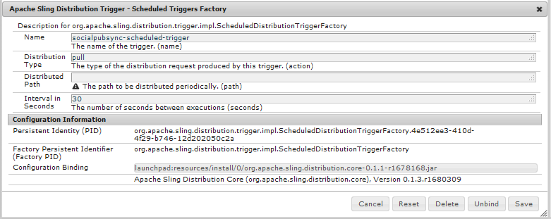

# Gebruikerssynchronisatie{#user-synchronization}

## Inleiding {#introduction}

Wanneer de plaatsing a [ landbouwbedrijf ](/help/sites-deploying/recommended-deploys.md#tarmk-farm) publiceert, moeten de leden login kunnen en hun gegevens op om het even welke knoop van Publish zien.

Gebruikers en gebruikersgroepen (gebruikersgegevens) die in de publicatieomgeving zijn gemaakt, zijn niet nodig in de ontwerpomgeving.

De meeste gebruikersgegevens die in de auteursomgeving zijn gemaakt, blijven in de auteursomgeving en worden niet naar Publish-instanties gekopieerd.

Registratie en wijzigingen die worden aangebracht op een Publish-instantie moeten worden gesynchroniseerd met andere Publish-instanties, anders hebben deze instanties geen toegang tot dezelfde gebruikersgegevens.

Vanaf AEM 6.1, wanneer gebruikerssynchronisatie wordt toegelaten, worden de gebruikersgegevens automatisch gesynchroniseerd over de instanties van Publish in het landbouwbedrijf en niet gecreeerd op auteur.

## Verspreiding {#sling-distribution}

De gebruikersgegevens, samen met hun [ ACLs ](/help/sites-administering/security.md), worden opgeslagen in de [ Kern van Oak ](/help/sites-deploying/platform.md), de laag onder Oak JCR, en worden betreden gebruikend [ Oak API ](https://developer.adobe.com/experience-manager/reference-materials/6-5/javadoc/org/apache/jackrabbit/oak/api/package-tree.html). Met infrequente updates, is het redelijk voor gebruikersgegevens om met andere instanties van Publish te worden gesynchroniseerd die [ het Verdelen van de Distributie van de Inhoud ](https://github.com/apache/sling-old-svn-mirror/blob/trunk/contrib/extensions/distribution/README.md) gebruiken (het Verdelen van distributie).

De voordelen van gebruikerssynchronisatie met de verkoopverdeling in vergelijking met traditionele replicatie zijn:

* *gebruikers*, *gebruikersprofielen*, en *gebruikersgroepen* die op Publish worden gecreeerd worden niet gecreeerd op Auteur

* Bij het splitsen van distributiesets worden eigenschappen in jcr-gebeurtenissen ingesteld, zodat u kunt werken binnen gebeurtenislisteners aan de serverzijde zonder dat u zich zorgen hoeft te maken over oneindige replicatielijnen
* Bij het verkopen van distributiegegevens worden alleen gebruikersgegevens naar niet-voortkomende Publish-instanties verzonden, waardoor onnodig verkeer wordt voorkomen
* [ ACLs ](/help/sites-administering/security.md) die in de gebruikersknoop wordt geplaatst is inbegrepen in de synchronisatie

>[!NOTE]
>
>Als de zittingen worden vereist, wordt het geadviseerd om of een oplossing SSO of een kleverige zitting te gebruiken en klanten te hebben login als zij aan een andere instantie van Publish worden geschakeld.

>[!CAUTION]
>
>De synchronisatie van de **beheerders** groep wordt niet gesteund, zelfs wanneer de gebruikerssynchronisatie wordt toegelaten. In plaats daarvan wordt een fout bij het importeren van de diff in het foutenlogboek geregistreerd.
>
>Daarom wanneer de plaatsing een publiceer landbouwbedrijf is, als een gebruiker aan of verwijderd uit de **beheerders** groep wordt toegevoegd, moet de wijziging manueel op elke instantie van Publish worden gemaakt.

## Gebruikerssynchronisatie inschakelen {#enable-user-sync}

>[!NOTE]
>
>Gebruikerssynchronisatie is standaard ingesteld op `disabled` .
>
>Het toelaten van gebruikerssynchronisatie impliceert het wijzigen van *bestaande* configuraties OSGi.
>
>Er mogen geen nieuwe configuraties worden toegevoegd als gevolg van het inschakelen van gebruikerssynchronisatie.

Gebruikerssynchronisatie is afhankelijk van de auteursomgeving voor het beheer van de gegevensdistributies van de gebruiker, ook al worden de gebruikersgegevens niet op de auteur gemaakt. Veel, maar niet alle, van de configuratie vindt plaats in de auteursomgeving en elke stap identificeert duidelijk of het op Auteur of Publish moet worden uitgevoerd.

Na zijn de stappen noodzakelijk om gebruikerssynchronisatie toe te laten, die door a [ wordt gevolgd het Oplossen van problemen ](#troubleshooting) sectie:

### Vereisten {#prerequisites}

1. Als de gebruikers en de gebruikersgroepen reeds op één instantie van Publish zijn gecreeerd, wordt het geadviseerd [ manueel te synchroniseren ](#manually-syncing-users-and-user-groups) de gebruikersgegevens aan alle instanties van Publish alvorens gebruikerssynchronisatie te vormen en toe te laten.

Zodra gebruikerssynchronisatie is ingeschakeld, worden alleen nieuwe gebruikers en groepen gesynchroniseerd.

1. Controleer of de laatste code is geïnstalleerd:

* [ AEM platformupdates ](https://experienceleague.adobe.com/docs/experience-manager-release-information/aem-release-updates/aem-releases-updates.html?lang=nl-NL)
* [AEM Communities-updates](/help/communities/deploy-communities.md#latestfeaturepack)

### 1. Apache Sling Distribution Agent - Sync Agents Factory {#apache-sling-distribution-agent-sync-agents-factory}

**laat gebruikerssynchronisatie** toe

* **op auteur**

   * aanmelden met beheerdersrechten
   * toegang tot de [ Console van het Web ](/help/sites-deploying/configuring-osgi.md)

      * bijvoorbeeld, [ https://localhost:4502/system/console/configMgr](https://localhost:4502/system/console/configMgr)

   * locate `Apache Sling Distribution Agent - Sync Agents Factory`

      * Selecteer de bestaande configuratie zodat u deze kunt openen voor bewerking (potloodpictogram)
Verifiëren `name`: **`socialpubsync`**

      * het selectievakje `Enabled` selecteren
      * select `Save`


### 2. Gemachtigde gebruiker maken {#createauthuser}

**vorm toestemmingen**

De geautoriseerde gebruiker wordt gebruikt in stap 3 om de verkoopdistributie op Auteur te configureren.

* **op elke instantie van Publish**

   * aanmelden met beheerdersrechten
   * toegang tot de [ Console van de Veiligheid ](/help/sites-administering/security.md)

      * bijvoorbeeld, [ https://localhost:4503/useradmin](https://localhost:4503/useradmin)

   * een gebruiker maken

      * bijvoorbeeld, `usersync-admin`

   * deze gebruiker toevoegen aan de gebruikersgroep van **`administrators`**
   * [voeg ACL voor deze gebruiker aan /home toe](#howtoaddacl)

      * `Allow jcr:all` met beperking `rep:glob=*/activities/*`

>[!CAUTION]
>
>Er moet een nieuwe gebruiker worden gemaakt.
>
>* De standaardgebruiker die wordt toegewezen, is **`admin`** .
>* Gebruik `communities-user-admin user.` niet
>

#### Hoe te om ACL toe te voegen {#addacls}

* access CRXDE Lite

   * bijvoorbeeld, [ https://localhost:4503/crx/de](https://localhost:4503/crx/de)

* select `/home` node
* in het rechterdeelvenster selecteert u de tab `Access Control`
* om een ACL ingang toe te voegen, selecteer de `+` knoop

   * **Belangrijk**: *onderzoek naar gebruiker die voor gebruikerssynchronisatie wordt gecreeerd*
   * **Type**: `Allow`
   * **Bevoegdheden**: `jcr:all`
   * **Beperkingen** `rep:glob`: `*/activities/*`
   * selecteren **O.K.**

* selecteren **sparen allen**

 toe

Zie ook

* [Toegangsbeheer](/help/sites-administering/user-group-ac-admin.md#access-right-management)
* De sectie van het oplossen van problemen [ wijzigt de Uitzondering van de Verrichting tijdens de Verwerking van de Reactie ](#modify-operation-exception-during-response-processing).

### 3. De Distributie van Granite van de Adobe - de Versleutelde Leverancier van het Vervoer van het Wachtwoord {#adobegraniteencpasswrd}

**vorm toestemmingen**

Zodra een geautoriseerd gebruiker-lid van de **`administrators`** gebruikersgroep-op alle instanties van Publish wordt gecreeerd, moet de gemachtigde gebruiker op Auteur worden geïdentificeerd als hebbend toestemming om gebruikersgegevens van Auteur aan Publish te synchroniseren.

* **op Auteur**

   * aanmelden met beheerdersrechten
   * toegang tot de [ Console van het Web ](/help/sites-deploying/configuring-osgi.md)

      * bijvoorbeeld, [ https://localhost:4502/system/console/configMgr](https://localhost:4502/system/console/configMgr)

   * locate `com.adobe.granite.distribution.core.impl.CryptoDistributionTransportSecretProvider.name`
   * om te openen voor bewerken, selecteert u de bestaande configuratie (potloodpictogram)
Verifiëren `property name`: **`socialpubsync-publishUser`**

   * reeks de gebruikersbenaming en het wachtwoord aan de [ erkende gebruiker ](#createauthuser) die op Publish in stap 2 wordt gecreeerd

      * bijvoorbeeld, `usersync-admin`


### 4. Apache Sling Distribution Agent - Queue Agents Factory {#apache-sling-distribution-agent-queue-agents-factory}

**laat gebruikerssynchronisatie** toe

* **op elke instantie van Publish**:

   * aanmelden met beheerdersrechten
   * toegang tot de [ Console van het Web ](/help/sites-deploying/configuring-osgi.md)

      * bijvoorbeeld, [ https://localhost:4503/system/console/configMgr](https://localhost:4503/system/console/configMgr)

   * locate `Apache Sling Distribution Agent - Queue Agents Factory`

      * om te openen voor bewerken, selecteert u de bestaande configuratie (potloodpictogram)
Verifiëren `Name`: `socialpubsync-reverse`

      * het selectievakje `Enabled` selecteren
      * select `Save`

   * **herhaal** voor elke instantie van Publish


### 5. Adobe Social Sync - Diff Observer Factory {#diffobserver}

**laat groepssynchronisatie** toe

* **op elke instantie van Publish**:

   * aanmelden met beheerdersrechten
   * toegang tot de [ Console van het Web ](/help/sites-deploying/configuring-osgi.md)

      * bijvoorbeeld, [ https://localhost:4503/system/console/configMgr](https://localhost:4503/system/console/configMgr)

   * locate **`Adobe Social Sync - Diff Observer Factory`**

      * om te openen voor bewerken, selecteert u de bestaande configuratie (potloodpictogram)

        Verifiëren `agent name`: `socialpubsync-reverse`

      * het selectievakje `Enabled` selecteren
      * select `Save`


### 6. Apache Sling Distribution Trigger - Scheduled Triggers Factory {#apache-sling-distribution-trigger-scheduled-triggers-factory}

**(Optioneel) Wijzig het opiniepeilingsinterval**

Standaard wordt elke 30 seconden een opiniepeiling gehouden bij Auteur. Dit interval wijzigen:

* **op Auteur**

   * aanmelden met beheerdersrechten
   * toegang tot de [ Console van het Web ](/help/sites-deploying/configuring-osgi.md)

      * bijvoorbeeld, [ https://localhost:4502/system/console/configMgr](https://localhost:4502/system/console/configMgr)

   * locate `Apache Sling Distribution Trigger - Scheduled Triggers Factory`

      * om te openen voor bewerken, selecteert u de bestaande configuratie (potloodpictogram)

         * Verifiëren `Name`: `socialpubsync-scheduled-trigger`

      * Stel de `Interval in Seconds` in op het gewenste interval
      * select `Save`



## Configureren voor meerdere Publish-instanties {#configure-for-multiple-publish-instances}

De standaardconfiguratie is voor één Publish-instantie. Aangezien gebruikerssynchronisatie moet worden ingeschakeld om meerdere Publish-instanties te synchroniseren, zoals voor een publicatiecentrum, moeten de extra Publish-instanties worden toegevoegd aan de fabriek van Agent synchroniseren.

### 7. Apache Sling Distribution Agent - Sync Agents Factory {#apache-sling-distribution-agent-sync-agents-factory-1}

**voeg de Instanties van Publish toe:**

* **op Auteur**

   * aanmelden met beheerdersrechten
   * toegang tot de [ Console van het Web ](/help/sites-deploying/configuring-osgi.md)

      * bijvoorbeeld, [ https://localhost:4502/system/console/configMgr](https://localhost:4502/system/console/configMgr)

   * locate `Apache Sling Distribution Agent - Sync Agents Factory`

      * om te openen voor bewerken, selecteert u de bestaande configuratie (potloodpictogram)
Verifiëren `Name`: `socialpubsync`


* **Eindpunten van de Exporteur**
Voor elke Publish-instantie moet er een eindpunt voor de exporteur zijn. Als er bijvoorbeeld 2 Publish-instanties zijn, localhost:4503 en 4504, moeten er twee items zijn:

   * `https://localhost:4503/libs/sling/distribution/services/exporters/socialpubsync-reverse`
   * `https://localhost:4504/libs/sling/distribution/services/exporters/socialpubsync-reverse`

* **Eindpunten van de Importeur**
Voor elke Publish-instantie moet er een eindpunt voor de importer zijn. Als er bijvoorbeeld 2 Publish-instanties zijn, localhost:4503 en 4504, moeten er twee items zijn:

   * `https://localhost:4503/libs/sling/distribution/services/importers/socialpubsync`
   * `https://localhost:4504/libs/sling/distribution/services/importers/socialpubsync`

* select `Save`

### 8. AEM Communities-gebruikerssynchronisatielistener {#aem-communities-user-sync-listener}

**(Optioneel) Aanvullende JCR-knooppunten synchroniseren**

Als er aangepaste gegevens zijn die over meerdere Publish-instanties moeten worden gesynchroniseerd, geldt het volgende:

* **op elke instantie van Publish**:

   * aanmelden met beheerdersrechten
   * toegang tot de [ Console van het Web ](/help/sites-deploying/configuring-osgi.md)

      * bijvoorbeeld, `https://localhost:4503/system/console/configMgr`

   * locate `AEM Communities User Sync Listener`
   * om te openen voor bewerken, selecteert u de bestaande configuratie (potloodpictogram)
Verifiëren `Name`: `socialpubsync-scheduled-trigger`


* **de Types van Knoop**
Dit is de lijst van knooptypes die worden gesynchroniseerd. Elk knooppunttype anders dan sling:Folder moet hier worden vermeld (sling:folder wordt afzonderlijk behandeld).
Standaardlijst met knooppunttypen die moeten worden gesynchroniseerd:

   * rep:gebruiker
   * nt:ongestructureerd
   * nt:resource

* **genegeerde Eigenschappen**
Dit is de lijst met eigenschappen die worden genegeerd als er wijzigingen worden gedetecteerd. Wijzigingen in deze eigenschappen worden mogelijk gesynchroniseerd als neveneffect van andere wijzigingen (aangezien synchronisatie altijd op knooppuntniveau plaatsvindt), maar wijzigingen in deze eigenschappen activeren op zichzelf geen synchronisatie.
Standaardeigenschap die moet worden genegeerd:

   * cq:lastModified

* **Genegeerde Knoop**
Subpaden die tijdens synchronisatie worden genegeerd. Niets onder deze subpaden wordt op elk moment gesynchroniseerd.
Te negeren standaardknooppunten:

   * .tokens
   * systeem

* **Verdeelde Omslagen**
De meeste stappen:Mappen worden genegeerd omdat synchronisatie niet nodig is. De weinige uitzonderingen staan hier vermeld.
Te synchroniseren standaardmappen

   * segmenten/scoring
   * sociale/relaties
   * activiteiten

### 9. Unieke verkoper-id {#unique-sling-id}

>[!CAUTION]
>
>Als de verkoop-id overeenkomt met twee of meer Publish-instanties, mislukt de synchronisatie van de gebruikersgroep.

Als Verschuivende id hetzelfde is voor meerdere Publish-instanties in een publicatiecentrum, worden gebruikersgroepen niet gesynchroniseerd.

Om te controleren of alle waarden voor de Verschuivende id verschillen, moet u voor elke Publish-instantie controleren:

1. bladeren naar `http://<host>:<port>/system/console/status-slingsettings`
1. controleer de waarde van **het Schipen identiteitskaart**


Als de Verschuivende-id van een Publish-instantie overeenkomt met de Verschuivende-id van een andere Publish-instantie, dan:

1. Stop een van de Publish-instanties met een overeenkomstige id voor verkopers
1. in de map crx-quickstart/launch/felix

   * onderzoek naar en schrap het dossier genoemd *sling.id.file*

      * bijvoorbeeld op een Linux®-systeem:

        `rm -i $(find . -type f -name sling.id.file)`

      * bijvoorbeeld op een Windows-systeem:

        `use windows explorer and search for *sling.id.file*`

1. Publish-instantie starten

   * bij het opstarten wordt er een nieuwe verkoop-id toegewezen

1. bevestig dat **het Verdelen identiteitskaart** nu uniek is

Herhaal deze stappen totdat alle Publish-instanties een unieke id voor verkopers hebben.

## Vault Package Builder-fabriek {#vault-package-builder-factory}

Voor updates die correct worden gesynchroniseerd, is het nodig om de builder van het vault-pakket te wijzigen voor gebruikerssynchronisatie:

* op elke AEM Publish-instantie
* toegang tot de [ Console van het Web ](/help/sites-deploying/configuring-osgi.md)

   * bijvoorbeeld, [ https://localhost:4503/system/console/configMgr](https://localhost:4503/system/console/configMgr)

* de locatie van `Apache Sling Distribution Packaging - Vault Package Builder Factory`

   * `Builder name: socialpubsync-vlt`

* het pictogram voor bewerken selecteren
* twee toevoegen `Package Node Filters` :

   * `/home/users|-.*/.tokens`
   * `/home/users|-.*/rep:cache`

* beleidsafhandeling:

   * om bestaande rep:beleidsknopen met nieuwe te overschrijven, voeg een derde Filter van het Pakket toe:

      * `/home/users|+.*/rep:policy`

   * om te voorkomen dat het beleid wordt verspreid,

      * `Acl Handling:` `IGNORE`


## Wat gebeurt er als ... {#what-happens-when}

### Gebruikerszelfregistraties of -bewerkingsprofiel op Publish {#user-self-registers-or-edits-profile-on-publish}

Gebruikers en profielen die in de publicatieomgeving (zelfregistratie) zijn gemaakt, worden per ontwerp niet weergegeven in de ontwerpomgeving.

Wanneer de topologie a [ landbouwbedrijf ](/help/sites-deploying/recommended-deploys.md#tarmk-farm) publiceert en de gebruikerssynchronisatie correct is gevormd, wordt het *gebruiker* en *gebruikersprofiel* gesynchroniseerd over het publiceerlandbouwbedrijf gebruikend het Schuiven distributie.

### Gebruikers of gebruikersgroepen worden gemaakt met Beveiligingsconsole {#users-or-user-groups-are-created-using-security-console}

Gebruikersgegevens die in de publicatieomgeving zijn gemaakt, worden door het ontwerp niet weergegeven in de auteursomgeving en omgekeerd.

Wanneer de [ console van het Beleid van de Gebruiker en van de Veiligheid ](/help/sites-administering/security.md) wordt gebruikt om nieuwe gebruikers in toe te voegen publiceert milieu, synchroniseert de gebruikerssynchronisatie de nieuwe gebruikers en hun groepslidmaatschap aan andere instanties van Publish, indien nodig. Gebruikerssynchronisatie synchroniseert ook gebruikersgroepen die zijn gemaakt via de beveiligingsconsole.

## Problemen oplossen {#troubleshooting}

### Gebruikerssynchronisatie offline uitvoeren {#how-to-take-user-sync-offline}

Om gebruikerssynchronisatie off-line te nemen, om [ een instantie van Publish ](#how-to-remove-a-publish-instance) of [ manueel synchronisatiegegevens ](#manually-syncing-users-and-user-groups) te verwijderen, moet de distributierij leeg en stil zijn.

Om de staat van de distributierij te controleren:

* op auteur:

   * het gebruiken [ CRXDE Lite ](/help/sites-developing/developing-with-crxde-lite.md)

      * zoeken naar items in `/var/sling/distribution/packages`

         * mapknooppunten met het patroon `distrpackage_*`

   * gebruikend [ Manager van het Pakket ](/help/sites-administering/package-manager.md)

      * zoeken naar hangende pakketten (nog niet geïnstalleerd)

         * benoemd met het patroon `socialpubsync-vlt*`
         * gemaakt door `communities-user-admin`

Schakel gebruikerssynchronisatie uit wanneer de distributiestrijd leeg is:

* op auteur

   * *uncheck *the `Enabled` checkbox voor [ Apache die de Agent van de Distributie - de Factory van de Agenten van de Synchronisatie ](#apache-sling-distribution-agent-sync-agents-factory)

Wanneer de taken worden voltooid, om gebruikerssynchronisatie opnieuw toe te laten:

* op auteur

   * controleer `Enabled` checkbox voor [ Apache die de Agent van de Distributie - de Factory van de Agenten van de Synchronisatie ](#apache-sling-distribution-agent-sync-agents-factory)

### Diagnostiek gebruikerssynchronisatie {#user-sync-diagnostics}

Diagnostiek voor gebruikerssynchronisatie is een programma dat de configuratie controleert en probeert eventuele problemen op te sporen.

Op Auteur, navigeer eenvoudig van de belangrijkste console door **Hulpmiddelen, Verrichtingen, Diagnose, Diagnose van de Synchronisatie van de Gebruiker.**

Als u gewoon de diagnostische console voor gebruikerssynchronisatie invoert, worden de resultaten weergegeven.

Dit is wat wordt getoond wanneer de Synchronisatie van de Gebruiker niet is toegelaten:

 wordt toegelaten

#### Diagnostiek voor Publish-instanties uitvoeren {#how-to-run-diagnostics-for-publish-instances}

Wanneer het diagnostiek van het auteursmilieu in werking wordt gesteld, omvatten de pas/ontkent resultaten een [ sectie van INFO ] tonend de lijst van gevormde instanties van Publish voor bevestiging.

In de lijst is een URL opgenomen voor elke Publish-instantie die de diagnostiek voor die instantie uitvoert. De url param `syncUser` wordt toegevoegd aan diagnostiek URL met zijn waarde die aan *wordt geplaatst erkende synchronisatiegebruiker* in [ Stap 2 ](#createauthuser) wordt gecreeerd.

**Nota**: alvorens URL te lanceren, moet de *erkende synchronisatiegebruiker* reeds in die instantie van Publish worden ondertekend.


### Configuratie onjuist toegevoegd {#configuration-improperly-added}

Wanneer de gebruikerssynchronisatie niet werkt, is het gemeenschappelijkste probleem dat de extra configuraties ** werden toegevoegd. In plaats daarvan, zou de *existing *default configuratie *moeten worden uitgegeven*.

Na zijn meningen van hoe uitgegeven, standaardconfiguraties in de Console van het Web zouden moeten verschijnen. Als er meerdere exemplaren worden weergegeven, moet de toegevoegde configuratie worden verwijderd.

#### (Auteur) Eén Apache Sling Distribution Agent - fabriek van Sync Agents {#author-one-apache-sling-distribution-agent-sync-agents-factory}


#### (Auteur) Eén Apache Sling Distribution Transport Credentials - Gebruikersreferenties gebaseerd DistributionTransportSecretProvider {#author-one-apache-sling-distribution-transport-credentials-user-credentials-based-distributiontransportsecretprovider}


#### (Publish) Eén Apache Sling Distribution Agent - Queue Agents Factory {#publish-one-apache-sling-distribution-agent-queue-agents-factory}


#### (Publish) One Adobe Social Sync - Diff Observer Factory {#publish-one-adobe-social-sync-diff-observer-factory}


#### (Auteur) Eén Apache Sling Distribution Trigger - Geplande Triggers Factory {#author-one-apache-sling-distribution-trigger-scheduled-triggers-factory}


### Uitzondering bewerking wijzigen tijdens reactieverwerking {#modify-operation-exception-during-response-processing}

Als het volgende zichtbaar is in het logboek:

`org.apache.sling.servlets.post.impl.operations.ModifyOperation Exception during response processing.`

`java.lang.IllegalStateException: This tree does not exist`

Dan verifieer dat de sectie [ 2. Creeer Gemachtigde Gebruiker ](#createauthuser) werd behoorlijk gevolgd.

Deze sectie beschrijft het creëren van een erkende gebruiker, die op alle instanties van Publish bestaat, en het identificeren van hen in de &quot;Secret Provider&quot;OSGi config op auteur. De gebruiker is standaard `admin` .

De geautoriseerde gebruiker moet lid zijn van de gebruikersgroep van **`administrators`** en de machtigingen voor die groep mogen niet worden gewijzigd.

De geautoriseerde gebruiker moet expliciet de volgende rechten en beperkingen hebben voor alle Publish-instanties:

| **weg** | **jcr:allen** | **rep:glob** |
|---|---|---|
| /home | X | &#42;/activities/&#42; |
| /home/users | X | &#42;/activities/&#42; |
| /home/groups | X | &#42;/activities/&#42; |

Als lid van de `administrators` -groep moet de geautoriseerde gebruiker de volgende rechten hebben voor alle Publish-instanties:

| **weg** | **jcr:allen** | **jcr:read** | **rep:write** |
|---|---|---|---|
| /etc/packages/sling/distribution |  |  | X |
| /libs/sling/distribution |  | X |  |
| /var |  |  | X |
| /var/eventing |  | X | X |
| /var/sling/distribution |  | X | X |

### Synchronisatie van gebruikersgroep is mislukt {#user-group-sync-failed}

Als de verkoop-id overeenkomt met twee of meer Publish-instanties, mislukt de synchronisatie van de gebruikersgroep.

Zie sectie [ 9. Unieke verkoop-id ](#unique-sling-id)

### Gebruikers en gebruikersgroepen handmatig synchroniseren {#manually-syncing-users-and-user-groups}

* op Publish-instanties waarop gebruikers en gebruikersgroepen aanwezig zijn:

   * [indien ingeschakeld, gebruikerssynchronisatie uitschakelen](#how-to-take-user-sync-offline)
   * [ creeer een pakket ](/help/sites-administering/package-manager.md#creating-a-new-package) van `/home`

      * bij het bewerken van het pakket

         * Tabblad Filters: Filter toevoegen: basispad: `/home`
         * Geavanceerd, tabblad: AC-verwerking: `Overwrite`

   * [het pakket exporteren](/help/sites-administering/package-manager.md#downloading-packages-to-your-file-system)

* op andere Publish-instanties:

   * [het pakket importeren](/help/sites-administering/package-manager.md#installing-packages)

Om gebruikerssynchronisatie te vormen of toe te laten, ga naar stap 1: [ Apache Sling Distribution Agent - de Factory van de Agenten van de Synchronisatie ](#apache-sling-distribution-agent-sync-agents-factory)

### Wanneer een Publish-instantie niet beschikbaar wordt {#when-a-publish-instance-becomes-unavailable}

Wanneer een Publish-exemplaar niet meer beschikbaar is, mag het niet worden verwijderd als het later weer online komt. Wijzigingen worden in een wachtrij voor de Publish-instantie geplaatst en wanneer de instantie weer online is, worden de wijzigingen verwerkt.

Als de Publish-instantie nooit online terugkomt, als deze offline is, moet deze worden verwijderd omdat de build van de wachtrij leidt tot een merkbaar gebruik van schijfruimte in de Auteur-omgeving.

Wanneer een Publish-instantie is ingedrukt, bevat het auteurlog soortgelijke uitzonderingen als de volgende:

```
28.01.2016 15:57:48.475 ERROR
 [pool-12-thread-34-org_apache_sling_distribution_queue_socialpubsync_endpoint1
 (org/apache/sling/distribution/queue/socialpubsync/endpoint1)]
 org.apache.sling.distribution.agent.impl.SimpleDistributionAgent [agent][socialpubsync] could not deliver package distrpackage_1454014575838_a2b45ec8-0400-42f3-bed8-ae09b66381cb
 org.apache.sling.distribution.packaging.DistributionPackageImportException: failed in importing package ...
```

### Een Publish-instantie verwijderen {#how-to-remove-a-publish-instance}

Om een geval van Publish uit [ Apache te verwijderen die de Agent van de Distributie - de Factory van de Agenten van de Synchronisatie ](#apache-sling-distribution-agent-sync-agents-factory) segmenteren, moet de distributierij leeg en stil zijn.

* op auteur:

   * [Gebruikerssynchronisatie offline uitvoeren](#how-to-take-user-sync-offline)
   * volg [ stap 7 ](#apache-sling-distribution-agent-sync-agents-factory) om de instantie van Publish uit beide serverlijsten te verwijderen:

      * `Exporter Endpoints`
      * `Importer Endpoints`

   * gebruikerssynchronisatie opnieuw inschakelen

      * controleer `Enabled` checkbox voor [ Apache die de Agent van de Distributie - de Factory van de Agenten van de Synchronisatie ](#apache-sling-distribution-agent-sync-agents-factory)
