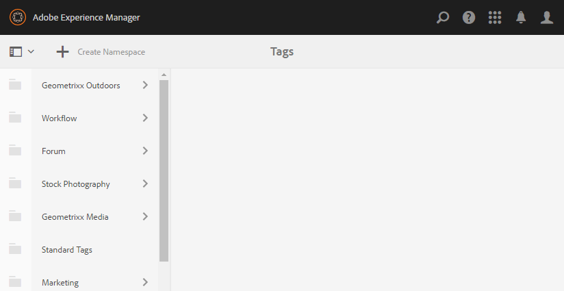
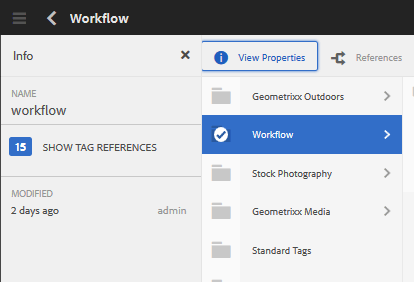
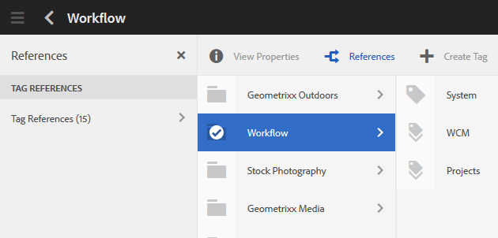
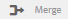
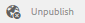
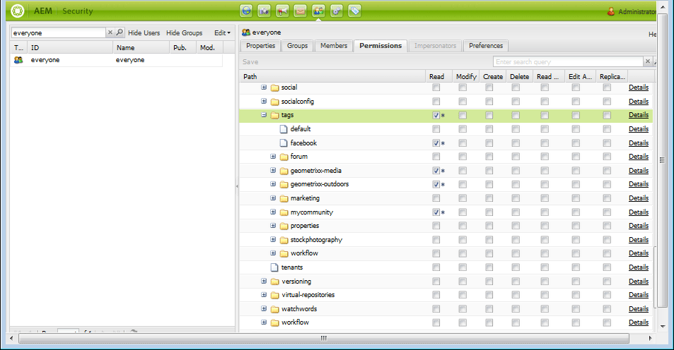

# Tags beheren {#administering-tags}

Tags zijn een snelle en eenvoudige methode om inhoud binnen een website te classificeren. U kunt ze beschouwen als trefwoorden of labels (metagegevens) waarmee inhoud sneller kan worden gevonden als resultaat van een zoekopdracht.

In Adobe Experience Manager (AEM) kan een tag een eigenschap zijn van

* een inhoudsknoop voor een pagina (zie [ Gebruikend Markeringen ](/help/sites-authoring/tags.md))

* een meta-gegevensknoop voor een activa (zie [ het Leiden Meta-gegevens voor Digitale Assets ](/help/assets/metadata.md))

Naast pagina&#39;s en elementen worden tags gebruikt voor AEM Communities-functies

* gebruiker produceerde inhoud (zie [ Tagend UGC) ](/help/communities/tag-ugc.md)

* De Middelen van Enablement (zie {de Middelen van 0} Tagging Enablement ](/help/communities/functions.md#catalog-function))[

## Functies voor tags {#tag-features}

Enkele eigenschappen van markeringen binnen AEM omvatten:

* Tags kunnen in verschillende naamruimten worden gegroepeerd. Dergelijke hiërarchieën maken het mogelijk taxonomieën te bouwen. Deze taxonomieën zijn wereldwijd in AEM.
* De belangrijkste beperking voor nieuwe tags is dat deze uniek moeten zijn binnen een specifieke naamruimte.
* De titel van een tag mag geen scheidingstekens voor het pad van de tag bevatten (en deze worden ook niet weergegeven als deze aanwezig zijn)

   * dubbele punt `:` - hiermee definieert u de naamruimtetag
   * slash `/` - subtags worden gescheiden

* Tags kunnen door auteurs en bezoekers van de site worden toegepast. Ongeacht de maker van de tags worden alle typen tags beschikbaar gemaakt voor selectie, zowel bij het toewijzen aan een pagina als bij het zoeken.
* Tags kunnen worden gemaakt en de bijbehorende taxonomie kan worden gewijzigd door leden van de groep &#39;tagbeheerders&#39; en leden die wijzigingsrechten hebben op `/content/cq:tags` .

   * Een tag die onderliggende tags bevat, wordt aangeduid als een containertag
   * Een tag die geen containertag is, wordt aangeduid als een bladtag
   * Een tagnaamruimte is een bladtag of een containertag

* De markeringen worden gebruikt door de [ component van het Onderzoek ](https://helpx.adobe.com/experience-manager/core-components/using/quick-search.html) om het vinden van inhoud te vergemakkelijken.
* De markeringen worden gebruikt door de [ component van het Teaser ](https://helpx.adobe.com/experience-manager/core-components/using/teaser.html), die de de markeringswolk van een gebruiker controleert om gerichte inhoud te verstrekken.
* Als labelen een belangrijk aspect van uw inhoud is

   * zorg ervoor dat de labels worden verpakt met de pagina&#39;s die deze gebruiken
   * zorg ervoor {de toestemmingen van 0} markering ](#setting-tag-permissions) leestoegang toelaten[

## Tagingsconsole {#tagging-console}

De Tagingconsole wordt gebruikt om tags en hun taxonomieën te maken en te beheren. Een van de doelstellingen is om te voorkomen dat er veel gelijksoortige tags zijn die in wezen op hetzelfde ding betrekking hebben, bijvoorbeeld pagina&#39;s en pagina&#39;s of schoeisel en schoenen.

Tags worden beheerd door groeperen in naamruimten, het gebruik van bestaande tags evalueren voordat u nieuwe tags maakt en opnieuw ordenen zonder dat de tag wordt losgekoppeld van de inhoud waarnaar momenteel wordt verwezen.

De tagconsole openen:

* op auteur
* aanmelden met beheerdersrechten
* van globale navigatie

   * select **`Tools`**
   * select **`General`**
   * select **`Tagging`**

### Een naamruimte maken {#creating-a-namespace}

Als u een naamruimte wilt maken, selecteert u het pictogram **`Create Namespace`** .

De naamruimte is zelf een tag en bevat geen subtags. Nochtans, om een taxonomie te blijven creëren, [ creeer subtags ](#creating-tags), die beurtelings of bladmarkeringen of containermarkeringen kunnen zijn.

 

* **Titel**
  *(vereist)* Een vertoningstitel voor namespace.

* **Naam**
  *(facultatief)* Een naam voor namespace. Als er geen waarde wordt opgegeven, wordt een geldige knooppuntnaam gemaakt op basis van de titel. Zie [ TagID ](/help/sites-developing/framework.md#tagid).

* **Beschrijving**
  *(facultatief)* Een beschrijving van namespace.

Zodra de vereiste informatie is ingevoerd

* selecteren **creeer**

### Bewerkingen op codes {#operations-on-tags}

Als u een naamruimte of andere tag selecteert, worden de volgende bewerkingen beschikbaar gesteld:

* [Eigenschappen weergeven](#viewing-tag-properties)
* [Verwijzingen](#showing-tag-references)
* [Tag maken](#creating-tags)
* [Bewerken](#editing-tags)
* [Verplaatsen](#moving-tags)
* [Samenvoegen](#merging-tags)
* [Publish](#publishing-tags)
* [Publiceren ongedaan maken](#unpublishing-tags)
* [Verwijderen](#deleting-tags)

Wanneer het browservenster niet breed genoeg is om alle pictogrammen weer te geven, worden de meest rechtse pictogrammen gegroepeerd onder een **`... More`** -pictogram. Hierin wordt een vervolgkeuzelijst van de verborgen bewerkingspictogrammen weergegeven wanneer deze zijn geselecteerd.

### Een naamruimtetag selecteren {#selecting-a-namespace-tag}

Wanneer deze optie voor het eerst is geselecteerd en de naamruimte geen tags bevat, worden de eigenschappen rechts weergegeven, anders worden de onderliggende tags weergegeven. Elke geselecteerde tag geeft de tags in de tag weer of de eigenschappen ervan als deze geen onderliggende tags bevat.

Als u de tag voor bewerkingen wilt selecteren en meerdere selecties wilt maken, selecteert u alleen het pictogram naast de titel. Als u de titel selecteert, worden alleen eigenschappen weergegeven of wordt de tag geopend om de inhoud ervan weer te geven.

 

### Tageigenschappen weergeven {#viewing-tag-properties}

Wanneer een naamruimte of andere tag wordt geselecteerd en u het pictogram **`View Properties`** selecteert, wordt informatie over `name` , het tijdstip van de laatste bewerking en het aantal verwijzingen weergegeven. Indien gepubliceerd, wordt de tijd het laatst werd gepubliceerd en identiteitskaart van de uitgever getoond. Deze informatie wordt in een kolom links van de tagkolommen weergegeven.

### Tagverwijzingen weergeven {#showing-tag-references}

Wanneer een namespace of andere markering wordt geselecteerd, die zal het **pictogram van Verwijzingen** selecteren de inhoud identificeren waarop de markering is toegepast.

De eerste weergave is een aantal toegepaste labels.

Als u de pijl rechts van de telling selecteert, worden de referentienamen weergegeven.

Het pad naar de verwijzing wordt weergegeven als knopinfo wanneer u de muisaanwijzer op een verwijzing plaatst.

### Tags maken {#creating-tags}

Wanneer een naamruimte of andere tag is geselecteerd (door het pictogram naast de titel te selecteren), kan een onderliggende tag voor de huidige tag worden gemaakt door het pictogram **`Create Tag`** te selecteren.

* **Titel**
*(vereist) *A display title for the tag.

* **Naam**
*(optioneel) *Een naam voor de tag. Als er geen waarde wordt opgegeven, wordt een geldige knooppuntnaam gemaakt op basis van de titel. Zie [ TagID ](/help/sites-developing/framework.md#tagid).

* **Beschrijving**
*(optioneel) *Een beschrijving van de tag.

Zodra de vereiste informatie is ingevoerd

* selecteren **creeer**

### Tags bewerken {#editing-tags}

Wanneer een namespace of een andere markering wordt geselecteerd, is het mogelijk om de Titel, Beschrijving te veranderen, en localisaties van de Titel te verstrekken door het **`Edit`**pictogram te selecteren.

Nadat wordt aangebracht uitgeeft, uitgezocht **sparen**.

Voor details over het toevoegen van taalvertalingen, zie de sectie over [ het Leiden Markeringen in Verschillende Talen ](#managing-tags-in-different-languages).

### Labels verplaatsen {#moving-tags}

Wanneer een naamruimte of een andere tag wordt geselecteerd en u het pictogram **`Move`** selecteert, kunnen tagbeheerders en -ontwikkelaars de taxonomie opschonen door de tag naar een nieuwe locatie te verplaatsen of de naam ervan te wijzigen. Wanneer de geselecteerde tag een containertag is, worden bij het verplaatsen van de tag ook alle onderliggende tags verplaatst.

>[!NOTE]
>
>Het wordt geadviseerd dat de Auteurs slechts worden toegestaan ](#editing-tags) uit te geven de markering `title`, om geen markeringen te bewegen of anders te noemen.[

* **Weg**
  *(alleen-lezen)* Het huidige pad naar de geselecteerde tag.

* **Beweging aan**
Blader naar het nieuwe pad waaronder u de tag wilt verplaatsen.

* **anders noemen aan**
Toont aanvankelijk huidig `name` van de markering. Een nieuw `name` kan zijn ingegaan.

* selecteren **sparen**

### Tags samenvoegen {#merging-tags}

U kunt tags samenvoegen wanneer een taxonomie duplicaten bevat. Wanneer label A wordt samengevoegd met label B, worden alle pagina&#39;s met label A getagd met label B en is label A niet meer beschikbaar voor auteurs.

Wanneer een namespace of een andere markering wordt geselecteerd, die het **pictogram van de Fusie** selecteert opent een paneel waar de weg om in samen te voegen kan worden geselecteerd.

* **Weg**
  *(alleen-lezen)* Het pad van de geselecteerde tag die moet worden samengevoegd met een andere tag.

* **Fusie in**
Blader naar het pad van de tag waarin u wilt samenvoegen.

>[!NOTE]
>
>Na de fusie, zal het **Weg** oorspronkelijk geselecteerde (vrijwel) niet meer bestaan.
>
>Wanneer een tag waarnaar wordt verwezen wordt verplaatst of samengevoegd, wordt de tag niet fysiek verwijderd, zodat verwijzingen behouden kunnen blijven.

### Codes publiceren {#publishing-tags}

Wanneer een namespace of andere markering wordt geselecteerd, die het **pictogram van Publish** selecteren om de markering in te activeren publiceert milieu. Net als bij pagina-inhoud wordt alleen de geselecteerde tag gepubliceerd, ongeacht of het een containertag is of niet.

Om een taxonomie (a namespace en sub-markeringen) te publiceren, moet de beste praktijk a [ pakket ](/help/sites-administering/package-manager.md) van namespace (zie [ Knoop van de Wortel van de Taxonomie ](/help/sites-developing/framework.md#taxonomy-root-node)) tot stand brengen. Ben zeker om [ toestemmingen ](#setting-tag-permissions) op namespace toe te passen alvorens het pakket te creëren.

### Publicatie van labels ongedaan maken {#unpublishing-tags}

Wanneer een namespace of een andere markering wordt geselecteerd, zal het selecteren **unpublish** pictogram de markering in het auteursmilieu deactiveren en het verwijderen uit het publicatiemilieu. Gelijkaardig aan de `Delete` verrichting, als de geselecteerde markering een containermarkering is, zullen alle zijn kindmarkeringen in het auteursmilieu worden gedeactiveerd en uit het publicatiemilieu worden verwijderd.

### Tags verwijderen {#deleting-tags}

Wanneer een namespace of andere markering wordt geselecteerd, zal het selecteren van **Schrapping** pictogram permanent de markering uit het auteursmilieu verwijderen. Als de tag is gepubliceerd, wordt deze ook verwijderd uit de publicatieomgeving. Als de geselecteerde tag een containertag is, worden ook alle onderliggende tags verwijderd.

## Tagmachtigingen instellen {#setting-tag-permissions}

De toestemmingen van de markering zijn [ &quot;veilig (door gebrek)&quot;](/help/sites-administering/production-ready.md); een beste praktijken voor het publicatiemilieu dat leestoestemming vereist om uitdrukkelijk voor markeringen worden toegestaan. Dit gebeurt in eerste instantie door een pakket van de tagnaamruimte te maken nadat de machtigingen bij de auteur zijn ingesteld en het pakket op alle publicatieinstanties te installeren.

* op instantie van auteur

   * aanmelden met beheerdersrechten
   * toegang tot de [ Console van de Veiligheid ](/help/sites-administering/security.md#accessing-user-administration-with-the-security-console),

      * blader bijvoorbeeld naar http://localhost:4502/useradmin

   * in de linkerruit, selecteer de groep (of de gebruiker) waarvoor [ leest toestemming ](/help/sites-administering/security.md#permissions) moet worden verleend
   * Zoek in het rechterdeelvenster het **Pad **naar de tagnaamruimte

      * bijvoorbeeld, `/content/cq:tags/mycommunity`

   * selecteer `checkbox` in de **Gelezen** kolom
   * selecteren **sparen**

* ervoor zorgen dat alle publicatieexemplaren dezelfde machtigingen hebben

   * één benadering moet [ een pakket ](/help/sites-administering/package-manager.md#package-manager) van namespace op auteur tot stand brengen

      * op `Advanced` , voor `AC Handling` select `Overwrite`

   * het pakket herhalen

      * kies `Replicate` in pakketbeheer

## Tags beheren in verschillende talen {#managing-tags-in-different-languages}

Het `title` bezit van een markering kan in veelvoudige talen worden vertaald. Zodra vertaald, kan de aangewezen markering `title` volgens de gebruikerstaal of aan de paginalaal worden getoond.

### Tagtitels definiëren in meerdere talen {#defining-tag-titles-in-multiple-languages}

Het volgende beschrijft hoe te om `title` van de markering **Dieren** van Engels in Duits en Frans te vertalen.

Begin door de markering onder de **Fotografie van de Voorraad** te selecteren namespace en het pictogram ** `Edit` **te selecteren (zie [ het Uitgeven van Markeringen ](#editing-tags) sectie).

In het deelvenster Tag bewerken kunt u talen kiezen waarin de titel van de tag moet worden gelokaliseerd.

Terwijl elke taal is geselecteerd, wordt een tekstinvoervak weergegeven waarin de vertaalde titel kan worden ingevoerd.

Zodra alle vertalingen zijn ingegaan, uitgezocht **sparen** om uit te gaan geef wijze uit.

In het algemeen wordt de taal die voor de tag wordt gekozen, ontleend aan de paginataal, indien beschikbaar. Wanneer de [`tag` widget ](/help/sites-developing/building.md#tagging-on-the-client-side) in andere gevallen wordt gebruikt (bijvoorbeeld in formulieren of in dialoogvensters), is de taal van de tag afhankelijk van de context.

In plaats van de instelling voor de paginataal te gebruiken, gebruikt de Tagingconsole de taalinstelling van de gebruiker. In de Tagingconsole wordt voor de tag &#39;Dieren&#39; de tag &#39;Animaux&#39; weergegeven voor een gebruiker die de taal in zijn gebruikerseigenschappen instelt op Frans.

Om een nieuwe taal aan de dialoog toe te voegen, zie [ Toevoegend een Nieuwe Taal aan de Edit Dialoog van de Markering ](/help/sites-developing/building.md#adding-a-new-language-to-the-edit-tag-dialog).

>[!NOTE]
>
>De markeringswolk en de metatrefwoorden in de standaardpaginacomponent gebruiken de gelokaliseerde markering `titles` die op de paginalaal wordt gebaseerd, als beschikbaar.

## Bronnen {#resources}

* [Tags voor ontwikkelaars](/help/sites-developing/tags.md)

  Informatie over het coderingsframework en het uitbreiden en opnemen van codes in aangepaste toepassingen.

* [Klassieke UI-tagconsole](/help/sites-administering/classic-console.md)
