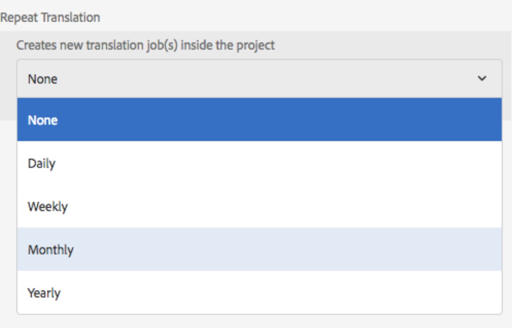

# Verbeterde vertalingen{#translation-enhancements}

Deze pagina biedt incrementele verbeteringen en verfijningen voor AEM vertaalbeheermogelijkheden.

## Automatisering vertaalproject {#translation-project-automation}

Er zijn opties toegevoegd om de productiviteit bij vertaalprojecten te verbeteren, zoals het automatisch promoten en verwijderen van lanceringen van vertalingen en het plannen van de terugkerende uitvoering van een vertaalproject.

1. In uw vertaalproject, klik of tik de ellips bij de bodem van de **Tile van de Vertaling Summiere**.

   

1. Schakel over naar het tabblad **Geavanceerd**. Onderaan kunt u **Translation Launches automatisch bevorderen** selecteren.

   

1. U kunt desgewenst instellen of het starten van vertalingen na ontvangst van vertaalde inhoud automatisch moet worden bevorderd en verwijderd.

   

1. Selecteer de frequentie met de vervolgkeuzelijst onder **Vertaling herhalen** om de terugkerende uitvoering van een vertaalproject te selecteren. Het terugkomen van projectuitvoering zal automatisch vertaalbanen in de gespecificeerde intervallen creëren en uitvoeren.

   

## Meertalige vertaalprojecten {#multilingual-translation-projects}

Het is mogelijk om veelvoudige doeltalen in een vertaalproject te vormen, om het totale aantal gecreeerde vertaalprojecten te verminderen.

1. Klik of tik in uw vertaalproject op de puntjes onder aan de tegel **Vertaaloverzicht**.

   

1. Schakel over naar het tabblad **Geavanceerd**. U kunt meerdere talen toevoegen onder **Doeltaal**.

   

1. U kunt ook talen toevoegen en **Meertalige vertaalproject maken** selecteren als u vertaling via de verwijzingstag in Sites start.

   

1. In het project worden vertaalbanen gecreëerd voor elke doeltaal. Zij kunnen of één voor één binnen het project, of allen in één keer zijn begonnen door het project globaal in Projecten Admin uit te voeren.

   

## Updates van vertaalgeheugen {#translation-memory-updates}

Handmatige bewerkingen van vertaalde inhoud kunnen worden gesynchroniseerd met het TMS (Translation Management System) om het vertaalgeheugen te trainen.

1. Selecteer **Vertaalgeheugen bijwerken** in de Sites-console na het bijwerken van tekstinhoud in een vertaalde pagina.

   

1. Een lijstmening toont een zij-aan-zij vergelijking van de bron en de vertaling voor elke tekstcomponent die werd uitgegeven. Selecteer welke vertalingsupdates moeten worden gesynchroniseerd met Vertaalgeheugen en selecteer **Geheugen bijwerken**.

   

   >[!NOTE]
   >
   >AEM stuurt de geselecteerde tekenreeksen terug naar het vertaalbeheersysteem.

## Taalkopieën op meerdere niveaus {#language-copies-on-multiple-levels}

Taalwortels kunnen nu worden gegroepeerd onder knooppunten, bijvoorbeeld per regio, terwijl ze nog steeds worden herkend als wortels van taalkopieën.

>[!CAUTION]
>
>Er is slechts één niveau toegestaan. Met de volgende code kan de pagina &#39;es&#39; bijvoorbeeld niet worden omgezet in een taalkopie:
>
>* `/content/we-retail/language-masters/en`
>* `/content/we-retail/language-masters/americas/central-america/es`

>
>
Dit `es` taalexemplaar zal niet worden ontdekt aangezien het 2 niveaus (americas/centraal-america) vanaf `en` knoop is.

>[!NOTE]
>
>Taalwortels kunnen elke paginanaam hebben, in plaats van alleen de ISO-code van de taal. AEM zal altijd het pad en de naam eerst controleren, maar als de paginanaam geen taal identificeert, zal AEM de eigenschap cq:language van de pagina controleren op de taalidentificatie.

## Rapportering vertaalstatus {#translation-status-reporting}

Een eigenschap kan nu worden geselecteerd in de lijstweergave Sites, die aangeeft of een pagina is vertaald, vertaald of nog niet is vertaald. Deze weergeven:

1. Schakel in Sites over op **Lijstweergave.**

   

1. Klik of tik **Instellingen weergeven**.

   

1. Schakel het selectievakje **Vertaald** onder **Vertaling** in en tik op **Bijwerken**.

   

U kunt nu een **Vertaalde** kolom zien die de vertaalstatus van de pagina&#39;s toont.

