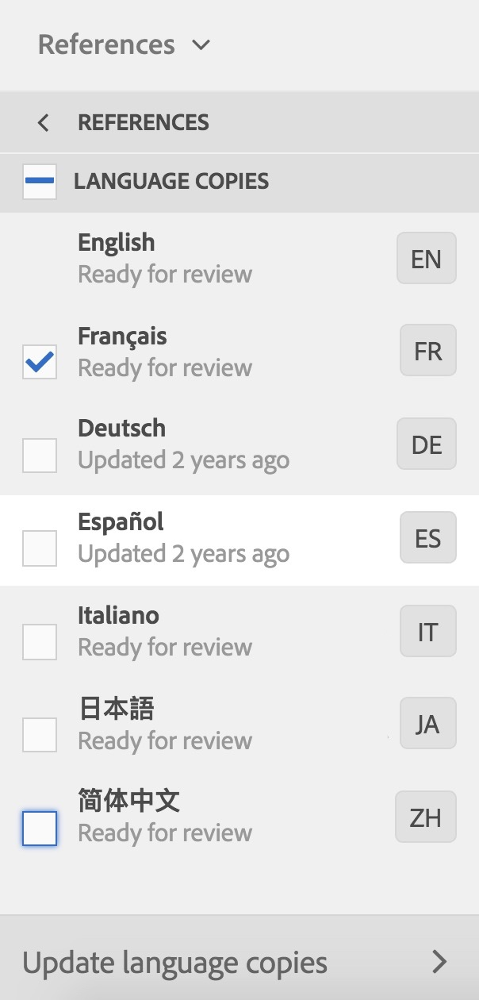
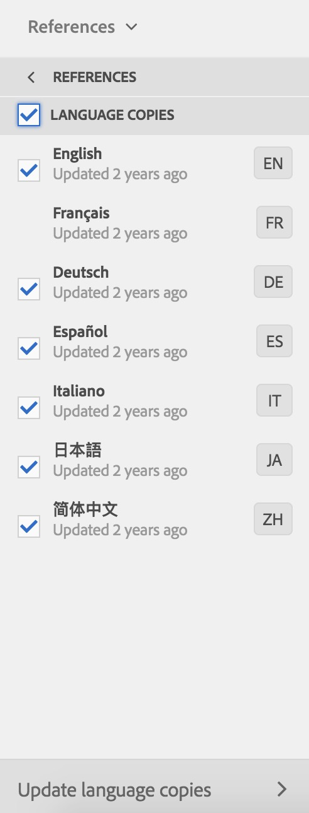

# Vertaalprojecten beheren{#managing-translation-projects}

Nadat u de inhoud hebt voorbereid voor vertaling, moet u de taalstructuur voltooien door ontbrekende taalkopieën te maken en vertaalprojecten te maken.

Met vertaalprojecten kunt u de vertaling van AEM inhoud beheren. Een vertaalproject is een type van AEM [project](/help/sites-authoring/projects.md) dat middelen bevat die in andere talen moeten worden vertaald. Deze bronnen zijn de pagina&#39;s en elementen van de [taalkopieën](/help/sites-administering/tc-prep.md) die zijn gemaakt op basis van de master taal.

Wanneer middelen aan een vertaalproject worden toegevoegd, wordt een vertaalbaan gecreeerd voor hen. Taken bieden opdrachten en statusinformatie die u gebruikt om de workflows voor het vertalen van mensen en computers die op de bronnen worden uitgevoerd, te beheren.

>[!NOTE]
>
>Een vertaalproject kan meerdere vertaaltaken bevatten.

Vertaalprojecten zijn langlopende items, die door taal- en vertaalmethode/provider worden gedefinieerd om te worden afgestemd op organisatorisch bestuur voor globalization. Zij moeten eenmaal worden gestart, hetzij tijdens de eerste vertaling, hetzij handmatig, en blijven van kracht gedurende de gehele update van inhoud en vertaling.

Vertaalprojecten en -taken worden gecreëerd met workflows voor het voorbereiden van vertalingen. Deze workflows hebben drie opties, voor zowel de eerste vertaling (Maken&amp;Vertalen) als de updates (Vertaling bijwerken):

1. [Nieuw project maken](#creating-translation-projects-using-the-references-panel)
1. [Toevoegen aan bestaand project](#adding-pages-to-a-translation-project)
1. [Alleen inhoudsstructuur](#creating-the-structure-of-a-language-copy)

>[!NOTE]
>
>Optie 3 houdt geen verband met vertaalwerk/project. Hiermee kunt u inhoud en structurele wijzigingen in de taal die is master voor (onvertaalde) taalkopieën kopiëren. U kunt dit gebruiken om uw taalmeesters synchroon te houden, zelfs zonder vertaling.

## Eerste vertalingen uitvoeren en bestaande vertalingen bijwerken {#performing-initial-translations-and-updating-existing-translations}

AEM ontdekt of een vertaalproject voor de aanvankelijke vertaling van inhoud wordt gecreeerd, of reeds-vertaalde taalexemplaren bijwerken. Wanneer u een vertaalproject voor een pagina creeert en de taalexemplaren aangeeft waarvoor u vertaalt, AEM ontdekt of de bronpagina reeds in de gerichte taalexemplaren bestaat:

* **De pagina is niet opgenomen in de taalkopie:** AEM behandelt deze situatie als de eerste vertaling. De pagina wordt onmiddellijk gekopieerd naar de taalkopie en opgenomen in het project. Wanneer de vertaalde pagina in AEM wordt geïmporteerd, AEM deze rechtstreeks naar de taalkopie gekopieerd.
* **De taalkopie bevat al de pagina:** AEM behandelt deze situatie als een bijgewerkte vertaling. Er wordt een startpagina gemaakt en een kopie van de pagina wordt toegevoegd aan de startpagina en opgenomen in het project. Met behulp van Starten kunt u bijgewerkte vertalingen controleren voordat u deze doorgeeft aan de taalkopie:

   * Wanneer de vertaalde pagina in AEM wordt geïmporteerd, wordt de pagina tijdens het opstarten overschreven.
   * De vertaalde pagina overschrijft de taalkopie alleen wanneer de introductie wordt bevorderd.

Bijvoorbeeld, wordt de /content/geometrixx/fr taalwortel gecreeerd voor de Franse vertaling van de /content/geometrixx/en master taal. Er zijn geen andere pagina&#39;s in de Franse taalkopie.

* Er wordt een vertaalproject gemaakt voor de pagina /content/geometrixx/nl/products en alle onderliggende pagina&#39;s, met als doelversie de Franse taalkopie. Omdat de taalkopie niet de pagina /content/geometrixx/fr/products bevat, kopieert AEM onmiddellijk de pagina /content/geometrixx/en/products en alle onderliggende pagina&#39;s naar de Franse taalkopie. De kopieën worden ook in het vertaalproject opgenomen.
* Er wordt een vertaalproject gemaakt voor de pagina /content/geometrixx/nl en alle onderliggende pagina&#39;s die zich richten op de Franse taalkopie. Omdat de taalkopie de pagina bevat die overeenkomt met de pagina /content/geometrixx/nl (de hoofdtaal), AEM de pagina /content/geometrixx/nl en alle onderliggende pagina&#39;s gekopieerd en toegevoegd aan een opstart. De kopieën worden ook in het vertaalproject opgenomen.

## Vertaalprojecten maken met het deelvenster Verwijzingen {#creating-translation-projects-using-the-references-panel}

Maak vertaalprojecten zodat u de workflow voor het vertalen van de master bronnen kunt uitvoeren en beheren. Wanneer u projecten maakt, geeft u de pagina op in de master taal die u vertaalt en de taalkopieën waarvoor u de vertaling uitvoert:

* De wolkenconfiguratie van het kader van de vertaalintegratie dat met de geselecteerde pagina wordt geassocieerd bepaalt vele eigenschappen van de vertaalprojecten, zoals het vertaalwerkschema aan gebruik.
* Er wordt een project gemaakt voor elke geselecteerde taalkopie.
* Er wordt een kopie van de geselecteerde pagina en de bijbehorende elementen gemaakt en aan elk project toegevoegd. Deze kopieën worden later naar de vertaalprovider verzonden voor vertaling.

U kunt opgeven dat de onderliggende pagina&#39;s van de geselecteerde pagina ook worden geselecteerd. In dit geval worden ook kopieën van de onderliggende pagina&#39;s aan elk project toegevoegd, zodat deze worden vertaald. Wanneer om het even welke kindpagina&#39;s met verschillende configuraties van het kader van de vertaalintegratie worden geassocieerd, AEM leidt tot extra projecten.

U kunt ook [handmatig vertaalprojecten maken](#creating-a-translation-project-using-the-projects-console).

**Eerste vertalingen en Bijwerken van vertalingen**

In het deelvenster Verwijzingen wordt aangegeven of de bestaande taalkopieën worden bijgewerkt of dat de eerste versie van de taalkopieën wordt gemaakt. Wanneer een taalexemplaar voor de geselecteerde pagina bestaat, lijkt het lusje van de Exemplaren van de Taal van de Update toegang tot project-verwante bevelen te verlenen.

Na het vertalen, kunt u [de vertaling ](#reviewing-and-promoting-updated-content) alvorens het taalexemplaar met het te beschrijven herzien. Als er geen taalkopie voor de geselecteerde pagina bestaat, wordt op het tabblad Maken en vertalen toegang weergegeven tot opdrachten die betrekking hebben op het project.

### Vertaalprojecten maken voor een nieuwe taalkopie {#create-translation-projects-for-a-new-language-copy}

1. Gebruik de console van Plaatsen om de pagina te selecteren die u aan vertaalprojecten toevoegt.

   Als u bijvoorbeeld de Engelse pagina&#39;s van de demo-site van Geometrixx wilt vertalen, selecteert u Geometrixx demo-site > Engels.

1. Klik of tik op Verwijzingen op de werkbalk.

   

1. Selecteer Exemplaren van de Taal, en selecteer dan de taalexemplaren waarvoor u de bronpagina&#39;s vertaalt.
1. Klik of tik op Maken en vertalen en configureer de vertaaltaak:

   * Gebruik de drop-down Talen om een taalexemplaar te selecteren waarvoor u wilt vertalen. Selecteer desgewenst extra talen. Talen die in de lijst verschijnen komen overeen met de [taalwortels die u](/help/sites-administering/tc-prep.md#creating-a-language-root) hebt gecreeerd.
   * Selecteer Alle subpagina&#39;s selecteren als u de geselecteerde pagina en alle onderliggende pagina&#39;s wilt vertalen. Als u alleen de geselecteerde pagina wilt vertalen, schakelt u de optie uit.
   * Selecteer Nieuw vertaalproject maken bij Project.
   * Typ een naam voor het project.

   

1. Klik of tik op Maken.

### Vertaalprojecten maken voor een bestaande taalkopie {#create-translation-projects-for-an-existing-language-copy}

1. Gebruik de console van Plaatsen om de pagina te selecteren die u aan de vertaalprojecten toevoegt.

   Als u bijvoorbeeld de Engelse pagina&#39;s van de demo-site van Geometrixx wilt vertalen, selecteert u Geometrixx demo-site > Engels.

1. Klik of tik op Verwijzingen op de werkbalk.

   

1. Selecteer Exemplaren van de Taal, en selecteer dan de taalexemplaren waarvoor u de bronpagina&#39;s vertaalt.
1. Klik of tik de Exemplaren van de Taal van de Update en vorm dan de vertaalbaan:

   * Selecteer Alle subpagina&#39;s selecteren als u de geselecteerde pagina en alle onderliggende pagina&#39;s wilt vertalen. Als u alleen de geselecteerde pagina wilt vertalen, schakelt u de optie uit.
   * Selecteer Nieuw vertaalproject maken bij Project.
   * Typ een naam voor het project.

   

1. Klik of tik op Start.

## Pagina&#39;s toevoegen aan een vertaalproject {#adding-pages-to-a-translation-project}

Nadat u een vertaalproject hebt gecreeerd, kunt u de ruit van Middelen gebruiken om pagina&#39;s aan het project toe te voegen. Het toevoegen van pagina&#39;s is handig wanneer u pagina&#39;s van verschillende vertakkingen in hetzelfde project opneemt.

Wanneer u pagina&#39;s toevoegt aan een vertaalproject, worden de pagina&#39;s opgenomen in een nieuwe vertaaltaak. U kunt ook [pagina&#39;s toevoegen aan een bestaande taak](#adding-pages-assets-to-a-translation-job).

Net zoals bij het maken van een nieuw project, worden bij het toevoegen van pagina&#39;s kopieën van de pagina&#39;s zo nodig toegevoegd aan een opstart om te voorkomen dat bestaande taalkopieën worden overschreven. (Zie [Vertaalprojecten maken voor bestaande taalkopieën](#performing-initial-translations-and-updating-existing-translations).)

1. Gebruik de console van Plaatsen om de pagina te selecteren die u aan het vertaalproject toevoegt.

   Als u bijvoorbeeld de Engelse pagina&#39;s van de demo-site van Geometrixx wilt vertalen, selecteert u Geometrixx demo-site > Engels.

1. Klik of tik op Verwijzingen op de werkbalk.

   

1. Selecteer Exemplaren van de Taal, en selecteer dan de taalexemplaren waarvoor u de bronpagina&#39;s vertaalt.

   

1. Klik of tik de Exemplaren van de Taal van de Update en vorm dan de eigenschappen:

   * Selecteer Alle subpagina&#39;s selecteren als u de geselecteerde pagina en alle onderliggende pagina&#39;s wilt vertalen. Als u alleen de geselecteerde pagina wilt vertalen, schakelt u de optie uit.
   * Selecteer bij Project de optie Toevoegen aan bestaand vertaalproject.
   * Selecteer het project.

   >[!NOTE]
   >
   >De doeltaal die is ingesteld in het vertaalproject moet overeenkomen met het pad van de taalkopie zoals wordt weergegeven in het deelvenster Verwijzingen.

   

1. Klik of tik op Start.

## Pagina&#39;s/elementen toevoegen aan een vertaaltaak {#adding-pages-assets-to-a-translation-job}

U kunt pagina&#39;s, elementen, tags of i18n-woordenboeken toevoegen aan de vertaaltaak van uw vertaalproject. Pagina&#39;s of elementen toevoegen:

1. Klik of tik op de ellips onder aan de tegel Vertaaltaak van het vertaalproject.

   

1. Klik of tik op Toevoegen en Pagina&#39;s/middelen.

   

1. Selecteer het bovenste item van de vertakking die u wilt toevoegen en klik of tik op het pictogram van het vinkje. U kunt meerdere selecties maken.

   

1. U kunt ook het zoekpictogram selecteren om gemakkelijk te zoeken naar pagina&#39;s of elementen die u aan uw vertaaltaak wilt toevoegen.

   

Uw pagina&#39;s en/of middelen worden toegevoegd aan uw vertaalbaan.

## i18n-woordenboeken toevoegen aan een vertaaltaak {#adding-i-n-dictionaries-to-a-translation-job}

U kunt pagina&#39;s, elementen, tags of i18n-woordenboeken toevoegen aan de vertaaltaak van uw vertaalproject. Een i18n-woordenboek toevoegen:

1. Klik of tik op de ellips onder aan de tegel Vertaaltaak van het vertaalproject.

   

1. Klik of tik op Toevoegen en I18N-woordenboek.

   

1. Selecteer het woordenboek dat u wilt toevoegen en klik op Toevoegen of tik op de knop Toevoegen.

   

Uw woordenboek staat nu in uw vertaalbaan.

>[!NOTE]
>
>Lees [Vertaal gebruiken om woordenboeken te beheren](/help/sites-developing/i18n-translator.md) voor meer informatie over i18n-woordenboeken.

## Tags toevoegen aan een vertaaltaak {#adding-tags-to-a-translation-job}

U kunt pagina&#39;s, elementen, tags of i18n-woordenboeken toevoegen aan de vertaaltaak van uw vertaalproject. Tags toevoegen:

1. Klik of tik op de ellips onder aan de tegel Vertaaltaak van het vertaalproject.

   

1. Klik op Toevoegen of tik op Toevoegen en vervolgens op Labels.

   

1. Selecteer de tags die u wilt toevoegen en klik of tik op het pictogram van het vinkje. U kunt meerdere selecties maken.

   

Uw labels worden nu toegevoegd aan uw vertaaltaak.

## Details van vertaalproject bekijken {#seeing-translation-project-details}

De tegel Vertaaloverzicht bevat de eigenschappen die voor een vertaalproject worden gevormd. Naast de generische [projectinformatie](/help/sites-authoring/projects.md#project-info), bevat het lusje van de Vertaling vertaling-specifieke eigenschappen:

* Brontaal: De taal van de pagina&#39;s die worden vertaald.
* Doeltaal: De taal waarin de pagina&#39;s worden vertaald.
* Vertaalmethode: De vertaalworkflow. Menselijke vertaling of Machine Translation wordt ondersteund.
* Vertaalbureau: De vertaalserviceprovider die de vertaling uitvoert.
* Inhoudscategorie: (Machine Translation) De inhoudscategorie die wordt gebruikt voor het vertalen.
* Cloudconfiguratie: De wolkenconfiguratie voor de schakelaar van de vertaaldienst die voor het project wordt gebruikt.

Wanneer een project gebruikend de ruit van Middelen van een pagina wordt gecreeerd, worden deze eigenschappen automatisch gevormd gebaseerd op de eigenschappen van de bronpagina.

## De status van een vertaaltaak {#monitoring-the-status-of-a-translation-job} controleren

De tegel Vertaal baan van een Vertaalproject verstrekt de status van een vertaalbaan, evenals het aantal pagina&#39;s en activa in de baan.

In de volgende tabel wordt elke status beschreven die een taak of een item in de taak kan hebben:

| Status | Beschrijving |
|---|---|
| Concept | De vertaaltaak is niet gestart. Vertaal banen zijn in de status van het CONCEPT wanneer zij worden gecreeerd. |
| Verzonden | Bestanden in de vertaaltaak hebben deze status wanneer ze naar de vertaalservice zijn verzonden. Deze status kan voorkomen nadat het bevel van het Toepassingsgebied van het Verzoek of het bevel van het Begin wordt uitgegeven. |
| Gevraagd bereik | Voor de workflow Menselijke vertaling zijn de bestanden in de taak voor bereiking naar de leverancier van de vertaling verzonden. Deze status wordt weergegeven nadat de opdracht Toepassingsgebied aanvragen is uitgevoerd. |
| Bereik voltooid | De leverancier heeft het bereik van de vertaaltaak. |
| Toegewezen voor vertaling | De eigenaar van het project heeft het toepassingsgebied geaccepteerd. Deze status geeft aan dat de leverancier van de vertaling moet beginnen met het vertalen van de bestanden in de taak. |
| Bezig met omzetten | Voor een taak is de vertaling van een of meer bestanden in de taak nog niet voltooid. Voor een item in de taak wordt het item vertaald. |
| Vertaald | Voor een taak is de vertaling van alle bestanden in de taak voltooid. Voor een item in de taak wordt het item vertaald. |
| Gereed voor revisie | Het item in de taak wordt omgezet en het bestand is geïmporteerd in AEM. |
| Voltooid | De eigenaar van het project heeft aangegeven dat het vertaalcontract volledig is. |
| Annuleren | Geeft aan dat de leverancier van de vertaling moet stoppen met het werken aan een vertaaltaak. |
| Foutupdate | Er is een fout opgetreden bij het overdragen van bestanden tussen AEM en de vertaalservice. |
| Onbekende status | Er is een onbekende fout opgetreden. |

Als u de status van elk bestand in de taak wilt zien, klikt of tikt u op de ellips onder aan de tegel.

## Vervaldatum van vertaaltaken instellen {#setting-the-due-date-of-translation-jobs}

Geef de datum op waarop de leverancier van de vertaling vertaalde bestanden moet retourneren. U kunt de vervaldatum voor het project of voor een specifieke baan plaatsen:

* **Project:** Vertaal banen in het project erven de vervaldatum.
* **Taak:** de vervaldatum die u voor de baan plaatst treedt de vervaldatum met voeten die voor het project wordt geplaatst.

Het instellen van de vervaldatum werkt alleen correct wanneer de leverancier van de vertaling die u gebruikt deze functie ondersteunt.

In de volgende procedure wordt de vervaldatum voor een project vastgesteld.

1. Klik of tik op de ellips onder aan de tegel Vertaaloverzicht.

   

1. Gebruik op het tabblad Standaard de datumkiezer van de eigenschap Einddatum om de vervaldatum te selecteren.

   

1. Klik of tik op Gereed.

De volgende procedure stelt de vervaldatum voor een vertaalbaan vast.

1. Klik of tik op het menu Opdrachten in het onderdeel Vertaaltaak en klik of tik op Vervaldatum.

   

1. Klik of tik in het dialoogvenster op het kalenderpictogram, selecteer vervolgens de datum en tijd die u als vervaldatum wilt gebruiken en klik op Opslaan.

   

## Een vertaaltaak opsplitsen {#scoping-a-translation-job}

Bereik een vertaalbaan om een schatting van de kosten van vertaling van uw vertaaldienstverlener te verkrijgen. Wanneer u een taak instelt, worden bronbestanden verzonden naar de leverancier van de vertaling die de tekst vergelijkt met de groep met opgeslagen vertalingen (vertaalgeheugen). Doorgaans is het bereik het aantal woorden dat moet worden vertaald.

Neem contact op met uw vertaalleverancier voor meer informatie over bereikresultaten.

>[!NOTE]
>
>Scoping is optioneel. U kunt een vertaalbaan zonder scoping beginnen.

Wanneer u een vertaalbaan werkingsgebied, is de status van de baan `Scope Requested`. Wanneer de vertaalleverancier het werkingsgebied terugkeert, wordt de status veranderd in `Scope Completed`. Wanneer het werkingsgebied wordt voltooid, kunt u het tonen bevel van het Toepassingsgebied gebruiken om het scoping resultaten te herzien.

De bereikfuncties werken alleen correct wanneer de leverancier van de vertaling die u gebruikt deze functie ondersteunt.

1. In de console van Projecten, open uw vertaalproject.
1. Klik of tik op het menu Opdrachten in het onderdeel Vertaaltaak en klik of tik op Toepassingsgebied aanvragen.

   

1. Als de taakstatus verandert in SCOPE_COMPLETED, klikt of tikt u op het onderdeel Vertaal taak op het menu Opdrachten en klikt of tikt u op Bereik tonen.

## Een vertaaltaak starten {#starting-a-translation-job}

Start een vertaaltaak om de bronpagina&#39;s naar de doeltaal te vertalen. De vertaling wordt uitgevoerd volgens de bezitswaarden van de Omzettingssummiere tegel.

Nadat u de vertaaltaak hebt gestart, wordt in de tegel Vertaal-taak de status Vertaling in uitvoering weergegeven.

1. In de console van Projecten, open het vertaalproject.
1. Klik of tik op het menu Opdrachten in het onderdeel Vertaaltaak en klik op Start.

   

1. Klik of tik op Sluiten in het dialoogvenster Handeling waarin het starten van de vertaling wordt bevestigd.

## Een vertaaltaak {#canceling-a-translation-job} annuleren

Een vertaaltaak annuleren om het vertaalproces te stoppen en te voorkomen dat de leverancier van de vertaling verdere vertalingen uitvoert. U kunt een taak annuleren wanneer de taak de status `Committed For Translation` of `Translation In Progress` heeft.

1. In de console van Projecten, open het vertaalproject.
1. Klik of tik op het menu Opdrachten in het onderdeel Vertaal taak op Annuleren.
1. Klik of tik op OK in het dialoogvenster Handeling dat de annulering van de vertaling bevestigt.

## Workflow {#accept-reject-workflow} accepteren/afwijzen

Wanneer de inhoud na de vertaling terug komt en klaar voor revisie is, kunt u de vertaalbaan in gaan en inhoud goedkeuren/verwerpen.

Als u Vertaling negeren selecteert, kunt u een opmerking toevoegen.

Als u inhoud afwijst, wordt deze teruggestuurd naar de leverancier van de vertaling waar de opmerking kan worden weergegeven.

## Bijgewerkte inhoud beoordelen en promoten {#reviewing-and-promoting-updated-content}

Wanneer de inhoud voor een bestaand taalexemplaar wordt vertaald, herzie de vertalingen, breng veranderingen indien nodig aan, en publiceer dan de vertalingen om het naar het taalexemplaar te bewegen. U kunt vertaalde bestanden reviseren wanneer in de vertaaltaak de status Gereed voor revisie wordt weergegeven.

1. Selecteer de pagina in de master taal, klik of tik op Verwijzingen en klik op Taalkopieën of tik op Taalkopieën.
1. Klik of tik op de taalkopie om te reviseren.

   

1. Klik op Starten of tik op Starten om de opdrachten voor Starten weer te geven.

   

1. Klik op Pagina openen om het startexemplaar van de pagina te openen om de inhoud te bekijken en bewerken.
1. Klik op Promote nadat u de inhoud hebt bekeken en de benodigde wijzigingen hebt aangebracht om de opstartafbeelding te promoten.
1. Geef op de pagina Starten bevorderen op welke pagina&#39;s u wilt promoten en klik of tik op Promote.

## Taalkopieën vergelijken {#comparing-language-copies}

Taalkopieën vergelijken met de Master taal:

1. Navigeer in de console **Sites** naar de taalkopie die u wilt vergelijken.
1. Open het deelvenster **[Referenties](/help/sites-authoring/basic-handling.md#references)**.
1. Selecteer onder de kop **Kopieën** **Taalkopieën.**
1. Selecteer uw specifieke taalkopie en klik op **Vergelijken met Master **of **Vergelijken met vorige **indien van toepassing.

   

1. De twee pagina&#39;s (opstart en bron) worden naast elkaar geopend.

   Zie [Paginadiff](/help/sites-authoring/page-diff.md) voor volledige informatie over het gebruik van deze functie.

## Vertaal- en archiveringstaken {#completing-and-archiving-translation-jobs} voltooien

Voltooi een vertaalbaan nadat u de vertaalde dossiers van de verkoper hebt herzien. Voor workflows voor menselijke vertaling geeft het voltooien van een vertaling de verkoper aan dat het vertaalcontract is uitgevoerd en dat hij de vertaling in zijn vertaalgeheugen moet opslaan.

Nadat u de taak hebt voltooid, heeft de taak de status Voltooid.

Archiveer een vertaaltaak nadat deze is voltooid en u hoeft de gegevens over de taakstatus niet meer te zien. Wanneer u de taak archiveert, wordt de tegel Vertaal van de Baan verwijderd uit het project.

## De structuur maken van een taalkopie {#creating-the-structure-of-a-language-copy}

Vul de taalkopie zodanig dat deze inhoud bevat uit de master taal die u vertaalt. Voordat u uw taalkopie kunt vullen, moet u [de hoofdtaal](/help/sites-administering/tc-prep.md#creating-a-language-root) van de taalkopie hebben gemaakt.

1. Gebruik de console van Plaatsen om de taalwortel van de master taal te selecteren die u als bron gebruikt. Als u bijvoorbeeld de Engelse pagina&#39;s van de demo-site van Geometrixx wilt vertalen, selecteert u Inhoud > Geometrixx demo-site > Engels.
1. Klik of tik op Verwijzingen op de werkbalk.

   

1. Selecteer Taalkopieën en selecteer vervolgens de taalkopieën die u wilt vullen.

   

1. Klik of tik de Exemplaren van de Taal van de Update om de vertaalhulpmiddelen te openbaren, en de eigenschappen te vormen:

   * Selecteer de optie Alle subpagina&#39;s selecteren.
   * Selecteer bij Project de optie Alleen structuur maken.

   

1. Klik of tik op Start.

## Een vertaalproject maken met de projectconsole {#creating-a-translation-project-using-the-projects-console}

U kunt een vertaalproject manueel tot stand brengen als u verkiest de console van Projecten te gebruiken.

Wanneer u handmatig een vertaalproject maakt, moet u naast de [basiseigenschappen](/help/sites-authoring/touch-ui-managing-projects.md#creating-a-project) ook waarden opgeven voor de volgende translatie-gerelateerde eigenschappen:

* **Naam:** Projectnaam.
* **Brontaal:** de taal van de broninhoud.
* **Doeltaal:** de taal waarin de inhoud wordt vertaald.
* **Omzettingsmethode:** selecteer Menselijke vertaling om erop te wijzen dat de vertaling manueel moet worden uitgevoerd.

1. Klik of tik op Maken op de werkbalk van de projectenconsole.
1. Selecteer de sjabloon Vertaalproject en klik of tik op Volgende.
1. Voer waarden in voor de eigenschappen Standaard.
1. Klik op Geavanceerd of tik op Geavanceerd en geef waarden op voor de eigenschappen die betrekking hebben op vertaling.
1. Klik of tik op Maken. Klik of tik op Gereed in het bevestigingsvak om terug te keren naar de Projectconsole of klik op Project openen of tik op Project openen om het project te openen en te beheren.

## Een vertaaltaak exporteren {#exporting-a-translation-job}

U kunt de inhoud van een vertaalbaan downloaden, bijvoorbeeld om naar een vertaalleverancier te verzenden die niet met AEM via een schakelaar geïntegreerd is, of om de inhoud te herzien.

1. Klik of tik op Exporteren in het vervolgkeuzemenu van het onderdeel Vertaal taak.
1. Klik of tik in het dialoogvenster Exporteren op Geëxporteerd bestand downloaden en gebruik indien nodig het dialoogvenster van de webbrowser om het bestand op te slaan.
1. Klik of tik op Sluiten in het dialoogvenster Exporteren.

## Een vertaaltaak {#importing-a-translation-job} importeren

U kunt vertaalde inhoud in AEM importeren, bijvoorbeeld wanneer uw vertaalbureau de inhoud naar u stuurt omdat deze niet via een connector is geïntegreerd met AEM.

1. Klik of tik op Importeren in het vervolgkeuzemenu van het onderdeel Vertaal taak.
1. Selecteer in het dialoogvenster van de webbrowser het bestand dat u wilt importeren.
1. Klik of tik op Sluiten in het dialoogvenster Importeren.

