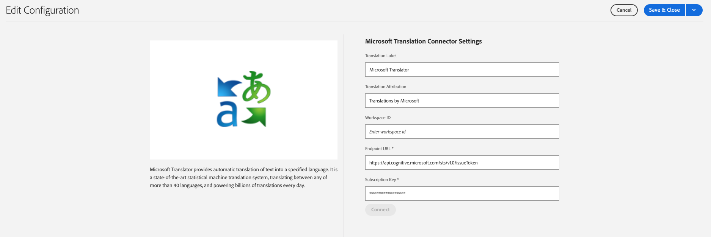

# Verbinding maken met Microsoft Translator {#connecting-to-microsoft-translator}

AEM verstrekt een ingebouwde schakelaar voor [&#x200B; Vertaler van Microsoft &#x200B;](https://www.microsoft.com/en-us/translator/business/) om paginainhoud of activa te vertalen. Nadat u van Microsoft een licentie hebt verkregen voor het gebruik van Microsoft Translator, configureert u de connector volgens de instructies op deze pagina.

| Eigenschap | Beschrijving |
|---|---|
| Vertaallabel | De weergavenaam voor de vertaalservice |
| Vertaalkenmerk | (Optioneel) Voor door de gebruiker gegenereerde inhoud wordt de toewijzing naast vertaalde tekst weergegeven, bijvoorbeeld `Translations by Microsoft` |
| Workspace-id | (Optioneel) De id van de aangepaste Microsoft Translator-engine die u wilt gebruiken |
| Subscription Key | Je Microsoft Subscription Key voor Microsoft Translator |

De volgende procedure leidt tot een configuratie van de Vertaler van Microsoft.

1. In het [&#x200B; navigatievenster, &#x200B;](/help/sites-authoring/basic-handling.md#first-steps) klik **Hulpmiddelen** > **Cloud Servicen** > **Cloud Servicen van de Vertaling**.
1. Navigeer naar de locatie waar u de configuratie wilt maken. Normaal gesproken bevindt dit zich in de hoofdmap van de site of kan het een algemene standaardconfiguratie zijn.
1. Klik **creeer** knoop.
1. Definieer uw configuratie.
   1. Selecteer **Vertaler van Microsoft** in drop-down.
   1. Typ een titel voor de configuratie. De titel identificeert de configuratie in de console van Cloud Servicen en in de drop-down lijsten van het paginabezit.
   1. Typ desgewenst een naam die u wilt gebruiken voor het knooppunt in de opslagplaats dat de configuratie opslaat.

   

1. Klik **creëren**.
1. In **geef het venster van de Configuratie** uit, verstrek de waarden voor de vertaaldienst die in de vorige lijst wordt beschreven.

    uit

1. Klik **verbinden** om de verbinding te verifiëren.
1. Klik **sparen &amp; Sluiten**.

## De configuraties van de vertaalservice publiceren {#publishing-the-translator-service-configurations}

Als definitieve stap, gelieve uw configuraties van de Vertaler van Microsoft te publiceren om gepubliceerde vertaalde inhoud te steunen, gebruikend [&#x200B; het publiceren van een boom &#x200B;](/help/sites-authoring/publishing-pages.md#publishing-and-unpublishing-a-tree) actie.
