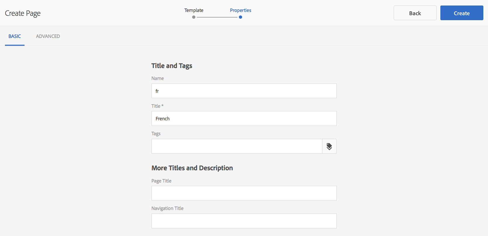

# Inhoud voorbereiden voor vertaling{#preparing-content-for-translation}

Meertalige websites bieden over het algemeen inhoud in meerdere talen. De site is gemaakt in één taal en wordt vervolgens vertaald in andere talen. In het algemeen bestaan meertalige sites uit vertakkingen van pagina&#39;s, waarbij elke vertakking de pagina&#39;s van de site in een andere taal bevat.

De voorbeeldsite voor demo-demo bevat verschillende taalvertakkingen en gebruikt de volgende structuur:

```xml
/content
    |- geometrixx
             |- en
             |- fr
             |- de
             |- es
             |- it
             |- ja
             |- zh
```

Elke taalvertakking van een site wordt een taalkopie genoemd. De hoofdpagina van een taalkopie, ook wel de hoofdtaal genoemd, identificeert de taal van de inhoud in de taalkopie. `/content/geometrixx/fr` is bijvoorbeeld de hoofdtaal voor de Franse taalkopie. De exemplaren van de taal moeten [correct-gevormde taalwortel](/help/sites-administering/tc-prep.md#creating-a-language-root) gebruiken zodat de correcte taal wordt gericht wanneer de vertalingen van een bronplaats worden uitgevoerd.

De taalkopie waarvoor u oorspronkelijk site-inhoud hebt gemaakt, is de master taal. De master taal is de bron die in andere talen wordt vertaald.

Gebruik de volgende stappen om uw site voor te bereiden op vertaling:

1. Maak de hoofdmap van de master taal. De hoofdtaalsite van de demo-site Engelse Geometrixx is bijvoorbeeld /content/geometrixx/en. Zorg ervoor dat de taalwortel correct volgens de informatie in [Creërend een Wortel van de Taal](/help/sites-administering/tc-prep.md#creating-a-language-root) wordt gevormd.
1. Ontwerp de inhoud van uw master taal.
1. Maak de hoofdmap van elke taalkopie voor uw site. De Franse taalkopie van de voorbeeldsite Geometrixx is bijvoorbeeld /content/geometrixx/fr.

Nadat u de inhoud hebt voorbereid voor vertaling, kunt u automatisch ontbrekende pagina&#39;s maken in uw taalkopieën en bijbehorende vertaalprojecten. (Zie [Een vertaalproject maken](/help/sites-administering/tc-manage.md).) Zie [Inhoud vertalen voor meertalige websites](/help/sites-administering/translation.md) voor een overzicht van het proces voor het vertalen van inhoud in AEM.

## Een taalbasis maken {#creating-a-language-root}

Maak een taalhoofdmap als de hoofdpagina van een taalkopie die de taal van de inhoud identificeert. Nadat u de taalwortel creeert, kunt u vertaalprojecten tot stand brengen die het taalexemplaar omvatten.

Als u de hoofdtaal wilt maken, maakt u een pagina en gebruikt u een ISO-taalcode als waarde voor de eigenschap Naam. De taalcode moet een van de volgende notaties hebben:

* `<language-code>`De ondersteunde taalcode is bijvoorbeeld een tweelettercode zoals gedefinieerd in ISO-639-1  `en`.

* `<language-code>_<country-code>` of  `<language-code>-<country-code>`De ondersteunde landcode is een tweeletterige code in kleine letters of hoofdletters, zoals gedefinieerd in ISO 3166, bijvoorbeeld  `en_US`,  `en_us`,  `en_GB`,  `en-gb`.

U kunt beide indelingen gebruiken op basis van de structuur die u voor uw globale site hebt gekozen.  De hoofdpagina van de Franse taalkopie van de site Geometrixx heeft bijvoorbeeld `fr` als de eigenschap Naam. Merk op dat het bezit van de Naam als naam van de paginaknooppunt in de bewaarplaats wordt gebruikt, en daarom de weg van de pagina bepaalt. (http://localhost:4502/content/geometrixx/fr.html)

In de volgende procedure wordt de voor aanrakingen geoptimaliseerde interface gebruikt om een taalkopie van een website te maken. Voor instructies die Klassieke UI gebruiken, zie [Creërend een Wortel van de Taal gebruikend Klassieke UI](/help/sites-administering/tc-lroot-classic.md).

1. Navigeer naar sites.
1. Klik of tik op de site waarvoor u een taalkopie wilt maken.

   Als u bijvoorbeeld een taalkopie van de site Geometrixx Outdoors wilt maken, klikt of tikt u op Site van Geometrixx Outdoors.

1. Klik of tik op Maken en klik of tik vervolgens op Pagina maken.

   

1. Selecteer de paginasjabloon en klik of tik op Volgende.
1. Typ in het veld Naam de landcode in de notatie `<language-code>` of `<language-code>_<country-code>`, bijvoorbeeld `en`, `en_US`, `en_us`, `en_GB`, `en_gb`. Typ een titel voor de pagina.

   

1. Klik of tik op Maken. Klik of tik in het bevestigingsdialoogvenster op **Done** om terug te keren naar de Sites-console of **Open** om de taalkopie te openen.

## De status van taalhoofdmappen bekijken {#seeing-the-status-of-language-roots}

De interface die is geoptimaliseerd voor aanrakingen biedt een paneel Referenties met een lijst van taalwortels die zijn gemaakt.


In de volgende procedure wordt de geoptimaliseerde interface voor aanrakingen gebruikt om het deelvenster Verwijzingen voor een pagina te openen.

1. Selecteer in de Sites-console een pagina van de site en klik of tik op **References**.

   

1. Klik of tik in het venster Referenties op **Taalkopieën**. In het deelvenster Taalkopieën worden de taalkopieën van de website weergegeven.

