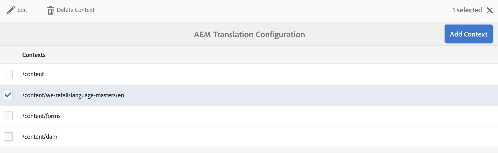

# Te vertalen inhoud identificeren{#identifying-content-to-translate}

De vertaalregels identificeren de inhoud om voor pagina&#39;s, componenten, en activa te vertalen die in, of van, vertaalprojecten inbegrepen zijn. Wanneer een pagina of element wordt vertaald, extraheert AEM deze inhoud zodat deze naar de vertaalservice kan worden verzonden.

Pagina&#39;s en elementen worden weergegeven als knooppunten in de JCR-opslagplaats. De inhoud die wordt geëxtraheerd, is een of meer eigenschapwaarden van de knooppunten. De vertaalregels identificeren de eigenschappen die de te extraheren inhoud bevatten.

De omzettingsregels worden uitgedrukt in het formaat van XML en in deze mogelijke plaatsen opgeslagen:

* `/libs/settings/translation/rules/translation_rules.xml`
* `/apps/settings/translation/rules/translation_rules.xml`
* `/conf/global/settings/translation/rules/translation_rules.xml`

Het bestand is van toepassing op alle vertaalprojecten.

>[!NOTE]
>
>Na een upgrade naar 6.4 wordt aangeraden het bestand van /etc. te verplaatsen. Zie [ Gemeenschappelijke Herstructurering van de Bewaarplaats in AEM 6.5 ](/help/sites-deploying/all-repository-restructuring-in-aem-6-5.md#translation-rules) voor meer details.

De regels omvatten de volgende informatie:

* Het pad van het knooppunt waarop de regel van toepassing is. De regel is ook op de nakomelingen van de knoop van toepassing.
* De namen van de knoopeigenschappen die de te vertalen inhoud bevatten. Het bezit kan voor een specifiek middeltype of voor alle middeltypes specifiek zijn.

U kunt bijvoorbeeld een regel maken die de inhoud vertaalt die auteurs aan alle AEM basistekstcomponenten op uw pagina&#39;s toevoegen. De regel kan de node `/content` en de eigenschap `text` voor de component `foundation/components/text` identificeren.

Er is a [ console ](#translation-rules-ui) die voor het vormen vertaalregels is toegevoegd. De definities in UI zullen het dossier voor u bevolken.

Voor een overzicht van de eigenschappen van de inhoudsomzetting in AEM, zie [ Vertaal Inhoud voor Meertalige Plaatsen ](/help/sites-administering/translation.md).

>[!NOTE]
>
>AEM ondersteunt een-op-een-toewijzing tussen typen bronnen en verwijzingskenmerken voor het vertalen van inhoud waarnaar wordt verwezen op een pagina.

## Syntaxis van regels voor pagina&#39;s, componenten en Assets {#rule-syntax-for-pages-components-and-assets}

Een regel is een `node` -element met een of meer onderliggende `property` -elementen en nul of meer onderliggende `node` elementen:

```xml
<node path="content path">
          <property name="property name" [translate="false"]/>
          <node resourceType="component path" >
               <property name="property name" [translate="false"]/>
          </node>
</node>
```

Elk van deze `node` -elementen heeft de volgende kenmerken:

* Het kenmerk `path` bevat het pad naar het hoofdknooppunt van de vertakking waarop de regels van toepassing zijn.
* Onderliggende `property` -elementen identificeren de knoopeigenschappen die voor alle resourcetypen moeten worden vertaald:

   * Het kenmerk `name` bevat de eigenschapnaam.
   * Het optionele kenmerk `translate` is gelijk aan `false` als de eigenschap niet is omgezet. De standaardwaarde is `true` . Dit kenmerk is handig wanneer u vorige regels overschrijft.

* Onderliggende `node` -elementen identificeren de knoopeigenschappen die voor specifieke brontypen moeten worden vertaald:

   * Het kenmerk `resourceType` bevat het pad dat wordt omgezet naar de component die het resourcetype implementeert.
   * Onderliggende `property` -elementen identificeren de eigenschap node die moet worden vertaald. Gebruik dit knooppunt op dezelfde manier als de onderliggende `property` -elementen voor knooppuntregels.

De volgende voorbeeldregel zorgt ervoor dat de inhoud van alle `text` -eigenschappen wordt vertaald voor alle pagina&#39;s onder de `/content` -node. De regel is effectief voor elke component die inhoud in een eigenschap `text` opslaat, zoals de component Foundation Text en de component foundation Image.

```xml
<node path="/content">
          <property name="text"/>
</node>
```

In het volgende voorbeeld wordt de inhoud van alle `text` -eigenschappen omgezet en worden ook andere eigenschappen van de basiscomponent Image vertaald. Als andere componenten eigenschappen met dezelfde naam hebben, is de regel niet op hen van toepassing.

```xml
<node path="/content">
      <property name="text"/>
      <node resourceType="foundation/components/textimage">
         <property name="image/alt"/>
         <property name="image/jcr:description"/>
         <property name="image/jcr:title"/>
      </node>
</node>
```

## Regelsyntaxis voor het uitnemen van Assets van pagina&#39;s  {#rule-syntax-for-extracting-assets-from-pages}

Gebruik de volgende regelsyntaxis om elementen op te nemen die zijn ingesloten in of waarnaar wordt verwezen vanuit componenten:

```xml
<assetNode resourceType="path to component" assetReferenceAttribute="property that stores asset"/>
```

Elk `assetNode` -element heeft de volgende kenmerken:

* Eén `resourceType` -kenmerk dat gelijk is aan het pad dat naar de component wordt omgezet.
* Een `assetReferenceAttribute` -kenmerk dat gelijk is aan de naam van de eigenschap die het element binair (voor ingesloten elementen) of het pad naar het element waarnaar wordt verwezen, opslaat.

In het volgende voorbeeld worden afbeeldingen geëxtraheerd uit de basiscomponent Image:

```xml
<assetNode resourceType="foundation/components/image" assetReferenceAttribute="fileReference"/>
```

## Regels overschrijven {#overriding-rules}

Het bestand translatie_rules.xml bestaat uit een `nodelist` -element met verschillende onderliggende `node` -elementen. AEM leest de nodenlijst van boven naar beneden. Wanneer de veelvoudige regels de zelfde knoop richten, wordt de regel die lager in het dossier is gebruikt. De volgende regels zorgen er bijvoorbeeld voor dat alle inhoud in `text` -eigenschappen wordt vertaald, behalve de `/content/mysite/en` -vertakking van pagina&#39;s:

```xml
<nodelist>
     <node path="/content">
           <property name="text" />
     </node>
     <node path="/content/mysite/en">
          <property name="text" translate="false" />
     </node>
<nodelist>
```

## Filtereigenschappen {#filtering-properties}

U kunt knooppunten met een specifieke eigenschap filteren met een element `filter` .

De volgende regels zorgen er bijvoorbeeld voor dat alle inhoud in `text` -eigenschappen wordt omgezet, behalve de knooppunten waarvoor de eigenschap `draft` is ingesteld op `true` .

```xml
<nodelist>
    <node path="/content">
     <filter>
   <node containsProperty="draft" propertyValue="true" />
     </filter>
        <property name="text" />
    </node>
<nodelist>
```

## UI voor omzettingsregels {#translation-rules-ui}

Een console is ook beschikbaar voor het vormen van vertaalregels.

Toegang tot dit bestand:

1. Navigeer aan **Hulpmiddelen** en toen **Algemeen**.

   

1. Selecteer **de Configuratie van de Vertaling**.

   

Van hier, kunt u **context** toevoegen. Hiermee kunt u een pad toevoegen.



Dan moet u uw context selecteren en dan **klikken geeft** uit. Hiermee opent u de Editor voor vertaalregels.


Er zijn vier kenmerken die u kunt wijzigen via de gebruikersinterface: `isDeep` , `inherit` , `translate` en `updateDestinationLanguage` .

**isDeep** Dit attribuut is toepasselijk op knoopfilters en is waar door gebrek. Het controleert of de knoop (of zijn voorouders) die bezit met de gespecificeerde bezitswaarde in de filter bevat. Indien false, wordt alleen het huidige knooppunt gecontroleerd.

Onderliggende knooppunten worden bijvoorbeeld toegevoegd aan een vertaaltaak, zelfs als de eigenschap `draftOnly` van het bovenliggende knooppunt is ingesteld op true om de conceptinhoud te markeren. Hier wordt `isDeep` afgespeeld en wordt gecontroleerd of de bovenliggende knooppunten de eigenschap `draftOnly` true hebben en of deze onderliggende knooppunten worden uitgesloten.

In de Redacteur, kunt u controleren/uncheck **is Diep** in de **Filters** tabel.


Hier is een voorbeeld van resulterende xml wanneer **Diep** is ongecontroleerd in UI:

```xml
 <filter>
    <node containsProperty="draftOnly" isDeep="false" propertyValue="true"/>
</filter>
```

**erft** dit is van toepassing op eigenschappen. Standaard wordt elke eigenschap overgeërfd, maar als u wilt dat een eigenschap niet op het onderliggende element wordt overgeërfd, kunt u die eigenschap als onwaar markeren, zodat deze alleen op dat specifieke knooppunt wordt toegepast.

In UI, kunt u controleren/uncheck **erven** in **Eigenschappen** tabel.


**vertaal** het vertaalattribuut wordt gebruikt eenvoudig om te specificeren al dan niet om een bezit te vertalen.

In UI, kunt u controleren/uncheck **vertalen** in het **Eigenschappen** lusje.

**updateDestinationLanguage** Dit attribuut wordt gebruikt voor eigenschappen die geen tekst maar taalcodes, bijvoorbeeld, jcr hebben:taal. De gebruiker vertaalt geen tekst maar de taallandinstelling van bron tot doel. Dergelijke eigenschappen worden niet verzonden voor vertaling.

In UI, kunt u controleren/uncheck **** in het **lusje van Eigenschappen** vertalen, maar voor de specifieke eigenschappen die taalcodes als waarde hebben.

Voor meer duidelijkheid over het verschil tussen `updateDestinationLanguage` en `translate` is dit een eenvoudig voorbeeld van een context met slechts twee regels:


Het resultaat in de xml ziet er als volgt uit:

```xml
<property inherit="true" name="text" translate="true" updateDestinationLanguage="false"/>
<property inherit="true" name="jcr:language" translate="false" updateDestinationLanguage="true"/>
```

## Het bestand Regels handmatig bewerken {#editing-the-rules-file-manually}

Het bestand translatie_rules.xml dat met AEM is geïnstalleerd, bevat een standaardset vertaalregels. U kunt het bestand bewerken ter ondersteuning van de vereisten van uw vertaalprojecten. U kunt bijvoorbeeld regels toevoegen zodat de inhoud van uw aangepaste componenten wordt vertaald.

Als u het bestand translatie_rules.xml bewerkt, moet u een reservekopie bewaren in een inhoudspakket. Het installeren AEM de dienstpakken of het opnieuw installeren van bepaalde AEM pakketten kunnen het huidige vertaling_rules.xml- dossier met origineel vervangen. Om uw regels in deze situatie te herstellen, kunt u het pakket installeren dat uw reservekopie bevat.

>[!NOTE]
>
>Nadat u het inhoudspakket hebt gemaakt, moet u het pakket elke keer opnieuw samenstellen wanneer u het bestand bewerkt.

## Voorbeeld omzettingsregels-bestand {#example-translation-rules-file}

```xml
<nodelist>
    <!-- translation rules for Geometrixx Demo site (example) -->
    <node path="/content/geometrixx">
        <!-- list all node properties that should be translated -->
        <property name="jcr:title" /> <!-- translation workflows running on content saved in /content/geometrixx, will extract jcr:title values independent of the component. -->
        <property name="jcr:description" />
        <node resourceType ="foundation/components/image"> <!-- translation workflows running on content saved in /content/geometrixx, will extract alternateText values only for Image component. -->
            <property name="alternateText"/>
        </node>
        <node resourceType ="geometrixx/components/title">
            <property name="richText"/>
            <property name="jcr:title" translate="false"/> <!-- translation workflows running on content saved in /content/geometrixx, will not extract jcr:title for Title component, but instead use richText. -->
        </node>
        <node pathContains="/cq:annotations">
            <property name="text" translate="false"/> <!-- translation workflows running on content saved in /content/geometrixx, will not extract text if part of cq:annotations node. -->
        </node>
    </node>
    <!-- translation rules for Geometrixx Outdoors site (example) -->
    <node path="/content/geometrixx-outdoors">
        <node resourceType ="foundation/components/image">
            <property name="alternateText"/>
            <property name="jcr:title" />
        </node>
        <node resourceType ="geometrixx-outdoors/components/title">
            <property name="richText"/>
        </node>
    </node>
    <!-- translation rules for ASSETS (example) -->
    <node path="/content/dam">
        <!-- configure list of metadata properties here -->
        <property name="dc:title" />
        <property name="dc:description" />
    </node>
    <!-- translation rules for extracting ASSETS from SITES content, configure all components that embed or reference assets -->
    <assetNode resourceType="foundation/components/image" assetReferenceAttribute="fileReference"/>
    <assetNode resourceType="foundation/components/video" assetReferenceAttribute="asset"/>
    <assetNode resourceType="foundation/components/download" assetReferenceAttribute="fileReference"/>
    <assetNode resourceType="foundation/components/mobileimage" assetReferenceAttribute="fileReference"/>
    <assetNode resourceType="wcm/foundation/components/image" assetReferenceAttribute="fileReference"/>
</nodelist>
```
