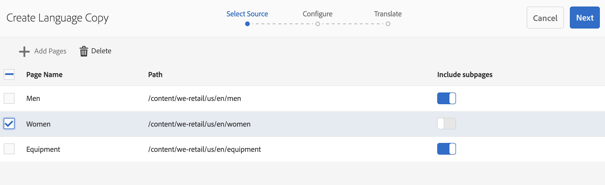

# Wizard Taalkopie{#language-copy-wizard}

De wizard Taalkopie is een begeleide ervaring voor het maken van meertalige contentstructuren en het van instrumenten voorzien. Het is nu veel eenvoudiger en sneller om een taalkopie te maken.

>[!NOTE]
>
>De gebruiker moet een lid van project-beheerders groep zijn om het Exemplaar van de Taal van een plaats tot stand te brengen.

U kunt als volgt deze wizard openen:

1. Selecteer een pagina in Sites en klik op Maken.

   

1. Selecteer Taalkopie en de wizard wordt geopend.

   

1. De **Uitgezochte Source** stap van de tovenaar laat u pagina&#39;s toevoegen/verwijderen. U kunt ook subpagina&#39;s opnemen of uitsluiten.

   

1. De **Volgende** knoop brengt u aan **&#x200B;**&#x200B;stap van de tovenaar vormen. Hier kunt u talen toevoegen of verwijderen en de vertaalmethode selecteren.

   

   >[!NOTE]
   >
   >Standaard is er slechts één vertaalinstelling. Om andere montages te kunnen selecteren, moet u wolkenconfiguraties eerst vormen. Zie [ Vormend het Kader van de Integratie van de Vertaling ](/help/sites-administering/tc-tic.md).

1. De **Volgende** knoop brengt u aan **vertaalt** stap van de tovenaar. Hier kunt u kiezen tussen het maken van alleen de structuur, het maken van een vertaalproject of het toevoegen aan een bestaand vertaalproject.

   >[!NOTE]
   >
   >Als u in de vorige stap meerdere talen hebt geselecteerd, worden er meerdere vertaalprojecten gemaakt.

   

1. **creeer** knoop beëindigt de tovenaar.

   
