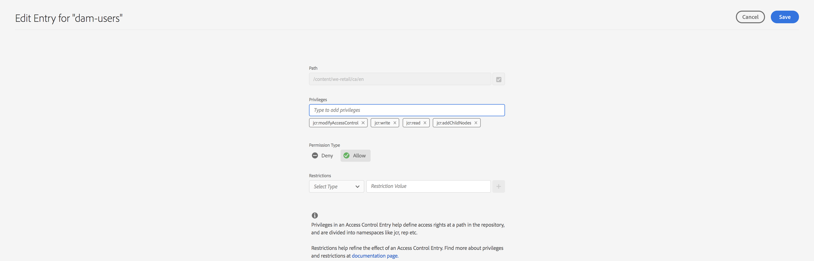

# Hoofdweergave voor beheer van machtigingen{#principal-view-for-permissions-management}

## Overzicht {#overview}

AEM 6.5 introduceert het Beheer van Toestemmingen voor Gebruikers en Groepen. De belangrijkste functionaliteit blijft het zelfde als klassieke UI, maar is gebruikersvriendelijker en efficiënter.

## Hoe wordt het gebruikt {#how-to-use}

### De interface openen {#accessing-the-ui}

Het nieuwe op UI-Gebaseerde toestemmingenbeheer wordt betreden door de kaart van Toestemmingen onder Veiligheid zoals hieronder getoond:

De nieuwe mening maakt het gemakkelijker om de volledige reeks voorrechten en beperkingen voor een bepaald hoofd op alle wegen te bekijken waar de Toestemmingen uitdrukkelijk zijn verleend. Hierdoor is het niet nodig om naar

CRXDE om geavanceerde voorrechten en beperkingen te beheren. Het is in dezelfde visie geconsolideerd. De mening blijft aan de Groep &quot;iedereen&quot;in gebreke.

Er is een filter dat de gebruiker toestaat om het type van hoofden te selecteren om **Gebruikers** te bekijken, **Groepen**, of **allen** en onderzoek naar om het even welk hoofd **.**

### Machtigingen weergeven voor een principal {#viewing-permissions-for-a-principal}

In het linkerframe kunnen gebruikers omlaag schuiven om een hoofd te zoeken of naar een groep of een gebruiker te zoeken op basis van het geselecteerde filter, zoals hieronder wordt getoond:

Als u op de naam klikt, worden aan de rechterkant de toegewezen machtigingen weergegeven. Het toestemmingenvenster toont de lijst van de Ingangen van het Toegangsbeheer op specifieke wegen samen met gevormde beperkingen.

### Het toevoegen van nieuw Ingang van het Toegangsbeheer voor Principal {#adding-new-access-control-entry-for-a-principal}

De nieuwe toestemmingen kunnen worden toegevoegd door een Toegang toe te voegen die ingaat. Klik eenvoudig toevoegen ACE knoop.

 toe

Dit brengt het hieronder getoonde venster omhoog, is de volgende stap een weg te kiezen waar de toestemming moet worden gevormd.

Hier, wordt een weg geselecteerd waar u een toestemming voor **dam-gebruikers** kunt vormen:

Nadat het pad is geselecteerd, gaat de workflow terug naar dit scherm, waar de gebruiker een of meer rechten kan selecteren uit de beschikbare naamruimten (zoals `jcr` , `rep` of `crx` ), zoals hieronder wordt weergegeven.

U kunt rechten toevoegen door te zoeken in het tekstveld en vervolgens te selecteren in de lijst.

>[!NOTE]
>
>Voor een volledige lijst van voorrechten en beschrijvingen, zie [ deze pagina ](/help/sites-administering/user-group-ac-admin.md#access-right-management).

 

Nadat de lijst met bevoegdheden is geselecteerd, kan de gebruiker het machtigingstype Weigeren of Toestaan kiezen, zoals hieronder wordt weergegeven.

 

### Beperkingen gebruiken {#using-restrictions}

Naast de lijst met bevoegdheden en het machtigingstype op een bepaald pad, kunt u met dit scherm ook beperkingen voor fijnkorrelig toegangsbeheer toevoegen, zoals hieronder wordt getoond:

 toe

>[!NOTE]
>
>Voor meer informatie over wat elke beperking betekent, zie [ de Documentatie van Jackrabbit Oak ](https://jackrabbit.apache.org/oak/docs/security/authorization/restriction.html).

U kunt beperkingen toevoegen zoals hieronder wordt weergegeven door het type beperking te kiezen, de waarde in te voeren en op het pictogram **+** te klikken.

 

Het nieuwe ACE wordt weerspiegeld in de Lijst van het Toegangsbeheer zoals hieronder getoond. `jcr:write` is een geaggregeerde bevoegdheid die `jcr:removeNode` bevat die hierboven is toegevoegd, maar die hieronder niet wordt weergegeven als een bevoegdheid die onder `jcr:write` valt.

### ACE&#39;s bewerken {#editing-aces}

De Ingangen van het Toegangsbeheer kunnen worden uitgegeven door een hoofd te selecteren en ACE te kiezen die u wilt uitgeven.

Bijvoorbeeld, hier kunt u de hieronder ingang voor **dam-gebruikers** uitgeven door het potloodpictogram op het recht te klikken:

 toe

Het bewerkingsscherm wordt weergegeven met de geconfigureerde ACE&#39;s die vooraf zijn geselecteerd. U kunt deze verwijderen door op het kruispictogram naast de ACE&#39;s te klikken of u kunt nieuwe bevoegdheden toevoegen voor het opgegeven pad, zoals hieronder wordt weergegeven.

 uit

Hier wordt het `addChildNodes` voorrecht toegevoegd voor **dam-gebruikers** op de bepaalde weg.

 toe

De veranderingen kunnen worden bewaard door **te klikken sparen** knoop op bovenkant recht, en de veranderingen worden weerspiegeld in de nieuwe toestemmingen voor **dam-gebruikers** zoals hieronder getoond:

### ACE&#39;s verwijderen {#deleting-aces}

De Ingangen van het Toegangsbeheer kunnen worden geschrapt om alle toestemmingen te verwijderen die aan een hoofd op een specifieke weg worden gegeven. Het pictogram X naast ACE kan worden gebruikt om het te schrappen zoals hieronder getoond:

 

### Klassieke UI Privilege-combinaties {#classic-ui-privilege-combinations}

De nieuwe toestemmingenUI gebruikt uitdrukkelijk de basisreeks voorrechten in plaats van vooraf bepaalde combinaties die niet echt de nauwkeurige onderliggende voorrechten weerspiegelen die werden verleend.

Het veroorzaakte verwarring over wat precies wordt gevormd. De volgende lijst maakt een lijst van de afbeelding tussen de voorrechtcombinaties van Klassieke UI aan de daadwerkelijke voorrechten die hen vormen:

<table>
 <tbody>
  <tr>
   <th>Klassieke UI Privilege-combinaties</th>
   <th>Rechten UI-bevoegdheid</th>
  </tr>
  <tr>
   <td>Lezen</td>
   <td><code>jcr:read</code></td>
  </tr>
  <tr>
   <td>Wijzigen</td>
   <td>
<code>jcr:modifyProperties</code>
 
<code>jcr:lockManagement</code>
 
<code>jcr:versionManagement</code>
 </td>
  </tr>
  <tr>
   <td>Maken</td>
   <td>
<code>jcr:addChildNodes</code>
 
<code>jcr:nodeTypeManagement</code>
 </td>
  </tr>
  <tr>
   <td>Verwijderen</td>
   <td>
<code>jcr:removeNode</code>
 
<code>jcr:removeChildNodes</code>
 </td>
  </tr>
  <tr>
   <td>ACL lezen</td>
   <td><code>jcr:readAccessControl</code></td>
  </tr>
  <tr>
   <td>ACL bewerken</td>
   <td><code>jcr:modifyAccessControl</code></td>
  </tr>
  <tr>
   <td>Repliceren</td>
   <td><code>crx:replicate</code></td>
  </tr>
 </tbody>
</table>
