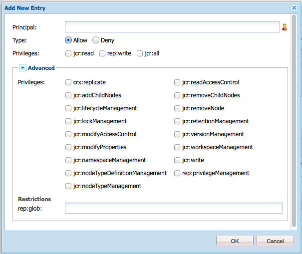
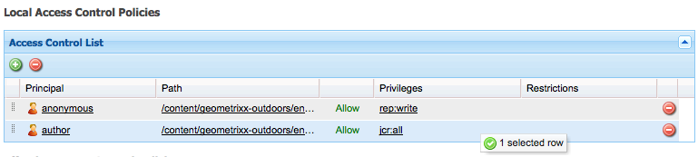

# Beheer van gebruikers-, groep- en toegangsrechten{#user-group-and-access-rights-administration}

Het toelaten van toegang tot een gegevensopslagplaats CRX impliceert verscheidene onderwerpen:

* [Toegangsrechten](#how-access-rights-are-evaluated)  - de concepten hoe zij worden bepaald en geëvalueerd
* [Gebruikersbeheer](#user-administration) : individuele accounts beheren die worden gebruikt voor toegang
* [Groepsbeheer](#group-administration)  - vereenvoudig gebruikersbeheer door groepen te vormen
* [Toegang tot Right Management](#access-right-management)  - beleidsregels definiëren die bepalen hoe deze gebruikers en groepen toegang hebben tot bronnen

De basiselementen zijn:

**GebruikersaccountsCRX** verifieert de toegang door een gebruiker (door die persoon of een andere toepassing) te identificeren en te verifiëren volgens de gegevens in de gebruikersaccount.

In CRX is elk gebruikersaccount een knooppunt in de werkruimte. Een CRX-gebruikersaccount heeft de volgende eigenschappen:

* Deze vertegenwoordigt één gebruiker van CRX.
* Deze bevat een gebruikersnaam en wachtwoord.
* Is van toepassing op die werkruimte.
* Het kan geen subgebruikers hebben. Voor hiërarchische toegangsrechten zou u groepen moeten gebruiken.

* U kunt toegangsrechten opgeven voor de gebruikersaccount.

   Om het beheer te vereenvoudigen raden we u echter aan (in de meeste gevallen) toegangsrechten toe te wijzen aan groepsaccounts. Het toewijzen van toegangsrechten voor elke individuele gebruiker wordt snel zeer moeilijk te beheren (de uitzonderingen zijn bepaalde systeemgebruikers wanneer slechts één of twee instanties bestaan).

**De rekeningen** AccountsGroup van de groep zijn inzamelingen van gebruikers en/of andere groepen. Deze worden gebruikt om beheer te vereenvoudigen aangezien een verandering in de toegangsrechten die aan een groep worden toegewezen automatisch op alle gebruikers in die groep wordt toegepast. Een gebruiker hoeft niet tot een groep te behoren, maar behoort vaak tot een groep.

In CRX heeft een groep de volgende eigenschappen:

* Het vertegenwoordigt een groep gebruikers met gemeenschappelijke toegangsrechten. Bijvoorbeeld auteurs of ontwikkelaars.
* Is van toepassing op die werkruimte.
* Het kan leden hebben; dit kunnen individuele gebruikers of andere groepen zijn .
* U kunt een hiërarchische groepering maken met lidrelaties. U kunt een groep niet direct onder een andere groep in de repository plaatsen.
* U kunt de toegangsrechten voor alle groepsleden bepalen.

**Access** RightsCRX gebruikt toegangsrechten om toegang tot specifieke gebieden van de opslagplaats te beheren.

Dit wordt gedaan door voorrechten toe te wijzen om of toegang tot een middel (knoop of weg) in de bewaarplaats toe te staan of te ontkennen. Aangezien verschillende voorrechten kunnen worden toegewezen, moeten zij worden geëvalueerd om te bepalen welke combinatie voor het huidige verzoek van toepassing is.

CRX staat u toe om de toegangsrechten voor zowel gebruiker als groepsrekeningen te vormen. Vervolgens worden dezelfde basisbeginselen voor de evaluatie toegepast op beide.

## Hoe de Rechten van de Toegang {#how-access-rights-are-evaluated} worden geëvalueerd

>[!NOTE]
>
>CRX implementeert [toegangsbeheer zoals bepaald door JSR-283](https://docs.adobe.com/content/docs/en/spec/jcr/2.0/16_Access_Control_Management.html).
>
>Een standaardinstallatie van een CRX bewaarplaats wordt gevormd om op middel-gebaseerde toegangsbeheerlijsten te gebruiken. Dit is één mogelijke implementatie van JSR-283 toegangsbeheer en één van de implementaties heden met Jackrabbit.

### Onderwerpen en hoofden {#subjects-and-principals}

CRX gebruikt twee zeer belangrijke concepten wanneer het evalueren van toegangsrechten:

* Een **principal** is een entiteit die toegangsrechten draagt. Belangrijkste punten zijn:

   * Een gebruikersaccount
   * Een groepsaccount

      Als een gebruikersaccount bij een of meer gebruikersaccounts hoort, wordt deze ook aan elk van deze groepshoofden gekoppeld.

* Een **subject** wordt gebruikt om de bron van een verzoek te vertegenwoordigen.

   Het wordt gebruikt om de toegangsrechten die op dat verzoek van toepassing zijn, te consolideren. Deze zijn afkomstig van:

   * De principal van de gebruiker

      De rechten die u rechtstreeks aan de gebruikersaccount toewijst.

   * Alle groepshoofden verbonden aan die gebruiker

      Alle rechten die zijn toegewezen aan een van de groepen waartoe de gebruiker behoort.
   Het resultaat wordt dan gebruikt om toegang tot het gevraagde middel toe te staan of te ontkennen.

#### Het compileren van de lijst van de Rechten van de Toegang voor een Onderwerp {#compiling-the-list-of-access-rights-for-a-subject}

In CRX is het onderwerp afhankelijk van:

* de principal van de gebruiker
* alle groepshoofden die aan die gebruiker worden geassocieerd

De lijst van toegangsrechten die van toepassing zijn op het onderwerp is samengesteld uit:

* de rechten die u rechtstreeks aan de gebruikersaccount toewijst
* plus alle rechten die zijn toegewezen aan een van de groepen waartoe de gebruiker behoort


>[!NOTE]
>
>* CRX houdt geen rekening met enige gebruikershiërarchie wanneer het de lijst compileert.
>* CRX gebruikt een groepshiërarchie slechts wanneer u een groep als lid van een andere groep omvat. Er is geen automatische overerving van groepsmachtigingen.
>* De volgorde waarin u de groepen opgeeft, heeft geen invloed op de toegangsrechten.

>


### Het oplossen van Verzoek en de Rechten van de Toegang {#resolving-request-and-access-rights}

Wanneer CRX het verzoek behandelt het het toegangsverzoek van het onderwerp met de toegangsbeheerlijst op de gegevensopslaggegevensopslagknoop vergelijkt:

Dus als Linda vraagt om het `/features` knooppunt bij te werken in de volgende repository structuur:


### Volgorde van prioriteit {#order-of-precedence}

Toegangsrechten in CRX worden als volgt beoordeeld:

* De hoofden van de gebruiker nemen altijd belangrijkheid over groepshoofden ongeacht:

   * hun orde in de toegangsbeheerlijst
   * hun positie in de knooppunthiërarchie

* Voor een bepaalde principal bestaat (hoogstens) 1 ontkent en 1 staat ingang op een bepaalde knoop toe. De implementatie ontruimt altijd overtollige ingangen en zorgt ervoor dat het zelfde voorrecht niet in zowel toestaat als ontkent ingangen vermeld is.

>[!NOTE]
>
>Dit evaluatieproces is aangewezen voor het middel gebaseerde toegangsbeheer van een standaardCRX installatie.

Twee voorbeelden waarbij de gebruiker `aUser` lid is van de groep `aGroup`:

```xml
   + parentNode
     + acl
       + ace: aUser - deny - write
     + childNode
       + acl
         + ace: aGroup - allow - write
       + grandChildNode
```

In het bovenstaande geval:

* `aUser` geen schrijfmachtiging is verleend op  `grandChildNode`.

```xml
   + parentNode
     + acl
       + ace: aUser - deny - write
     + childNode
       + acl
         + ace: aGroup - allow - write
         + ace: aUser - deny - write
       + grandChildNode
```

In dit geval:

* `aUser` geen schrijfmachtiging is verleend op  `grandChildNode`.
* De tweede ACE voor `aUser` is overtollig.

De rechten van de toegang van veelvoudige groepshoofden worden geëvalueerd gebaseerd op hun orde, zowel binnen de hiërarchie als binnen één enkele toegangsbeheerlijst.

### Best practices voor {#best-practices}

In de volgende tabel vindt u een aantal aanbevelingen en aanbevolen procedures:

<table>
 <tbody>
  <tr>
   <td>Aanbeveling..</td>
   <td>Reden...</td>
  </tr>
  <tr>
   <td><i>Groepen gebruiken</i></td>
   <td><p>Vermijd het toewijzen van toegangsrechten per gebruiker. Hiervoor zijn verschillende redenen:</p>
    <ul>
     <li>U hebt veel meer gebruikers dan groepen, zodat vereenvoudigen de groepen de structuur.</li>
     <li>Groepen bieden een overzicht van alle accounts.</li>
     <li>Overerving is eenvoudiger bij groepen.</li>
     <li>Gebruikers komen en gaan. Groepen zijn langdurig.</li>
    </ul> </td>
  </tr>
  <tr>
   <td><i>Positief</i></td>
   <td><p>Gebruik altijd Allow verklaringen om de toegangsrechten van het groepshoofd te specificeren (waar mogelijk). Vermijd het gebruik van een Deny-instructie.</p> <p>De hoofden van de groep worden geëvalueerd in orde, zowel binnen de hiërarchie als orde binnen één enkele toegangsbeheerlijst.</p> </td>
  </tr>
  <tr>
   <td><i>Eenvoudig houden</i></td>
   <td><p>Het investeren van wat tijd en gedachte wanneer het vormen van een nieuwe installatie zal goed worden terugbetaald.</p> <p>Door een duidelijke structuur toe te passen, wordt het permanente onderhoud en de administratie vereenvoudigd, zodat zowel uw huidige collega's als toekomstige opvolgers gemakkelijk kunnen begrijpen wat er wordt geïmplementeerd.</p> </td>
  </tr>
  <tr>
   <td><i>Testen</i></td>
   <td>Gebruik een testinstallatie om te oefenen en ervoor te zorgen dat u de relaties tussen de verschillende gebruikers en groepen begrijpt.</td>
  </tr>
  <tr>
   <td><i>Standaardgebruikers/groepen</i></td>
   <td>Werk de standaardgebruikers en -groepen altijd direct na de installatie bij om beveiligingsproblemen te voorkomen.</td>
  </tr>
 </tbody>
</table>

## Gebruikersbeheer {#user-administration}

Een standaarddialoogvenster wordt gebruikt voor **Gebruikersbeheer**.

U moet in de aangewezen werkruimte worden geregistreerd, dan kunt u tot de dialoog van allebei toegang hebben:

* de koppeling **Gebruikersbeheer** in de hoofdconsole van CRX
* het menu **Beveiliging** van de CRX Explorer


**Eigenschappen**

* **GebruikerID**

   Korte naam voor de account die wordt gebruikt bij toegang tot CRX.

* **Hoofdnaam**

   Een volledige tekstnaam voor het account.

* **Wachtwoord**

   Nodig wanneer u toegang wilt tot CRX met dit account.

* **ntlmhash**

   Automatisch toegewezen voor elke nieuwe account en bijgewerkt wanneer het wachtwoord wordt gewijzigd.

* U kunt nieuwe eigenschappen toevoegen door een naam, type en waarde te definiëren. Klik op Opslaan (groen verdeelstreepje) voor elke nieuwe eigenschap.

**Groepslidmaatschap**

Hiermee worden alle groepen weergegeven waartoe de account behoort. De kolom Overgenomen geeft het lidmaatschap aan dat is overgeërfd als gevolg van het lidmaatschap van een andere groep.

Als u op een GroupID klikt (indien beschikbaar), wordt [Groepsbeheer](#group-administration) voor die groep geopend.

**Imitators**

Met de functie Imiteren kan een gebruiker namens een andere gebruiker werken.

Dit betekent dat een gebruikersaccount andere accounts (gebruiker of groep) kan opgeven die met hun account kunnen werken. Met andere woorden, als gebruiker-B wordt toegestaan om gebruiker-A na te bootsen, dan kan gebruiker-B actie ondernemen gebruikend de volledige rekeningsdetails van gebruiker-A (met inbegrip van identiteitskaart, naam en toegangsrechten).

Hierdoor kunnen imitatoraccounts taken uitvoeren alsof ze de account gebruiken die ze nadoen. bijvoorbeeld tijdens afwezigheid of om een buitensporige last op korte termijn te delen.

Als een rekening zich een andere imiteert, is het erg moeilijk te zien. De logboekdossiers houden geen informatie over het feit dat de imitatie op de gebeurtenissen is voorgekomen. Dus als user-B zich gebruiker-A imiteert zullen alle gebeurtenissen kijken alsof zij door gebruiker-A persoonlijk werden uitgevoerd.

### Gebruikersaccount {#creating-a-user-account} maken

1. Open het dialoogvenster **Gebruikersbeheer**.
1. Klik **Gebruiker maken**.
1. Vervolgens kunt u de eigenschappen invoeren:

   * **Gebruikte** gebruikersnaam als accountnaam.
   * **Wachtwoord** nodig bij aanmelden.
   * **De belangrijkste** Naam om een volledige textuele naam te verstrekken.
   * **Tussenweg** die kan worden gebruikt om een boomstructuur te vormen.

1. Klik op Opslaan (groen vinkje).
1. Het dialoogvenster wordt uitgebreid, zodat u:

   1. Configureer **Eigenschappen**.
   1. Zie **Groepslidmaatschap**.
   1. Definieer **Impersonators**.

>[!NOTE]
>
>Soms kunnen de prestaties verloren gaan wanneer nieuwe gebruikers worden geregistreerd in installaties met een groot aantal van beide:
>
>* gebruikers
>* groepen met veel leden

>


### Een gebruikersaccount {#updating-a-user-account} bijwerken

1. Open in het dialoogvenster **Gebruikersbeheer** de lijstweergave van alle accounts.
1. Navigeer door de boomstructuur.
1. Klik op de vereiste account om te openen voor bewerking.
1. Breng een wijziging aan en klik vervolgens op Opslaan (groen verdeelstreepje) voor die vermelding.
1. Klik **Close** om te beëindigen, of **List..** om terug te keren naar de lijst met alle gebruikersaccounts.

### Een gebruikersaccount verwijderen {#removing-a-user-account}

1. Open in het dialoogvenster **Gebruikersbeheer** de lijstweergave van alle accounts.
1. Navigeer door de boomstructuur.
1. Selecteer de vereiste account en klik op **Gebruiker verwijderen**; het account wordt onmiddellijk verwijderd.

>[!NOTE]
>
>Dit verwijdert de knoop voor dit hoofd uit de bewaarplaats.
>
>Toegangsrechten worden niet verwijderd. Dit garandeert de historische integriteit.

### Eigenschappen {#defining-properties} definiëren

U kunt **Eigenschappen** voor of nieuwe of bestaande rekeningen bepalen:

1. Open het dialoogvenster **Gebruikersbeheer** voor de juiste account.
1. Definieer een **naam van een eigenschap**.
1. Selecteer **Type** van de drop-down lijst.
1. Definieer de **Waarde**.
1. Klik op Opslaan (groen kliksymbool) voor de nieuwe eigenschap.

Bestaande eigenschappen kunnen met het prullenbaksymbool worden verwijderd.

Met uitzondering van het Wachtwoord, kunnen de eigenschappen niet worden uitgegeven, moeten zij worden geschrapt en worden ontspannen.

#### Het wachtwoord {#changing-the-password} wijzigen

**Password** is een speciale eigenschap die kan worden gewijzigd door op de **Wachtwoord wijzigen**-koppeling te klikken.

U kunt het wachtwoord in uw eigen gebruikersrekening van **Veiligheid** menu in de Ontdekkingsreiziger ook veranderen CRX.

### Imitator {#defining-an-impersonator} definiëren

U kunt imitators definiëren voor nieuwe of bestaande accounts:

1. Open het dialoogvenster **Gebruikersbeheer** voor de juiste account.
1. Geef op welk account u als lid van dat account wilt gebruiken.

   U kunt Bladeren gebruiken... om een bestaande account te selecteren.

1. Klik op Opslaan (groen verdeelstreepje) voor de nieuwe eigenschap.

## Groepsbeheer {#group-administration}

Een standaarddialoogvenster wordt gebruikt voor **Groepsbeheer**.

U moet in de aangewezen werkruimte worden geregistreerd, dan kunt u tot de dialoog van allebei toegang hebben:

* de **Groepsbeheer**-koppeling op de hoofdconsole van CRX
* het menu **Beveiliging** van de CRX Explorer


**Eigenschappen**

* **GroupID**

   Korte naam voor de groepsaccount.

* **Hoofdnaam**

   Een volledige tekstnaam voor het groepsaccount.

* U kunt nieuwe eigenschappen toevoegen door een naam, type en waarde te definiëren. Klik op Opslaan (groen verdeelstreepje) voor elke nieuwe eigenschap.

* **Leden**

   U kunt gebruikers of andere groepen toevoegen als leden van deze groep.

**Groepslidmaatschap**

Hiermee worden alle groepen weergegeven waartoe de huidige groepsaccount behoort. De kolom Overgenomen geeft het lidmaatschap aan dat is overgeërfd als gevolg van het lidmaatschap van een andere groep.

Als u op een GroupID klikt, wordt het dialoogvenster voor die groep geopend.

**Leden**

Hiermee geeft u alle accounts (gebruikers en/of groepen) weer die lid zijn van de huidige groep.

De **Overgenomen** kolom wijst op lidmaatschap dat als resultaat van lidmaatschap van een andere groep is geërft.

>[!NOTE]
>
>Wanneer de rol Eigenaar, Editor of Viewer wordt toegewezen aan een gebruiker in een willekeurige map met middelen, wordt een nieuwe groep gemaakt. De groepsnaam heeft de notatie `mac-default-<foldername>` voor elke map waarin de rollen zijn gedefinieerd.

### Een groepsaccount maken {#creating-a-group-account}

1. Open het dialoogvenster **Groepsbeheer**.
1. Klik **Groep maken**.
1. Vervolgens kunt u de eigenschappen invoeren:

   * **De belangrijkste** Naam om een volledige textuele naam te verstrekken.
   * **Tussenweg** die kan worden gebruikt om een boomstructuur te vormen.

1. Klik op Opslaan (groen vinkje).
1. Het dialoogvenster wordt uitgebreid, zodat u:

   1. Configureer **Eigenschappen**.
   1. Zie **Groepslidmaatschap**.
   1. **Leden** beheren.

### Een groepsaccount {#updating-a-group-account} bijwerken

1. Open in het dialoogvenster **Groepsbeheer** de lijstweergave van alle accounts.
1. Navigeer door de boomstructuur.
1. Klik op de vereiste account om te openen voor bewerking.
1. Breng een wijziging aan en klik vervolgens op Opslaan (groen verdeelstreepje) voor die vermelding.
1. Klik **Close** om te beëindigen, of **List..** om terug te keren naar de lijst van alle groepsaccounts.

### Een groepsaccount verwijderen {#removing-a-group-account}

1. Open in het dialoogvenster **Groepsbeheer** de lijstweergave van alle accounts.
1. Navigeer door de boomstructuur.
1. Selecteer de vereiste account en klik op **Groep verwijderen**; het account wordt onmiddellijk verwijderd.

>[!NOTE]
>
>Dit verwijdert de knoop voor dit hoofd uit de bewaarplaats.
>
>Toegangsrechten worden niet verwijderd. Dit garandeert de historische integriteit.

### Eigenschappen {#defining-properties-1} definiëren

U kunt Eigenschappen definiëren voor nieuwe of bestaande accounts:

1. Open het dialoogvenster **Groepsbeheer** voor de juiste account.
1. Definieer een **naam van een eigenschap**.
1. Selecteer **Type** van de drop-down lijst.
1. Definieer de **Waarde**.
1. Klik op Opslaan (groen verdeelstreepje) voor de nieuwe eigenschap.

Bestaande eigenschappen kunnen met het prullenbaksymbool worden verwijderd.

### Leden {#members}

U kunt leden toevoegen aan de huidige groep:

1. Open het dialoogvenster **Groepsbeheer** voor de juiste account.
1. Ofwel:

   * Voer de naam in van het vereiste lid (gebruiker- of groepsaccount).
   * Of gebruik **Bladeren..** om naar de principal (gebruiker of groepsaccount) te zoeken en te selecteren die u wilt toevoegen.

1. Klik op Opslaan (groen verdeelstreepje) voor de nieuwe eigenschap.

Of verwijder een bestaand lid met het prullenbaksymbool.

## Toegangsbeheer {#access-right-management}

Met **Toegangsbeheer** lusje van CRXDE Lite kunt u het beleid van de toegangscontrole bepalen en de verwante voorrechten toewijzen.

Voor **Huidig pad** selecteert u bijvoorbeeld de vereiste bron in het linkerdeelvenster, het tabblad Toegangsbeheer in het rechterbenedendeelvenster:


Het beleid wordt ingedeeld volgens:

* **Toepasselijk beleid voor toegangscontrole**

   Dit beleid kan worden toegepast.

   Dit zijn beleid dat beschikbaar is voor het creëren van een lokaal beleid. Zodra u selecteert en een toepasselijk beleid toevoegt wordt het een lokaal beleid.

* **Beleid voor lokaal toegangsbeheer**

   Dit zijn toegangsbeheerbeleid dat u hebt toegepast. U kunt deze vervolgens bijwerken, bestellen of verwijderen.

   Een lokaal beleid zal om het even welk beleid met voeten treden dat van de ouder wordt geërft.

* **Effectief beleid voor toegangscontrole**

   Dit zijn het beleid van de toegangscontrole dat nu voor om het even welke toegangsverzoeken van kracht is. Zij tonen het samengevoegde beleid dat uit zowel het lokale beleid als om het even welk wordt afgeleid die van de ouder wordt geërft.

### Beleidsselectie {#policy-selection}

Het beleid kan worden geselecteerd voor:

* **Huidig pad**

   Zoals in het bovenstaande voorbeeld, selecteer een middel binnen de bewaarplaats. Het beleid voor dit &quot;huidige pad&quot; wordt weergegeven.

* **Bewaarplaats**

   Hiermee selecteert u toegangsbeheer op archiefniveau. Bijvoorbeeld, wanneer het plaatsen van `jcr:namespaceManagement` voorrecht, dat slechts relevant voor de bewaarplaats is, niet een knoop.

* **Opdrachtgever**

   Een principal die in de repository is geregistreerd.

   U kunt de naam **Principal** typen of op het pictogram rechts van het veld klikken om het dialoogvenster **Select Principal** te openen.

   Hierdoor kunt u **Zoeken** naar een **Gebruiker** of **Groep**. Selecteer de vereiste principal in de resulterende lijst en klik vervolgens op **OK** om de waarde terug te brengen naar het vorige dialoogvenster.


>[!NOTE]
>
>Om beheer te vereenvoudigen, adviseren wij dat u toegangsrechten aan groepsrekeningen, niet individuele gebruikersrekeningen toewijst.
>
>Het is eenvoudiger om een paar groepen te beheren in plaats van veel gebruikersaccounts.

### Bevoegdheden {#privileges}

De volgende voorrechten zijn beschikbaar voor selectie wanneer het toevoegen van een ingang van de toegangscontrole (zie [Veiligheid API](https://docs.adobe.com/docs/en/spec/javax.jcr/javadocs/jcr-2.0/javax/jcr/security/Privilege.html) voor volledige details):

<table>
 <tbody>
  <tr>
   <th><strong>Naam bevoegdheid</strong></th>
   <th><strong>Welke controle over het recht aan...</strong></th>
  </tr>
  <tr>
   <td><code>jcr:read</code></td>
   <td>Haal een knooppunt op en lees de eigenschappen en waarden ervan.</td>
  </tr>
  <tr>
   <td><code>rep:write</code></td>
   <td>Dit is een eigenschap voor een speciale aggregaat van jcr:write en jcr:nodeTypeManagement.<br /> </td>
  </tr>
  <tr>
   <td><code>jcr:all</code></td>
   <td>Dit is een geaggregeerd voorrecht dat alle andere vooraf gedefinieerde bevoegdheden bevat.</td>
  </tr>
  <tr>
   <td><strong>Geavanceerd</strong></td>
   <td> </td>
  </tr>
  <tr>
   <td><code>crx:replicate</code></td>
   <td>Voer replicatie van een knoop uit.</td>
  </tr>
  <tr>
   <td><code>jcr:addChildNodes</code></td>
   <td>Maak onderliggende knooppunten van een knooppunt.</td>
  </tr>
  <tr>
   <td><code>jcr:lifecycleManagement</code></td>
   <td>Levenscyclusbewerkingen uitvoeren op een knooppunt.</td>
  </tr>
  <tr>
   <td><code>jcr:lockManagement</code></td>
   <td>Een knooppunt vergrendelen en ontgrendelen; vernieuw een slot.</td>
  </tr>
  <tr>
   <td><code>jcr:modifyAccessControl</code></td>
   <td>Wijzig het toegangsbeheerbeleid van een knoop.</td>
  </tr>
  <tr>
   <td><code>jcr:modifyProperties</code></td>
   <td>Maak, wijzig en verwijder de eigenschappen van een knooppunt.</td>
  </tr>
  <tr>
   <td><code>jcr:namespaceManagement</code></td>
   <td>Naamruimtedefinities registreren, verwijderen en wijzigen.</td>
  </tr>
  <tr>
   <td><code>jcr:nodeTypeDefinitionManagement</code></td>
   <td>Importeer knooppunttypedefinities naar de repository.</td>
  </tr>
  <tr>
   <td><code>jcr:nodeTypeManagement</code></td>
   <td>Voeg en verwijder mixinknooptypes toe en verander het primaire knooptype van een knoop. Dit omvat ook om het even welke vraag aan Node.addNode en het invoeren van XML methodes waar de mixin of het primaire type van nieuwe knoop uitdrukkelijk wordt gespecificeerd.</td>
  </tr>
  <tr>
   <td><code>jcr:readAccessControl</code></td>
   <td>Lees het toegangsbeheerbeleid van een knoop.</td>
  </tr>
  <tr>
   <td><code>jcr:removeChildNodes</code></td>
   <td>Verwijder onderliggende knooppunten van een knooppunt.</td>
  </tr>
  <tr>
   <td><code>jcr:removeNode</code></td>
   <td>Een knooppunt verwijderen.</td>
  </tr>
  <tr>
   <td><code>jcr:retentionManagement</code></td>
   <td>Voer verrichtingen van het bewaarbeheer op een knoop uit.</td>
  </tr>
  <tr>
   <td><code>jcr:versionManagement</code></td>
   <td>Voer versioning bewerkingen uit op een knooppunt.</td>
  </tr>
  <tr>
   <td><code>jcr:workspaceManagement</code></td>
   <td>Het maken en verwijderen van werkruimten via de JCR API.</td>
  </tr>
  <tr>
   <td><code>jcr:write</code></td>
   <td>Dit is een geaggregeerd voorrecht dat het volgende bevat:<br /> - jcr:modifyProperties<br /> - jcr:addChildNodes<br /> - jcr:removeNode<br /> - jcr:removeChildNodes</td>
  </tr>
  <tr>
   <td><code>rep:privilegeManagement</code></td>
   <td>Registreer nieuwe bevoegdheden.</td>
  </tr>
 </tbody>
</table>

### Registreren van nieuwe rechten {#registering-new-privileges}

U kunt ook nieuwe rechten registreren:

1. Selecteer **Gereedschappen** op de werkbalk en **Rechten** om de momenteel geregistreerde rechten weer te geven.

   

1. Gebruik het **Register Privilege** pictogram (**+**) om de dialoog te openen en een nieuw voorrecht te bepalen:

   

1. Klik **OK** om op te slaan. Het voorrecht is nu beschikbaar voor selectie.

### Een Access Control-item {#adding-an-access-control-entry} toevoegen

1. Selecteer uw bron en open **Toegangsbeheer** tabel.

1. Als u een nieuw **Lokaal toegangsbeheerbeleid** wilt toevoegen, klikt u op het pictogram **+** rechts van de lijst **Toepasselijk toegangsbeheerbeleid**:

   

1. Een nieuwe ingang verschijnt onder **Lokaal Beleid van het Toegangsbeheer:**

   

1. Klik op het pictogram **+** om een nieuwe vermelding toe te voegen:

   

   >[!NOTE]
   >
   >Er is momenteel een tijdelijke oplossing nodig om een lege tekenreeks op te geven.
   >
   >Hiervoor moet u &quot;&quot; gebruiken.

1. Bepaal uw toegangsbeheerbeleid en klik **O.K.** om te bewaren. Uw nieuwe beleid zal:

   * vermeld onder **Lokaal beleid van het Toegangsbeheer**
   * de wijzigingen worden doorgevoerd in het **Effectief beleid voor toegangsbeheer**.

CRX valideert uw selectie; voor een bepaalde principal bestaat (hoogstens) 1 ontkent en 1 staat ingang op een bepaald knooppunt toe. De implementatie ontruimt altijd overtollige ingangen en zorgt ervoor dat het zelfde voorrecht niet in zowel toestaat als ontkent ingangen vermeld is.

### Plaatselijk beleid voor toegangsbeheer {#ordering-local-access-control-policies} bestellen

De volgorde in de lijst geeft de volgorde aan waarin het beleid wordt toegepast.

1. In de lijst van **Lokaal Beleid van het Toegangsbeheer** selecteer de vereiste ingang en sleep het aan de nieuwe positie in de lijst.

   

1. De wijzigingen worden weergegeven in zowel de tabellen voor **Lokaal** als **Effectief beleid voor toegangsbeheer**.

### Een toegangsbeheerbeleid verwijderen {#removing-an-access-control-policy}

1. In de lijst van **Lokaal Beleid van het Toegangsbeheer** klik het rode pictogram (-) rechts van de ingang.
1. De vermelding wordt verwijderd uit zowel de tabellen voor **Lokaal** als **Effectief beleid voor toegangsbeheer**.

### Het testen van een Beleid van het Toegangsbeheer {#testing-an-access-control-policy}

1. Selecteer **Gereedschappen** op de werkbalk CRXDE Lite en **Toegangsbeheer testen...**.
1. Er wordt een nieuw dialoogvenster geopend in het rechterbovenvenster. Selecteer **Pad** en/of **Principal** die u wilt testen.
1. Klik **Test** om de resultaten voor uw selectie te zien:

   