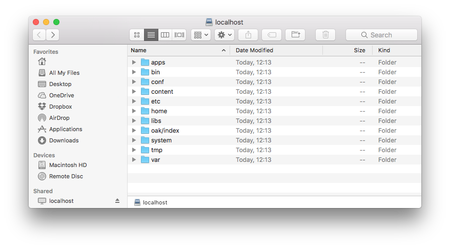
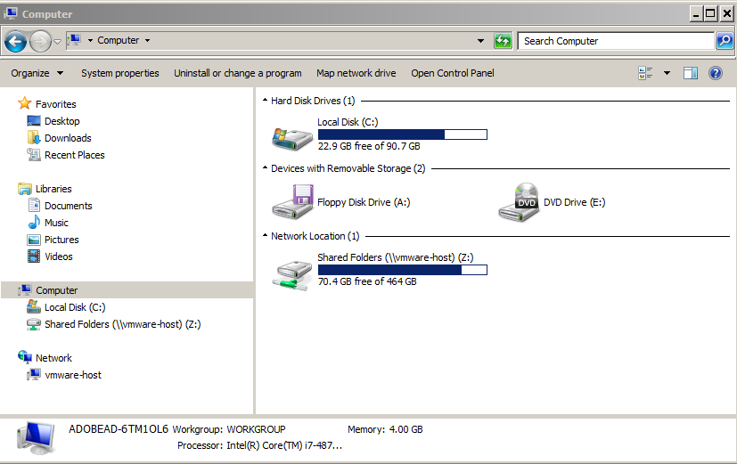

# WebDAV-toegang{#webdav-access}

Verbinding maken met AEM via WebDAV met KDE:

AEM biedt WebDAV-ondersteuning waarmee u inhoud in de opslagplaats kunt weergeven en bewerken. Verbinding maken via WebDAV geeft u rechtstreeks via uw bureaublad toegang tot de opslagplaats voor inhoud. Tekst- en PDF-bestanden die via de WebDAV-verbinding aan de opslagplaats worden toegevoegd, worden automatisch geïndexeerd met volledige tekst en kunnen worden gezocht met de standaardzoekinterfaces en met de standaard Java™ API&#39;s.

## Algemeen {#general}

[&#x200B; Gedetailleerde instructies per werkend systeem &#x200B;](/help/sites-administering/webdav-access.md#connecting-via-webdav) zijn inbegrepen in dit document, maar hoofdzakelijk om met uw bewaarplaats te verbinden gebruikend het protocol WebDAV, richt u uw cliënt WebDAV aan de volgende plaats:

```xml
http://localhost:4502
```



Deze URL biedt WebDAV-toegang tot de standaardwerkruimte ( `crx.default` ) wanneer deze wordt verbonden vanaf het niveau van het besturingssysteem. Terwijl het eenvoudiger voor de gebruiker is, geeft het hen niet de extra flexibiliteit om werkruimtenamen te specificeren, die kunnen worden verwezenlijkt gebruikend extra [&#x200B; WebDAV URLs &#x200B;](/help/sites-administering/webdav-access.md#webdav-urls).

AEM geeft de inhoud van de opslagplaats als volgt weer:

* Een knooppunt van het type `nt:folder` wordt weergegeven als een map. Knooppunten onder het knooppunt `nt:folder` worden weergegeven als de inhoud van de map.

* Een knooppunt van het type `nt:file` wordt weergegeven als een bestand. Knooppunten onder het knooppunt `nt:file` worden niet weergegeven, maar vormen de inhoud van het bestand.

Wanneer u WebDAV gebruikt om mappen en bestanden te maken en te bewerken, maakt AEM de benodigde knooppunten `nt:folder` en `nt:file` en bewerkt deze. Als u WebDAV wilt gebruiken voor het importeren en exporteren van inhoud, moet u zoveel mogelijk werken met knooppunttypen `nt:file` en `nt:folder` .

>[!NOTE]
>
>Alvorens vestiging WebDAV, controleer de [&#x200B; Technische Vereisten &#x200B;](/help/sites-deploying/technical-requirements.md#webdav-clients).

## WebDAV-URL&#39;s {#webdav-urls}

De URL voor de WebDAV-server heeft de volgende structuur:

<table>
 <colgroup>
  <col width="100" />
  <col width="100" />
  <col width="100" />
  <col width="100" />
  <col width="100" />
 </colgroup>
 <tbody>
  <tr>
   <td>
    <code>
     <strong>URL Component</strong>
    </code></td>
   <td><code>https://&lt;host&gt;:&lt;port&gt;</code></td>
   <td><code>/&lt;crx-webapp-path&gt;</code></td>
   <td><code>/repository</code></td>
   <td><code>/&lt;workspace&gt;</code></td>
  </tr>
  <tr>
   <td>
    <code>
     <strong>Example</strong>
    </code></td>
   <td><code>http://localhost:4502</code></td>
   <td><code>/crx</code></td>
   <td><code>/repository</code></td>
   <td><code>/crx.default</code></td>
  </tr>
  <tr>
   <td><strong>Beschrijving</strong></td>
   <td>Host en poort waarop AEM wordt uitgevoerd</td>
   <td>Pad voor de webapp van de AEM repository</td>
   <td>Pad waaraan WebDAV-servlet is toegewezen</td>
   <td>Naam van de werkruimte</td>
  </tr>
 </tbody>
</table>

Als u het werkruimte-element in het pad wijzigt, kunt u andere werkruimten toewijzen dan de standaardwerkruimte ( `crx.default` ). Als u bijvoorbeeld een werkruimte met de naam `staging` wilt toewijzen, gebruikt u de volgende URL:

```xml
http://localhost:4502/crx/repository/staging
```

## Verbinding maken via WebDAV {#connecting-via-webdav}

[&#x200B; Zoals hierboven vermeld &#x200B;](/help/sites-administering/webdav-access.md#general), om met uw bewaarplaats te verbinden gebruikend het protocol WebDAV, richt u uw cliënt WebDAV aan uw bewaarplaats. Afhankelijk van uw besturingssysteem verschillen de stappen voor het aansluiten van uw client echter en is er mogelijk een vereiste configuratie van het besturingssysteem vereist.

Instructies voor het aansluiten van de volgende besturingssystemen zijn beschikbaar:

* [Windows](/help/sites-administering/webdav-access.md#windows)
* [macOS](/help/sites-administering/webdav-access.md#macos)
* [Linux](/help/sites-administering/webdav-access.md#linux)

### Windows {#windows}

Als u een Microsoft® Windows 7 (en hoger)-systeem wilt verbinden met een AEM die niet met SSL is beveiligd, moet de optie voor het instellen van een basisverificatie via een onbeveiligd netwerk expliciet zijn ingeschakeld in Windows. Deze capaciteit vereist een verandering in de Registratie van Vensters van WebClient.

Zodra de registratie wordt bijgewerkt, dan kan de AEM instantie als aandrijving worden in kaart gebracht.

#### Windows 7 en meer configuratie {#windows-and-greater-configuration}

Om de registratie bij te werken om basisauthentificatie over een onbeveiligd netwerk toe te staan:

1. Zoek de volgende registersubsleutel:

   ```xml
   HKEY_LOCAL_MACHINE\SYSTEM\CurrentControlSet\Services\WebClient\Parameters
   ```

1. Stel de `BasicAuthLevel` subsleutel van de registervermelding in op de waarde `2` of hoger.

   Voeg de subsleutel toe als deze niet aanwezig is.

1. Start het systeem opnieuw zodat de registerwijziging van kracht wordt.

>[!NOTE]
>
>Adobe raadt u aan een Windows-gebruiker te maken met dezelfde referenties als de gebruiker in de opslagplaats, anders kunnen er machtigingsconflicten optreden.

#### Windows 8-configuratie {#windows-configuration}

Voor Vensters 8, verander de registratieingang [&#x200B; zoals die voor Vensters 7 en groter &#x200B;](/help/sites-administering/webdav-access.md#windows-and-greater-configuration) wordt beschreven. Nochtans, alvorens u deze taak doet, moet de Ervaring van de Desktop worden toegelaten om de registratieingang te zien.

Om de Ervaring van de Desktop toe te laten, open **de Manager van de Server, toen** Eigenschappen **, dan** voegt Eigenschappen **toe, toen** Ervaring van de Desktop **.**

Na rebooting, is de registratieingang die voor Vensters 7 en groter wordt beschreven beschikbaar. Wijzig het zoals die voor Vensters 7 en groter wordt beschreven.

#### Verbinding maken in Windows {#connecting-in-windows}

Verbinding maken met AEM via WebDAV in een Windows-omgeving:

1. Open **Ontdekkingsreiziger van Vensters** of **de Ontdekkingsreiziger van het Dossier** en klik **Computer** of **Deze PC**.

   

1. Om de tovenaar te beginnen, klik **de netwerkaandrijving van de Kaart**.
1. Voer de toewijzingsdetails in:

   * **Aandrijving**: Kies om het even welke beschikbare brief
   * **Omslag**: `http://localhost:4502`
   * Controle **verbindt gebruikend verschillende geloofsbrieven**

   Klik op Voltooien

   

   >[!NOTE]
   >
   >Als AEM zich op een andere poort bevindt, gebruikt u dat poortnummer in plaats van 4502. Als u de opslagplaats voor inhoud niet op uw lokale computer uitvoert, vervangt u `localhost` door de respectievelijke servernaam of het IP-adres.

1. Voer gebruikersnaam `admin` en wachtwoord `admin` in. Adobe raadt u aan de vooraf geconfigureerde beheerdersaccount te gebruiken voor het testen.

   

1. De wizard wordt gesloten en het nieuwe toegewezen station wordt geopend in Windows Verkenner of het venster Bestandverkenner.

   

Windows heeft nu AEM toegewezen als een station via WebDAV en u kunt deze als elk ander station gebruiken.

### macOS {#macos}

Er zijn geen configuratiestappen vereist om via WebDAV verbinding te maken op macOS. U kunt verbinding maken met de WebDAV-server.

1. Navigeer aan om het even welk **venster van de Vinder** en klik **gaan** en **verbinden met Server**, of druk **Command+k**.
1. In **verbind met Server** venster, ga de AEM plaats in:

   * `http://localhost:4502`

   >[!NOTE]
   >
   >Als AEM zich op een andere poort bevindt, gebruikt u dat poortnummer in plaats van 4502. Als u de opslagplaats voor inhoud niet op uw lokale computer uitvoert, vervangt u `localhost` door de respectievelijke servernaam of het IP-adres.

1. Wanneer u wordt gevraagd om verificatie, voert u gebruikersnaam `admin` en wachtwoord `admin` in. Adobe raadt u aan de vooraf geconfigureerde beheerdersaccount te gebruiken voor het testen.

macOS heeft nu verbinding met AEM via WebDAV en u kunt deze gebruiken als elke andere map op uw Mac.

### Linux® {#linux}

Voor verbinding via WebDAV op Linux® is geen configuratie vereist, maar het omvat wel een paar stappen om de verbinding tot stand te brengen die afhankelijk is van uw desktopomgeving.

#### GNOME {#gnome}

Verbinding maken met AEM via WebDAV met GNOME:

1. In Nautilus (dossierontdekkingsreiziger), selecteer **Plaatsen** en selecteer **verbinden met Server**.
1. In **verbind met het venster van de Server**, uitgezochte WebDAV (HTTP) in het Type van Dienst.

1. In **Server**, ga `http://localhost:4502/crx/repository/crx.default` in

   >[!NOTE]
   >
   >Als AEM zich op een andere poort bevindt, gebruikt u dat poortnummer in plaats van 4502. Als u de opslagplaats voor inhoud niet op uw lokale computer uitvoert, vervangt u `localhost` door de respectievelijke servernaam of het IP-adres.

1. In **Omslag**, ga `/dav` in
1. Voer de gebruikersnaam `admin` in. Adobe raadt u aan de vooraf geconfigureerde beheerdersaccount te gebruiken voor het testen.
1. Laat de poort leeg en voer een naam voor de verbinding in.
1. Klik **verbinden**. AEM vraagt u om uw wachtwoord.
1. Ga het wachtwoord `admin` in en klik **verbinden**.

GNOME heeft nu AEM gemonteerd als een volume en u kunt het gebruiken als elk ander volume.

#### KDE {#kde}

1. Open de wizard Netwerkmap.
1. Selecteer **WebFolder** (webdav) en klik daarna.
1. In **Naam**, typ een verbindingsnaam.
1. In **Gebruiker**, ga `admin.` Adobe in adviseert dat u de pre-gevormde admin rekening gebruikt.
1. In **Server**, ga `http://localhost:4502/crx/repository/crx.default` in

   >[!NOTE]
   >
   >Als AEM zich op een andere poort bevindt, gebruikt u dat poortnummer in plaats van 4502. Als u de opslagplaats voor inhoud niet op uw lokale computer uitvoert, vervangt u `localhost` door de respectievelijke servernaam of het IP-adres

1. In **Omslag**, ga `dav` in

1. Klik **sparen en verbinden**.
1. Wanneer ertoe aangezet voor uw wachtwoord, ga het wachtwoord `admin` in en klik **verbind**.

KDE heeft nu AEM gemonteerd als een volume en u kunt het als elk ander volume gebruiken.
