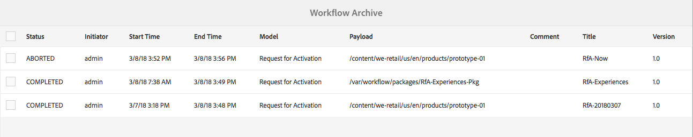

# Workflowinstanties beheren{#administering-workflow-instances}

De workflowconsole biedt verschillende gereedschappen voor het beheer van workflowinstanties om ervoor te zorgen dat deze naar behoren worden uitgevoerd.

>[!NOTE]
>
>De [&#x200B; console JMX &#x200B;](/help/sites-administering/jmx-console.md#workflow-maintenance) verstrekt extra verrichtingen van het werkschemagehoud.

Er zijn verschillende consoles beschikbaar voor het beheer van uw workflows. Gebruik de [&#x200B; globale navigatie &#x200B;](/help/sites-authoring/basic-handling.md#global-navigation) om de **ruit van Hulpmiddelen** te openen, dan uitgezocht **Werkschema**:

* **Modellen**: Beheer werkschemadefinities
* **Instanties**: De mening en beheert het runnen werkschemainstanties
* **Lanceerprogramma&#39;s**: Beheer hoe de werkschema&#39;s moeten worden gelanceerd
* **Archief**: De geschiedenis van de mening van werkschema&#39;s die met succes voltooiden
* **Mislukt**: De geschiedenis van de mening van werkschema&#39;s die met fouten voltooiden
* **auto-wijst** toe: Vorm auto-Wijs werkschema&#39;s aan malplaatjes toe

## Controle van de status van workflowinstanties {#monitoring-the-status-of-workflow-instances}

1. Gebruikend de uitgezochte Navigatie **Hulpmiddelen**, toen **Werkschema**.
1. Selecteer **Instanties** zodat kunt u de lijst van werkschemainstanties tonen momenteel lopend.

   

<!--
## Search Workflow Instances {#search-workflow-instances}

1. Using Navigation select **Tools**, then **Workflow**.
1. Select **Instances** to display the list of workflow instances currently in progress. On the top rail, in the left corner, select **Filters**. Alternatively, you can use the keystrokes alt+1. The following dialog is displayed:

   

1. In the Filter dialog, select the workflow search criteria. You can search based on these inputs:

   * Payload path: Select a specific path
   * Workflow model: Select a workflow model
   * Assignee: Select a workflow Assignee
   * Type: Task, Workflow item, or Workflow Failure
   * Task Status: Active, Complete, or Terminated
   * Where I Am: Owner AND Assignee, Owner only, Assignee only
   * Start Date: Start date before or after a specified date
   * End Date: End date before or after a specified date
   * Due Date: Due date before or after a specified date
   * Updated Date: Updated date before or after a specified date
-->

## Het onderbreken, Hervatten, en het Eindigen van een Instantie van het Werkschema {#suspending-resuming-and-terminating-a-workflow-instance}

1. Gebruikend de uitgezochte Navigatie **Hulpmiddelen**, toen **Werkschema**.
1. Selecteer **Instanties** zodat kunt u de lijst van werkschemainstanties tonen momenteel lopend.

   

1. Selecteer een specifiek punt, dan gebruik **beëindigt**, **Schorsing**, of **hervat**, zoals aangewezen; bevestiging, en/of verdere details worden vereist:

   

## Gearchiveerde workflows weergeven {#viewing-archived-workflows}

1. Gebruikend de uitgezochte Navigatie **Hulpmiddelen**, toen **Werkschema**.
1. Selecteer **Archief** zodat kunt u de lijst van werkschemainstanties tonen die met succes voltooiden.

   

   >[!NOTE]
   >
   >De afbreekstatus wordt beschouwd als een succesvolle beëindiging aangezien het als resultaat van gebruikersactie voorkomt; bijvoorbeeld:
   >
   >* gebruik van **beëindigt** actie
   >* wanneer een pagina waarop een workflow betrekking heeft (geforceerd) wordt verwijderd, wordt de workflow beëindigd

1. Selecteer een specifiek punt, dan **Open Geschiedenis** om meer details te zien:

   

## Fouten in werkstroominstantie herstellen {#fixing-workflow-instance-failures}

Wanneer een werkschema ontbreekt, AEM verstrekt de **&#x200B;**&#x200B;console Failures om u te laten onderzoeken en aangewezen actie voeren zodra de originele oorzaak is behandeld:

* **Details van de Mislukking**
Opent een venster om het **Bericht van de Mislukking**, **Stap**, en **Stapel van de Mislukking** te tonen.

* **Open Geschiedenis**
Geeft details van de workflowgeschiedenis weer.

* **probeer Stap** opnieuw - stelt de de componenteninstantie van de Stap van het Manuscript opnieuw in werking. Gebruik de opdracht Stap opnieuw proberen nadat u de oorzaak van de oorspronkelijke fout hebt opgelost. U kunt bijvoorbeeld de stap opnieuw uitvoeren nadat u een fout in het script hebt opgelost dat door de processtap wordt uitgevoerd.
* **beëindigt** - beëindig het werkschema als de fout een onherstelbare situatie voor het werkschema heeft veroorzaakt. De workflow kan bijvoorbeeld afhankelijk zijn van omgevingsfactoren, zoals informatie in de opslagplaats die niet langer geldig is voor de werkstroominstantie.
* **beëindigt en probeert** opnieuw - Gelijkaardig aan **eindigt** behalve dat is een nieuwe werkschemainstantie begonnen gebruikend de originele nuttige lading, de titel, en de beschrijving.

Om mislukkingen te onderzoeken, dan hervat of beëindigt het werkschema daarna, gebruik de volgende stappen:

1. Gebruikend de uitgezochte Navigatie **Hulpmiddelen**, toen **Werkschema**.
1. Selecteer **Gebreken** zodat kunt u de lijst van werkschemainstanties tonen die niet met succes voltooiden.
1. Selecteer een specifiek item en voer de gewenste actie uit:

   

## Regelmatig leegmaken van workflowinstanties {#regular-purging-of-workflow-instances}

Door het minimaliseren van het aantal workflowexemplaren worden de prestaties van de workflow-engine verbeterd, zodat u regelmatig voltooide of actieve workflowexemplaren uit de repository kunt verwijderen.

Vorm **de Configuratie van de Wrijving van het Werkschema van 0&rbrace; Adobe granite om werkschemainstanties volgens hun leeftijd en status te zuiveren.** U kunt ook werkstroominstanties van alle modellen of van een specifiek model wissen.

U kunt ook meerdere configuraties van de service maken om workflowinstanties die aan verschillende criteria voldoen, leeg te maken. Maak bijvoorbeeld een configuratie die de instanties van een bepaald workflowmodel opschoont wanneer deze langer dan de verwachte tijd worden uitgevoerd. Maak een andere configuratie die alle voltooide workflows na een bepaald aantal dagen leegmaakt om de grootte van de opslagplaats te minimaliseren.

Om de dienst te vormen, kunt u de [&#x200B; Console van het Web &#x200B;](/help/sites-deploying/configuring-osgi.md#osgi-configuration-with-the-web-console) gebruiken of [&#x200B; een configuratie OSGi aan de bewaarplaats &#x200B;](/help/sites-deploying/configuring-osgi.md#osgi-configuration-in-the-repository) toevoegen. In de volgende tabel worden de eigenschappen beschreven die u voor een van beide methoden nodig hebt.

>[!NOTE]
>
>Voor het toevoegen van de configuratie aan de repository is de service-PID:
>
>`com.adobe.granite.workflow.purge.Scheduler`
>
>Omdat de service een fabrieksservice is, vereist de naam van het knooppunt `sling:OsgiConfig` een achtervoegsel met id, bijvoorbeeld:
>
>`com.adobe.granite.workflow.purge.Scheduler-myidentifier`

<table>
 <tbody>
  <tr>
   <th>Naam eigenschap (webconsole)</th>
   <th>OSGi Eigenschapnaam</th>
   <th>Beschrijving</th>
  </tr>
  <tr>
   <td>Taaknaam</td>
   <td>scheduledpurge.name</td>
   <td>Een beschrijvende naam voor de geplande leegloop.</td>
  </tr>
  <tr>
   <td>Workflowstatus</td>
   <td>scheduledpurge.workflowStatus</td>
   <td><p>De status van de te wissen werkstroominstanties. De volgende waarden zijn geldig:</p>
    <ul>
     <li>VOLTOOID: instanties van voltooide werkstromen worden gewist.</li>
     <li>UITVOEREN: instanties van actieve werkstromen worden gewist.</li>
    </ul> </td>
  </tr>
  <tr>
   <td>Te wissen modellen</td>
   <td>scheduledpurge.modelIds</td>
   <td><p>De id van de workflowmodellen die moeten worden gewist. ID is de weg aan de modelknoop, bijvoorbeeld:<br /> /var/workflow/models/dam/update_asset <br /> </p> <p>Als u meerdere modellen wilt opgeven, klikt u op + in de webconsole. </p> <p>Geef geen waarde op om instanties van alle workflowmodellen leeg te maken.</p> </td>
  </tr>
  <tr>
   <td>Werkstroomleeftijd</td>
   <td>scheduledpurge.daysold</td>
   <td>De leeftijd van de werkstroominstanties die in dagen moeten worden gewist.</td>
  </tr>
 </tbody>
</table>

## De maximale grootte van het Postvak IN instellen {#setting-the-maximum-size-of-the-inbox}

U kunt de maximumgrootte van inbox plaatsen door de **Dienst van het Werkschema van de Adobe te vormen Granite**, gebruikend de [&#x200B; Console van het Web &#x200B;](/help/sites-deploying/configuring-osgi.md#osgi-configuration-with-the-web-console) of [&#x200B; voegt een configuratie OSGi aan de bewaarplaats &#x200B;](/help/sites-deploying/configuring-osgi.md#osgi-configuration-in-the-repository) toe. De volgende lijst beschrijft het bezit dat u voor één van beide methode vormt.

>[!NOTE]
>
>Voor het toevoegen van de configuratie aan de repository is de service-PID:
>
>`com.adobe.granite.workflow.core.WorkflowSessionFactory`.

| Naam eigenschap (webconsole) | OSGi Eigenschapnaam |
|---|---|
| Max. grootte van invoerquery | granite.workflow.inboxQuerySize |

## Workflowvariabelen gebruiken voor datastores die eigendom zijn van klanten {#using-workflow-variables-customer-datastore}

Gegevens die door workflows worden verwerkt, worden opgeslagen in de Adobe opgegeven opslagruimte (JCR). Deze gegevens kunnen van nature gevoelig zijn. U kunt alle door de gebruiker gedefinieerde metagegevens of gegevens in uw eigen beheerde opslagruimte opslaan in plaats van de door de Adobe verschafte opslagruimte. In deze secties wordt beschreven hoe u deze variabelen instelt voor externe opslag.

### Het model instellen voor externe opslag van metagegevens {#set-model-for-external-storage}

Op het niveau van het workflowmodel wordt een markering opgegeven die aangeeft dat het model (en de runtimeinstanties) externe opslag van metagegevens heeft. Workflowvariabelen blijven niet behouden in JCR voor de workflowinstanties van de modellen die zijn gemarkeerd voor externe opslag.

Het bezit *userMetadataPersistenceEnabled* wordt opgeslagen op *jcr:inhoudsknoop* van het werkschemamodel. Deze vlag wordt voortgeduurd in werkschemagegevens als *cq:userMetaDataCustomPersistenceEnabled*.

In de onderstaande afbeelding ziet u hoe u de markering op een workflow instelt.


### API&#39;s voor metagegevens in externe opslag {#apis-for-metadata-external-storage}

Als u de variabelen extern wilt opslaan, implementeert u de API&#39;s die in de workflow worden weergegeven.

UserMetaDataPersistenceContext

In de volgende voorbeelden ziet u hoe u de API gebruikt.

```
@ProviderType
public interface UserMetaDataPersistenceContext {
 
    /**
     * Gets the workflow for persistence
     * @return workflow
     */
    Workflow getWorkflow();
 
    /**
     * Gets the workflow id for persistence
     * @return workflowId
     */
    String getWorkflowId();
 
    /**
     * Gets the user metadata persistence id
     * @return userDataId
     */
    String getUserDataId();
}
```

UserMetaDataPersistenceProvider

```
/**
 * This provider can be implemented to store the user defined workflow-data metadata in a custom storage location
 */
@ConsumerType
public interface UserMetaDataPersistenceProvider {
 
   /**
    * Retrieves the metadata using a unique identifier
    * @param userMetaDataPersistenceContext
    * @param metaDataMap of user defined workflow data metaData
    * @throws WorkflowException
    */
   void get(UserMetaDataPersistenceContext userMetaDataPersistenceContext, MetaDataMap metaDataMap) throws WorkflowException;
 
   /**
    * Stores the given metadata to the custom storage location
    * @param userMetaDataPersistenceContext
    * @param metaDataMap metadata map
    * @return the unique identifier that can be used to retrieve metadata. If null is returned, then workflowId is used.
    * @throws WorkflowException
    */
   String put(UserMetaDataPersistenceContext userMetaDataPersistenceContext, MetaDataMap metaDataMap) throws WorkflowException;
} 
```
