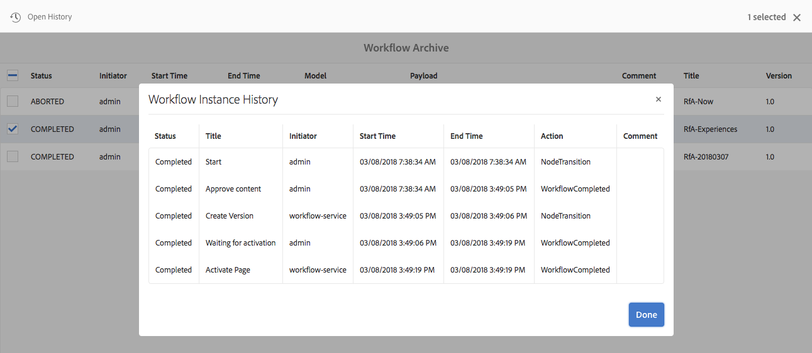

# Workflowinstanties beheren{#administering-workflow-instances}

De workflowconsole biedt verschillende gereedschappen voor het beheer van workflowinstanties om ervoor te zorgen dat deze naar behoren worden uitgevoerd.

>[!NOTE]
>
>De [JMX-console](/help/sites-administering/jmx-console.md#workflow-maintenance) biedt extra workflowonderhoudsbewerkingen.

Er zijn verschillende consoles beschikbaar voor het beheer van uw workflows. Gebruik de [globale navigatie](/help/sites-authoring/basic-handling.md#global-navigation) om de **Gereedschappen** selecteert u vervolgens **Workflow**:

* **Modellen**: Workflowdefinities beheren
* **Instanties**: Doorlopende workflowinstanties weergeven en beheren
* **Launchers**: De manier beheren waarop workflows worden gestart
* **Archief**: De geschiedenis van workflows weergeven die zijn voltooid
* **Mislukt**: De geschiedenis weergeven van workflows die zijn voltooid met fouten
* **Automatisch toewijzen**: Workflows automatisch toewijzen aan sjablonen configureren

## Controle van de status van workflowinstanties {#monitoring-the-status-of-workflow-instances}

1. Navigatie selecteren **Gereedschappen** vervolgens **Workflow**.
1. Selecteren **Instanties** zodat u de lijst met werkstroominstanties kunt weergeven die momenteel worden uitgevoerd.

   

<!--
## Search Workflow Instances {#search-workflow-instances}

1. Using Navigation select **Tools**, then **Workflow**.
1. Select **Instances** to display the list of workflow instances currently in progress. On the top rail, in the left corner, select **Filters**. Alternatively, you can use the keystrokes alt+1. The following dialog is displayed:

   

1. In the Filter dialog, select the workflow search criteria. You can search based on these inputs:

   * Payload path: Select a specific path
   * Workflow model: Select a workflow model
   * Assignee: Select a workflow Assignee
   * Type: Task, Workflow item, or Workflow Failure
   * Task Status: Active, Complete, or Terminated
   * Where I Am: Owner AND Assignee, Owner only, Assignee only
   * Start Date: Start date before or after a specified date
   * End Date: End date before or after a specified date
   * Due Date: Due date before or after a specified date
   * Updated Date: Updated date before or after a specified date
-->

## Het onderbreken, Hervatten, en het Eindigen van een Instantie van het Werkschema {#suspending-resuming-and-terminating-a-workflow-instance}

1. Navigatie selecteren **Gereedschappen** vervolgens **Workflow**.
1. Selecteren **Instanties** zodat u de lijst met werkstroominstanties kunt weergeven die momenteel worden uitgevoerd.

   

1. Selecteer een specifiek item en gebruik **Beëindigen**, **Onderbreken**, of **Hervatten** in voorkomend geval; bevestiging en/of nadere bijzonderheden zijn vereist:

   

## Gearchiveerde workflows weergeven {#viewing-archived-workflows}

1. Navigatie selecteren **Gereedschappen** vervolgens **Workflow**.
1. Selecteren **Archief** zodat u een lijst kunt weergeven met workflowinstanties die zijn voltooid.

   

   >[!NOTE]
   >
   >De afbreekstatus wordt beschouwd als een succesvolle beëindiging aangezien het als resultaat van gebruikersactie voorkomt; bijvoorbeeld:
   >
   >* gebruik van de **Beëindigen** action
   >* wanneer een pagina waarop een workflow betrekking heeft (geforceerd) wordt verwijderd, wordt de workflow beëindigd

1. Selecteer vervolgens een specifiek item **Historie openen** voor meer informatie :

   

## Fouten in werkstroominstantie herstellen {#fixing-workflow-instance-failures}

Wanneer een werkstroom mislukt, biedt AEM de **Mislukt** console om u te laten onderzoeken en aangewezen actie nemen zodra de originele oorzaak is behandeld:

* **Foutgegevens**
Hiermee opent u een venster waarin de **Foutbericht**, **Stap**, en **Stapel mislukt**.

* **Historie openen**
Geeft details van de workflowgeschiedenis weer.

* **Stap opnieuw proberen** - Voert de componentinstantie Scriptstap opnieuw uit. Gebruik de opdracht Stap opnieuw proberen nadat u de oorzaak van de oorspronkelijke fout hebt opgelost. U kunt bijvoorbeeld de stap opnieuw uitvoeren nadat u een fout in het script hebt opgelost dat door de processtap wordt uitgevoerd.
* **Beëindigen** - Beëindig de werkstroom als de fout een onherstelbare situatie voor de werkstroom heeft veroorzaakt. De workflow kan bijvoorbeeld afhankelijk zijn van omgevingsfactoren, zoals informatie in de opslagplaats die niet langer geldig is voor de werkstroominstantie.
* **Beëindigen en opnieuw proberen** - Vergelijkbaar met **Beëindigen** behalve dat een nieuwe werkschemainstantie gebruikend de originele lading, de titel, en de beschrijving is begonnen.

Om mislukkingen te onderzoeken, dan hervat of beëindigt het werkschema daarna, gebruik de volgende stappen:

1. Navigatie selecteren **Gereedschappen** vervolgens **Workflow**.
1. Selecteren **Mislukt** zodat u de lijst met werkstroominstanties kunt weergeven die niet zijn voltooid.
1. Selecteer een specifiek item en voer de gewenste actie uit:

   

## Regelmatig leegmaken van workflowinstanties {#regular-purging-of-workflow-instances}

Door het minimaliseren van het aantal workflowexemplaren worden de prestaties van de workflow-engine verbeterd, zodat u regelmatig voltooide of actieve workflowexemplaren uit de repository kunt verwijderen.

Configureren **Configuratie van opschonen van de Adobe van Granite-workflow** om werkstroominstanties te wissen op basis van hun leeftijd en status. U kunt ook werkstroominstanties van alle modellen of van een specifiek model wissen.

U kunt ook meerdere configuraties van de service maken om workflowinstanties die aan verschillende criteria voldoen, leeg te maken. Maak bijvoorbeeld een configuratie die de instanties van een bepaald workflowmodel opschoont wanneer deze langer dan de verwachte tijd worden uitgevoerd. Maak een andere configuratie die alle voltooide workflows na een bepaald aantal dagen leegmaakt om de grootte van de opslagplaats te minimaliseren.

Om de dienst te vormen, kunt u gebruiken [Webconsole](/help/sites-deploying/configuring-osgi.md#osgi-configuration-with-the-web-console) of [Voeg een configuratie OSGi aan de bewaarplaats toe](/help/sites-deploying/configuring-osgi.md#osgi-configuration-in-the-repository). In de volgende tabel worden de eigenschappen beschreven die u voor een van beide methoden nodig hebt.

>[!NOTE]
>
>Voor het toevoegen van de configuratie aan de repository is de service-PID:
>
>`com.adobe.granite.workflow.purge.Scheduler`
>
>Omdat de dienst een fabrieksdienst is, de naam van `sling:OsgiConfig` knooppunt vereist een achtervoegsel voor id, bijvoorbeeld:
>
>`com.adobe.granite.workflow.purge.Scheduler-myidentifier`

<table>
 <tbody>
  <tr>
   <th>Naam eigenschap (webconsole)</th>
   <th>OSGi Eigenschapnaam</th>
   <th>Beschrijving</th>
  </tr>
  <tr>
   <td>Taaknaam</td>
   <td>scheduledpurge.name</td>
   <td>Een beschrijvende naam voor de geplande leegloop.</td>
  </tr>
  <tr>
   <td>Workflowstatus</td>
   <td>scheduledpurge.workflowStatus</td>
   <td><p>De status van de te wissen werkstroominstanties. De volgende waarden zijn geldig:</p>
    <ul>
     <li>VOLTOOID: instanties van voltooide werkstromen worden gewist.</li>
     <li>UITVOEREN: instanties van actieve werkstromen worden gewist.</li>
    </ul> </td>
  </tr>
  <tr>
   <td>Te wissen modellen</td>
   <td>scheduledpurge.modelIds</td>
   <td><p>De id van de workflowmodellen die moeten worden gewist. De id is het pad naar het modelknooppunt, bijvoorbeeld:<br /> /var/workflow/models/dam/update_asset<br /> </p> <p>Als u meerdere modellen wilt opgeven, klikt u op + in de webconsole. </p> <p>Geef geen waarde op om instanties van alle workflowmodellen leeg te maken.</p> </td>
  </tr>
  <tr>
   <td>Werkstroomleeftijd</td>
   <td>scheduledpurge.daysold</td>
   <td>De leeftijd van de werkstroominstanties die in dagen moeten worden gewist.</td>
  </tr>
 </tbody>
</table>

## De maximale grootte van het Postvak IN instellen {#setting-the-maximum-size-of-the-inbox}

U kunt de maximumgrootte van inbox plaatsen door te vormen **Adobe Granite Workflow Service**, met de [Webconsole](/help/sites-deploying/configuring-osgi.md#osgi-configuration-with-the-web-console) of [Voeg een configuratie OSGi aan de bewaarplaats toe](/help/sites-deploying/configuring-osgi.md#osgi-configuration-in-the-repository). De volgende lijst beschrijft het bezit dat u voor één van beide methode vormt.

>[!NOTE]
>
>Voor het toevoegen van de configuratie aan de repository is de service-PID:
>
>`com.adobe.granite.workflow.core.WorkflowSessionFactory`.

| Naam eigenschap (webconsole) | OSGi Eigenschapnaam |
|---|---|
| Max. grootte van invoerquery | granite.workflow.inboxQuerySize |

## Workflowvariabelen gebruiken voor datastores die eigendom zijn van klanten {#using-workflow-variables-customer-datastore}

Gegevens die door workflows worden verwerkt, worden opgeslagen in de Adobe opgegeven opslagruimte (JCR). Deze gegevens kunnen van nature gevoelig zijn. U kunt alle door de gebruiker gedefinieerde metagegevens of gegevens in uw eigen beheerde opslagruimte opslaan in plaats van de door de Adobe verschafte opslagruimte. In deze secties wordt beschreven hoe u deze variabelen instelt voor externe opslag.

### Het model instellen voor externe opslag van metagegevens {#set-model-for-external-storage}

Op het niveau van het workflowmodel wordt een markering opgegeven die aangeeft dat het model (en de runtimeinstanties) externe opslag van metagegevens heeft. Workflowvariabelen blijven niet behouden in JCR voor de workflowinstanties van de modellen die zijn gemarkeerd voor externe opslag.

De eigenschap *userMetadataPersistenceEnabled* wordt opgeslagen op de *jcr:inhoudsknooppunt* van het workflowmodel. Deze markering wordt in metagegevens van de workflow als *cq:userMetaDataCustomPersistenceEnabled*.

In de onderstaande afbeelding ziet u hoe u de markering op een workflow instelt.


### API&#39;s voor metagegevens in externe opslag {#apis-for-metadata-external-storage}

Als u de variabelen extern wilt opslaan, implementeert u de API&#39;s die in de workflow worden weergegeven.

UserMetaDataPersistenceContext

In de volgende voorbeelden ziet u hoe u de API gebruikt.

```
@ProviderType
public interface UserMetaDataPersistenceContext {
 
    /**
     * Gets the workflow for persistence
     * @return workflow
     */
    Workflow getWorkflow();
 
    /**
     * Gets the workflow id for persistence
     * @return workflowId
     */
    String getWorkflowId();
 
    /**
     * Gets the user metadata persistence id
     * @return userDataId
     */
    String getUserDataId();
}
```

UserMetaDataPersistenceProvider

```
/**
 * This provider can be implemented to store the user defined workflow-data metadata in a custom storage location
 */
@ConsumerType
public interface UserMetaDataPersistenceProvider {
 
   /**
    * Retrieves the metadata using a unique identifier
    * @param userMetaDataPersistenceContext
    * @param metaDataMap of user defined workflow data metaData
    * @throws WorkflowException
    */
   void get(UserMetaDataPersistenceContext userMetaDataPersistenceContext, MetaDataMap metaDataMap) throws WorkflowException;
 
   /**
    * Stores the given metadata to the custom storage location
    * @param userMetaDataPersistenceContext
    * @param metaDataMap metadata map
    * @return the unique identifier that can be used to retrieve metadata. If null is returned, then workflowId is used.
    * @throws WorkflowException
    */
   String put(UserMetaDataPersistenceContext userMetaDataPersistenceContext, MetaDataMap metaDataMap) throws WorkflowException;
} 
```
