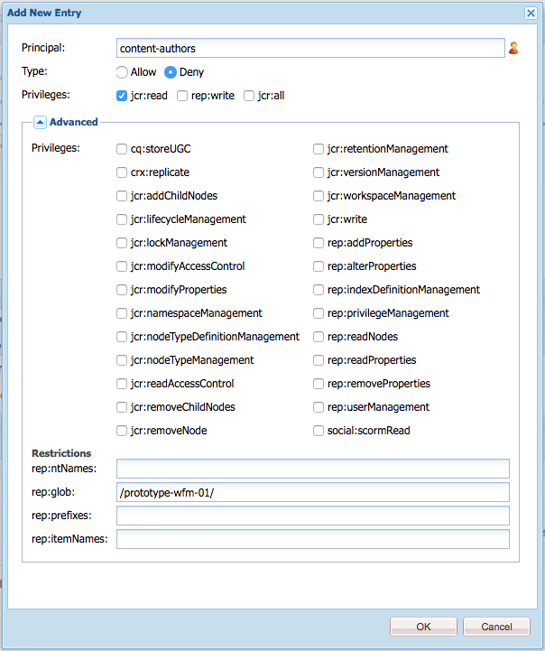

# Toegang tot werkstromen beheren{#managing-access-to-workflows}

Vorm ACLs volgens gebruikersrekeningen om het beginnen van, en het deelnemen aan, werkschema&#39;s toe te staan (of onbruikbaar te maken).

## Vereiste gebruikersmachtigingen voor workflows {#required-user-permissions-for-workflows}

Acties betreffende workflows kunnen worden uitgevoerd als:

* u werkt met de `admin`-account
* de account is toegewezen aan de standaardgroep `workflow-users`:

   * deze groep beschikt over alle rechten die uw gebruikers nodig hebben om workflowhandelingen uit te voeren.
   * als de account in deze groep staat, heeft deze alleen toegang tot werkstromen die het heeft gestart.

* de account is toegewezen aan de standaardgroep `workflow-administrators`:

   * deze groep heeft alle rechten die nodig zijn voor uw geprivilegieerde gebruikers om workflows te controleren en beheren.
   * als de account zich in deze groep bevindt, heeft deze toegang tot alle workflows.

>[!NOTE]
>
>Dit zijn de minimumvereisten. Uw account moet ook de toegewezen deelnemer of een lid van de toegewezen groep zijn om specifieke stappen te kunnen uitvoeren.

## Toegang tot werkstromen configureren {#configuring-access-to-workflows}

De modellen van het werkschema erven een standaard toegangsbeheerlijst (ACL) voor het controleren hoe de gebruikers met werkschema&#39;s kunnen in wisselwerking staan. Om gebruikerstoegang voor een werkschema aan te passen, wijzig de Lijst van het Toegangsbeheer (ACL) in de bewaarplaats voor de omslag die de knoop van het werkschemamodel bevat:

* [Pas ACL voor het specifieke werkschemamodel op /var/workflow/modellen toe](/help/sites-administering/workflows-managing.md#apply-an-acl-for-the-specific-workflow-model-to-var-workflow-models)
* [Creeer een subfolder in /var/workflow/modellen en pas ACL op dat toe](/help/sites-administering/workflows-managing.md#create-a-subfolder-in-var-workflow-models-and-apply-the-acl-to-that)

>[!NOTE]
>
>Voor informatie over het gebruiken van CRXDE Lite om ACLs te vormen, zie [Rechterbeheer van de Toegang](/help/sites-administering/user-group-ac-admin.md#access-right-management).

### Pas ACL voor het specifieke werkschemamodel op /var/workflow/modellen {#apply-an-acl-for-the-specific-workflow-model-to-var-workflow-models} toe

Als het werkschemamodel binnen `/var/workflow/models` wordt opgeslagen dan kunt u specifieke ACL, relevant voor slechts dat werkschema, op de omslag toewijzen:

1. Open CRXDE Lite in uw webbrowser (bijvoorbeeld [http://localhost:4502/crx/de](http://localhost:4502/crx/de)).
1. Selecteer in de nodestructuur het knooppunt voor de map workflowmodellen:

   `/var/workflow/models`

1. Klik op het tabblad **Toegangsbeheer**.
1. Klik in de tabel **Lokaal toegangsbeheerbeleid** (**Toegangsbeheerlijst**) op het pluspictogram om item **toevoegen** toe te voegen.
1. Voeg in het **Add Nieuwe Ingang** dialoogvenster een nieuwe ACE met de volgende eigenschappen toe:

   * **Opdrachtgever**:  `content-authors`
   * **Type**:  `Deny`
   * **Bevoegdheden**:  `jcr:read`
   * **rep:glob**: verwijzing naar de specifieke workflow

   

   De tabel **Toegangsbeheerlijst** bevat nu de beperking voor `content-authors` in het `prototype-wfm-01`-workflowmodel.

   

1. Klik **Alles opslaan**.

   De `prototype-wfm-01`-workflow is niet meer beschikbaar voor leden van de `content-authors`-groep.

### Creeer een subfolder in /var/workflow/modellen en pas ACL op toe {#create-a-subfolder-in-var-workflow-models-and-apply-the-acl-to-that}

Uw [ontwikkelingsteam kan de werkschema&#39;s in een subfolder ](/help/sites-developing/workflows-models.md#creating-a-new-workflow) van

`/var/workflow/models`

Vergelijkbaar met de DAM-workflows die zijn opgeslagen onder

`/var/workflow/models/dam/`

U kunt ACL aan de omslag zelf dan toevoegen.

1. Open CRXDE Lite in uw webbrowser (bijvoorbeeld [http://localhost:4502/crx/de](http://localhost:4502/crx/de)).
1. Selecteer in de knooppuntstructuur het knooppunt voor de afzonderlijke map in de map met workflowmodellen. bijvoorbeeld:

   `/var/workflow/models/prototypes`

1. Klik op het tabblad **Toegangsbeheer**.
1. In **Toepasselijk Beleid van het Toegangsbeheer** lijst, klik het plus pictogram aan **voeg** een ingang toe.
1. Klik in de tabel **Lokaal toegangsbeheerbeleid** (**Toegangsbeheerlijst**) op het pluspictogram om item **toevoegen** toe te voegen.
1. Voeg in het **Add Nieuwe Ingang** dialoogvenster een nieuwe ACE met de volgende eigenschappen toe:

   * **Opdrachtgever**:  `content-authors`
   * **Type**:  `Deny`
   * **Bevoegdheden**:  `jcr:read`

   >[!NOTE]
   >
   >Zoals met [Pas ACL voor het specifieke werkschemamodel op /var/workflow/models](/help/sites-administering/workflows-managing.md#apply-an-acl-for-the-specific-workflow-model-to-var-workflow-models) toe u rep:glob kunt omvatten om toegang tot een specifieke werkschema te beperken.

   

   De tabel **Toegangsbeheerlijst** bevat nu de beperking voor `content-authors` in de map `prototypes`.

   

1. Klik **Alles opslaan**.

   De modellen in de `prototypes` omslag zijn niet meer beschikbaar aan leden van `content-authors` groep.

