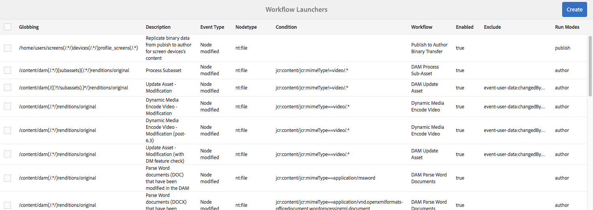

# Workflows starten{#starting-workflows}

Wanneer u workflows beheert, kunt u deze op verschillende manieren starten:

* Handmatig:

   * Van a [ Model van het Werkschema ](#workflow-models).
   * Gebruikend een werkschemapakket voor [ partijverwerking ](#workflow-packages-for-batch-processing).

* Automatisch:

   * In antwoord op knoopveranderingen; [ gebruikend een Lanceertoestel ](#workflows-launchers).

>[!NOTE]
>
>Andere methoden zijn ook beschikbaar voor auteurs; zie voor meer informatie:
>
>* [Workflows toepassen op pagina&#39;s](/help/sites-authoring/workflows-applying.md)
>* [ hoe te om werkschema&#39;s op activa toe te passen DAM ](/help/assets/assets-workflow.md)
>* [ AEM Forms ](https://helpx.adobe.com/aem-forms/6-2/aem-workflows-submit-process-form.html)
>* [ de Projecten van de Vertaling ](/help/sites-administering/tc-manage.md)
>

## Workflowmodellen {#workflow-models}

U kunt een werkschema [ beginnen dat op één van de modellen ](/help/sites-administering/workflows.md#workflow-models-and-instances) op de console van de Modellen van het Werkschema wordt gebaseerd. De enige verplichte informatie is de lading, hoewel een titel en/of commentaar ook kan worden toegevoegd.

## Startprogramma&#39;s voor workflows {#workflows-launchers}

De Workflow Launcher controleert wijzigingen in de inhoudsopslagruimte om workflows te starten afhankelijk van de locatie en het type bron van het gewijzigde knooppunt.

Gebruikend **Lanceerinrichting** kunt u:

* Zie de workflows die al zijn gestart voor specifieke knooppunten.
* Selecteer een workflow die moet worden gestart wanneer een bepaald knooppunt/knooppunttype is gemaakt/gewijzigd/verwijderd.
* Verwijder een bestaande werkstroom-aan-knoop verhouding.

Voor elk knooppunt kan een startprogramma worden gemaakt. Wijzigingen in bepaalde knooppunten leiden echter niet tot workflows. Als u knooppunten wijzigt die onder de volgende paden liggen, worden workflows niet gestart:

* `/var/workflow/instances`
* Willekeurig workflow-inbox-knooppunt ergens in de `/home/users` -vertakking
* `/tmp`
* `/var/audit`
* `/var/classes`
* `/var/eventing`
* `/var/linkchecker`
* `/var/mobile`
* `/var/statistics`

   * Uitzondering: De veranderingen in knopen onder `/var/statistics/tracking` *veroorzaken werkschema&#39;s* om te lanceren.

De standaardinstallatie bevat verschillende definities. Deze worden gebruikt voor taken op het gebied van digitaal middelenbeheer en sociale samenwerking:

## Workflowpakketten voor batchverwerking {#workflow-packages-for-batch-processing}

Workflowpakketten zijn pakketten die kunnen worden doorgegeven aan een workflow als een payload voor verwerking, zodat meerdere bronnen kunnen worden verwerkt.

Een workflowpakket:

* bevat koppelingen naar een set bronnen (zoals pagina&#39;s, elementen).
* bevat pakketinformatie zoals de aanmaakdatum, de gebruiker die het pakket heeft gemaakt en een korte beschrijving.
* is gedefinieerd met behulp van een gespecialiseerde paginasjabloon; op deze pagina&#39;s kan de gebruiker de bronnen in het pakket opgeven.
* kan meerdere keren worden gebruikt.
* kan door de gebruiker worden gewijzigd (voeg of verwijder middelen toe) terwijl de werkschemainstantie eigenlijk loopt.

## Een workflow starten vanuit de Modellen-console {#starting-a-workflow-from-the-models-console}

1. Navigeer aan de **Modellen** console gebruikend **Hulpmiddelen**, **Werkschema**, toen **Modellen**.
1. Selecteer de workflow (in overeenstemming met de consoleweergave). U kunt desgewenst ook Zoeken (linksboven) gebruiken:

   

   >[!NOTE]
   >
   >De **[Transiente](/help/sites-developing/workflows.md#transient-workflows)** indicator toont werkschema&#39;s waarvoor de werkschemageschiedenis niet voortduurt.

1. Selecteer **Werkschema van het Begin** van de toolbar.
1. Het dialoogvenster Workflow uitvoeren wordt geopend, waarin u het volgende kunt opgeven:

   * **Payload**

     Dit kan een pagina, knooppunt, element, pakket zijn, naast andere bronnen.

   * **Titel**

     Een optionele titel waarmee dit exemplaar kan worden geïdentificeerd.

   * **Commentaar**

     Een optionele opmerking waarmee u details van dit exemplaar kunt aangeven.

   

## Een opstartconfiguratie maken {#creating-a-launcher-configuration}

1. Navigeer aan de **console van de Lanceertoestellen van het 0&rbrace; Werkschema gebruikend** Hulpmiddelen **,** Werkschema **, toen** Lanceertoestellen **.**
1. Selecteer **creeer**, dan **voegt Lanceertoestel** toe om de dialoogdoos te openen:

   

   * **Type van Gebeurtenis**

     Het gebeurtenistype dat de workflow start:

      * Gemaakt
      * gewijzigd
      * Verwijderd

   * **Nodetype**

     Het type knooppunt waarop de workflow wordt gestart.

   * **Weg**

     Het pad waarop de workflow wordt gestart.

   * **Wijze(en) van de Looppas**

     Het type server waarop de workflow wordt gestart. Selecteer **Auteur**, **Publish**, of **Auteur &amp; Publish**.

   * **Voorwaarden**

     Een lijst met voorwaarden voor knoopwaarden die, wanneer geëvalueerd, bepalen of de workflow wordt gestart. De volgende voorwaarde zorgt er bijvoorbeeld voor dat de workflow wordt gestart wanneer het knooppunt een eigenschapnaam met de waarde Gebruiker heeft:

     name==User

   * **Eigenschappen**

     Een lijst met functies die moeten worden ingeschakeld. Selecteer de gewenste functies met de keuzelijst.

   * **Gehandicapte Eigenschappen**

   Een lijst met functies die moeten worden uitgeschakeld. Selecteer de gewenste functies met de keuzelijst.

   * **Model van het Werkschema**

     De workflow die moet worden gestart wanneer het gebeurtenistype zich voordoet op Nodetype en/of Path onder de gedefinieerde Voorwaarde.

   * **Beschrijving**

     Uw eigen tekst om de startconfiguratie te beschrijven en te identificeren.

   * **activeer**

     Bepaalt of de workflow wordt gestart:

      * Selecteer **toelaten** om werkschema&#39;s te lanceren wanneer de configuratieeigenschappen worden voldaan.
      * Selecteer **onbruikbaar maken** wanneer het werkschema niet zou moeten uitvoeren (zelfs niet wanneer de configuratieeigenschappen worden tevredengesteld).

   * **Uitgesloten Lijst**

     Hiermee worden JCR-gebeurtenissen opgegeven die moeten worden uitgesloten (negeren) wanneer wordt bepaald of een workflow moet worden geactiveerd.

     Deze lanceereigenschap is een door komma&#39;s gescheiden lijst met items: &quot;

      * `property-name` negeert elke `jcr` -gebeurtenis die op de opgegeven eigenschapnaam wordt geactiveerd. &quot;
      * `event-user-data:<*someValue*>` negeert elke gebeurtenis die de `*<someValue*`> `user-data` bevat die via de [`ObservationManager` API ] is ingesteld (https://developer.adobe.com/experience-manager/reference-materials/spec/jsr170/javadocs/jcr-2.0/javax/jcr/observation/ObservationManager.html#setUserData(java.lang.String).

     Bijvoorbeeld:

     `jcr:lastModified,dc:modified,dc:format,jcr:lastModifiedBy,imageMap,event-user-data:changedByWorkflowProcess`

     Deze functie kan worden gebruikt om alle wijzigingen te negeren die door een ander workflowproces worden veroorzaakt door het uitsluitingsitem toe te voegen:

     `event-user-data:changedByWorkflowProcess`

1. Selecteer **creeer**, om de lancerer tot stand te brengen en aan de console terug te keren.

   Wanneer de juiste gebeurtenis plaatsvindt, wordt de starter geactiveerd en wordt de workflow gestart.

## Een opstartconfiguratie beheren {#managing-a-launcher-configuration}

Nadat u uw lanceringsconfiguratie hebt gecreeerd kunt u de zelfde console gebruiken om de instantie te selecteren, dan **Eigenschappen van de Mening** (en hen uit te geven) of **Schrapping**.
