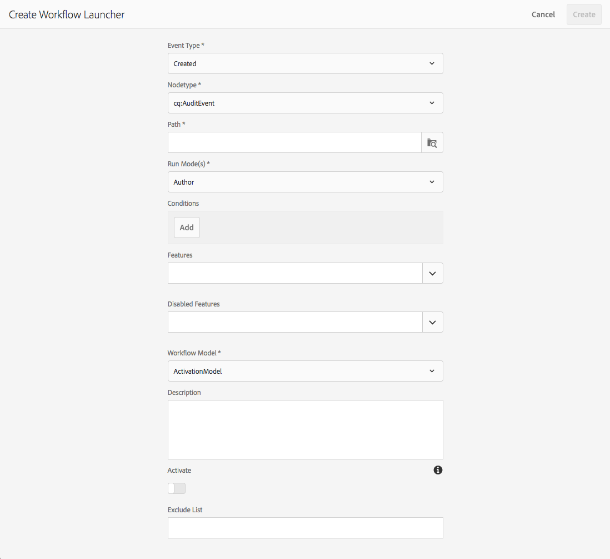

# Workflows starten{#starting-workflows}

Wanneer u workflows beheert, kunt u deze op verschillende manieren starten:

* Handmatig:

   * Van een [workflowmodel](#workflow-models).
   * Workflowpakket gebruiken voor [batchverwerking](#workflow-packages-for-batch-processing).

* Automatisch:

   * Als reactie op wijzigingen in knooppunten; [met een Launcher](#workflows-launchers).

>[!NOTE]
>
>Andere methoden zijn ook beschikbaar voor auteurs; zie voor nadere bijzonderheden :
>
>* [Workflows toepassen op pagina&#39;s](/help/sites-authoring/workflows-applying.md)
>* [Workflows toepassen op DAM-elementen](/help/assets/assets-workflow.md)
>* [AEM-formulieren](https://helpx.adobe.com/aem-forms/6-2/aem-workflows-submit-process-form.html)
>* [Omzettingsprojecten](/help/sites-administering/tc-manage.md)
>

## Workflowmodellen {#workflow-models}

U kunt een workflow starten [op basis van een van de modellen](/help/sites-administering/workflows.md#workflow-models-and-instances) in de console Workflowmodellen. De enige verplichte informatie is de lading, hoewel een titel en/of commentaar ook kan worden toegevoegd.

## Startprogramma&#39;s voor workflows {#workflows-launchers}

De Workflow Launcher controleert wijzigingen in de inhoudsopslagruimte om workflows te starten afhankelijk van de locatie en het type bron van het gewijzigde knooppunt.

Met de **Launcher** kunt u:

* Zie de workflows die al zijn gestart voor specifieke knooppunten.
* Selecteer een workflow die moet worden gestart wanneer een bepaald knooppunt/knooppunttype is gemaakt/gewijzigd/verwijderd.
* Verwijder een bestaande werkstroom-aan-knoop verhouding.

Voor elk knooppunt kan een startprogramma worden gemaakt. Wijzigingen in bepaalde knooppunten leiden echter niet tot workflows. Als u knooppunten wijzigt die onder de volgende paden liggen, worden workflows niet gestart:

* `/var/workflow/instances`
* Willekeurig werkstroom-inbox-knooppunt ergens in de `/home/users` vertakking
* `/tmp`
* `/var/audit`
* `/var/classes`
* `/var/eventing`
* `/var/linkchecker`
* `/var/mobile`
* `/var/statistics`

   * Uitzondering: Als u de onderstaande knooppunten wijzigt, `/var/statistics/tracking` worden ** workflows gestart.

De standaardinstallatie bevat verschillende definities. Deze worden gebruikt voor taken op het gebied van digitaal middelenbeheer en sociale samenwerking:

## Workflowpakketten voor batchverwerking {#workflow-packages-for-batch-processing}

Workflowpakketten zijn pakketten die kunnen worden doorgegeven aan een workflow als een payload voor verwerking, zodat meerdere bronnen kunnen worden verwerkt.

Een workflowpakket:

* bevat koppelingen naar een set bronnen (zoals pagina&#39;s, elementen).
* bevat pakketinformatie zoals de aanmaakdatum, de gebruiker die het pakket heeft gemaakt en een korte beschrijving.
* wordt gedefinieerd met behulp van een gespecialiseerde paginasjabloon; op deze pagina&#39;s kan de gebruiker de bronnen in het pakket opgeven.
* kan meerdere keren worden gebruikt.
* kan door de gebruiker worden gewijzigd (voeg of verwijder middelen toe) terwijl de werkschemainstantie eigenlijk loopt.

## Een workflow starten vanuit de Modellen-console {#starting-a-workflow-from-the-models-console}

1. Navigeer aan de console van **Modellen** gebruikend **Hulpmiddelen**, **Werkschema**, toen **Modellen**.
1. Selecteer de werkstroom (volgens de consolemening); U kunt ook Zoeken (linksboven) gebruiken als dat nodig is:

   

   >[!NOTE]
   >
   >De **[indicator van de Overgang](/help/sites-developing/workflows.md#transient-workflows)**toont werkschema&#39;s waarvoor de werkschemageschiedenis niet zal worden voortgeduurd.

1. Selecteer Werkstroom **** starten op de werkbalk.
1. Het dialoogvenster Werkstroom uitvoeren wordt geopend, zodat u het volgende kunt opgeven:

   * **Payload**

      Dit kan een pagina, knooppunt, element, pakket zijn, naast andere bronnen.

   * **Titel**

      Een optionele titel waarmee dit exemplaar kan worden geïdentificeerd.

   * **Opmerking**

      Een optionele opmerking waarmee u details van dit exemplaar kunt aangeven.
   

## Een opstartconfiguratie maken {#creating-a-launcher-configuration}

1. Navigeer naar de **Workflowstartconsole** met **Tools**, **Workflow** en **Launchers**.
1. Selecteer **Maken** en vervolgens **Startpagina** toevoegen om het dialoogvenster te openen:

   

   * **Type gebeurtenis**

      Het gebeurtenistype dat de workflow start:

      * Gemaakt
      * Gewijzigd
      * Verwijderd
   * **notetype**

      Het type knooppunt waarop de workflow wordt gestart.

   * **Pad**

      Het pad waarop de workflow wordt gestart.

   * **Run-modus(s)**

      Het type server waarop de workflow wordt gestart. Selecteer **Auteur**, **Publiceren** of **Auteur en publiceren**.

   * **Voorwaarden**

      Een lijst met voorwaarden voor knoopwaarden die, wanneer geëvalueerd, bepalen of de workflow wordt gestart. De volgende voorwaarde zorgt er bijvoorbeeld voor dat de workflow wordt gestart wanneer het knooppunt een eigenschapnaam met de waarde Gebruiker heeft:

      name==User

   * **Functies**

      Een lijst met functies die moeten worden ingeschakeld. Selecteer de gewenste functie(s) met de keuzelijst.

   * **Uitgeschakelde functies**
   Een lijst met functies die moeten worden uitgeschakeld. Selecteer de gewenste functie(s) met de keuzelijst.

   * **Workflowmodel**

      De workflow die moet worden gestart wanneer het gebeurtenistype zich voordoet op Nodetype en/of Path onder de gedefinieerde Voorwaarde.

   * **Beschrijving**

      Uw eigen tekst om de startconfiguratie te beschrijven en te identificeren.

   * **Activeren**

      Bepaalt of de workflow wordt gestart:

      * Selecteer **Inschakelen** om werkstromen te starten wanneer aan de configuratie-eigenschappen wordt voldaan.
      * Selecteer **Uitschakelen** wanneer de workflow niet moet worden uitgevoerd (zelfs niet wanneer aan de configuratie-eigenschappen wordt voldaan).
   * **Lijst uitsluiten**

      Hiermee worden JCR-gebeurtenissen opgegeven die moeten worden uitgesloten (negeren) wanneer wordt bepaald of een workflow moet worden geactiveerd.

      Deze lanceereigenschap is een door komma&#39;s gescheiden lijst met items: &quot;

      * `property-name` negeert om het even welke `jcr` gebeurtenis die op de gespecificeerde bezitsnaam teweegbracht. &quot;
      * `event-user-data:<*someValue*>` Hiermee wordt elke gebeurtenis genegeerd die de instelling `*<someValue*`> `user-data` via de [ API `ObservationManager`]bevat (https://docs.adobe.com/content/docs/en/spec/jsr170/javadocs/jcr-2.0/javax/jcr/observation/ObservationManager.html#setUserData(java.lang.String).
      Bijvoorbeeld:

      `jcr:lastModified,dc:modified,dc:format,jcr:lastModifiedBy,imageMap,event-user-data:changedByWorkflowProcess`

      Deze functie kan worden gebruikt om wijzigingen te negeren die door een ander workflowproces worden veroorzaakt door het uitsluitingsitem toe te voegen:

      `event-user-data:changedByWorkflowProcess`

1. Selecteer **Maken**, om de lanceerinrichting tot stand te brengen en aan de console terug te keren.

   Zodra de juiste gebeurtenis plaatsvindt, wordt de starter geactiveerd en wordt de workflow gestart.

## Een opstartconfiguratie beheren {#managing-a-launcher-configuration}

Nadat u de startconfiguratie hebt gemaakt, kunt u dezelfde console gebruiken om de instantie te selecteren en vervolgens Eigenschappen **** weergeven (en bewerken) of **Verwijderen**.
