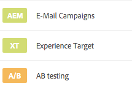
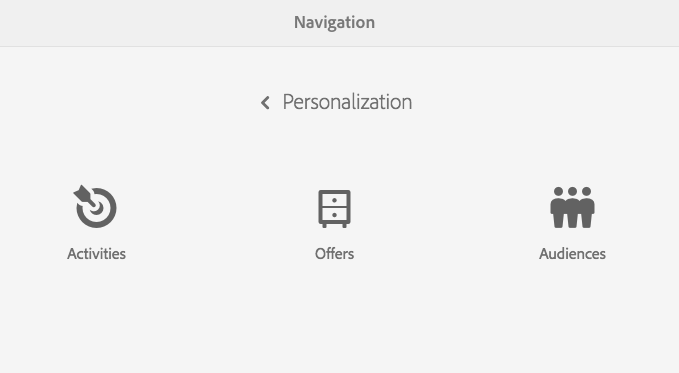
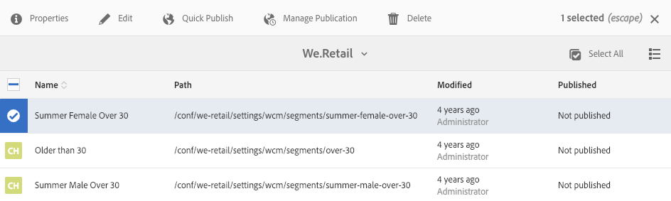
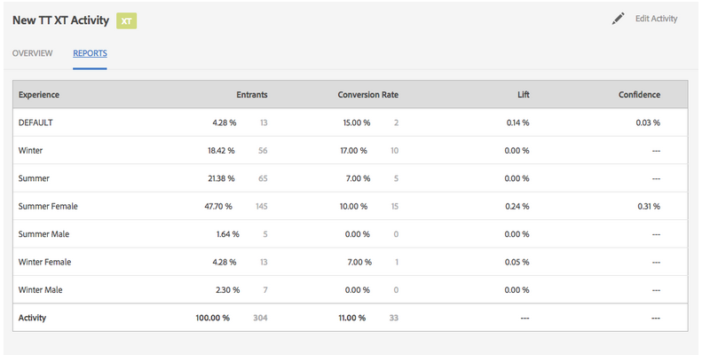
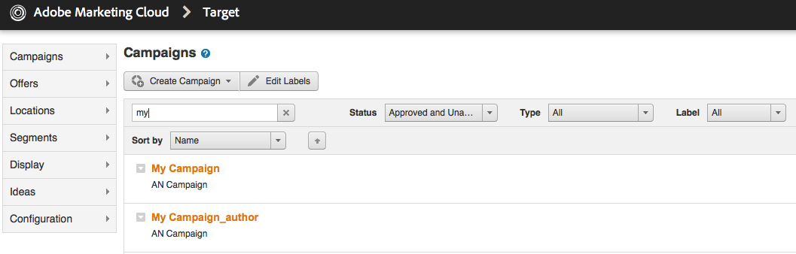

# Beheersactiviteiten{#managing-activities}

Met de Activiteiten-console kunt u de marketing [activiteiten](/help/sites-authoring/personalization.md#activities) van uw merken:

* Voeg merken toe.
* Voor elk merk, voeg en vorm activiteiten toe.
* Beheer activiteiten.

>[!NOTE]
>
>Als u Adobe Target gebruikt als de doelengine, kunt u ook [prestatiegegevens van uw activiteiten weergeven](#viewing-performance-and-converting-winning-experiences-a-b-test). Als u A/B test, kunt u [winnaars omzetten](#viewing-performance-and-converting-winning-experiences-a-b-test).

Op de Activity Console worden de activiteiten georganiseerd door merk. U kunt merken en mappen gebruiken om uw activiteiten te structureren. U navigeert aan de console van Activiteiten door te tikken/te klikken **Personalisatie** en tikken/klikken **Activiteiten**.

Activiteiten zijn beschikbaar in de modus Doel voor [ontwerpen, doelinhoud](/help/sites-authoring/content-targeting-touch.md), waar u ook activiteiten kunt maken. De activiteiten die u op het richten wijze creeert verschijnen in de console van Activiteiten.

De activiteiten worden getoond met een etiket beschrijvend welke soort activiteit wordt bepaald:

* XT - Adobe Target-ervaring gericht
* A/B - Adobe Target A/B-tests
* AEM - Adobe Experience Manager-doelversie (context- of clientcontext-afhankelijk)

>[!NOTE]
>
>Welke soorten activiteiten beschikbaar zijn, wordt bepaald door:
>
>* Als de **alleen_xt** Deze optie is ingeschakeld in de Adobe Target-agent (clientcode) die aan de AEM zijde wordt gebruikt om verbinding te maken met Adobe Target. Vervolgens kunt u **alleen** XT-activiteiten in AEM.
>
>* Als de **alleen_xt** opties zijn **niet** ingeschakeld in de Adobe Target-huurder (clientcode), kunt u vervolgens **beide** XT- en A/B-activiteiten in AEM.
>
>**Aanvullende opmerking:** **alleen_xt** Deze opties zijn een instelling die wordt toegepast op een bepaalde doelgebruiker (clientcode) en kunnen alleen rechtstreeks in Adobe Target worden gewijzigd. U kunt deze optie niet in- of uitschakelen in AEM.

>[!CAUTION]
>
>Het knooppunt met activiteiteninstellingen beveiligen **cq:ActivitySettings** op de publicatie-instantie zodat deze niet toegankelijk is voor normale gebruikers. Het knooppunt activity settings mag alleen toegankelijk zijn voor de service die de activiteitensynchronisatie afhandelt voor Adobe Target.
>
>Zie [Vereisten voor integratie met Adobe Target](/help/sites-administering/target-requirements.md#securingtheactivitysettings) voor nadere informatie.

## Een merk maken met de activiteitenconsole {#creating-a-brand-using-the-activities-console}

Maak een merk waarvoor u marketingactiviteiten wilt beheren.

Wanneer u een merk maakt met de Activiteitenconsole, wordt dit ook weergegeven in het dialoogvenster [Aanbiedingsconsole](/help/sites-authoring/offerlib.md) waar u aanbiedingen kunt maken voor de ervaringen van uw activiteiten.

1. Klik in de navigatieconsole op **Personalisatie**. Klikken **Activiteiten**.

   

1. Klik in de activiteitenconsole op **Maken** dan **Merk maken**.
1. Selecteer de merksjabloon en klik op **Volgende**.
1. Typ een titel voor het merk zoals u deze wilt weergeven in de consoles Activiteiten en Aanbiedingen. Typ of selecteer eventueel een of meer tags die u aan het merk wilt koppelen.
1. Klikken **Maken**. Uw merk wordt weergegeven in de Activiteitenconsole.

## Een activiteit toevoegen/bewerken met de activiteitenconsole {#adding-editing-an-activity-using-the-activities-console}

Voeg een activiteit toe of bewerk een bestaande activiteit om uw marketing inspanningen op specifieke doelgroepen te concentreren. Wanneer u een activiteit creeert/uitgeeft, specificeert u de volgende informatie:

* **Naam:** De naam van de activiteit.
* **Targeting engine:** [AEM](/help/sites-authoring/personalization.md#aem) of [Adobe Target](/help/sites-authoring/personalization.md#adobe-target) als de engine voor gerichte content.

* **Een doelconfiguratie selecteren:** (alleen voor Adobe Target) De cloudconfiguratie die deze activiteit moet gebruiken om verbinding te maken met Adobe Target. Deze optie wordt alleen weergegeven als Adobe Target is geselecteerd als doelengine.
* **Type activiteit: **Het type activiteit - A/B-test of -ervaring gericht op
* **Doelstelling:** (optioneel) Een beschrijving van de activiteit.
* **Ervaringen:** Toewijzingen tussen doelgroepnamen en de marketingsegmenten waarop u zich richt.
* **Verkeerspercentages:** Als A/B-test is geselecteerd, kunt u aanpassen hoeveel verkeer (in percenten) naar elke ervaring gaat.
* **Duur:** De periode waarin de activiteit wordt toegepast.
* **Prioriteit:** De relatieve prioriteit van de activiteit. Wanneer de activiteiten content voor dezelfde gebruikerssegmenten bieden, krijgt de activiteit met de hogere prioriteit voorrang.
* **Metrische data van doel:** Als Adobe Target is geselecteerd als de doelengine, kunt u metrische data van successen aan de activiteit toevoegen. Eén metrische waarde van successen is vereist.

>[!NOTE]
>
>De nieuwe Adobe Target-activiteiten moeten in de gerichte contenteditor worden ***gemaakt***, en niet in de console **Activiteiten**, omdat de synchronisatie met Adobe Target dan mislukt.
>
>U kunt echter bestaande Adobe Target-activiteiten in de console bewerken.

Een activiteit toevoegen:

1. Klik op het merk waarvoor u de activiteit maakt en klik op **Maken** en vervolgens **Activiteit maken**. Als u bezig bent met bewerken, selecteert u de activiteit en klikt u op **Bewerken**.
1. Geef de volgende informatie op en klik op **Volgende**:

   * Een naam voor de activiteit.
   * De doelengine die moet worden gebruikt. ContextHub (AEM) wordt geselecteerd door gebrek. Als u Adobe Target moet gebruiken, maakt u de activiteit in de beoogde inhoudseditor.
   * Als u Adobe Target hebt geselecteerd als de doelengine, selecteert of bewerkt u de cloudconfiguratie die u wilt gebruiken om verbinding te maken met Adobe Target. (Zorg ervoor dat u geen framework selecteert dat u hebt gemaakt voor uw cloudconfiguratie.)
   * (Optioneel) Het doel of een beschrijving van de activiteit.
   * Selecteer het type activiteit.

1. Voeg een of meer ervaringen toe aan de activiteit. Klikken **Ervaring toevoegen**.
1. Als u gebruikmaakt van AEM of Adobe Target-ervaring als doelwit:

   1. Klik **Selecteer het Publiek **en selecteer het segment dat uw ervaringsdoelstellingen.
   1. Klikken **Ervaring toevoegen**, typt u een naam en klikt u op **OK**.

   1. Klik op **Next**.

   Als u Adobe Target A/B Testen gebruikt:

   1. Klik op het potlood in het vak Soorten publiek om een publiek te selecteren.
   1. Klikken **Ervaring toevoegen**, typt u een naam en klikt u op **OK**.

   1. Ga het percentage van verkeer in dat elke ervaring toont.
   1. Klik op **Next**.

1. Als u wilt opgeven wanneer de activiteit begint, gebruikt u de opdracht **Start** vervolgkeuzelijst om een van de volgende waarden te selecteren:

   * **Indien geactiveerd:** De activiteit begint wanneer de pagina die de beoogde inhoud bevat, wordt geactiveerd.
   * **Opgegeven datum en tijd:** Een specifieke tijd. Wanneer u deze optie selecteert, klikt u op het kalenderpictogram, selecteert u een datum en geeft u de tijd op om de activiteit te starten.

1. Als u wilt opgeven wanneer de activiteit eindigt, gebruikt u het vervolgkeuzemenu Einde om een van de volgende waarden te selecteren:

   * **Wanneer gedeactiveerd**: De activiteit eindigt wanneer de pagina die de beoogde inhoud bevat, wordt gedeactiveerd.
   * **Opgegeven datum en tijd**: Een specifieke tijd. Wanneer u deze optie selecteert, klikt u op het kalenderpictogram, selecteert u een datum en geeft u de tijd op om de activiteit te beëindigen.

1. Als u een prioriteit voor de activiteit wilt opgeven, gebruikt u de schuifregelaar om **Laag**, **Normaal**, of **Hoog**.
1. Als u Adobe Target gebruikt als de doelengine, selecteert u wat u met deze activiteit wilt meten. Zie [Het vormen van de Activiteit en het Plaatsen Doelstellingen](/help/sites-authoring/content-targeting-touch.md) voor meer informatie over de beschikbare succescijfers. Selecteer ten minste één doel.
1. Klikken **Opslaan**.

   >[!NOTE]
   >
   >Nadat u een activiteit hebt gemaakt, moet u deze publiceren zodat deze beschikbaar is.

## Publicatie- en publicatieactiviteiten {#publishing-and-unpublishing-activities}

U moet activiteiten publiceren om deze beschikbaar te maken. Omgekeerd kunt u activiteiten onbeschikbaar maken door deze te verwijderen.

>[!NOTE]
>
>Wanneer u het publiceren van een activiteit ongedaan maakt, verandert de status van de activiteit alleen als u de pagina vernieuwt.

Om activiteiten te publiceren of unpublish:

1. Klik op het merk en vervolgens op het gebied dat de activiteit bevat die u wilt publiceren of waarvan u de publicatie ongedaan wilt maken.
1. Klik op het pictogram naast de activiteit of activiteiten die u wilt publiceren of de publicatie ongedaan wilt maken.

   

1. Klik op **Publiceren**. Als u de publicatie ongedaan wilt maken, klikt u op **Publiceren ongedaan maken**. Uw activiteit of activiteiten worden gepubliceerd of niet gepubliceerd en hun statusveranderingen in de console van de Activiteiten (kan vereisen verfrissen).

## Activiteiten met betrekking tot instanties Auteur en Publiceren {#activities-on-author-and-publish-instances}

Wanneer een activiteit wordt geactiveerd die de beoogde Adobe Target-engine gebruikt, wordt een tweede activiteit gemaakt op de publicatie-instantie:

* De activiteit op de auteurinstantie volgt activiteit op de auteursinstantie en is nuttig om de bezoekerservaring te simuleren. De analyses die voor deze activiteit worden geregistreerd, weerspiegelen slechts wat op de auteursinstantie voorkomt.
* De activiteit op de publicatie-instantie geeft de activiteit op de publicatieserver weer en reageert hierop. Dit is de activiteit die op de openbare website loopt. Alleen de publicatieactiviteit is relevant voor het bijhouden en analyseren van het gebruik van de feitelijke openbare site.

## Weergaveprestaties en bekroonde ervaringen (A/B-test) {#viewing-performance-and-converting-winning-experiences-a-b-test}

U kunt de prestaties van elke Adobe Target-activiteit (XT of A/B) bekijken. Als u A/B tests gebruikt, kunt u het winnen ervaring ook omzetten, die dan de standaardervaring wordt.

Om de prestaties van de activiteit te bekijken en het winnen ervaringen om te zetten:

1. In **Personalisatie**, klikt u op **Activiteiten** om naar de **Activiteiten** console.
1. Klik op het merk waarvoor u activiteiten wilt zien.
1. Selecteer de activiteit en klik **Eigenschappen weergeven** en klik op de knop **Rapporten** en selecteert u de activiteit waarvoor u de prestaties voor het winnen/omzetten van winnende ervaringen wilt bekijken. Prestatiedata worden weergegeven.

   

1. Klik op de knop **Push-winnaar** een koppeling om die ervaring als de standaardervaring te gebruiken.

   Als u de winnaar omzet, gebeurt het volgende:

   * De huidige activiteit wordt uitgeschakeld
   * Hiermee wijzigt u alle pagina&#39;s en vervangt u de doelinhoud door de feitelijke inhoud van de winnende ervaring. De inhoud van de winnende ervaring wordt onderdeel van de normale pagina **zonder** doelversie.

   

   Een winnende ervaring is de ervaring die meer Lift in de rapporten produceert, die op de omrekeningskoers gebaseerd is.

1. Klikken **Ja** om te bevestigen dat u de winnaar wilt converteren, de huidige ervaring uit te schakelen en deze te vervangen door de inhoud van de winnende ervaring.

## Synchroniseren van activiteiten met Adobe Target {#synchronizing-activities-with-adobe-target}

Activiteiten die gebruikmaken van de Adobe Target-doelengine worden gesynchroniseerd met Adobe Target-campagnes. Een activiteit wordt automatisch gesynchroniseerd met Adobe Target wanneer aan de volgende voorwaarden wordt voldaan:

* De activiteit bevat minstens één ervaring.
* Ten minste één ervaring bevat een toegewezen segment en één aanbieding.
* Elke ervaring in de activiteit moet hetzelfde aantal aanbiedingen hebben.

Deze voorwaarden gelden voor activiteiten met betrekking tot auteur- en publicatieinstanties.

Wanneer een activiteit wordt gesynchroniseerd, wordt een overeenkomstige campagne gecreeerd in Adobe Target:

* De activiteiten op het publicatieexemplaar hebben de zelfde naam zoals de overeenkomstige campagne van Adobe Target.
* De activiteiten op de auteurinstantie corresponderen met de campagnes van het Doel van de zelfde naam met `_author` achtervoegsel.

De _auteuractiviteiten worden onmiddellijk gesynchroniseerd wanneer de activiteit wordt gewijzigd. De directe synchronisatie laat de simulatie van activiteiten met de Context of ContextHub van de Cliënt toe.

De publicatieactiviteiten worden gesynchroniseerd wanneer de activiteit wordt gepubliceerd naar de AEM-publicatie-instantie.

## Synchronisatie van activiteiten voor probleemoplossing {#troubleshooting-activity-synchronization}

Wanneer AEM een activiteit met Adobe Target synchroniseert, omvat AEM een bezit van de genoemde activiteit `thirdPartyId`. De waarde van deze eigenschap is gebaseerd op het pad van de activiteit in de AEM repository. Geen twee campagnes in Adobe Target kunnen de zelfde waarde voor `thirdPartyId` eigenschap. Daarom zal een activiteit er niet in slagen om te synchroniseren als een bestaande campagne (van een verschillend type AB, XT) in Adobe Target de zelfde waarde voor gebruikt `thirdPartyId`.

Deze situatie kan zich voordoen in de volgende omstandigheden:

1. Er wordt een activiteit gemaakt en gesynchroniseerd met Adobe Target.
1. Op een andere AEM wordt een activiteit onder hetzelfde merk en met dezelfde naam gemaakt. Synchronisatie van deze activiteit mislukt bij poging.

Deze situatie kan zich ook voordoen in de volgende omstandigheden:

1. Er wordt een activiteit gemaakt en gesynchroniseerd met Adobe Target. De activiteit wordt dan geschrapt op AEM.
1. Een activiteit wordt gecreeerd onder het zelfde merk en gebruikend de zelfde naam zoals de geschrapte activiteit. Synchronisatie van deze activiteit mislukt bij poging.

Gebruik altijd unieke namen voor activiteiten om synchronisatieproblemen te voorkomen. Als een activiteit er niet in slaagt te synchroniseren, kunt u de campagne in Adobe Target verwijderen die dezelfde naam gebruikt als die campagne niet wordt gebruikt.

>[!NOTE]
>
>Wanneer u een campagne maakt in Adobe Target, wordt een eigenschap toegewezen met de naam `thirdPartyId t`Op elke campagne. Wanneer u de campagne in Adobe Target verwijdert, `thirdPartyId` wordt niet verwijderd. U kunt de `thirdPartyId` voor campagnes van verschillende types (AB, XT) en het kan niet manueel worden verwijderd. Om dit probleem te voorkomen, geeft u elke campagne een unieke naam. U kunt de campagnemenamen niet opnieuw gebruiken in verschillende typen campagnes.
>
>Als u dezelfde naam gebruikt in hetzelfde type campagne, overschrijft u de bestaande campagne.
>
>Als tijdens het synchroniseren de fout &quot;Verzoek is mislukt. `thirdPartyId` bestaat al.&quot; Wijzig de naam van de campagne en synchroniseer opnieuw.
