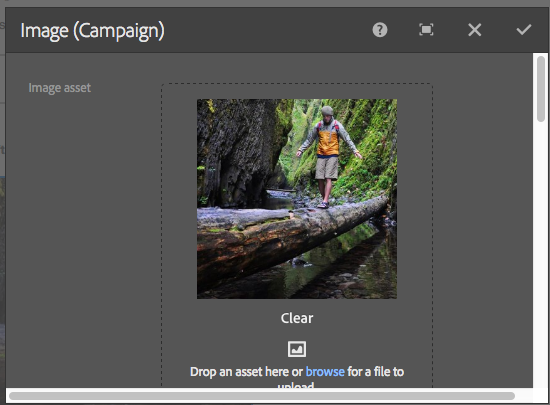

# Adobe Campaign-componenten{#adobe-campaign-components}

Wanneer u integreert met Adobe Campaign, hebt u componenten beschikbaar voor wanneer u met nieuwsbrieven en met formulieren werkt. Beide worden in dit document beschreven.

>[!CAUTION]
>
>De AEM e-mailcomponenten zijn vervangen. Vanwege de aard van e-mail, waarin inhoud en stijl worden samengevoegd, worden de e-mailcomponenten die door AEM buiten de box worden geleverd van beperkte hergebruik voor klanten omdat aangepaste stijlen moeten worden geïmplementeerd in alle componenten die vereist zijn voor projecten.
>
>E-mailcomponenten kunnen op projectniveau worden geïmplementeerd en de verouderde AEM e-mailcomponenten laten zien hoe dat kan worden bereikt. Gebruik deze vervangen componenten echter niet voor projecten.

## Adobe Campaign Newsletter-componenten {#adobe-campaign-newsletter-components}

Alle componenten van de Campagne volgen de beste praktijken die in [Aanbevolen procedures voor e-mailsjablonen](/help/sites-administering/best-practices-for-email-templates.md) en zijn gebaseerd op de opmaaktaal van de Adobe [HTL](https://helpx.adobe.com/experience-manager/htl/using/overview.html).

Wanneer u een nieuwsbrief/e-mail opent die wordt gevormd om met Adobe Campaign te integreren, zou u de volgende componenten in moeten zien **Adobe Campaign Newsletter** sectie:

* Kop (campagne)
* Afbeelding (campagne)
* Koppeling (campagne)
* Scene7-afbeeldingssjabloon (campagne)
* Gerichte referentie (campagne)
* Tekst en afbeelding (campagne)
* Tekst en persoonlijke voorkeur (campagne)

Een beschrijving van deze componenten vindt u in de volgende sectie.

De componenten zijn als volgt:

### Kop (campagne) {#heading-campaign}

De kopcomponent kan:

* Geef de naam van de huidige pagina weer door de **Titel** veld leeg.
* Geef een tekst weer die u opgeeft in het dialoogvenster **Titel** veld.

U bewerkt de **Kop (campagne)** rechtstreeks. Laat leeg als u de paginatitel wilt gebruiken.

U kunt het volgende configureren:

* **Titel**
Als u een andere naam dan de paginatitel wilt gebruiken, voert u deze hier in.

* **Kop niveau (1, 2, 3, 4)**
Het niveau van de rubriek op basis van de grootten 1-4 van de rubriek HTML.

In het volgende voorbeeld ziet u een component Kop (Campagne) die wordt weergegeven.

### Afbeelding (campagne) {#image-campaign}

In de afbeeldings-(campagne)component wordt een afbeelding en de bijbehorende tekst weergegeven volgens de opgegeven parameters.

U kunt een afbeelding uploaden, deze vervolgens bewerken en bewerken (bijvoorbeeld uitsnijden, roteren, koppeling/titel/tekst toevoegen).

U kunt een afbeelding slepen en neerzetten vanuit de [Middelenbrowser](/help/sites-authoring/author-environment-tools.md#assetsbrowsertouchoptimizedui) rechtstreeks op de component of de component [Dialoogvenster configureren](/help/sites-authoring/editing-content.md#editconfigurecopycutdeletepastetouchoptimizedui). U kunt een beeld van de Configure dialoog ook uploaden; dit dialoog controleert alle definities en manipulatie van het beeld:

>[!NOTE]
>
>Voer gegevens in het dialoogvenster **Alt-tekst** of de afbeelding kan niet worden opgeslagen.

Nadat de afbeelding is geüpload (en niet eerder), kunt u [plaatsen, bewerken](/help/sites-authoring/editing-content.md#editcontenttouchoptimizedui) om de afbeelding naar wens uit te snijden of te roteren:

>[!NOTE]
>
>De editor op locatie gebruikt de oorspronkelijke grootte en hoogte-breedteverhouding van de afbeelding tijdens het bewerken. U kunt ook de eigenschappen voor hoogte en breedte opgeven. Beperkingen voor grootte en hoogte-breedteverhouding die in de eigenschappen zijn gedefinieerd, worden toegepast wanneer u de bewerkingswijzigingen opslaat.
>
>Afhankelijk van uw geval, kunnen de minimum en maximumbeperkingen ook door [ontwerp van de pagina](/help/sites-developing/designer.md); deze worden ontwikkeld tijdens de uitvoering van het project.

Er zijn verschillende aanvullende opties beschikbaar in de modus Volledig scherm, bijvoorbeeld voor toewijzen en zoomen:

Wanneer een beeld wordt geladen, kunt u het volgende vormen:

* **Kaart**
Als u een afbeelding wilt toewijzen, selecteert u Kaart. U kunt opgeven hoe u de afbeelding met hyperlinks wilt maken (rechthoek, veelhoek enzovoort) en waar het gebied naartoe moet wijzen.

* **Uitsnijden**
Selecteer Uitsnijden om een afbeelding uit te snijden. Gebruik de muis om de afbeelding uit te snijden.

* **Roteren**
Selecteer Roteren als u een afbeelding wilt roteren. Herhaal deze bewerking totdat de afbeelding op de gewenste manier is geroteerd.

* **Wissen**
Verwijder de huidige afbeelding.

* Zoombalk (alleen klassiek) Als u wilt in- of uitzoomen op de afbeelding, gebruikt u de schuifbalk onder de afbeelding (boven de knoppen OK en Annuleren)
* **Titel**
De titel van de afbeelding.

* **Alt-tekst**
Een alternatieve tekst die kan worden gebruikt bij het maken van toegankelijke inhoud.

* **Koppelen naar**
Maak een koppeling naar elementen of andere pagina&#39;s binnen uw website.

* **Beschrijving**
Een beschrijving van de afbeelding.

* **Grootte**
Hiermee stelt u de hoogte en de breedte van de afbeelding in.

>[!NOTE]
>
>Voer gegevens in het dialoogvenster **Alt-tekst** in het veld **Geavanceerd** of de afbeelding kan niet worden opgeslagen. Het volgende foutbericht wordt weergegeven:
>
>`Validation failed. Verify the values of the marked fields.`
>

In het volgende voorbeeld ziet u een component Image (Campaign) die wordt weergegeven.

### Koppeling (campagne) {#link-campaign}

Met de component Koppeling (Campagne) kunt u een koppeling naar uw nieuwsbrief toevoegen.

U kunt het volgende configureren in het dialoogvenster **Weergave**, **URL-info**, of **Geavanceerd** tabs:

* **Bijschrift koppelen**
Het bijschrift voor de koppeling. Dit is de tekst die gebruikers zien.

* **Knopinfo Koppeling**
Hiermee voegt u aanvullende informatie toe over het gebruik van de koppeling.

* **LinkType**
Selecteer in de vervolgkeuzelijst tussen een **Aangepaste URL** en **Aangepast document**. Dit veld is verplicht. Als u Aangepaste URL selecteert, kunt u de URL van de koppeling opgeven. Als u Aangepast document selecteert, kunt u het documentpad opgeven.

* **Aanvullende URL-parameter**
Voeg aanvullende URL-parameters toe. Klik op Item toevoegen om meerdere items toe te voegen.

>[!NOTE]
>
>Voer gegevens in het dialoogvenster **Koppelingstype** in het veld **URL-info** of de component kan niet worden opgeslagen. Het volgende foutbericht wordt weergegeven:
>
>`Validation failed. Verify the values of the marked fields.`
>

In het volgende voorbeeld ziet u een component Link (Campagne) die wordt weergegeven.

### Dynamic Media Classic (Scene7)-afbeeldingssjabloon (campagne) {#scene-image-template-campaign}

Dynamic Media Classic (Scene7)-afbeeldingssjablonen zijn gelaagde afbeeldingsbestanden, waarbij inhoud en eigenschappen kunnen worden geparametriseerd voor variabiliteit. De **[!UICONTROL Image template]** kunt u Scene7-sjablonen gebruiken in nieuwsbrieven en de waarden van sjabloonparameters wijzigen. Bovendien kunt u de metagegevensvariabelen van Adobe Campaign binnen de parameters gebruiken, zodat elke gebruiker de afbeelding op een persoonlijke manier ervaart.

Klikken **Bewerken** om de component te configureren. U kunt de instellingen configureren die in deze sectie worden beschreven. Deze Scene7-afbeeldingssjabloon wordt in detail beschreven [Scene7 Image Template-component](/help/assets/scene7.md#image-template).

Daarnaast bevat het parametervenster alle sjabloonparameters die zijn gedefinieerd voor de sjabloon in Scene7. Voor elk van deze parameters kunt u de waarde aanpassen, variabelen invoegen of de standaardwaarde ervan herstellen.

### Gerichte referentie (campagne) {#targeted-reference-campaign}

Met de component Doelverwijzing (Campagne) kunt u een verwijzing naar een doelalinea maken.

In deze component navigeert u naar de doelalinea om deze te selecteren.

Klik op het mappictogram om naar de alinea te navigeren waarnaar u wilt verwijzen. Klik op het vinkje als u klaar bent.

### Tekst en afbeelding (campagne) {#text-image-campaign}

Met de component Tekst en afbeelding (campagne) voegt u een tekstblok en een afbeelding toe.

Wanneer u klikt om de component te vormen, selecteert u Tekst of Beeld.

Selecteren **Tekst** geeft een online editor weer:

Selecteren **Afbeelding** Hiermee geeft u de lokale editor voor afbeeldingen weer:

Zie [Component Afbeelding (campagne)](#image-campaign) voor meer informatie over het werken met afbeeldingen. Zie [Component Tekst en persoonlijke voorkeur (campagne)](#text-personalization-campaign) voor meer informatie over het werken met tekst.

Net als bij de componenten Text &amp; Personalization (Campaign) en Image (Campaign) kunt u het volgende configureren:

* **Tekst**
Voer tekst in. Met de werkbalk kunt u de opmaak wijzigen, lijsten maken en koppelingen toevoegen.

* **Afbeelding**
Sleep een afbeelding vanuit de zoekfunctie voor inhoud of klik om naar een afbeelding te bladeren. Uitsnijden of roteren naar wens.

* **Eigenschappen van afbeelding** (**Geavanceerde afbeeldingseigenschappen**) Hier kunt u het volgende opgeven:

   * **Titel**
De titel van het blok; deze wordt weergegeven door mouseover.

   * **Alt-tekst**
Alternatieve tekst die moet worden weergegeven als de afbeelding niet kan worden weergegeven.

   * **Koppeling naar**
Maak een koppeling naar elementen of andere pagina&#39;s binnen uw website.

   * **Beschrijving**
Een beschrijving van de afbeelding.

   * **Grootte**
Hiermee stelt u de hoogte en breedte van de afbeelding in.

>[!NOTE]
>
>De **Alt-tekst** in het veld **Geavanceerd** is vereist of de component kan niet opslaan en u ziet het volgende foutbericht:
>
>`Validation failed. Verify the values of the marked fields.`
>

In het volgende voorbeeld ziet u een component Text &amp; Image (Campaign) die wordt weergegeven.

### Tekst en persoonlijke voorkeur (campagne) {#text-personalization-campaign}

Met de component Tekst en personalisatie (Campagne) kunt u een tekstblok invoeren met een WYSIWYG-editor, met functionaliteit die wordt geboden door de [Rich Text Editor](/help/sites-authoring/rich-text-editor.md). Bovendien kunt u met deze component contextvelden en personaliseringsblokken gebruiken die beschikbaar zijn in Adobe Campaign. Zie ook [Persoonlijke instellingen invoegen](/help/sites-authoring/campaign.md#inserting-personalization).

Met de selectie van pictogrammen kunt u de tekst opmaken, inclusief lettertypekenmerken, uitlijning, koppelingen, lijsten en inspringing. De functionaliteit is in principe hetzelfde in [beide UI&#39;s](/help/sites-authoring/editing-content.md), hoewel het uiterlijk anders is:

In de Inplace redacteur kunt u tekst toevoegen, de rechtvaardiging veranderen, verbindingen toevoegen en verwijderen, contextgebieden of verpersoonlijkingsblokken toevoegen, en volledig-schermwijze ingaan. Wanneer u klaar bent met het toevoegen van tekst/personalisatie, selecteert u het vinkje om de wijzigingen op te slaan (of x om te annuleren). Zie [Op plaats bewerken](/help/sites-authoring/editing-content.md#editcontenttouchoptimizedui) voor meer informatie .

>[!NOTE]
>
>* Welke personalisatievelden beschikbaar zijn, is afhankelijk van de Adobe Campaign-sjabloon waaraan uw nieuwsbrief is gekoppeld.
>* Nadat u een persoon van ContextHub selecteert, worden de verpersoonlijkingsgebieden automatisch vervangen door gegevens van het geselecteerde profiel.
>
>Zie [Persoonlijke instellingen invoegen](/help/sites-authoring/campaign.md#inserting-personalization).

>[!NOTE]
>
>Alleen de velden die zijn gedefinieerd in het dialoogvenster **nms:zaadMember** schema of een van de extensies wordt in aanmerking genomen. De kenmerken van de tabellen die zijn gekoppeld aan **nms:zaadMember** niet beschikbaar zijn.

## Adobe Campaign-formuliercomponenten {#adobe-campaign-form-components}

Met Adobe Campaign-componenten kunt u een formulier maken dat gebruikers invullen om zich te abonneren op een nieuwsbrief, zich af te melden bij een nieuwsbrief of hun gebruikersprofielen bij te werken. Zie [Adobe Campaign Forms maken](/help/sites-authoring/adobe-campaign-forms.md) voor meer informatie .

Elk componentveld kan worden gekoppeld aan een Adobe Campaign-databaseveld. De beschikbare velden verschillen afhankelijk van het type gegevens dat ze bevatten, zoals wordt beschreven in de sectie [Componenten en gegevenstype](#components-and-data-type). Als u het schema voor ontvangers in Adobe Campaign uitbreidt, zijn de nieuwe velden beschikbaar in de componenten waarvan de gegevenstypen overeenkomen.

Wanneer u een formulier opent dat is geconfigureerd voor integratie met Adobe Campaign, ziet u de volgende componenten in het dialoogvenster **Adobe Campaign** sectie:

* Selectievakje (campagne)
* Datumveld (campagne) en Datumveld/HTML5 (campagne)
* Gecodeerde primaire sleutel (campagne)
* Foutweergave (campagne)
* Verborgen afstemmingssleutel (campagne)
* Numeriek veld (campagne)
* Optieveld (campagne)
* Checklist voor abonnementen (campagne)
* Tekstveld (campagne)

De componenten zijn als volgt:

In deze sectie wordt elke component in detail beschreven.

### Componenten en gegevenstype {#components-and-data-type}

In de volgende tabel worden de componenten beschreven die beschikbaar zijn om Adobe Campaign-profielgegevens weer te geven en te wijzigen. Elke component kan worden toegewezen aan een Adobe Campaign-profielveld om de waarde weer te geven en het veld bij te werken wanneer het formulier wordt verzonden. De verschillende componenten kunnen slechts aan gebieden van een aangewezen gegevenstype worden aangepast.

<table>
 <tbody>
  <tr>
   <td>
<strong>Component</strong>
 </td>
   <td>
<strong>Gegevenstype van Adobe Campaign-veld</strong>
 </td>
   <td>
<strong>Voorbeeldveld</strong>
 </td>
  </tr>
  <tr>
   <td>
Selectievakje (campagne)
 </td>
   <td>
boolean
 </td>
   <td>
Geen contact meer (via een kanaal)
 </td>
  </tr>
  <tr>
   <td>
Datumveld (campagne)
 
Datumveld/HTML 5 (campagne)
 </td>
   <td>
date
 </td>
   <td>
Geboortedatum
 </td>
  </tr>
  <tr>
   <td>
Numeriek veld (campagne)
 </td>
   <td>
numeriek (byte, short, long, double)
 </td>
   <td>
Leeftijd
 </td>
  </tr>
  <tr>
   <td>
Optieveld (campagne)
 </td>
   <td>
byte met gekoppelde waarden
 </td>
   <td>
Geslacht
 </td>
  </tr>
  <tr>
   <td>
Tekstveld (campagne)
 </td>
   <td>
string
 </td>
   <td>
E-mail
 </td>
  </tr>
 </tbody>
</table>

### Instellingen die door de meeste componenten worden gebruikt {#settings-common-to-most-components}

De Adobe Campaign-componenten hebben dezelfde instellingen voor alle componenten (behalve de componenten Gecodeerde primaire sleutel en Verborgen reconstruatietoets).

In de meeste componenten, kunt u het volgende vormen:

#### Titel en tekst {#title-and-text}

* **Titel**
Als u een andere naam dan de elementnaam wilt gebruiken, voert u deze hier in.

* **Titel verbergen**
Schakel dit selectievakje in als u de titel niet zichtbaar wilt maken.

* **Beschrijving**
Voeg een beschrijving aan het gebied toe om meer informatie voor gebruikers te verstrekken.

* **Alleen waarde tonen**
Hiermee wordt alleen de waarde weergegeven als er een is

#### Adobe Campaign {#adobe-campaign}

U kunt het volgende configureren:

* **Toewijzing**
Selecteer desgewenst een personalisatieveld voor Adobe Campaign.

* **Afstemmingssleutel**
Schakel dit selectievakje in als dit veld deel uitmaakt van de afstemmingssleutel.

#### Restricties {#constraints}

* **Vereist** Schakel dit selectievakje in om deze component verplicht te maken. Gebruikers moeten dus een waarde invoeren.
* **Vereist bericht** Voeg desgewenst een bericht toe met de mededeling dat het veld verplicht is.

#### Stijlen {#styling}

* **CSS**
Voer de CSS-klassen in die u voor deze component wilt gebruiken.

### Selectievakje (campagne) {#checkbox-campaign}

Met de component CheckBox (Campagne) kan de gebruiker Adobe Campaign-profielvelden wijzigen die van een Booleaans gegevenstype zijn. U kunt bijvoorbeeld een component CheckBox (Campagne) hebben waarmee de ontvanger kan opgeven dat hij of zij niet via een kanaal mag worden benaderd.

U kunt [configureren, instellingen die door de meeste Adobe Campaign-componenten worden gebruikt](#settings-common-to-most-components) in de component Checkbox (Campagne).

In het volgende voorbeeld ziet u een component CheckBox (Campagne) die wordt weergegeven.

### Datumveld (campagne) en Datumveld/HTML 5 (campagne) {#date-field-campaign-and-date-field-html-campaign}

Gebruik het datumveld om ontvangers toe te staan naar een datum te gaan, bijvoorbeeld als u wilt dat de ontvangers hun geboortedatum opgeven. De datumnotatie komt overeen met de notatie die wordt gebruikt in uw Adobe Campaign-exemplaar.

Naast [instellingen die door de meeste Adobe Campaign-componenten worden gebruikt](#settings-common-to-most-components)kunt u het volgende configureren:

* **Restricties - Restrictie** vervolgkeuzelijst U kunt selecteren - **Geen** of **Datum -** om de beperking van een datum of geen beperking toe te voegen. Als u datum selecteert, moeten de antwoordgebruikers in het veld een datumnotatie invoeren.

* **Restrictiebericht** Bovendien kunt u een beperkingsbericht toevoegen zodat de gebruikers weten hoe te om hun antwoorden behoorlijk te formatteren.
* **Stijlen - breedte** Pas de breedte van het veld aan door op de knop **+** en **-** pictogrammen of het invoeren van een getal.

In het volgende voorbeeld wordt een component Date Field (Campaign) weergegeven met de breedte aangepast.

### Gecodeerde primaire sleutel (campagne) {#encrypted-primary-key-campaign}

Deze component definieert de naam van de URL-parameter die de id van een Adobe Campaign-profiel zal bevatten (**Hoofd Resource Identifier** of **Gecodeerde primaire sleutel** in respectievelijk Adobe Campaign Standard en 6.1).

Op elk formulier worden Adobe Campaign-profielgegevens weergegeven en gewijzigd **moet** omvat een gecodeerde primaire-sleutelcomponent.

U kunt het volgende in de Encrypted Primaire (Campagne) component vormen:

* **Titel en tekst - Naam element** Wordt standaard ingesteld op encryptedPK. U hoeft de elementnaam alleen te wijzigen als deze conflicteert met de naam van een ander element op het formulier. Geen twee formuliervelden kunnen dezelfde elementnaam hebben.
* **Adobe Campaign - URL-parameter** Voeg de URL-parameter voor de EPK toe. U kunt bijvoorbeeld de waarde **epk**.

In het volgende voorbeeld ziet u een component Encrypted Primary Key (Campaign) die wordt weergegeven.

### Foutweergave (campagne) {#error-display-campaign}

Met deze component kunt u back-endfouten weergeven. De foutafhandeling van het formulier moet zijn ingesteld op Volgende om de component correct te laten werken.

In het volgende voorbeeld ziet u een component Error Display (Campaign) die wordt weergegeven.

### Verborgen afstemmingssleutel (campagne) {#hidden-reconciliation-key-campaign}

Met de component Verborgen afstemmingssleutel (Campagne) kunt u verborgen velden toevoegen als onderdeel van de afstemmingssleutel aan een formulier.

U kunt het volgende configureren in de component Verborgen afstemmingssleutel (Campagne):

* **Titel en tekst - Naam element** Is standaard ingesteld op reconcilKey. U hoeft de elementnaam alleen te wijzigen als deze conflicteert met de naam van een ander element op het formulier. Geen twee formuliervelden kunnen dezelfde elementnaam hebben.
* **Adobe Campaign - Toewijzing** Toewijzen aan een Adobe Campaign-personalisatieveld.

In het volgende voorbeeld ziet u een component Verborgen afstemmingssleutel (Campagne) die wordt weergegeven.

### Numeriek veld (campagne) {#numeric-field-campaign}

Gebruik het numerieke veld om ontvangers toe te staan getallen in te voeren, bijvoorbeeld hun leeftijd.

Naast [instellingen die door de meeste Adobe Campaign-componenten worden gebruikt](#settings-common-to-most-components)kunt u het volgende configureren:

* **Restricties - Restrictie** vervolgkeuzelijst U kunt selecteren - **Geen** of **Numeriek -** om de beperking van een getal of geen beperking toe te voegen. Als u een getal selecteert, moeten de antwoordgebruikers een numeriek getal invoeren in het veld.

* **Restrictiebericht** Bovendien kunt u een beperkingsbericht toevoegen zodat de gebruikers weten hoe te om hun antwoorden behoorlijk te formatteren.
* **Stijlen - breedte** Pas de breedte van het veld aan door op de knop **+** en **-** pictogrammen of het invoeren van een getal.

In het volgende voorbeeld wordt een component Numeriek veld (Campagne) weergegeven met de geconfigureerde breedte.

### Optieveld (campagne) {#option-field-campaign}

In deze vervolgkeuzelijst kunt u een optie selecteren, bijvoorbeeld het geslacht of de status van een ontvanger.

U kunt [configureren, instellingen die door de meeste Adobe Campaign-componenten worden gebruikt](#settings-common-to-most-components) in de component van het Gebied van de Optie (Campagne). Als u de vervolgkeuzelijst wilt vullen, selecteert u het desbetreffende veld in de personalisatievelden van Adobe Campaign door op het Adobe Campaign-symbool te klikken of erop te tikken en naar het veld te navigeren.

In het volgende voorbeeld ziet u een component Option Field (Campaign) die wordt weergegeven.

### Checklist voor abonnementen (campagne) {#subscriptions-checklist-campaign}

Gebruik de **Checklist voor abonnementen (campagne)** om de abonnementen te wijzigen die aan een Adobe Campaign-profiel zijn gekoppeld.

Wanneer deze component aan een formulier wordt toegevoegd, worden alle beschikbare abonnementen als selectievakjes weergegeven en kan de gebruiker de gewenste abonnementen selecteren. Wanneer gebruikers het formulier verzenden, abonneert deze component de gebruiker op de geselecteerde services of meldt deze de gebruiker af, afhankelijk van het type formulieractie (**Adobe Campaign: abonneren op services** of **Adobe Campaign: Abonnement op services opzeggen**).

>[!NOTE]
>
>De component controleert niet welke services de gebruiker al heeft geabonneerd op of zich niet heeft geabonneerd op.

U kunt [configureren, instellingen die door de meeste Adobe Campaign-componenten worden gebruikt](#settings-common-to-most-components) in de component Controlelijst voor abonnementen (campagne). (Er zijn geen Adobe Campaign-configuraties beschikbaar voor deze component.)

In het volgende voorbeeld ziet u een component Subscriptions Checklist (Campaign) die wordt weergegeven.

### Tekstveld (campagne) {#text-field-campaign}

De component van het Gebied van de Tekst (Campagne) die u tekenreekstype gegevens, zoals een voornaam, een familienaam, een adres, een e-mailadres, enz. laat ingaan.

Naast [instellingen die door de meeste Adobe Campaign-componenten worden gebruikt](#settings-common-to-most-components)kunt u het volgende configureren:

* **Restricties - Restrictie** vervolgkeuzelijst U kunt selecteren - **Geen,** **E-mail**, of **Naam** (geen umlauts) - om de beperking van of een e-mailadres, naam, of geen beperking toe te voegen. Als u e-mail selecteert, moeten de antwoordgebruikers in het veld een e-mailadres zijn. Als u een naam selecteert, moet deze een naam zijn (umlauts zijn niet toegestaan).

* **Restrictiebericht** Bovendien kunt u een beperkingsbericht toevoegen zodat de gebruikers weten hoe te om hun antwoorden behoorlijk te formatteren.
* **Stijlen - breedte** Pas de breedte van het veld aan door op de knop **+** en **-** pictogrammen of het invoeren van een getal.

In het volgende voorbeeld ziet u een component Text Field (Campaign) die wordt weergegeven.

