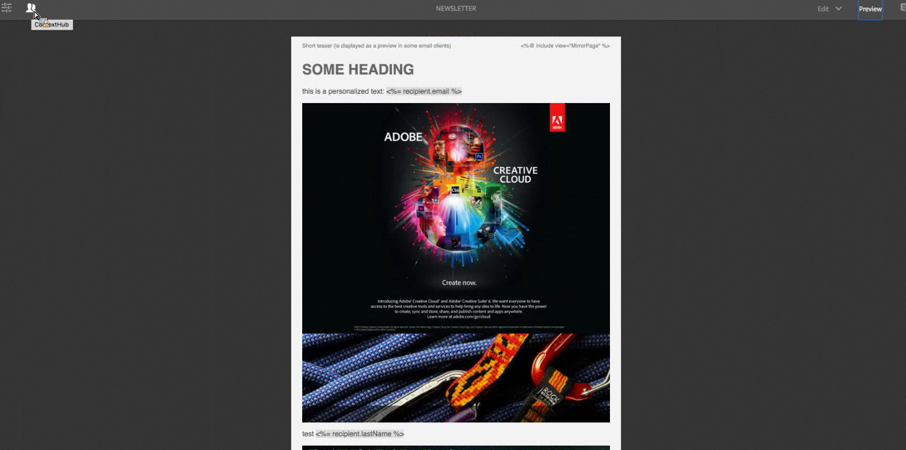
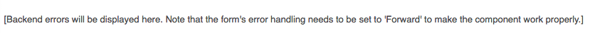
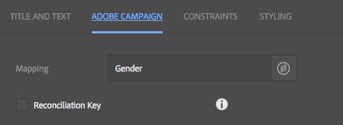

# Adobe Campaign Components{#adobe-campaign-components}

Wanneer u integreert met Adobe Campaign, hebt u componenten beschikbaar voor wanneer u met nieuwsbrieven en met formulieren werkt. Beide worden in dit document beschreven.

>[!CAUTION]
>
>De AEM e-mailcomponenten zijn afgekeurd. Vanwege de aard van e-mail, waarin inhoud en stijl worden samengevoegd, worden de e-mailcomponenten die door AEM buiten de box worden geleverd van beperkte hergebruik voor klanten omdat aangepaste stijlen moeten worden geïmplementeerd in alle componenten die vereist zijn voor projecten.
>
>E-mailcomponenten kunnen op projectniveau worden geïmplementeerd en de verouderde AEM e-mailcomponenten laten zien hoe dat kan worden bereikt. Deze vervangen onderdelen mogen echter niet worden gebruikt voor projecten.

## Adobe Campaign Newsletter Components {#adobe-campaign-newsletter-components}

Alle componenten van de Campagne volgen de beste praktijken die in [Beste praktijken voor E-mailMalplaatjes ](/help/sites-administering/best-practices-for-email-templates.md) worden geschetst en zijn gebaseerd op de de prijsverhogingstaal van Adobe [HTL](https://helpx.adobe.com/experience-manager/htl/using/overview.html).

Wanneer u een nieuwsbrief/e-mail opent die wordt gevormd om met Adobe Campaign te integreren, zou u de volgende componenten in **de Newsletter van Adobe Campaign** sectie moeten zien:

* Kop (campagne)
* Afbeelding (campagne)
* Koppeling (campagne)
* Scene7-afbeeldingssjabloon (campagne)
* Gerichte referentie (campagne)
* Tekst en afbeelding (campagne)
* Tekst en persoonlijke voorkeur (campagne)

Een beschrijving van deze componenten vindt u in de volgende sectie.

De componenten zijn als volgt:

### Kop (campagne) {#heading-campaign}

De kopcomponent kan:

* Geef de naam van de huidige pagina weer door het veld **Titel** leeg te laten.
* Geef een tekst weer die u opgeeft in het veld **Titel**.

U bewerkt de component **Kop (Campagne)** rechtstreeks. Laat leeg als u de paginatitel wilt gebruiken.

U kunt het volgende configureren:

* ****
TitleAls u een andere naam dan de paginatitel wilt gebruiken, voert u deze hier in.

* **Kopniveau (1, 2, 3, 4)**
Het kopniveau op basis van de HTML-kopgrootten 1-4.

In het volgende voorbeeld ziet u een component Kop (Campagne) die wordt weergegeven.

### Afbeelding (campagne) {#image-campaign}

In de afbeeldings-(campagne)component wordt een afbeelding en de bijbehorende tekst weergegeven volgens de opgegeven parameters.

U kunt een afbeelding uploaden, deze vervolgens bewerken en bewerken (bijvoorbeeld uitsnijden, roteren, koppeling/titel/tekst toevoegen).

U kunt of een beeld van [Browser van Activa ](/help/sites-authoring/author-environment-tools.md#assetsbrowsertouchoptimizedui) direct op de component of zijn [vorm dialoog](/help/sites-authoring/editing-content.md#editconfigurecopycutdeletepastetouchoptimizedui) slepen en neerzetten. U kunt een beeld van de Configure dialoog ook uploaden; dit dialoogvenster bevat ook alle definities en bewerkingen van de afbeelding :

>[!NOTE]
>
>U moet informatie invoeren in het veld **Alt Text**, anders kan de afbeelding niet worden opgeslagen.

Nadat de afbeelding is geüpload (en niet eerder), kunt u [Bewerken op plaats vervangen](/help/sites-authoring/editing-content.md#editcontenttouchoptimizedui) gebruiken om de afbeelding naar wens uit te snijden of te roteren:

>[!NOTE]
>
>De editor op locatie gebruikt de oorspronkelijke grootte en hoogte-breedteverhouding van de afbeelding tijdens het bewerken. U kunt ook de eigenschappen voor hoogte en breedte opgeven. Beperkingen voor grootte en hoogte-breedteverhouding die in de eigenschappen zijn gedefinieerd, worden toegepast wanneer u de bewerkingswijzigingen opslaat.
>
>Afhankelijk van uw exemplaar, kunnen de minimum en maximumbeperkingen ook door het [ontwerp van pagina](/help/sites-developing/designer.md) worden opgelegd; deze worden ontwikkeld tijdens de uitvoering van het project .

In de modus Volledig scherm zijn verschillende aanvullende opties beschikbaar. bijvoorbeeld toewijzen en zoomen:

Wanneer een beeld wordt geladen, kunt u het volgende vormen:

* **Selecteer**
Toewijzen om een afbeelding toe te wijzen. U kunt opgeven hoe u de afbeelding met hyperlinks wilt maken (rechthoek, veelhoek enzovoort) en waar het gebied naartoe moet wijzen.

* ****
UitsnijdenSelecteer Uitsnijden om een afbeelding uit te snijden. Gebruik de muis om de afbeelding uit te snijden.

* ****
RoterenSelecteer Roteren om een afbeelding te roteren. Herhaal deze bewerking totdat de afbeelding op de gewenste manier is geroteerd.

* ****
ClearVerwijder de huidige afbeelding.

* Zoombalk (alleen klassiek)
Als u wilt in- of uitzoomen op de afbeelding, gebruikt u de schuifbalk onder de afbeelding (boven de knoppen OK en Annuleren)
* ****
TitelDe titel van de afbeelding.

* **Alt**
TextAn alternatieve tekst voor gebruik bij het maken van toegankelijke inhoud.

* **Koppelen**
naarEen koppeling maken naar elementen of andere pagina&#39;s op uw website.

* ****
BeschrijvingEen beschrijving van de afbeelding.

* ****
SizeHiermee stelt u de hoogte en de breedte van de afbeelding in.

>[!NOTE]
>
>U moet informatie in **Alt Text** gebied op **Geavanceerd** tabel ingaan, of het beeld kan niet opslaan en u ziet het volgende foutenbericht:
>
>`Validation failed. Verify the values of the marked fields.`

In het volgende voorbeeld ziet u een component Image (Campaign) die wordt weergegeven.

### Koppeling (campagne) {#link-campaign}

Met de component Koppeling (Campagne) kunt u een koppeling naar uw nieuwsbrief toevoegen.

U kunt het volgende configureren op de tabbladen **Display**, **URL Info** of **Advanced**:

* **Bijschrift**
koppelenHet bijschrift voor de koppeling. Dit is de tekst die gebruikers zien.

* **Link**
ToolTipAdds extra informatie over hoe te om de verbinding te gebruiken.

* ****
LinkTypeIn de vervolgkeuzelijst selecteert u tussen een 
**Aangepaste** URL en een  **adaptief document**. Dit veld is verplicht. Als u Aangepaste URL selecteert, kunt u de URL van de koppeling opgeven. Als u Aangepast document selecteert, kunt u het documentpad opgeven.

* **Aanvullende URL-**
parameterVoeg aanvullende URL-parameters toe. Klik op Item toevoegen om meerdere items toe te voegen.

>[!NOTE]
>
>U moet informatie in het **Type van Verbinding** gebied op **URL Info** tabel ingaan, of de component kan niet opslaan en u ziet het volgende foutenbericht:
>
>`Validation failed. Verify the values of the marked fields.`

In het volgende voorbeeld ziet u een component Link (Campagne) die wordt weergegeven.

### Scene7-afbeeldingssjabloon (campagne) {#scene-image-template-campaign}

[Scene7 Image ](https://help.adobe.com/en_US/scene7/using/WS60B68844-9054-4099-BF69-3DC998A04D3C.html) Templatesare layered zijn gelaagde afbeeldingsbestanden, waarbij inhoud en eigenschappen kunnen worden geparametriseerd voor variabiliteit. Met de component **Afbeeldingssjabloon** kunt u Scene7-sjablonen gebruiken in nieuwsbrieven en de waarden van sjabloonparameters wijzigen. Daarnaast kunt u metagegevensvariabelen van Adobe Campaign binnen de parameters gebruiken, zodat elke gebruiker de afbeelding op een persoonlijke manier ervaart.

Klik **Bewerken** om de component te configureren. U kunt de instellingen configureren die in deze sectie worden beschreven. Deze Scene7-afbeeldingssjabloon wordt gedetailleerd beschreven in [Scene7-afbeeldingssjablooncomponent](/help/assets/scene7.md#image-template).

Daarnaast bevat het parametervenster alle sjabloonparameters die zijn gedefinieerd voor de sjabloon in Scene7. Voor elk van deze parameters kunt u de waarde aanpassen, variabelen invoegen of de standaardwaarde ervan herstellen.

### Gerichte referentie (campagne) {#targeted-reference-campaign}

Met de component Doelverwijzing (Campagne) kunt u een verwijzing naar een doelalinea maken.

In deze component navigeert u naar de doelalinea om deze te selecteren.

Klik op het mappictogram om naar de alinea te navigeren waarnaar u wilt verwijzen. Klik op het vinkje als u klaar bent.

### Tekst en afbeelding (campagne) {#text-image-campaign}

Met de component Tekst en afbeelding (campagne) voegt u een tekstblok en een afbeelding toe.

Wanneer u klikt om de component te vormen, selecteert u Tekst of Beeld.

Als u **Tekst** selecteert, wordt een in-line editor weergegeven:

Als u **Afbeelding** selecteert, wordt de interne editor voor afbeeldingen weergegeven:

Zie [Afbeeldingscomponent (campagne)](#image-campaign) voor meer informatie over het werken met afbeeldingen. Zie [Component Tekst en personalisatie (Campagne)](#text-personalization-campaign) voor meer informatie over het werken met tekst.

Net als bij de componenten Text &amp; Personalization (Campaign) en Image (Campaign) kunt u het volgende configureren:

* **Tekst**
invoeren. Met de werkbalk kunt u de opmaak wijzigen, lijsten maken en koppelingen toevoegen.

* ****
AfbeeldingSleep een afbeelding vanuit de zoekfunctie voor inhoud of klik om naar een afbeelding te bladeren. Uitsnijden of roteren naar wens.

* **Met afbeeldingseigenschappen**  (**geavanceerde afbeeldingseigenschappen**) kunt u het volgende opgeven:

   * ****
TitelDe titel van het blok; wordt weergegeven door mouseover.

   * **Alt**
TextAlternative tekst die moet worden weergegeven als de afbeelding niet kan worden weergegeven.

   * **Koppeling maken**
naarEen koppeling maken naar elementen of andere pagina&#39;s op uw website.

   * ****
BeschrijvingEen beschrijving van de afbeelding.

   * ****
SizeHiermee stelt u de hoogte en breedte van de afbeelding in.

>[!NOTE]
>
>Het veld **Alt Text** op het tabblad **Geavanceerd** is vereist of de component kan niet opslaan en het volgende foutbericht wordt weergegeven:
>
>`Validation failed. Verify the values of the marked fields.`

In het volgende voorbeeld ziet u een component Text &amp; Image (Campaign) die wordt weergegeven.

### Tekst en personalisatie (campagne) {#text-personalization-campaign}

De component van de Tekst &amp; van de Personalisatie (Campagne) laat u een tekstblok ingaan gebruikend een redacteur WYSIWYG, met functionaliteit die door [Rich Text redacteur](/help/sites-authoring/rich-text-editor.md) wordt verstrekt. Daarnaast kunt u met deze component contextvelden en personaliseringsblokken gebruiken die beschikbaar zijn in Adobe Campaign. Zie ook [Personalisatie invoegen](/help/sites-authoring/campaign.md#inserting-personalization).

Met de selectie van pictogrammen kunt u tekst opmaken, inclusief lettertypekenmerken, uitlijning, koppelingen, lijsten en inspringing. De functionaliteit is in wezen het zelfde in [beide UIs](/help/sites-authoring/editing-content.md), hoewel het blik-en-gevoel verschillend is:

In de Inplace redacteur kunt u tekst toevoegen, de rechtvaardiging veranderen, verbindingen toevoegen en verwijderen, contextgebieden of verpersoonlijkingsblokken toevoegen, en volledig-schermwijze ingaan. Wanneer u klaar bent met het toevoegen van tekst/personalisatie, selecteert u het vinkje om de wijzigingen op te slaan (of x om te annuleren). Zie [Bewerken plaatsen](/help/sites-authoring/editing-content.md#editcontenttouchoptimizedui) voor meer informatie.

>[!NOTE]
>
>* Welke personalisatievelden beschikbaar zijn, is afhankelijk van de Adobe Campaign-sjabloon waaraan uw nieuwsbrief is gekoppeld.
>* Nadat u een persoon van ContextHub selecteert, worden de verpersoonlijkingsgebieden automatisch vervangen door gegevens van het geselecteerde profiel.

>
>
Zie [Personalisatie invoegen](/help/sites-authoring/campaign.md#inserting-personalization).

>[!NOTE]
>
>Alleen de velden die zijn gedefinieerd in het schema **nms:seedMember** of een van de extensies worden in aanmerking genomen. De kenmerken van de tabellen die zijn gekoppeld aan **nms:seedMember** zijn niet beschikbaar.

## Adobe Campaign-formuliercomponenten {#adobe-campaign-form-components}

Met Adobe Campaign-componenten kunt u een formulier maken dat gebruikers invullen om zich te abonneren op een nieuwsbrief, zich af te melden bij een nieuwsbrief of hun gebruikersprofielen bij te werken. Zie [Adobe Campaign Forms maken](/help/sites-authoring/adobe-campaign-forms.md) voor meer informatie.

Elk componentveld kan worden gekoppeld aan een Adobe Campaign-databaseveld. De beschikbare velden verschillen afhankelijk van het type gegevens dat ze bevatten, zoals beschreven in de sectie [Componenten en Gegevenstype](#components-and-data-type). Als u het schema voor ontvangers in Adobe Campaign uitbreidt, zijn de nieuwe velden beschikbaar in de componenten waarvan de gegevenstypen overeenkomen.

Wanneer u een formulier opent dat is geconfigureerd om te integreren met Adobe Campaign, ziet u de volgende componenten in de sectie **Adobe Campaign**:

* Selectievakje (campagne)
* Datumveld (campagne) en Datumveld/HTML5 (campagne)
* Gecodeerde primaire sleutel (campagne)
* Foutweergave (campagne)
* Verborgen afstemmingssleutel (campagne)
* Numeriek veld (campagne)
* Optieveld (campagne)
* Checklist voor abonnementen (campagne)
* Tekstveld (campagne)

De componenten zijn als volgt:

In deze sectie wordt elke component gedetailleerd beschreven.

### Componenten en gegevenstype {#components-and-data-type}

In de volgende tabel worden de componenten beschreven die beschikbaar zijn om Adobe Campaign-profielgegevens weer te geven en te wijzigen. Elke component kan worden toegewezen aan een Adobe Campaign-profielveld om de waarde weer te geven en het veld bij te werken wanneer het formulier wordt verzonden. De verschillende componenten kunnen slechts aan gebieden van een aangewezen gegevenstype worden aangepast.

<table>
 <tbody>
  <tr>
   <td>
<strong>Component</strong>
 </td>
   <td>
<strong>Gegevenstype van Adobe Campaign-veld</strong>
 </td>
   <td>
<strong>Voorbeeldveld</strong>
 </td>
  </tr>
  <tr>
   <td>
Selectievakje (campagne)
 </td>
   <td>
boolean
 </td>
   <td>
Geen contact meer (via een kanaal)
 </td>
  </tr>
  <tr>
   <td>
Datumveld (campagne)
 
Datumveld/HTML 5 (campagne)
 </td>
   <td>
date
 </td>
   <td>
Geboortedatum
 </td>
  </tr>
  <tr>
   <td>
Numeriek veld (campagne)
 </td>
   <td>
numeriek (byte, short, long, double)
 </td>
   <td>
Leeftijd
 </td>
  </tr>
  <tr>
   <td>
Optieveld (campagne)
 </td>
   <td>
byte met gekoppelde waarden
 </td>
   <td>
Geslacht
 </td>
  </tr>
  <tr>
   <td>
Tekstveld (campagne)
 </td>
   <td>
string
 </td>
   <td>
E-mail
 </td>
  </tr>
 </tbody>
</table>

### Gemeenschappelijke instellingen voor de meeste componenten {#settings-common-to-most-components}

De Adobe Campaign-componenten hebben dezelfde instellingen voor alle componenten (behalve de componenten Gecodeerde primaire sleutel en Verborgen reconstruatietoets).

In de meeste componenten, kunt u het volgende vormen:

#### Titel en tekst {#title-and-text}

* ****
TitleAls u een andere naam dan de elementnaam wilt gebruiken, voert u deze hier in.

* **Verberg**
TitelSchakel dit selectievakje in als u de titel niet zichtbaar wilt maken.

* ****
BeschrijvingVoeg een beschrijving toe aan het veld voor meer informatie voor gebruikers.

* **Alleen**
valueOnly tonen geeft de waarde weer als er een is

#### Adobe Campaign {#adobe-campaign}

U kunt het volgende configureren:

* ****
ToewijzingSelecteer, indien van toepassing, een personalisatieveld voor Adobe Campaign.

* **AfstemmingssleutelSchakel dit selectievakje in als dit veld deel uitmaakt van de afstemmingssleutel.**

#### Beperkingen {#constraints}

* **** VereistSchakel dit selectievakje in om dit onderdeel verplicht te maken; gebruikers moeten dus een waarde invoeren.
* **Vereiste** MessageOpoptional, voeg een bericht toe verklarend dat het gebied wordt vereist.

#### Stijlen {#styling}

* ****
CSSEenter de CSS klassen u voor deze component wilt gebruiken.

### Selectievakje (campagne) {#checkbox-campaign}

Met de component CheckBox (Campagne) kan de gebruiker Adobe Campaign-profielvelden wijzigen die van een Booleaans gegevenstype zijn. U kunt bijvoorbeeld een component CheckBox (Campagne) hebben waarmee de ontvanger kan opgeven dat hij of zij niet via een kanaal mag worden benaderd.

U kunt [instellingen configureren die gelden voor de meeste Adobe Campaign-componenten](#settings-common-to-most-components) in de component Checkbox (Campagne).

In het volgende voorbeeld wordt een component CheckBox (Campagne) weergegeven.

### Datumveld (campagne) en Datumveld/HTML 5 (campagne) {#date-field-campaign-and-date-field-html-campaign}

Gebruik het datumveld om ontvangers toe te staan een datum te zoeken. bijvoorbeeld wilt u dat de ontvangers hun geboortedatum opgeven. De datumnotatie komt overeen met de notatie die wordt gebruikt in uw Adobe Campaign-exemplaar.

Naast [instellingen die gelden voor de meeste Adobe Campaign-componenten](#settings-common-to-most-components) kunt u het volgende configureren:

* **Beperkingen -** Beperking die u kunt selecteren -  **** Geen of  **Datum -** om de beperking van een datum of geen beperking toe te voegen. Als u datum selecteert, moeten de antwoordgebruikers in het veld een datumnotatie invoeren.

* **Restrictie** MessageBovendien kunt u een beperkingsbericht toevoegen zodat gebruikers weten hoe zij hun antwoorden op de juiste wijze kunnen opmaken.
* **Stijl -** BreedtePas de breedte van het veld aan door op de pictogrammen  **+** en  **-** en te klikken of door een getal in te voeren.

In het volgende voorbeeld wordt een component Date Field (Campaign) weergegeven met de breedte aangepast.

### Gecodeerde primaire sleutel (Campagne) {#encrypted-primary-key-campaign}

Deze component definieert de naam van de URL-parameter die de id van een Adobe Campaign-profiel zal bevatten (**Main Resource Identifier** of **Encrypted primary key** in Adobe Campaign Standard respectievelijk 6.1).

Elk formulier dat Adobe Campaign-profielgegevens weergeeft en wijzigt **must** bevat een component Encrypted Primary Key.

U kunt het volgende in de Encrypted Primaire (Campagne) component vormen:

* **Titel en tekst - Element** NameDefaults to encryptedPK. U hoeft de elementnaam alleen te wijzigen als deze conflicteert met de naam van een ander element op het formulier. Geen twee formuliervelden kunnen dezelfde elementnaam hebben.
* **Adobe Campaign - URL-** parameterVoeg de URL-parameter voor de EPK toe. U kunt bijvoorbeeld de waarde **epk** gebruiken.

In het volgende voorbeeld ziet u een component Encrypted Primary Key (Campaign) die wordt weergegeven.

### Foutweergave (campagne) {#error-display-campaign}

Met deze component kunt u back-endfouten weergeven. De foutafhandeling van het formulier moet zijn ingesteld op Volgende om de component correct te laten werken.

In het volgende voorbeeld ziet u een component Error Display (Campaign) die wordt weergegeven.

### Verborgen afstemmingssleutel (campagne) {#hidden-reconciliation-key-campaign}

Met de component Verborgen afstemmingssleutel (Campagne) kunt u verborgen velden toevoegen als onderdeel van de afstemmingssleutel aan een formulier.

U kunt het volgende configureren in de component Verborgen afstemmingssleutel (Campagne):

* **Titel en tekst -** Element NameDefaults to reconcilKey. U hoeft de elementnaam alleen te wijzigen als deze conflicteert met de naam van een ander element op het formulier. Geen twee formuliervelden kunnen dezelfde elementnaam hebben.
* **Adobe Campaign -** MappingMap aan een Adobe Campaign-personalisatieveld.

In het volgende voorbeeld ziet u een component Verborgen afstemmingssleutel (Campagne) die wordt weergegeven.

### Numeriek veld (campagne) {#numeric-field-campaign}

Gebruik het numerieke veld om ontvangers toe te staan getallen in te voeren, bijvoorbeeld hun leeftijd.

Naast [instellingen die gelden voor de meeste Adobe Campaign-componenten](#settings-common-to-most-components) kunt u het volgende configureren:

* **Beperkingen -** Beperking die u kunt selecteren -  **** Geen of  **Numeriek -** om de beperking van een getal of geen beperking toe te voegen. Als u een getal selecteert, moeten de antwoordgebruikers een numeriek getal invoeren in het veld.

* **Restrictie** MessageBovendien kunt u een beperkingsbericht toevoegen zodat gebruikers weten hoe zij hun antwoorden op de juiste wijze kunnen opmaken.
* **Stijl -** BreedtePas de breedte van het veld aan door op de pictogrammen  **+** en  **-** en te klikken of door een getal in te voeren.

In het volgende voorbeeld wordt een component Numeriek veld (Campagne) weergegeven met de geconfigureerde breedte.

### Optieveld (campagne) {#option-field-campaign}

In deze vervolgkeuzelijst kunt u een optie selecteren. bijvoorbeeld het geslacht of de status van een ontvanger.

U kunt [montages vormen gemeenschappelijk voor de meeste componenten van Adobe Campaign](#settings-common-to-most-components) in de component van het Gebied van de Optie (Campagne). Als u de vervolgkeuzelijst wilt vullen, selecteert u het desbetreffende veld in de personalisatievelden van Adobe Campaign door op het Adobe Campaign-symbool te klikken of erop te tikken en naar het veld te navigeren.

In het volgende voorbeeld ziet u een component Option Field (Campaign) die wordt weergegeven.

### Checklist voor abonnementen (campagne) {#subscriptions-checklist-campaign}

Met de component **Controlelijst voor abonnementen (Campagne)** kunt u de abonnementen wijzigen die aan een Adobe Campaign-profiel zijn gekoppeld.

Wanneer deze component aan een formulier wordt toegevoegd, worden alle beschikbare abonnementen als selectievakjes weergegeven en kan de gebruiker de gewenste abonnementen selecteren. Wanneer gebruikers het formulier verzenden, abonneert deze component de gebruiker op de geselecteerde services of meldt deze de gebruiker af, afhankelijk van het type formulieractie (**Adobe Campaign: Abonneren op services** of **Adobe Campaign: Abonnement op Services opzeggen**).

>[!NOTE]
>
>De component controleert niet welke services de gebruiker al heeft geabonneerd op of zich niet heeft geabonneerd op.

U kunt [instellingen configureren die gelden voor de meeste Adobe Campaign-componenten](#settings-common-to-most-components) in de component Checklist (Campagne) voor abonnementen. (Er zijn geen Adobe Campaign-configuraties beschikbaar voor deze component.)

In het volgende voorbeeld ziet u een component Subscriptions Checklist (Campaign) die wordt weergegeven.

### Tekstveld (campagne) {#text-field-campaign}

De component van het Gebied van de Tekst (Campagne) die u tekenreekstype gegevens, zoals een voornaam, een familienaam, een adres, een e-mailadres, enz. laat ingaan.

Naast [instellingen die gelden voor de meeste Adobe Campaign-componenten](#settings-common-to-most-components) kunt u het volgende configureren:

* **Restricties -** Beperking die u kunt selecteren -  **Geen,** **E-mail** of  **Naam**  (geen umlauts) - om de beperking van een e-mailadres, naam of geen beperking toe te voegen. Als u e-mail selecteert, moeten de antwoordgebruikers in het veld een e-mailadres zijn. Als u een naam selecteert, moet deze een naam zijn (umlauts zijn niet toegestaan).

* **Restrictie** MessageBovendien kunt u een beperkingsbericht toevoegen zodat gebruikers weten hoe zij hun antwoorden op de juiste wijze kunnen opmaken.
* **Stijl -** BreedtePas de breedte van het veld aan door op de pictogrammen  **+** en  **-** en te klikken of door een getal in te voeren.

In het volgende voorbeeld wordt een component Text Field (Campaign) weergegeven.

