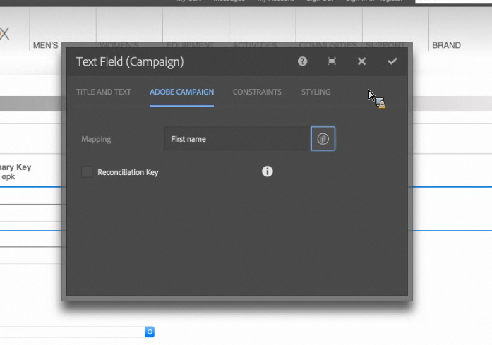

# Adobe Campagneformulieren maken in AEM {#creating-adobe-campaign-forms-in-aem}

Met AEM kunt u formulieren maken en gebruiken die op uw website werken met Adobe Campaign. U kunt specifieke velden invoegen in uw formulieren en toewijzen aan de Adobe Campagne-database.

U kunt nieuwe contactabonnementen, abonnementen, en gegevens van het gebruikersprofiel beheren, allen terwijl het integreren van hun gegevens in uw gegevensbestand van de Campagne van Adobe.

Als u Adobe Campagne-formulieren wilt gebruiken in AEM, moet u de volgende stappen uitvoeren, die in dit document worden beschreven:

1. Een sjabloon beschikbaar maken.
1. Maak een formulier.
1. Formulierinhoud bewerken.

Er zijn standaard drie typen formulieren beschikbaar, die specifiek zijn voor Adobe Campagne:

* Een profiel opslaan
* Abonneren op een service
* Abonnement op een service opzeggen

Deze formulieren definiëren een URL-parameter die de gecodeerde primaire sleutel van een Adobe Campagne-profiel accepteert. Op basis van deze URL-parameter werkt het formulier de gegevens van het bijbehorende Adobe Campagne-profiel bij.

Hoewel u deze formulieren onafhankelijk maakt, genereert u doorgaans een gepersonaliseerde koppeling naar een formulierpagina in de nieuwsbrief, zodat ontvangers de koppeling kunnen openen en hun profielgegevens kunnen aanpassen (of ze zich niet abonneren, zich abonneren of hun profiel bijwerken).

Het formulier wordt automatisch bijgewerkt op basis van de gebruiker. Zie [Formulierinhoud](#editing-form-content) bewerken voor meer informatie.

## Een sjabloon beschikbaar maken {#making-a-template-available}

Voordat u formulieren kunt maken die specifiek zijn voor Adobe Campaign, moet u de verschillende sjablonen beschikbaar stellen in uw AEM-toepassing.

Raadpleeg de documentatie bij [Sjablonen om dit te doen](/help/sites-developing/templates.md#template-availability).

## Een formulier maken {#creating-a-form}

Controleer eerst de verbinding tussen de auteur en publiceer instanties en Adobe Campaign werkt. Zie [Integreren met Adobe Campagne Standard](/help/sites-administering/campaignstandard.md) of [Integreren met Adobe Campagne Classic](/help/sites-administering/campaignonpremise.md).

>[!NOTE]
>
>Zorg ervoor dat de eigenschap **acMapping** op het knooppunt **jcr:content** van de pagina is ingesteld op **mapRecipient** of **profiel** bij gebruik van respectievelijk Adobe Campagne Classic of Adobe Campagne Standard

1. Navigeer in AEM (Sites) naar de plaats waar u een nieuwe pagina wilt maken.
1. Maak een pagina en selecteer **Adobe Campagne Classic Profile** of **Adobe Campagne Standard Profile** en klik op **Volgende**.

   

   >[!NOTE]
   >
   >Als de gewenste sjabloon niet beschikbaar is, raadpleegt u [Sjabloonbeschikbaarheid](/help/sites-developing/templates.md#template-availability).

1. Voeg in het veld **Naam** de naam van de pagina toe. Dit moet een geldige JCR-naam zijn.
1. Voer in het veld **Titel** een titel in en klik op **Maken**.
1. Open de pagina en selecteer Eigenschappen **** openen en voeg in Cloud Services de configuratie van de Campagne van Adobe toe en selecteer het vinkje om uw wijzigingen op te slaan.

   

1. Selecteer op de pagina in de **component Start** van het formulier het type formulier: **Abonneren, Abonneren** of **Profiel** opslaan. U kunt slechts één type per formulier hebben. U kunt nu de inhoud [van het formulier](#editing-form-content)bewerken.

## Formulierinhoud bewerken {#editing-form-content}

Formulieren die zijn gewijd aan Adobe Campaign, hebben specifieke componenten. Deze componenten hebben een optie waarmee u elk veld van het formulier kunt koppelen aan een veld in de Adobe Campagne-database.

>[!NOTE]
>
>Zie Een sjabloon beschikbaar [maken als de gewenste sjabloon niet beschikbaar](/help/sites-authoring/adobe-campaign.md)is.

In deze sectie worden alleen specifieke koppelingen naar Adobe Campaign beschreven. Zie Componenten [van de](/help/sites-authoring/default-components-foundation.md)bewerkingsmodus voor meer informatie over een algemeen overzicht van het gebruik van formulieren in Adobe Experience Manager.

1. Selecteer Eigenschappen **** openen en voeg in Cloud Services de configuratie van de Campagne van Adobe toe en selecteer het vinkje om uw wijzigingen op te slaan.

   

1. Voor de pagina, in de **component van het Begin** van de Vorm, klik het pictogram van de Configuratie.

   

1. Klik op het tabblad **Geavanceerd** en selecteer het type formulier: **Abonneren,** Abonneren of Profiel **** opslaan. Klik vervolgens op **OK.** U kunt slechts één type per formulier hebben.

   * **Adobe-campagne: Profiel** opslaan: Hiermee kunt u een ontvanger maken of bijwerken in Adobe Campaign (standaardwaarde).
   * **Adobe-campagne: Abonneren op services**: Hiermee kunt u de abonnementen van een ontvanger beheren in Adobe Campaign.
   * **Adobe-campagne: Abonnement op services** opzeggen: Hiermee kunt u de abonnementen van een ontvanger in Adobe Campaign annuleren.

1. U moet op elk formulier een **gecodeerde primaire sleutel** hebben. Deze component bepaalt welke URL-parameter wordt gebruikt om de gecodeerde primaire sleutel van een Adobe Campagne-profiel te accepteren. Selecteer Adobe Campagne in Componenten, zodat alleen de componenten zichtbaar zijn.
1. Sleep de **gecodeerde primaire sleutel** van de component naar het formulier (overal) en klik of tik op het pictogram **Configuratie** . Geef op het tabblad **Adobe-campagne** een willekeurige naam voor de URL-parameter op. Klik of tik het vinkje om uw veranderingen te bewaren.

   Gegenereerde koppelingen naar dit formulier moeten deze URL-parameter gebruiken en hieraan de gecodeerde primaire sleutel van een Adobe Campagne-profiel toewijzen. De gecodeerde primaire sleutel moet correct (percent) gecodeerd zijn URL.

   

1. Voeg zo nodig componenten aan het formulier toe, zoals een tekstveld, een datumveld, een veld Selectievakje, een veld Optie enzovoort. Zie [Adobe Campagne Form Components](/help/sites-authoring/adobe-campaign-components.md) voor meer informatie over elke component.
1. Klik op het configuratiepictogram om de component te openen. Wijzig bijvoorbeeld in de component **Tekstveld (Campagne)** de titel en de tekst.

   Klik op **Adobe Campagne** om het formulierveld toe te wijzen aan een metagegevensvariabele van Adobe Campagne. Wanneer u het formulier verzendt, wordt het toegewezen veld bijgewerkt in Adobe Campagne. Alleen velden met overeenkomende typen zijn beschikbaar in de variabele kiezer (bijvoorbeeld tekenreeksvariabelen voor tekstvelden).

   

   >[!NOTE]
   >
   >U kunt velden die in de tabel met ontvangers worden weergegeven, toevoegen of verwijderen door hier de instructies op te volgen: [https://blogs.adobe.com/experiencedelivers/experience-management/aem-campaign-integration/](https://blogs.adobe.com/experiencedelivers/experience-management/aem-campaign-integration/)

1. Klik op **Pagina** publiceren. De pagina wordt geactiveerd op uw site. U kunt het bekijken door naar uw AEM- publicatieexemplaar te gaan. U kunt ook een formulier testen.

   >[!CAUTION]
   >
   >U moet de anonieme gebruiker leesmachtigingen bieden op de cloudservice om formulieren te kunnen gebruiken tijdens het publiceren. Houd er echter rekening mee dat er beveiligingsproblemen kunnen optreden als u leesmachtigingen verschaft aan de anonieme gebruiker en zorg ervoor dat u dit beperkt door bijvoorbeeld de dispatcher te configureren.

## Een formulier testen {#testing-a-form}

Nadat u een formulier hebt gemaakt en formulierinhoud hebt bewerkt, wilt u mogelijk handmatig testen of het formulier naar behoren werkt.

>[!NOTE]
>
>U moet op elk formulier een **component voor de primaire sleutel** hebben. Selecteer Adobe Campagne in Componenten, zodat alleen de componenten zichtbaar zijn.
>
>Hoewel u in deze procedure het epknummer handmatig invoert, krijgen gebruikers in de praktijk een koppeling naar deze pagina (om uw abonnement op te zeggen, in te schrijven of uw profiel bij te werken) binnen een nieuwsbrief. De epk wordt op basis van de gebruiker automatisch bijgewerkt.
>
>Als u die koppeling wilt maken, gebruikt u de variabele **Hoofd-resource-id**(Adobe Campaign Standard) of de **Versleutelde-id** (Adobe Campaign Classic) (bijvoorbeeld in een **component Text &amp; Personalization (Campaign)** ) die een koppeling vormt naar de EPK in Adobe Campaign.

Hiervoor moet u handmatig de EPK van een Adobe Campagneprofiel ophalen en dit vervolgens toevoegen aan de URL:

1. De gecodeerde primaire sleutel (EPK) van een Adobe Campagneprofiel ophalen:

   * In de Standaard van de Campagne van Adobe - navigeer aan **Profielen en Soorten** > **Profielen**, die de bestaande profielen een lijst maken. Zorg ervoor de lijst het **Belangrijkste gebied van het Middel** in een kolom toont (Dit kan worden gevormd door te klikken/het tikken **vormt lijst**). Kopieer de belangrijkste resource-id van het gewenste profiel.
   * Ga in Adobe Campaign Classic naar **Profielen en doelen** > **Ontvangers**. Hierin staan de bestaande profielen. Zorg ervoor dat de tabel het veld **Gecodeerde id** in een kolom weergeeft (dit kan worden geconfigureerd door met de rechtermuisknop op een item te klikken en de lijst **Configureren te selecteren...**). Kopieer de gecodeerde id van het gewenste profiel.

1. Open in AEM de formulierpagina op het publicatieexemplaar en voeg de EPK van stap 1 toe als een URL-parameter: dezelfde naam gebruiken die u eerder in de EPK-component hebt gedefinieerd bij het ontwerpen van het formulier (bijvoorbeeld: `?epk=...`)
1. Het formulier kan nu worden gebruikt om de gegevens en abonnementen voor het gekoppelde Adobe Campagne-profiel te wijzigen. Nadat u een aantal velden hebt gewijzigd en het formulier hebt verzonden, kunt u in Adobe Campaign controleren of de desbetreffende gegevens zijn bijgewerkt.

De gegevens in de Adobe Campagne-database worden bijgewerkt nadat een formulier is gevalideerd.
