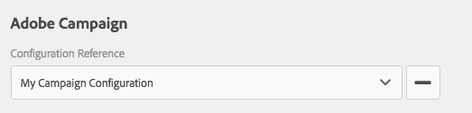

# Adobe Campaign Forms maken in AEM {#creating-adobe-campaign-forms-in-aem}

Met AEM kunt u formulieren maken en gebruiken die op uw website met Adobe Campaign werken. U kunt specifieke velden invoegen in uw formulieren en toewijzen aan de Adobe Campaign-database.

U kunt nieuwe contactabonnementen, unsubscriptions, en gegevens van het gebruikersprofiel beheren, allen terwijl het integreren van hun gegevens in uw gegevensbestand van Adobe Campaign.

Als u Adobe Campaign-formulieren wilt gebruiken in AEM, moet u de volgende stappen uitvoeren, die in dit document worden beschreven:

1. Een sjabloon beschikbaar maken.
1. Maak een formulier.
1. Formulierinhoud bewerken.

Standaard zijn er drie typen formulieren beschikbaar, specifiek voor Adobe Campaign:

* Een profiel opslaan
* Abonneren op een service
* Abonnement op een service opzeggen

Deze formulieren definiëren een URL-parameter die de gecodeerde primaire sleutel van een Adobe Campaign-profiel accepteert. Op basis van deze URL-parameter werkt het formulier de gegevens van het gekoppelde Adobe Campaign-profiel bij.

Hoewel u deze formulieren onafhankelijk maakt, genereert u doorgaans een gepersonaliseerde koppeling naar een formulierpagina in de nieuwsbrief, zodat ontvangers de koppeling kunnen openen en hun profielgegevens kunnen aanpassen (of ze zich niet abonneren, zich abonneren of hun profiel bijwerken).

Het formulier wordt automatisch bijgewerkt op basis van de gebruiker. Zie [&#x200B; het Uitgeven van de Inhoud van de Vorm &#x200B;](#editing-form-content) voor meer informatie.

## Een sjabloon beschikbaar maken {#making-a-template-available}

Voordat u formulieren kunt maken die specifiek zijn voor Adobe Campaign, moet u de verschillende sjablonen beschikbaar stellen in uw AEM-toepassing.

Om dit te doen, zie de [&#x200B; documentatie van Malplaatjes &#x200B;](/help/sites-developing/templates.md#template-availability).

## Een formulier maken {#creating-a-form}

Eerst en vooral, controleer de verbinding tussen de auteur en publiceer instanties en Adobe Campaign werkt. Zie [&#x200B; Integrerend met Adobe Campaign Standard &#x200B;](/help/sites-administering/campaignstandard.md) of [&#x200B; Integrerend met Adobe Campaign Classic &#x200B;](/help/sites-administering/campaignonpremise.md).

>[!NOTE]
>
>Zorg ervoor het **acMapping** bezit op de 2&rbrace; jcr van de pagina **knoop &lbrace;aan:content** mapRecipient **of** profiel **wanneer het gebruiken van Adobe Campaign Classic of Adobe Campaign Standard, respectievelijk wordt geplaatst**
>

1. Navigeer in AEM in Sites naar de plaats waar u een pagina wilt maken.
1. Creeer een pagina en selecteer **Profiel van Adobe Campaign Classic** of **Profiel van Adobe Campaign Standard** en klik **daarna**.

   

   >[!NOTE]
   >
   >Als het gewenste malplaatje niet beschikbaar is, zie [&#x200B; Beschikbaarheid van het Malplaatje &#x200B;](/help/sites-developing/templates.md#template-availability).

1. Op het **gebied van de Naam**, voeg de naam van de pagina toe. Dit moet een geldige JCR-naam zijn.
1. Op het **gebied van de Titel**, ga een titel in en klik **creeer**.
1. Open de pagina en selecteer **Open Eigenschappen** en in de Diensten van de Wolk voegen de configuratie van Adobe Campaign toe en selecteren checkmark om uw veranderingen te bewaren.

   

1. Op de pagina, in de **component van het Begin van de Vorm**, selecteer het type van vorm het is - **Abonneren, Unsubscribe,** of **sparen Profiel**. U kunt slechts één type per formulier hebben. U kunt [&#x200B; de inhoud van de vorm &#x200B;](#editing-form-content) nu uitgeven.

## Formulierinhoud bewerken {#editing-form-content}

Forms gewijd aan Adobe Campaign heeft specifieke componenten. Deze componenten hebben een optie waarmee u elk veld van het formulier kunt koppelen aan een veld in de Adobe Campaign-database.

>[!NOTE]
>
>Als het gewenste malplaatje niet beschikbaar is, zie [&#x200B; het Maken van een malplaatje beschikbaar.](/help/sites-authoring/campaign.md)

In deze sectie worden alleen specifieke koppelingen naar Adobe Campaign beschreven. Voor meer informatie over een meer algemeen overzicht van hoe te om vormen in Adobe Experience Manager te gebruiken, zie [&#x200B; componenten Editmode &#x200B;](/help/sites-authoring/default-components-foundation.md).

1. Selecteer **Open Eigenschappen** en in de Diensten van de Wolk voegen de configuratie van Adobe Campaign toe en selecteren checkmark om uw veranderingen te bewaren.

   

1. Voor de pagina, in de **component van het Begin van de Vorm**, klik het pictogram van de Configuratie.

   

1. Klik het **Geavanceerde** lusje en selecteer het type van vorm het is - **Abonneren, Unsubscribe,** of **sparen Profiel** en klik **O.K.** U kunt slechts één type per formulier hebben.

   * **Adobe Campaign: sparen profiel**: laat u tot een ontvanger in Adobe Campaign (standaardwaarde) leiden of bijwerken.
   * **Adobe Campaign: Abonneer aan de Diensten**: laat u de abonnementen van een ontvanger in Adobe Campaign beheren.
   * **Adobe Campaign: Unsubscribe van de Diensten**: laat u de abonnementen van een ontvanger in Adobe Campaign annuleren.

1. U moet een **Gecodeerde Primaire Zeer belangrijke** component op elke vorm hebben. Deze component definieert welke URL-parameter wordt gebruikt om de gecodeerde primaire sleutel van een Adobe Campaign-profiel te accepteren. Selecteer in Componenten de optie Adobe Campaign, zodat alleen de componenten zichtbaar zijn.
1. Sleep de component **Encrypted Primaire Sleutel** aan de vorm (overal) en klik het **pictogram van de Configuratie**. In het **Adobe Campaign** lusje, specificeer om het even welke naam voor de parameter URL. Klik op het vinkje om de wijzigingen op te slaan.

   Gegenereerde koppelingen naar dit formulier moeten deze URL-parameter gebruiken en er de gecodeerde primaire sleutel van een Adobe Campaign-profiel aan toewijzen. De gecodeerde primaire sleutel moet correct (percent) gecodeerd zijn URL.

   

1. Voeg zo nodig componenten aan het formulier toe, zoals een tekstveld, een datumveld, een veld Selectievakje, een veld Optie enzovoort. Zie {de Componenten van de Vorm van 0} Adobe Campaign [&#x200B; voor meer informatie over elke component.](/help/sites-authoring/adobe-campaign-components.md)
1. Klik het pictogram van de Configuratie om de component te openen. Bijvoorbeeld, in **Gebied van de Tekst (Campagne)** component, verander de titel en de tekst.

   Klik **Adobe Campaign** om het vormgebied aan een de meta-gegevensvariabele van Adobe Campaign in kaart te brengen. Wanneer u het formulier verzendt, wordt het toegewezen veld bijgewerkt in Adobe Campaign. Alleen velden met overeenkomende typen zijn beschikbaar in de variabele kiezer (bijvoorbeeld tekenreeksvariabelen voor tekstvelden).

   

   >[!NOTE]
   >
   >U kunt gebieden toevoegen/verwijderen die in de ontvankelijke lijst door de instructies hier te volgen worden getoond: [&#x200B; https://blogs.adobe.com/experiencedelivers/experience-management/aem-campaign-integration/ &#x200B;](https://blogs.adobe.com/experiencedelivers/experience-management/aem-campaign-integration/)

1. Klik **publiceren Pagina**. De pagina wordt geactiveerd op uw site. Je kunt het bekijken door naar je AEM-publicatieexemplaar te gaan. U kunt ook [&#x200B; een vorm &#x200B;](#testing-a-form) testen.

   >[!CAUTION]
   >
   >U moet de anonieme gebruiker leesmachtigingen bieden op de cloudservice om formulieren te kunnen gebruiken tijdens het publiceren. Houd er echter rekening mee dat er beveiligingsproblemen kunnen optreden als u leesmachtigingen verschaft aan de anonieme gebruiker en zorg ervoor dat u dit beperkt door bijvoorbeeld de dispatcher te configureren.

## Een formulier testen {#testing-a-form}

Nadat u een formulier hebt gemaakt en formulierinhoud hebt bewerkt, wilt u mogelijk handmatig testen of het formulier naar behoren werkt.

>[!NOTE]
>
>U moet een **Erkende Primaire Belangrijkste** component op elke vorm hebben. Selecteer in Componenten de optie Adobe Campaign, zodat alleen de componenten zichtbaar zijn.
>
>Hoewel u in deze procedure het epknummer handmatig invoert, krijgen gebruikers in de praktijk een koppeling naar deze pagina (om uw abonnement op te zeggen, in te schrijven of uw profiel bij te werken) binnen een nieuwsbrief. De epk wordt op basis van de gebruiker automatisch bijgewerkt.
>
>Om die verbinding tot stand te brengen, gebruikt u het veranderlijke **Belangrijkste middelherkenningsteken** (Adobe Campaign Standard) of **Gecodeerde herkenningsteken** (Adobe Campaign Classic) (bijvoorbeeld, in a **Tekst &amp; Personalization (Campagne)** component), die met epk in Adobe Campaign verbindt.

Hiervoor moet u handmatig de EPK van een Adobe Campaign-profiel ophalen en dit vervolgens toevoegen aan de URL:

1. De gecodeerde primaire sleutel (EPK) van een Adobe Campaign-profiel ophalen:

   * In Adobe Campaign Standard - navigeer aan **Profielen en Soorten publiek** > **Profielen**, die van de bestaande profielen een lijst maken. Zorg ervoor de lijst het **Belangrijkste Herkenningsteken van het Middel** in een kolom toont (dit kan worden gevormd door te klikken/te tikken **vormt lijst**). Kopieer de belangrijkste resource-id van het gewenste profiel.
   * In Adobe Campaign Classic, ga naar **Profielen en Doelen** > **Ontvangers**, die van de bestaande profielen een lijst maken. Zorg ervoor de lijst het **Gecodeerde herkenningsteken** gebied in een kolom toont (dit kan worden gevormd door op een ingang met de rechtermuisknop te klikken en **te selecteren vormt lijst...**). Kopieer de gecodeerde id van het gewenste profiel.

1. Open in AEM de formulierpagina op de publicatie-instantie en voeg de EPK vanuit stap 1 toe als een URL-parameter: gebruik dezelfde naam die u eerder in de EPK-component hebt gedefinieerd bij het ontwerpen van het formulier (bijvoorbeeld: `?epk=...`)
1. Het formulier kan nu worden gebruikt om de gegevens en abonnementen voor het gekoppelde Adobe Campaign-profiel te wijzigen. Nadat u een aantal velden hebt gewijzigd en het formulier hebt verzonden, kunt u in Adobe Campaign controleren of de desbetreffende gegevens zijn bijgewerkt.

De gegevens in de Adobe Campaign-database worden bijgewerkt nadat een formulier is gevalideerd.
