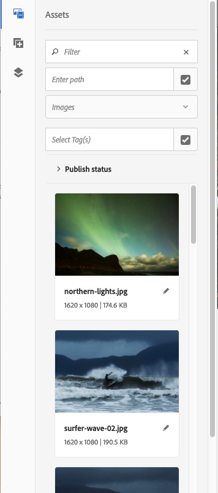
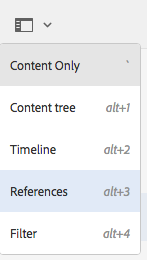

# Authoring - het milieu en de instrumenten{#authoring-the-environment-and-tools}

De ontwerpomgeving van AEM biedt verschillende mechanismen voor het organiseren en bewerken van uw inhoud. De beschikbare gereedschappen zijn toegankelijk via de verschillende consoles en pagina-editors.

## Uw site beheren {#managing-your-site}

De **console van Plaatsen** laat u uw website navigeren en beheren, gebruikend de kopbalbar, de toolbar, actiepictogrammen (van toepassing op het geselecteerde middel), broodkruimels en wanneer geselecteerd, secundaire sporen (bijvoorbeeld, chronologie en verwijzingen).

Bijvoorbeeld, kolommening:

## Pagina-inhoud bewerken {#editing-page-content}

U kunt een pagina bewerken met de pagina-editor. Bijvoorbeeld:

`https://localhost:4502/editor.html/content/we-retail/us/en/equipment.html`

>[!NOTE]
>
>De eerste keer dat u een pagina opent om te bewerken, wordt in een reeks dia&#39;s een overzicht van de functies weergegeven.
>
>U kunt reis overslaan als gewenst en het op elk ogenblik herhalen door van het **menu van de Informatie van de Pagina** te selecteren.

## Toegang tot Help {#accessing-help}

Wanneer het uitgeven van een pagina, **Hulp** kan van worden betreden:

* de [**selecteur van de Informatie van de Pagina**](/help/sites-authoring/editing-page-properties.md#page-properties); dit toont de inleidende dia&#39;s (zoals getoond de eerste keer dat u tot de redacteur toegang hebt).
* de [ configuratiedialoog ](/help/sites-authoring/editing-content.md#edit-configure-copy-cut-delete-paste) voor specifieke componenten (gebruikend het vraagteken (?) (in de werkbalk van het dialoogvenster); dit toont contextgevoelige Help.

Verdere [ op hulp betrekking hebbende middelen zijn beschikbaar bij consoles ](/help/sites-authoring/basic-handling.md#accessing-help).

## Browser voor componenten {#components-browser}

De componentenbrowser toont alle componenten die voor gebruik op uw huidige pagina beschikbaar zijn. U kunt deze naar de juiste locatie slepen en vervolgens bewerken om uw inhoud toe te voegen.

De componentenbrowser is een tabblad in het zijpaneel (samen met de [assetbrowser](/help/sites-authoring/author-environment-tools.md#assets-browser) en de [contentstructuur](/help/sites-authoring/author-environment-tools.md#content-tree)). Als u het zijpaneel wilt openen (of sluiten), gebruikt u het pictogram linksboven op de werkbalk:

Wanneer u het zijpaneel opent, schuift het open van de linkerkant (selecteer de **Componenten** tabel indien nodig). Wanneer u deze optie opent, kunt u door alle componenten bladeren die beschikbaar zijn voor de pagina.

De werkelijke weergave en afhandeling zijn afhankelijk van het apparaattype dat u gebruikt:

>[!NOTE]
>
>Een mobiel apparaat wordt gedetecteerd wanneer de breedte minder dan 1024 px is. Dit kan ook het geval zijn voor een klein bureaubladvenster.

* **Mobiel apparaat (bijvoorbeeld, iPad)**

  De componentbrowser beslaat volledig de pagina die wordt bewerkt.

  Als u een component aan de pagina wilt toevoegen, houdt u de vereiste component ingedrukt en verplaatst u deze naar rechts (de browser van de component wordt gesloten om de pagina weer te geven), waar u de component kunt plaatsen.

  

* **apparaat van de Desktop**

  De componentbrowser wordt links in het venster geopend.

  Als u een component aan de pagina wilt toevoegen, klikt u op de gewenste component en sleept u deze naar de gewenste locatie.

  

  Componenten worden vertegenwoordigd door

   * Componentnaam
   * Componentgroep (grijs)
   * Pictogram of afkorting

      * De standaardcomponentpictogrammen zijn monochroom.
      * Afkortingen zijn altijd de eerste twee tekens van de componentnaam.

  Van de hoogste toolbar in **Componenten** browser, kunt u het volgende doen:

   * Componenten filteren op naam.
   * Beperk de weergave tot een specifieke groep met behulp van de vervolgkeuzelijst.

  Voor een meer gedetailleerde beschrijving van de component, kunt u het informatiepictogram naast de component in **klikken Componenten** browser (als beschikbaar). Bijvoorbeeld voor de **Lay-outcontainer**:

  

  Voor zelfs meer informatie over de componenten beschikbaar aan u, zie [ Console van de Component ](/help/sites-authoring/default-components-console.md).

## Assets Browser {#assets-browser}

De activa browser toont alle [ activa ](/help/assets/assets.md) die voor direct gebruik op uw huidige pagina beschikbaar zijn.

De activa browser is een lusje binnen het zijpaneel samen met de [ componenten doorbladert ](/help/sites-authoring/author-environment-tools.md#components-browser) r en [ inhoudsboom ](/help/sites-authoring/author-environment-tools.md#content-tree). Als u het zijpaneel wilt openen of sluiten, gebruikt u het pictogram linksboven op de werkbalk:

Wanneer u het zijpaneel opent, schuift het vanaf de linkerkant open. Selecteer indien nodig het **Assets** lusje.

Wanneer de middelenbrowser is geopend, kunt u door alle elementen bladeren die beschikbaar zijn voor uw pagina. Met oneindig schuiven wordt de lijst indien nodig uitgebreid.

Als u een element aan de pagina wilt toevoegen, selecteert u het element en sleept u het naar de gewenste locatie. Dit kan zijn:

* Een bestaand onderdeel van het desbetreffende type.

   * U kunt bijvoorbeeld een element van het type afbeelding naar een afbeeldingscomponent slepen.

* A [ placeholder ](/help/sites-authoring/editing-content.md#component-placeholder) in het paragraafsysteem om een component van het aangewezen type tot stand te brengen.

   * U kunt bijvoorbeeld een element van het type afbeelding naar het alineasysteem slepen om een component Image te maken.

>[!NOTE]
>
>Dit is beschikbaar voor specifieke elementen en componenttypen. Zie [ Invoegend een Component gebruikend Browser van Assets ](/help/sites-authoring/editing-content.md#inserting-a-component-using-the-assets-browser) voor meer details.

Vanuit de bovenste werkbalk van de middelenbrowser kunt u de elementen filteren op:

* Naam
* Pad
* Type element, zoals afbeeldingen, manuscripten, documenten, video&#39;s, pagina&#39;s, alinea&#39;s en producten
* Kenmerken van middelen, zoals oriëntatie (staand, liggend, vierkant) en stijl (kleur, monochroom, grijswaarden)

   * Alleen beschikbaar voor bepaalde typen elementen

De werkelijke weergave en afhandeling zijn afhankelijk van het apparaattype dat u gebruikt:

>[!NOTE]
>
>Een mobiel apparaat wordt gedetecteerd wanneer de breedte minder dan 1024 px is, dat wil zeggen ook in een klein bureaubladvenster.

* **Mobiel apparaat zoals iPad**

  De elementenbrowser beslaat volledig de pagina die wordt bewerkt.

  Als u een element aan uw pagina wilt toevoegen, houdt u het vereiste element ingedrukt en verplaatst u het naar rechts. De elementenbrowser wordt gesloten om de pagina weer te tonen, waar u het element aan de vereiste component kunt toevoegen.

  

* **apparaat van de Desktop**

  De middelenbrowser wordt links in het venster geopend.

  Als u een element aan uw pagina wilt toevoegen, klikt u op het element en sleept u het naar de gewenste component of locatie.

  

Als u een activa moet snel veranderen, kunt u de [ Redacteur van Activa ](/help/assets/manage-assets.md) van activa direct van activabrowser beginnen door het Edit pictogram naast de naam van activa te klikken wordt getoond die.

## Inhoudsstructuur {#content-tree}

De **Boom van de Inhoud** geeft een overzicht van alle componenten op de pagina in een hiërarchie zodat kunt u in een blik zien hoe de pagina wordt samengesteld.

De inhoudsstructuur is een tabblad in het zijpaneel (samen met de browser met componenten en elementen). Als u het zijpaneel wilt openen of sluiten, gebruikt u het pictogram linksboven op de werkbalk:

Wanneer u het zijpaneel opent, schuift het open (van de linkerkant). Selecteer indien nodig het **lusje van de Boom van de Inhoud**. Wanneer geopend kunt u een vertegenwoordiging van de boommening van uw pagina of malplaatje zien, zodat het gemakkelijker is om te begrijpen hoe zijn inhoud hiërarchisch gestructureerd is. Op een complexe pagina is het bovendien gemakkelijker om tussen componenten van de pagina te schakelen.

Een pagina kan eenvoudig uit veel van hetzelfde type componenten bestaan, zodat in de structuur van de inhoud (component) beschrijvende tekst (grijs) wordt weergegeven achter de naam van het componenttype (in zwart). De beschrijvende tekst is afkomstig uit gemeenschappelijke eigenschappen van de component, zoals titel of tekst.

Componenttypen worden weergegeven in de taal van de gebruiker, terwijl de tekst van de componentbeschrijving uit de paginataal komt.

Als u klikt op het chevron naast een component, wordt dat niveau samengevouwen of uitgebreid.

>[!NOTE]
>
>De inhoudsstructuur is niet beschikbaar als u een pagina bewerkt op een mobiel apparaat (als de breedte van de browser minder dan 1024 px is).

Wanneer u op de component klikt, wordt de component in de pagina-editor gemarkeerd. Welke acties beschikbaar zijn, is afhankelijk van de paginastatus:

* Bijvoorbeeld een basispagina:

  `https://localhost:4502/editor.html/content/we-retail/language-masters/en/equipment.html`

  

  Als de component waarop u klikt bewerkbaar is, wordt er rechts van de naam een moersleutelpictogram weergegeven. Als u op dit pictogram klikt, wordt het dialoogvenster Bewerken geopend voor de component.

   uit

* Of een pagina die deel van a [ livecopy ](/help/sites-administering/msm.md) uitmaakt, waar de componenten van een andere pagina worden geërft; bijvoorbeeld:

  `https://localhost:4502/editor.html/content/we-retail/us/en/equipment.html`

  

## Fragmenten - gekoppelde inhoudsbrowser {#fragments-associated-content-browser}

Als uw pagina de Fragmenten van de Inhoud bevat, dan hebt u toegang tot [ browser voor Verwante Inhoud ](/help/sites-authoring/content-fragments.md#using-associated-content).

## Verwijzingen {#references}

**Verwijzingen** tonen verbindingen aan de geselecteerde pagina:

* Blauwdrukken
* Lanceringen
* Live kopieën
* Taalkopieën
* Binnenkomende koppelingen
* Gebruik van de referentiecomponent: geleend en geleend inhoud
* Verwijzingen naar productpagina&#39;s (vanaf de Commerce - Products console)

Open de vereiste console, dan navigeer aan het vereiste middel en open **Verwijzingen** gebruikend:

[ Uitgezocht uw vereist middel ](/help/sites-authoring/basic-handling.md#viewing-and-selecting-resources) toont een lijst van verwijzingstypes relevant voor dat middel:

Selecteer het juiste referentietype voor meer informatie. In bepaalde situaties zijn aanvullende acties beschikbaar wanneer u een specifieke verwijzing selecteert, zoals:

* **Binnenkomende Verbindingen** verstrekt een lijst van pagina&#39;s die de pagina van verwijzingen voorzien, samen met directe toegang tot **geef** één van die pagina&#39;s uit wanneer u een specifieke verbinding selecteert.

   * Dit kan alleen statische koppelingen weergeven, niet dynamisch gegenereerde koppelingen, bijvoorbeeld vanuit de component List.

* Instanties van geleende en geleende inhoud gebruikend de **component van de Verwijzing**, van hier kunt u aan het van verwijzingen voorzien/van verwijzingen voorzien pagina navigeren

* [ Verwijzingen naar de pagina&#39;s van het Product ](/help/commerce/cif-classic/administering/generic.md#showing-product-references) (beschikbaar bij de console Commerce-Producten)
* [ Lanceringen ](/help/sites-authoring/launches.md) verleent toegang tot verwante lanceringen.
* [ Levende Exemplaren ](/help/sites-administering/msm.md) toont de wegen van alle levende exemplaren die op het geselecteerde middel gebaseerd zijn.
* [ Vervaging ](/help/sites-administering/msm-best-practices.md) verstrekt details en diverse acties.
* [ de Exemplaren van Talen ](/help/sites-administering/tc-manage.md#creating-translation-projects-using-the-references-panel) verstrekt details en diverse acties.

U kunt bijvoorbeeld een verbroken verwijzing herstellen in een component Reference:

## Gebeurtenissen - tijdlijn {#events-timeline}

Voor aangewezen middelen (bijvoorbeeld, kunnen de pagina&#39;s van de **console van Plaatsen**, of activa van de **Assets** console) de [ chronologie worden gebruikt om de recente activiteit op om het even welke geselecteerde punten ](/help/sites-authoring/basic-handling.md#timeline) te tonen.

Open de vereiste console, dan navigeer aan het vereiste middel en open **Chronologie**, gebruikend:

[ selecteer uw vereist middel ](/help/sites-authoring/basic-handling.md#viewing-and-selecting-resources), dan of **toon Alle** of **Activiteiten** om van om het even welke recente acties op de geselecteerde middelen een lijst te maken:

## Pagina-informatie {#page-information}

Met de knop Pagina-informatie (egalisatiepictogram) opent u een menu dat ook informatie bevat over de laatste bewerking en de laatste publicatie. Afhankelijk van de kenmerken van de pagina, de site en uw exemplaar, zijn mogelijk meer of minder opties beschikbaar:

* [Eigenschappen openen](/help/sites-authoring/editing-page-properties.md)
* [Uitrolpagina](/help/sites-administering/msm.md#msm-from-the-ui)
* [Workflow starten](/help/sites-authoring/workflows-applying.md#starting-a-workflow-from-the-page-editor)
* [Pagina vergrendelen](/help/sites-authoring/editing-content.md#locking-a-page)
* [Pagina publiceren](/help/sites-authoring/publishing-pages.md#main-pars-title-10)
* [Publicatie van pagina ongedaan maken](/help/sites-authoring/publishing-pages.md#main-pars-title-5)
* [ geeft Malplaatje ](/help/sites-authoring/templates.md) uit; wanneer de pagina op een [ editable malplaatje ](/help/sites-authoring/templates.md#editable-and-static-templates) wordt gebaseerd

* [Weergeven als gepubliceerd](/help/sites-authoring/editing-content.md#view-as-published)
* Mening in Admin; opent de pagina in de [ console van plaatsen ](/help/sites-authoring/basic-handling.md#viewing-and-selecting-resources)
* [Help](/help/sites-authoring/basic-handling.md#accessing-help)

Bijvoorbeeld, wanneer aangewezen, **de Informatie van de Pagina** heeft ook de opties:

* [ bevorderen Lanceer ](/help/sites-authoring/launches-promoting.md) als de pagina een lancering is
* [ Open in Klassieke UI ](/help/sites-authoring/select-ui.md#switching-to-classic-ui-when-editing-a-page) als deze optie [ door een beheerder ](/help/sites-administering/enable-classic-ui-editor.md) werd toegelaten

Bovendien **de Informatie van de Pagina** kan toegang tot analyses en aanbevelingen, wanneer aangewezen verlenen.

## Paginamodi {#page-modes}

Er zijn verschillende modi voor het bewerken van een pagina die verschillende handelingen mogelijk maken:

* [ geeft ](/help/sites-authoring/editing-content.md) uit - gebruik deze wijze wanneer het uitgeven van de paginainhoud uit.
* [ Lay-out ](/help/sites-authoring/responsive-layout.md) - laat u uw ontvankelijke lay-out afhankelijk van het apparaat tot stand brengen en uitgeven (als de pagina op een lay-outcontainer gebaseerd is)

* [ het Schrappen ](/help/sites-authoring/scaffolding.md) - hulp u om een grote reeks pagina&#39;s tot stand te brengen die structuur delen maar verschillende inhoud hebben.
* [ Ontwikkelaar ](/help/sites-developing/developer-mode.md) - laat u diverse acties uitvoeren (vereist voorrechten). Deze omvatten het inspecteren van de technische details van een pagina en de onderdelen ervan.

* [ Ontwerp ](/help/sites-authoring/default-components-designmode.md) - laat u componenten voor gebruik op een pagina toelaten/onbruikbaar maken en het ontwerp van de component vormen (als de pagina op a [ statische malplaatje ](/help/sites-authoring/templates.md#editable-and-static-templates) wordt gebaseerd).

* [ het richten ](/help/sites-authoring/content-targeting-touch.md) - vergroot inhoudsrelevantie door zich te richten en over alle kanalen te meten.
* [ Activity Map ](/help/sites-authoring/page-analytics-using.md#analyticsvisiblefromthepageeditor) - toont de gegevens van Analytics voor de pagina.

* [ Timewarp ](/help/sites-authoring/working-with-page-versions.md#timewarp) - laat u een paginastaat op een bepaald punt in tijd bekijken.
* [ Levende Status van het Exemplaar ](/help/sites-authoring/editing-content.md#live-copy-status) - staat een snel overzicht van de levende exemplaarstatus toe en welke componenten niet worden/worden geërft.
* [ Voorproef ](/help/sites-authoring/editing-content.md#previewing-pages) - wordt gebruikt om de pagina te bekijken aangezien het op publiceert milieu wordt getoond; of het navigeren gebruikend verbindingen in de inhoud.

* [ annoteert ](/help/sites-authoring/annotations.md) - wordt gebruikt om annotaties op de pagina toe te voegen of te bekijken.

U kunt deze openen met de pictogrammen in de rechterbovenhoek. Het daadwerkelijke pictogram verandert om op de wijze te wijzen u momenteel gebruikt:

>[!NOTE]
>
>* Afhankelijk van de kenmerken van de pagina zijn bepaalde modi mogelijk niet beschikbaar.
>* Voor toegang tot bepaalde modi zijn de juiste machtigingen/bevoegdheden vereist.
>* De modus Ontwikkelaar is niet beschikbaar op mobiele apparaten vanwege ruimtebeperkingen.
>* Er is a [ toetsenbordkortere weg ](/help/sites-authoring/page-authoring-keyboard-shortcuts.md) ( `Ctrl-Shift-M`) om tussen **Voorproef** en momenteel geselecteerde wijze (bijvoorbeeld, **uitgeven**, en **Lay-out**) van een knevel te voorzien.
>

## Padselectie {#path-selection}

Vaak is het tijdens het ontwerpen nodig een andere bron te selecteren, bijvoorbeeld wanneer u een koppeling naar een andere pagina of bron definieert of een afbeelding selecteert. Om een weg gemakkelijk te selecteren, [ weggebieden ](/help/sites-authoring/author-environment-tools.md#path-fields) aanbieden auto-volledig en [ wegbrowser ](/help/sites-authoring/author-environment-tools.md#path-browser) staat voor robuustere selectie toe.

### Padvelden {#path-fields}

Het voorbeeld dat hier wordt gebruikt om te illustreren is de afbeeldingscomponent. Voor meer informatie over het gebruiken van en het uitgeven van componenten, zie [ Componenten voor de Authoring van de Pagina ](/help/sites-authoring/default-components.md).

Padvelden beschikken nu over de functionaliteit voor automatisch aanvullen en vooruitkijken, zodat u een resource gemakkelijker kunt vinden.

Het klikken van de **Open Dialoog van de Selectie** knoop op het weggebied opent [ wegbrowser ](/help/sites-authoring/author-environment-tools.md#path-browser) dialoog om voor meer gedetailleerde selectieopties toe te staan.

U kunt ook in het veld Pad typen en AEM biedt tijdens het typen overeenkomende paden.

### Padbrowser {#path-browser}

De wegbrowser wordt georganiseerd als de [ kolommening ](/help/sites-authoring/basic-handling.md#column-view) van de plaatsenconsole, die voor meer gedetailleerde selectie van middelen toestaat.

* Zodra een middel wordt geselecteerd, wordt de **Uitgezochte** knoop bij het hoger-recht van de dialoog actief. Klik om de selectie te bevestigen of **annuleert** om te aborteren.
* Als de selectie van meerdere assets is toegestaan binnen de context, activeert het selecteren van een resource ook de knop **Selecteren**, maar wordt er ook een telling van het aantal geselecteerde resources in de rechterbovenhoek van het venster toegevoegd. Klik **X** naast het aantal om allen te schrappen.
* Wanneer u door de boom navigeert, wordt uw plaats weerspiegeld in de broodkruimels bij de bovenkant van de dialoog. Deze broodkruimels kunnen ook worden gebruikt om snel binnen de middelhiërarchie te springen.
* U kunt op elk gewenst moment het zoekveld boven in het dialoogvenster gebruiken. Klik **X** op het onderzoeksgebied om het onderzoek te ontruimen.
* Als u uw zoekopdracht wilt beperken, kunt u de filteropties zichtbaar maken en de resultaten filteren op basis van een bepaald pad.

  

## Sneltoetsen {#keyboard-shortcuts}

Diverse [ toetsenbordkortere weg ](/help/sites-authoring/page-authoring-keyboard-shortcuts.md) is beschikbaar.
