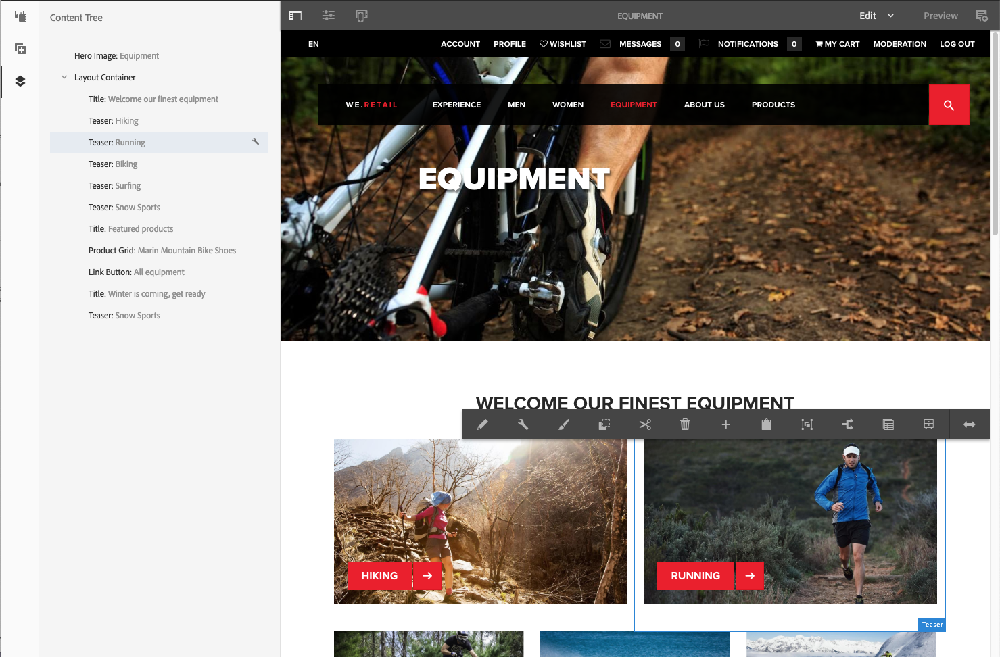

# Ontwerpen - het Milieu en Hulpmiddelen{#authoring-the-environment-and-tools}

De ontwerpomgeving van AEM biedt verschillende mechanismen voor het organiseren en bewerken van uw inhoud. De beschikbare gereedschappen zijn toegankelijk via de verschillende consoles en pagina-editors.

## Uw site {#managing-your-site} beheren

Met de console **Sites** kunt u door uw website navigeren en deze beheren met de kopbalk, werkbalk, actiepictogrammen (van toepassing op de geselecteerde bron), broodkruimels en, indien geselecteerd, secundaire rails (bijvoorbeeld tijdlijn en verwijzingen).

Bijvoorbeeld, kolommening:

## Paginacontent bewerken {#editing-page-content}

U kunt een pagina bewerken met de pagina-editor. Bijvoorbeeld:

`https://localhost:4502/editor.html/content/we-retail/us/en/equipment.html`

>[!NOTE]
>
>De eerste keer dat u een pagina opent om te bewerken, wordt in een reeks dia&#39;s een overzicht van de functies weergegeven.
>
>U kunt desgewenst de tour overslaan en deze op elk gewenst moment herhalen door deze te selecteren in het menu **Pagina-informatie**.

## Toegang tot Help {#accessing-help}

Bij het bewerken van een pagina is **Help** toegankelijk vanuit:

* de [**Paginagegevens**](/help/sites-authoring/editing-page-properties.md#page-properties)-kiezer; dit zal de inleidende dia&#39;s (zoals getoond de eerste keer u tot de redacteur toegang hebt) tonen.
* het [configuration](/help/sites-authoring/editing-content.md#edit-configure-copy-cut-delete-paste) dialoog voor specifieke componenten (gebruikend ? pictogram in de dialoogwerkbalk); dit zal contextgevoelige hulp tonen .

Aanvullende [Help-gerelateerde bronnen zijn beschikbaar op consoles](/help/sites-authoring/basic-handling.md#accessing-help).

## Componentbrowser {#components-browser}

De componentenbrowser toont alle componenten die voor gebruik op uw huidige pagina beschikbaar zijn. U kunt deze naar de juiste locatie slepen en vervolgens bewerken om uw inhoud toe te voegen.

De componentenbrowser is een tabblad in het zijpaneel (samen met de [assetbrowser](/help/sites-authoring/author-environment-tools.md#assets-browser) en de [contentstructuur](/help/sites-authoring/author-environment-tools.md#content-tree)). Als u het zijpaneel wilt openen (of sluiten), gebruikt u het pictogram linksboven op de werkbalk:

Wanneer u het zijpaneel opent, schuift het van de linkerkant open (selecteer **Componenten** tabel indien nodig). Wanneer u deze optie opent, kunt u door alle componenten bladeren die beschikbaar zijn voor de pagina.

De daadwerkelijke verschijning en behandeling zijn afhankelijk van het apparatentype u gebruikt:

>[!NOTE]
>
>Een mobiel apparaat wordt gedetecteerd wanneer de breedte minder dan 1024 px is. Dit kan ook het geval zijn voor een klein bureaubladvenster.

* **Mobiel apparaat (bijvoorbeeld iPad)**

   De componentbrowser beslaat volledig de pagina die wordt bewerkt.

   Als u een component aan de pagina wilt toevoegen, houdt u de vereiste component ingedrukt en verplaatst u deze naar rechts (de componentbrowser wordt dan gesloten om de pagina weer weer te geven), waar u de component kunt plaatsen.

   

* **Bureaubladapparaat**

   De componentbrowser wordt links in het venster geopend.

   Als u een component aan de pagina wilt toevoegen, klikt u op de gewenste component en sleept u deze naar de gewenste locatie.

   

   Componenten worden vertegenwoordigd door

   * Componentnaam
   * Componentgroep (grijs)
   * Pictogram of afkorting

      * De standaardcomponentpictogrammen zijn monochroom.
      * Afkortingen zijn altijd de eerste twee tekens van de componentnaam.

   Van de hoogste toolbar in **Components** browser kunt u:

   * Componenten filteren op naam.
   * Beperk de weergave tot een specifieke groep met behulp van de keuzelijst.

   Voor een meer gedetailleerde beschrijving van de component kunt u op het informatiepictogram naast de component in de **Componentbrowser** klikken of tikken (indien beschikbaar). Bijvoorbeeld voor de **Lay-outcontainer**:

   

   Voor nog meer informatie over de componenten beschikbaar aan u ziet [Component Console](/help/sites-authoring/default-components-console.md).

## Elementenbrowser {#assets-browser}

In de middelenbrowser worden alle [assets](/help/assets/home.md) weergegeven die beschikbaar zijn voor rechtstreeks gebruik op de huidige pagina.

De middelenbrowser is een tab in het zijpaneel, samen met de [componenten bladert](/help/sites-authoring/author-environment-tools.md#components-browser)r en [inhoudsstructuur](/help/sites-authoring/author-environment-tools.md#content-tree). Als u het zijpaneel wilt openen of sluiten, gebruikt u het pictogram linksboven op de werkbalk:

Wanneer u het zijpaneel opent, schuift het van de linkerkant open. Selecteer indien nodig het tabblad **Middelen**.

Wanneer de middelenbrowser is geopend, kunt u door alle elementen bladeren die beschikbaar zijn voor uw pagina. Met oneindig schuiven wordt de lijst indien nodig uitgevouwen.

Als u een element aan de pagina wilt toevoegen, selecteert u het element en sleept u het naar de gewenste locatie. Dit kan zijn:

* Een bestaand onderdeel van het desbetreffende type.

   * U kunt bijvoorbeeld een element van het type afbeelding naar een afbeeldingscomponent slepen.

* A [placeholder](/help/sites-authoring/editing-content.md#component-placeholder) in het paragraafsysteem om een nieuwe component van het aangewezen type tot stand te brengen.

   * U kunt bijvoorbeeld een element van het type afbeelding naar het alineasysteem slepen om een component Image te maken.

>[!NOTE]
>
>Dit is beschikbaar voor specifieke elementen en componenttypen. Zie [Een component invoegen met de middelenbrowser](/help/sites-authoring/editing-content.md#inserting-a-component-using-the-assets-browser) voor meer informatie.

Vanuit de bovenste werkbalk van de middelenbrowser kunt u de elementen filteren op:

* Naam
* Pad
* Elementtype zoals afbeeldingen, manuscripten, documenten, video&#39;s, pagina&#39;s, alinea&#39;s en producten
* Kenmerken van middelen, zoals oriëntatie (staand, liggend, vierkant) en stijl (kleur, monochroom, grijswaarden)

   * Alleen beschikbaar voor bepaalde typen elementen

De daadwerkelijke verschijning en behandeling zijn afhankelijk van het apparatentype u gebruikt:

>[!NOTE]
>
>Een mobiel apparaat wordt ontdekt wanneer de breedte minder dan 1024px is; dat wil zeggen ook in een klein bureaubladvenster.

* **Mobiel apparaat zoals iPad**

   De elementenbrowser beslaat volledig de pagina die wordt bewerkt.

   Als u een element aan uw pagina wilt toevoegen, houdt u het vereiste element ingedrukt en verplaatst u het naar rechts. De elementenbrowser wordt dan gesloten en geeft de pagina weer, waar u het element aan de vereiste component kunt toevoegen.

   

* **Bureaubladapparaat**

   De middelenbrowser wordt links in het venster geopend.

   Als u een element aan de pagina wilt toevoegen, klikt u op het gewenste element en sleept u het naar de gewenste component of locatie.

   

Als u snel een wijziging in een element moet aanbrengen, kunt u de [asseteditor](/help/assets/manage-assets.md) rechtstreeks vanuit de elementenbrowser starten door op het bewerkingspictogram naast de naam van het element te klikken.

## Inhoudsstructuur {#content-tree}

De **Inhoudsstructuur** geeft een overzicht van alle componenten op de pagina in een hiërarchie, zodat u in een oogopslag kunt zien hoe de pagina is samengesteld.

De inhoudsstructuur is een tabblad in het zijpaneel (samen met de browser met componenten en elementen). Als u het zijpaneel wilt openen (of sluiten), gebruikt u het pictogram linksboven op de werkbalk:

Als u het zijpaneel opent, wordt het geopend (van de linkerkant). Selecteer indien nodig het tabblad **Inhoudsstructuur**. Wanneer open kunt u een vertegenwoordiging van de boommening van uw pagina of malplaatje zien, zodat het gemakkelijker is om te begrijpen hoe zijn inhoud hiërarchisch gestructureerd is. Bovendien wordt het op een complexe pagina gemakkelijker om tussen componenten van de pagina te springen.

Een pagina kan eenvoudig uit veel van hetzelfde type componenten bestaan, zodat in de structuur van de inhoud (component) beschrijvende tekst (grijs) wordt weergegeven achter de naam van het componenttype (in zwart). De beschrijvende tekst is afkomstig uit gemeenschappelijke eigenschappen van de component, zoals titel of tekst.

Componenttypen worden weergegeven in de taal van de gebruiker, terwijl de tekst van de componentbeschrijving uit de paginataal komt.

Als u klikt op het chevron naast een component, wordt dat niveau samengevouwen of uitgevouwen.

>[!NOTE]
>
>De inhoudsstructuur is niet beschikbaar als u een pagina bewerkt op een mobiel apparaat (als de breedte van de browser minder dan 1024 px is).

Wanneer u op de component klikt, wordt de component in de pagina-editor gemarkeerd. Welke acties beschikbaar zijn, is afhankelijk van de paginastatus:

* Bijvoorbeeld een basispagina:

   `https://localhost:4502/editor.html/content/we-retail/language-masters/en/equipment.html`

   

   Als de component waarop u klikt in de structuur bewerkbaar is, wordt er een moersleutelpictogram rechts van de naam weergegeven. Als u op dit pictogram klikt, wordt het dialoogvenster Bewerken voor de component direct gestart.

   

* Of een pagina die deel uitmaakt van een [livecopy](/help/sites-administering/msm.md), waar componenten van een andere pagina worden geërft; bijvoorbeeld:

   `https://localhost:4502/editor.html/content/we-retail/us/en/equipment.html`

   

## Fragmenten - gekoppelde inhoudsbrowser {#fragments-associated-content-browser}

Als uw pagina Content Fragments bevat, hebt u ook toegang tot de browser [voor Gekoppelde inhoud](/help/sites-authoring/content-fragments.md#using-associated-content).

## Verwijzingen {#references}

**In** verwijzingen worden verbindingen met de geselecteerde pagina weergegeven:

* Blauwdrukken
* Lanceringen
* Live kopieën
* Taalkopieën
* Binnenkomende koppelingen
* Gebruik van de referentiecomponent: geleend en geleend materiaal
* Verwijzingen naar productpagina&#39;s (vanaf de console Handel - Producten)

Open de vereiste console, navigeer dan aan het vereiste middel en open **Verwijzingen** gebruikend:

[Selecteer uw vereiste ](/help/sites-authoring/basic-handling.md#viewing-and-selecting-resources) bron om een lijst van verwijzingstypes relevant voor die bron te tonen:

Selecteer het juiste referentietype voor meer informatie. In bepaalde situaties zijn aanvullende acties beschikbaar wanneer u een specifieke verwijzing selecteert, zoals:

* **Binnenkomende koppelingen**, biedt een lijst met pagina&#39;s die naar de pagina verwijzen, samen met directe toegang tot  **** Editone van deze pagina&#39;s wanneer u een specifieke koppeling selecteert

* Instanties van geleende en geleende inhoud die de **Referentie** component gebruiken, van hier kunt u aan de verwijzende/referenced pagina navigeren

* [Verwijzingen naar productpagina](/help/sites-administering/generic.md#showing-product-references) &#39;s (beschikbaar op de console Handel-Producten)
* [Opstarten](/help/sites-authoring/launches.md), biedt toegang tot gerelateerde opstarties
* [Met Live ](/help/sites-administering/msm.md) kopieën worden de paden van alle live kopieën weergegeven die zijn gebaseerd op de geselecteerde bron.
* [Blauwdruk](/help/sites-administering/msm-best-practices.md), details en diverse handelingen
* [Taalkopieën](/help/sites-administering/tc-manage.md#creating-translation-projects-using-the-references-panel), details en diverse handelingen

U kunt bijvoorbeeld een verbroken verwijzing herstellen in een component Reference:

## Gebeurtenissen - tijdlijn {#events-timeline}

Voor geschikte bronnen (bijvoorbeeld pagina&#39;s van de **Sites**-console of middelen van de **Assets**-console) kan de [tijdlijn worden gebruikt om de recente activiteit op geselecteerde items weer te geven](/help/sites-authoring/basic-handling.md#timeline).

Open de vereiste console, navigeer dan aan het vereiste middel en open **Chronologie**, gebruikend:

[Selecteer uw vereiste bron](/help/sites-authoring/basic-handling.md#viewing-and-selecting-resources) en  **toon** Alle  **** activiteiten tonen om recente acties op de geselecteerde bronnen weer te geven:

## Pagina-informatie {#page-information}

Met het pictogram Pagina-informatie (equalizer) opent u een menu dat ook informatie bevat over de laatste bewerking en de laatste publicatie. Afhankelijk van de kenmerken van de pagina, de site en uw exemplaar, zijn mogelijk meer of minder opties beschikbaar:

* [Eigenschappen openen](/help/sites-authoring/editing-page-properties.md)
* [Uitrolpagina](/help/sites-administering/msm.md#msm-from-the-ui)
* [Workflow starten](/help/sites-authoring/workflows-applying.md#starting-a-workflow-from-the-page-editor)
* [Pagina vergrendelen](/help/sites-authoring/editing-content.md#locking-a-page)
* [Pagina publiceren](/help/sites-authoring/publishing-pages.md#main-pars-title-10)
* [Publicatie van pagina ongedaan maken](/help/sites-authoring/publishing-pages.md#main-pars-title-5)
* [Sjabloon](/help/sites-authoring/templates.md) bewerken; wanneer de pagina is gebaseerd op een  [bewerkbare sjabloon](/help/sites-authoring/templates.md#editable-and-static-templates)

* [Weergeven als gepubliceerd](/help/sites-authoring/editing-content.md#view-as-published)
* [Weergeven in beheerder](/help/sites-authoring/basic-handling.md#viewing-and-selecting-resources)
* [Help](/help/sites-authoring/basic-handling.md#accessing-help)

Zo heeft **Pagina-informatie**, indien van toepassing, ook de volgende opties:

* [Promote ](/help/sites-authoring/launches-promoting.md) Launchif the page is a launch.
* [Openen in klassieke ](/help/sites-authoring/select-ui.md#switching-to-classic-ui-when-editing-a-page) gebruikersinterface als deze opties door een beheerder zijn  [ingeschakeld](/help/sites-administering/enable-classic-ui-editor.md)

Daarnaast kan **Pagina-informatie**, indien van toepassing, toegang bieden tot analyses en aanbevelingen.

## Paginamodi {#page-modes}

Er zijn verschillende modi voor het bewerken van een pagina die verschillende handelingen mogelijk maken:

* [Bewerken](/help/sites-authoring/editing-content.md) : de modus die moet worden gebruikt voor het bewerken van de pagina-inhoud.
* [Layout](/help/sites-authoring/responsive-layout.md) : hiermee kunt u afhankelijk van het apparaat een responsieve lay-out maken en bewerken (als de pagina is gebaseerd op een lay-outcontainer)

* [Basisstructuur](/help/sites-authoring/scaffolding.md) : hiermee kunt u een grote set pagina&#39;s maken die dezelfde structuur hebben maar andere inhoud hebben.
* [Ontwikkelaar](/help/sites-developing/developer-mode.md) : hiermee kunt u verschillende handelingen uitvoeren (hiervoor zijn privileges vereist). Deze omvatten het inspecteren van de technische details van een pagina en de onderdelen ervan.

* [Ontwerp](/help/sites-authoring/default-components-designmode.md)  - staat u toe om componenten voor gebruik op een pagina toe te laten/onbruikbaar te maken en het ontwerp van de component te vormen (als de pagina op een  [statische malplaatje](/help/sites-authoring/templates.md#editable-and-static-templates) gebaseerd is).

* [Doelstelling](/help/sites-authoring/content-targeting-touch.md)  - vergroot de relevantie van inhoud door de inhoud op alle kanalen te richten en te meten.
* [Activity Map](/help/sites-authoring/page-analytics-using.md#analyticsvisiblefromthepageeditor) : toont de analysegegevens voor de pagina.

* [Met Timewarp](/help/sites-authoring/working-with-page-versions.md#timewarp)  kunt u de status van een pagina op een bepaald tijdstip weergeven.
* [De status](/help/sites-authoring/editing-content.md#live-copy-status)  van het Levende Exemplaar - staat een snel overzicht van de levende exemplaarstatus toe en welke componenten worden/worden niet geërft.
* [Voorvertoning](/help/sites-authoring/editing-content.md#previewing-pages) : wordt gebruikt om de pagina weer te geven zoals deze wordt weergegeven in de publicatieomgeving. of om te navigeren met koppelingen in de inhoud.

* [Annotatie](/help/sites-authoring/annotations.md) : wordt gebruikt om annotaties op de pagina toe te voegen of weer te geven.

U kunt deze openen met de pictogrammen in de rechterbovenhoek. Het werkelijke pictogram verandert in de modus die u momenteel gebruikt:

>[!NOTE]
>
>* Afhankelijk van de kenmerken van de pagina zijn sommige modi mogelijk niet beschikbaar.
>* Voor toegang tot bepaalde modi zijn de juiste machtigingen/bevoegdheden vereist.
>* De modus Ontwikkelaar is niet beschikbaar op mobiele apparaten vanwege ruimtebeperkingen.
>* Er is een [sneltoets](/help/sites-authoring/page-authoring-keyboard-shortcuts.md) ( `Ctrl-Shift-M`) om te schakelen tussen **Voorvertoning** en de momenteel geselecteerde modus (bijvoorbeeld **Bewerken**, **Lay-out**, enz.).

>

## Padselectie {#path-selection}

Vaak is het tijdens het ontwerpen nodig een andere bron te selecteren, bijvoorbeeld wanneer u een koppeling naar een andere pagina of bron definieert of een afbeelding selecteert. [padvelden](/help/sites-authoring/author-environment-tools.md#path-fields) bieden automatisch aanvullen en met de [padbrowser](/help/sites-authoring/author-environment-tools.md#path-browser) kunt u een pad eenvoudig selecteren.

### Padvelden {#path-fields}

Het voorbeeld dat hier wordt gebruikt om te illustreren is de afbeeldingscomponent. Zie [Componenten voor pagina-ontwerpomgeving](/help/sites-authoring/default-components.md) voor meer informatie over het gebruik en het bewerken van componenten.

De gebieden van de weg hebben auto-volledige en blik-vooruit functionaliteit nu om het vinden van een middel gemakkelijker te maken.

Als u op de knop **Dialoogvenster Selectie openen** in het padveld klikt, wordt het dialoogvenster [Padbrowser](/help/sites-authoring/author-environment-tools.md#path-browser) geopend voor gedetailleerdere selectieopties.

U kunt ook beginnen te typen in het veld Pad en AEM biedt overeenkomende paden terwijl u typt.

### Padbrowser {#path-browser}

De padbrowser is geordend als de [kolomweergave](/help/sites-authoring/basic-handling.md#column-view) van de siteconsole, zodat u uitgebreidere bronnen kunt selecteren.

* Zodra een middel wordt geselecteerd, wordt **Select** knoop bij het hoger-recht van de dialoog actief. Klik of tik om de selectie te bevestigen of **Annuleren** om af te breken.
* Als de selectie van meerdere assets is toegestaan binnen de context, activeert het selecteren van een resource ook de knop **Selecteren**, maar wordt er ook een telling van het aantal geselecteerde resources in de rechterbovenhoek van het venster toegevoegd. Klik op de **X** naast het getal om de selectie op te heffen.
* Wanneer u door de boom navigeert, wordt uw plaats weerspiegeld in de broodkruimels bij de bovenkant van de dialoog. Deze broodkruimels kunnen ook worden gebruikt om snel binnen de middelhiërarchie te springen.
* U kunt op elk gewenst moment het zoekveld boven in het dialoogvenster gebruiken. Klik **X** in het onderzoeksgebied om het onderzoek te ontruimen.
* Als u uw zoekopdracht wilt beperken, kunt u de filteropties zichtbaar maken en de resultaten filteren op basis van een bepaald pad.

   

## Sneltoetsen {#keyboard-shortcuts}

Er zijn verschillende [sneltoetsen](/help/sites-authoring/page-authoring-keyboard-shortcuts.md) beschikbaar.
