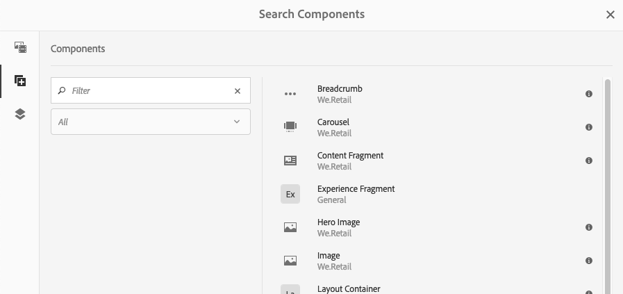

# Authoring - het milieu en de instrumenten{#authoring-the-environment-and-tools}

De ontwerpomgeving van AEM biedt verschillende mechanismen voor het organiseren en bewerken van uw inhoud. De beschikbare gereedschappen zijn toegankelijk via de verschillende consoles en pagina-editors.

## Uw site beheren {#managing-your-site}

De **Sites** Met de console kunt u door uw website navigeren en deze beheren met behulp van de kopbalk, werkbalk, actiepictogrammen (van toepassing op de geselecteerde bron), broodkruimels en, indien geselecteerd, secundaire rails (bijvoorbeeld tijdlijn en verwijzingen).

Bijvoorbeeld, kolommening:

## Pagina-inhoud bewerken {#editing-page-content}

U kunt een pagina bewerken met de pagina-editor. Bijvoorbeeld:

`https://localhost:4502/editor.html/content/we-retail/us/en/equipment.html`

>[!NOTE]
>
>De eerste keer dat u een pagina opent om te bewerken, wordt in een reeks dia&#39;s een overzicht van de functies weergegeven.
>
>U kunt de tour desgewenst overslaan en deze op elk gewenst moment herhalen door een keuze te maken in het menu **Pagina-informatie** -menu.

## Toegang tot Help {#accessing-help}

Bij het bewerken van een pagina **Help** kan worden benaderd via:

* de [**Pagina-informatie**](/help/sites-authoring/editing-page-properties.md#page-properties) selecteur; dit toont de inleidende dia&#39;s (zoals getoond de eerste keer dat u tot de redacteur toegang hebt).
* de [configuratie](/help/sites-authoring/editing-content.md#edit-configure-copy-cut-delete-paste) dialoogvenster voor specifieke componenten (met het vraagteken (?) (in de werkbalk van het dialoogvenster); dit toont contextgevoelige Help.

Verdere [Help-gerelateerde bronnen zijn beschikbaar op consoles](/help/sites-authoring/basic-handling.md#accessing-help).

## Browser voor componenten {#components-browser}

De componentenbrowser toont alle componenten die voor gebruik op uw huidige pagina beschikbaar zijn. U kunt deze naar de juiste locatie slepen en vervolgens bewerken om uw inhoud toe te voegen.

De componentenbrowser is een tabblad in het zijpaneel (samen met de [assetbrowser](/help/sites-authoring/author-environment-tools.md#assets-browser) en de [contentstructuur](/help/sites-authoring/author-environment-tools.md#content-tree)). Als u het zijpaneel wilt openen (of sluiten), gebruikt u het pictogram linksboven op de werkbalk:

Wanneer u het zijpaneel opent, schuift het van de linkerkant open (selecteer **Componenten** indien nodig). Wanneer u deze optie opent, kunt u door alle componenten bladeren die beschikbaar zijn voor de pagina.

De werkelijke weergave en afhandeling zijn afhankelijk van het apparaattype dat u gebruikt:

>[!NOTE]
>
>Een mobiel apparaat wordt gedetecteerd wanneer de breedte minder dan 1024 px is. Dit kan ook het geval zijn voor een klein bureaubladvenster.

* **Mobiel apparaat (bijvoorbeeld iPad)**

  De componentbrowser beslaat volledig de pagina die wordt bewerkt.

  Als u een component aan de pagina wilt toevoegen, houdt u de vereiste component ingedrukt en verplaatst u deze naar rechts (de browser van de component wordt gesloten om de pagina weer te geven), waar u de component kunt plaatsen.

  

* **Bureaubladapparaat**

  De componentbrowser wordt links in het venster geopend.

  Als u een component aan de pagina wilt toevoegen, klikt u op de gewenste component en sleept u deze naar de gewenste locatie.

  

  Componenten worden vertegenwoordigd door

   * Componentnaam
   * Componentgroep (grijs)
   * Pictogram of afkorting

      * De standaardcomponentpictogrammen zijn monochroom.
      * Afkortingen zijn altijd de eerste twee tekens van de componentnaam.

  Vanaf de bovenste werkbalk in het dialoogvenster **Componenten** kunt u de volgende handelingen uitvoeren in de browser:

   * Componenten filteren op naam.
   * Beperk de weergave tot een specifieke groep met behulp van de vervolgkeuzelijst.

  Voor een gedetailleerdere beschrijving van de component klikt u op het informatiepictogram naast de component in het dialoogvenster **Componenten** browser (indien beschikbaar). Bijvoorbeeld voor de **Lay-outcontainer**:

  

  Voor nog meer informatie over de componenten beschikbaar aan u, zie [Component Console](/help/sites-authoring/default-components-console.md).

## Browser voor middelen {#assets-browser}

In de middelenbrowser worden alle [elementen](/help/assets/assets.md) die beschikbaar zijn voor rechtstreeks gebruik op uw huidige pagina.

De middelenbrowser is een tab in het zijpaneel samen met de [browse componenten](/help/sites-authoring/author-environment-tools.md#components-browser)r en [inhoudsstructuur](/help/sites-authoring/author-environment-tools.md#content-tree). Als u het zijpaneel wilt openen of sluiten, gebruikt u het pictogram linksboven op de werkbalk:

Wanneer u het zijpaneel opent, schuift het vanaf de linkerkant open. Selecteer de **Activa** indien nodig.

Wanneer de middelenbrowser is geopend, kunt u door alle elementen bladeren die beschikbaar zijn voor uw pagina. Met oneindig schuiven wordt de lijst indien nodig uitgebreid.

Als u een element aan de pagina wilt toevoegen, selecteert u het element en sleept u het naar de gewenste locatie. Dit kan zijn:

* Een bestaand onderdeel van het desbetreffende type.

   * U kunt bijvoorbeeld een element van het type afbeelding naar een afbeeldingscomponent slepen.

* A [plaatsaanduiding](/help/sites-authoring/editing-content.md#component-placeholder) in het alineasysteem om een onderdeel van het juiste type te maken.

   * U kunt bijvoorbeeld een element van het type afbeelding naar het alineasysteem slepen om een component Image te maken.

>[!NOTE]
>
>Dit is beschikbaar voor specifieke elementen en componenttypen. Zie [Een component invoegen met de middelenbrowser](/help/sites-authoring/editing-content.md#inserting-a-component-using-the-assets-browser) voor meer informatie .

Vanuit de bovenste werkbalk van de middelenbrowser kunt u de elementen filteren op:

* Naam
* Pad
* Type element, zoals afbeeldingen, manuscripten, documenten, video&#39;s, pagina&#39;s, alinea&#39;s en producten
* Kenmerken van middelen, zoals oriëntatie (staand, liggend, vierkant) en stijl (kleur, monochroom, grijswaarden)

   * Alleen beschikbaar voor bepaalde typen elementen

De werkelijke weergave en afhandeling zijn afhankelijk van het apparaattype dat u gebruikt:

>[!NOTE]
>
>Een mobiel apparaat wordt gedetecteerd wanneer de breedte minder dan 1024 px is, dat wil zeggen ook in een klein bureaubladvenster.

* **Mobiel apparaat zoals iPad**

  De elementenbrowser beslaat volledig de pagina die wordt bewerkt.

  Als u een element aan uw pagina wilt toevoegen, houdt u het vereiste element ingedrukt en verplaatst u het naar rechts. De elementenbrowser wordt gesloten om de pagina weer te tonen, waar u het element aan de vereiste component kunt toevoegen.

  

* **Bureaubladapparaat**

  De middelenbrowser wordt links in het venster geopend.

  Als u een element aan uw pagina wilt toevoegen, klikt u op het element en sleept u het naar de gewenste component of locatie.

  

Als u een element snel moet wijzigen, kunt u de opdracht [Asset Editor](/help/assets/manage-assets.md) rechtstreeks vanuit de elementenbrowser door op het bewerkingspictogram naast de naam van het element te klikken.

## Inhoudsstructuur {#content-tree}

De **Inhoudsstructuur** geeft een overzicht van alle componenten op de pagina in een hiërarchie zodat u in een oogopslag kunt zien hoe de pagina is samengesteld.

De inhoudsstructuur is een tabblad in het zijpaneel (samen met de browser met componenten en elementen). Als u het zijpaneel wilt openen of sluiten, gebruikt u het pictogram linksboven op de werkbalk:

Wanneer u het zijpaneel opent, schuift het open (van de linkerkant). Selecteer de **Inhoudsstructuur** indien nodig. Wanneer geopend kunt u een vertegenwoordiging van de boommening van uw pagina of malplaatje zien, zodat het gemakkelijker is om te begrijpen hoe zijn inhoud hiërarchisch gestructureerd is. Op een complexe pagina is het bovendien gemakkelijker om tussen componenten van de pagina te schakelen.

Een pagina kan eenvoudig uit veel van hetzelfde type componenten bestaan, zodat in de structuur van de inhoud (component) beschrijvende tekst (grijs) wordt weergegeven achter de naam van het componenttype (in zwart). De beschrijvende tekst is afkomstig uit gemeenschappelijke eigenschappen van de component, zoals titel of tekst.

Componenttypen worden weergegeven in de taal van de gebruiker, terwijl de tekst van de componentbeschrijving uit de paginataal komt.

Als u klikt op het chevron naast een component, wordt dat niveau samengevouwen of uitgebreid.

>[!NOTE]
>
>De inhoudsstructuur is niet beschikbaar als u een pagina bewerkt op een mobiel apparaat (als de breedte van de browser minder dan 1024 px is).

Wanneer u op de component klikt, wordt de component in de pagina-editor gemarkeerd. Welke acties beschikbaar zijn, is afhankelijk van de paginastatus:

* Bijvoorbeeld een basispagina:

  `https://localhost:4502/editor.html/content/we-retail/language-masters/en/equipment.html`

  

  Als de component waarop u klikt bewerkbaar is, wordt er rechts van de naam een moersleutelpictogram weergegeven. Als u op dit pictogram klikt, wordt het dialoogvenster Bewerken geopend voor de component.

  

* Of een pagina die deel uitmaakt van een [livecopy](/help/sites-administering/msm.md), waarbij componenten van een andere pagina worden overgeërfd, bijvoorbeeld:

  `https://localhost:4502/editor.html/content/we-retail/us/en/equipment.html`

  

## Fragmenten - gekoppelde inhoudsbrowser {#fragments-associated-content-browser}

Als uw pagina inhoudsfragmenten bevat, hebt u toegang tot de [browser voor gekoppelde inhoud](/help/sites-authoring/content-fragments.md#using-associated-content).

## Verwijzingen {#references}

**Verwijzingen** verbindingen met de geselecteerde pagina tonen:

* Blauwdrukken
* Lanceringen
* Live kopieën
* Taalkopieën
* Binnenkomende koppelingen
* Gebruik van de referentiecomponent: geleend en geleend inhoud
* Verwijzingen naar productpagina&#39;s (vanaf de console Handel - Producten)

Open de vereiste console, navigeer dan aan het vereiste middel en open **Verwijzingen** gebruiken:

[Selecteer uw vereiste bron](/help/sites-authoring/basic-handling.md#viewing-and-selecting-resources) toont een lijst van verwijzingstypes relevant voor die bron:

Selecteer het juiste referentietype voor meer informatie. In bepaalde situaties zijn aanvullende acties beschikbaar wanneer u een specifieke verwijzing selecteert, zoals:

* **Binnenkomende koppelingen** biedt een lijst met pagina&#39;s die naar de pagina verwijzen, samen met directe toegang tot **Bewerken** wanneer u een specifieke koppeling selecteert, wordt een van deze pagina&#39;s weergegeven.

   * Dit kan alleen statische koppelingen weergeven, niet dynamisch gegenereerde koppelingen, bijvoorbeeld vanuit de component List.

* Instanties van geleend en geleend materiaal die gebruikmaken van de **Referentie** component, vanaf hier kunt u naar de pagina waarnaar wordt verwezen of waarnaar wordt verwezen

* [Verwijzingen naar productpagina&#39;s](/help/commerce/cif-classic/administering/generic.md#showing-product-references) (beschikbaar via de Commerce-Products console)
* [Starten](/help/sites-authoring/launches.md) verleent toegang tot verwante lanceringen.
* [Actieve kopieën](/help/sites-administering/msm.md) Hiermee geeft u de paden weer van alle live kopieën die op de geselecteerde bron zijn gebaseerd.
* [Blauwdruk](/help/sites-administering/msm-best-practices.md) bevat details en diverse acties.
* [Kopieën van talen](/help/sites-administering/tc-manage.md#creating-translation-projects-using-the-references-panel) bevat details en diverse acties.

U kunt bijvoorbeeld een verbroken verwijzing herstellen in een component Reference:

## Gebeurtenissen - tijdlijn {#events-timeline}

Voor de juiste bronnen (bijvoorbeeld pagina&#39;s van de **Sites** console, of middelen van de **Activa** console) de [tijdlijn kan worden gebruikt om de recente activiteit op geselecteerde punten te tonen](/help/sites-authoring/basic-handling.md#timeline).

Open de vereiste console, navigeer dan aan het vereiste middel en open **Tijdlijn**, met:

[Selecteer uw vereiste bron](/help/sites-authoring/basic-handling.md#viewing-and-selecting-resources), dan ofwel **Alles tonen** of **Activiteiten** om recente acties op de geselecteerde middelen te vermelden:

## Pagina-informatie {#page-information}

Met de knop Pagina-informatie (egalisatiepictogram) opent u een menu dat ook informatie bevat over de laatste bewerking en de laatste publicatie. Afhankelijk van de kenmerken van de pagina, de site en uw exemplaar, zijn mogelijk meer of minder opties beschikbaar:

* [Eigenschappen openen](/help/sites-authoring/editing-page-properties.md)
* [Uitrolpagina](/help/sites-administering/msm.md#msm-from-the-ui)
* [Workflow starten](/help/sites-authoring/workflows-applying.md#starting-a-workflow-from-the-page-editor)
* [Pagina vergrendelen](/help/sites-authoring/editing-content.md#locking-a-page)
* [Pagina publiceren](/help/sites-authoring/publishing-pages.md#main-pars-title-10)
* [Publicatie van pagina ongedaan maken](/help/sites-authoring/publishing-pages.md#main-pars-title-5)
* [Sjabloon bewerken](/help/sites-authoring/templates.md); wanneer de pagina is gebaseerd op een [bewerkbare sjabloon](/help/sites-authoring/templates.md#editable-and-static-templates)

* [Weergeven als gepubliceerd](/help/sites-authoring/editing-content.md#view-as-published)
* Weergeven in Beheer; opent de pagina in het dialoogvenster [siteconsole](/help/sites-authoring/basic-handling.md#viewing-and-selecting-resources)
* [Help](/help/sites-authoring/basic-handling.md#accessing-help)

Zo, indien van toepassing, **Pagina-informatie** heeft ook de volgende opties:

* [Starten bevorderen](/help/sites-authoring/launches-promoting.md) als de pagina een introductie is
* [Openen in klassieke gebruikersinterface](/help/sites-authoring/select-ui.md#switching-to-classic-ui-when-editing-a-page) als deze optie [ingeschakeld door een beheerder](/help/sites-administering/enable-classic-ui-editor.md)

Daarnaast **Pagina-informatie** waar nodig toegang kunnen verlenen tot analyses en aanbevelingen.

## Paginamodi {#page-modes}

Er zijn verschillende modi voor het bewerken van een pagina die verschillende handelingen mogelijk maken:

* [Bewerken](/help/sites-authoring/editing-content.md) - gebruik deze modus bij het bewerken van de pagina-inhoud.
* [Layout](/help/sites-authoring/responsive-layout.md) - Hiermee kunt u de responsieve indeling maken en bewerken, afhankelijk van het apparaat (als de pagina is gebaseerd op een lay-outcontainer)

* [Basisstructuur](/help/sites-authoring/scaffolding.md) - Help u een grote set pagina&#39;s te maken die structuur delen maar andere inhoud hebben.
* [Ontwikkelaar](/help/sites-developing/developer-mode.md) - Hiermee kunt u verschillende handelingen uitvoeren (hiervoor zijn privileges vereist). Deze omvatten het inspecteren van de technische details van een pagina en de onderdelen ervan.

* [Ontwerp](/help/sites-authoring/default-components-designmode.md) - Hiermee kunt u componenten voor gebruik op een pagina in- en uitschakelen en het ontwerp van de component configureren (als de pagina is gebaseerd op een [statisch sjabloon](/help/sites-authoring/templates.md#editable-and-static-templates)).

* [Targeting](/help/sites-authoring/content-targeting-touch.md) - de relevantie van inhoud vergroten door de inhoud op alle kanalen te richten en te meten.
* [Activity Map](/help/sites-authoring/page-analytics-using.md#analyticsvisiblefromthepageeditor) - toont Analytische gegevens voor de pagina.

* [Timewarp](/help/sites-authoring/working-with-page-versions.md#timewarp) - Hiermee kunt u de status van een pagina op een bepaald tijdstip weergeven.
* [Status van live kopiëren](/help/sites-authoring/editing-content.md#live-copy-status) - maakt een snel overzicht mogelijk van de status van de live kopie en van de componenten die worden/worden overgeërfd.
* [Voorvertoning](/help/sites-authoring/editing-content.md#previewing-pages) - wordt gebruikt om de pagina weer te geven zoals deze wordt weergegeven in de publicatieomgeving, of om te navigeren met koppelingen in de inhoud.

* [Annoteren](/help/sites-authoring/annotations.md) - wordt gebruikt om annotaties op de pagina toe te voegen of weer te geven.

U kunt deze openen met de pictogrammen in de rechterbovenhoek. Het daadwerkelijke pictogram verandert om op de wijze te wijzen u momenteel gebruikt:

>[!NOTE]
>
>* Afhankelijk van de kenmerken van de pagina zijn bepaalde modi mogelijk niet beschikbaar.
>* Voor toegang tot bepaalde modi zijn de juiste machtigingen/bevoegdheden vereist.
>* De modus Ontwikkelaar is niet beschikbaar op mobiele apparaten vanwege ruimtebeperkingen.
>* Er is een [sneltoets](/help/sites-authoring/page-authoring-keyboard-shortcuts.md) ( `Ctrl-Shift-M`) om te schakelen tussen **Voorvertoning** en de momenteel geselecteerde modus (bijvoorbeeld **Bewerken**, en **Layout**).
>

## Padselectie {#path-selection}

Vaak is het tijdens het ontwerpen nodig een andere bron te selecteren, bijvoorbeeld wanneer u een koppeling naar een andere pagina of bron definieert of een afbeelding selecteert. Om een pad gemakkelijk te selecteren, [padvelden](/help/sites-authoring/author-environment-tools.md#path-fields) aanbieden en de [padbrowser](/help/sites-authoring/author-environment-tools.md#path-browser) maakt een robuustere selectie mogelijk.

### Padvelden {#path-fields}

Het voorbeeld dat hier wordt gebruikt om te illustreren is de afbeeldingscomponent. Zie voor meer informatie over het gebruik en bewerken van componenten [Componenten voor paginaontwerp](/help/sites-authoring/default-components.md).

Padvelden beschikken nu over de functionaliteit voor automatisch aanvullen en vooruitkijken, zodat u een resource gemakkelijker kunt vinden.

Klik op de knop **Dialoogvenster Selectie openen** in het veld Pad wordt de knop [padbrowser](/help/sites-authoring/author-environment-tools.md#path-browser) voor gedetailleerdere selectieopties.

U kunt ook in het veld Pad typen en AEM biedt overeenkomende paden terwijl u typt.

### Padbrowser {#path-browser}

De padbrowser is geordend als de [kolomweergave](/help/sites-authoring/basic-handling.md#column-view) van de plaatsenconsole, die voor meer gedetailleerde selectie van middelen toestaat.

* Wanneer een bron is geselecteerd, wordt de **Selecteren** in de rechterbovenhoek van het dialoogvenster wordt geactiveerd. Klik om de selectie te bevestigen of **Annuleren** om af te breken.
* Als de selectie van meerdere assets is toegestaan binnen de context, activeert het selecteren van een resource ook de knop **Selecteren**, maar wordt er ook een telling van het aantal geselecteerde resources in de rechterbovenhoek van het venster toegevoegd. Klikken **X** naast het getal dat u wilt uitschakelen.
* Wanneer u door de boom navigeert, wordt uw plaats weerspiegeld in de broodkruimels bij de bovenkant van de dialoog. Deze broodkruimels kunnen ook worden gebruikt om snel binnen de middelhiërarchie te springen.
* U kunt op elk gewenst moment het zoekveld boven in het dialoogvenster gebruiken. Klik op de knop **X** in het zoekveld om de zoekopdracht te wissen.
* Als u uw zoekopdracht wilt beperken, kunt u de filteropties zichtbaar maken en de resultaten filteren op basis van een bepaald pad.

  

## Sneltoetsen {#keyboard-shortcuts}

Diversen [sneltoetsen](/help/sites-authoring/page-authoring-keyboard-shortcuts.md) zijn beschikbaar.
