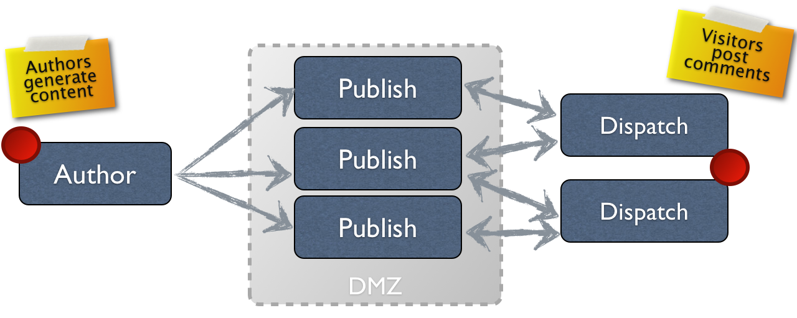

# Authoring{#authoring}

## Concept of Authoring (and Publishing) {#concept-of-authoring-and-publishing}

AEM biedt u twee omgevingen:

* Auteur
* Publicatie

Met deze interacties kunt u inhoud op uw website beschikbaar maken, zodat uw bezoekers deze kunnen lezen.

De auteursomgeving verstrekt de mechanismen om deze inhoud tot stand te brengen, bij te werken en te herzien alvorens het daadwerkelijk te publiceren:

* Een auteur maakt en beoordeelt de inhoud (dit kan van verschillende typen zijn). bijvoorbeeld pagina&#39;s, middelen, publicaties, enz.)
* die op een gegeven moment op uw website worden gepubliceerd.

Op het auteursmilieu wordt de functionaliteit van AEM ter beschikking gesteld door twee UIs. Voor het publicatiemilieu ontwerpt u de volledige blik-en-gevoel van de interface die aan uw gebruikers ter beschikking wordt gesteld.

### Auteursomgeving {#author-environment}

De auteur werkt in wat als **auteursomgeving** wordt bekend. Dit verstrekt een makkelijk te gebruiken interface (grafische gebruikersinterface (GUI of UI)) voor het creëren van de inhoud. Het wordt gewoonlijk gevestigd achter de firewall van een bedrijf die volledige bescherming biedt en de auteur aan login vereist, gebruikend een rekening die de aangewezen toegangsrechten is toegewezen.

>[!NOTE]
>
>Uw account heeft de juiste toegangsrechten nodig om inhoud te maken, bewerken of publiceren.

Afhankelijk van hoe uw instantie en uw persoonlijke toegangsrechten worden gevormd kunt u vele taken op uw inhoud, met inbegrip van (onder andere) uitvoeren:

* nieuwe inhoud genereren of bestaande inhoud bewerken op een pagina
* vooraf gedefinieerde sjablonen gebruiken om nieuwe inhoudspagina&#39;s te maken
* uw elementen en verzamelingen maken, bewerken en beheren
* uw publicaties maken, bewerken en beheren
* uw campagnes en de bijbehorende bronnen ontwikkelen
* gemeenschapssites ontwikkelen en beheren
* inhoudspagina&#39;s, elementen, enz. verplaatsen, kopiëren of verwijderen
* pagina&#39;s, elementen, enz. publiceren (of de publicatie ervan ongedaan maken)

Daarnaast zijn er beheertaken die u helpen uw inhoud te beheren:

* workflows die bepalen hoe wijzigingen worden beheerd; bijvoorbeeld. een toetsing vóór publicatie afdwingen
* projecten die individuele taken coördineren

>[!NOTE]
>
>AEM wordt ook [toegediend](/help/sites-administering/home.md) (voor de meerderheid van taken) van het auteursmilieu.

#### Omgeving {#publish-environment} publiceren

Als de inhoud van de AEM site gereed is, wordt deze gepubliceerd naar de **publicatieomgeving**. Hier worden de pagina&#39;s van de website beschikbaar gemaakt voor het beoogde publiek, in overeenstemming met de vormgeving van de ontworpen interface.

Meestal bevindt de publicatieomgeving zich in de gedemilitariseerde zone. met andere woorden , beschikbaar voor het internet , maar niet langer onder volledige bescherming van het interne netwerk .

Wanneer de AEM site een [communitysite](/help/communities/overview.md) is of [Communitycomponenten](/help/communities/author-communities.md) bevat, kunnen bezoekers (leden) die zich hebben aangemeld, communiceren met de functies van de Gemeenschappen. Ze kunnen bijvoorbeeld posten naar een forum, een opmerking plaatsen of andere leden volgen. Leden kunnen toestemming krijgen om activiteiten uit te voeren die normaal gesproken beperkt zijn tot de auteursomgeving, zoals het maken van nieuwe pagina&#39;s (groepen van gemeenschappen), blogartikelen en gematigde posten van andere leden.

>[!NOTE]
>
>Helaas is er soms sprake van een overlapping in de gebruikte terminologie. Dit kan gebeuren met:
>
>* **Publiceren/Publiceren ongedaan maken**
   >  Dit zijn de belangrijkste termen voor de acties die uw inhoud openbaar maken in uw publicatieomgeving (of niet).
   >
   >
* **Activeren/deactiveren**
   >  Deze termen zijn synoniem met publiceren/verwijderen.
   >
   >
* **Replicatie/replicatie**
   >  Dit zijn de technische termen die worden gebruikt om de verplaatsing van gegevens (bijvoorbeeld pagina-inhoud, bestanden, code, gebruikersopmerkingen) van de ene omgeving naar de andere aan te geven; d.w.z. bij het publiceren of omgekeerd repliceren van gebruikersopmerkingen.
>

#### Verzending {#dispatcher}

Om de prestaties voor bezoekers van uw website te optimaliseren, implementeert **[dispatcher](https://helpx.adobe.com/experience-manager/dispatcher/user-guide.html)** taakverdeling en caching.
