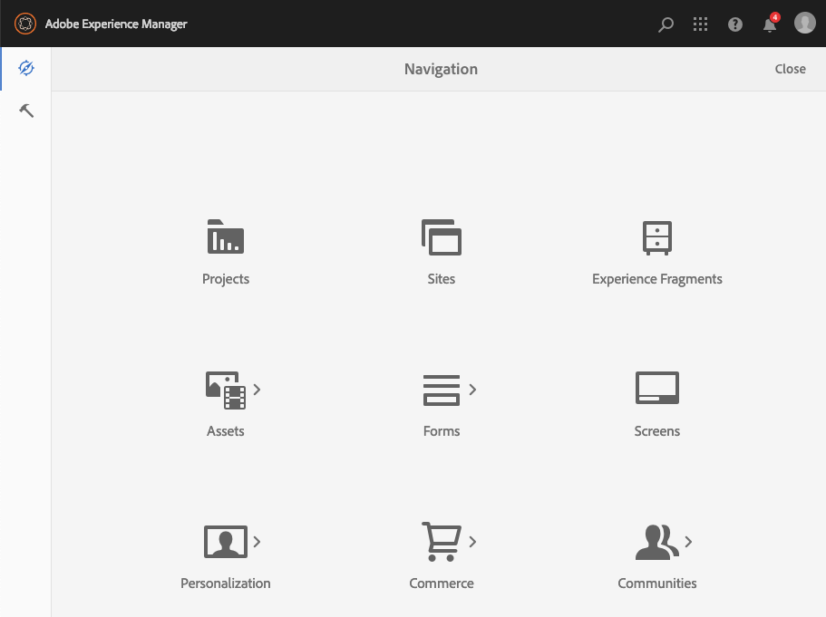
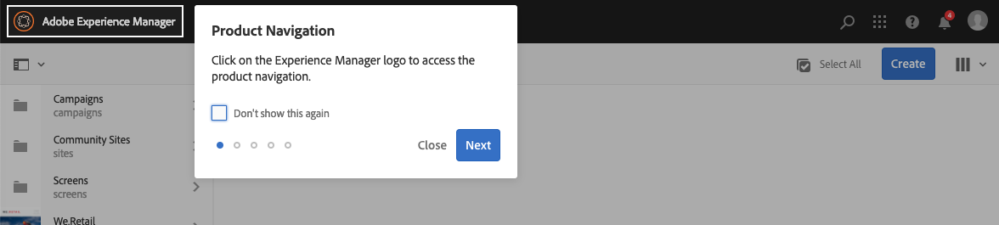
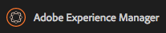
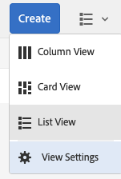
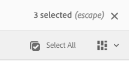

# Basisverwerking{#basic-handling}

>[!NOTE]
>
>* Deze pagina is ontworpen om een overzicht te geven van de basisverwerking bij gebruik van de Adobe Experience Manager (AEM) Author-omgeving. Het gebruikt de **console van Plaatsen** als basis.
>
>* Bepaalde functionaliteit is niet in alle consoles beschikbaar en in sommige consoles is mogelijk aanvullende functionaliteit beschikbaar. Specifieke informatie over de afzonderlijke consoles en de bijbehorende functionaliteit wordt meer in detail besproken op andere pagina&#39;s.
>* Sneltoetsen zijn beschikbaar in AEM. Met name wanneer [ het gebruiken consoles ](/help/sites-authoring/keyboard-shortcuts.md) en [ het uitgeven pagina&#39;s ](/help/sites-authoring/page-authoring-keyboard-shortcuts.md).
>

## Aan de slag {#getting-started}

### Een interface met aanraakbediening {#a-touch-enabled-ui}

De AEM-gebruikersinterface is ingeschakeld voor aanraking. Met een interface met aanraakbediening kunt u via aanraking met de software communiceren, bijvoorbeeld door middel van bewegingen voor selecteren, aanraken en vasthouden en vegen. Dit staat in contrast met de manier waarop een traditionele bureaubladinterface werkt met muishandelingen zoals klikken, dubbelklikken, met de rechtermuisknop klikken en mouseover.

Aangezien de gebruikersinterface van de AEM aanraakbediening is, kunt u de aanraakbewegingen op uw aanraakapparaten (bijvoorbeeld mobiel of tablet) en de muishandelingen op een traditioneel desktopapparaat gebruiken.

### Eerste stappen {#first-steps}

Onmiddellijk na het programma openen komt u op het [ paneel van de Navigatie ](#navigation-panel) aan. Als u een van de opties selecteert, wordt de desbetreffende console geopend.

>[!NOTE]
>
>Om een goed inzicht in het basisgebruik van AEM te krijgen, is dit document gebaseerd op de **console van Plaatsen**.
>
>Om te beginnen, klik op **Plaatsen**.

### Productnavigatie {#product-navigation}

Wanneer een gebruiker eerst tot een console toegang heeft, wordt een zelfstudie over productnavigatie gestart. Klik hier om een goed overzicht te krijgen van de basisafhandeling van AEM.

Klik **daarna** om naar de volgende pagina van het overzicht te gaan. Klik **dicht** of klik buiten de overzichtsdialoogdoos om te sluiten.

Het overzicht begint opnieuw de volgende tijd u tot een console toegang hebt tenzij u of alle dia&#39;s bekijkt, of de optie **controleert toont dit opnieuw**.

## Algemene navigatie {#global-navigation}

U kunt tussen de consoles navigeren met het algemene navigatievenster. Deze wordt geactiveerd als een vervolgkeuzelijst met volledig scherm wanneer u op de Adobe Experience Manager-koppeling linksboven in het scherm klikt.

U kunt het globale navigatievenster sluiten door te klikken of te tikken **dicht** om aan uw vorige plaats terug te keren.

>[!NOTE]
>
>Wanneer u eerste login u met het **paneel van de Navigatie** wordt voorgesteld

Globale navigatie heeft twee deelvensters, weergegeven door pictogrammen aan de linkermarge van het scherm:

* **[Navigatie](/help/sites-authoring/basic-handling.md#navigation-panel)** - vertegenwoordigd door een kompas
* **[Hulpmiddelen](/help/sites-authoring/basic-handling.md#tools-panel)** - vertegenwoordigd door een hamer

De opties in deze deelvensters worden hieronder beschreven.

### Deelvenster Navigatie {#navigation-panel}

Via het navigatievenster hebt u toegang tot de AEM-consoles:

De titel van het browsertabblad wordt bijgewerkt zodat deze uw locatie weerspiegelt terwijl u door de consoles en inhoud navigeert.

Vanuit Navigatie zijn de beschikbare consoles:

<table>
 <tbody>
  <tr>
   <td><strong>Console</strong></td>
   <td><strong>Doel</strong></td>
  </tr>
  <tr>
   <td>Assets  </td>
   <td>Deze consoles laten u invoeren en <a href="/help/assets/assets.md"> digitale activa </a> zoals beelden, video's, documenten, en audiodossiers beheren. Deze elementen kunnen vervolgens worden gebruikt door elke website die op hetzelfde AEM-exemplaar wordt uitgevoerd. </td>
  </tr>
  <tr>
   <td>Gemeenschappen</td>
   <td>Deze console laat u <a href="/help/communities/sites-console.md"> communautaire plaatsen </a> voor <a href="/help/communities/overview.md#engagement-community"> overeenkomst </a> en <a href="/help/communities/overview.md#enablement-community"> enablement </a> tot stand brengen en beheren.</td>
  </tr>
  <tr>
   <td>Commerce</td>
   <td>Dit laat u producten, productcatalogi, en orden met betrekking tot uw <a href="/help/commerce/cif-classic/administering/ecommerce.md"> Commerce </a> plaatsen beheren.</td>
  </tr>
  <tr>
   <td>Ervaar fragmenten</td>
   <td>Een <a href="/help/sites-authoring/experience-fragments.md"> Fragment van de Ervaring </a> is een stand-alone ervaring die over kanalen kan worden opnieuw gebruikt en variaties hebben, die het probleem van herhaaldelijk het kopiëren en het kleven ervaringen of delen van ervaringen sparen.</td>
  </tr>
  <tr>
   <td>Forms</td>
   <td>Deze console laat u, uw <a href="/help/forms/using/introduction-aem-forms.md"> vormen en documenten </a> creëren beheren en verwerken.</td>
  </tr>
  <tr>
   <td>Personalization</td>
   <td>Deze console verstrekt a <a href="/help/sites-authoring/personalization.md"> kader van hulpmiddelen om gerichte inhoud te ontwerpen en gepersonaliseerde ervaringen </a> voor te stellen.</td>
  </tr>
  <tr>
   <td>Projecten</td>
   <td>De <a href="/help/sites-authoring/touch-ui-managing-projects.md"> console van Projecten geeft u directe toegang tot uw projecten </a>. Projecten zijn virtuele dashboards. Zij kunnen worden gebruikt om een team te bouwen, dan dat teamtoegang tot middelen, werkschema's, en taken te geven, toestaand mensen om aan een gemeenschappelijk doel te werken.   </td>
  </tr>
  <tr>
   <td>Screens</td>
   <td><a href="https://experienceleague.adobe.com/docs/experience-manager-screens/user-guide/authoring/setting-up-projects/creating-a-screens-project.html?lang=nl-NL"> Screens </a> laat u al uw klant-onder ogen ziet schermen, van om het even welke grootte en in om het even welke plaats beheren.</td>
  </tr>
  <tr>
   <td>Sites</td>
   <td>De consoles van Plaatsen laten u <a href="/help/sites-authoring/page-authoring.md"> websites </a> creëren, bekijken en beheren die op uw instantie van AEM lopen. Via deze consoles kunt u websitepagina's maken, bewerken, kopiëren, verplaatsen en verwijderen, workflows starten en pagina's publiceren.  </td>
  </tr>
 </tbody>
</table>

### Deelvenster Gereedschappen {#tools-panel}

In het deelvenster Gereedschappen bevat elke optie in het zijpaneel een reeks submenu&#39;s. De [ consoles van Hulpmiddelen ](/help/sites-administering/tools-consoles.md) beschikbaar hier verleent toegang tot verscheidene gespecialiseerde hulpmiddelen en consoles die u helpen uw websites, digitale activa, en andere aspecten van uw inhoudsbewaarplaats beheren.

## De koptekst {#the-header}

De koptekst staat altijd boven aan het scherm. Hoewel de meeste opties in de koptekst ongewijzigd blijven, ongeacht waar u zich in het systeem bevindt, zijn sommige contextspecifiek.

* [Algemene navigatie](#navigatingconsolesandtools)

  Selecteer de **verbinding van Adobe Experience Manager** waar u tussen consoles kunt navigeren.

  

* [Zoeken](/help/sites-authoring/search.md)

  

  U kunt de [ kortere wegsleutel ](/help/sites-authoring/keyboard-shortcuts.md) `/` (voorwaartse schuine streep) ook gebruiken om onderzoek van om het even welke console aan te halen.

* [ Oplossingen ](https://business.adobe.com/)

  

* [Help](#accessinghelptouchoptimizedui)

  

* [Meldingen](/help/sites-authoring/inbox.md)

  

  Dit pictogram is gemarkeerd met het aantal momenteel toegewezen onvolledige berichten.

  >[!NOTE]
  >
  >AEM wordt vooraf geladen met beheertaken die zijn toegewezen aan de beheerdersgebruikersgroep. Zie [ Uw Inbox - uit-van-de-doos Administratieve Taken ](/help/sites-authoring/inbox.md#out-of-the-box-administrative-tasks) voor details.

* [Gebruikerseigenschappen](/help/sites-authoring/user-properties.md)

  

* [Spoorwegkiezer](/help/sites-authoring/basic-handling.md#rail-selector)

  

  Welke opties worden weergegeven, is afhankelijk van uw huidige console. Bijvoorbeeld, in **Plaatsen** kunt u inhoud slechts selecteren (het gebrek), de chronologie, verwijzingen, of het paneel van de filterkant.

  

* Broodkruimels

  

  Wordt in het midden van de spoorstaaf weergegeven en geeft altijd de beschrijving van het geselecteerde item weer. Met de broodkruimels kunt u navigeren binnen een specifieke console. In de console van Plaatsen, kunt u door de niveaus van uw website navigeren.

  Als u op de tekst van de broodkruimel klikt, wordt een vervolgkeuzelijst geopend met de niveaus van de hiërarchie van het geselecteerde item. Klik op een item om naar die locatie te gaan.

  

* Selectie van analysetijdsperiode

  

  Dit is alleen beschikbaar in de lijstweergave. Voor meer informatie, zie de [ lijstmening ](#list-view).

* **creeer** knoop

  

  Zodra geklikt, zijn de getoonde opties aangewezen aan de console/de context.

* [Weergaven](/help/sites-authoring/basic-handling.md#viewingandselectingyourresourcescardlistcolumn)

  Het weergavepictogram bevindt zich helemaal rechts van de werkbalk van AEM. De huidige weergave wordt ook gewijzigd. Bijvoorbeeld, in de standaardmening, **Mening van de Kolom** het toont:

  

  U kunt schakelen tussen de kolomweergave, de kaartweergave en de lijstweergave. In de lijstweergave worden de weergave-instellingen weergegeven.

  

* Toetsenbordnavigatie

  U kunt alleen met het toetsenbord door een website navigeren. Dit gebruikt de standaardbrowser functionaliteit van **TAB** sleutel (of **OPT+TAB**) om u tussen elementen op de pagina te bewegen die ** brandbaar zijn.

  In de **console van Plaatsen**, is er de toegevoegde optie aan **Overslaan aan belangrijkste inhoud**. Dit wordt zichtbaar aangezien u *lusje* door de kopbalopties, en versnelt uw navigatie door u toe te staan om de standaardelementen in de (product) toolbar over te slaan en u rechtstreeks aan de belangrijkste inhoud te nemen.

  

## Toegang tot Help {#accessing-help}

Er zijn verschillende beschikbare Help-bronnen:

* **Toolbar van de Console**

  Afhankelijk van uw plaats, opent het **pictogram van de Hulp** de aangewezen middelen:

  

* **Navigatie**

  De eerste keer u het systeem navigeert, [ een reeks dia&#39;s introduceert de navigatie van AEM ](/help/sites-authoring/basic-handling.md#product-navigation).

* **Redacteur van de Pagina**

  De eerste keer dat u een pagina bewerkt, introduceert een reeks dia&#39;s de pagina-editor.

  

  Navigeer dit overzicht aangezien u het [ overzicht van de productnavigatie ](/help/sites-authoring/basic-handling.md#product-navigation) wanneer eerst de toegang tot van om het even welke console.

  Van het **menu van de Informatie van de Pagina**, kunt u [**Hulp**](/help/sites-authoring/author-environment-tools.md#accessing-help) selecteren om dit op elk ogenblik opnieuw te tonen.

* **Console van Hulpmiddelen**

  Van de **console van Hulpmiddelen**, kunt u tot de externe **Middelen** ook toegang hebben:

   * **Documentatie**
De documentatie van het Web Experience Management weergeven

   * **Middelen van de Ontwikkelaar**
Bronnen en downloads voor ontwikkelaars

  >[!NOTE]
  >
  >U hebt toegang tot een overzicht van sneltoetsen die op elk gewenst moment beschikbaar zijn via de sneltoets `?` (vraagteken) in een console.
  >
  >Raadpleeg de volgende secties voor een overzicht van alle sneltoetsen:
  >
  >* [ kortere weg van het Toetsenbord voor het uitgeven van pagina&#39;s ](/help/sites-authoring/page-authoring-keyboard-shortcuts.md)
  >* [ kortere weg van het Toetsenbord voor consoles ](/help/sites-authoring/keyboard-shortcuts.md)

## Werkbalk Handelingen {#actions-toolbar}

Wanneer een bron wordt geselecteerd (bijvoorbeeld een pagina of een element), worden verschillende handelingen aangegeven met pictogrammen met een uitleg op de werkbalk. Deze acties zijn afhankelijk van:

* De huidige console
* De huidige context
* Als u op [ selectiemodus ](#navigatingandselectionmode) of niet bent

De acties die beschikbaar zijn op de werkbalk, veranderen in overeenstemming met de acties die u kunt uitvoeren op de specifieke geselecteerde items.

Hoe u [ selecteert een middel ](/help/sites-authoring/basic-handling.md#viewing-and-selecting-resources) van de mening afhangt.

Vanwege de ruimtebeperkingen in sommige vensters kan de werkbalk snel langer worden dan de beschikbare ruimte. Als dit gebeurt, worden extra opties weergegeven. Als u op de ellips klikt of erop tikt (de drie stippen of **...** ), wordt een vervolgkeuzelijst geopend waarin alle resterende handelingen staan. Nadat u bijvoorbeeld een pagina hebt geselecteerd in de **Sites**-console:

>[!NOTE]
>
>De afzonderlijke beschikbare pictogrammen worden gedocumenteerd met betrekking tot de juiste console/functie/scenario.

## Snelle handelingen {#quick-actions}

In [ Mening van de Kaart ](#cardviewquickactions), zijn bepaalde acties beschikbaar als snelle actiepictogrammen en op de toolbar. Er zijn snelactiepictogrammen beschikbaar voor één item tegelijk, zodat u geen voorselectie hoeft te maken.

De snelle acties zijn zichtbaar wanneer u de muis boven (desktopapparaat) een bronkaart houdt. De snelle beschikbare acties kunnen van de console en de context afhangen. Bijvoorbeeld, zijn hier de snelle acties voor een pagina in de **console van Plaatsen**:

## Bronnen weergeven en selecteren {#viewing-and-selecting-resources}

Het bekijken, navigeren, en het selecteren zijn elk conceptueel het zelfde over alle meningen, maar hebben kleine variaties in behandeling, afhankelijk van de mening u gebruikt.

U kunt uw bronnen weergeven, doorbladeren en selecteren (voor verdere actie) met een van de beschikbare weergaven. Elk van deze weergaven kan worden geselecteerd met het pictogram rechtsboven:

* [Kolomweergave](#column-view)
* [Kaartweergave](#card-view)

* [Lijstweergave](#list-view)

>[!NOTE]
>
>Standaard worden in AEM Assets de oorspronkelijke uitvoeringen van elementen in de gebruikersinterface niet als miniaturen weergegeven in een van de weergaven. Beheerders kunnen met overlays de oorspronkelijke uitvoeringen als miniaturen weergeven.

### Bronnen selecteren {#selecting-resources}

Het selecteren van een specifieke bron hangt af van een combinatie van de weergave en het apparaat:

<table>
 <tbody>
  <tr>
   <td> </td>
   <td>Selecteren</td>
   <td>Selectie opheffen</td>
  </tr>
  <tr>
   <td>Kolomweergave   </td>
   <td>
    <ul>
     <li>Desktop:  klik de duimnagel</li>
     <li>Mobiele apparaten:  selecteer de miniatuur</li>
    </ul> </td>
   <td>
    <ul>
     <li>Desktop:  klik de duimnagel</li>
     <li>Mobiele apparaten:  selecteer de miniatuur</li>
    </ul> </td>
  </tr>
  <tr>
   <td>Kaartweergave   </td>
   <td>
    <ul>
     <li>Desktop:  MouseOver, dan gebruik de controlemarkering snelle actie</li>
     <li>Mobiele apparaten:  Selecteer de kaart en houd deze ingedrukt</li>
    </ul> </td>
   <td>
    <ul>
     <li>Desktop:  klik de kaart</li>
     <li>Mobiele apparaten:  selecteer de kaart</li>
    </ul> </td>
  </tr>
  <tr>
   <td>Lijstweergave</td>
   <td>
    <ul>
     <li>Desktop:  klik de duimnagel</li>
     <li>Mobiele apparaten:  selecteer de miniatuur</li>
    </ul> </td>
   <td>
    <ul>
     <li>Desktop:  klik de duimnagel</li>
     <li>Mobiele apparaten:  selecteer de miniatuur</li>
    </ul> </td>
  </tr>
 </tbody>
</table>

#### Alles selecteren {#select-all}

U kunt alle punten in om het even welke mening selecteren door de **Uitgezochte Al** optie bij de hoogste juiste hoek van de console te klikken.

* In **Mening van de Kaart**, worden alle kaarten geselecteerd.
* In **Mening van de Lijst**, worden alle punten in de lijst geselecteerd.
* In **Mening van de Kolom**, worden alle punten in de uiterst linkse kolom geselecteerd.

#### Alle selecties opheffen {#deselecting-all}

In alle gevallen waarin u items selecteert, wordt het aantal geselecteerde items rechtsboven op de werkbalk weergegeven.

U kunt alle items deselecteren en de selectiemodus afsluiten door:

* het klikken of het tikken van **X** naast de telling,

* of het gebruiken van **ontsnapping**.

In alle weergaven kunt u de selectie van alle items opheffen door op escape op het toetsenbord te tikken als u een bureaubladapparaat gebruikt.

#### Voorbeeld selecteren {#selecting-example}

1. In de kaartweergave bijvoorbeeld:

   

1. Wanneer u een middel hebt geselecteerd, wordt de hoogste kopbal behandeld door de [ actiestoolbar ](#actionstoolbar) die toegang tot acties verleent momenteel toepasselijk op het geselecteerde middel.

   Om selectiemodus weg te gaan, selecteer **X** aan top-right, of gebruik **ontsnapping**.

### Kolomweergave {#column-view}

In de kolomweergave kunt u een visuele navigatie van een inhoudsstructuur uitvoeren door een reeks trapsgewijze kolommen. Met deze weergave kunt u de boomstructuur van uw website visualiseren en doorlopen.

Als u een bron selecteert in de kolom uiterst links, worden de onderliggende bronnen weergegeven in een kolom aan de rechterkant. Als u een bron in de rechterkolom selecteert, worden de onderliggende bronnen in een andere kolom rechts weergegeven, enzovoort.

* U kunt omhoog en omlaag navigeren in de boom door op de middelnaam of de chevron rechts van de middelnaam te tikken of te klikken.

   * De naam en het chevron van de bron worden gemarkeerd wanneer u hierop tikt of erop klikt.

     

   * De kinderen van het geklikte/geplakte middel worden getoond in de kolom rechts van het aangeklikte/geplakte middel.
   * Als u een middelnaam klikt die geen kinderen heeft, worden zijn details getoond in de definitieve kolom.

* Als u op de miniatuur tikt of erop klikt, wordt de bron geselecteerd.

   * Als deze optie is geselecteerd, wordt een vinkje op de miniatuur geplaatst en wordt de naam van de bron ook gemarkeerd.
   * De details van de geselecteerde bron worden weergegeven in de laatste kolom.
   * De werkbalk Handeling wordt beschikbaar.

     

  Wanneer een pagina wordt geselecteerd in kolomweergave, wordt de geselecteerde pagina samen met de volgende details weergegeven in de laatste kolom:

   * Paginatitel
   * Paginanaam (onderdeel van de URL van de pagina)
   * Sjabloon waarop de pagina is gebaseerd
   * Wijzigingsdetails
   * Paginataal
   * Publicatiedetails

### Kaartweergave {#card-view}

* In de kaartweergave worden voor elk item op het huidige niveau informatiekaarten weergegeven. Deze bevatten informatie zoals:

   * Een visuele weergave van de pagina-inhoud.
   * De paginatitel.
   * Belangrijke datums (zoals laatst bewerkt, laatst gepubliceerd).
   * De pagina is vergrendeld, verborgen of maakt deel uit van een live kopie.
   * Indien van toepassing, wanneer u actie moet ondernemen als onderdeel van een workflow.

      * De tellers die op vereiste acties wijzen kunnen met ingangen in uw [ Inbox ](/help/sites-authoring/inbox.md) verwant zijn.

* [ Snelle acties ](#quick-actions) zijn ook beschikbaar in deze mening zoals selectie en gemeenschappelijke acties zoals uitgeven.

  

* U kunt onderaan de boom navigeren door op kaarten te tikken/te klikken (die zorg nemen om de snelle acties te vermijden) of omhoog opnieuw door [ broodkruimels in de kopbal ](/help/sites-authoring/basic-handling.md#the-header) te gebruiken.

### Lijstweergave {#list-view}

* De lijstmening maakt een lijst van informatie voor elke middel op het huidige niveau.
* U kunt neer door de boom navigeren door te tikken/op de middelnaam en steun te klikken door [ broodkruimels in de kopbal ](/help/sites-authoring/basic-handling.md#the-header) te gebruiken.

* Als u alle items in de lijst gemakkelijk wilt selecteren, gebruikt u het selectievakje linksboven in de lijst.

  

   * Wanneer alle items in de lijst zijn geselecteerd, wordt dit selectievakje ingeschakeld.

      * Klik op het selectievakje om de selectie van alles op te heffen.

   * Wanneer slechts enkele punten worden geselecteerd, verschijnt het met een minteken.

      * Klik op het selectievakje om alles te selecteren.
      * Klik nogmaals op het selectievakje om de selectie van alles op te heffen.

* Selecteer de kolommen die moeten worden getoond gebruikend de **optie van de Montages van de Mening** onder de knoop van Meningen wordt gevestigd. De volgende kolommen zijn beschikbaar voor weergave:

   * **Naam** - de naam van de Pagina, die in een meertalig auteursmilieu nuttig kan zijn aangezien het deel van URL van de pagina uitmaakt en niet ongeacht taal verandert
   * **Gewijzigd** - Laatste gewijzigde datum en laatst gewijzigd door gebruiker
   * **Gepubliceerd** - de status van de Publicatie
   * **Malplaatje** - Malplaatje waarop de pagina gebaseerd is
   * **Werkschema** - Werkschema momenteel toegepast op de pagina. Er is meer informatie beschikbaar wanneer u de muis boven de tijdlijn houdt of deze opent.

   * **Analytics van de Pagina**
   * **Unieke bezoekers**
   * **Tijd op pagina**

  

  Door gebrek wordt de **kolom van de Naam** getoond, die omhoog een deel van URL voor de pagina maakt. Soms moet de auteur pagina&#39;s openen die in een andere taal zijn. Het kan nuttig zijn de naam van de pagina (die gewoonlijk onveranderlijk is) te zien als de auteur de taal van de pagina niet kent.

* Wijzig de volgorde van de items met de gestippelde verticale balk helemaal rechts van elk item in de lijst.

  >[!NOTE]
  >
  >Het wijzigen van de volgorde werkt alleen in een geordende map met de waarde `jcr:primaryType` als `sling:OrderedFolder` .

  

  Klik op de verticale selectiebalk en sleep het item naar een nieuwe positie in de lijst.

  

* U kunt de Gegevens van de Analyse tonen door de aangewezen kolommen te tonen gebruikend het **de dialoogvakje van de Montages van de Mening**.

  Met de filteropties aan de rechterkant van de koptekst kunt u de analysegegevens voor de afgelopen 30, 90 of 365 dagen filteren.

  

## Spoorwegkiezer {#rail-selector}

**de Selector van het Spoorspoor** is beschikbaar bij top-left van het venster en toont opties afhankelijk van uw huidige consoles.

U kunt bijvoorbeeld in Sites alleen inhoud (de standaardinstelling), de inhoudsstructuur, de tijdlijn, verwijzingen of het filterzijpaneel selecteren.

Als alleen inhoud wordt geselecteerd, wordt alleen het pictogram van de spoorstaaf weergegeven. Als er een andere optie is geselecteerd, wordt de naam van de optie weergegeven naast het pictogram van de track.

>[!NOTE]
>
>[ de kortere weg van het Toetsenbord ](/help/sites-authoring/keyboard-shortcuts.md) is beschikbaar om tussen spoorvertoningsopties snel te schakelen.

### Inhoudsstructuur {#content-tree}

Met de inhoudsstructuur kunt u snel door de sitehiërarchie in het zijpaneel navigeren en veel informatie over de pagina&#39;s in de huidige map bekijken.

Met het zijpaneel van de inhoudsboomstructuur met een lijstmening of kaartmening, kunnen de gebruikers de hiërarchische structuur van het project gemakkelijk zien. Ze kunnen gemakkelijk door de inhoudsstructuur navigeren met het zijpaneel van de inhoudsstructuur en gedetailleerde pagina-informatie weergeven in de lijstweergave.

>[!NOTE]
>
>Wanneer een item in de hiërarchische weergave is geselecteerd, kunt u met de pijltoetsen snel door de hiërarchie navigeren.
>
>Verwijs naar de [ toetsenbordkortere weg ](/help/sites-authoring/keyboard-shortcuts.md) voor meer informatie.

### Tijdlijn {#timeline}

De tijdlijn kan worden gebruikt om gebeurtenissen te bekijken en/of te initiëren die op de geselecteerde bron zijn voorgekomen. U opent de tijdlijnkolom met de railkiezer:

In de tijdlijnkolom kunt u:

* [ Mening diverse gebeurtenissen ](#timelineviewevents) met betrekking tot een geselecteerd punt.

   * U kunt de gebeurtenistypen selecteren in de vervolgkeuzelijst:

      * [Opmerkingen](#timelineaddingandviewingcomments)
      * Annotaties
      * Activiteiten
      * [Lanceringen](/help/sites-authoring/launches.md)
      * [Versies](/help/sites-authoring/working-with-page-versions.md)
      * [Workflows](/help/sites-authoring/workflows-applying.md)

         * behalve [ voorbijgaande werkschema&#39;s ](/help/sites-developing/workflows.md#transient-workflows) omdat geen geschiedenisinformatie voor deze wordt bewaard

      * en Alles tonen

* [ voeg/meningscommentaren ](#timelineaddingandviewingcomments) over het geselecteerde punt toe. Het vak **Opmerking** wordt onder aan de lijst met gebeurtenissen weergegeven. Door een opmerking te typen die wordt gevolgd door Return, wordt de opmerking geregistreerd. Deze wordt weergegeven wanneer **Opmerkingen** of **Alles weergeven** is geselecteerd.

* Specifieke consoles hebben extra functionaliteit. In de Sites-console kunt u bijvoorbeeld het volgende doen:

   * [ sparen een versie ](/help/sites-authoring/working-with-page-versions.md#creatinganewversiontouchoptimizedui).
   * [ Begin een werkschema ](/help/sites-authoring/workflows-applying.md#startingaworkflowfromtherail).

Deze opties zijn toegankelijk als chevron naast het **gebied van de Commentaar**.

### Verwijzingen {#references}

**Verwijzingen** tonen verbindingen aan het geselecteerde middel. Bijvoorbeeld, in de **console** verwijzingen [ van de Plaatsen ](/help/sites-authoring/author-environment-tools.md#showingpagereferences) &lbrace;voor pagina&#39;s toont:

* [Blauwdrukken](/help/sites-administering/msm.md)
* [Lanceringen](/help/sites-authoring/launches.md#launches-in-references-sites-console)
* [Live kopieën](/help/sites-administering/msm-livecopy-overview.md#openingthelivecopyoverviewfromreferences)
* [Taalkopieën](/help/sites-administering/tc-prep.md#seeing-the-status-of-language-roots)
* Content references:

   * Directe koppelingen van andere pagina&#39;s naar de geselecteerde pagina
   * Inhoud die door de component Reference is geleend van, geleend aan of beide op de geselecteerde pagina

### Filter {#filter}

Dit opent een paneel gelijkend op [ onderzoek ](/help/sites-authoring/search.md), met de aangewezen geplaatste plaatsfilters, toestaand u om de inhoud verder te filtreren u wenst om te bekijken.

