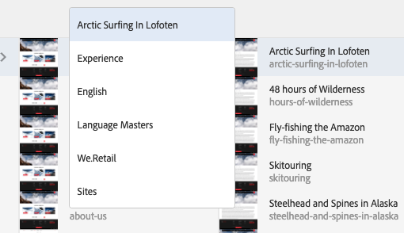
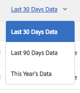

# Basisbewerkingen{#basic-handling}

>[!NOTE]
>
>* Deze pagina is ontworpen om een overzicht van basisbehandeling te geven wanneer het gebruiken van het AEM auteursmilieu. Het gebruikt de **Sites** console als basis.
>
>* Bepaalde functionaliteit is niet in alle consoles beschikbaar en in sommige consoles is mogelijk aanvullende functionaliteit beschikbaar. Specifieke informatie over de afzonderlijke consoles en de bijbehorende functionaliteit zal op andere pagina&#39;s nader worden besproken.
>* Sneltoetsen zijn beschikbaar in alle AEM. Met name wanneer [consoles gebruiken](/help/sites-authoring/keyboard-shortcuts.md) en [pagina&#39;s bewerken](/help/sites-authoring/page-authoring-keyboard-shortcuts.md).
>

## Aan de slag {#getting-started}

### Een interface met aanraakbediening {#a-touch-enabled-ui}

AEM gebruikersinterface is ingeschakeld voor aanraking. Met een interface met aanraakbediening kunt u aanrakingen gebruiken om met de software te communiceren via bewegingen zoals tikken, aanraken en vasthouden en vegen. Dit staat in contrast met de manier waarop een traditionele bureaubladinterface werkt met muishandelingen zoals klikken, dubbelklikken, met de rechtermuisknop klikken en mouseover.

Aangezien de AEM UI aanraking-toegelaten is, kunt u de aanrakingsgebaren op uw aanrakingsapparaten (bijvoorbeeld, mobiel of tablet) en de muisacties op een traditioneel Desktopapparaat gebruiken.

### Eerste stappen {#first-steps}

Onmiddellijk nadat u zich hebt aangemeld, arriveert u op de [Navigatievenster](#navigation-panel). Als u een van de opties selecteert, wordt de desbetreffende console geopend.

>[!NOTE]
>
>Om een goed inzicht te krijgen in het basisgebruik van AEM, is dit document gebaseerd op de **Sites** console.
>
>Klik of tik op **Sites** om aan de slag te gaan.

### Productnavigatie {#product-navigation}

Wanneer een gebruiker eerst tot een console toegang heeft, wordt een zelfstudie over productnavigatie gestart. Neem een minuut om te klikken of door te tikken voor een goed overzicht van de basisbehandeling van AEM.

Klikken of tikken **Volgende** om naar de volgende pagina van het overzicht te gaan. Klikken of tikken **Sluiten** of klik of tik buiten het overzichtsdialoogvenster om te sluiten.

Het overzicht zal de volgende keer opnieuw beginnen u tot een console toegang hebt tenzij u of alle dia&#39;s bekijkt of de optie controleert **Dit niet meer weergeven**.

## Algemene navigatie {#global-navigation}

U kunt tussen de consoles navigeren met het algemene navigatievenster. Dit wordt geactiveerd als een vervolgkeuzelijst met volledig scherm wanneer u op de Adobe Experience Manager-koppeling klikt of tikt linksboven in het scherm.

U kunt het globale navigatievenster sluiten door te klikken of te tikken **Sluiten** om terug te keren naar uw vorige locatie.

>[!NOTE]
>
>Wanneer u zich voor het eerst aanmeldt, hebt u de **Navigatie** deelvenster.

Globale navigatie heeft twee deelvensters, weergegeven door pictogrammen aan de linkermarge van het scherm:

* **[Navigatie](/help/sites-authoring/basic-handling.md#navigation-panel)** - Vertegenwoordigd door een kompas
* **[Gereedschappen](/help/sites-authoring/basic-handling.md#tools-panel)** - Vertegenwoordigd door een hamer

De opties in deze deelvensters worden hieronder beschreven.

### Deelvenster Navigatie {#navigation-panel}

Het navigatievenster biedt toegang tot de AEM consoles:

De titel van het browsertabblad wordt aangepast aan uw locatie wanneer u door de consoles en inhoud navigeert.

Vanuit Navigatie zijn de beschikbare consoles:

<table>
 <tbody>
  <tr>
   <td><strong>Console</strong></td>
   <td><strong>Doel</strong></td>
  </tr>
  <tr>
   <td>Assets  </td>
   <td>Met deze consoles kunt u importeren en <a href="/help/assets/home.md">digitale middelen beheren</a> zoals afbeeldingen, video's, documenten en audiobestanden. Deze elementen kunnen vervolgens worden gebruikt door elke website die op hetzelfde AEM wordt uitgevoerd. </td>
  </tr>
  <tr>
   <td>Gemeenschappen</td>
   <td>Met deze console kunt u bestanden maken en beheren <a href="/help/communities/sites-console.md">communitysites</a> for <a href="/help/communities/overview.md#engagement-community">betrokkenheid</a> en <a href="/help/communities/overview.md#enablement-community">inschakelen</a>.</td>
  </tr>
  <tr>
   <td>Handel</td>
   <td>Hierdoor kunt u producten, productcatalogi en bestellingen beheren die gerelateerd zijn aan uw <a href="/help/commerce/cif-classic/administering/ecommerce.md">Handel</a> sites.</td>
  </tr>
  <tr>
   <td>Ervaringsfragmenten</td>
   <td>An <a href="/help/sites-authoring/experience-fragments.md">ervaren, fragment</a> is een stand-alone ervaring die kan worden hergebruikt over kanalen en variaties hebben, die het probleem van het herhaaldelijk kopiëren en het kleven ervaringen of delen van ervaringen bespaart.</td>
  </tr>
  <tr>
   <td>Forms</td>
   <td>Met deze console kunt u uw <a href="/help/forms/home.md">formulieren en documenten</a>.</td>
  </tr>
  <tr>
   <td>Personalisatie</td>
   <td>Deze console biedt een <a href="/help/sites-authoring/personalization.md">kader van instrumenten voor het ontwerpen van gerichte inhoud en het presenteren van gepersonaliseerde ervaringen</a>.</td>
  </tr>
  <tr>
   <td>Projecten</td>
   <td>De <a href="/help/sites-authoring/touch-ui-managing-projects.md">De console van projecten geeft u directe toegang tot uw projecten</a>. Projecten zijn virtuele dashboards. Zij kunnen worden gebruikt om een team te bouwen, dan dat teamtoegang tot middelen, werkschema's en taken te geven, die mensen toestaan om aan een gemeenschappelijk doel te werken.   </td>
  </tr>
  <tr>
   <td>Schermen</td>
   <td><a href="https://experienceleague.adobe.com/docs/experience-manager-screens/user-guide/authoring/setting-up-projects/creating-a-screens-project.html">Schermen</a> Hiermee kunt u al uw klantgerichte schermen, van elke grootte en op elke locatie beheren.</td>
  </tr>
  <tr>
   <td>Sites</td>
   <td>Met de siteconsoles kunt u <a href="/help/sites-authoring/page-authoring.md">websites maken, weergeven en beheren</a> uitvoeren op uw AEM. Via deze consoles kunt u websitepagina's maken, bewerken, kopiëren, verplaatsen en verwijderen, workflows starten en pagina's publiceren.  </td>
  </tr>
 </tbody>
</table>

### Deelvenster Gereedschappen {#tools-panel}

In het deelvenster Gereedschappen bevat elke optie in het zijpaneel een reeks submenu&#39;s. De [Gereedschapsconsoles](/help/sites-administering/tools-consoles.md) Hier beschikbaar biedt u toegang tot een aantal gespecialiseerde gereedschappen en consoles die u helpen uw websites, digitale middelen en andere aspecten van de opslagplaats voor inhoud te beheren.

## De koptekst {#the-header}

De koptekst staat altijd boven aan het scherm. Hoewel de meeste opties in de koptekst ongewijzigd blijven, ongeacht waar u zich in het systeem bevindt, zijn sommige contextspecifiek.

* [Algemene navigatie](#navigatingconsolesandtools)

   Selecteer **Adobe Experience Manager** koppeling om tussen consoles te navigeren.

   

* [Zoeken](/help/sites-authoring/search.md)

   

   U kunt ook de opdracht [sneltoets](/help/sites-authoring/keyboard-shortcuts.md) `/` (forward slash) om het zoeken vanuit elke console aan te roepen.

* [Oplossingen](https://www.adobe.com/experience-cloud.html)

   

* [Help](#accessinghelptouchoptimizedui)

   

* [Meldingen](/help/sites-authoring/inbox.md)

   

   Dit pictogram wordt gemarkeerd met het aantal momenteel toegewezen onvolledige meldingen.

   >[!NOTE]
   >
   >Uit-van-de-doos AEM wordt voorgeladen met administratieve taken die aan de groep van de beheerdergebruiker worden toegewezen. Zie [Uw Postvak In - uit-de-Box Administratieve Taken](/help/sites-authoring/inbox.md#out-of-the-box-administrative-tasks) voor meer informatie.

* [Gebruikerseigenschappen](/help/sites-authoring/user-properties.md)

   

* [Spoorwegkiezer](/help/sites-authoring/basic-handling.md#rail-selector)

   

   Welke opties worden weergegeven, is afhankelijk van uw huidige console. Bijvoorbeeld in **Sites** u kunt alleen inhoud (standaard), de tijdlijn, verwijzingen of het filterzijpaneel selecteren.

   

* Broodkruimels

   

   In het midden van de spoorstaaf, en altijd tonend de beschrijving van het momenteel geselecteerde punt, staan de broodkruimels u toe om binnen een specifieke console te navigeren. In de console van Plaatsen, kunt u door de niveaus van uw website navigeren.

   Klik gewoon op de tekst van de broodkruimel om een vervolgkeuzelijst weer te geven met de niveaus van de hiërarchie van het momenteel geselecteerde item. Klik op een bericht om naar die locatie te gaan.

   

* Selectie van analysetijdsperiode

   

   Dit is alleen beschikbaar in de lijstweergave. Zie [lijstweergave](#list-view) voor meer informatie .

* **Maken** knop

   

   Zodra geklikt, zijn de getoonde opties aangewezen aan de console/de context.

* [Weergaven](/help/sites-authoring/basic-handling.md#viewingandselectingyourresourcescardlistcolumn)

   Het weergavepictogram bevindt zich helemaal rechts van de AEM werkbalk. De huidige weergave wordt ook gewijzigd. In de standaardweergave bijvoorbeeld **Kolomweergave** het laat zien :

   

   U kunt schakelen tussen de kolomweergave, de kaartweergave en de lijstweergave. in de lijstweergave worden ook de weergave-instellingen weergegeven.

   

* Toetsenbordnavigatie

   U kunt alleen met het toetsenbord door een website navigeren. Hierbij wordt de standaardbrowserfunctionaliteit van het **TAB** toets (of **OPT+TAB**) om u te verplaatsen tussen elementen op de pagina die *scherp*.

   In de **Sites** console daar is de toegevoegde optie aan  **Overslaan naar hoofdinhoud**. Dit wordt zichtbaar als u *tab* door de kopbalopties, en versnelt uw navigatie door u toe te staan om de standaardelementen in de (product) toolbar over te slaan en u rechtstreeks aan de belangrijkste inhoud te nemen.

   

## Toegang tot Help {#accessing-help}

Er zijn verschillende beschikbare Help-bronnen:

* **Console, werkbalk**

   Afhankelijk van uw locatie **Help** het pictogram zal de aangewezen middelen openen:

   

* **Navigatie**

   De eerste keer dat u door het systeem navigeert, [een reeks dia&#39;s introduceert AEM navigatie](/help/sites-authoring/basic-handling.md#product-navigation).

* **Pagina-editor**

   De eerste keer dat u een pagina bewerkt, introduceert een reeks dia&#39;s de pagina-editor.

   

   Navigeren in dit overzicht zoals u [overzicht van productnavigatie](/help/sites-authoring/basic-handling.md#product-navigation) wanneer eerst het openen van om het even welke console.

   Van de [**Pagina-informatie** menu dat u kunt selecteren **Help**](/help/sites-authoring/author-environment-tools.md#accessing-help) om dit op elk moment weer te tonen.

* **Tools Console**

   Van de **Gereedschappen** console u tot de externe **Bronnen**:

   * **Documentatie**
De documentatie van het Web Experience Management weergeven

   * **Bronnen voor ontwikkelaars**
Bronnen en downloads voor ontwikkelaars
   >[!NOTE]
   >
   >Met de sneltoets hebt u op elk gewenst moment toegang tot een overzicht van de beschikbare sneltoetsen `?` (vraagteken) wanneer in een console.
   >
   >Raadpleeg de volgende documentatie voor een overzicht van alle sneltoetsen:
   >
   >    * [Sneltoetsen voor het bewerken van pagina&#39;s](/help/sites-authoring/page-authoring-keyboard-shortcuts.md)
   >    * [Sneltoetsen voor consoles](/help/sites-authoring/keyboard-shortcuts.md)

## Werkbalk Handelingen {#actions-toolbar}

Wanneer een bron wordt geselecteerd (bijvoorbeeld een pagina of een element), worden verschillende handelingen aangegeven met pictogrammen met een verklarende tekst op de werkbalk. Deze acties zijn afhankelijk van:

* De huidige console.
* De huidige context.
* Of u nu [selectiemodus](#navigatingandselectionmode).

De actie die beschikbaar is op de werkbalk, wijzigt in de richting van de acties die u kunt uitvoeren op de specifieke geselecteerde items.

Hoe u [een bron selecteren](/help/sites-authoring/basic-handling.md#viewing-and-selecting-resources) is afhankelijk van de weergave.

Vanwege de ruimtebeperkingen in sommige vensters kan de werkbalk snel langer worden dan de beschikbare ruimte. Als dit gebeurt, worden er extra opties weergegeven. Als u op het beletselteken (de drie stippen of **...**) klikt of tikt, wordt een vervolgkeuzelijst geopend met alle resterende acties. Nadat u bijvoorbeeld een pagina hebt geselecteerd in de **Sites**-console:

>[!NOTE]
>
>De afzonderlijke beschikbare pictogrammen worden gedocumenteerd met betrekking tot de juiste console/functie/scenario.

## Snelle handelingen {#quick-actions}

In [Kaartweergave](#cardviewquickactions) bepaalde acties zijn beschikbaar als snelactiepictogrammen en op de werkbalk. Er zijn snelactiepictogrammen beschikbaar voor één item tegelijk, zodat u geen voorselectie hoeft te maken.

De snelle acties zijn zichtbaar wanneer u de muis boven een resourcepard (bureaubladapparaat) houdt. De snelle beschikbare acties kunnen van de console en de context afhangen. Hier ziet u bijvoorbeeld de snelle acties voor een pagina in het dialoogvenster **Sites** console:

## Bronnen weergeven en selecteren {#viewing-and-selecting-resources}

Het bekijken, navigeren, en het selecteren zijn elk conceptueel het zelfde over alle meningen, maar hebben kleine variaties in behandeling, afhankelijk van de mening u gebruikt.

U kunt uw bronnen weergeven, doorbladeren en selecteren (voor verdere actie) met een van de beschikbare weergaven. Elk van deze weergaven kan worden geselecteerd met het pictogram rechtsboven:

* [Kolomweergave](#column-view)
* [Kaartweergave](#card-view)

* [Lijstweergave](#list-view)

>[!NOTE]
>
>Standaard worden in AEM Assets de oorspronkelijke uitvoeringen van elementen in de gebruikersinterface niet als miniaturen weergegeven in een van de weergaven. Beheerders kunnen met overlays de oorspronkelijke uitvoeringen als miniaturen weergeven.

### Bronnen selecteren {#selecting-resources}

Het selecteren van een specifieke bron is afhankelijk van een combinatie van de weergave en het apparaat:

<table>
 <tbody>
  <tr>
   <td> </td>
   <td>Selecteer</td>
   <td>Selectie opheffen</td>
  </tr>
  <tr>
   <td>Kolomweergave  </td>
   <td>
    <ul>
     <li>Desktop:  Klik op de miniatuur</li>
     <li>Mobiel apparaat:  Tik op de miniatuur</li>
    </ul> </td>
   <td>
    <ul>
     <li>Desktop:  Klik op de miniatuur</li>
     <li>Mobiel apparaat:  Tik op de miniatuur</li>
    </ul> </td>
  </tr>
  <tr>
   <td>Kaartweergave  </td>
   <td>
    <ul>
     <li>Desktop:  Beweging, dan gebruik de controlemarkering snelle actie</li>
     <li>Mobiel apparaat:  Tik en houd de kaart ingedrukt</li>
    </ul> </td>
   <td>
    <ul>
     <li>Desktop:  Klik op de kaart</li>
     <li>Mobiel apparaat:  Tik op de kaart</li>
    </ul> </td>
  </tr>
  <tr>
   <td>Lijstweergave</td>
   <td>
    <ul>
     <li>Desktop:  Klik op de miniatuur</li>
     <li>Mobiel apparaat:  Tik op de miniatuur</li>
    </ul> </td>
   <td>
    <ul>
     <li>Desktop:  Klik op de miniatuur</li>
     <li>Mobiel apparaat:  Tik op de miniatuur</li>
    </ul> </td>
  </tr>
 </tbody>
</table>

#### Alles selecteren {#select-all}

U kunt alle items in elke weergave selecteren door op de knop **Alles selecteren** in de rechterbovenhoek van de console.

* In **Kaartweergave** alle kaarten worden geselecteerd.
* In **Lijstweergave** alle items in de lijst worden geselecteerd.
* In **Kolomweergave** alle items in de kolom uiterst links worden geselecteerd.

#### Alle selecties opheffen {#deselecting-all}

In alle gevallen waarin u items selecteert, wordt het aantal geselecteerde items rechtsboven op de werkbalk weergegeven.

U kunt de selectie van alle items opheffen en de selectiemodus afsluiten door:

* klikken of tikken op de knop **X** naast de telling,

* of gebruiken **ontsnappen**.

In alle weergaven kan de selectie van alle items worden opgeheven door op escape op het toetsenbord te tikken als u een desktopapparaat gebruikt.

#### Voorbeeld selecteren {#selecting-example}

1. Bijvoorbeeld in de kaartweergave:

   

1. Zodra u een middel hebt geselecteerd, wordt de hoogste kopbal behandeld door [werkbalk Handelingen](#actionstoolbar) die toegang biedt tot acties die momenteel van toepassing zijn op de geselecteerde bron.

   Als u de selectiemodus wilt afsluiten, selecteert u de optie **X** naar de rechterbovenhoek, of gebruik **ontsnappen**.

### Kolomweergave {#column-view}

In de kolomweergave kunt u een visuele navigatie van een inhoudsstructuur uitvoeren door een reeks trapsgewijze kolommen. In deze weergave kunt u de boomstructuur van uw website visualiseren en doorlopen.

Als u een bron in de kolom uiterst links selecteert, worden de onderliggende bronnen in een kolom rechts weergegeven. Als u een bron in de rechterkolom selecteert, worden de onderliggende bronnen in een andere kolom rechts weergegeven, enzovoort.

* U kunt omhoog en omlaag in de boom navigeren door op de middelnaam of chevron rechts van de middelnaam te tikken of te klikken.

   * De naam en het chevron van de bron worden gemarkeerd wanneer hierop wordt getikt of erop wordt geklikt.

   

   * De kinderen van het geklikte/geplakte middel worden getoond in de kolom rechts van het aangeklikte/geplakte middel.
   * Als u op een middelnaam tikt of klikt die geen kinderen heeft, zullen zijn details in de definitieve kolom worden getoond.

* Als u op de miniatuur tikt of erop klikt, wordt de bron geselecteerd.

   * Als deze optie is geselecteerd, wordt een vinkje op de miniatuur geplaatst en wordt de naam van de bron ook gemarkeerd.
   * De details van de geselecteerde bron worden weergegeven in de laatste kolom.
   * De werkbalk Handeling wordt beschikbaar.

   

   Wanneer een pagina in kolomweergave is geselecteerd, wordt de geselecteerde pagina samen met de volgende details weergegeven in de definitieve kolom:

   * Paginatitel
   * Paginanaam (onderdeel van de URL van de pagina)
   * Sjabloon waarop de pagina is gebaseerd
   * Wijzigingsdetails
   * Paginataal
   * Publicatiedetails

### Kaartweergave {#card-view}

* In de kaartweergave worden voor elk item op het huidige niveau informatiekaarten weergegeven. Deze bevatten informatie zoals:

   * Een visuele weergave van de pagina-inhoud.
   * De paginatitel.
   * Belangrijke datums (zoals laatst bewerkt, laatst gepubliceerd).
   * Als de pagina is vergrendeld, verborgen of deel uitmaakt van een livecopy.
   * Indien van toepassing, wanneer u actie moet ondernemen als onderdeel van een workflow.

      * Markeertekens die aangeven dat handelingen vereist zijn, kunnen betrekking hebben op items in uw [Inbox](/help/sites-authoring/inbox.md).

* [Snelle acties](#quick-actions) zijn ook beschikbaar in deze weergave, zoals selectie en algemene handelingen zoals bewerken.

   

* U kunt door de boom omlaag navigeren door op kaarten te tikken of erop te klikken (zorg dat u de snelle acties voorkomt) of u kunt weer omhoog gaan met de [broodkruimels in de koptekst](/help/sites-authoring/basic-handling.md#the-header).

### Lijstweergave {#list-view}

* De lijstmening maakt een lijst van informatie voor elke middel op het huidige niveau.
* U kunt omlaag door de boom navigeren door op de middelnaam te tikken/te klikken en file door te gebruiken [broodkruimels in de koptekst](/help/sites-authoring/basic-handling.md#the-header).

* Als u alle items in de lijst gemakkelijk wilt selecteren, gebruikt u het selectievakje linksboven in de lijst.

   

   * Wanneer alle items in de lijst zijn geselecteerd, wordt dit selectievakje ingeschakeld.

      * Klik of tik checkbox om allen te schrappen.
   * Wanneer slechts enkele punten worden geselecteerd, verschijnt het met een minteken.

      * Klik of tik checkbox om allen te selecteren.
      * Klik of tik opnieuw checkbox om allen te schrappen.

* Selecteer de kolommen die u wilt weergeven **Instellingen weergeven** onder de knop Weergaven. De volgende kolommen zijn beschikbaar voor weergave:

   * **Naam** - Paginanaam, die nuttig kan zijn in een meertalige ontwerpomgeving omdat deze deel uitmaakt van de URL van de pagina en niet wordt gewijzigd, ongeacht de taal
   * **Gewijzigd** - Datum van laatste wijziging en laatst gewijzigd door gebruiker
   * **Gepubliceerd** - Status van publicatie
   * **Sjabloon** - Sjabloon waarop de pagina is gebaseerd
   * **Workflow** - Werkstroom die momenteel op de pagina wordt toegepast. Er is meer informatie beschikbaar wanneer u de muis boven de tijdlijn houdt of deze opent.

   * **Paginaanalyse**
   * **Unieke bezoekers**
   * **Tijd op pagina**

   

   Standaard worden de **Naam** wordt een kolom weergegeven die een deel van de URL voor de pagina uitmaakt. In sommige gevallen moet de auteur pagina&#39;s openen die in een andere taal zijn en kan het nuttig zijn de naam van de pagina (die gewoonlijk onveranderlijk is) te zien als de auteur de taal van de pagina niet kent.

* Wijzig de volgorde van de items met de gestippelde verticale balk helemaal rechts van elk item in de lijst.

   >[!NOTE]
   >
   >Het wijzigen van de volgorde werkt alleen in een geordende map die `jcr:primaryType` waarde als `sling:OrderedFolder`.

   

   Klik of tik op de verticale selectiebalk en sleep het item naar een nieuwe positie in de lijst.

   

* U kunt de Gegevens van de Analyse tonen door de aangewezen kolommen te tonen gebruikend **Instellingen weergeven** .

   Met de filteropties aan de rechterkant van de koptekst kunt u de analysegegevens voor de afgelopen 30, 90 of 365 dagen filteren.

   

## Spoorwegkiezer {#rail-selector}

De **Spoorwegkiezer** is linksboven in het venster beschikbaar en geeft opties weer, afhankelijk van de huidige consoles.

U kunt bijvoorbeeld in Sites alleen inhoud (de standaardinstelling), de inhoudsstructuur, de tijdlijn, verwijzingen of het filterzijpaneel selecteren.

Als alleen inhoud wordt geselecteerd, wordt alleen het pictogram van de spoorstaaf weergegeven. Als er een andere optie is geselecteerd, wordt de naam van de optie weergegeven naast het pictogram van de track.

>[!NOTE]
>
>[Sneltoetsen](/help/sites-authoring/keyboard-shortcuts.md) zijn beschikbaar om snel tussen de weergaveopties van de spoorstaaf te schakelen.

### Inhoudsstructuur {#content-tree}

Met de inhoudsstructuur kunt u snel door de sitehiërarchie in het zijpaneel navigeren en veel informatie over de pagina&#39;s in de huidige map bekijken.

Met behulp van het zijpaneel van de inhoudsstructuur in combinatie met een lijstmening of kaartmening, kunnen de gebruikers gemakkelijk de hiërarchische structuur van het project zien en gemakkelijk over de inhoudsstructuur met de kant-paneel van de inhoudsboom navigeren, evenals gedetailleerde paginainformatie in de lijstmening.

>[!NOTE]
>
>Wanneer een item in de hiërarchische weergave is geselecteerd, kunt u met de pijltoetsen snel door de hiërarchie navigeren.
>
>Zie de [sneltoetsen](/help/sites-authoring/keyboard-shortcuts.md) voor meer informatie .

### Tijdlijn {#timeline}

De tijdlijn kan worden gebruikt om gebeurtenissen weer te geven en/of te initiëren die zich op de geselecteerde bron hebben voorgedaan. U opent de tijdlijnkolom met de railkiezer:

In de tijdlijnkolom kunt u:

* [Diverse gebeurtenissen weergeven](#timelineviewevents) gerelateerd aan een geselecteerd item.

   * U kunt de gebeurtenistypen selecteren in de vervolgkeuzelijst:

      * [Opmerkingen](#timelineaddingandviewingcomments)
      * Annotaties
      * Activiteiten
      * [Lanceringen](/help/sites-authoring/launches.md)
      * [Versies](/help/sites-authoring/working-with-page-versions.md)
      * [Workflows](/help/sites-authoring/workflows-applying.md)

         * met uitzondering van [tijdelijke workflows](/help/sites-developing/workflows.md#transient-workflows) omdat er voor deze objecten geen historische gegevens zijn opgeslagen
      * en Alles tonen

* [Opmerkingen over het geselecteerde item toevoegen/weergeven. ](#timelineaddingandviewingcomments) Het vak **Opmerking** wordt onder aan de lijst met gebeurtenissen weergegeven. Als u een opmerking typt die wordt gevolgd door Return, wordt de opmerking geregistreerd. Deze wordt weergegeven wanneer **Opmerkingen** of **Alles weergeven** is geselecteerd.

* Specifieke consoles hebben extra functionaliteit. In de Sites-console kunt u bijvoorbeeld:

   * [Een versie opslaan](/help/sites-authoring/working-with-page-versions.md#creatinganewversiontouchoptimizedui).
   * [Een workflow starten](/help/sites-authoring/workflows-applying.md#startingaworkflowfromtherail).

Deze opties zijn toegankelijk via de chevron naast de **Opmerking** veld.

### Verwijzingen {#references}

**Verwijzingen** toont om het even welke verbindingen aan het geselecteerde middel. In het dialoogvenster **Sites** console [verwijzingen](/help/sites-authoring/author-environment-tools.md#showingpagereferences) voor presentaties op pagina&#39;s:

* [Lanceringen](/help/sites-authoring/launches.md#launches-in-references-sites-console)
* [Live kopieën](/help/sites-administering/msm-livecopy-overview.md#openingthelivecopyoverviewfromreferences)
* [Taalkopieën](/help/sites-administering/tc-prep.md#seeing-the-status-of-language-roots)
* Content references:

   * koppelingen van andere pagina&#39;s naar de geselecteerde pagina
   * inhoud die is geleend van en/of geleend aan de geselecteerde pagina door de component Reference

### Filter {#filter}

Hiermee wordt een deelvenster geopend dat vergelijkbaar is met [zoeken](/help/sites-authoring/search.md) terwijl de juiste locatiefilters al zijn ingesteld, kunt u de inhoud die u wilt bekijken verder filteren.

