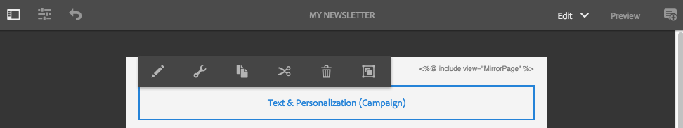

# Werken met Adobe Campaign Classic en Adobe Campaign Standard{#working-with-adobe-campaign-classic-and-adobe-campaign-standard}

U kunt e-mailinhoud maken in AEM en deze verwerken in Adobe Campaign-e-mails. Daartoe moet u:

1. Maak een nieuwsbrief in AEM van een Adobe Campaign-specifieke sjabloon.
1. Selecteer [ de dienst van Adobe Campaign ](#selecting-the-adobe-campaign-cloud-service-and-template) alvorens de inhoud uit te geven om tot alle functionaliteit toegang te hebben.
1. Bewerk de inhoud.
1. Valideer de inhoud.

Inhoud kan vervolgens worden gesynchroniseerd met een levering in Adobe Campaign. In dit document worden gedetailleerde instructies beschreven.

Zie ook [ Creërend Adobe Campaign Forms in AEM ](/help/sites-authoring/adobe-campaign-forms.md).

>[!NOTE]
>
>Alvorens u deze functionaliteit kunt gebruiken, moet u AEM vormen om met of [ Adobe Campaign ](/help/sites-administering/campaignonpremise.md) of [ Adobe Campaign Standard ](/help/sites-administering/campaignstandard.md) te integreren.

## E-mailinhoud verzenden via Adobe Campaign {#sending-email-content-via-adobe-campaign}

Nadat u AEM en Adobe Campaign hebt geconfigureerd, kunt u rechtstreeks in AEM inhoud voor e-maillevering maken en deze vervolgens in Adobe Campaign verwerken.

Wanneer u Adobe Campaign-inhoud maakt in AEM, moet u een koppeling maken naar een Adobe Campaign-service voordat u de inhoud bewerkt, zodat u toegang hebt tot alle functies.

Er zijn twee mogelijke gevallen:

* Inhoud kan worden gesynchroniseerd met een levering vanuit Adobe Campaign. Hiermee kunt u AEM inhoud in een levering gebruiken.
* (Alleen Adobe Campaign Classic) De inhoud kan rechtstreeks naar Adobe Campaign worden verzonden, waardoor automatisch een nieuwe e-maillevering wordt gegenereerd. Deze modus heeft beperkingen.

In dit document worden gedetailleerde instructies beschreven.

### Nieuwe e-mailinhoud maken {#creating-new-email-content}

>[!NOTE]
>
>Wanneer u e-mailsjablonen toevoegt, moet u deze toevoegen onder **/content/campagnes** om ze beschikbaar te maken.

#### Nieuwe e-mailinhoud maken {#creating-new-email-content-1}

1. In AEM uitgezochte **dan** Plaatsen **, doorblader aan waar uw e-mailcampagnes worden geleid.** In het volgende voorbeeld, is de weg **Plaatsen** > **Campagnes** > **Geometrixx Outdoors** > **E-mailcampagnes**.

   >[!NOTE]
   >
   >[ E-mailsteekproeven zijn slechts beschikbaar in Geometrixx ](/help/sites-developing/we-retail.md). Download voorbeeldinhoud van het Geometrixx van het Pakket Delen.

   

1. Selecteer **creëren** toen **Pagina** creëren.
1. Selecteer één van de beschikbare malplaatjes specifiek waarmet Adobe Campaign u verbindt, dan klik **daarna**. Er zijn standaard drie sjablonen beschikbaar:

   * **E-mail van Adobe Campaign Classic**: laat u inhoud aan een vooraf bepaald malplaatje (twee kolommen) toevoegen alvorens het naar Adobe Campaign Classic voor levering te verzenden.
   * **E-mail van Adobe Campaign Standard**: laat u inhoud aan een vooraf bepaald malplaatje (twee kolommen) toevoegen alvorens het naar Adobe Campaign Standard voor levering te verzenden.

1. Vul de **Titel** en naar keuze de **Beschrijving** in en klik **creeer**. De titel wordt gebruikt als het onderwerp van de nieuwsbrief/e-mail, tenzij u deze overschrijft tijdens het bewerken van de e-mail.

### De Adobe Campaign-cloudservice en -sjabloon selecteren {#selecting-the-adobe-campaign-cloud-service-and-template}

Voor integratie met Adobe Campaign moet u een Adobe Campaign-cloudservice aan de pagina toevoegen. Zo hebt u toegang tot personalisatie en andere Adobe Campaign-gegevens.

Daarnaast moet u mogelijk ook de Adobe Campaign-sjabloon selecteren en het onderwerp wijzigen en onbewerkte tekstinhoud toevoegen voor gebruikers die het e-mailbericht niet in HTML zullen bekijken.

U kunt de wolkendienst of van het **lusje van Plaatsen** of van binnen e-mail/nieuwsbrief selecteren nadat u het hebt gecreeerd.

Het selecteren van de wolkendienst van het **lusje van Plaatsen** is de geadviseerde benadering. Voor het selecteren van de cloudservice in de e-mail/nieuwsbrief is een oplossing nodig.

Van de **pagina van Plaatsen**:

1. In AEM selecteer de e-mailpagina en klik **Eigenschappen van de Mening**.

   

1. Selecteer **uitgeven** en dan de **Diensten van de Wolk** tabel en scrol neer aan de bodem en klik + teken om een configuratie toe te voegen en dan **Adobe Campaign** te selecteren.

   

1. Selecteer de configuratie die uw instantie van Adobe Campaign van de drop-down lijst aanpast, dan bevestig door **te klikken sparen**.
1. U kunt het malplaatje bekijken dat e-mail op het heeft toegepast door **Adobe Campaign** tabel te klikken. Als u een andere sjabloon wilt selecteren, hebt u tijdens het bewerken toegang tot de sjabloon in de e-mail.

   Als u een specifiek malplaatje van de e-maillevering (van Adobe Campaign), buiten het standaard e-mailmalplaatje, in **Eigenschappen** zou willen toepassen, selecteer **Adobe Campaign** tabel. Voer de interne naam van de e-mailleveringssjabloon in het gerelateerde Adobe Campaign-exemplaar in.

   Welke sjabloon u selecteert, bepaalt welke aanpassingsvelden beschikbaar zijn in Adobe Campaign.

   

Van binnen nieuwsbrief/e-mail in ontwerp, zou u niet de configuratie van de de wolkendienst van Adobe Campaign in **Eigenschappen van de Pagina** wegens een lay-outkwestie kunnen kunnen selecteren. U kunt de hier beschreven tijdelijke oplossing gebruiken:

1. In AEM selecteer de e-mailpagina en klik **uitgeven**. Klik **Open Eigenschappen**.

   

1. Selecteer **de diensten van de Wolk** en klik **+** om een configuratie toe te voegen. Selecteer om het even welke zichtbare configuratie (maakt niet uit welke). Klik **+** teken om een andere configuratie toe te voegen en dan **Adobe Campaign** te selecteren.

   >[!NOTE]
   >
   >Alternatief, kunt u de wolkendiensten selecteren door **Eigenschappen van de Mening** in de **Plaatsen** tabel te selecteren.

1. Selecteer in de vervolgkeuzelijst de configuratie die overeenkomt met uw Adobe Campaign-instantie, verwijder de eerste configuratie die u hebt gemaakt en die niet voor Adobe Campaign was, en bevestig vervolgens door op het vinkje te klikken.
1. Ga verder met stap 4 in de vorige procedure om sjablonen te selecteren en onbewerkte tekst toe te voegen.

### E-mailinhoud bewerken {#editing-email-content}

E-mailinhoud bewerken:

1. Open het e-mailbericht en ga standaard naar de modus Bewerken.

   

1. Als u het onderwerp van e-mail zou willen veranderen of gewone tekst voor die gebruikers toevoegen die niet e-mail in HTML zullen bekijken, **E-mail** selecteren en een onderwerp en tekst toevoegen. Selecteer het paginapictogram om automatisch een versie van normale tekst te genereren op basis van HTML. Klik op het vinkje als u klaar bent.

   U kunt de nieuwsbrief personaliseren door de gebieden van de verpersoonlijking van Adobe Campaign te gebruiken. Als u een verpersoonlijkingsveld wilt toevoegen, opent u de kiezer van het verpersoonlijkingsveld door te klikken op de knop met het Adobe Campaign-logo. Vervolgens kunt u kiezen uit alle velden die beschikbaar zijn voor deze nieuwsbrief.

   >[!NOTE]
   >
   >Als de verpersoonlijkingsgebieden in eigenschappen van binnen de redacteur grayed uit zijn, heronderzoek uw configuratie.

   

1. Open het componentenpaneel op linkerkant van het scherm en selecteer **Nieuwsbrief van Adobe Campaign** van het drop-down menu om die componenten te vinden.

   

1. Sleep componenten rechtstreeks naar de pagina en bewerk ze dienovereenkomstig. Bijvoorbeeld, kunt u a **Tekst &amp; Personalization (Campagne)** component slepen en gepersonaliseerde tekst toevoegen.

   

   Zie {de Componenten van 0} Adobe Campaign [&#128279;](/help/sites-authoring/adobe-campaign-components.md) voor een gedetailleerde beschrijving van elke component.

   

### Personalisatie invoegen {#inserting-personalization}

Wanneer u de inhoud bewerkt, kunt u het volgende invoegen:

* Adobe Campaign-context. Dit zijn gebieden die u binnen uw tekst kunt opnemen die volgens de gegevens van de ontvanger (bijvoorbeeld, voornaam, achternaam, of om het even welke gegevens van de doeldimensie) aanpassen.
* Adobe Campaign-verpersoonlijkingsblokken. Dit zijn blokken vooraf gedefinieerde inhoud die niet gerelateerd zijn aan de gegevens van de ontvanger, zoals een merklogo of een koppeling naar een spiegel.

Zie {de Componenten van 0} Adobe Campaign [&#128279;](/help/sites-authoring/adobe-campaign-components.md) voor een volledige beschrijving van de componenten van de Campagne.

>[!NOTE]
>
>* Slechts worden de gebieden van Adobe Campaign **Profielen** gericht afmeting in aanmerking genomen.
>* Wanneer het bekijken van Eigenschappen van **Plaatsen**, hebt u geen toegang tot de de contextgebieden van Adobe Campaign. U kunt deze rechtstreeks vanuit de e-mail openen tijdens het bewerken.

Personalisatie invoegen:

1. Tussenvoegsel een nieuwe **Nieuwsbrief** > **Tekst &amp; Personalization (Campagne)** component door het op de pagina te slepen.

   

1. Open de component door op het potloodpictogram te klikken. De editor Inplace wordt geopend.

   

   >[!NOTE]
   >
   >**voor Adobe Campaign Standard:**
   >
   >* De beschikbare contextgebieden beantwoorden aan **Profielen** richtend afmeting in Adobe Campaign.
   >* Zie [ Linking een AEM pagina aan een e-mail van Adobe Campaign ](#linking-an-aem-page-to-an-adobe-campaign-email-adobe-campaign-standard).
   >
   >**voor Adobe Campaign Classic:**
   >
   >* De beschikbare contextgebieden worden dynamisch teruggekregen van Adobe Campaign **nms:zaadMember** schema. De gegevens van de doelextensie worden dynamisch hersteld vanuit de workflow die de levering bevat die met de inhoud is gesynchroniseerd. (Zie [ Synchronizing inhoud die in AEM met een levering van Adobe Campaign ](#synchronizing-content-created-in-aem-with-a-delivery-from-adobe-campaign-classic) wordt gecreeerd sectie).
   >
   >* Om verpersoonlijkingselementen toe te voegen of te verbergen, zie [ het Leiden verpersoonlijkingsgebieden en blokken ](/help/sites-administering/campaignonpremise.md#managing-personalization-fields-and-blocks).
   >* **Belangrijk**: Alle gebieden van de zaadlijst moeten ook in de ontvankelijke lijst (of overeenkomstige contactlijst) zijn.

1. Voeg tekst in door te typen. Voeg contextgebieden of verpersoonlijkingsblokken in door de componenten van Adobe Campaign te klikken en hen te selecteren. Selecteer het vinkje als u klaar bent.

   

   Nadat u contextvelden of aanpassingsblokken hebt ingevoegd, kunt u een voorvertoning van uw nieuwsbrief bekijken en uw velden testen. Zie [ Previewing een Bulletin ](#previewing-a-newsletter).

### Een voorvertoning van een nieuwsbrief weergeven {#previewing-a-newsletter}

U kunt voorvertonen hoe de nieuwsbrief eruit zal zien en een voorvertoning van de personalisatie bekijken.

1. Met open nieuwsbrief, klik **Voorproef** in de hogere juiste hoek van AEM. AEM toont hoe de nieuwsbrief kijkt wanneer de gebruikers het ontvangen.

   

   >[!NOTE]
   >
   >Als u Adobe Campaign Standard en het steekproefmalplaatje gebruikt, zullen twee verpersoonlijkingsblokken die aanvankelijke inhoud - **&quot;&lt;%@ include view=&quot;MirrorPage&quot; %>&quot;** en **&quot;&lt;%@ include view=&quot;UnsubscriptionLink&quot; %>&quot;** - tonen fouten wanneer het invoeren van de inhoud tijdens levering. U kunt deze aanpassen door de corresponderende blokken te selecteren met de kiezer voor het aanpassingsblok.

1. Om voorproef de verpersoonlijking, open ContextHub door het overeenkomstige pictogram in de toolbar te klikken of te tikken. De codes van het verpersoonlijkingsgebied worden nu vervangen door de zaadgegevens van de geselecteerde verpersoonlijking. Zie hoe de variabelen aanpassen wanneer het schakelen personas in ContextHub.

   

1. U kunt de zaadgegevens van Adobe Campaign bekijken die aan de momenteel geselecteerde persoon worden geassocieerd. Om dit te doen, klik de module van Adobe Campaign in de bar ContextHub. Hiermee wordt een dialoogvenster geopend waarin alle zaadgegevens van het huidige profiel worden weergegeven. De gegevens worden opnieuw aangepast wanneer naar een andere persoon wordt overgeschakeld.

   

### Inhoud in AEM goedkeuren {#approving-content-in-aem}

Nadat de inhoud is voltooid, kunt u het goedkeuringsproces starten. Ga naar het **lusje van het Werkschema** van toolbox en selecteer **goedkeuren voor het werkschema van Adobe Campaign**.

Deze out-of-the-box werkstroom heeft twee stappen: revisie dan goedkeuring, of revisie dan verwerping. Deze workflow kan echter worden uitgebreid en aangepast aan een complexer proces.

Om inhoud voor Adobe Campaign goed te keuren, pas het werkschema toe door **Werkschema** te selecteren en **te selecteren keur voor Adobe Campaign** goed en klik **Werkschema van het Begin**. Doorloop de stappen en keur de inhoud goed. U kunt de inhoud ook verwerpen door **te selecteren verwerp** in plaats van **&#x200B;**&#x200B;in de laatste werkschemastap goedkeuren.

Nadat de inhoud is goedgekeurd, wordt deze weergegeven als goedgekeurd in Adobe Campaign. Het e-mailbericht kan vervolgens worden verzonden.

In Adobe Campaign Standard:

In Adobe Campaign Classic:

>[!NOTE]
>
>Niet-goedgekeurde inhoud kan worden gesynchroniseerd met een levering in Adobe Campaign, maar de levering kan niet worden uitgevoerd. Alleen goedgekeurde inhoud kan via campagneleveringen worden verzonden.

## AEM met Adobe Campaign Standard en Adobe Campaign Classic {#linking-aem-with-adobe-campaign-standard-and-adobe-campaign-classic}

Hoe u AEM met Adobe Campaign koppelt of synchroniseert, hangt af van het feit of u Adobe Campaign Standard op abonnementsbasis of Adobe Campaign Classic op locatie gebruikt.

Zie de volgende secties voor instructies die op uw oplossing van Adobe Campaign worden gebaseerd:

* [Een AEM pagina koppelen aan een Adobe Campaign-e-mail (Adobe Campaign Standard)](#linking-an-aem-page-to-an-adobe-campaign-email-adobe-campaign-standard)
* [In AEM gemaakte inhoud synchroniseren met een levering vanuit Adobe Campaign Classic](#synchronizing-content-created-in-aem-with-a-delivery-from-adobe-campaign-classic)

### Een AEM pagina koppelen aan een Adobe Campaign-e-mail (Adobe Campaign Standard) {#linking-an-aem-page-to-an-adobe-campaign-email-adobe-campaign-standard}

Met Adobe Campaign Standard kunt u inhoud die is gemaakt in AEM herstellen en koppelen met:

* Een e-mail.
* Een e-mailsjabloon.

Zo kunt u de inhoud leveren. U ziet of een nieuwsbrief met één enkele levering door de code verbonden is die op de pagina toont.

>[!NOTE]
>
>Als een nieuwsbrief aan verscheidene leveringen wordt verbonden, het aantal verbonden leveringen (maar niet elke identiteitskaart wordt getoond).

Een pagina die is gemaakt in AEM koppelen aan een e-mailbericht van Adobe Campaign:

1. Maak een e-mailbericht op basis van een AEM-specifieke e-mailsjabloon. Verwijs naar [ Creërend e-mails in Adobe Campaign Standard ](https://helpx.adobe.com/campaign/standard/channels/using/creating-an-email.html) voor meer informatie.

   

1. Open het **blok van de Inhoud** van het leveringsdashboard.

   

1. Selecteer **Verbinding met een inhoud van Adobe Experience Manager** in de toolbar om tot de lijst van inhoud toegang te hebben beschikbaar in AEM.

   >[!NOTE]
   >
   >Als de **Verbinding met een Adobe Experience Manager** optie niet op de actiebar verschijnt, controleer dat de **Inhoud het uitgeven wijze** correct wordt gevormd geplaatst aan **Adobe Experience Manager** in de e-maileigenschappen.

   

1. Selecteer de inhoud die u in uw e-mail wilt gebruiken.

   In deze lijst worden opgegeven:

   * Het label van de inhoud in AEM.
   * De goedkeuringsstatus van de inhoud in AEM. Als de inhoud niet is goedgekeurd, kunt u de inhoud synchroniseren, maar moet deze worden goedgekeurd voordat de levering wordt verzonden. U kunt echter bepaalde bewerkingen uitvoeren, zoals het verzenden van een proefdruk of de voorbeeldtest.
   * De datum van de laatste wijziging van de inhoud.
   * Alle inhoud die al aan een levering is gekoppeld.

   >[!NOTE]
   >
   >Standaard is de inhoud die al met een levering is gesynchroniseerd, verborgen. U kunt deze echter wel weergeven en gebruiken. Als u bijvoorbeeld inhoud wilt gebruiken als een sjabloon voor meerdere leveringen.

   Als het e-mailbericht is gekoppeld aan AEM inhoud, kan de inhoud niet worden bewerkt in Adobe Campaign.

1. Geef de andere parameters van de e-mail op vanaf het dashboard (publiek, uitvoeringsschema).
1. Voer de e-maillevering uit. Tijdens de leveringsanalyse, wordt de meest bijgewerkte versie van de AEM inhoud teruggewonnen.

   >[!NOTE]
   >
   >Als de inhoud in AEM wordt bijgewerkt terwijl deze aan een e-mailbericht is gekoppeld, wordt deze tijdens de analyse automatisch bijgewerkt in Adobe Campaign. De synchronisatie kan ook manueel worden uitgevoerd gebruikend **verfrist de inhoud van Adobe Experience Manager** van de bar van de inhoudsactie.
   >
   >U kunt het verband tussen een e-mail en AEM inhoud annuleren gebruikend **Schrap de verbinding met de inhoud van Adobe Experience Manager** van de bar van de inhoudsactie. Deze knop is alleen beschikbaar als de inhoud al is gekoppeld aan de levering. Als u een andere inhoud aan een levering wilt koppelen, moet u de huidige inhoudskoppeling verwijderen voordat u een nieuwe koppeling kunt maken.
   >
   >Wanneer de koppeling wordt verwijderd, wordt de lokale inhoud bewaard en bewerkbaar in Adobe Campaign. Als u de inhoud opnieuw koppelt nadat u deze hebt gewijzigd, gaan alle wijzigingen verloren.

### In AEM gemaakte inhoud synchroniseren met een levering vanuit Adobe Campaign Classic {#synchronizing-content-created-in-aem-with-a-delivery-from-adobe-campaign-classic}

Met Adobe Campaign kunt u inhoud die is gemaakt AEM met:

* Een campagnelevering
* Een leveringsactiviteit in een campagnewerkstroom
* Een terugkerende levering
* Ononderbroken levering
* Een levering in het Berichtencentrum
* Een leveringssjabloon

Als een nieuwsbrief AEM is gekoppeld aan één levering, wordt de leveringscode weergegeven op de pagina.

>[!NOTE]
>
>Als de nieuwsbrief aan verscheidene leveringen wordt gekoppeld, het aantal verbonden leveringen (maar niet elke identiteitskaart wordt getoond).
>
>[!NOTE]
>
>De stap van het Werkschema **Publish aan Adobe Campaign** wordt afgekeurd in AEM 6.1. Deze stap maakte deel uit van de integratie van AEM 6.0 met Adobe Campaign en is niet langer nodig.

In AEM gemaakte inhoud synchroniseren met een levering vanuit Adobe Campaign:

1. Creeer een levering of voeg een leveringsactiviteit aan een campagnewerkschema toe door de **E-maillevering met AEM inhoud (mailAEMContent) te selecteren** leveringsmalplaatje.

   

1. Selecteer **Synchroniseer** in de toolbar om tot de lijst van inhoud toegang te hebben beschikbaar in AEM.

   >[!NOTE]
   >
   >Als de **Synchroniseer** optie niet op de toolbar van de levering verschijnt, controleer dat het **Inhoud het uitgeven van wijze** gebied correct in **AEM** door **Eigenschappen** te selecteren > **Geavanceerd** wordt gevormd.

   

1. Selecteer de inhoud die u met uw levering wilt synchroniseren.

   In deze lijst worden opgegeven:

   * Het label van de inhoud in AEM.
   * De goedkeuringsstatus van de inhoud in AEM. Als de inhoud niet is goedgekeurd, kunt u de inhoud synchroniseren, maar moet deze worden goedgekeurd voordat de levering wordt verzonden. U kunt echter bepaalde bewerkingen uitvoeren, zoals het verzenden van een BAT of de voorvertoningstest.
   * De datum van de laatste wijziging in de inhoud.
   * Alle inhoud die al aan een levering is gekoppeld.

   >[!NOTE]
   >
   >Standaard is de inhoud die al met een levering is gesynchroniseerd, verborgen. U kunt deze echter wel weergeven en gebruiken. Als u bijvoorbeeld inhoud wilt gebruiken als een sjabloon voor meerdere leveringen.

   

1. Geef de andere parameters van de levering op (doel, enzovoort)
1. Start zo nodig het goedkeuringsproces voor de levering in Adobe Campaign. De goedkeuring van inhoud in AEM is noodzakelijk naast goedkeuringen die in Adobe Campaign worden gevormd (begroting, doel, etc.). Goedkeuring van inhoud in Adobe Campaign is alleen mogelijk als de inhoud al is goedgekeurd in AEM.
1. Voer de levering uit. Tijdens de leveringsanalyse, wordt de meest bijgewerkte versie van de AEM inhoud teruggewonnen.

   >[!NOTE]
   >
   >* Nadat de levering en de inhoud zijn gesynchroniseerd, wordt de leveringsinhoud in Adobe Campaign alleen-lezen. Het onderwerp en de inhoud van de e-mail kunnen niet meer worden gewijzigd.
   >* Als de inhoud in AEM wordt bijgewerkt terwijl deze aan een levering in Adobe Campaign is gekoppeld, wordt deze tijdens de leveringsanalyse automatisch bijgewerkt in de levering. De synchronisatie kan ook manueel worden uitgevoerd gebruikend **verfrist inhoud nu** knoop.
   >* U kunt synchronisatie tussen een levering en AEM inhoud annuleren gebruikend **desynchronize** knoop. Dit is alleen beschikbaar als de inhoud al is gesynchroniseerd met de levering. Als u andere inhoud wilt synchroniseren met een levering, moet u de huidige inhoudssynchronisatie annuleren voordat u een nieuwe koppeling kunt maken.
   >* Als de synchronisatie van de lokale inhoud is opgeheven, wordt de lokale inhoud bewaard en wordt deze bewerkbaar in Adobe Campaign. Als u de inhoud opnieuw synchroniseert nadat u deze hebt gewijzigd, gaan alle wijzigingen verloren.
   >* Voor terugkomende en ononderbroken leveringen wordt synchronisatie met AEM inhoud gestopt telkens wanneer de levering wordt uitgevoerd.
