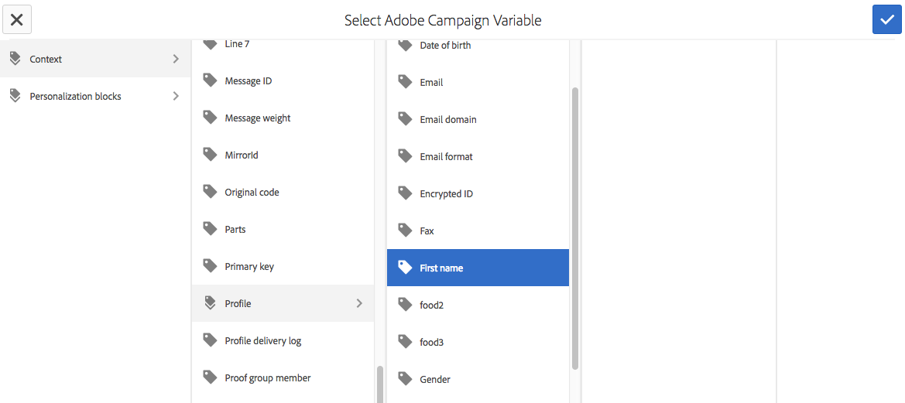
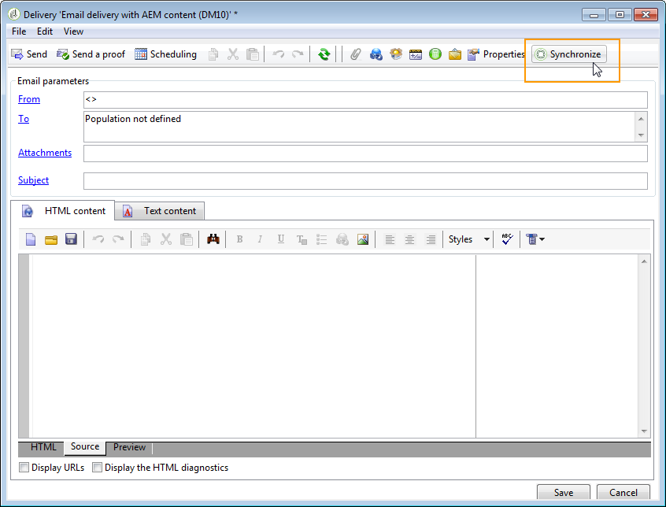

# Werken met Adobe Campagne Classic en Adobe Campagne Standard{#working-with-adobe-campaign-classic-and-adobe-campaign-standard}

U kunt e-mailinhoud maken in AEM en deze verwerken in e-mails voor Adobe Campagne. Daartoe moet u:

1. Maak een nieuwe nieuwsbrief in AEM van een specifieke sjabloon voor Adobe Campagne.
1. Selecteer [een Adobe Campagne-service](#selecting-the-adobe-campaign-cloud-service-and-template) voordat u de inhoud gaat bewerken om toegang te krijgen tot alle functies.
1. Bewerk de inhoud.
1. Valideer de inhoud.

Inhoud kan vervolgens worden gesynchroniseerd met een levering in Adobe Campaign. In dit document worden gedetailleerde instructies beschreven.

Zie ook Adobe Campagne Forms [maken in AEM](/help/sites-authoring/adobe-campaign-forms.md).

>[!NOTE]
>
>Voordat u deze functionaliteit kunt gebruiken, moet u AEM zodanig configureren dat deze kan worden geïntegreerd met [Adobe Campaign](/help/sites-administering/campaignonpremise.md) of [Adobe Campaign Standard](/help/sites-administering/campaignstandard.md).

## E-mailinhoud verzenden via Adobe-campagne {#sending-email-content-via-adobe-campaign}

Nadat u AEM en de Campagne van Adobe vormt, kunt u e-mailleveringsinhoud direct in AEM tot stand brengen en het dan in de Campagne van Adobe verwerken.

Wanneer u Adobe Campagne-inhoud maakt in AEM, moet u een koppeling maken naar een Adobe Campagne-service voordat u de inhoud kunt bewerken om toegang te krijgen tot alle functies.

Er zijn twee mogelijke gevallen:

* Inhoud kan worden gesynchroniseerd met een levering vanuit Adobe Campaign. Op deze manier kunt u AEM-inhoud in een levering gebruiken.
* (Alleen Adobe Campaign Classic) De inhoud kan rechtstreeks naar Adobe Campaign worden verzonden, waardoor automatisch een nieuwe e-maillevering wordt gegenereerd. Deze modus heeft beperkingen.

In dit document worden gedetailleerde instructies beschreven.

### Nieuwe e-mailinhoud maken {#creating-new-email-content}

>[!NOTE]
>
>Als u e-mailsjablonen toevoegt, moet u deze toevoegen onder **/inhoud/campagnes** om ze beschikbaar te maken.

#### Nieuwe e-mailinhoud maken {#creating-new-email-content-1}

1. Selecteer in AEM eerst **Sites** en vervolgens **Campagnes** en blader naar de locatie waar uw e-mailcampagnes worden beheerd. In het volgende voorbeeld is het pad **Sites** > **Campagnes** > **Geometrixx Outdoor** > **E-mailcampagnes**.

   >[!NOTE]
   >
   >[E-mailvoorbeelden zijn alleen beschikbaar in Geometrixx](/help/sites-developing/we-retail.md). Download voorbeeldinhoud van Geometrixx uit Pakket delen.

   

1. Selecteer **Maken** en **Pagina** maken.
1. Selecteer een van de beschikbare sjablonen die specifiek zijn voor de Adobe-campagne waarmee u verbinding maakt en klik op **Volgende**. Er zijn standaard drie sjablonen beschikbaar:

   * **Klassieke e-mail** voor Adobe Campaign: Hiermee kunt u inhoud toevoegen aan een vooraf gedefinieerde sjabloon (twee kolommen) voordat u deze naar Adobe Campagne Classic verzendt voor levering.
   * **Standaard-e-mail** voor Adobe-campagne: Hiermee kunt u inhoud toevoegen aan een vooraf gedefinieerde sjabloon (twee kolommen) voordat u deze naar Adobe Campagnestandaard verzendt voor levering.

1. Vul de **Titel** en eventueel de **Beschrijving** in en klik **creëren**. De titel wordt gebruikt als het onderwerp van de nieuwsbrief/e-mail, tenzij u deze overschrijft tijdens het bewerken van de e-mail.

### De cloudservice en sjabloon voor Adobe Campagne selecteren {#selecting-the-adobe-campaign-cloud-service-and-template}

Voor integratie met Adobe Campaign moet u een Adobe Campagne-cloudservice aan de pagina toevoegen. Zo hebt u toegang tot personalisatie en andere informatie over Adobe Campagne.

Daarnaast moet u mogelijk ook de Adobe Campagne-sjabloon selecteren en het onderwerp wijzigen en onbewerkte tekstinhoud toevoegen voor gebruikers die de e-mail niet in HTML zullen weergeven.

U kunt de cloudservice selecteren op het tabblad **Sites** of vanuit de e-mail/nieuwsbrief nadat u deze hebt gemaakt.

U kunt het beste de cloudservice selecteren op het tabblad **Sites** . Voor het selecteren van de cloudservice in de e-mail/nieuwsbrief is een oplossing nodig.

Van de **pagina van Plaatsen** :

1. Selecteer de e-mailpagina in AEM en klik op Eigenschappen **** weergeven.

   

1. Selecteer **Bewerken** en vervolgens het tabblad **Cloudservices** . Blader omlaag naar de onderkant en klik op het plusteken (+) om een configuratie toe te voegen en selecteer vervolgens **Adobe Campagne**.

   

1. Selecteer in de vervolgkeuzelijst de configuratie die overeenkomt met uw Adobe Campagne-instantie en klik op **Opslaan**.
1. U kunt de sjabloon bekijken die door het e-mailbericht op het tabblad** Adobe Campagne** is toegepast. Als u een andere sjabloon wilt selecteren, hebt u tijdens het bewerken toegang tot de sjabloon in de e-mail.

   Als u in **Eigenschappen** een specifieke sjabloon voor het verzenden van e-mail (vanuit Adobe Campaign) wilt toepassen, die niet de standaardsjabloon voor e-mail is, selecteert u het tabblad **Adobe Campagne** . Voer de interne naam van de sjabloon voor e-maillevering in het verwante Adobe Campagne-exemplaar in.

   Welke sjabloon u selecteert, bepaalt welke aanpassingsvelden beschikbaar zijn in Adobe Campagne.

   

Vanuit de nieuwsbrief/e-mail in de ontwerpfase kunt u mogelijk de configuratie van de Adobe Campagne-wolkenservice in **Pagina-eigenschappen** niet selecteren vanwege een lay-outprobleem. U kunt de hier beschreven tijdelijke oplossing gebruiken:

1. Selecteer de e-mailpagina in AEM en klik op **Bewerken**. Klik op Eigenschappen **** openen.

   

1. Selecteer **Cloud-services** en klik op **+** om een configuratie toe te voegen. Selecteer om het even welke zichtbare configuratie (maakt niet uit welke). Klik of tik op het **+** -teken om een andere configuratie toe te voegen en selecteer vervolgens **Adobe Campagne**.

   >[!NOTE]
   >
   >U kunt ook de cloudservices selecteren door Eigenschappen **** weergeven te selecteren op het tabblad **Sites** .

1. Selecteer in de vervolgkeuzelijst de configuratie die overeenkomt met uw Adobe Campagne-instantie, verwijder de eerste configuratie die u hebt gemaakt en die niet voor Adobe Campagne was, en bevestig vervolgens door op het vinkje te klikken.
1. Ga verder met stap 4 in de vorige procedure om sjablonen te selecteren en onbewerkte tekst toe te voegen.

### E-mailinhoud bewerken {#editing-email-content}

E-mailinhoud bewerken:

1. Open het e-mailbericht en ga standaard naar de modus Bewerken.

   

1. Als u het onderwerp van de e-mail wilt wijzigen of onbewerkte tekst wilt toevoegen voor gebruikers die de e-mail niet in HTML zullen weergeven, selecteert u **E-mail** en voegt u een onderwerp en tekst toe. Selecteer het paginapictogram om automatisch een versie van onbewerkte tekst te genereren vanuit HTML. Klik op het vinkje als u klaar bent.

   U kunt de nieuwsbrief personaliseren door de gebieden van de Aanpassing van de Campagne van Adobe te gebruiken. Als u een verpersoonlijkingsveld wilt toevoegen, opent u de kiezer van het verpersoonlijkingsveld door te klikken op de knop met het Adobe Campagne-logo. Vervolgens kunt u kiezen uit alle velden die beschikbaar zijn voor deze nieuwsbrief.

   >[!NOTE]
   >
   >Als de verpersoonlijkingsgebieden in eigenschappen van binnen de redacteur grayed zijn, gelieve uw configuratie opnieuw te onderzoeken.

   

1. Open het deelvenster Componenten aan de linkerkant van het scherm en selecteer **Adobe Campagne Newsletter** in het keuzemenu om die componenten te zoeken.

   

1. Sleep componenten rechtstreeks naar de pagina en bewerk ze dienovereenkomstig. U kunt bijvoorbeeld een component **Tekst en personalisatie (Campagne)** slepen en gepersonaliseerde tekst toevoegen.

   

   Zie [Adobe Campagne Components](/help/sites-authoring/adobe-campaign-components.md) voor een gedetailleerde beschrijving van elke component.

   

### Personalisatie invoegen {#inserting-personalization}

Wanneer u de inhoud bewerkt, kunt u het volgende invoegen:

* Contextvelden voor Adobe Campagne. Dit zijn velden die u in de tekst kunt invoegen en die worden aangepast aan de gegevens van de ontvanger (bijvoorbeeld voornaam, achternaam of gegevens van de doeldimensie).
* Aanmaakblokken voor Adobe Campagne. Dit zijn blokken vooraf gedefinieerde inhoud die niet gerelateerd zijn aan de gegevens van de ontvanger, zoals een merklogo of een koppeling naar een spiegel.

Zie [Adobe Campagne Components](/help/sites-authoring/adobe-campaign-components.md) voor een volledige beschrijving van de campagnecomponenten.

>[!NOTE]
>
>* Alleen de velden van de Adobe Campagne **Profiles** voor dimensie worden in aanmerking genomen.
>* Wanneer u Eigenschappen van **sites** weergeeft, hebt u geen toegang tot de contextvelden van Adobe Campagne. U kunt deze rechtstreeks vanuit de e-mail openen tijdens het bewerken.
>

Personalisatie invoegen:

1. Voeg een nieuwe **component Newsletter** > **Tekst en personalisatie (Campagne)** in door het op de pagina te slepen.

   

1. Open de component door op het potloodpictogram te klikken. De editor Inplace wordt geopend.

   

   >[!NOTE]
   >
   >**Voor Adobe Campaign Standard:**
   >
   >* Beschikbare contextvelden komen overeen met de doeldimensie van de **profielen** in Adobe-campagne.
   >* Zie Een AEM-pagina [koppelen aan een e-mail](#linking-an-aem-page-to-an-adobe-campaign-email-adobe-campaign-standard)voor Adobe Campagne.
   >
   >**Voor Adobe Campaign Classic:**
   >
   >* Beschikbare contextvelden worden dynamisch hersteld via het **schema Adobe Campagne nms:seedMember** . De gegevens van de doelextensie worden dynamisch hersteld vanuit de workflow die de levering bevat die met de inhoud is gesynchroniseerd. (Zie de [Synchronizing content die in AEM is gemaakt met een levering vanuit de sectie Adobe Campagne](#synchronizing-content-created-in-aem-with-a-delivery-from-adobe-campaign-classic) .)
      >
      >
   * Om verpersoonlijkingselementen toe te voegen of te verbergen, zie het [Leiden verpersoonlijkingsgebieden en blokken](/help/sites-administering/campaignonpremise.md#managing-personalization-fields-and-blocks).
   >* **Belangrijk**: Alle velden voor zaadtabellen moeten ook in de ontvangende tabel (of de overeenkomstige contacttabel) staan.

1. Voeg tekst in door te typen. Voeg contextgebieden of verpersoonlijkingsblokken in door de componenten van de Campagne van Adobe te klikken en hen te selecteren. Selecteer het vinkje als u klaar bent.

   

   Nadat u contextvelden of aanpassingsblokken hebt ingevoegd, kunt u een voorvertoning van uw nieuwsbrief bekijken en uw velden testen. Zie Een [nieuwsbrief](#previewing-a-newsletter)voorvertonen.

### Een voorvertoning van een nieuwsbrief weergeven {#previewing-a-newsletter}

U kunt een voorvertoning weergeven van de weergave van de nieuwsbrief en een voorvertoning van de personalisatie.

1. Open de nieuwsbrief en klik op **Voorvertoning** in de rechterbovenhoek van AEM. AEM toont hoe de nieuwsbrief kijkt wanneer de gebruikers het ontvangen.

   

   >[!NOTE]
   >
   >Als u Adobe Campagne Standard gebruikt en de voorbeeldsjabloon gebruikt, zullen twee verpersoonlijkingsblokken met initiële inhoud - **&quot;&lt;%@ include view=&quot;MirrorPage&quot; %>&quot;** en **&quot;&lt;%@ include view=&quot;UnsubscriptionLink&quot; %>&quot;** - fouten genereren bij het importeren van de inhoud tijdens de levering. U kunt deze aanpassen door de corresponderende blokken te selecteren met de kiezer voor het aanpassingsblok.

1. Om voorproef de verpersoonlijking, open ContextHub door het overeenkomstige pictogram in de toolbar te klikken of te tikken. De codes van het verpersoonlijkingsgebied worden nu vervangen door de zaadgegevens van de geselecteerde verpersoonlijking. Zie hoe de variabelen aanpassen wanneer het schakelen personas in ContextHub.

   

1. U kunt de zaadgegevens van de Campagne van Adobe bekijken die met momenteel geselecteerde persoon wordt geassocieerd. Om dit te doen, klik/tik de module van de Campagne van Adobe in de bar ContextHub. Hiermee wordt een dialoogvenster geopend waarin alle zaadgegevens van het huidige profiel worden weergegeven. De gegevens worden opnieuw aangepast wanneer naar een andere persoon wordt overgeschakeld.

   

### Inhoud goedkeuren in AEM {#approving-content-in-aem}

Nadat de inhoud is voltooid, kunt u het goedkeuringsproces starten. Ga naar het tabblad **Workflow** van de gereedschapset en selecteer de workflow **Goedkeuren voor Adobe-campagne** .

Deze out-of-the-box workflow bestaat uit twee stappen: herziening dan goedkeuring, of herziening dan verwerping. Deze workflow kan echter worden uitgebreid en aangepast aan een complexer proces.

Als u inhoud voor Adobe Campaign wilt goedkeuren, past u de workflow toe door **Workflow** te selecteren, **Goedkeuren voor Adobe Campagne** te selecteren en op Workflow **** starten te klikken. Doorloop de stappen en keur de inhoud goed. U kunt de inhoud ook afwijzen door **Afwijzen** te selecteren in plaats van **Goedkeuren** in de laatste workflowstap.

Nadat de inhoud is goedgekeurd, wordt deze weergegeven als goedgekeurd in Adobe Campaign. Het e-mailbericht kan vervolgens worden verzonden.

In Adobe Campaign Standard:

In Adobe Campaign Classic:

>[!NOTE]
Niet-goedgekeurde inhoud kan worden gesynchroniseerd met een levering in Adobe Campaign, maar de levering kan niet worden uitgevoerd. Alleen goedgekeurde inhoud kan via campagneleveringen worden verzonden.

## AEM koppelen met Adobe Campaign Standard en Adobe Campaign Classic {#linking-aem-with-adobe-campaign-standard-and-adobe-campaign-classic}

Hoe u AEM koppelt of synchroniseert met Adobe Campaign, hangt af van het feit of u Adobe Campaign Standard met abonnement of Adobe Campaign Classic op locatie gebruikt.

Zie de volgende secties voor instructies die op uw oplossing van de Campagne van Adobe worden gebaseerd:

* [Een AEM-pagina koppelen aan een Adobe Campagne-e-mail (Adobe Campaign Standard)](#linking-an-aem-page-to-an-adobe-campaign-email-adobe-campaign-standard)
* [In AEM gemaakte inhoud synchroniseren met een levering vanuit Adobe Campagne Classic](#synchronizing-content-created-in-aem-with-a-delivery-from-adobe-campaign-classic)

### Een AEM-pagina koppelen aan een e-mailbericht voor Adobe Campagne (Adobe Campagne Standard) {#linking-an-aem-page-to-an-adobe-campaign-email-adobe-campaign-standard}

Met Adobe Campaign Standard kunt u in AEM gemaakte inhoud herstellen en koppelen met:

* Een e-mail.
* Een e-mailsjabloon.

Zo kunt u de inhoud leveren. U ziet of een nieuwsbrief met één enkele levering door de code verbonden is die op de pagina toont.

>[!NOTE]
Als een nieuwsbrief aan verscheidene leveringen wordt verbonden, het aantal verbonden leveringen (maar niet elke identiteitskaart wordt getoond).

Een pagina die in AEM is gemaakt, koppelen aan een e-mail van Adobe Campaign:

1. Maak een nieuw e-mailbericht op basis van een AEM-specifieke e-mailsjabloon. Zie E-mails [maken in Adobe Campagnestandaard](https://helpx.adobe.com/campaign/standard/channels/using/creating-an-email.html) voor meer informatie.

   

1. Open het blok **Inhoud** vanaf het leveringsdashboard.

   

1. Selecteer **Koppelen met Adobe Experience Manager-inhoud** op de werkbalk voor toegang tot de inhoudslijst in AEM.

   >[!NOTE]
   Als de optie **Koppelen met een Adobe Experience Manager** niet wordt weergegeven op de actiebalk, controleert u of de modus **** Inhoud bewerken correct is ingesteld op **Adobe Experience Manager** in de e-maileigenschappen.

   

1. Selecteer de inhoud die u in uw e-mail wilt gebruiken.

   In deze lijst worden opgegeven:

   * Het label van de inhoud in AEM.
   * De goedkeuringsstatus van de inhoud in AEM. Als de inhoud niet is goedgekeurd, kunt u de inhoud synchroniseren, maar moet deze worden goedgekeurd voordat de levering wordt verzonden. U kunt echter bepaalde bewerkingen uitvoeren, zoals het verzenden van een proefdruk of de voorbeeldtest.
   * De datum van de laatste wijziging van de inhoud.
   * Alle inhoud die al aan een levering is gekoppeld.
   >[!NOTE]
   Standaard is de inhoud die al met een levering is gesynchroniseerd, verborgen. U kunt deze echter wel weergeven en gebruiken. Als u bijvoorbeeld inhoud wilt gebruiken als een sjabloon voor meerdere leveringen.

   Als het e-mailbericht is gekoppeld aan een AEM-inhoud, kan de inhoud niet worden bewerkt in Adobe Campaign.

1. Geef de andere parameters van de e-mail op vanaf het dashboard (publiek, uitvoeringsschema).
1. Voer de e-maillevering uit. Tijdens de leveringsanalyse, wordt de meest bijgewerkte versie van de inhoud AEM teruggewonnen.

   >[!NOTE]
   Als de inhoud in AEM wordt bijgewerkt terwijl deze aan een e-mail is gekoppeld, wordt deze tijdens de analyse automatisch bijgewerkt in Adobe Campaign. De synchronisatie kan ook handmatig worden uitgevoerd met de inhoud **van Adobe Experience Manager** vernieuwen vanaf de actiebalk voor inhoud.
   U kunt de koppeling tussen een e-mail en AEM-inhoud annuleren door de koppeling met de Adobe Experience Manager-inhoud **te** verwijderen op de actiebalk voor inhoud. Deze knop is alleen beschikbaar als de inhoud al is gekoppeld aan de levering. Als u een andere inhoud aan een levering wilt koppelen, moet u de huidige inhoudskoppeling verwijderen voordat u een nieuwe koppeling kunt maken.
   Wanneer de koppeling wordt verwijderd, wordt de lokale inhoud bewaard en wordt deze bewerkbaar in Adobe Campaign. Als u de inhoud opnieuw koppelt nadat u deze hebt gewijzigd, gaan alle wijzigingen verloren.

### In AEM gemaakte inhoud synchroniseren met een levering vanuit Adobe Campagne Classic {#synchronizing-content-created-in-aem-with-a-delivery-from-adobe-campaign-classic}

Met Adobe Campaign kunt u in AEM gemaakte inhoud herstellen en synchroniseren met:

* Een campagnelevering
* Een leveringsactiviteit in een campagnewerkstroom
* Een terugkerende levering
* Ononderbroken levering
* Een levering in het Berichtencentrum
* Een leveringssjabloon

Als een nieuwsbrief in AEM is gekoppeld aan één levering, wordt de leveringscode weergegeven op de pagina.

>[!NOTE]
Als de nieuwsbrief aan verscheidene leveringen wordt gekoppeld, het aantal verbonden leveringen (maar niet elke identiteitskaart wordt getoond).

>[!NOTE]
De workflowstap **Publiceren naar Adobe-campagne** is afgekeurd in AEM 6.1. Deze stap maakte deel uit van de integratie van AEM 6.0 met de Campagne van Adobe en is niet meer noodzakelijk.

In AEM gemaakte inhoud synchroniseren met een levering vanuit Adobe Campaign:

1. Maak een levering of voeg een leveringsactiviteit toe aan een campagnewerkstroom door de leveringssjabloon voor **e-maillevering met AEM-inhoud (mailAEMContent)** te selecteren.

   

1. Selecteer **Synchroniseren** op de werkbalk om de lijst met beschikbare inhoud in AEM te openen.

   >[!NOTE]
   Als de optie **Synchroniseren** niet wordt weergegeven op de werkbalk van de levering, controleert u of het veld **Inhoudsbewerkingsmodus** correct is geconfigureerd in **AEM** door **Eigenschappen** > **Geavanceerd** te selecteren.

   

1. Selecteer de inhoud die u met uw levering wilt synchroniseren.

   In deze lijst worden opgegeven:

   * Het label van de inhoud in AEM.
   * De goedkeuringsstatus van de inhoud in AEM. Als de inhoud niet is goedgekeurd, kunt u de inhoud synchroniseren, maar moet deze worden goedgekeurd voordat de levering wordt verzonden. U kunt echter bepaalde bewerkingen uitvoeren, zoals het verzenden van een BBT of de voorvertoningstest.
   * De datum van de laatste wijziging in de inhoud.
   * Alle inhoud die al aan een levering is gekoppeld.
   >[!NOTE]
   Standaard is de inhoud die al met een levering is gesynchroniseerd, verborgen. U kunt deze echter wel weergeven en gebruiken. Als u bijvoorbeeld inhoud wilt gebruiken als een sjabloon voor meerdere leveringen.

   

1. Geef de andere parameters voor uw levering op (doel, enz.)
1. Start, indien nodig, het goedkeuringsproces voor de levering in Adobe Campagne. U moet de inhoud goedkeuren in AEM, naast goedkeuringen die zijn geconfigureerd in Adobe Campagne (budget, doel, enz.). Goedkeuring van inhoud in Adobe Campaign is alleen mogelijk als de inhoud al is goedgekeurd in AEM.
1. Voer de levering uit. Tijdens de afleveringsanalyse wordt de meest actuele versie van de AEM-inhoud hersteld.

   >[!NOTE]
   * Nadat de levering en de inhoud zijn gesynchroniseerd, wordt de inhoud van de levering in de Campagne van Adobe alleen-lezen. Het onderwerp van de e-mail en de inhoud ervan kunnen niet meer worden gewijzigd.
   * Als de inhoud in AEM wordt bijgewerkt terwijl deze aan een levering in de Campagne van Adobe wordt gekoppeld, wordt de inhoud automatisch bijgewerkt in de levering tijdens de leveringsanalyse. De synchronisatie kan ook handmatig worden uitgevoerd met de knop Inhoud nu **** vernieuwen.
   * U kunt synchronisatie tussen een levering en AEM inhoud annuleren gebruikend de **Desynchronize** knoop. Dit is alleen beschikbaar als de inhoud al is gesynchroniseerd met de levering. Als u andere inhoud wilt synchroniseren met een levering, moet u de huidige inhoudssynchronisatie annuleren voordat u een nieuwe koppeling kunt maken.
   * Als de synchronisatie van de lokale inhoud is opgeheven, wordt deze bewaard en wordt deze bewerkbaar in Adobe Campaign. Als u de inhoud opnieuw synchroniseert nadat u deze hebt gewijzigd, gaan alle wijzigingen verloren.
   * Voor terugkerende en ononderbroken leveringen wordt synchronisatie met AEM-inhoud gestopt telkens wanneer de levering wordt uitgevoerd.

